# Tworzenie aplikacji na dużą skalę za pomocą SwiftUI: Przewodnik po architekturze modułowej

Oryginał: https://azamsharp.com/2023/02/28/building-large-scale-apps-swiftui.html


Architektura oprogramowania jest zawsze tematem gorącej debaty, zwłaszcza gdy jest tak wiele różnych wyborów. Przez ostatnie 8-12 miesięcy eksperymentowałem z wzorcem MV do tworzenia aplikacji klient/serwer i pisałem o tym w moim oryginalnym artykule SwiftUI Architecture - [A Complete Guide to MV Pattern Approach](https://azamsharp.com/2022/10/06/practical-mv-pattern-crud.html). W tym artykule omówię, w jaki sposób można zastosować wzór MV do tworzenia aplikacji klient/serwer na dużą skalę.

*Architektura i wzory zależą od rodzaju aplikacji, którą budujesz. Żadna pojedyncza architektura nie będzie działać we wszystkich scenariuszach. Wybierz najlepszą architekturę odpowiednią dla Twoich potrzeb aplikacji.*

Zarys tego artykułu jest pokazany poniżej:

- Architektura modułowa

- Problemy z MVVM z SwiftUI

- Zrozumienie wzorca MV

- Ekrany a widoki

- Wiele modeli zbiorczych

- Zobacz konkretną logikę

- Uzasadnienie

- Nawigacja

- Wyświetlanie Błędów

- Grupowanie Widok Zdarzeń

- Formatowanie

- Testowanie

## Architektura modułowa

Architektura modułowa w oprogramowaniu odnosi się do projektowania i organizacji systemów oprogramowania w małe, samodzielne moduły lub komponenty. Moduły te mogą być testowane i utrzymywane niezależnie od siebie. Każdy moduł służy określonemu celowi i rozwiązuje określone wymagania biznesowe.

Architektura modułowa zapewnia również korzyści podczas pracy nad dużymi projektami składającymi się z wielu zespołów. Każdy zespół może pracować nad konkretnym modułem, nie przeszkadzając sobie nawzajem.

*Jeśli pracujesz nad modułem, który będzie zużywany lub używany przez inne zespoły, upewnij się, że komunikujesz się z nimi i nie tworzysz modułu w całkowitej izolacji. Wiele problemów w tworzeniu oprogramowania istnieje wyłącznie z powodu braku komunikacji między zespołami.*

Modułowość można osiągnąć na kilka różnych sposobów. Możesz udostępnić każdy moduł jako pakiet (SPM), który można zaimportować do różnych aplikacji. Modułowość można również osiągnąć poprzez ustrukturyzowanie aplikacji w oparciu o określone grupy lub strukturę folderów. Pamiętaj, że korzystając z folderów dla modułowości, musisz zwrócić szczególną uwagę na rozdzielenie obaw i zasady jednej odpowiedzialności.

*Celem tego artykułu nie jest Swift Package Manager, ale jak osiągnąć modułowość poprzez złamanie aplikacji w oparciu o ograniczony kontekst aplikacji. Swift Package Manager może być używany do pakowania tych zależności w moduły wielokrotnego użytku.*

## Problemy z MVVM z SwiftUI

Wzór MVVM wywodzi się z architektury [Presentation Model](https://martinfowler.com/eaaDev/PresentationModel.html), która jest znana jako Application Model dla użytkowników Visual Works Smalltalk. Główną ideą modelu prezentacji jest to, że stan i zachowanie widoku jest wyciągane do własnego modelu. Model prezentacji komunikuje się z warstwą logiki biznesowej i dostarcza dane do widoku. Widok wykonuje dwukierunkową komunikację z modelem prezentacji, w którym dane mogą przepływać z widoku do modelu prezentacji i odwrotnie.

Główną motywacją dla Modelu Prezentacji jest zapewnienie interfejsu do widoku, aby mógł on uzyskać tylko te dane, których potrzebuje, bez bezpośredniego zajmowania się skomplikowaną warstwą logiki biznesowej. Martin Fowler wspomniał, że jedną z irytacji Modelu Prezentacji jest zapisanie kodu synchronizacji (wiązania) między Modelem Prezentacji a widokiem. Zostało to później rozwiązane, gdy Microsoft wprowadził ramy WPF (Windows Presentation Foundation). Windows Presentation Foundation składał się z wbudowanego powiązania między widokiem (XAML) a modelami widoku (C#). Microsoft zaczął nazywać to MVVM (Model View View Model).

W konwencjonalnym wzorcu MVVM, oprócz tworzenia nowego widoku zaprojektowanego do działania jako ekran, odpowiedni model widoku jest również spreparowany równolegle. Rolą modelu widoku jest zarządzanie powiązaniami, obsługa operacji sieciowych (przy użyciu warstwy sieciowej), zarządzanie walidacjami, między innymi zadania. Wyobraź sobie aplikację skoncentrowaną na prezentowaniu listy filmów z interfejsu API, dając użytkownikom możliwość dołączania nowych filmów i prezentowania wyczerpujących szczegółów filmu. Aby zaprojektować taką aplikację przylegającą do wzorca MVVM, możesz skończyć z następującą strukturą.

| View            | View Model           |
| --------------- | -------------------- |
| MovieListView   | MovieListViewModel   |
| AddMovieView    | AddMovieViewModel    |
| MovieDetailView | MovieDetailViewModel |

Każdy widok jest reprezentowany przez własny model widoku. Rozważ aplikację, która składa się z ponad 20 ekranów, otrzymasz ponad 20 modeli widokowych. Typowy model widoku może składać się z kodu sieciowego (poprzez warstwę sieciową), walidacji interfejsu użytkownika i kodu transformacji danych. Każdy z tych modeli widoków jest zgodny z protokołem ObservableObject. Głównym celem protokołu ObservableObject jest zdefiniowanie nowego źródła prawdy. Źródło prawdy jest jednym z najważniejszych pojęć w SwiftUI, ponieważ jest odpowiedzialne za utrzymywanie danych i widoku w synchronizacji. W aplikacji klient/serwer źródłem prawdy jest serwer. Tak więc, jeśli źródło prawdy jest takie samo, dlaczego tworzymy nowe źródło prawd dla każdego widoku, wprowadzając model widoku, dostosowując się do protokołu `ObservableObject`.

*Nie oznacza to, że musisz ograniczyć się tylko do jednego `ObservableObject` lub źródła prawdy dla całej aplikacji. Chociaż z pewnością możesz włączyć wiele `ObservableObjects` do swojej aplikacji, ich wprowadzenie nie powinno być napędzane wyłącznie przez włączenie nowego widoku. Podstawowa motywacja do wprowadzenia nowego `ObservableObject` powinna wynikać z integracji nowego źródła prawdy. Co więcej, zrozumiesz, że zdarzają się przypadki, w których wprowadzasz `ObservableObjects` w oparciu o ograniczony kontekst aplikacji. Jest to omówione w dalszej części tego artykułu.*

Kolejne obawy wynikają z faktu, że w aplikacji klient/serwer większość z tych modeli widoków będzie musiała komunikować się z serwerem. Tak więc, jeśli masz kilkanaście ekranów, a każdemu ekranowi towarzyszy wyznaczony model widoku, oznacza to, że musisz wstrzyknąć warstwę sieciową do każdego z tych modeli widoku przy użyciu zasad wstrzykiwania zależności. Może to skutkować następującymi implementacjami:

```swift
struct MoviesApp: App {
    var body: some Scene {
        // httpClient can take HTTPClientProtocol 
        MovieListView(vm: MovieListViewModel(httpClient: HTTPClient()))
    }
}
```

`MovieListView` zależy od `MovieListViewModel`, który zależy od `HTTPClient`. Głównym problemem nie jest wstrzykiwanie zależności, ale to, że musisz to zrobić dla każdego widoku, który składa się z modelu widoku i chce komunikować się z serwerem. Rozważ powtórzenie tych samych kroków dla `AddMovieView` i `MovieDetailView`. To może sprawić, że twój kod będzie niezwykle trudny do zrozumienia i z każdym `ObservableObject` stworzyłeś nowe źródło prawdy. Przy dziesiątkach źródeł prawdy trudno jest zarządzać i dzielić się stanem między różnymi poglądami w aplikacjach klient/serwer.

Ale najważniejszą kwestią jest to, że funkcjonalność oferowana przez model widoku jest już wpięta w widok. Głównym obowiązkiem modelu widoku jest wspieranie wiązania. Jest to już możliwe w widoku za pomocą okładek właściwości `@State`, `@Binding`, `@EnvironmentObject`.

> Ważne jest, aby powtórzyć, że nie oznacza to przesunięcia w kierunku umieszczenia wszystkich elementów w zasięgu wzroku. Integracja `ObservableObject` jest uzasadniona, gdy pojawia się nowe źródło prawdy. Jednak włączenie `ObservableObject` nie powinno być spowodowane wyłącznie dodaniem nowego widoku. Rozważmy przykład `LocationManagera`. Celem `LocationManagera` jest zapewnienie użytkownikowi możliwości dodania lub ustalenia nowej lokalizacji, regionu, współrzędnych itp. To jest dobry kandydat do `ObservableObject`.
>

Teraz przenieśmy naszą uwagę na widok. Mocno wierzę, że Apple wyrządził krzywdę społeczności iOS, nazywając to `view`. Powinni byli nazwać to komponentem lub czymś podobnym. Słowo `View` pociąga za sobą, że jest to komponent tylko wizualny, taki jak HTML w tworzeniu stron internetowych lub XAML w WPF. Ale tak nie jest. Widok w SwiftUI jest zwrotem z właściwości `body`. Nawet to nie jest pogląd rzeczywisty, a jedynie deklaracja poglądu.

Widoki SwiftUI są mapowane na odpowiedniki UIView, a następnie renderowane na ekranie. Widoki SwiftUI są po prostu podstawowymi strukturami typu wartościowego (structs). Nie posiadają one wiedzy na temat tego, jak rysować piksele na ekranie. SwiftUI używa deklaracji widoków do renderowania rzeczywistych UIViews. Poniżej znajdziesz kilka powszechnych odwzorowań widoków SwiftUI na widoki UIKit:

| SwiftUI View | UIView           |
| ------------ | ---------------- |
| List         | UICollectionView |
| Text, Button | CGDrawingView    |
| TextField    | UITextField      |

Całe to mapowanie jest ukryte przed programistami, ale zawsze możesz spojrzeć na wewnętrzne szczegóły za pomocą funkcji debugowania widoku w Xcode. Poniżej możesz zobaczyć poprzez debugowanie widoku, że Lista w SwiftUI mapuje do UICollectionView.


Widoki w SwiftUI, przypominają mi składnię ReactJS JSX. Przyjrzyjmy się bardzo małemu przykładowi.

```react
function App() {
    return (
        <div>
            <h1>Hello World</h1>
            <button>Save</button>
        </div>
    )
}
```

W powyższym kodzie ReactJS stworzyliśmy komponent funkcjonalny o nazwie App. Komponent App zwraca element `<div>` zawierający `<h1>` i `<button>` . Rzeczą, którą należy tu zauważyć, jest to, że nie są to rzeczywiste elementy HTML. Są to wirtualne elementy DOM (Document Object Model) zarządzane przez framework React. Głównym powodem jest to, że React musi śledzić zmiany w tych elementach, aby mógł tylko renderować to, co się zmieniło. Gdy React dowie się o zmienionych elementach za pomocą procesu diffingu, te wirtualne elementy DOM są używane do renderowania prawdziwych elementów HTML na ekranie.

SwiftUI używa wewnętrznie tych samych koncepcji. Poglądy we właściwości ciała nie są rzeczywistymi poglądami, ale deklaracją poglądów. W końcu te widoki są konwertowane na rzeczywiste widoki, a następnie wyświetlane na ekranie. John Sundell mówił o tym również w swoim artykule [SwiftUI views versus modifiers](https://www.swiftbysundell.com/articles/swiftui-views-versus-modifiers/).

Jeśli chcesz dowiedzieć się więcej o koncepcji wirtualnego DOM, sprawdź ten tytuł rozmowy Tom Occhino i Jordan Walke: [JS Apps na Facebooku](https://www.youtube.com/watch?v=GW0rj4sNH2w&t=301s). To jest rozmowa, w której Facebook przedstawił ReactJS opinii publicznej.

Przez trzy lata stosowałem konwencjonalne podejście MVVM wraz ze SwiftUI, ale konsekwentnie spotykałem się z problemami z frameworkiem. Niestety przeoczyłem `property wrappers` zaproponowane przez Apple, próbując zamiast tego tworzyć rozwiązania od podstaw. Ten błędny wysiłek doprowadził do zwiększenia komplikacji, namiaru kodu i zwiększonych wymagań konserwacyjnych. To właśnie w tym okresie zdałem sobie sprawę z imperatywu bardziej skutecznej strategii.

## Zrozumienie wzorca MV

Główną ideą stojącą za wzorcem MV jest umożliwienie widokom bezpośredniej rozmowy z modelem. W wzorcu MV widoki są modelem widoku. Eliminuje to potrzebę tworzenia niepotrzebnych modeli widoku dla każdego widoku, co po prostu przyczynia się do wielkości projektu, ale nie zapewnia żadnych dodatkowych korzyści. Pamiętaj, że każdy wiersz kodu, który piszesz, również musi być utrzymany. Oznacza to, że twój kod nie jest aktywem, ale zobowiązaniem.

Wzór MV nie opowiada się za umieszczeniem całej logiki biznesowej w widoku. Ten konkretny wzór jest znany jako Container Pattern. Mówiłem o tym również na moim blogu. [Możesz o tym przeczytać tutaj](https://azamsharp.com/2023/01/24/introduction-to-container-pattern.html).

Wzór MV może przybierać różne formy w zależności od rodzaju aplikacji, którą piszesz. Ten artykuł koncentruje się głównie na aplikacjach klient/serwer, gdzie aplikacja SwiftUI służy jako klient.

Chociaż nie ma oficjalnej nazwy dla tego wzoru, widziałem, że większość ludzi nazywa go MV Pattern, ponieważ nie zawiera dodatkowej warstwy modeli widoku. Ten wzór pochodzi z dokumentacji Apple i próbek kodu.

W rozmowie WWDC 2020 zatytułowanej [Data Essentials in SwiftUI](https://developer.apple.com/videos/play/wwdc2020/10040/) Apple przedstawił następujący schemat.

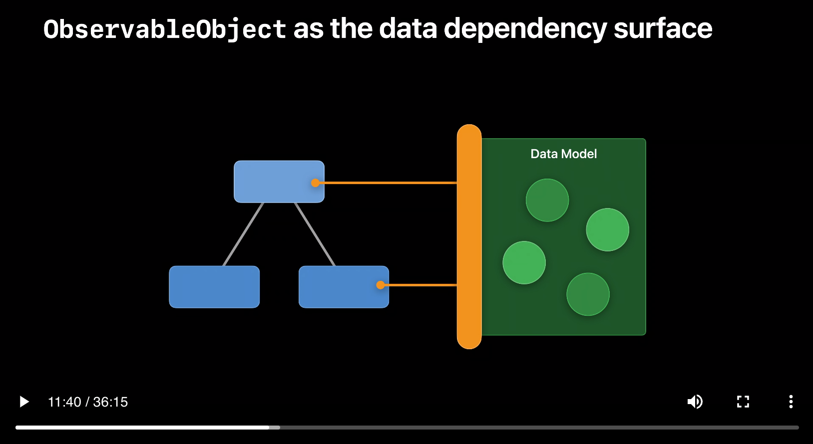

Centralna koncepcja obraca się wokół przyznania widoków dostępu do ujednoliconej warstwy lub interfejsu, który działa jako ostateczne źródło informacji i przyznaje wejście do wszystkich komponentów w aplikacji. Czasami ta zunifikowana warstwa może odpowiadać warstwie sieciowej. Takie podejście jest wskazane w sytuacjach, w których Twoje poglądy autonomicznie zużywają dane, a wprowadzanie zmian w danych nie wymaga synchronizacji z innymi segmentami aplikacji. Prosty przykład może obejmować usługę innej firmy, która dostarcza listę aktualnych artykułów prasowych. W takim przypadku Twój widok może bezpośrednio wchodzić w interakcje z warstwą sieciową, aby zaprezentować artykuły prasowe. Ta koncepcja jest zilustrowana poniżej:


```swift
struct NewsListScreen: View {
    
    @Environment(\.httpClient) private var httpClient
    @State private var articles: [Article] = []
    
    private var sortedArticles: [Article] {
        articles.sorted { lhs, rhs in
            // sorting logic
        }
    }
    
    private func loadArticles() async {
        let resource = Resource(Constants.Urls.articles)
        do {
            try articles = httpClient.load(resource)
        } catch {
            // handle error
        }
            
    }
    
    var body: some View {
        List(sortedArticles) { article in
            ArticleView(article)
        }.task {
            await loadArticles()
        }
        
    }
}
```

`NewsListScreen` służy jako widok kontenera. Oznacza to, że jest odpowiedzialny za wykonywanie połączeń sieciowych i pobieranie danych. Po pobraniu danych można je przekazać do widoku prezentacji. Obecnie jedynym widokiem wielokrotnego użytku, który mamy w powyższym kodzie, jest `ArticleView`. W zależności od aplikacji i wymagań, możesz również wyodrębnić Listę do osobnego komponentu `ArticleListView`.

Kolejną rzeczą, na którą należy zwrócić uwagę w powyższym kodzie, jest wykorzystanie prywatnej własności `sortedArticles`. Jak wspomniałem wcześniej, że w MV Pattern, widoki są modelami widoków. Nie ma potrzeby tworzenia modelu widoku powiązanego z `NewsListScreen`. Jeśli twój widok staje się duży, użyj zasad rozkładu widoku, aby podzielić go na mniejsze kawałki. Pamiętaj, że widoki w SwiftUI są typami wartości. Rodzaje wartości są tanie w tworzeniu. Daje to elastyczność w rozbijaniu widoków na wiele elementów wielokrotnego użytku.

*Jeśli zastanawiasz się, jak przetestowałbyś właściwość `sortedArticles`, czytaj dalej. Testy zostaną omówione w dalszej części tego artykułu.*

Powyższa technika jest idealna, gdy stan jest prywatny dla widoku i nie jest współdzielony z resztą aplikacji. Nadal możesz zmienić/zmodyfikować stan, przekazując stan do widoków podrzędnych za pomocą owijści i makr właściwości `@Binding` i `@Bindable`, ale po przekazaniu stanu do wielu poziomów hierarchii widoków staje się to powtarzalne i czasochłonne.

Podczas pracy nad większymi aplikacjami potrzebujesz możliwości udostępniania stanu innym widokom aplikacji bez konieczności przekazywania przez hierarchię widoków. Apple zademonstrowało to podejście w kilku przykładowych projektach, które obejmują [Fruta](https://developer.apple.com/documentation/swiftui/fruta_building_a_feature-rich_app_with_swiftui) i [FoodTruck](https://developer.apple.com/documentation/swiftui/food_truck_building_a_swiftui_multiplatform_app). Te przykładowe aplikacje pokazały, jak używać tego wzorca w stosunku do zakodowanego na stałe źródła danych. Ale w tytule wideo WWDC "[Użyj Xcode do rozwoju po stronie serwera](https://developer.apple.com/videos/play/wwdc2022/110360/)" Apple pokazał, jak zaktualizować istniejącą aplikację FoodTruck i wykorzystać dane z odpowiedzi API.

Poniższy zrzut ekranu pokazuje `FoodTruckModel` używający `DonutsServerClient` do pobrania listy pączków. `DonutsServerClient` jest odpowiedzialny za złożenie rzeczywistego żądania do serwera i pobranie pączków. Po pobraniu pączków są one przypisane do właściwości `serverDonuts` utrzymywanej przez `FoodTruckModel`.

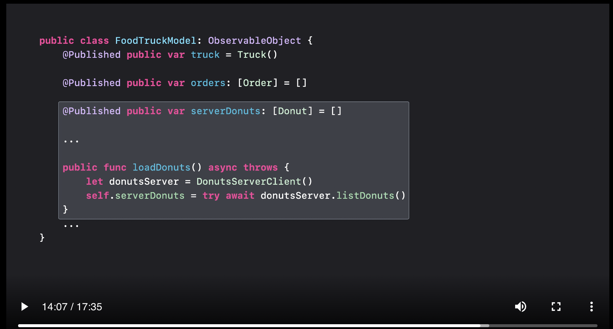

Oto zaktualizowany schemat wspierający warstwę sieciową.

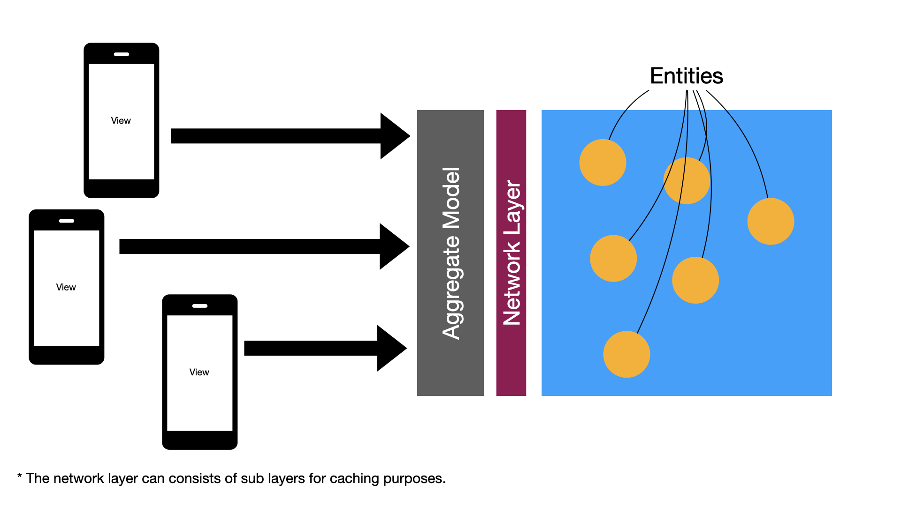

Wiem, o czym myślisz. Czy będziemy ślepo korzystać z porad opartych na próbkach kodu Apple? Nie! Nigdy nie bierz żadnej rady na ślepo. Zawsze inwestuj czas i badania oraz rozważ zalety i wady każdego podejścia. Oceniłem wiele różnych technik i wzorców i stwierdziłem, że jest to najlepsza i najprostsza opcja podczas tworzenia aplikacji klient/serwer przy użyciu SwiftUI. Zrób swoje badania!.

Opierając się na rekomendacji Apple w ich filmach WWDC i próbkach kodu oraz moim osobistym doświadczeniu, wdrożyłem jeden model zbiorczy, który utrzymuje cały stan aplikacji. W przypadku małych i średnich aplikacji może wystarczyć pojedynczy model zbiorczy. W przypadku skomplikowanych aplikacji możesz mieć wiele modeli zagregowanych, które będą grupować powiązane jednostki razem. Wiele modeli zbiorczych jest omówionych w dalszej części tego artykułu.

Jeszcze raz pamiętaj, że ten artykuł dotyczy aplikacji klient/serwer. Jeśli używasz Core Data lub czegokolwiek innego, będziesz musiał przeprowadzić badania. W przypadku aplikacji czysto Core Data eksperymentowałem z Active Record Pattern. [Możesz o tym przeczytać tutaj](https://azamsharp.com/2023/01/30/active-record-pattern-swiftui-core-data.html).

Podążając za wzorcem omówionym w [Use Xcode for server-side development](https://developer.apple.com/videos/play/wwdc2022/110360/) talk, oto StoreModel, który zaimplementowałem dla mojej aplikacji.

```swift
class StoreModel: ObservableObject {
    
    private var storeHTTPClient: StoreHTTPClient
    
    init(storeHTTPClient: StoreHTTPClient) {
        self.storeHTTPClient = storeHTTPClient
    }
    
    @Published var products: [Product] = []
    @Published var categories: [Category] = []
    
    func addProduct(_ product: Product) async throws {
         try await storeHTTPClient.addProduct(product)
    }
    
    func populateProducts() async throws {
        self.products = try await storeHTTPClient.loadProducts()
    }
}
```

`StoreModel` to model zbiorczy, który centralizuje wszystkie dane dla aplikacji. Widoki komunikują się bezpośrednio z `StoreModel` w celu wykonywania zapytań i operacji trwałości. `StoreModel` wykorzystuje również `StoreHTTPClient`, który jest używany do wykonywania operacji sieciowych. `StoreHTTPClient` to bezstanowa warstwa sieciowa. Oznacza to, że może być używany w innych częściach aplikacji, które nie są SwiftUI, co oznacza UIKit, a nawet na innej platformie (macOS).

W Domain-Driven Design (DDD) agregat to grupa powiązanych obiektów, które są traktowane jako pojedyncza jednostka pracy w celu zapewnienia spójności danych i granic transakcyjnych. Model agregatu jest zatem reprezentacją agregatu w kodzie, zazwyczaj jako klasa lub grupa klas.

`StoreModel` może być używany na wiele różnych sposobów. Możesz użyć `StoreModel` jako `@StateObject`, jeśli chcesz, aby dane były dostępne tylko dla określonego widoku i jeśli chcesz powiązać obiekt z czasem życia widoku. Ale dość często dodaję `StoreModel` do `@EnvironmentObject`, aby mógł być dostępny w wstrzykniętym widoku i wszystkich jego widokach podrzędnych.

```swift
@main
struct StoreAppApp: App {
    var body: some Scene {
        WindowGroup {
            ContentView()
                .environmentObject(StoreModel(client: StoreHTTPClient()))
            
        }
    }
}
```

Po wstrzyknięciu StoreModel przez @EnvironmentObject, możesz uzyskać dostęp do StoreModel, jak pokazano w poniższej implementacji.

```swift
struct ContentView: View {

    @EnvironmentObject private var model: StoreModel
    
    var body: some View {
        ProductListView(products: model.products)
            .task {
                do {
                    try await model.populateProducts()
                } catch {
                    print(error.localizedDescription)
                }
            }
    }
}
```

Możesz ulec pokusie, aby użyć @EnvironmentObject wewnątrz wszystkich widoków. Chociaż będzie działać zgodnie z oczekiwaniami, ale w przypadku większych aplikacji musisz sprawić, by widoki prezentacji były wolne od jakichkolwiek zależności. Widoki prezentacji to zazwyczaj widoki potomne, które są tworzone w celu ponownego użytku. Próbujesz uzyskać dostęp do @EnvironmentObject wewnątrz widoków potomnych, wpływa to na ich status ponownego wykorzystywania i stają się one mniej przydatne. Głównym powodem jest to, że teraz są zależni od @EnvironmentObject, aby dostarczyć im dane. Zamiast tego powinniśmy postępować zgodnie z podejściem odgórnym, w którym dane są przekazywane z widoku nadrzędnego do widoku podrzędnego. Jest to również znane jako wzór [kontenera/prezentacji](kontenera/prezentacji).

Oprócz pobierania i trwałości, `StoreModel` może również zapewnić sortowanie, filtrowanie, wyszukiwanie i inne operacje bezpośrednio do widoku.

Gdybym używał tradycyjnego wzorca MVVM, stworzyłbym kilka modeli widoków, aby pomieścić każdy ekran. Może to obejmować `ProductListViewModel`, `ProductViewModel`, `AddProductViewModel`, `ProductDetailViewModel` i wiele innych. Przez większość czasu te modele widoków mają jedną lub dwie funkcje i utrzymanie jednego źródła prawdy może stać się bardzo trudne. We wzorcu MV sam widok jest modelem widoku, więc nie musimy tworzyć niepotrzebnych modeli widoków przez większość czasu. Widok, który jest również modelem widoku, po prostu poprosi model (model zbiorczy) o dane.

**Źródłem prawdy w aplikacji klient/serwer jest serwer.** Oznacza to, że nie powinieneś dodawać modeli widoków zgodnych z protokołem `ObservableObject` (nowe źródło prawdy) tylko dlatego, że dodałeś nowy widok. Źródło prawdy dla tego poglądu nie uległo zmianie, nadal jest serwerem.

Pojedynczy `StoreModel` jest idealny dla małych lub nawet średnich aplikacji. Ale w przypadku większych aplikacji dobrym pomysłem będzie wprowadzenie wielu modeli zbiorczych w oparciu o ograniczony kontekst aplikacji. W następnej sekcji omówimy wiele modeli zbiorczych i ich korzyści podczas pracy w dużych zespołach.

Wzór MV i wzór MVVM mogą wydawać się podobne na pierwszy rzut oka, ale wykazują znaczne różnice. W aplikacji klient/serwer używającej MVVM dla każdego ekranu tworzony jest osobny model widoku. Na przykład w aplikacji do zarządzania filmami możesz mieć wiele modeli widoków, takich jak `MovieListViewModel`, `AddMovieViewModel`, `MovieDetailViewModel` i ewentualnie `MovieViewModel`.

Jednak MV przyjmuje zupełnie inne podejście, pomijając tworzenie modeli widokowych. Zamiast tego bezpośrednio wiąże obiekty DTO (modele z serwera) z widokiem. W niektórych przypadkach widok może bezpośrednio wykorzystywać warstwę sieciową do pobierania obiektów DTO, podczas gdy w innych pojedynczy magazyn danych lub model zbiorczy (`ObservableObject`) pomaga w dostępie do filmów. Każda wymagana walidacja interfejsu użytkownika lub transformacja danych jest zaimplementowana w ramach samego widoku.

Aby zapewnić ponowne wykorzystanie widoków dzieci, w grę wchodzi wzór kontenera i prezentera. Jeden widok jest odpowiedzialny za żądanie i uzyskanie danych, podczas gdy inny widok, znany jako prezenter, odpowiada za wyświetlanie danych. Ten podział obowiązków zapewnia bardziej modułową i konserwowalną konstrukcję.

W przypadku MV ogólna struktura różni się od MVVM, co pozwala na bardziej bezpośrednią obsługę danych i widoków bez potrzeby stosowania wielu modeli widoków. Wykorzystując kontener i wzór prezentera, Twoja aplikacja może osiągnąć lepszą organizację i możliwość ponownego wykorzystania widoków.

## Wiele modeli zagregowanych

Jak dowiedziałeś się w poprzedniej sekcji, celem modelu zbiorczego jest udostępnienie danych Twojemu widokowi. Jak Luca wyjaśnił w [Data Essentials w SwiftUI WWDC 2020 (11:30)](https://developer.apple.com/videos/play/wwdc2020/10040/) „Model zagregowany jest to `ObservableObject`, który działa jak powierzchnia zależności danych. To pozwala nam modelować dane za pomocą typu wartości i zarządzać ich cyklem życia i skutkami ubocznymi za pomocą typu referencyjnego."

W miarę rozwoju Twojej firmy pojedynczy model zagregowany może nie wystarczyć do utrzymania cyklu życia i skutków ubocznych całej aplikacji. W tym miejscu wprowadzimy wiele modeli zbiorczych. Te modele zbiorcze są oparte na ograniczonym kontekście aplikacji `Bounded context`. Ograniczony kontekst odnosi się do określonego obszaru systemu, który ma wyraźne granice i jest zaprojektowany tak, aby służył określonemu celowi biznesowemu.

W aplikacji e-commerce możemy mieć kilka ograniczonych kontekstów, w tym proces realizacji transakcji, system zarządzania zapasami, katalog, realizację, wysyłkę, zamówienia, marketing i moduły zarządzania klientami.

Definiowanie ograniczonego kontekstu jest ważne w rozwoju oprogramowania i pomaga rozbić aplikację na małe, łatwe do opanowania fragmenty. Pozwala to również zespołom pracować nad różnymi częściami systemu bez ingerencji w siebie nawzajem.

Programiści zazwyczaj nie są dobrzy w znajdowaniu ograniczonego kontekstu dla aplikacji. Głównym powodem jest to, że ich wiedza techniczna nie odwzoruje się bezpośrednio na wiedzy domenowej. Wiedza domenowa wymaga innego zestawu umiejętności, a ekspert dziedzinowy lepiej nadaje się do tego rodzaju roli. Ekspert domenowy to osoba, która może nie być obeznana z technologią, ale rozumie, jak działa firma lub konkretna domena. W dużych projektach możesz mieć wielu ekspertów domenowych, z których każdy obsługuje inną domenę biznesową. Dlatego niezwykle ważne jest, aby programiści komunikowali się z ekspertami ds. domen i rozumieli domenę przed rozpoczęciem jakiegokolwiek rozwoju.

Po zidentyfikowaniu różnych ograniczonych kontekstów związanych z Twoją aplikacją możesz je przedstawić w formie modeli zbiorczych. Jest to pokazane na poniższym schemacie.

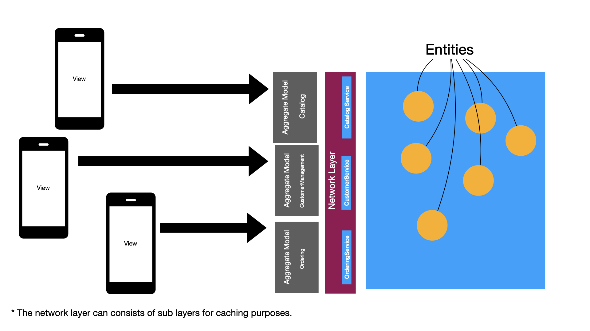

Warstwę sieciową można również podzielić na wiele klientów HTTP lub można użyć jednej ogólnej warstwy sieciowej dla całej aplikacji. Jest to pokazane na poniższym diagramie.

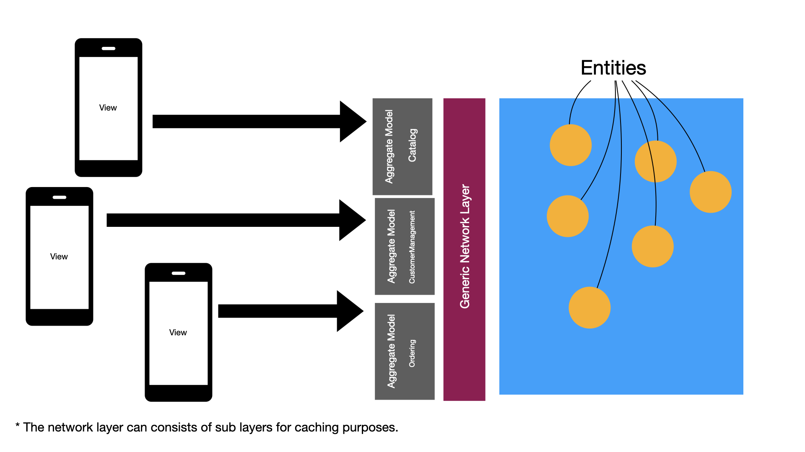

Model zbiorczy Katalogu będzie odpowiedzialny za dostarczanie widoków wszystkim podmiotom powiązanym z `Catalog`. Może to obejmować, ale nie ograniczać się do:

- Produkt

- Kategoria

- Marka

- Przegląd


Model zbiorczy `Ordering` będzie odpowiedzialny za dostarczanie widoków wszystkim podmiotom związanym z zamawianiem. Może to obejmować, ale nie ograniczać się do:

- Zamówienie

- Pozycja w linii zamówienia

- Stan zamówienia

- Metoda wysyłki

- Zniżka


Modele zbiorcze `Catalog` i `Ordering` będą typami referencyjnymi zgodnymi z protokołem `ObservableObject`. A wszystkie podmioty, które zapewniają, będą typami wartości.

Zarys modelu zbiorczego Katalogu i podmiotu Produktu pokazano poniżej:

```swift
struct Product: Codable {
    let productId: Int
    let name: String
    let category: Category
    let price: Double
    let description: String
    let reviews: [Review]?
}
```


```swift
@MainActor 
class Catalog: ObservableObject {
    
    // designated or generic HTTP client 
    let storeHTTPClient: StoreHTTPClient
    
    @Published var products: [Product]
    @Published var categories: [Category]
    
    init(storeHTTPClient: StoreHTTPClient) {
        self.storeHTTPClient = storeHTTPClient
    }
    
    func loadProducts() {
         products = storeHTTPClient.loadProducts
    }
    
    func getProductById(_ productId: Int) -> Product? {
        // fetch product by id 
    }
    
    func getProductsByCategory(_ categoryId: Int) -> [Product] {
       // get products by category
    }
    
    func getCategories() -> [Category] {
        categories = storeHTTPClient.loadCategories()
    }
}
```

Katalog i Zamawianie modeli zagregowanych są wstrzykiwane do aplikacji jako obiekt środowiska. Możesz wstrzyknąć je bezpośrednio w widoku głównym aplikacji lub w widoku głównym każdej sekcji aplikacji. Późniejszy jest pokazany poniżej:

```swift
@main
struct StoreApp: App {
    
    var body: some Scene {
        WindowGroup {
            ContentView()
                .environmentObject(Catalog(client: CatalogHTTPClient()))
                .environmentObject(Ordering(client: OrderingHTTPClient()))
            
        }
    }
}
```

Teraz w widoku możesz użyć modeli katalogu lub zamówienia, uzyskując do niego dostęp za pośrednictwem `@EnvironmentObject`. Implementacja jest pokazana poniżej:

```swift
struct CatalogListScreen: View {
    
    @EnvironmentObject private var catalog: Catalog
    
    var body: some View {
        List(catalog.products) { product in
            Text(product.name)
        }.task {
            do {
                try await catalog.loadProducts()
            } catch {
                print(error.localizedDescription)
            }
        }
    }
}
```

Jeśli twój widok wymaga dostępu do informacji o zamawianiu, może również wykorzystać model zbiorczy zamawiania.

```swift
struct AdminDashboardScreen: View {
    
    @EnvironmentObject private var catalog: Catalog
    @EnvironmentObject private var ordering: Ordering
    
    var body: some View {
        VStack {
            List(catalog.products) { product in
                Text(product.name)
            }
            List(ordering.allOrders) { order in
                Text(order.status)
            }
        }.task {
            do {
                try await catalog.loadProducts()
                try await ordering.loadOrders()
            } catch {
                print(error.localizedDescription)
            }
        }
    }
}
```

Istnieją scenariusze, w których twój model zagregowany będzie musiał uzyskać dostęp do informacji z innego modelu zbiorczego. W takich przypadkach Twój model zbiorczy będzie po prostu korzystał z usługi sieciowej w celu uzyskania potrzebnych informacji.

*Ważne jest, aby twoja warstwa buforowania była wywoływana z warstwy sieciowej, a nie z modeli zagregowanych. Pozwoli to modelom zbiorczym wykorzystać buforowanie przez warstwę sieciową, zamiast implementować ją samodzielnie. Uzyskując dostęp do warstwy buforowania z wnętrza warstwy sieciowej, wszystkie modele zbiorcze mogą korzystać z szybszej reakcji dzięki wykorzystaniu zasobów w pamięci podręcznej.*

*Jak wspomniano wcześniej, w przypadku małych lub nawet średnich aplikacji, możesz potrzebować tylko jednego modelu zbiorczego. W przypadku większych aplikacji można wprowadzić nowe modele zbiorcze. Pamiętaj, aby skonsultować się z ekspertem domenowym przed utworzeniem granic aplikacji.*

Pojęcie granic domeny może być również zastosowane do interfejsów użytkownika. To pozwala nam na ponowne wykorzystanie elementów interfejsu użytkownika w innych aplikacjach.

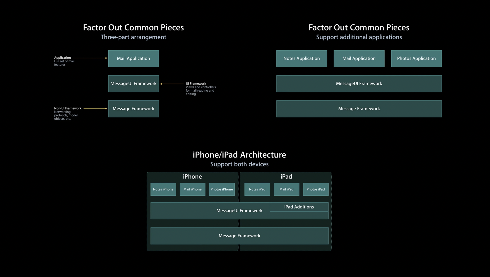

*Możesz uwzględnić wspólne elementy interfejsu za pomocą Swift Package Manager i zaimportować te pakiety do innych aplikacji.*

Przejdźmy dalej, pomniejszmy i zobaczmy, jak wygląda nasza architektura ze wszystkimi elementami na swoim miejscu.

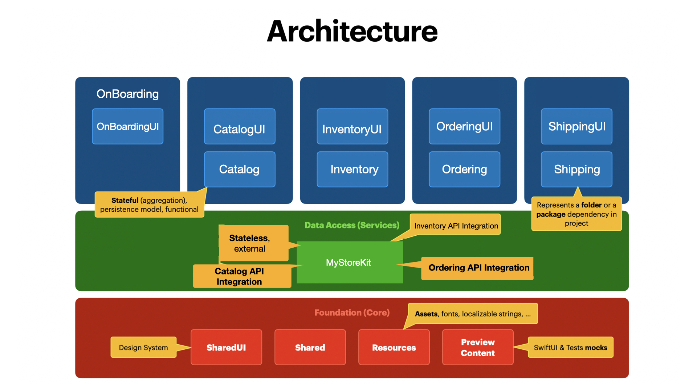

*Ten obraz został zaktualizowany i udzielono pozwolenia od pierwotnego autora obrazu na wykorzystanie go w tym artykule.*

Jak omówiono wcześniej, każdy ograniczony kontekst jest reprezentowany przez swój własny moduł. Moduły te mogą być reprezentowane przez folder lub zależność pakietu.

`CatalogUI`: Reprezentuje interfejs użytkownika powiązany z katalogiem. Może to obejmować wszystkie specyficzne dla katalogu rzeczy, takie jak `AddCatalogScreen`, `UpdateCatalogScreen` itp.

`Catalog`: Reprezentuje modele powiązane z katalogiem. Będzie to zawierać model zbiorczy i wszystkie podmioty ujawnione przez model zbiorczy.

`MyStoreKit`: Reprezentuje klienta HTTP do wykonywania połączeń sieciowych.

`Foundation Core`: Reprezentuje zasoby używane przez wszystkie moduły. Może to obejmować klasy pomocnicze/struktury, widoki wielokrotnego użytku, obrazy, ikony, a nawet zawartość podglądu używaną do testowania.

Każdy moduł, taki jak wysyłka, zapasy, zamawianie itp., może być reprezentowany przez strukturę folderów lub zależność od pakietu. To naprawdę zależy od twoich potrzeb i czy chcesz ponownie wykorzystać swoje moduły w innych projektach.

Korzystając z tej architektury, przyszłe wymagania biznesowe i usługi dostępu do danych mogą być dodawane bez ingerencji w istniejące. Pozwala to również na bardziej współpracujące środowisko, ponieważ różne zespoły mogą pracować nad różnymi modułami bez ingerencji w siebie nawzajem.

## Logika widoku

W tej ostatniej sekcji mówiłem o tym, jak modele zbiorcze mogą służyć jako jedno źródło prawdy i dostarczać wymaganych danych do poglądów. Ale co z logiką specyficzną dla konkretnego widoku? Gdzie powinna być umieszczona ta logika i jakie mamy opcje, aby przeprowadzić testy na tej logice.

W poniższym kodzie chcemy filtrować produkty w oparciu o cenę minimalną i maksymalną. Implementacja jest pokazana poniżej:

```swift
struct ContentView: View {
    
    let httpClient: HTTPClientProtocol
    @State private var products: [Product] = []
    @State private var min: Double?
    @State private var max: Double?
    @State private var filteredProducts: [Product] = []
    
    private func filterProducts() {
        
        guard let min = min,
              let max = max else { return }
        
        filteredProducts = products.filter {
            $0.price >= min && $0.price <= max
        }
    }
    
    private var isFormValid: Bool {
        
        guard let min = min,
              let max = max else { return false }
        
        return min < max
    }
    
    var body: some View {
        VStack {
            HStack {
                TextField("Min", value: $min, format: .number)
                    .textFieldStyle(.roundedBorder)
                TextField("Max", value: $max, format: .number)
                    .textFieldStyle(.roundedBorder)
            }
            Text("Max must be larger than min.")
                .frame(maxWidth: .infinity, alignment: .leading)
                .font(.caption)
                .padding([.bottom], 20)
            
            Button("Apply") {
                filterProducts()
            }
            
            .disabled(!isFormValid)
          
            List(filteredProducts.isEmpty ? products: filteredProducts) { product in
                HStack {
                    Text(product.title)
                    Spacer()
                    Text(product.price, format: .currency(code: "USD"))
                }
            }
            .task {
                do {
                    products = try await httpClient.loadProducts()
                } catch {
                    print(error)
                }
        }
        }.padding()
    }
}

struct ContentView_Previews: PreviewProvider {
    static var previews: some View {
        ContentView(httpClient: HTTPClientStub())
    }
}
```

*Jeśli `filterProducts` lub podobne funkcje będą zaangażowane w dowolną logikę modelu, możesz również umieścić je w zbiorczym modelu głównym, zamiast w widoku.*

Należy pamiętać, że zamiast wywoływać prawdziwą usługę, używamy zastępczej wersji HTTPClient, która zwraca wstępnie skonfigurowaną odpowiedź. Inną dobrą opcją byłoby utworzenie oddzielnych plików JSON dla każdej odpowiedzi i odczytanie danych z tych plików podczas korzystania z podglądów Xcode. Omówiłem to w jednym z moich filmów na YouTube, [Building SwiftUI Xcode Previews Using JSON File](https://www.youtube.com/watch?v=EycwLxTU-EA).

Pamiętaj, że w powyższym scenariuszu, jeśli podczas filtrowania nie zostaną znalezione żadne wyniki, zwracana jest tablica oryginalnych produktów.

Mamy dwa kawałki kodu w ujęciu, które stanowią jako logikę, `isFormValid` i `filterProducts`. Jeśli chcemy przetestować ten kod, mamy wiele sposobów.

**Użyj podglądów Xcode!** Wiem, że to nie brzmi fantazyjnie, ale zachęcam do korzystania z podglądów Xcode w celu przetestowania logiki opartej na widoku. Podgląd Xcode jest niezwykle szybki (w zależności od używanej maszyny) i daje takie samo wrażenie jak cykl Red/Green/Refactor. W tym konkretnym scenariuszu podglądy Xcode będą moim pierwszym wyborem.

*Podglądy Xcode nie są odpowiedzią na wszystko. Jeśli masz do czynienia ze skomplikowaną logiką widoku, dobrym pomysłem będzie przeniesienie całej logiki do osobnej struktury, a następnie napisanie testów jednostkowych dla tego fragmentu kodu. Pamiętaj, że jednym z ważnych aspektów tego, dlaczego testujemy, jest zdobycie pewności co do naszego kodu.*

Inną opcją jest wyodrębnienie logiki z widoku, a następnie napisanie przeciwko niej testów jednostkowych. Jest to pokazane w implementacji poniżej:

```swift
struct ProductFilterForm {
    
    var min: Double?
    var max: Double?
    
    func filterProducts(_ products: [Product]) -> [Product] {
        
        guard let min = min,
              let max = max else { return [] }
        
        return products.filter {
            $0.price >= min && $0.price <= max
        }
    }
}
```

`ProductFilterForm` może być teraz testowany jednostkowo w izolacji. Test jednostkowy jest pokazany poniżej:

```swift
func test_user_can_filter_products_by_price() throws {
        
        self.continueAfterFailure = false
      
        let products = [
            Product(id: 1, title: "Product 1", price: 10),
            Product(id: 2, title: "Product 2", price: 100),
            Product(id: 3, title: "Product 3", price: 200),
            Product(id: 4, title: "Product 4", price: 500)
        ]
        
        let expectedFilteredProducts = [
            Product(id: 2, title: "Product 2", price: 100),
            Product(id: 3, title: "Product 3", price: 200),
            Product(id: 4, title: "Product 4", price: 500)
        ]
        
        let productFilterForm = ProductFilterForm(min: 100, max: 500)
        let filteredProducts = productFilterForm.filterProducts(products)
        
        for expectedProduct in expectedFilteredProducts {
            
            let product = filteredProducts.first { $0.id == expectedProduct.id }
            
            XCTAssertNotNil(product)
            XCTAssertEqual(product!.title, expectedProduct.title)
            XCTAssertEqual(product!.price, expectedProduct.price)
        }
        
    }
```

*Logika widoku testowania jednostek w izolacji, jak pokazano powyżej, może być korzystna dla skomplikowanych interfejsów użytkownika. Pamiętaj, że tylko dlatego, że test jednostkowy przejdzie, nie oznacza to, że interfejs użytkownika działa zgodnie z oczekiwaniami.*

A ostateczny rodzaj testu, który możesz napisać, to test end-to-end. Testy E2E są świetne, ponieważ testują aplikację z punktu widzenia użytkownika i są najlepsze przeciwko regresji. Minusem jest to, że testy E2E są wolniejsze niż uruchamiane testy jednostkowe. Głównym powodem, dla którego są wolniejsze, jest to, że testują kompletną aplikację zamiast małych jednostek. Większość problemów w oprogramowaniu istnieje, ponieważ aplikacja została przetestowana na poziomie jednostki, a nie na poziomie systemu. Zachęcam do spędzenia trochę czasu na pisaniu kluczowych testów E2E.

Oto implementacja testu E2E dla powyższego scenariusza.

```swift
func test_user_can_filter_products_based_on_price() {
        
        let app = XCUIApplication()
        app.launchEnvironment = ["ENV": "TEST"]
        app.launch()
        
        app.textFields["minTextField"].tap()
        app.textFields["minTextField"].typeText("100")
        
        app.textFields["maxTextField"].tap()
        app.textFields["maxTextField"].typeText("500")
        
        app.buttons["applyButton"].tap()
        
        // assert that the count is correct
        XCTAssertEqual(3, app.collectionViews["productList"].cells.count)
        // assert that the items are correct
        XCTAssertEqual("Product 2", app.collectionViews["productList"].staticTexts["Product 2"].label)
        XCTAssertEqual("Product 3", app.collectionViews["productList"].staticTexts["Product 3"].label)
        XCTAssertEqual("Product 4", app.collectionViews["productList"].staticTexts["Product 4"].label)
    }
```

W końcu będziesz musiał zdecydować, gdzie w piramidzie testowej chcesz zainwestować swój czas, aby uzyskać najlepszy zwrot z inwestycji.

Jeśli chcesz dowiedzieć się więcej o testowaniu, możesz sprawdzić mój kurs [Test Driven Development w iOS przy użyciu Swif](https://www.udemy.com/course/test-driven-development-in-ios-using-swift/?referralCode=07649C41E6E184CE86B3)t.

## Ekrany a widoki

Kiedy pracowałem z Flutterem, zaobserwowałem wspólny wzór organizowania widżetów. Twórcy Fluttera oddzielali widżety w zależności od tego, czy widżety reprezentują cały ekran tylko kontroli wielokrotnego użytku. Ponieważ React, Flutter i SwiftUI mają bardzo podobny charakter, możemy zastosować te same zasady podczas budowania aplikacji SwiftUI.

Na przykład podczas wyświetlania szczegółów filmu, zamiast wywoływania tego widoku MovieDetailView, można go nazwać MovieDetailScreen. To wyjaśni, że widok szczegółów jest rzeczywistym ekranem, a nie jakimś widokiem potomnym wielokrotnego użytku. Oto kilka innych przykładów.

Ekrany

- MovieDetailScreen
- HomeScreen
- LoginScreen
- RegisterScreen
- SettingsScreen

Widoki

- RatingsView
- MessageView
- ReminderListView
- ReminderCellView

Uważam, że zawsze dobrym pomysłem jest uważne obserwowanie naszych przyjaznych sąsiadów React i Flutter. Nigdy nie wiesz, jakie pomysły wniesiesz z innych deklaratywnych ram do SwiftUI.

## Weryfikacja danych

Jest takie słynne powiedzenie w rozwoju oprogramowania, `garbage in, garbage out`. Oznacza to, że jeśli zezwolisz użytkownikom na wprowadzanie nieprawidłowych informacji (śmieci) przez interfejs użytkownika, śmieci w końcu trafią do twojej bazy danych. I zazwyczaj, gdy tak się dzieje, czyszczenie bazy danych staje się niezwykle trudne i czasochłonne.

Przede wszystkim musisz podjąć niezbędne kroki, aby uniemożliwić użytkownikom przesyłanie błędnych informacji.

Rozważ prosty widok LoginScreen z nazwą użytkownika i hasłem TextFields. Jeśli chcemy włączyć przycisk logowania tylko wtedy, gdy widok jest poprawny, możemy użyć poniższej implementacji:

```swift
struct LoginScreen: View {
    
    @State private var username: String = ""
    @State private var password: String = ""
    
    private var isFormValid: Bool {
        !username.isEmptyOrWhiteSpace && !password.isEmptyOrWhiteSpace
    }
    
    var body: some View {
        Form {
            TextField("Username", text: $username)
            TextField("Password", text: $password)
            Button("Login") {
                
            }.disabled(!isFormValid)
        }
    }
}
```

W przypadku takiej trywialnej logiki możesz użyć Xcode Previews, aby szybko przeprowadzić testy ręczne i zweryfikować wynik.

Jeśli pracujesz nad bardziej skomplikowaną formą, zaleca się wyodrębnienie jej do własnej struktury. Ta koncepcja jest pokazana w implementacji poniżej.

```swift
struct LoginFormConfig {
    
    var username: String = ""
    var password: String = ""
    
    var isFormValid: Bool {
        !username.isEmptyOrWhiteSpace && !password.isEmptyOrWhiteSpace
    }
}

struct LoginScreen: View {
    
    @State private var loginFormConfig: LoginFormConfig = LoginFormConfig()
    
    var body: some View {
        Form {
            TextField("Username", text: $loginFormConfig.username)
            TextField("Password", text: $loginFormConfig.password)
            Button("Login") {
                
            }.disabled(!loginFormConfig.isFormValid)
        }
    }
}
```

`LoginFormConfig` zawiera walidację formularza. Pozwala nam to również pisać testy jednostkowe przeciwko `LoginFormConfig`. Kilka testów jednostkowych jest pokazanych poniżej:

```swift
final class LearnTests: XCTestCase {

    func test_login_form_validates_successfully() {
        
        let expectedOutputs: [[String: Any]] = [
            ["username": "johndoe", "password": "password", "isFormValid": true],
            ["username": "", "password": "password", "isFormValid": false],
            ["username": "johndoe", "password": " ", "isFormValid": false],
            ["username": "", "password": " ", "isFormValid": false],
            ["username": "   ", "password": "password", "isFormValid": false],
            ["username": " johndoe", "password": " password", "isFormValid": true]
        ]
        
        for expectedOutput in expectedOutputs {
            let username = expectedOutput["username"] as! String
            let password = expectedOutput["password"] as! String
            let isFormValid = expectedOutput["isFormValid"] as! Bool
            
            let loginFormConfig = LoginFormConfig(username: username, password: password)
            XCTAssertEqual(loginFormConfig.isFormValid, isFormValid)
        }
    }
}
```

W końcu wyodrębnienie walidacji formularza do osobnej struktury i pisanie testów jednostkowych zależy od poziomu pewności siebie. Proste formularze można łatwo przetestować za pomocą Xcode Previews i nie wymagają dodatkowej struktury ani nawet testów jednostkowych.

Funkcje pomocnicze walidacji, takie jak `isEmptyOrWhiteSpace`, `isNumeric`, `isEmail`, `isLessThan`, można przenieść do osobnego pakietu Swift. Będzie to promować możliwość ponownego wykorzystania, a inne projekty mogą również skorzystać z jego wykorzystania.

Omówiłem kilka różnych sposobów obsługi i wyświetlania błędów walidacji w jednym z moich poprzednich artykułów, które można przeczytać [tutaj](https://azamsharp.com/2022/08/09/intro-to-mv-state-pattern.html).

## Grupowanie Widok Zdarzeń

Jednym ze sposobów tworzenia widoków wielokrotnego użytku w SwiftUI jest delegowanie zdarzeń do widoku nadrzędnego. Pozwala to na wykorzystanie widoków w różnych scenariuszach i bez wiązania ich z określoną logiką. Jednym ze sposobów, aby to osiągnąć, jest użycie `closure` (odpowiednik delegatów np w c#).

Rozważ `ReminderCellView`, który pozwala użytkownikowi na wykonywanie operacji sprawdzania/odznaczania i usuwania. Implementacja jest pokazana poniżej:

```swift
struct ReminderCellView: View {
    
    let index: Int
    let onChecked: (Int) -> Void
    let onDelete: (Int) -> Void

    var body: some View {
        HStack {
            Image(systemName: "square")
                .onTapGesture {
                    onChecked(index)
                }
            Text("ReminderCellView \(index)")
            Spacer()
            Image(systemName: "trash")
                .onTapGesture {
                    onDelete(index)
                }
        }
    }
}
```

`ReminderCellView` wywołuje akcje na  `onChecked` i `onDelete`. Wywołujący może użyć tych zamknięć do wykonania określonego zadania. Strona wywołująca i sposób wywolania są pokazane poniżej:

```swift
struct ContentView: View {

    var body: some View {
        List(1...20, id: \.self) { index in
            ReminderCellView(index: index, onChecked: { index in
                // do something
            }, onDelete: { index in
                // do something
            })
        }
    }
}
```

Wraz ze wzrostem złożoności `ReminderCellView` i ujawnieniem większej liczby zdarzeń strona wywołująca stanie się bardziej skomplikowana.

Możemy rozwiązać ten problem, grupując wszystkie wydarzenia w proste wyliczenie. To jest pokazane poniżej:

```swift
enum ReminderCellEvents {
    case onChecked(Int)
    case onDelete(Int)
}
```

`ReminderCellView` może zostać zaktualizowany, aby używać `ReminderCellEvents`. To jest pokazane poniżej:

```swift
struct ReminderCellView: View {
    
    let index: Int
    let onEvent: (ReminderCellEvents) -> Void
    
    var body: some View {
        HStack {
            Image(systemName: "square")
                .onTapGesture {
                    onEvent(.onChecked(index))
                }
            Text("ReminderCellView \(index)")
            Spacer()
            Image(systemName: "trash")
                .onTapGesture {
                    onEvent(.onDelete(index))
                }
        }
    }
}
```

Teraz, zamiast zajmować się wieloma zamknięciami, zajmujemy się tylko jedną strukturą zdarzeń opartą na wyliczaniu. Strona dzwoniąca również wygląda na znacznie czystszą.

```swift
struct ContentView: View {

    var body: some View {
        List(1...20, id: \.self) { index in
            ReminderCellView(index: index) { event in
                switch event {
                    case .onChecked(let index):
                        print(index)
                    case .onDelete(let index):
                        print(index)
                }
            }
        }
    }
}
```

W końcu będziesz musiał zdecydować, kiedy chcesz grupować wydarzenia w wyliczenie, a kiedy chcesz ich używać indywidualnie (wiele zamknięć). Wolę używać zdarzeń wyliczenia, jeśli mam więcej niż dwa zamknięcia odsłonięte przez widok.

## Nawigacja

SwiftUI wprowadził NavigationStack w iOS 16, który pozwolił programistom skonfigurować globalne trasy dla ich aplikacji. Jest to podobne do React Router, gdzie trasy mogą być skonfigurowane w jednym miejscu. Kiedy pierwotnie napisałem tę sekcję, użyłem `@EnvironmentObject` do przechowywania tras. Mimo że działał zgodnie z oczekiwaniami, ale nie wydawał się naturalny. Głównym celem `@EnvironmentObject` jest przechowywanie stanu, który będzie współdzielony z różnymi widokami w aplikacji. `@EnvironmentObject` może być naprawdę korzystny, gdy musisz uzyskać dostęp do stanu w głęboko zagnieżdżonym widoku, bez konieczności przechodzenia przez wszystkie widoki nadrzędne.

Jeśli chodzi o nawigację, nie dzielimy się stanem z innymi widokami, które będą wyświetlane na ekranie, udostępniamy konfiguracje środowiska aplikacji. Dla tego scenariusza `@Environment` jest o wiele lepszym wyborem. Zmienne `@Environment` mogą być używane do przechowywania ustawień konfiguracyjnych, usług, routerów aplikacji i innych. Widziałeś już `@Environment` w akcji wcześniej, kiedy przechowywaliśmy `httpClient` jako niestandardową wartość środowiska.

Zaczniemy od stworzenia wyliczenia reprezentującego trasy dla naszej aplikacji.

```swift
enum Route: Hashable {
    case home
    case login
    case detail(Product)
}
```

W przypadku większych aplikacji można tworzyć zagnieżdżone wyliczeń, aby podzielić trasy na podstawie różnych sekcji aplikacji.

W mojej poprzedniej implementacji przechowywałem zamknięcie związane z nawigacją bezpośrednio w wartościach `@Environment` . Niektórzy użytkownicy sugerowali, że nie jest to dobra praktyka i spowoduje to niepotrzebne renderowanie widoków. Osobiście nie doświadczyłem żadnych problemów z implementacją, ale postanowiłem zaktualizować ją, aby wspierać struktury jako wartość `@Environment`  zamiast `closures`.

Struktura `NavigationAction` będzie odpowiedzialny za przechowywanie akcji związanej z nawigacją. Wykorzystamy również wbudowaną funkcję `callAsFunction` SwiftUI, która jest wywoływana automatycznie po utworzeniu instancji `NavigationAction`. Głównym celem `NavigationAction` jest owinięcie zamknięcia w akcję. Pozwala nam to na przechowywanie struktury typu wartości w wartości `@Environment` w przeciwieństwie do `closure`. Implementacja `NavigationAction` jest pokazana poniżej:

```swift
struct NavigateAction {
    typealias Action = (NavigationType) -> ()
    let action: Action
    func callAsFunction(_ navigationType: NavigationType) {
        action(navigationType)
    }
}
```

Następnie wdrożymy niestandardowy `NavigateEnvironmentKey` i `EnvironmentValues`.

```swift
enum NavigationType: Hashable {
    case push(Route)
    case unwind(Route)
}

struct NavigateEnvironmentKey: EnvironmentKey {
    static var defaultValue: NavigateAction = NavigateAction(action: { _ in })
}

extension EnvironmentValues {
    var navigate: (NavigateAction) {
        get { self[NavigateEnvironmentKey.self] }
        set { self[NavigateEnvironmentKey.self] = newValue }
    }
}
```

Ważną rzeczą, na którą należy zwrócić uwagę, jest deklaracja i użycie `NavigationType`. Wyliczenie `NavigationType` reprezentuje dwa rodzaje nawigacji, które można wykonać. Obejmuje to domyślną nawigację do przodu, a także nawigację wstecz. Ta druga  pozwoli użytkownikom przejść z widoku G do widoku C lub roota.

*Jeśli twoja aplikacja nie obsługuje rozwijania nawigacji, możesz całkowicie wykluczyć NavigationType i zamiast tego bezpośrednio użyć Route.*

Zaimplementujemy również funkcję `onNavigate` w widoku. To pozwoli nam łatwo wstrzyknąć wymagane wartości środowiska.

```swift
extension View {
    func onNavigate(_ action: @escaping NavigateAction.Action) -> some View {
        self.environment(\.navigate, NavigateAction(action: action))
    }
}
```

Następnie musimy skonfigurować trasy i wstrzyknąć wartości Environment w widoku głównym naszej aplikacji. Zwykle jest to wykonywane w pliku aplikacji twojej aplikacji. Implementacja jest pokazana poniżej:

```swift
@main
struct LearnApp: App {
    
    @State private var routes: [Route] = []
    
    var body: some Scene {
        WindowGroup {
            NavigationStack(path: $routes) {
                ContentView()
                    .navigationDestination(for: Route.self) { route in
                        switch route {
                            case .home:
                                Text("HomeView")
                            case .login:
                                Text("LoginView")
                            case .detail(let product):
                                Text("ProductView \(product.name)")
                        }
                    }
            }.onNavigate { navType in
                switch navType {
                    case .push(let route):
                        routes.append(route)
                    case .unwind(let route):
                        
                        if route == .home {
                            routes = []
                        } else {
                            guard let index = routes.firstIndex(where: { $0 == route })  else { return }
                            routes = Array(routes.prefix(upTo: index + 1))
                        }
                }
            }
        }
    }
}
```

`NavigationStack` śledzi trasy za pomocą powiązania `$routes`. Za każdym razem, gdy nowa trasa jest dodawana lub usuwana, `.navigationDestination` jest sprawdzana poprawność. Modyfikator `.navigationDestination` jest odpowiedzialny za zwrot widoku docelowego w oparciu o typ trasy. W podobny sposób wartości środowiska są wstrzykiwane do `NavigationStack` za pomocą funkcji onNavigate.

Wreszcie, widoki mogą wykonywać programową nawigację za pomocą nowego klucza  `@Environment` o nazwie `navigate`. Jest to pokazane w następującej implementacji:

```swift
struct ReviewList: View {
    
    @Environment(\.navigate) private var navigate
    
    var body: some View {
        VStack {
            Text("Reviews")
            Button("Go to Product") {
                 navigate(.push(.detail(Product(name: "Chair"))))
            }
            Button("Go back to Home View") {
                navigate(.unwind(.home))
            }
        }
    }
}
```

Podczas poszukiwania tej sekcji wypróbowałem różne sposoby wykonywania routingu. Jedno z rozwiązań obejmowało następującą łatwą w użyciu składnię:

```swift
navigate(.detail(Product(name: "Chair")))
```

Problem, na który natknąłem się, polegał na tym, że powyższa implementacja nie obsługiwała rozwijania tras. Jednym ze sposobów obsługi rozwijania byłoby po prostu sprawdzenie tablicy tras, a następnie, jeśli trasa już istnieje, pomiń wszystkie indeksy po tej trasie. Chociaż można to zaimplementować, ale to sprawia, że kod jest niejasny dla dewelopera. Spójrz na następujący przykład:

```swift
navigate(.reviews)
```

Kiedy programista komponuje ten kod, zakłada się, że ułatwia on nawigację push, a nie rozwijanie. Jeśli jednak to samo wywołanie funkcji jest używane do wykonania operacji rozwijania wyłącznie w przypadkach, gdy trasa już istnieje, nakłada to dodatkowe obciążenie poznawcze na dewelopera. W związku z tym programista jest zmuszony posiadać pełniejsze zrozumienie wewnętrznego działania funkcji przed rozpoczęciem jej inwokacji.

Więc, w końcu to zależy od twoich potrzeb. Jeśli masz kryteria do obsługi odwijania tras, użyj powyższej implementacji, z drugiej strony, jeśli jesteś po prostu zainteresowany normalną nawigacją push, zastąp `NavigationType` w zamknięciu nawigacji za pomocą `Route`.

*Jestem pewien, że istnieją inne sposoby obsługi nawigacji w SwiftUI. Wyślij mi spis swojej sugestii na Twitterze, a z przyjemnością ją przejrzę.*

Napisałem również książkę o Navigation API w SwiftUI. Jeśli jesteś zainteresowany, możesz go pobrać bezpłatnie [stąd](https://azamsharp.com/books).

## Wyświetlanie Błędów

Wyświetlanie błędów jest integralną częścią każdej aplikacji. W SwiftUI mamy wiele różnych sposobów wyświetlania błędów. W tej sekcji omówimy trzy różne techniki, które można wykorzystać do wyświetlania błędów.

### Technika #1:

Ta technika została zademonstrowana w aplikacji `Apple Scrumdinger`. Zaczniemy od stworzenia `ErrorWrapper`a, który będzie odpowiedzialny za zawijanie rzeczywistego błędu, a także udzielanie użytkownikowi wskazówek dotyczących kolejnych kroków. Implementacja jest pokazana poniżej:

```swift
struct ErrorWrapper: Identifiable {
    let id = UUID()
    let error: Error
    let guidance: String
}
```

`ErrorView` jest odpowiedzialny za wyświetlanie szczegółów błędu w formacie wizualnym. Poniżej znajdziesz podstawową implementację `ErrorView`.

```swift
struct ErrorView: View {
    
    let errorWrapper: ErrorWrapper
    
    var body: some View {
        VStack {
            Text("Error has occured in the application.")
                .font(.headline)
                .padding([.bottom], 10)
            Text(errorWrapper.error.localizedDescription)
            Text(errorWrapper.guidance)
                .font(.caption)
        }.padding()
    }
}
```

*ErrorView to po prostu widok i możesz go dostosować tak bardzo, jak chcesz.*

Użycie ErrorWrapper i ErrorView jest pokazane poniżej:

```swift
struct HomeView: View {
    
    @State private var errorWrapper: ErrorWrapper?
    
    private enum SampleError: Error {
        case operationFailed
    }
    
    var body: some View {
        VStack {
            Button("Throw Error") {
                do {
                    throw SampleError.operationFailed
                } catch {
                    errorWrapper = ErrorWrapper(error: error, guidance: "Operation failed. Please try again.")
                }
            }
        }.sheet(item: $errorWrapper) { errorWrapper in
            ErrorView(errorWrapper: errorWrapper)
        }
    }
}
```

Teraz, gdy zostanie wyrzucony błąd, jest prezentowany widok typu `sheet` ze szczegółami dotyczącymi błędu wraz ze wskazówkami dotyczącymi kolejnych kroków.

Obecnie, gdy intencją jest przedstawienie błędu w odrębnym widoku, proces wymaga utworzenia "wrappera błędów" wraz z dołączeniem arkusza do odpowiedniego widoku w celu uzyskania widoczności błędu. Ale wyobraź sobie scenariusz, w którym wyświetlanie błędów mogłoby zostać skonsolidowane w scentralizowaną lokalizację.

### Technika #2:

Zamiast dołączać arkusz/alert do każdego ekranu aplikacji, możemy dołączyć go do widoku głównego. W ten sposób mamy jedno miejsce do obsługi, wyświetlanie błędów. Aby to zadziałało, potrzebujemy globalnego dostępu do `errorWrapper`, aby można go było ustawić za pomocą dowolnego widoku. Użyjemy tej samej techniki, której użyliśmy w sekcji Nawigacja i użyjemy niestandardowej wartości `@Environment` do zarządzania globalnym dostępem. Implementacja klucza niestandardowego i rozszerzenia jest pokazana poniżej:

```swift
struct ShowErrorEnvironmentKey: EnvironmentKey {
    static var defaultValue: (Error, String) -> Void = { _, _ in }
}

extension EnvironmentValues {
    var showError: (Error, String) -> Void {
        get { self[ShowErrorEnvironmentKey.self] }
        set { self[ShowErrorEnvironmentKey.self] = newValue }
    }
}
```

Teraz możemy użyć wartości `showError` `Environment` w twoim widoku, jak zaimplementowano poniżej:

```swift
struct HomeView: View {
    
    @Environment(\.showError) private var showError
    
    private enum SampleError: Error {
        case operationFailed
    }
    
    var body: some View {
        VStack {
            Button("Throw Error") {
                do {
                    throw SampleError.operationFailed
                } catch {
                   showError(error, "Please try again later.")
                }
            }
        }
    }
}
```

Na koniec dołączy nową wartość `Environment` do widoku głównego aplikacji, aby była łatwo dostępna dla wszystkich widoków potomnych.

```swift
@main
struct LearnApp: App {
    
    @State private var errorWrapper: ErrorWrapper?
    
    var body: some Scene {
        WindowGroup {
            ContentView()
                .environment(\.showError) { error, guidance in
                    errorWrapper = ErrorWrapper(error: error, guidance: guidance)
                }
                .sheet(item: $errorWrapper) { errorWrapper in
                    Text(errorWrapper.error.localizedDescription)
                }
        }
    }
}
```

Scentralizowaliśmy teraz wyświetlanie błędów dla naszej aplikacji. W przyszłości, jeśli chcesz wprowadzić jakiekolwiek zmiany, jest jedno miejsce, które możesz zaktualizować.

Nowe wyświetlacze, takie jak `.alert`, `.toast` itp. można dodać, wprowadzając wyliczenie do `ErrorWrapper`. Możesz sprawdzić implementację tutaj.

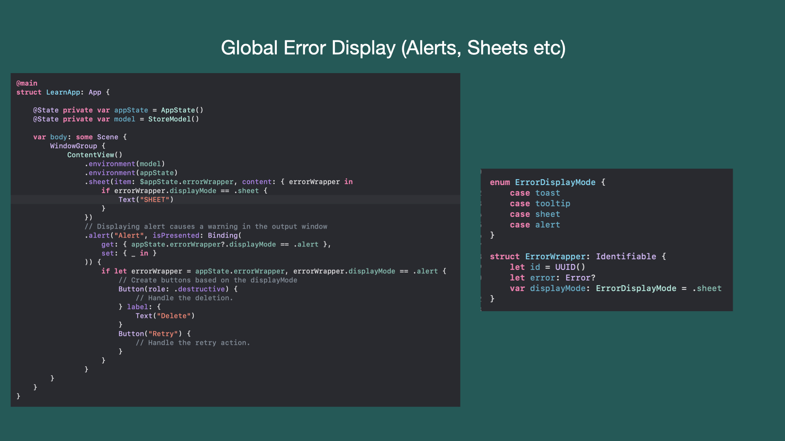

### Technika #3:

Dowiedziałem się o tej technice z mojej dyskusji z [Husseinem EIRyalatem](https://www.linkedin.com/in/hussc/). Użył niestandardowych modyfikatorów widoku do wyświetlania błędów. Zmieniłem trochę implementację, aby wspierać `ErrorWrapper`.

Pierwszym krokiem jest wdrożenie modyfikatorów widoku i rozszerzeń widoku. Implementacja jest pokazana poniżej:

```swift
struct ErrorViewModifier: ViewModifier {
    
    @Binding var errorWrapper: ErrorWrapper?
    
    init(errorWrapper: Binding<ErrorWrapper?>) {
        self._errorWrapper = errorWrapper
    }
    
    func body(content: Content) -> some View {
        content
            .sheet(item: $errorWrapper) { errorWrapper in
                Text(errorWrapper.error.localizedDescription)
            }
    }
}

extension View {
    
    func onError(_ errorWrapper: Binding<ErrorWrapper?>) -> some View {
        modifier(ErrorViewModifier(errorWrapper: errorWrapper))
    }
}
```

Teraz możemy bezpośrednio wywołać `onError`, jak pokazano w poniższej implementacji:

```swift
struct HomeView: View {
    
    @State private var errorWrapper: ErrorWrapper?
    
    private enum SampleError: Error {
        case operationFailed
    }
    
    var body: some View {
        VStack {
            Button("Throw Error") {
                do {
                    throw SampleError.operationFailed
                } catch {
                    errorWrapper = ErrorWrapper(error: error, guidance: "Please try again.")
                }
            }
        }.onError($errorWrapper)
    }
}
```

W tej sekcji omówiliśmy trzy różne sposoby wyświetlania błędów w naszej aplikacji SwiftUI. Każde podejście ma swoje zalety i wady. Wypróbuj różne podejścia i zobacz, które z nich odpowiada Twoim potrzebom.

## Formatowanie

Powszechną praktyką jest formatowanie danych przed przedstawieniem ich użytkownikowi.

Podczas formatowania danych ważne jest, aby zachować ostrożność w odniesieniu do obecnej lokalizacji użytkownika. Spójrz na poniższy przykład.

```swift
struct HomeView: View {
    
    let amount: Double = 25.75
    
    var body: some View {
        // displays $25.750000
        Text("$\(amount)") 
    }
}
```

Z powyższą implementacją jest kilka problemów. Pierwszy jest dość podstawowy. Użytkownicy nie chcą widzieć $25.750000 oni chcą zobaczyć $25.75. Ale o wiele większym problemem jest zakodowany na stałe znak $. Oznacza to, że kwota będzie wyświetlana tylko w walucie dolara amerykańskiego. O wiele lepszym pomysłem byłoby ustawienie waluty na podstawie ustawień regionalnych użytkownika.

Poniższa implementacja pokazuje, jak poprawnie wyświetlać walutę na podstawie ustawień regionalnych użytkownika.

```swift
extension Locale {
    static var currencyCode: String {
        Locale.current.currency?.identifier ?? "USD"
    }
}

struct HomeView: View {
    
    let amount: Double = 25.75
    
    var body: some View {
        // displays $25.75 
        Text(amount, format: .currency(code: Locale.currencyCode))
    }
}
```

Formatowanie w SwiftUI nie ogranicza się tylko do waluty, ale można formatować daty, pomiary, a nawet listy. To jest pokazane poniżej:

Formaty dat:

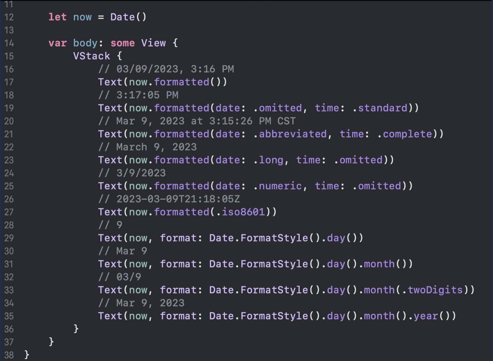

Formatowanie list/kolekcji:

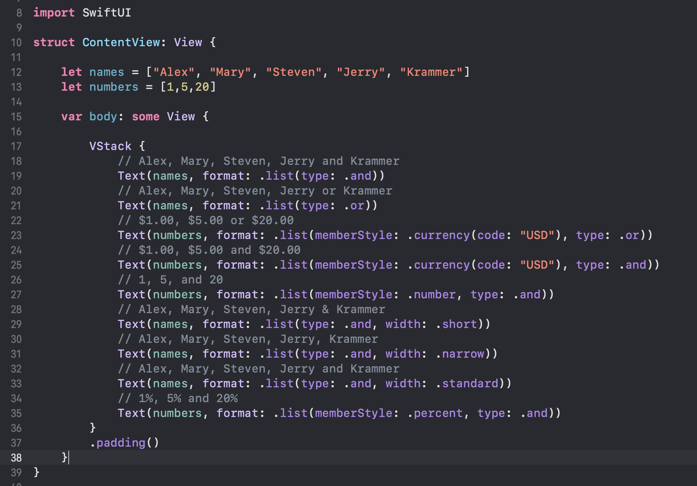

Formatowania odległości:

Nie musisz mieć dostępu do lokalizacji z `@Environment`. To zostało po prostu użyte do zademonstrowania, że automatycznie konwertuje odległości na podstawie lokalizacji.

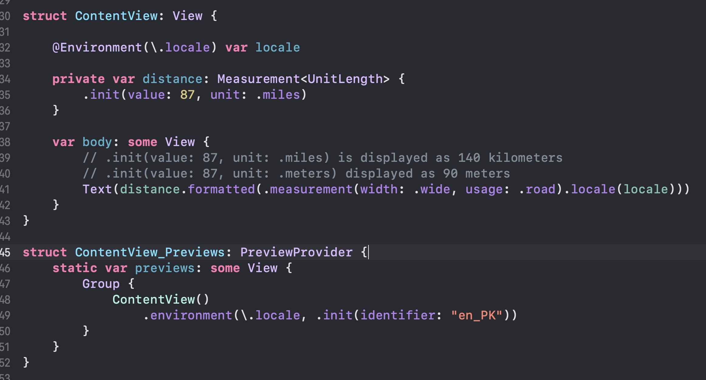

Tak więc, gdy następnym razem próbujesz sformatować swoje dane, aby były wyświetlane w widoku SwiftUI, sprawdź wbudowane formatery. Jest bardzo duża szansa, że SwiftUI już zapewnia funkcje użytkowe dla twoich potrzeb.

## Testowanie

Ta sekcja artykułu jest zaczerpnięta z mojego postu [Pragmatyczne testowanie i unikanie typowych pułapek](https://azamsharp.com/2012/12/23/pragmatic-unit-testing.html)

Głównym celem pisania testów jest upewnienie się, że oprogramowanie działa zgodnie z oczekiwaniami. Testy dają również pewność, że zmiana dokonana w jednym module nie zepsuje rzeczy w tym samym lub innych modułach.

Nie wszystkie aplikacje wymagają testów pisemnych. Jeśli budujesz podstawową aplikację z prostą domeną, możesz przetestować całą aplikację za pomocą testów ręcznych. Powiedziawszy to w większości środowisk zawodowych pracujesz ze skomplikowaną domeną z regułami biznesowymi. Te zasady biznesowe stanowią podstawę, na której firma działa i generuje przychody.

W tym artykule omówię różne techniki pisania testów i jak programista może pisać dobre testy, aby uzyskać największy zwrot z inwestycji.

### Nie wszystkie testy są równie ważne

Rozważ scenariusz, w którym piszesz aplikacje dla banku. Jedną z zasad biznesowych jest pobieranie opłat za kredyt w rachunku bieżącym w przypadku niewystarczających środków. Banki generują miliardy dolarów dochodu tylko dzięki takim opłatom. Jako programista musisz napisać testy dobrej jakości, aby upewnić się, że obliczanie opłaty za kredyt w rachunku bieżącym działa zgodnie z oczekiwaniami.

W tej samej aplikacji bankowej możesz mieć funkcje, takie jak renderowanie szablonów wiadomości e-mail lub rejestrowanie niektórych interakcji. Te funkcje są ważne, ale mogą nie przynieść takiego samego zwrotu z inwestycji w porównaniu z pobieraniem opłat za kredyt w rachunku bieżącym. Oznacza to, że jeśli szablon wiadomości e-mail nie jest w odpowiednim formacie, banki nie stracą milionów dolarów i nie otrzymasz połączenia w środku nocy. Jeśli rejestrowanie jest przeznaczone dla programistów, to w większości przypadków nie musisz nawet pisać dla niego testów. To tylko szczegół wdrożenia.

Jeśli budujesz strukturę rejestrowania, ważne jest, aby dokładnie przetestować publiczne API ujawnione przez twoje frameworki.

Następnym razem, gdy piszesz test, zadaj sobie pytanie, jak ważna jest ta funkcja dla firmy. Jeśli jest to integralna część działalności, upewnij się, że dokładnie ją przetestujesz i uzyskasz wysoki poziom pokrycia kodu.

### Testuj zachowania a nie implementację

Jednym z największych błędów popełnianych przez programistów jest skupienie się na pisaniu testów w stosunku do szczegółów implementacji, a nie na zachowaniu aplikacji.

*Powodem dodania nowego testu jest wymaganie, a nie klasa czy funkcja.*

To, że dodałeś nową klasę lub funkcję, nie oznacza, że zaczniesz pisać testy. To tylko szczegół wdrożenia, który może być zródłem  nadgodzin. Twoje testy powinny być ukierunkowane na wymagania biznesowe, a nie na szczegóły wdrożenia.

Oto kilka przykładów zachowań, wywodzących się z wymagań biznesowych:

1. Gdy klient wypłaca kwotę i ma niewystarczające środki, pobiera opłatę za kredyt w rachunku bieżącym.

2. Liczba akcji określona przez klienta jest przekazywana do obrotu po określonej cenie, po osiągnięciu limitu.


Zachowanie wynika z wymogu projektu. Testy, które sprawdzają szczegóły implementacji zamiast zachowania, są bardzo kruche i mogą się łatwo zepsuć, gdy implementacja się zmieni, mimo że zachowanie pozostaje takie samo.

Rozważmy scenariusz, w którym budujesz aplikację, aby wyświetlić listę produktów na ekranie. Produkty są pobierane z JSON API i renderowane przy użyciu frameworka SwiftUI, zgodnie z zasadami wzorca projektowania MVVM.

Najpierw przyjrzymy się wspólnemu sposobowi testowania powyższego scenariusza, który jest przyjęty przez większość programistów, a później zaimplementujemy testy w bardziej pragmatyczny sposób.

Kompletna aplikacja może wyglądać jak poniższa implementacja:

```swift
class Webservice {
    
    func fetchProducts() async throws -> [Product] {
        // ignore the hard-coded URL. We can inject the URL from using test configuration. 
        let url = URL(string: "https://test.store.com/api/v1/products")!
        let (data, _) = try await URLSession.shared.data(from: url)
        return try JSONDecoder().decode([Product].self, from: data)
    }
    
}

class ProductListViewModel: ObservableObject {
    
    @Published var products: [ProductViewModel] = []
    
    func populateProducts() async {
        do {
            let products = try await Webservice().fetchProducts()
            self.products = products.map(ProductViewModel.init)
        } catch {
            print(error)
        }
    }
    
}

struct ProductViewModel: Identifiable {
    
    private let product: Product
    
    init(product: Product) {
        self.product = product
    }
    
    var id: Int {
        product.id
    }
    
    var title: String {
        product.title
    }
}


struct ProductListScreen: View {
    
    @StateObject private var vm = ProductListViewModel()
    
    var body: some View {
        List(vm.products) { product in
            Text(product.title)
        }.task {
            await vm.populateProducts()
        }
    }
}
```

Powyższa aplikacja działa zgodnie z oczekiwaniami i daje oczekiwany rezultat. Zamiast testować konkretną implementację Webservice, wprowadzimy interfejs/umowa/protokół tylko po to, abyśmy mogli wstrzyknąć `mock` (imitator?). Jedynym celem stworzenia protokołu jest spełnienie wymagań testów, mimo że istnieje tylko jedna konkretna implementacja zgodna z tym protokołem/interfejsem.

Nazywa się to uszkodzeniem wywołanym testem. Testy dyktują, że powinniśmy dodać zależności, abyś mógł `mokować` usługę. Jedynym celem wprowadzenia protokołu/kontraktu/interfejsu jest to, abyś mógł testować wersję ćwiczebną. Pamiętaj, że nie ma nic złego w używaniu protokołów/kontraktów w swojej aplikacji. Służą one bardzo ważnemu celowi, aby ukryć szczegóły implementacji przed użytkownikiem i zapewnić abstrakcję. Tworzenie dodatkowych kontraktów, aby dało się testować kod, nie jest dobrą praktyką, ponieważ komplikuje to implementację, a twoje testy są skierowane z dala od testowania rzeczywistego zachowania aplikacji.

W poniższym kodzie wprowadziliśmy WebserviceProtocol. Zarówno Webservice, jak i nowo utworzony MockedWebservice są zgodne z WebserviceProtocol, jak pokazano poniżej:

```swift
protocol WebserviceProtocol {
    func fetchProducts() async throws -> [Product]
}

class Webservice: WebserviceProtocol {
    
    func fetchProducts() async throws -> [Product] {
        
        let url = URL(string: "https://test.store.com/api/v1/products")!
        let (data, _) = try await URLSession.shared.data(from: url)
        return try JSONDecoder().decode([Product].self, from: data)
    }
}

class MockedWebService: WebserviceProtocol {
    func fetchProducts() async throws -> [Product] {
        return [Product(id: 1, title: "Product 1"), Product(id: 2, title: "Product 2")]
    }
}
```

*Prawdopodobnie powinieneś użyć lepszej nazwy, zamiast nazywać ją `WebserviceProtocol`. Głównym powodem, dla którego nazywam to `WebserviceProtocol`, jest tylko dla prostoty i wygody.*

Usługa internetowa jest teraz wstrzykiwana jako zależność od naszego `ProductListViewModel`. To jest pokazane poniżej:

```swift
class ProductListViewModel: ObservableObject {
    
    private let webservice: WebserviceProtocol
    @Published var products: [ProductViewModel] = []
    
    init(webservice: WebserviceProtocol) {
        self.webservice = webservice
    }
    
    func populateProducts() async {
        do {
            let products = try await Webservice().fetchProducts()
            self.products = products.map(ProductViewModel.init)
        } catch {
            print(error)
        }
    }
    
}
```

Widok `ProductListScreen` jest również aktualizowany, aby odzwierciedlić zmianę.

```swift
struct ProductListScreen: View {
    
    @StateObject private var vm = ProductListViewModel(webservice: WebserviceFactory.create())
    
    var body: some View {
        List(vm.products) { product in
            Text(product.title)
        }.task {
            await vm.populateProducts()
        }
    }
}
```

`WebserviceFactory` jest odpowiedzialny za zwrot `Webservice` lub `MockedWebservice`, w zależności od środowiska aplikacji.

Teraz śmiało sprawdźmy test.

```swift
final class ProductsTests: XCTestCase {
    
    func test_populate_products() async throws {
        
        let mockedWebService = MockedWebService()
        let productListVM = ProductListViewModel(webservice: mockedWebService)
        
        await productListVM.populateProducts()
        
        // This line is verifying the implementation detail.
        // Implementation details can change
        // fetchProducts can change to getProducts and the test will fail. 
        verify(mockedWebService.fetchProducts()).wasCalled()
        
        XCTAssertEqual(2, productListVM.products.count)
    }
}
```

Stworzyliśmy instancję `MockedWebservice` w naszym teście i przekazaliśmy ją do `ProductListViewModel`. Następnie wywołujemy funkcję `populateProducts` w modelu widoku, a następnie sprawdzamy, czy wywołano funkcję `fetchProducts` w instancji mockedWebservice. Na koniec test sprawdza właściwość produktów instancji ````ProductListViewModel```, aby upewnić się, że jest ona poprawnie wypełniona.

Problem z powyższym testem polega na tym, że nie testuje zachowania, ale implementację. Poniższy wiersz kodu jest szczegółem implementacji.

```swift
verify(mockedWebService.fetchProducts()).wasCalled()
```

Oznacza to, że jeśli zdecydujesz się zrefaktoryzować swój kod i zmienić nazwę funkcji `fetchProducts` na `getProducts`, Twój test nie powiedzie się. Tego rodzaju testy są często znane jako kruche testy, ponieważ pękają, gdy zmienia się wewnętrzna implementacja, mimo że funkcjonalność/zachowanie zapewniane przez API pozostaje takie samo. Jest to również główny powód, dla którego twój test powinien potwierdzić zachowanie zamiast implementacji.

*Kod, który piszesz, jest zobowiązaniem, w tym testami. Pisząc testy, skup się na jakości testów, a nie na ilości. Pamiętaj, że jesteś nie tylko odpowiedzialny za pisanie testów, ale także za ich utrzymywanie.*

*Jeśli używasz wzorca MVVM, twój VM może mieć logikę. Pisanie testów jednostkowych wbrew logice zawartej w modelu widoku jest całkowicie w porządku.*

### Testowanie od końca do końca

W poprzedniej sekcji dowiedziałeś się o tym, że zaślepki w większości scenariuszy nie zapewniają zwrotu z inwestycji. Testy napisane, które używają `mocka`, zwykle są słabe lub wrażliwe i mogą zawieść z powodu refaktoryzacji, łamiąc wszystkie zależne testy, mimo że zachowanie pozostało takie samo.

Ważną rolę przy pisaniu testów odgrywa również ludzka psychologia. Jako twórcy oprogramowania chcemy szybkiej informacji zwrotnej z niewielkimi ilościami dopaminy po drodze. Nie ma nic złego w otrzymywaniu szybkiej informacji zwrotnej. Szybkie sprzężenie zwrotne jest jedną z ważnych cech testu jednostkowego. Niestety, czasami idziemy zbyt szybko, aby zdać sobie sprawę, że byliśmy na złej drodze. Zaczynamy zachowywać się jak uzależniony od testów, który chce natychmiast zobaczyć zielone znaczniki wyboru obok testów.

Jak wyjaśniono wcześniej, dodanie testów, które testują szczegóły implementacji zamiast zachowania, nie przynosi żadnych korzyści Twojemu projektowi. Może to nawet działać przeciwko tobie na dłuższą metę, ponieważ teraz będziesz odpowiedzialny za utrzymanie tych przypadków testowych i za każdym razem, gdy zmienią się szczegóły implementacji, wszystkie twoje testy zepsują się, mimo że funkcjonalność pozostała taka sama.

Nie proponuję, abyś nie pisał testów jednostkowych. Testy jednostkowe są świetne, gdy testujesz małe jednostki kodu. Proponuję, abyś upewnił się, że testujesz zachowanie kodu, a nie szczegóły implementacji. Oznacza to, że jeśli chcesz pisać testy jednostkowe dla swoich modeli widoków, możesz.

Oprócz testów jednostkowych i testów integracyjnych, testy end-to-end są najlepsze przeciwko regresji. Dobrze zaimplementowany przetestuje jedną kompletną historię/zachowanie. Poniżej znajdziesz implementację testu end-to-end.

```swift
final class ProductTests: XCTestCase {
    
    private var webservice: Webservice!
    // products
    let products = [Product(id: 1, title: "Handmade Fresh Table"),Product(id: 2, title: "Durable Water Bottle")]
    
    override func setUp() {
        // make sure the Webservice is using the TEST server endpoints and not PRODUCTION
        webservice = Webservice()
        
        // add few products // seeding the database
        for product in products {
            await webservice.addProduct(product: product)
        }
    }
    
    func test_display_list_of_all_products() async {
        
        let app = XCUIApplication()
        app.launch()
        
        let productList = app.tables["productList"]
        
        // check if the item numbers is correct
        XCTAssertEqual(productList.tables.cells.count, 2)
        
        // check if the correct items are displayed
        for(index, product) in products.enumerated() {
            let cell = productList.cells.element(boundBy: index)
            XCTAssertEqual(cell.staticTexts["productTitle"].label, product.title)
        }
        
    }
    
    override func tearDown() async throws {
        // make sure to delete ALL records from the database so future test results are not influenced
        await webservice.deleteProductById(productId: 1)
        await webservice.deleteProductById(productId: 2)
    }
    
}
```

*Programiści mogą uruchamiać testy E2E lokalnie na swojej maszynie programistycznej. Będzie to wymagało wstępnej konfiguracji, takiej jak struktura testowa, środowisko testowe, zależności (baza danych, usługi). Testy E2E mogą być czasochłonne, w rezultacie programiści mogą zdecydować się na uruchamianie testów E2E rzadziej niż testy jednostkowe lub inne rodzaje testów.*

Testy E2E są wolniejsze niż poprzednie testy omówione wcześniej w sekcji, ale głównym powodem, dla którego są wolniejsze, jest to, że testują wszystkie warstwy aplikacji. Testy E2E są kompletnym testem i mają na celu określone zachowanie aplikacji.

Testy od końca do końca wymagają również wstępnej konfiguracji, która pozwoli testowi na uruchomienie migracji baz danych, wstawienie danych zalążkowych, symulację zdarzeń interfejsu użytkownika, a następnie wycofanie zmian po zakończeniu testów.

Testy od końca do końca NIE są zamiennikiem testów modelu domeny. MUSISZ napisać testy na swoich modelach domen, szczególnie jeśli twoja aplikacja jest złożona i składa się z wielu reguł biznesowych.

*Będziesz musiał znaleźć odpowiednią równowagę co do tego, jak często przeprowadzać testy od końca do końca. Jeśli uruchomisz go przy każdym sprawdzeniu kodu, twój serwer ciągłej integracji będzie zawsze działał przez 100% czasu. Jeśli uruchomisz go raz na kilka dni, zostaniesz powiadomiony o awariach znacznie później niż oczekiwano. Pamiętaj, że możesz uruchamiać testy E2E lokalnie na swoim komputerze. Gdy uzyskasz pożądany wynik, serwer CI może uruchomić wszystkie testy podczas procesu sprawdzania kodu.*

### A co z testami integracyjnymi

Testy integracyjne są przeprowadzane, aby upewnić się, że dwa różne systemy mogą ze sobą współpracować. Systemy te mogą być zewnętrznymi zależnościami, takimi jak baza danych lub API, ale mogą to być również różne moduły w ramach tego samego systemu.

Zależności można sklasyfikować jako zależne zarządzane i niezarządzane. Zarządzana zależność obejmuje bazę danych, systemy plików itp. W przypadku zarządzanych zależności ważne jest, aby używać prawdziwej instancji, a nie makiety. Niezarządzane zależności obejmują serwer SMTP, bramkę płatności itp. W przypadku niezarządzanych zależności używaj zaślepek (mocków), aby zweryfikować ich zachowanie.

Sprawdźmy przykładowy test integracji dla usługi sieciowej do operacji logowania użytkownika.

```swift
// This test is generated by ChatGPT AI 
import XCTest

class IntegrationTests: XCTestCase {
    func testLogin() {
        // Set up the URL for the login endpoint
        let url = URL(string: "https://api.example.com/login")!

        // Create a URL request
        var request = URLRequest(url: url)
        request.httpMethod = "POST"
        request.addValue("application/json", forHTTPHeaderField: "Content-Type")

        // Set the body of the request to a JSON object with the login credentials
        let body = ["username": "user123", "password": "password"]
        request.httpBody = try! JSONSerialization.data(withJSONObject: body)

        // Create a URLSession and send the request
        let session = URLSession.shared
        let task = session.dataTask(with: request) { data, response, error in
            // Make sure there is no error
            XCTAssertNil(error)

            // Check the response status code
            let httpResponse = response as! HTTPURLResponse
            XCTAssertEqual(httpResponse.statusCode, 200)

            // Check the response data
            XCTAssertNotNil(data)
            let responseBody = try! JSONSerialization.jsonObject(with: data!, options: []) as! [String: Any]
            XCTAssertEqual(responseBody["status"], "success")
        }
        task.resume()
    }
}

```

Powyższy test integracji zapewnia, że warstwa klienta HTTP działa zgodnie z oczekiwaniami. Integracja jest między klientem sieciowym a serwerem. Klient upewnia się, że odpowiedź jest poprawna i ważna dla pomyślnej operacji logowania.

Niezarządzane zależności, takie jak bramka płatnicza, klienci SMTP itp., mogą być wyśmiewane podczas testów integracyjnych. W przypadku zarządzanych zależności użyj konkretnych implementacji.

 ### Zasięg kodu

Zasięg kodu to metryka, która oblicza, ile twojego kodu jest objętych testem. Weźmy bardzo prosty przykład. W poniższym kodzie mamy klasę `BankAccount`, która składa się z funkcji `deposit` i `withdraw`.

*Pamiętaj, że w scenariuszu rzeczywistym konto bankowe nie jest zaimplementowane jako kalkulator. Konto bankowe jest rejestrowane w księdze głównej, gdzie wszystkie transakcje finansowe są utrzymywane.*

```swift
class BankAccount {
    
    private(set) var balance: Double
    
    init(balance: Double) {
        self.balance = balance
    }
    
    func deposit(_ amount: Double) {
        self.balance += amount
    }
    
    func withdraw(_ amount: Double) {
        self.balance -= amount
    }
    
}
```

Jeden z możliwych testów dla konta bankowego może sprawdzić, czy konto zostało pomyślnie zaktualizowane.

```swift
final class BankAccountTests: XCTestCase {
    
    func test_deposit_amount() {
        
        let bankAccount = BankAccount(balance: 0)
        bankAccount.deposit(100)
        XCTAssertEqual(100, bankAccount.balance)
        
    }
}
```

Jeśli jest to jedyny test, który mamy w naszym pakiecie testowym, to nasz kod nie jest w 100% objęty. Oznacza to, że nie wszystkie ścieżki/funkcje są testowane. To prawda, ponieważ nigdy nie zaimplementowaliśmy testu dla funkcji `withdraw`.

Możesz się zastanawiać, czy zawsze powinieneś mieć 100% pokrycia kodem. Prosta odpowiedź brzmi NIE. Ale zależy to również od aplikacji, nad którymi pracujesz. Jeśli piszesz kod dla NASA, gdzie będzie on odpowiedzialny za lądowanie łazika na Marsie, lepiej upewnij się, że każda linia jest testowana, a pokrycie testami twojego kodu jest w 100%.

Jeśli wdrażasz aplikację dla urządzenia do przyspieszania tempa, które pomaga regulować bicie serca, lepiej upewnij się, że Twój kod jest w 100% wytestowany. Jedna linia pominiętego i niesprawdzonego kodu może skutkować czyimś życiem... dosłownie.

Więc, jaki jest idealny numer zasięgu kodu. To naprawdę zależy od aplikacji, ale każda liczba powyżej 70% jest uważana za przyzwoity wynik.

*Podczas obliczania pokrycia testami kodu upewnij się, że ignorujesz biblioteki/frameworks stron trzecich, ponieważ ich pokrycie kodu nie jest Twoją odpowiedzialnością.*

### Testowanie jednostkowe, dostęp do danych i dostęp do plików

Większość programistów, z którymi rozmawiałem, uważa, że test jednostkowy nie może uzyskać dostępu do bazy danych ani systemu plików. To jest błędne przekonanie i po prostu nieprawdziwe. Test jednostkowy MOŻE uzyskać dostęp do bazy danych lub systemu plików.

Bardzo ważne jest zrozumienie, że test jednostkowy dotyczy izolacji, a nie samego testowanego komponentu. To jest tak ważne, że zamierzam powtórzyć to ponownie.

*Test jednostkowy dotyczy izolacji, a nie testowanego obiektu.*

Jednym z ważnych powodów unikania dostępu do bazy danych lub systemu plików podczas testów jednostkowych jest to, że test może pozostawić dane, które mogą wpłynąć na zachowanie innych testów w nieoczekiwany sposób. Rozwiązaniem jest zapewnienie, że baza danych zawsze jest przywracana do stanu początkowego po zakończeniu każdego testu, dzięki czemu przyszłe testy otrzymują czystą bazę danych bez żadnych skutków ubocznych.

Niektóre frameworki pozwalają także na konstrukcję baz danych w pamięci. Na przykład Core Data domyślnie używa SQLite, ale można go skonfigurować do użycia bazy danych w pamięci, jak pokazano poniżej:

```swift
storeDescription.type = NSInMemoryStoreType
```

Baza danych w pamięci zapewnia kilka korzyści, w tym:

- Brak potrzeby usuwania danych testowych

- Działa szybciej

- Może być inicjowany przed każdym uruchomieniem testowym


Nawet jeśli te korzyści wyglądają atrakcyjnie, osobiście nie polecam korzystania z bazy danych w pamięci do celów testowych. Głównym powodem jest to, że bazy danych w pamięci nie reprezentują rzeczywistego środowiska produkcyjnego. Oznacza to, że nie możesz napotkać tych samych problemów podczas testów, których możesz być świadkiem podczas korzystania z rzeczywistej bazy danych.

Zawsze dobrym pomysłem jest upewnienie się, że środowisko testowe i środowisko produkcyjne mają prawie identyczny charakter.

### Testowanie modelu widoku NIE sprawdza poprawności interfejsu użytkownika

Kilka tygodni temu rozmawiałem z innym programistą, który wspominał, że testują swój interfejs użytkownika za pomocą View Models w SwiftUI. Nie byłem pewien, co miał na myśli, więc sprawdziłem kod źródłowy i stwierdziłem, że mają wiele testów jednostkowych dla swoich modeli widoku i po prostu zakładali, że jeśli testy modelu widoku przejdą, interfejs użytkownika będzie działał automatycznie.

*Pamiętaj, że nie sugeruję, że nie powinieneś pisać testów jednostkowych dla swoich modeli widoków. Po prostu mówię, że twoje testy jednostkowe View Model nie potwierdzają, że interfejs użytkownika działa zgodnie z oczekiwaniami.*

Weźmy bardzo prosty przykład zbudowania aplikacji licznika.

```swift
lass CounterViewModel: ObservableObject {
    
    @Published var count: Int = 0
    
    func increment() {
        count += 1
    }
}

struct ContentView: View {
    
    @StateObject private var counterVM = CounterViewModel()
    
    var body: some View {
        VStack {
            Text("\(counterVM.count)")
            Button("Increment") {
                counterVM.increment()
            }
        }
    }
}
```

Po naciśnięciu przycisku przyrostu wywołujemy funkcję przyrostu w instancji `CounterViewModel` i zwiększamy liczbę. Ponieważ właściwość count jest ozdobiona wrapperem właściwości `@Published`, powiadamia widok o ponownej ocenie i ostatecznie rerenderowaniu.

Aby sprawdzić, czy liczba jest zwiększana i wyświetlana na ekranie, napisano następujący test jednostkowy.

```swift
import XCTest
@testable import Learn

final class LearnTests: XCTestCase {

    func test_user_updated_count() {
        let vm = CounterViewModel()
        vm.increment()
        XCTAssertEqual(1, vm.count)
    }
}
```

Jest to całkowicie ważny test jednostkowy, ale nie weryfikuje, czy liczba została zaktualizowana i wyświetlona na ekranie. Pozwól, że powtórzę to jeszcze raz. **Test jednostkowy View Model nie weryfikuje, czy liczba jest pomyślnie wyświetlana na ekranie. To jest test jednostkowy, a nie test interfejsu użytkownika.**

Aby udowodnić, że test jednostkowy View Model nie weryfikuje elementów interfejsu użytkownika, po prostu usuń widok Button lub nawet widok Text z ContentView. Test jednostkowy nadal przejdzie. To może dać ci fałszywą pewność, że twój interfejs działa.

Lepszym sposobem sprawdzenia, czy interfejs użytkownika działa zgodnie z oczekiwaniami, jest wdrożenie testu interfejsu użytkownika. Spójrz na następującą implementację.

```swift
final class LearnUITests: XCTestCase {

    func testExample() throws {
        // UI tests must launch the application that they test.
        let app = XCUIApplication()
        app.launch()

        app.buttons["incrementButton"].tap()
        XCTAssertEqual("1", app.staticTexts["countLabel"].label)
    }
}
```

Ten test uruchomi aplikację w symulatorze i sprawdzi, czy po naciśnięciu przycisku etykieta jest poprawnie aktualizowana.

*W zależności od złożoności testowanego zachowania, możesz nawet nie potrzebować pisać testu interfejsu użytkownika. Odkryłem, że większość interfejsów użytkownika można szybko przetestować za pomocą Xcode Previews.*

Jaka jest więc właściwa równowaga? Ile testów jednostkowych powinieneś mieć dla swojego modelu widoku w porównaniu z testami interfejsu użytkownika.

Odpowiedź jest taka, że to zależy. Jeśli masz skomplikowaną logikę w swoim modelu widoku, test jednostkowy może pomóc. Testy UITest (E2E) zapewniają najlepszą obronę przed regresją. Dla każdej historii możesz napisać kilka długich testów interfejsu użytkownika happy path i kilka przypadków brzegowych. Po raz kolejny to naprawdę zależy od historii i zawiłości związanych z tą historią.

W końcu w testowaniu [chodzi o pewność siebie](https://azamsharp.com/2023/02/15/testing-is-about-confidence.html). Czasami możesz zyskać pewność siebie, pisząc mniej testów lub nie ich wcale, a innym razem musisz napisać więcej testów, aby osiągnąć poziom pewności siebie.

### Idealny test

Rozmawialiśmy o kilku różnych rodzajach testów. Być może zastanawiasz się, jaki jest najlepszy rodzaj testu do napisania. Jaki jest idealny test?

Niestety nie ma idealnego testu. Wszystko zależy od twojego projektu i wymagań. Jeśli twój projekt jest ciężki w domenie, powinieneś mieć więcej testów na poziomie domeny. Jeśli twój projekt ma ciężki interfejs użytkownika, powinieneś mieć testy od End2End. Wreszcie, jeśli twój projekt integruje się z zarządzanymi i niezarządzanymi zależnościami, testy integracyjne będą bardziej odpowiednie w tych scenariuszach.

Pamiętaj, aby przetestować publiczne API ujawnione przez moduł, a nie szczegóły implementacji. W ten sposób możesz napisać przydatne testy jakości, które pomogą Ci również wyłapać błędy.

Nie twórz protokołów/interfejsów/kontraktów wyłącznie w celu zgodności z `Mockami`. Jeśli protokół składa się z jednej konkretnej implementacji, użyj konkretnej implementacji i usuń interfejs/kontrakt. Twoja architektura powinna być oparta na bieżących potrzebach biznesowych, a nie na scenariuszach, które mogą się nigdy nie wydarzyć. Pamiętaj YAGNI (Nie będziesz tego potrzebować). Mniej kodu jest lepsze niż więcej kodu.

## Wniosek

Architektura aplikacji jest skomplikowanym tematem i w końcu najlepsza architektura dla projektu zależy od wielu czynników. Czynniki te mogą obejmować wielkość i złożoność projektu, umiejętności i doświadczenie zespołu, cele i wymagania projektu.

Ostatecznie kluczem do udanej architektury aplikacji jest wybranie wzorca, który odpowiada unikalnym potrzebom projektu oraz ciągła ocena i dostosowanie architektury w miarę rozwoju projektu.

Inwestując czas i zasoby w projektowanie przemyślanej i skutecznej architektury aplikacji, zespoły mogą zapewnić, że ich baza kodu jest utrzymywana, skalowalna i wystarczająco elastyczna, aby dostosować się do zmieniających się wymagań i trendów technologicznych.
