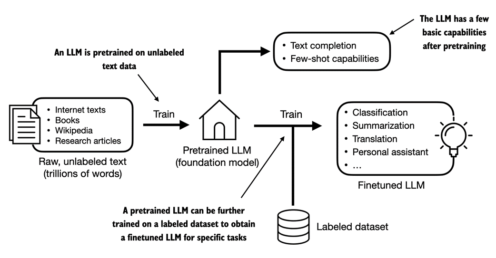

# Zbuduj duży model językowy (od podstaw)

https://livebook.manning.com/book/build-a-large-language-model-from-scratch/chapter-1/v-1/5

## 1 Zrozumienie modeli wielkojęzykowych

Ten rozdział obejmuje
• Wyjaśnienia wysokiego poziomu podstawowych pojęć stojących za dużymi modelami językowymi (LLM)
• Wgląd w architekturę transformatora, z której wywodzą się LLM typu ChatGPT
• Plan budowy LLM od podstaw

Duże modele językowe (LLM), takie jak ChatGPT, to modele głębokich sieci neuronowych opracowane w ciągu ostatnich kilku lat. Zapoczątkowali nową erę przetwarzania języka naturalnego (NLP). Przed pojawieniem się dużych modeli językowych tradycyjne metody doskonale sprawdzały się w zadaniach kategoryzacji, takich jak klasyfikacja spamu e-mailowego i proste rozpoznawanie wzorców, które można było uchwycić za pomocą ręcznie opracowanych reguł lub prostszych modeli. Jednak zazwyczaj słabo radzili sobie z zadaniami językowymi wymagającymi złożonego zrozumienia i umiejętności generowania, takimi jak analizowanie szczegółowych instrukcji, przeprowadzanie analizy kontekstowej lub tworzenie spójnego i odpowiedniego kontekstowo tekstu oryginalnego. Na przykład poprzednie generacje modeli językowych nie mogły napisać e-maila na podstawie listy słów kluczowych – zadanie to jest trywialne dla współczesnych LLM.

LLM mają niezwykłe możliwości rozumienia, generowania i interpretowania ludzkiego języka. Należy jednak wyjaśnić, że kiedy mówimy, że modele językowe „rozumieją”, mamy na myśli to, że potrafią przetwarzać i generować tekst w sposób, który wydaje się spójny i odpowiedni kontekstowo, a nie to, że posiadają ludzką świadomość lub zrozumienie.

Dzięki postępom w głębokim uczeniu się, które stanowi podzbiór uczenia maszynowego i sztucznej inteligencji (AI) skupionego na sieciach neuronowych, LLM są szkolone na ogromnych ilościach danych tekstowych. Dzięki temu LLM mogą uchwycić głębsze informacje kontekstowe i subtelności ludzkiego języka w porównaniu z poprzednimi podejściami. W rezultacie osoby LLM znacznie poprawiły wydajność w szerokim zakresie zadań NLP, w tym w tłumaczeniu tekstu, analizie nastrojów, odpowiadaniu na pytania i wielu innych.

Inną ważną różnicą między współczesnymi LLM a wcześniejszymi modelami NLP jest to, że te ostatnie były zazwyczaj projektowane do określonych zadań; podczas gdy wcześniejsze modele NLP wyróżniały się w wąskich zastosowaniach, LLM wykazują szerszą biegłość w szerokim zakresie zadań NLP.

Sukces LLM można przypisać architekturze transformatora, która leży u podstaw wielu LLM, oraz ogromnej ilości danych, na których uczą się LLM, co pozwala im uchwycić szeroką gamę niuansów językowych, kontekstów i wzorców, które byłyby trudne do ręcznego zakodowania.

To przejście w kierunku wdrażania modeli opartych na architekturze transformatora i wykorzystywania dużych zbiorów danych szkoleniowych do szkolenia LLM zasadniczo zmieniło NLP, zapewniając bardziej wydajne narzędzia do rozumienia ludzkiego języka i interakcji z nim.

Począwszy od tego rozdziału, kładziemy podwaliny pod główny cel tej książki: zrozumienie LLM poprzez wdrożenie krok po kroku w kodzie LLM podobnego do ChatGPT, opartego na architekturze transformatora.

### 1.1 Co to jest LLM?
LLM, duży model językowy, to sieć neuronowa zaprojektowana w celu rozumienia, generowania i reagowania na tekst podobny do ludzkiego. Modele te to głębokie sieci neuronowe trenowane na ogromnych ilościach danych tekstowych, czasami obejmujących duże fragmenty całego tekstu dostępnego publicznie w Internecie.

„Duży” w dużym modelu językowym odnosi się zarówno do rozmiaru modelu pod względem parametrów, jak i ogromnego zbioru danych, na którym jest on szkolony. Takie modele często mają dziesiątki, a nawet setki miliardów parametrów, czyli regulowanych wag w sieci, które są optymalizowane podczas uczenia w celu przewidzenia następnego słowa w sekwencji. Przewidywanie następnego słowa jest rozsądne, ponieważ wykorzystuje wrodzoną sekwencyjną naturę języka do uczenia modeli rozumienia kontekstu, struktury i relacji w tekście. Jest to jednak bardzo proste zadanie, dlatego dla wielu badaczy zaskakuje fakt, że pozwala na stworzenie tak wydajnych modeli. Omówimy i wdrożymy procedurę szkolenia `next-word`  w kolejnych rozdziałach krok po kroku.

LLM wykorzystują architekturę zwaną transformatorem (omówioną bardziej szczegółowo w sekcji 1.4), która pozwala im zwracać selektywną uwagę na różne części danych wejściowych podczas dokonywania przewidywań, co czyni je szczególnie biegłymi w radzeniu sobie z niuansami i złożonością ludzkiego języka.

Ponieważ LLM są w stanie generować tekst, LLM są również często określane jako forma generatywnej sztucznej inteligencji (AI), często w skrócie generatywnej AI lub GenAI. Jak pokazano na rysunku 1.1, sztuczna inteligencja obejmuje szerszą dziedzinę tworzenia maszyn, które mogą wykonywać zadania wymagające inteligencji podobnej do ludzkiej, w tym rozumienie języka, rozpoznawanie wzorców i podejmowanie decyzji, a także obejmuje poddziedziny, takie jak uczenie maszynowe i głębokie uczenie się.

Rysunek 1.1 Jak sugeruje to hierarchiczne przedstawienie relacji między różnymi dziedzinami, LLM reprezentują specyficzne zastosowanie technik głębokiego uczenia się, wykorzystując ich zdolność do przetwarzania i generowania tekstu podobnego do człowieka. Głębokie uczenie się to wyspecjalizowana gałąź uczenia maszynowego, która koncentruje się na wykorzystaniu wielowarstwowych sieci neuronowych. A uczenie maszynowe i głębokie uczenie się to dziedziny mające na celu implementację algorytmów, które umożliwiają komputerom uczenie się na podstawie danych i wykonywanie zadań, które zazwyczaj wymagają ludzkiej inteligencji. Dziedzina sztucznej inteligencji jest obecnie zdominowana przez uczenie maszynowe i głębokie uczenie się, ale obejmuje również inne podejścia, na przykład poprzez wykorzystanie systemów opartych na regułach, algorytmów genetycznych, systemów eksperckich, logiki rozmytej lub rozumowania symbolicznego.

Algorytmy stosowane do wdrażania sztucznej inteligencji są przedmiotem zainteresowania w dziedzinie uczenia maszynowego. W szczególności uczenie maszynowe obejmuje rozwój algorytmów, które mogą uczyć się i przewidywać lub podejmować decyzje na podstawie danych bez bezpośredniego programowania. Aby to zilustrować, wyobraźmy sobie filtr antyspamowy jako praktyczne zastosowanie uczenia maszynowego. Zamiast ręcznie pisać reguły identyfikujące wiadomości spamowe, algorytm uczenia maszynowego otrzymuje przykłady wiadomości e-mail oznaczonych jako spam i prawidłowych wiadomości e-mail. Minimalizując błędy w swoich przewidywaniach na zbiorze danych szkoleniowych, model uczy się rozpoznawać wzorce i cechy charakterystyczne wskazujące na spam, umożliwiając mu klasyfikowanie nowych wiadomości e-mail jako spam lub legalne.

Uczenie głębokie to podzbiór uczenia maszynowego, który koncentruje się na wykorzystaniu sieci neuronowych składających się z trzech lub więcej warstw (zwanych również głębokimi sieciami neuronowymi) do modelowania złożonych wzorców i abstrakcji w danych. W przeciwieństwie do głębokiego uczenia się, tradycyjne uczenie maszynowe wymaga ręcznej ekstrakcji funkcji. Oznacza to, że eksperci-ludzi muszą zidentyfikować i wybrać najbardziej odpowiednie cechy modelu.

Wracając do przykładu klasyfikacji spamu, w tradycyjnym uczeniu maszynowym eksperci mogą ręcznie wyodrębniać z tekstu wiadomości e-mail takie cechy, jak częstotliwość występowania określonych słów wyzwalających („nagroda”, „wygrana”, „bezpłatny”), liczba wykrzykników, użycie wszystkich wielkich słów lub obecność podejrzanych linków. Ten zbiór danych, utworzony na podstawie funkcji zdefiniowanych przez ekspertów, zostanie następnie wykorzystany do uczenia modelu. W przeciwieństwie do tradycyjnego uczenia maszynowego, głębokie uczenie się nie wymaga ręcznej ekstrakcji cech. Oznacza to, że eksperci-ludzi nie muszą identyfikować i wybierać najbardziej odpowiednich funkcji dla modelu głębokiego uczenia się

W nadchodzących sekcjach omówione zostaną niektóre problemy, jakie LLM mogą dziś rozwiązać, wyzwania, przed którymi stoją LLM, oraz ogólna architektura LLM, którą zaimplementujemy w tej książce.

### 1.2 Zastosowania LLM
Dzięki zaawansowanym możliwościom analizowania i rozumienia nieustrukturyzowanych danych tekstowych, LLM mają szeroki zakres zastosowań w różnych domenach. Obecnie studia LLM są wykorzystywane do tłumaczenia maszynowego, generowania tekstów nowatorskich (patrz rysunek 1.2), analizy nastrojów, podsumowań tekstów i wielu innych zadań. LLM zaczęto ostatnio wykorzystywać do tworzenia treści, takich jak pisanie fikcji, artykułów, a nawet kodu komputerowego.

Rysunek 1.2 Interfejsy LLM umożliwiają komunikację w języku naturalnym pomiędzy użytkownikami a systemami AI. Ten zrzut ekranu pokazuje, jak ChatGPT pisze wiersz zgodny ze specyfikacjami użytkownika.

LLM mogą również obsługiwać zaawansowane chatboty i wirtualnych asystentów, takich jak ChatGPT firmy OpenAI lub Bard firmy Google, którzy mogą odpowiadać na zapytania użytkowników i rozszerzać tradycyjne wyszukiwarki, takie jak wyszukiwarka Google lub Microsoft Bing.

Co więcej, LLM mogą być wykorzystywane do efektywnego wyszukiwania wiedzy z ogromnych tomów tekstów z wyspecjalizowanych dziedzin, takich jak medycyna czy prawo. Obejmuje to przeglądanie dokumentów, podsumowywanie długich fragmentów i odpowiadanie na pytania techniczne.

Krótko mówiąc, LLM są nieocenione w automatyzacji prawie każdego zadania obejmującego analizowanie i generowanie tekstu. Ich zastosowania są praktycznie nieograniczone, a w miarę ciągłego wprowadzania innowacji i odkrywania nowych sposobów wykorzystania tych modeli staje się jasne, że LLM mają potencjał do przedefiniowania naszego związku z technologią, czyniąc ją bardziej konwersacyjną, intuicyjną i dostępną.

W tej książce skupimy się na zrozumieniu, jak LLM działają od podstaw, kodując LLM, który może generować teksty. Dowiemy się również o technikach umożliwiających LLM przeprowadzanie zapytań, począwszy od odpowiadania na pytania po streszczanie tekstu, tłumaczenie tekstu na różne języki i nie tylko. Innymi słowy, w tej książce dowiemy się, jak działają złożeni asystenci LLM, tacy jak ChatGPT, budując krok po kroku.

### 1.3 Etapy budowy i wykorzystania LLM
Dlaczego powinniśmy budować własne LLM? Kodowanie LLM od podstaw to doskonałe ćwiczenie pozwalające zrozumieć jego mechanikę i ograniczenia. Zapewnia nam również niezbędną wiedzę do utrzymywania lub dostrajania istniejących architektur LLM typu open source do naszych własnych zestawów danych lub zadań specyficznych dla domeny.

Badania wykazały, że jeśli chodzi o wydajność modelowania, niestandardowe LLM – te dostosowane do konkretnych zadań lub dziedzin – mogą przewyższać LLM ogólnego przeznaczenia, takie jak ChatGPT, które są przeznaczone do szerokiej gamy zastosowań. Przykładami tego są BloombergGPT, która specjalizuje się w finansach, oraz LLM, które są dostosowane do odpowiadania na pytania medyczne (więcej szczegółów można znaleźć w sekcji Dalsza lektura i źródła na końcu tego rozdziału).

Ogólny proces tworzenia LLM, w tym szkolenie wstępne i dostrajanie. Termin „wstępny” w „szkoleniu wstępnym” odnosi się do fazy początkowej, w której model taki jak LLM jest szkolony na dużym, zróżnicowanym zestawie danych w celu rozwinięcia szerokiego zrozumienia języka. Ten wstępnie wyszkolony model służy następnie jako podstawowy zasób, który można dalej udoskonalać poprzez dostrajanie – proces, w którym model jest specjalnie szkolony na węższym zbiorze danych, który jest bardziej specyficzny dla konkretnych zadań lub domen. To dwuetapowe podejście do szkolenia, składające się z treningu wstępnego i dostrajania, przedstawiono na rysunku 1.3.

Rysunek 1.3 Wstępne uczenie LLM obejmuje przewidywanie następnego słowa w dużych korpusach tekstowych bez etykiet (tekst surowy). Wstępnie wytrenowany LLM można następnie dostroić przy użyciu mniejszego, oznaczonego zestawu danych.

Jak pokazano na rysunku 1.3, pierwszym krokiem w tworzeniu LLM jest nauczenie go na dużym zbiorze danych tekstowych, czasami nazywanych tekstem surowym. W tym przypadku „surowe” odnosi się do faktu, że te dane to zwykły tekst bez żadnych informacji na etykiecie[1]. (Można zastosować filtrowanie, na przykład usuwanie znaków formatujących lub dokumentów w nieznanych językach.)

Ten pierwszy etap szkolenia LLM jest również znany jako szkolenie wstępne i polega na utworzeniu wstępnego, wstępnie przeszkolonego LLM, często nazywanego modelem podstawowym lub podstawowym. Typowym przykładem takiego modelu jest model GPT-3 (prekursor ChatGPT). Model ten posiada możliwość uzupełniania tekstu, czyli dokańczania na wpół napisanego zdania podanego przez użytkownika. Ma również ograniczone możliwości strzelania kilkoma strzałami, co oznacza, że może nauczyć się wykonywania nowych zadań na podstawie zaledwie kilku przykładów, zamiast potrzebować obszernych danych szkoleniowych. Zostało to dokładniej zilustrowane w następnej sekcji, Używanie transformatorów do różnych zadań.

Po uzyskaniu wstępnie przeszkolonego LLM w wyniku szkolenia na tekstach bez etykiet możemy dalej trenować LLM na oznakowanych danych, co jest również znane jako dostrajanie.

Dwie najpopularniejsze kategorie dostrajania LLM obejmują dostrajanie instrukcji i dostrajanie zadań klasyfikacyjnych. Podczas dostrajania instrukcji oznaczony zbiór danych składa się z par instrukcji i odpowiedzi, takich jak zapytanie o przetłumaczenie tekstu, któremu towarzyszy poprawnie przetłumaczony tekst. Podczas dostrajania klasyfikacji oznaczony zestaw danych składa się z tekstów i powiązanych etykiet klas, na przykład wiadomości e-mail powiązanych z etykietami spamowymi i niespamowymi.

W tej książce omówimy obie implementacje kodu do wstępnego uczenia i dostrajania LLM, a w dalszej części tej książki zagłębimy się w specyfikę dostrajania i dostrajania instrukcji na potrzeby klasyfikacji, po wstępnym szkoleniu podstawowego LLM.

### 1.4 Wykorzystanie LLM do różnych zadań
Większość nowoczesnych LLM opiera się na architekturze transformatorowej, która jest architekturą głębokiej sieci neuronowej przedstawioną w artykule z 2017 r. Attention Is All You Need. Aby zrozumieć LLM, musimy krótko omówić oryginalny transformator, który został pierwotnie opracowany do tłumaczenia maszynowego, tłumaczącego teksty angielskie na niemiecki i francuski. Uproszczoną wersję architektury transformatora przedstawiono na rysunku 1.4.

Rysunek 1.4 Uproszczony obraz oryginalnej architektury transformatora, która jest modelem głębokiego uczenia się dla tłumaczenia językowego. Transformator składa się z dwóch części: kodera, który przetwarza tekst wejściowy i tworzy reprezentację osadzania (reprezentację numeryczną, która przechwytuje wiele różnych czynników w różnych wymiarach) tekstu, której dekoder może użyć do wygenerowania przetłumaczonego tekstu jedno słowo na raz . Należy zauważyć, że ten rysunek przedstawia końcowy etap procesu tłumaczenia, w którym dekoder musi wygenerować tylko ostatnie słowo („Beispiel”), biorąc pod uwagę oryginalny tekst wejściowy („To jest przykład”) i częściowo przetłumaczone zdanie („Das ist ein”), aby dokończyć tłumaczenie. Numeracja rysunków wskazuje kolejność przetwarzania danych i zapewnia wskazówki dotyczące optymalnej kolejności odczytywania rysunku.

Architektura transformatora przedstawiona na rysunku 1.4 składa się z dwóch podmodułów, kodera i dekodera. Moduł kodera przetwarza tekst wejściowy i koduje go w szereg reprezentacji numerycznych lub wektorów, które przechwytują informacje kontekstowe z danych wejściowych. Następnie moduł dekodera pobiera te zakodowane wektory i generuje z nich tekst wyjściowy. Na przykład w zadaniu tłumaczeniowym koder koduje tekst z języka źródłowego na wektory, a dekoder dekoduje te wektory, aby wygenerować tekst w języku docelowym. Zarówno koder, jak i dekoder składają się z wielu warstw połączonych tzw. – zwany mechanizmem samouważności. Możesz mieć wiele pytań dotyczących sposobu wstępnego przetwarzania i kodowania danych wejściowych. Zostaną one omówione krok po kroku w kolejnych rozdziałach.

Kluczowym elementem transformatorów i LLM jest mechanizm samouwagi (niepokazany), który pozwala modelowi ocenić ważność różnych słów lub tokenów w sekwencji względem siebie. Mechanizm ten umożliwia modelowi uchwycenie długoterminowych zależności i relacji kontekstowych w ramach danych wejściowych, zwiększając jego zdolność do generowania spójnych i odpowiednich kontekstowo wyników. Jednakże ze względu na jego złożoność wyjaśnienie odłożymy do rozdziału 3, gdzie krok po kroku je omówimy i wdrożymy. Ponadto omówimy i zaimplementujemy etapy wstępnego przetwarzania danych w celu utworzenia danych wejściowych modelu w Rozdziale 2, Praca z danymi tekstowymi.

Późniejsze warianty architektury transformatora, takie jak tzw. BERT (skrót od bidirectional encoder representations from transformers - dwukierunkowych reprezentacji enkoderów z transformatorów) i różne modele GPT (skrót od generative pretrained transformers - generatywnych transformatorów wstępnie trenowanych), opierały się na tej koncepcji w celu dostosowania tej architektury do różnych zadań. (Odnośniki można znaleźć w części Dalszej lektury na końcu tego rozdziału.)

BERT, zbudowany na podmodule enkodera oryginalnego transformatora, różni się podejściem szkoleniowym od GPT. Podczas gdy GPT jest przeznaczony do zadań generatywnych, BERT i jego warianty specjalizują się w przewidywaniu słów maskowanych, gdzie model przewiduje maskowane lub ukryte słowa w danym zdaniu, jak pokazano na rysunku 1.5. Ta wyjątkowa strategia szkoleniowa wyposaża BERT w mocne strony w zakresie zadań związanych z klasyfikacją tekstu, w tym przewidywaniem nastrojów i kategoryzacją dokumentów. W chwili pisania tego tekstu Twitter wykorzystuje swoje możliwości BERT do wykrywania toksycznych treści.

*Rysunek 1.5 Wizualna reprezentacja podmodułów kodera i dekodera transformatora. Po lewej stronie segment kodera stanowi przykład LLM typu BERT, które koncentrują się na przewidywaniu słów maskowanych i są używane głównie do zadań takich jak klasyfikacja tekstu. Po prawej stronie segment dekodera przedstawia LLM typu GPT, zaprojektowane do zadań generatywnych i tworzenia spójnych sekwencji tekstowych.*

Z drugiej strony GPT koncentruje się na części dekodera oryginalnej architektury transformatora i jest przeznaczony do zadań wymagających generowania tekstów. Obejmuje to tłumaczenie maszynowe, streszczanie tekstu, pisanie fikcji, pisanie kodu komputerowego i nie tylko. Architekturę GPT omówimy bardziej szczegółowo w pozostałych sekcjach tego rozdziału, a w tej książce zaimplementujemy ją od podstaw.

Modele GPT, zaprojektowane i przeszkolone głównie do wykonywania zadań uzupełniania tekstu, również wykazują niezwykłą wszechstronność swoich możliwości. Modele te doskonale radzą sobie z wykonywaniem zadań edukacyjnych zarówno typu zero-shot, jak i kilku-shot. Uczenie się od zera odnosi się do umiejętności uogólniania na całkowicie niewidoczne zadania bez żadnych wcześniejszych konkretnych przykładów. Z drugiej strony nauka polegająca na kilkukrotnym uczeniu się na podstawie minimalnej liczby przykładów dostarczonych przez użytkownika jako dane wejściowe, jak pokazano na rysunku 1.6.

*Rysunek 1.6 Oprócz uzupełniania tekstu, LLM podobne do GPT mogą rozwiązywać różne zadania w oparciu o wprowadzone dane, bez konieczności ponownego szkolenia, dostrajania lub zmian w architekturze modelu specyficznego dla zadania. Czasami pomocne jest podanie przykładów celu w danych wejściowych, co jest znane jako ustawienie kilku strzałów. Jednak LLM typu GPT są również w stanie wykonywać zadania bez konkretnego przykładu, co nazywa się ustawieniem zerowym.*

> TRANSFORMATORY KONTRA LLMS
>
> Dzisiejsze LLM opierają się na architekturze transformatora przedstawionej w poprzedniej sekcji. Dlatego też transformatory i LLM to terminy często używane w literaturze jako synonimy. Należy jednak pamiętać, że nie wszystkie transformatory są LLM, ponieważ transformatory mogą być również używane do widzenia komputerowego. Ponadto nie wszystkie LLM są transformatorami, ponieważ istnieją duże modele językowe oparte na architekturach rekurencyjnych i splotowych. Główną motywacją tych alternatywnych podejść jest poprawa wydajności obliczeniowej LLM. Czas pokaże jednak, czy te alternatywne architektury LLM będą w stanie konkurować z możliwościami rozwiązań LLM opartych na transformatorach i czy zostaną one zastosowane w praktyce. (Zainteresowani czytelnicy mogą znaleźć odniesienia do literatury opisującej te architektury w sekcji Dalsza lektura na końcu tego rozdziału.)

### 1.5 Wykorzystanie dużych zbiorów danych
Duże zbiory danych szkoleniowych dla popularnych modeli podobnych do GPT i BERT reprezentują różnorodne i wszechstronne korpusy tekstowe obejmujące miliardy słów, które obejmują szeroki wachlarz tematów oraz języków naturalnych i komputerowych. Aby podać konkretny przykład, tabela 1.1 podsumowuje zbiór danych użyty do wstępnego uczenia GPT-3, który służył jako model podstawowy dla pierwszej wersji ChatGPT.

Tabela 1.1 Zbiór danych do wstępnego szkolenia popularnego LLM GPT-3

| Nazwa zbioru danych      | Opis zbioru danych                  | Liczba tokenów | Proporcja w danych treningowych |
| ------------------------ | ----------------------------------- | -------------- | ------------------------------- |
| CommonCrawl (filtrowany) | Dane z przeszukiwania sieci         | 410 miliardów  | 60%                             |
| WebText2                 | Dane z przeszukiwania sieci         | 19 miliardów   | 22%                             |
| Books1                   | Korpus książek oparty na internetie | 12 miliardów   | 8%                              |
| Books2                   | Korpus książek oparty na internetie | 55 miliardów   | 8%                              |
| Wikipedia                | Tekst wysokiej jakości              | 3 miliardy     | 3%                              |

Tabela 1.1 przedstawia liczbę tokenów, gdzie token to jednostka tekstu odczytywana przez model, a liczba tokenów w zbiorze danych jest w przybliżeniu równa liczbie słów i znaków interpunkcyjnych w tekście. Tokenizację, czyli proces konwersji tekstu na tokeny, omówimy bardziej szczegółowo w następnym rozdziale.

Główny wniosek jest taki, że skala i różnorodność tego zbioru danych szkoleniowych pozwala tym modelom dobrze wykonywać różnorodne zadania, w tym składnię języka, semantykę i kontekst, a nawet niektóre wymagające wiedzy ogólnej.

> SZCZEGÓŁY ZBIORU DANYCH GPT-3
>
> Należy zauważyć, że każdy podzbiór w tabeli 1.1 został pobrany z 300 miliardów tokenów, co oznacza, że nie wszystkie zbiory danych zostały obejrzane w całości, a niektóre były widziane wielokrotnie. Kolumna proporcji, pomijając zaokrąglenia, dodaje 100%. Dla porównania, 410 miliardów tokenów w zbiorze danych CommonCrawl wymaga około 570 GB pamięci. Późniejsze modele oparte na GPT-3, na przykład LLaMA firmy Meta, zawierają również artykuły badawcze z Arxiv (92 GB) oraz pytania i odpowiedzi dotyczące kodu ze StackExchange (78 GB).
>
> Korpus Wikipedii składa się z Wikipedii w języku angielskim. Chociaż autorzy artykułu GPT-3 nie podali bliżej szczegółów, Books1 to prawdopodobnie próbka z Projektu Gutenberg (https://www.gutenberg.org/), a Books2 prawdopodobnie pochodzi z Libgen (https://en .wikipedia.org/wiki/Library_Genesis). CommonCrawl to filtrowany podzbiór bazy danych CommonCrawl (https://commoncrawl.org/), a WebText2 to tekst stron internetowych ze wszystkich wychodzących linków do Reddita z postów z liczbą głosów pozytywnych wynoszącą co najmniej 3.
>
> Autorzy artykułu GPT-3 nie udostępnili zbioru danych szkoleniowych, ale porównywalnym zbiorem danych, który jest publicznie dostępny, jest The Pile (https://pile.eleuther.ai/). Kolekcja może jednak zawierać dzieła chronione prawem autorskim, a dokładne warunki użytkowania mogą zależeć od zamierzonego przypadku użycia i kraju. Więcej informacji można znaleźć w dyskusji HackerNews pod adresem https://news.ycombinator.com/item?id=25607809.

Wstępnie przeszkolony charakter tych modeli sprawia, że są one niezwykle wszechstronne w zakresie dalszego dostrajania dalszych zadań, dlatego są one również znane jako modele podstawowe lub podstawowe. Przygotowanie do szkolenia LLM wymaga dostępu do znacznych zasobów i jest bardzo kosztowne. Na przykład koszt wstępnego szkolenia GPT-3 szacuje się na 4,6 miliona dolarów w przeliczeniu na kredyty na przetwarzanie w chmurze[2].

Dobra wiadomość jest taka, że wiele wstępnie wyszkolonych LLM, dostępnych jako modele typu open source, można używać jako narzędzi ogólnego przeznaczenia do pisania, wyodrębniania i edytowania tekstów, które nie były częścią danych szkoleniowych. Ponadto LLM można dostosować do konkretnych zadań ze stosunkowo mniejszymi zbiorami danych, zmniejszając potrzebne zasoby obliczeniowe i poprawiając wydajność konkretnego zadania.

W tej książce zaimplementujemy kod do wstępnego uczenia i użyjemy go do wstępnego uczenia LLM do celów edukacyjnych. Wszystkie obliczenia będą możliwe do wykonania na sprzęcie konsumenckim. Po zaimplementowaniu kodu do uczenia wstępnego dowiemy się, jak ponownie wykorzystywać ogólnodostępne wagi modeli i ładować je do architektury, którą będziemy wdrażać, co pozwoli nam pominąć kosztowny etap szkolenia wstępnego podczas dostrajania LLM w dalszej części tej książki.

### 1.6 Bliższe spojrzenie na architekturę GPT
Poprzednio w tym rozdziale wspominaliśmy o terminach modele podobne do GPT, GPT-3 i ChatGPT. Przyjrzyjmy się teraz bliżej ogólnej architekturze GPT. Po pierwsze, GPT oznacza Generatywny Pretrained Transformer i został pierwotnie wprowadzony w następującym artykule:

• Poprawa zrozumienia języka poprzez generatywne szkolenie wstępne (2018) Radford i in. z OpenAI, http://cdn.openai.com/research-covers/language-unsupervised/language_understanding_paper.pdf

GPT-3 to powiększona wersja tego modelu, która ma więcej parametrów i została przeszkolona na większym zbiorze danych. Oryginalny model ChatGPT został stworzony poprzez dostrojenie GPT-3 na dużym zestawie danych instrukcji przy użyciu metody z artykułu OpenAI InstructGPT, który omówimy bardziej szczegółowo w Rozdziale 8, Dostrajanie za pomocą informacji zwrotnych od ludzi w celu wykonania instrukcji. Jak widzieliśmy wcześniej na rysunku 1.6, modele te są kompetentnymi modelami uzupełniania tekstu i mogą wykonywać inne zadania, takie jak poprawianie pisowni, klasyfikacja lub tłumaczenie językowe. Jest to naprawdę niezwykłe, biorąc pod uwagę, że modele GPT są wstępnie szkolone w oparciu o stosunkowo proste zadanie przewidywania następnego słowa, jak pokazano na rysunku 1.7.