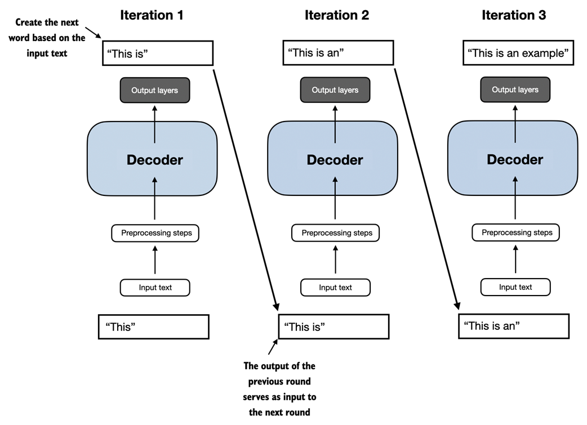
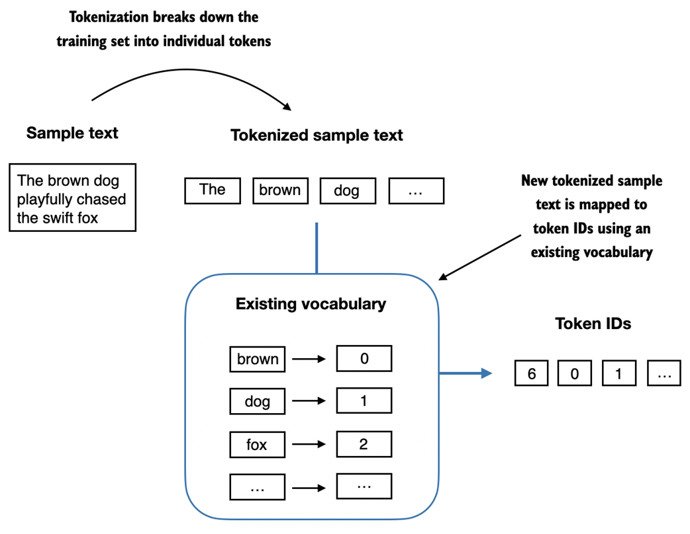
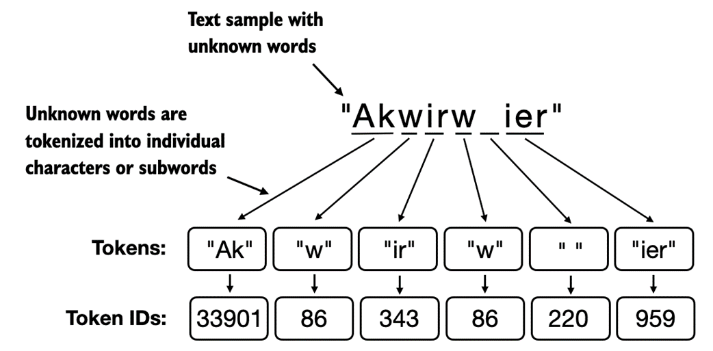
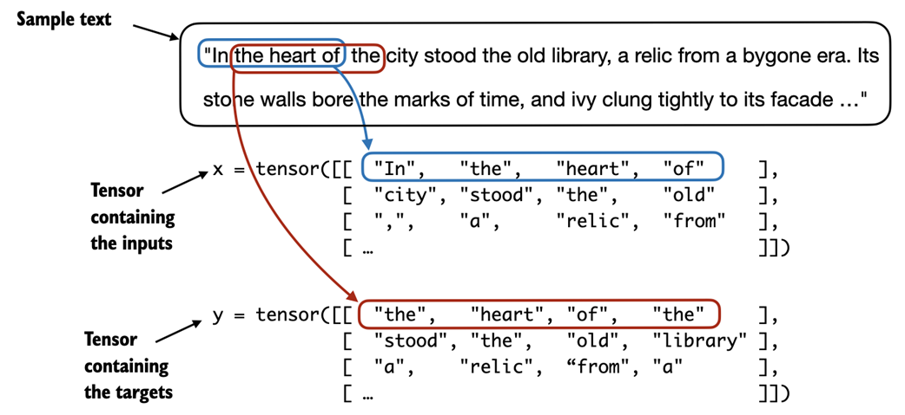

# Zbuduj duży model językowy (od podstaw)

https://livebook.manning.com/book/build-a-large-language-model-from-scratch/chapter-1/v-1/5

## 1 Zrozumienie modeli wielkojęzykowych

Ten rozdział obejmuje
• Wyjaśnienia wysokiego poziomu podstawowych pojęć stojących za dużymi modelami językowymi (LLM)
• Wgląd w architekturę transformatora, z której wywodzą się LLM typu ChatGPT
• Plan budowy LLM od podstaw

Duże modele językowe (LLM), takie jak ChatGPT, to modele głębokich sieci neuronowych opracowane w ciągu ostatnich kilku lat. Zapoczątkowali nową erę przetwarzania języka naturalnego (NLP). Przed pojawieniem się dużych modeli językowych tradycyjne metody doskonale sprawdzały się w zadaniach kategoryzacji, takich jak klasyfikacja spamu e-mailowego i proste rozpoznawanie wzorców, które można było uchwycić za pomocą ręcznie opracowanych reguł lub prostszych modeli. Jednak zazwyczaj słabo radzili sobie z zadaniami językowymi wymagającymi złożonego zrozumienia i umiejętności generowania, takimi jak analizowanie szczegółowych instrukcji, przeprowadzanie analizy kontekstowej lub tworzenie spójnego i odpowiedniego kontekstowo tekstu oryginalnego. Na przykład poprzednie generacje modeli językowych nie mogły napisać e-maila na podstawie listy słów kluczowych – zadanie to jest trywialne dla współczesnych LLM.

LLM mają niezwykłe możliwości rozumienia, generowania i interpretowania ludzkiego języka. Należy jednak wyjaśnić, że kiedy mówimy, że modele językowe „rozumieją”, mamy na myśli to, że potrafią przetwarzać i generować tekst w sposób, który wydaje się spójny i odpowiedni kontekstowo, a nie to, że posiadają ludzką świadomość lub zrozumienie.

Dzięki postępom w głębokim uczeniu się, które stanowi podzbiór uczenia maszynowego i sztucznej inteligencji (AI) skupionego na sieciach neuronowych, LLM są szkolone na ogromnych ilościach danych tekstowych. Dzięki temu LLM mogą uchwycić głębsze informacje kontekstowe i subtelności ludzkiego języka w porównaniu z poprzednimi podejściami. W rezultacie osoby LLM znacznie poprawiły wydajność w szerokim zakresie zadań NLP, w tym w tłumaczeniu tekstu, analizie nastrojów, odpowiadaniu na pytania i wielu innych.

Inną ważną różnicą między współczesnymi LLM a wcześniejszymi modelami NLP jest to, że te ostatnie były zazwyczaj projektowane do określonych zadań; podczas gdy wcześniejsze modele NLP wyróżniały się w wąskich zastosowaniach, LLM wykazują szerszą biegłość w szerokim zakresie zadań NLP.

Sukces LLM można przypisać architekturze transformatora, która leży u podstaw wielu LLM, oraz ogromnej ilości danych, na których uczą się LLM, co pozwala im uchwycić szeroką gamę niuansów językowych, kontekstów i wzorców, które byłyby trudne do ręcznego zakodowania.

To przejście w kierunku wdrażania modeli opartych na architekturze transformatora i wykorzystywania dużych zbiorów danych szkoleniowych do szkolenia LLM zasadniczo zmieniło NLP, zapewniając bardziej wydajne narzędzia do rozumienia ludzkiego języka i interakcji z nim.

Począwszy od tego rozdziału, kładziemy podwaliny pod główny cel tej książki: zrozumienie LLM poprzez wdrożenie krok po kroku w kodzie LLM podobnego do ChatGPT, opartego na architekturze transformatora.

### 1.1 Co to jest LLM?
LLM, duży model językowy, to sieć neuronowa zaprojektowana w celu rozumienia, generowania i reagowania na tekst podobny do ludzkiego. Modele te to głębokie sieci neuronowe trenowane na ogromnych ilościach danych tekstowych, czasami obejmujących duże fragmenty całego tekstu dostępnego publicznie w Internecie.

„Duży” w dużym modelu językowym odnosi się zarówno do rozmiaru modelu pod względem parametrów, jak i ogromnego zbioru danych, na którym jest on szkolony. Takie modele często mają dziesiątki, a nawet setki miliardów parametrów, czyli regulowanych wag w sieci, które są optymalizowane podczas uczenia w celu przewidzenia następnego słowa w sekwencji. Przewidywanie następnego słowa jest rozsądne, ponieważ wykorzystuje wrodzoną sekwencyjną naturę języka do uczenia modeli rozumienia kontekstu, struktury i relacji w tekście. Jest to jednak bardzo proste zadanie, dlatego dla wielu badaczy zaskakuje fakt, że pozwala na stworzenie tak wydajnych modeli. Omówimy i wdrożymy procedurę szkolenia `next-word`  w kolejnych rozdziałach krok po kroku.

LLM wykorzystują architekturę zwaną transformatorem (omówioną bardziej szczegółowo w sekcji 1.4), która pozwala im zwracać selektywną uwagę na różne części danych wejściowych podczas dokonywania przewidywań, co czyni je szczególnie biegłymi w radzeniu sobie z niuansami i złożonością ludzkiego języka.

Ponieważ LLM są w stanie generować tekst, LLM są również często określane jako forma generatywnej sztucznej inteligencji (AI), często w skrócie generatywnej AI lub GenAI. Jak pokazano na rysunku 1.1, sztuczna inteligencja obejmuje szerszą dziedzinę tworzenia maszyn, które mogą wykonywać zadania wymagające inteligencji podobnej do ludzkiej, w tym rozumienie języka, rozpoznawanie wzorców i podejmowanie decyzji, a także obejmuje poddziedziny, takie jak uczenie maszynowe i głębokie uczenie się.

Rysunek 1.1 Jak sugeruje to hierarchiczne przedstawienie relacji między różnymi dziedzinami, LLM reprezentują specyficzne zastosowanie technik głębokiego uczenia się, wykorzystując ich zdolność do przetwarzania i generowania tekstu podobnego do człowieka. Głębokie uczenie się to wyspecjalizowana gałąź uczenia maszynowego, która koncentruje się na wykorzystaniu wielowarstwowych sieci neuronowych. A uczenie maszynowe i głębokie uczenie się to dziedziny mające na celu implementację algorytmów, które umożliwiają komputerom uczenie się na podstawie danych i wykonywanie zadań, które zazwyczaj wymagają ludzkiej inteligencji. Dziedzina sztucznej inteligencji jest obecnie zdominowana przez uczenie maszynowe i głębokie uczenie się, ale obejmuje również inne podejścia, na przykład poprzez wykorzystanie systemów opartych na regułach, algorytmów genetycznych, systemów eksperckich, logiki rozmytej lub rozumowania symbolicznego.


Algorytmy stosowane do wdrażania sztucznej inteligencji są przedmiotem zainteresowania w dziedzinie uczenia maszynowego. W szczególności uczenie maszynowe obejmuje rozwój algorytmów, które mogą uczyć się i przewidywać lub podejmować decyzje na podstawie danych bez bezpośredniego programowania. Aby to zilustrować, wyobraźmy sobie filtr antyspamowy jako praktyczne zastosowanie uczenia maszynowego. Zamiast ręcznie pisać reguły identyfikujące wiadomości spamowe, algorytm uczenia maszynowego otrzymuje przykłady wiadomości e-mail oznaczonych jako spam i prawidłowych wiadomości e-mail. Minimalizując błędy w swoich przewidywaniach na zbiorze danych szkoleniowych, model uczy się rozpoznawać wzorce i cechy charakterystyczne wskazujące na spam, umożliwiając mu klasyfikowanie nowych wiadomości e-mail jako spam lub legalne.

Uczenie głębokie to podzbiór uczenia maszynowego, który koncentruje się na wykorzystaniu sieci neuronowych składających się z trzech lub więcej warstw (zwanych również głębokimi sieciami neuronowymi) do modelowania złożonych wzorców i abstrakcji w danych. W przeciwieństwie do głębokiego uczenia się, tradycyjne uczenie maszynowe wymaga ręcznej ekstrakcji funkcji. Oznacza to, że eksperci-ludzi muszą zidentyfikować i wybrać najbardziej odpowiednie cechy modelu.

Wracając do przykładu klasyfikacji spamu, w tradycyjnym uczeniu maszynowym eksperci mogą ręcznie wyodrębniać z tekstu wiadomości e-mail takie cechy, jak częstotliwość występowania określonych słów wyzwalających („nagroda”, „wygrana”, „bezpłatny”), liczba wykrzykników, użycie wszystkich wielkich słów lub obecność podejrzanych linków. Ten zbiór danych, utworzony na podstawie funkcji zdefiniowanych przez ekspertów, zostanie następnie wykorzystany do uczenia modelu. W przeciwieństwie do tradycyjnego uczenia maszynowego, głębokie uczenie się nie wymaga ręcznej ekstrakcji cech. Oznacza to, że eksperci-ludzi nie muszą identyfikować i wybierać najbardziej odpowiednich funkcji dla modelu głębokiego uczenia się

W nadchodzących sekcjach omówione zostaną niektóre problemy, jakie LLM mogą dziś rozwiązać, wyzwania, przed którymi stoją LLM, oraz ogólna architektura LLM, którą zaimplementujemy w tej książce.

### 1.2 Zastosowania LLM
Dzięki zaawansowanym możliwościom analizowania i rozumienia nieustrukturyzowanych danych tekstowych, LLM mają szeroki zakres zastosowań w różnych domenach. Obecnie studia LLM są wykorzystywane do tłumaczenia maszynowego, generowania tekstów nowatorskich (patrz rysunek 1.2), analizy nastrojów, podsumowań tekstów i wielu innych zadań. LLM zaczęto ostatnio wykorzystywać do tworzenia treści, takich jak pisanie fikcji, artykułów, a nawet kodu komputerowego.

Rysunek 1.2 Interfejsy LLM umożliwiają komunikację w języku naturalnym pomiędzy użytkownikami a systemami AI. Ten zrzut ekranu pokazuje, jak ChatGPT pisze wiersz zgodny ze specyfikacjami użytkownika.


LLM mogą również obsługiwać zaawansowane chatboty i wirtualnych asystentów, takich jak ChatGPT firmy OpenAI lub Bard firmy Google, którzy mogą odpowiadać na zapytania użytkowników i rozszerzać tradycyjne wyszukiwarki, takie jak wyszukiwarka Google lub Microsoft Bing.

Co więcej, LLM mogą być wykorzystywane do efektywnego wyszukiwania wiedzy z ogromnych tomów tekstów z wyspecjalizowanych dziedzin, takich jak medycyna czy prawo. Obejmuje to przeglądanie dokumentów, podsumowywanie długich fragmentów i odpowiadanie na pytania techniczne.

Krótko mówiąc, LLM są nieocenione w automatyzacji prawie każdego zadania obejmującego analizowanie i generowanie tekstu. Ich zastosowania są praktycznie nieograniczone, a w miarę ciągłego wprowadzania innowacji i odkrywania nowych sposobów wykorzystania tych modeli staje się jasne, że LLM mają potencjał do przedefiniowania naszego związku z technologią, czyniąc ją bardziej konwersacyjną, intuicyjną i dostępną.

W tej książce skupimy się na zrozumieniu, jak LLM działają od podstaw, kodując LLM, który może generować teksty. Dowiemy się również o technikach umożliwiających LLM przeprowadzanie zapytań, począwszy od odpowiadania na pytania po streszczanie tekstu, tłumaczenie tekstu na różne języki i nie tylko. Innymi słowy, w tej książce dowiemy się, jak działają złożeni asystenci LLM, tacy jak ChatGPT, budując krok po kroku.

### 1.3 Etapy budowy i wykorzystania LLM
Dlaczego powinniśmy budować własne LLM? Kodowanie LLM od podstaw to doskonałe ćwiczenie pozwalające zrozumieć jego mechanikę i ograniczenia. Zapewnia nam również niezbędną wiedzę do utrzymywania lub dostrajania istniejących architektur LLM typu open source do naszych własnych zestawów danych lub zadań specyficznych dla domeny.

Badania wykazały, że jeśli chodzi o wydajność modelowania, niestandardowe LLM – te dostosowane do konkretnych zadań lub dziedzin – mogą przewyższać LLM ogólnego przeznaczenia, takie jak ChatGPT, które są przeznaczone do szerokiej gamy zastosowań. Przykładami tego są BloombergGPT, która specjalizuje się w finansach, oraz LLM, które są dostosowane do odpowiadania na pytania medyczne (więcej szczegółów można znaleźć w sekcji Dalsza lektura i źródła na końcu tego rozdziału).

Ogólny proces tworzenia LLM, w tym szkolenie wstępne i dostrajanie. Termin „wstępny” w „szkoleniu wstępnym” odnosi się do fazy początkowej, w której model taki jak LLM jest szkolony na dużym, zróżnicowanym zestawie danych w celu rozwinięcia szerokiego zrozumienia języka. Ten wstępnie wyszkolony model służy następnie jako podstawowy zasób, który można dalej udoskonalać poprzez dostrajanie – proces, w którym model jest specjalnie szkolony na węższym zbiorze danych, który jest bardziej specyficzny dla konkretnych zadań lub domen. To dwuetapowe podejście do szkolenia, składające się z treningu wstępnego i dostrajania, przedstawiono na rysunku 1.3.

Rysunek 1.3 Wstępne uczenie LLM obejmuje przewidywanie następnego słowa w dużych korpusach tekstowych bez etykiet (tekst surowy). Wstępnie wytrenowany LLM można następnie dostroić przy użyciu mniejszego, oznaczonego zestawu danych.


Jak pokazano na rysunku 1.3, pierwszym krokiem w tworzeniu LLM jest nauczenie go na dużym zbiorze danych tekstowych, czasami nazywanych tekstem surowym. W tym przypadku „surowe” odnosi się do faktu, że te dane to zwykły tekst bez żadnych informacji na etykiecie[1]. (Można zastosować filtrowanie, na przykład usuwanie znaków formatujących lub dokumentów w nieznanych językach.)

Ten pierwszy etap szkolenia LLM jest również znany jako szkolenie wstępne i polega na utworzeniu wstępnego, wstępnie przeszkolonego LLM, często nazywanego modelem podstawowym lub podstawowym. Typowym przykładem takiego modelu jest model GPT-3 (prekursor ChatGPT). Model ten posiada możliwość uzupełniania tekstu, czyli dokańczania na wpół napisanego zdania podanego przez użytkownika. Ma również ograniczone możliwości strzelania kilkoma strzałami, co oznacza, że może nauczyć się wykonywania nowych zadań na podstawie zaledwie kilku przykładów, zamiast potrzebować obszernych danych szkoleniowych. Zostało to dokładniej zilustrowane w następnej sekcji, Używanie transformatorów do różnych zadań.

Po uzyskaniu wstępnie przeszkolonego LLM w wyniku szkolenia na tekstach bez etykiet możemy dalej trenować LLM na oznakowanych danych, co jest również znane jako dostrajanie.

Dwie najpopularniejsze kategorie dostrajania LLM obejmują dostrajanie instrukcji i dostrajanie zadań klasyfikacyjnych. Podczas dostrajania instrukcji oznaczony zbiór danych składa się z par instrukcji i odpowiedzi, takich jak zapytanie o przetłumaczenie tekstu, któremu towarzyszy poprawnie przetłumaczony tekst. Podczas dostrajania klasyfikacji oznaczony zestaw danych składa się z tekstów i powiązanych etykiet klas, na przykład wiadomości e-mail powiązanych z etykietami spamowymi i niespamowymi.

W tej książce omówimy obie implementacje kodu do wstępnego uczenia i dostrajania LLM, a w dalszej części tej książki zagłębimy się w specyfikę dostrajania i dostrajania instrukcji na potrzeby klasyfikacji, po wstępnym szkoleniu podstawowego LLM.

### 1.4 Wykorzystanie LLM do różnych zadań
Większość nowoczesnych LLM opiera się na architekturze transformatorowej, która jest architekturą głębokiej sieci neuronowej przedstawioną w artykule z 2017 r. Attention Is All You Need. Aby zrozumieć LLM, musimy krótko omówić oryginalny transformator, który został pierwotnie opracowany do tłumaczenia maszynowego, tłumaczącego teksty angielskie na niemiecki i francuski. Uproszczoną wersję architektury transformatora przedstawiono na rysunku 1.4.

Rysunek 1.4 Uproszczony obraz oryginalnej architektury transformatora, która jest modelem głębokiego uczenia się dla tłumaczenia językowego. Transformator składa się z dwóch części: kodera, który przetwarza tekst wejściowy i tworzy reprezentację osadzania (reprezentację numeryczną, która przechwytuje wiele różnych czynników w różnych wymiarach) tekstu, której dekoder może użyć do wygenerowania przetłumaczonego tekstu jedno słowo na raz . Należy zauważyć, że ten rysunek przedstawia końcowy etap procesu tłumaczenia, w którym dekoder musi wygenerować tylko ostatnie słowo („Beispiel”), biorąc pod uwagę oryginalny tekst wejściowy („To jest przykład”) i częściowo przetłumaczone zdanie („Das ist ein”), aby dokończyć tłumaczenie. Numeracja rysunków wskazuje kolejność przetwarzania danych i zapewnia wskazówki dotyczące optymalnej kolejności odczytywania rysunku.


Architektura transformatora przedstawiona na rysunku 1.4 składa się z dwóch podmodułów, kodera i dekodera. Moduł kodera przetwarza tekst wejściowy i koduje go w szereg reprezentacji numerycznych lub wektorów, które przechwytują informacje kontekstowe z danych wejściowych. Następnie moduł dekodera pobiera te zakodowane wektory i generuje z nich tekst wyjściowy. Na przykład w zadaniu tłumaczeniowym koder koduje tekst z języka źródłowego na wektory, a dekoder dekoduje te wektory, aby wygenerować tekst w języku docelowym. Zarówno koder, jak i dekoder składają się z wielu warstw połączonych tzw. – zwany mechanizmem samouważności. Możesz mieć wiele pytań dotyczących sposobu wstępnego przetwarzania i kodowania danych wejściowych. Zostaną one omówione krok po kroku w kolejnych rozdziałach.

Kluczowym elementem transformatorów i LLM jest mechanizm samouwagi (niepokazany), który pozwala modelowi ocenić ważność różnych słów lub tokenów w sekwencji względem siebie. Mechanizm ten umożliwia modelowi uchwycenie długoterminowych zależności i relacji kontekstowych w ramach danych wejściowych, zwiększając jego zdolność do generowania spójnych i odpowiednich kontekstowo wyników. Jednakże ze względu na jego złożoność wyjaśnienie odłożymy do rozdziału 3, gdzie krok po kroku je omówimy i wdrożymy. Ponadto omówimy i zaimplementujemy etapy wstępnego przetwarzania danych w celu utworzenia danych wejściowych modelu w Rozdziale 2, Praca z danymi tekstowymi.

Późniejsze warianty architektury transformatora, takie jak tzw. BERT (skrót od bidirectional encoder representations from transformers - dwukierunkowych reprezentacji enkoderów z transformatorów) i różne modele GPT (skrót od generative pretrained transformers - generatywnych transformatorów wstępnie trenowanych), opierały się na tej koncepcji w celu dostosowania tej architektury do różnych zadań. (Odnośniki można znaleźć w części Dalszej lektury na końcu tego rozdziału.)

BERT, zbudowany na podmodule enkodera oryginalnego transformatora, różni się podejściem szkoleniowym od GPT. Podczas gdy GPT jest przeznaczony do zadań generatywnych, BERT i jego warianty specjalizują się w przewidywaniu słów maskowanych, gdzie model przewiduje maskowane lub ukryte słowa w danym zdaniu, jak pokazano na rysunku 1.5. Ta wyjątkowa strategia szkoleniowa wyposaża BERT w mocne strony w zakresie zadań związanych z klasyfikacją tekstu, w tym przewidywaniem nastrojów i kategoryzacją dokumentów. W chwili pisania tego tekstu Twitter wykorzystuje swoje możliwości BERT do wykrywania toksycznych treści.

*Rysunek 1.5 Wizualna reprezentacja podmodułów kodera i dekodera transformatora. Po lewej stronie segment kodera stanowi przykład LLM typu BERT, które koncentrują się na przewidywaniu słów maskowanych i są używane głównie do zadań takich jak klasyfikacja tekstu. Po prawej stronie segment dekodera przedstawia LLM typu GPT, zaprojektowane do zadań generatywnych i tworzenia spójnych sekwencji tekstowych.*


Z drugiej strony GPT koncentruje się na części dekodera oryginalnej architektury transformatora i jest przeznaczony do zadań wymagających generowania tekstów. Obejmuje to tłumaczenie maszynowe, streszczanie tekstu, pisanie fikcji, pisanie kodu komputerowego i nie tylko. Architekturę GPT omówimy bardziej szczegółowo w pozostałych sekcjach tego rozdziału, a w tej książce zaimplementujemy ją od podstaw.

Modele GPT, zaprojektowane i przeszkolone głównie do wykonywania zadań uzupełniania tekstu, również wykazują niezwykłą wszechstronność swoich możliwości. Modele te doskonale radzą sobie z wykonywaniem zadań edukacyjnych zarówno typu zero-shot, jak i kilku-shot. Uczenie się od zera odnosi się do umiejętności uogólniania na całkowicie niewidoczne zadania bez żadnych wcześniejszych konkretnych przykładów. Z drugiej strony nauka polegająca na kilkukrotnym uczeniu się na podstawie minimalnej liczby przykładów dostarczonych przez użytkownika jako dane wejściowe, jak pokazano na rysunku 1.6.

*Rysunek 1.6 Oprócz uzupełniania tekstu, LLM podobne do GPT mogą rozwiązywać różne zadania w oparciu o wprowadzone dane, bez konieczności ponownego szkolenia, dostrajania lub zmian w architekturze modelu specyficznego dla zadania. Czasami pomocne jest podanie przykładów celu w danych wejściowych, co jest znane jako ustawienie kilku strzałów. Jednak LLM typu GPT są również w stanie wykonywać zadania bez konkretnego przykładu, co nazywa się ustawieniem zerowym.*


> TRANSFORMATORY KONTRA LLMS
>
> Dzisiejsze LLM opierają się na architekturze transformatora przedstawionej w poprzedniej sekcji. Dlatego też transformatory i LLM to terminy często używane w literaturze jako synonimy. Należy jednak pamiętać, że nie wszystkie transformatory są LLM, ponieważ transformatory mogą być również używane do widzenia komputerowego. Ponadto nie wszystkie LLM są transformatorami, ponieważ istnieją duże modele językowe oparte na architekturach rekurencyjnych i splotowych. Główną motywacją tych alternatywnych podejść jest poprawa wydajności obliczeniowej LLM. Czas pokaże jednak, czy te alternatywne architektury LLM będą w stanie konkurować z możliwościami rozwiązań LLM opartych na transformatorach i czy zostaną one zastosowane w praktyce. (Zainteresowani czytelnicy mogą znaleźć odniesienia do literatury opisującej te architektury w sekcji Dalsza lektura na końcu tego rozdziału.)

### 1.5 Wykorzystanie dużych zbiorów danych
Duże zbiory danych szkoleniowych dla popularnych modeli podobnych do GPT i BERT reprezentują różnorodne i wszechstronne korpusy tekstowe obejmujące miliardy słów, które obejmują szeroki wachlarz tematów oraz języków naturalnych i komputerowych. Aby podać konkretny przykład, tabela 1.1 podsumowuje zbiór danych użyty do wstępnego uczenia GPT-3, który służył jako model podstawowy dla pierwszej wersji ChatGPT.

Tabela 1.1 Zbiór danych do wstępnego szkolenia popularnego LLM GPT-3


| Nazwa zbioru danych      | Opis zbioru danych                  | Liczba tokenów | Proporcja w danych treningowych |
| ------------------------ | ----------------------------------- | -------------- | ------------------------------- |
| CommonCrawl (filtrowany) | Dane z przeszukiwania sieci         | 410 miliardów  | 60%                             |
| WebText2                 | Dane z przeszukiwania sieci         | 19 miliardów   | 22%                             |
| Books1                   | Korpus książek oparty na internetie | 12 miliardów   | 8%                              |
| Books2                   | Korpus książek oparty na internetie | 55 miliardów   | 8%                              |
| Wikipedia                | Tekst wysokiej jakości              | 3 miliardy     | 3%                              |

Tabela 1.1 przedstawia liczbę tokenów, gdzie token to jednostka tekstu odczytywana przez model, a liczba tokenów w zbiorze danych jest w przybliżeniu równa liczbie słów i znaków interpunkcyjnych w tekście. Tokenizację, czyli proces konwersji tekstu na tokeny, omówimy bardziej szczegółowo w następnym rozdziale.

Główny wniosek jest taki, że skala i różnorodność tego zbioru danych szkoleniowych pozwala tym modelom dobrze wykonywać różnorodne zadania, w tym składnię języka, semantykę i kontekst, a nawet niektóre wymagające wiedzy ogólnej.

> SZCZEGÓŁY ZBIORU DANYCH GPT-3
>
> Należy zauważyć, że każdy podzbiór w tabeli 1.1 został pobrany z 300 miliardów tokenów, co oznacza, że nie wszystkie zbiory danych zostały obejrzane w całości, a niektóre były widziane wielokrotnie. Kolumna proporcji, pomijając zaokrąglenia, dodaje 100%. Dla porównania, 410 miliardów tokenów w zbiorze danych CommonCrawl wymaga około 570 GB pamięci. Późniejsze modele oparte na GPT-3, na przykład LLaMA firmy Meta, zawierają również artykuły badawcze z Arxiv (92 GB) oraz pytania i odpowiedzi dotyczące kodu ze StackExchange (78 GB).
>
> Korpus Wikipedii składa się z Wikipedii w języku angielskim. Chociaż autorzy artykułu GPT-3 nie podali bliżej szczegółów, Books1 to prawdopodobnie próbka z Projektu Gutenberg (https://www.gutenberg.org/), a Books2 prawdopodobnie pochodzi z Libgen (https://en .wikipedia.org/wiki/Library_Genesis). CommonCrawl to filtrowany podzbiór bazy danych CommonCrawl (https://commoncrawl.org/), a WebText2 to tekst stron internetowych ze wszystkich wychodzących linków do Reddita z postów z liczbą głosów pozytywnych wynoszącą co najmniej 3.
>
> Autorzy artykułu GPT-3 nie udostępnili zbioru danych szkoleniowych, ale porównywalnym zbiorem danych, który jest publicznie dostępny, jest The Pile (https://pile.eleuther.ai/). Kolekcja może jednak zawierać dzieła chronione prawem autorskim, a dokładne warunki użytkowania mogą zależeć od zamierzonego przypadku użycia i kraju. Więcej informacji można znaleźć w dyskusji HackerNews pod adresem https://news.ycombinator.com/item?id=25607809.

Wstępnie przeszkolony charakter tych modeli sprawia, że są one niezwykle wszechstronne w zakresie dalszego dostrajania dalszych zadań, dlatego są one również znane jako modele podstawowe lub podstawowe. Przygotowanie do szkolenia LLM wymaga dostępu do znacznych zasobów i jest bardzo kosztowne. Na przykład koszt wstępnego szkolenia GPT-3 szacuje się na 4,6 miliona dolarów w przeliczeniu na kredyty na przetwarzanie w chmurze[2].

Dobra wiadomość jest taka, że wiele wstępnie wyszkolonych LLM, dostępnych jako modele typu open source, można używać jako narzędzi ogólnego przeznaczenia do pisania, wyodrębniania i edytowania tekstów, które nie były częścią danych szkoleniowych. Ponadto LLM można dostosować do konkretnych zadań ze stosunkowo mniejszymi zbiorami danych, zmniejszając potrzebne zasoby obliczeniowe i poprawiając wydajność konkretnego zadania.

W tej książce zaimplementujemy kod do wstępnego uczenia i użyjemy go do wstępnego uczenia LLM do celów edukacyjnych. Wszystkie obliczenia będą możliwe do wykonania na sprzęcie konsumenckim. Po zaimplementowaniu kodu do uczenia wstępnego dowiemy się, jak ponownie wykorzystywać ogólnodostępne wagi modeli i ładować je do architektury, którą będziemy wdrażać, co pozwoli nam pominąć kosztowny etap szkolenia wstępnego podczas dostrajania LLM w dalszej części tej książki.

### 1.6 Bliższe spojrzenie na architekturę GPT
Poprzednio w tym rozdziale wspominaliśmy o terminach modele podobne do GPT, GPT-3 i ChatGPT. Przyjrzyjmy się teraz bliżej ogólnej architekturze GPT. Po pierwsze, GPT oznacza Generatywny Pretrained Transformer i został pierwotnie wprowadzony w następującym artykule:

• Poprawa zrozumienia języka poprzez generatywne szkolenie wstępne (2018) Radford i in. z OpenAI, http://cdn.openai.com/research-covers/language-unsupervised/language_understanding_paper.pdf

GPT-3 to powiększona wersja tego modelu, która ma więcej parametrów i została przeszkolona na większym zbiorze danych. Oryginalny model ChatGPT został stworzony poprzez dostrojenie GPT-3 na dużym zestawie danych instrukcji przy użyciu metody z artykułu OpenAI InstructGPT, który omówimy bardziej szczegółowo w Rozdziale 8, Dostrajanie za pomocą informacji zwrotnych od ludzi w celu wykonania instrukcji. Jak widzieliśmy wcześniej na rysunku 1.6, modele te są kompetentnymi modelami uzupełniania tekstu i mogą wykonywać inne zadania, takie jak poprawianie pisowni, klasyfikacja lub tłumaczenie językowe. Jest to naprawdę niezwykłe, biorąc pod uwagę, że modele GPT są wstępnie szkolone w oparciu o stosunkowo proste zadanie przewidywania następnego słowa, jak pokazano na rysunku 1.7.

*Rysunek 1.7 W zadaniu wstępnego treningu następnego słowa dla modeli GPT, system uczy się przewidywać nadchodzące słowo w zdaniu, patrząc na słowa, które pojawiły się przed nim. Takie podejście pomaga modelowi zrozumieć, w jaki sposób słowa i frazy zazwyczaj pasują do siebie w języku, tworząc podstawę, którą można zastosować do różnych innych zadań.*


Zadanie przewidywania następnego słowa jest formą samonadzorowanego uczenia się, które jest formą samodzielnego etykietowania. Oznacza to, że nie musimy wyraźnie zbierać etykiet dla danych treningowych, ale możemy wykorzystać strukturę samych danych: możemy użyć następnego słowa w zdaniu lub dokumencie jako etykiety, którą model ma przewidzieć. Ponieważ to zadanie przewidywania następnego słowa pozwala nam tworzyć etykiety "w locie", możliwe jest wykorzystanie ogromnych nieoznakowanych zbiorów danych tekstowych do trenowania LLM, jak omówiono wcześniej w sekcji 1.5, Wykorzystanie dużych zbiorów danych.

W porównaniu do oryginalnej architektury transformatora, którą omówiliśmy w sekcji 1.4, Używanie LLM do różnych zadań, ogólna architektura GPT jest stosunkowo prosta. Zasadniczo jest to tylko część dekodera bez kodera, jak pokazano na rysunku 1.8. Ponieważ modele w stylu dekodera, takie jak GPT, generują tekst poprzez przewidywanie tekstu po jednym słowie na raz, są one uważane za rodzaj modelu autoregresyjnego.

Architektury takie jak GPT-3 są również znacznie większe niż oryginalny model transformatora. Na przykład, oryginalny transformator powtarzał bloki kodera i dekodera sześć razy. GPT-3 ma 96 warstw transformatora i łącznie 175 miliardów parametrów.

*Rysunek 1.8 Architektura GPT wykorzystuje tylko część dekodera oryginalnego transformatora. Został zaprojektowany do jednokierunkowego przetwarzania od lewej do prawej, dzięki czemu dobrze nadaje się do generowania tekstu i zadań przewidywania następnego słowa w celu generowania tekstu w sposób iteracyjny po jednym słowie na raz.*




GPT-3 został wprowadzony w 2020 r., czyli dawno temu, jak na standardy głębokiego uczenia się i rozwoju LLM, nowsze architektury, takie jak modele Meta's Llama, nadal opierają się na tych samych podstawowych koncepcjach, wprowadzając jedynie niewielkie modyfikacje. W związku z tym zrozumienie GPT pozostaje tak samo istotne jak zawsze, a ta książka koncentruje się na wdrażaniu ważnej architektury stojącej za GPT, zapewniając jednocześnie wskazówki dotyczące konkretnych poprawek stosowanych przez alternatywne LLM.

Na koniec warto zauważyć, że chociaż oryginalny model transformatora został wyraźnie zaprojektowany do tłumaczenia języka, modele GPT - pomimo ich większej, ale prostszej architektury ukierunkowanej na przewidywanie następnego słowa - są również zdolne do wykonywania zadań tłumaczeniowych. Zdolność ta była początkowo nieoczekiwana dla badaczy, ponieważ wyłoniła się z modelu wyszkolonego głównie w zadaniu przewidywania następnego słowa, które jest zadaniem, które nie było specjalnie ukierunkowane na tłumaczenie.

Zdolność do wykonywania zadań, do których model nie został wyraźnie przeszkolony, nazywana jest "wyłaniającą się właściwością". Zdolność ta nie jest wyraźnie nauczana podczas szkolenia, ale pojawia się jako naturalna konsekwencja ekspozycji modelu na ogromne ilości wielojęzycznych danych w różnych kontekstach. Fakt, że modele GPT mogą "uczyć się" wzorców tłumaczenia między językami i wykonywać zadania tłumaczeniowe, mimo że nie zostały specjalnie do tego przeszkolone, pokazuje korzyści i możliwości tych wielkoskalowych, generatywnych modeli językowych. Możemy wykonywać różne zadania bez używania różnych modeli dla każdego z nich.

### 1.7 Tworzenie dużego modelu językowego
W tym rozdziale położyliśmy podwaliny pod zrozumienie LLM. W dalszej części tej książki będziemy kodować jeden z nich od podstaw. Przyjmiemy podstawową ideę stojącą za GPT jako plan i zajmiemy się tym w trzech etapach, jak pokazano na rysunku 1.9.

*Rys. 1.9 Etapy tworzenia LLM omówione w tej książce obejmują wdrożenie architektury LLM i procesu przygotowania danych, wstępne szkolenie LLM w celu utworzenia modelu bazowego oraz dopracowanie modelu bazowego, aby stał się osobistym asystentem lub klasyfikatorem tekstu.*


Najpierw poznamy podstawowe etapy wstępnego przetwarzania danych i zakodujemy mechanizm uwagi, który jest sercem każdego LLM.

Następnie, w etapie 2, dowiemy się, jak zakodować i wstępnie wytrenować LLM podobny do GPT, zdolny do generowania nowych tekstów. Omówimy również podstawy ewaluacji LLM, która jest niezbędna do opracowania wydajnych systemów NLP.

Należy zauważyć, że wstępne szkolenie dużego LLM od podstaw jest znaczącym przedsięwzięciem, wymagającym tysięcy do milionów dolarów kosztów obliczeniowych dla modeli podobnych do GPT. Dlatego też etap 2 koncentruje się na wdrożeniu szkolenia do celów edukacyjnych przy użyciu małego zbioru danych. Ponadto w książce znajdą się również przykłady kodu do ładowania ogólnodostępnych wag modeli.

Wreszcie, w etapie 3, weźmiemy wstępnie wytrenowany LLM i dostroimy go do wykonywania instrukcji, takich jak odpowiadanie na zapytania lub klasyfikowanie tekstów - najczęstszych zadań w wielu rzeczywistych aplikacjach i badaniach.

Mam nadzieję, że z niecierpliwością czekasz na rozpoczęcie tej ekscytującej podróży!


### 1.8 Podsumowanie

- LLM przekształciły dziedzinę przetwarzania języka naturalnego, która wcześniej opierała się na systemach opartych na jawnych regułach i prostszych metodach statystycznych. Pojawienie się LLM wprowadziło nowe podejścia oparte na głębokim uczeniu, które doprowadziły do postępów w rozumieniu, generowaniu i tłumaczeniu ludzkiego języka.
- Nowoczesne systemy LLM są szkolone w dwóch głównych etapach.
  - Po pierwsze, są one wstępnie trenowane na dużym korpusie nieoznakowanego tekstu, używając przewidywania następnego słowa w zdaniu jako "etykiety".
  - Następnie są one dostrajane na mniejszym, oznaczonym docelowym zbiorze danych, aby postępować zgodnie z instrukcjami lub wykonywać zadania klasyfikacyjne.
- LLM opierają się na architekturze transformatora. Kluczową ideą architektury transformatora jest mechanizm uwagi, który daje LLM selektywny dostęp do całej sekwencji wejściowej podczas generowania wyjścia po jednym słowie na raz.
- Oryginalna architektura transformatora składa się z kodera do analizowania tekstu i dekodera do generowania tekstu.
- Moduły LLM do generowania tekstu i wykonywania instrukcji, takie jak GPT-3 i ChatGPT, implementują tylko moduły dekodera, upraszczając architekturę.
- Duże zbiory danych składające się z miliardów słów są niezbędne do wstępnego trenowania LLM. W tej książce zaimplementujemy i wytrenujemy LLM na małych zbiorach danych w celach edukacyjnych, ale także zobaczymy, jak możemy załadować ogólnodostępne wagi modeli.
- Podczas gdy ogólnym zadaniem wstępnego trenowania modeli podobnych do GPT jest przewidywanie następnego słowa w zdaniu, te LLM wykazują "wyłaniające się" właściwości, takie jak zdolność do klasyfikowania, tłumaczenia lub podsumowywania tekstów.
- Po wstępnym wytrenowaniu LLM, wynikowy model bazowy może być bardziej efektywnie dostrojony do różnych dalszych zadań.
- Modele LLM dostrojone do niestandardowych zestawów danych mogą przewyższać ogólne modele LLM w określonych zadaniach.

### 1.9 Referencje i dalsze lektury

Niestandardowe LLM są w stanie przewyższać LLM ogólnego przeznaczenia, co pokazał zespół z Bloomberga za pomocą wersji GPT wstępnie wytrenowanej na danych finansowych od podstaw. Niestandardowy LLM przewyższał ChatGPT w zadaniach finansowych, zachowując jednocześnie dobrą wydajność w ogólnych testach porównawczych LLM:

- BloombergGPT: A Large Language Model for Finance (2023) autorstwa Wu et al., https://arxiv.org/abs/2303.17564.

- Istniejące modele LLM można dostosować i dopracować tak, aby przewyższały również ogólne modele LLM, co zespoły z Google Research i Google DeepMind pokazały w kontekście medycznym:
- Towards Expert-Level Medical Question Answering with Large Language Models (2023) autorstwa Singhal et al., https://arxiv.org/abs/2305.09617.
- Artykuł, w którym zaproponowano oryginalną architekturę transformatora:
- Attention Is All You Need (2017) autorstwa Vaswani et al., https://arxiv.org/abs/1706.03762
- Oryginalny transformator w stylu kodera o nazwie BERT:
- BERT: Pre-training of Deep Bidirectional Transformers for Language Understanding (2018) autorstwa Devlin et al., https://arxiv.org/abs/1810.04805.
- Artykuł opisujący model GPT-3 w stylu dekodera, który zainspirował nowoczesne LLM i zostanie wykorzystany jako szablon do implementacji LLM od podstaw w tej książce:
- Language Models are Few-Shot Learners (2020) autorstwa Brown et al., https://arxiv.org/abs/2005.14165.
- Oryginalny transformator wizyjny do klasyfikacji obrazów, który ilustruje, że architektury transformatorów nie ograniczają się tylko do danych tekstowych:
- An Image is Worth 16x16 Words: Transformers for Image Recognition at Scale (2020) autorstwa Dosovitskiy et al., https://arxiv.org/abs/2010.11929.
- Dwie eksperymentalne (ale mniej popularne) architektury LLM, które służą jako przykłady, że nie wszystkie LLM muszą być oparte na architekturze transformatorowej:
- RWKV: Reinventing RNNs for the Transformer Era (2023) autorstwa Peng et al., https://arxiv.org/abs/2305.13048.
- Hyena Hierarchy: Towards Larger Convolutional Language Models (2023) autorstwa Poli et al., https://arxiv.org/abs/2302.10866.
- Model Meta AI jest popularną implementacją modelu podobnego do GPT, który jest otwarcie dostępny w przeciwieństwie do GPT-3 i ChatGPT:
- Llama 2: Open Foundation and Fine-Tuned Chat Models (2023) autorstwa Touvron et al., https://arxiv.org/abs/2307.092881.
- Dla czytelników zainteresowanych dodatkowymi szczegółami dotyczącymi odniesień do zbioru danych w sekcji 1.5, niniejszy artykuł opisuje publicznie dostępny zbiór danych The Pile, którego kuratorem jest Eleuther AI:
- The Pile: An 800GB Dataset of Diverse Text for Language Modeling (2020) autorstwa Gao et al., https://arxiv.org/abs/2101.00027.
- Training Language Models to Follow Instructions with Human Feedback (2022) autorstwa Ouyang et al., https://arxiv.org/abs/2203.02155.

[1] Czytelnicy z doświadczeniem w uczeniu maszynowym mogą zauważyć, że informacje o etykietowaniu są zwykle wymagane w przypadku tradycyjnych modeli uczenia maszynowego i głębokich sieci neuronowych trenowanych za pomocą konwencjonalnego paradygmatu uczenia nadzorowanego. Nie dotyczy to jednak etapu wstępnego uczenia LLM. Na tym etapie LLM wykorzystują uczenie samonadzorowane, w którym model generuje własne etykiety na podstawie danych wejściowych. Koncepcja ta została omówiona w dalszej części tego rozdziału

[2] GPT-3, The $4,600,000 Language Model, https://www.reddit.com/r/MachineLearning/comments/h0jwoz/d_gpt3_the_4600000_language_model/


## 2 Praca z danymi tekstowymi

Ten rozdział obejmuje

- Przygotowanie tekstu do szkolenia dużych modeli językowych
- Dzielenie tekstu na tokeny słów i podsłów
- Kodowanie par bajtów jako bardziej zaawansowany sposób tokenizacji tekstu
- Próbkowanie przykładów szkoleniowych z podejściem okna przesuwnego
- Konwersja tokenów na wektory, które zasilają duży model językowy

W poprzednim rozdziale zagłębiliśmy się w ogólną strukturę dużych modeli językowych (LLM) i dowiedzieliśmy się, że są one wstępnie trenowane na ogromnych ilościach tekstu. W szczególności skupiliśmy się na modelach LLM opartych wyłącznie na dekoderze i architekturze transformatora, która leży u podstaw ChatGPT i innych popularnych modeli LLM podobnych do GPT.

Podczas etapu wstępnego szkolenia, LLM przetwarzają tekst po jednym słowie na raz. Trenowanie LLM z milionami do miliardów parametrów przy użyciu zadania przewidywania następnego słowa daje modele o imponujących możliwościach. Modele te mogą być następnie dalej dostrajane, aby postępować zgodnie z ogólnymi instrukcjami lub wykonywać określone zadania docelowe. Zanim jednak będziemy mogli wdrożyć i trenować modele LLM w kolejnych rozdziałach, musimy przygotować treningowy zbiór danych, który jest głównym tematem tego rozdziału, jak pokazano na rysunku 2.1

*Rysunek 2.1 Model mentalny trzech głównych etapów kodowania LLM, wstępnego trenowania LLM na ogólnym zbiorze danych tekstowych i dostrajania go na oznaczonym zbiorze danych. W tym rozdziale zostanie wyjaśnione i zakodowane przygotowanie danych i potok próbkowania, który dostarcza LLM dane tekstowe do wstępnego szkolenia.*


W tym rozdziale dowiesz się, jak przygotować tekst wejściowy do trenowania LLM. Obejmuje to podział tekstu na pojedyncze tokeny słów i podsłów, które następnie mogą zostać zakodowane w reprezentacjach wektorowych dla LLM. Dowiesz się również o zaawansowanych schematach tokenizacji, takich jak kodowanie par bajtów, które jest wykorzystywane w popularnych programach LLM, takich jak GPT. Na koniec zaimplementujemy strategię próbkowania i ładowania danych w celu utworzenia par wejście-wyjście niezbędnych do szkolenia LLM w kolejnych rozdziałach.


### 2.1 Zrozumienie osadzania słów
Modele głębokich sieci neuronowych, w tym LLM, nie mogą bezpośrednio przetwarzać surowego tekstu. Ponieważ tekst jest kategoryczny, nie jest kompatybilny z operacjami matematycznymi używanymi do implementacji i trenowania sieci neuronowych. Dlatego potrzebujemy sposobu na reprezentowanie słów jako wektorów o ciągłej wartości. (Czytelnicy niezaznajomieni z wektorami i tensorami w kontekście obliczeniowym mogą dowiedzieć się więcej w Dodatku A, sekcja A2.2 Zrozumienie tensorów).

Koncepcja konwersji danych do formatu wektorowego jest często określana jako osadzanie. Korzystając z określonej warstwy sieci neuronowej lub innego wstępnie wytrenowanego modelu sieci neuronowej, możemy osadzać różne typy danych, na przykład wideo, audio i tekst, jak pokazano na rysunku 2.2.

*Rysunek 2.2 Modele głębokiego uczenia nie mogą przetwarzać formatów danych, takich jak wideo, audio i tekst w ich surowej postaci. Dlatego używamy modelu osadzania, aby przekształcić te surowe dane w gęstą reprezentację wektorową, którą architektury głębokiego uczenia mogą łatwo zrozumieć i przetworzyć. W szczególności ten rysunek ilustruje proces przekształcania surowych danych w trójwymiarowy wektor liczbowy. Należy zauważyć, że różne formaty danych wymagają różnych modeli osadzania. Na przykład model osadzania zaprojektowany dla tekstu nie byłby odpowiedni do osadzania danych audio lub wideo.*


U podstaw osadzania leży mapowanie dyskretnych obiektów, takich jak słowa, obrazy, a nawet całe dokumenty, na punkty w ciągłej przestrzeni wektorowej - głównym celem osadzania jest konwersja danych nienumerycznych do formatu, który mogą przetwarzać sieci neuronowe.

Podczas gdy osadzanie słów jest najczęstszą formą osadzania tekstu, istnieją również osadzenia zdań, akapitów lub całych dokumentów. Osadzanie zdań lub akapitów jest popularnym wyborem w przypadku generowania z rozszerzonym wyszukiwaniem. Generowanie wspomagane wyszukiwaniem łączy generowanie (jak tworzenie tekstu) z wyszukiwaniem (jak przeszukiwanie zewnętrznej bazy wiedzy) w celu uzyskania odpowiednich informacji podczas generowania tekstu, co jest techniką wykraczającą poza zakres tej książki. Ponieważ naszym celem jest trenowanie LLM podobnych do GPT, które uczą się generować tekst po jednym słowie na raz, niniejszy rozdział koncentruje się na osadzaniu słów.

Istnieje kilka algorytmów i struktur, które zostały opracowane w celu generowania osadzeń słów. Jednym z wcześniejszych i najpopularniejszych przykładów jest podejście Word2Vec. Word2Vec trenuje architekturę sieci neuronowej w celu generowania osadzania słów poprzez przewidywanie kontekstu słowa, biorąc pod uwagę słowo docelowe lub odwrotnie. Główną ideą stojącą za Word2Vec jest to, że słowa pojawiające się w podobnych kontekstach mają zwykle podobne znaczenie. W związku z tym, po rzutowaniu na 2-wymiarowe osadzenia słów do celów wizualizacji, można zauważyć, że podobne terminy grupują się razem, jak pokazano na rysunku 2.3.

*Rysunek 2.3 Jeśli osadzenia słów są dwuwymiarowe, możemy wykreślić je na dwuwymiarowym wykresie rozrzutu do celów wizualizacji, jak pokazano tutaj. Podczas korzystania z technik osadzania słów, takich jak Word2Vec, słowa odpowiadające podobnym pojęciom często pojawiają się blisko siebie w przestrzeni osadzania. Na przykład, różne rodzaje ptaków pojawiają się bliżej siebie w przestrzeni osadzania w porównaniu do krajów i miast.*


Osadzenia słów mogą mieć różne wymiary, od jednego do tysięcy. Jak pokazano na rysunku 2.3, do celów wizualizacji możemy wybrać dwuwymiarowe osadzenia słów. Wyższa wymiarowość może uchwycić bardziej zniuansowane relacje, ale kosztem wydajności obliczeniowej.

Podczas gdy możemy użyć wstępnie wytrenowanych modeli, takich jak Word2Vec, aby wygenerować osadzenia dla modeli uczenia maszynowego, LLM zazwyczaj tworzą własne osadzenia, które są częścią warstwy wejściowej i są aktualizowane podczas uczenia. Zaletą optymalizacji osadzeń w ramach uczenia LLM zamiast korzystania z Word2Vec jest to, że osadzenia są zoptymalizowane pod kątem konkretnego zadania i dostępnych danych. Zaimplementujemy takie warstwy osadzania w dalszej części tego rozdziału. Co więcej, LLM mogą również tworzyć kontekstowe osadzenia wyjściowe, co omówimy w rozdziale 3.

Niestety, wielowymiarowe osadzenia stanowią wyzwanie dla wizualizacji, ponieważ nasza percepcja sensoryczna i typowe reprezentacje graficzne są z natury ograniczone do trzech lub mniej wymiarów, dlatego też rysunek 2.3 przedstawia dwuwymiarowe osadzenia na dwuwymiarowym wykresie rozrzutu. Jednak podczas pracy z LLM zazwyczaj używamy osadzeń o znacznie większej wymiarowości niż pokazano na rysunku 2.3. Zarówno w przypadku GPT-2, jak i GPT-3, rozmiar osadzenia (często określany jako wymiarowość ukrytych stanów modelu) różni się w zależności od konkretnego wariantu i rozmiaru modelu. Jest to kompromis między wydajnością a efektywnością. Najmniejsze modele GPT-2 (117 M parametrów) i GPT-3 (125 M parametrów) wykorzystują rozmiar osadzania 768 wymiarów, aby zapewnić konkretne przykłady. Największy model GPT-3 (175B parametrów) wykorzystuje rozmiar osadzenia 12 288 wymiarów.

W kolejnych sekcjach tego rozdziału omówione zostaną kroki wymagane do przygotowania osadzeń wykorzystywanych przez LLM, które obejmują dzielenie tekstu na słowa, konwertowanie słów na tokeny i przekształcanie tokenów w wektory osadzania.

### 2.2 Tokenizacja tekstu
Ta sekcja opisuje, w jaki sposób dzielimy tekst wejściowy na pojedyncze tokeny, co jest wymaganym etapem przetwarzania wstępnego do tworzenia osadzeń dla LLM. Tokeny te są pojedynczymi słowami lub znakami specjalnymi, w tym znakami interpunkcyjnymi, jak pokazano na rysunku 2.4.

*Rysunek 2.4 Widok etapów przetwarzania tekstu omówionych w tej sekcji w kontekście LLM. Tutaj dzielimy tekst wejściowy na pojedyncze tokeny, które są słowami lub znakami specjalnymi, takimi jak znaki interpunkcyjne. W kolejnych sekcjach przekonwertujemy tekst na identyfikatory tokenów i utworzymy osadzenia tokenów.*


Tekst, który będziemy tokenizować na potrzeby szkolenia LLM, to opowiadanie Edith Wharton zatytułowane The Verdict, które zostało opublikowane w domenie publicznej, a zatem może być wykorzystywane do zadań szkoleniowych LLM. Tekst jest dostępny na Wikisource pod adresem https://en.wikisource.org/wiki/The_Verdict i można go skopiować i wkleić do pliku tekstowego, który skopiowałem do pliku tekstowego "the-verdict.txt", aby załadować go za pomocą standardowych narzędzi Pythona do odczytu plików:

```swift
with open("the-verdict.txt", "r", encoding="utf-8") as f:
    raw_text = f.read()
print("Total number of character:", len(raw_text))
print(raw_text[:99])
```

Alternatywnie, plik "the-verdict.txt" można znaleźć w repozytorium GitHub tej książki pod adresem https://github.com/rasbt/LLMs-from-scratch/tree/main/ch02/01_main-chapter-code.

Polecenie print drukuje całkowitą liczbę znaków, a następnie pierwsze 100 znaków tego pliku w celach ilustracyjnych:

```swift
Total number of character: 20479
I HAD always thought Jack Gisburn rather a cheap genius--though a good fellow enough--so it was no 
```

Naszym celem jest tokenizacja tej krótkiej historii o długości 20 479 znaków na pojedyncze słowa i znaki specjalne, które następnie możemy przekształcić w osadzenia do szkolenia LLM w kolejnych rozdziałach.

> ROZMIARY PRÓBEK TEKSTU
>
> Należy pamiętać, że podczas pracy z LLM często przetwarzane są miliony artykułów i setki tysięcy książek - wiele gigabajtów tekstu. Jednak do celów edukacyjnych wystarczy praca z mniejszymi próbkami tekstu, takimi jak pojedyncza książka, aby zilustrować główne idee stojące za etapami przetwarzania tekstu i umożliwić uruchomienie go w rozsądnym czasie na sprzęcie konsumenckim.

Jak najlepiej podzielić ten tekst, aby uzyskać listę tokenów? W tym celu udamy się na małą wycieczkę i użyjemy biblioteki wyrażeń regularnych Pythona do celów ilustracyjnych. (Zauważ, że nie musisz uczyć się ani zapamiętywać żadnej składni wyrażeń regularnych, ponieważ w dalszej części tego rozdziału przejdziemy do gotowego tokenizera).

Używając prostego przykładowego tekstu, możemy użyć polecenia re.split z następującą składnią, aby podzielić tekst na białe znaki:

```swift
import re
text = "Hello, world. This, is a test."
result = re.split(r'(\s)', text)
print(result)
```

W wyniku otrzymamy:

```swift
['Hello,', ' ', 'world.', ' ', 'This,', ' ', 'is', ' ', 'a', ' ', 'test.']
```

Zauważ, że powyższy prosty schemat tokenizacji działa głównie w celu oddzielenia przykładowego tekstu na pojedyncze słowa, jednak niektóre słowa są nadal połączone ze znakami interpunkcyjnymi, które chcemy mieć jako oddzielne pozycje na liście.

Zmodyfikujmy podział wyrażenia regularnego na białe znaki (\s) i przecinki oraz kropki ([,.]):

```swift
result = re.split(r'([,.]|\s)', text)
print(result)
```

Widzimy, że słowa i znaki interpunkcyjne są teraz oddzielnymi pozycjami na liście, tak jak chcieliśmy:

```swift
['Hello', ',', '', ' ', 'world.', ' ', 'This', ',', '', ' ', 'is', ' ', 'a', ' ', 'test.']
```

Niewielkim problemem jest to, że lista nadal zawiera białe znaki. Opcjonalnie możemy usunąć te zbędne znaki w następujący sposób:

```swift
result = [item.strip() for item in result if item.strip()]
print(result)
```

Wynikowy wynik bez białych znaków wygląda następująco:

```swift
['Hello', ',', 'world.', 'This', ',', 'is', 'a', 'test.']
```

> USUWAĆ BIAŁE ZNAKI CZY NIE
>
> Podczas tworzenia prostego tokenizera, to czy powinniśmy kodować białe znaki jako oddzielne znaki, czy po prostu je usuwać, zależy od naszej aplikacji i jej wymagań. Usunięcie białych znaków zmniejsza zapotrzebowanie na pamięć i obliczenia. Jednak zachowanie białych znaków może być przydatne, jeśli trenujemy modele, które są wrażliwe na dokładną strukturę tekstu (na przykład kod Pythona, który jest wrażliwy na wcięcia i odstępy). Tutaj usuwamy białe znaki dla uproszczenia i zwięzłości tokenizowanych wyników. Później przejdziemy na schemat tokenizacji, który obejmuje białe znaki.


Schemat tokenizacji, który opracowaliśmy powyżej, działa dobrze na prostym przykładowym tekście. Zmodyfikujmy go nieco bardziej, aby mógł również obsługiwać inne typy znaków interpunkcyjnych, takie jak znaki zapytania, cudzysłowy i podwójne myślniki, które widzieliśmy wcześniej w pierwszych 100 znakach opowiadania Edith Wharton, wraz z dodatkowymi znakami specjalnymi:

```swift
text = "Hello, world. Is this-- a test?"
result = re.split(r'([,.?_!"()\']|--|\s)', text)
result = [item.strip() for item in result if item.strip()]
print(result)
```

W wyniku działania otrzymamy: 

```swift
['Hello', ',', 'world', '.', 'Is', 'this', '--', 'a', 'test', '?']
```

Jak widać na podstawie wyników podsumowanych na rysunku 2.5, nasz schemat tokenizacji może teraz z powodzeniem obsługiwać różne znaki specjalne w tekście.

*Rysunek 2.5 Schemat tokenizacji, który zaimplementowaliśmy do tej pory, dzieli tekst na pojedyncze słowa i znaki interpunkcyjne. W konkretnym przykładzie pokazanym na tym rysunku przykładowy tekst zostaje podzielony na 10 pojedynczych tokenów.*


Teraz, gdy mamy już działający podstawowy tokenizer, zastosujmy go do całego opowiadania Edith Wharton:

```swift
preprocessed = re.split(r'([,.?_!"()\']|--|\s)', raw_text)
preprocessed = [item.strip() for item in preprocessed if item.strip()]
print(len(preprocessed))
```

Powyższa instrukcja print wypisuje 4649, co jest liczbą tokenów w tym tekście (bez białych znaków).

Wydrukujmy pierwsze 30 tokenów dla szybkiej kontroli wizualnej:

```swift
print(preprocessed[:30])
```

Wynikowy wynik pokazuje, że nasz tokenizator wydaje się dobrze radzić sobie z tekstem, ponieważ wszystkie słowa i znaki specjalne są starannie oddzielone:

```swift
['I', 'HAD', 'always', 'thought', 'Jack', 'Gisburn', 'rather', 'a', 'cheap', 'genius', '--', 'though', 'a', 'good', 'fellow', 'enough', '--', 'so', 'it', 'was', 'no', 'great', 'surprise', 'to', 'me', 'to', 'hear', 'that', ',', 'in']
```


### 2.3 Konwersja tokenów na identyfikatory tokenów

W poprzedniej sekcji dokonaliśmy tokenizacji opowiadania Edith Wharton na poszczególne tokeny. W tej sekcji przekonwertujemy te tokeny z ciągu znaków Pythona na reprezentację całkowitą, aby uzyskać tak zwane identyfikatory tokenów. Ta konwersja jest krokiem pośrednim przed przekształceniem identyfikatorów tokenów w wektory osadzania.

Aby zmapować wcześniej wygenerowane tokeny na identyfikatory tokenów, musimy najpierw zbudować tak zwane słownictwo. Słownik ten definiuje sposób mapowania każdego unikalnego słowa i znaku specjalnego na unikalną liczbę całkowitą, jak pokazano na rysunku 2.6.

*Rysunek 2.6 Tworzymy słownictwo poprzez tokenizację całego tekstu w szkoleniowym zbiorze danych na pojedyncze tokeny. Te indywidualne tokeny są następnie sortowane alfabetycznie, a unikalne tokeny są usuwane. Unikalne tokeny są następnie agregowane do słownika, który definiuje mapowanie z każdego unikalnego tokena na unikalną wartość całkowitą. Przedstawione słownictwo jest celowo małe dla celów ilustracyjnych i nie zawiera znaków interpunkcyjnych ani specjalnych dla uproszczenia.*


W poprzedniej sekcji dokonaliśmy tokenizacji opowiadania Edith Wharton i przypisaliśmy je do zmiennej Pythona o nazwie preprocessed. Utwórzmy teraz listę wszystkich unikalnych tokenów i posortujmy je alfabetycznie, aby określić rozmiar słownictwa:

```swift
all_words = sorted(list(set(preprocessed)))
vocab_size = len(all_words)
print(vocab_size)
```

Po ustaleniu, że rozmiar słownika wynosi 1 159 za pomocą powyższego kodu, tworzymy słownik i drukujemy jego pierwsze 50 wpisów w celach ilustracyjnych:

```swift
vocab = {token:integer for integer,token in enumerate(all_words)}
for i, item in enumerate(vocab.items()):
    print(item)
    if i > 50:
        break
```

W wyniku dostajemy:

```swift
('!', 0)
('"', 1)
("'", 2)
...
('Has', 49)
('He', 50)
```

Jak widać, na podstawie powyższych danych wyjściowych słownik zawiera indywidualne tokeny powiązane z unikalnymi etykietami liczb całkowitych. Naszym kolejnym celem jest zastosowanie tego słownika do konwersji nowego tekstu na identyfikatory tokenów, jak pokazano na rysunku 2.7.

*Rysunek 2.7 Zaczynając od nowej próbki tekstu, tokenizujemy tekst i używamy słownictwa do konwersji tokenów tekstowych na identyfikatory tokenów. Słownictwo jest tworzone na podstawie całego zestawu szkoleniowego i może być stosowane do samego zestawu szkoleniowego i dowolnych nowych próbek tekstu. Dla uproszczenia, przedstawione słownictwo nie zawiera znaków interpunkcyjnych ani specjalnych.*



W dalszej części tej książki, gdy chcemy przekonwertować dane wyjściowe LLM z liczb z powrotem na tekst, potrzebujemy również sposobu na przekształcenie identyfikatorów tokenów w tekst. W tym celu możemy utworzyć odwrotną wersję słownika, która mapuje identyfikatory tokenów z powrotem na odpowiadające im tokeny tekstowe.

Zaimplementujmy kompletną klasę tokenizera w Pythonie z metodą kodowania, która dzieli tekst na tokeny i przeprowadza mapowanie ciągu znaków na liczbę całkowitą w celu uzyskania identyfikatorów tokenów za pośrednictwem słownika. Ponadto zaimplementowaliśmy metodę dekodowania, która wykonuje odwrotne mapowanie liczby całkowitej na ciąg znaków, aby przekonwertować identyfikatory tokenów z powrotem na tekst.

Kod dla tej implementacji tokenizera znajduje się na listingu 2.3:

```swift
class SimpleTokenizerV1:
    def __init__(self, vocab):
        self.str_to_int = vocab
        self.int_to_str = {i:s for s,i in vocab.items()}
    
    def encode(self, text):
        preprocessed = re.split(r'([,.?_!"()\']|--|\s)', text)
        preprocessed = [item.strip() for item in preprocessed if item.strip()]
        ids = [self.str_to_int[s] for s in preprocessed]
        return ids
        
    def decode(self, ids):
        text = " ".join([self.int_to_str[i] for i in ids]) 
        
        text = re.sub(r'\s+([,.?!"()\'])', r'\1', text)
        return text
```

Korzystając z powyższej klasy SimpleTokenizerV1 Pythona, możemy teraz utworzyć instancję nowych obiektów tokenizera za pomocą istniejącego słownika, którego możemy następnie użyć do kodowania i dekodowania tekstu, jak pokazano na rysunku 2.8.

*Rysunek 2.8 Implementacje tokenizera mają dwie wspólne metody: metodę kodowania i metodę dekodowania. Metoda kodowania pobiera przykładowy tekst, dzieli go na pojedyncze tokeny i konwertuje tokeny na identyfikatory tokenów za pomocą słownika. Metoda dekodowania pobiera identyfikatory tokenów, konwertuje je z powrotem na tokeny tekstowe i łączy tokeny tekstowe w tekst naturalny.*


Utwórzmy instancję nowego obiektu tokenizera z klasy SimpleTokenizerV1 i tokenizujmy fragment opowiadania Edith Wharton, aby wypróbować go w praktyce:

```python
tokenizer = SimpleTokenizerV1(vocab)
 
text = """"It's the last he painted, you know," Mrs. Gisburn said with pardonable pride."""
ids = tokenizer.encode(text)
print(ids)
```

Powyższy kod drukuje następujące identyfikatory tokenów:

[1, 58, 2, 872, 1013, 615, 541, 763, 5, 1155, 608, 5, 1, 69, 7, 39, 873, 1136, 773, 812, 7]


Następnie sprawdźmy, czy możemy przekształcić te identyfikatory tokenów z powrotem w tekst za pomocą metody dekodowania:

```python
tokenizer.decode(ids)
```

Zwrotnie dostaniemy:

```swift
'" It\' s the last he painted, you know," Mrs. Gisburn said with pardonable pride.'
```

Na podstawie powyższych danych wyjściowych widzimy, że metoda dekodowania pomyślnie przekonwertowała identyfikatory tokenów z powrotem na oryginalny tekst.

Jak dotąd, tak dobrze. Zaimplementowaliśmy tokenizator zdolny do tokenizacji i de-tokenizacji tekstu na podstawie fragmentu z zestawu treningowego. Zastosujmy go teraz do nowej próbki tekstu, która nie jest zawarta w zestawie treningowym:

```swift
text = "Hello, do you like tea?"
tokenizer.encode(text)
```

Wykonanie powyższego kodu spowoduje wyświetlenie następującego błędu:

```swift
...
KeyError: 'Hello'
```

Problem polega na tym, że słowo "Hello" nie zostało użyte w opowiadaniu The Verdict. W związku z tym nie jest ono zawarte w słowniku. Podkreśla to potrzebę rozważenia dużych i zróżnicowanych zestawów szkoleniowych w celu rozszerzenia słownictwa podczas pracy nad LLM.

W następnej sekcji przetestujemy tokenizator na tekście zawierającym nieznane słowa, a także omówimy dodatkowe specjalne tokeny, które mogą być wykorzystane do zapewnienia dalszego kontekstu dla LLM podczas szkolenia.

### 2.4 Dodawanie specjalnych tokenów kontekstowych
W poprzedniej sekcji zaimplementowaliśmy prosty tokenizer i zastosowaliśmy go do fragmentu ze zbioru uczącego. W tej sekcji zmodyfikujemy ten tokenizer, aby obsługiwał nieznane słowa.

Omówimy również użycie i dodanie specjalnych tokenów kontekstowych, które mogą poprawić zrozumienie przez model kontekstu lub innych istotnych informacji w tekście. Te specjalne tokeny mogą na przykład zawierać znaczniki nieznanych słów i granic dokumentów.

W szczególności zmodyfikujemy słownictwo i tokenizator, który zaimplementowaliśmy w poprzedniej sekcji, SimpleTokenizerV2, aby obsługiwał dwa nowe tokeny, `<|unk|>` i `<|endoftext|>`, jak pokazano na rysunku 2.8.

*Rysunek 2.9 Dodajemy specjalne tokeny do słownika, aby poradzić sobie z pewnymi kontekstami. Na przykład dodajemy token `<|unk|>`, aby reprezentować nowe i nieznane słowa, które nie były częścią danych szkoleniowych, a tym samym nie były częścią istniejącego słownictwa. Ponadto dodajemy token `<|endoftext|>`, którego możemy użyć do oddzielenia dwóch niepowiązanych źródeł tekstu.*


Jak pokazano na rysunku 2.9, możemy zmodyfikować tokenizator, aby używał tokenu `<|unk|>`, jeśli napotka słowo, które nie jest częścią słownika. Ponadto dodajemy token między niepowiązanymi tekstami. Na przykład, podczas uczenia LLM podobnego do GPT na wielu niezależnych dokumentach lub książkach, często wstawia się token przed każdym dokumentem lub książką, która następuje po poprzednim źródle tekstu, jak pokazano na rysunku 2.10. Pomaga to LLM zrozumieć, że chociaż te źródła tekstu są łączone w celu uczenia, to w rzeczywistości nie są ze sobą powiązane.


*Rysunek 2.10 Podczas pracy z wieloma niezależnymi źródłami tekstu, dodajemy tokeny `<|endoftext|>` pomiędzy tymi tekstami. Te tokeny `<|endoftext|>` działają jak znaczniki, sygnalizując początek lub koniec określonego segmentu, umożliwiając bardziej efektywne przetwarzanie i zrozumienie przez LLM.*


Zmodyfikujmy teraz słownictwo, aby uwzględnić te dwa specjalne tokeny, `<unk>` i `<|endoftext|>`, dodając je do listy wszystkich unikalnych słów, które utworzyliśmy w poprzedniej sekcji:

```swift
all_words.extend(["<|endoftext|>", "<|unk|>"])
vocab = {token:integer for integer,token in enumerate(all_tokens)}
print(len(vocab.items()))
```

W oparciu o dane wyjściowe powyższej instrukcji print, nowy rozmiar słownika wynosi 1161 (rozmiar słownika w poprzedniej sekcji wynosił 1159).

Jako dodatkowe szybkie sprawdzenie, wydrukujmy 5 ostatnich wpisów zaktualizowanego słownika:

```swift
for i, item in enumerate(list(vocab.items())[-5:]):
    print(item)
```

Powyższy kod wypisuje następujące dane:

```swift
('younger', 1156)
('your', 1157)
('yourself', 1158)
('<|endoftext|>', 1159)
('<|unk|>', 1160)
```

Na podstawie powyższego kodu możemy potwierdzić, że dwa nowe tokeny specjalne zostały pomyślnie włączone do słownika. Następnie odpowiednio dostosowujemy tokenizator z listingu kodu 2.3, jak pokazano na listingu 2.4:

```swift
class SimpleTokenizerV2:
    def __init__(self, vocab):
        self.str_to_int = vocab
        self.int_to_str = { i:s for s,i in vocab.items()}
    
    def encode(self, text):
        preprocessed = re.split(r'([,.?_!"()\']|--|\s)', text)
        preprocessed = [item.strip() for item in preprocessed if item.strip()]
        preprocessed = [item if item in self.str_to_int
                        else "<|unk|>" for item in preprocessed]
 
        ids = [self.str_to_int[s] for s in preprocessed]
        return ids
        
    def decode(self, ids):
        text = " ".join([self.int_to_str[i] for i in ids])
 
        text = re.sub(r'\s+([,.?!"()\'])', r'\1', text)
        return text
```

W porównaniu do `SimpleTokenizerV1`, który zaimplementowaliśmy w listingu kodu 2.3 w poprzedniej sekcji, nowy SimpleTokenizerV2 zastępuje nieznane słowa tokenami `<|unk|>`.

Wypróbujmy teraz ten nowy tokenizer w praktyce. W tym celu użyjemy prostej próbki tekstu, którą połączymy z dwóch niezależnych i niepowiązanych ze sobą zdań:

```swift
text1 = "Hello, do you like tea?"
text2 = "In the sunlit terraces of the palace."
text = " <|endoftext|> ".join((text1, text2))
print(text)
```

Wynik działania:

```swift
'Hello, do you like tea? <|endoftext|> In the sunlit terraces of the palace.'
```

Następnie ztokenizujmy przykładowy tekst przy użyciu SimpleTokenizerV2:

```swift
tokenizer = SimpleTokenizerV2(vocab)
print(tokenizer.encode(text))
```

Spowoduje to wydrukowanie następujących identyfikatorów tokenów:

```swift
[1160, 5, 362, 1155, 642, 1000, 10, 1159, 57, 1013, 981, 1009, 738, 1013, 1160, 7]
```

Powyżej widzimy, że lista identyfikatorów tokenów zawiera 1159 dla tokenu separatora `<|endoftext|>`, a także dwa tokeny 160, które są używane dla nieznanych słów.

Odtokenizujmy tekst w celu szybkiego sprawdzenia poprawności:

```swift
print(tokenizer.decode(tokenizer.encode(text)))
```

Na wyjściu dostajemy:

```swift
'<|unk|>, do you like tea? <|endoftext|> In the sunlit terraces of the <|unk|>.'
```

Na podstawie porównania zdetokenizowanego tekstu z oryginalnym tekstem wejściowym wiemy, że treningowy zbiór danych, opowiadanie Edith Wharton The Verdict, nie zawiera słów "Hello" i "palace".

Do tej pory omówiliśmy tokenizację jako niezbędny krok w przetwarzaniu tekstu jako danych wejściowych do LLM. W zależności od LLM, niektórzy badacze biorą również pod uwagę dodatkowe specjalne tokeny, takie jak następujące:

`[BOS]` (początek sekwencji): Ten token oznacza początek tekstu. Oznacza on dla LLM, gdzie zaczyna się fragment treści.
`[EOS]` (koniec sekwencji): Ten token jest umieszczany na końcu tekstu i jest szczególnie przydatny podczas łączenia wielu niepowiązanych tekstów, podobnie jak `<|endoftext|>`. Na przykład podczas łączenia dwóch różnych artykułów lub książek z Wikipedii token `[EOS]` wskazuje, gdzie kończy się jeden artykuł, a zaczyna następny.
`[PAD]` (padding): Podczas uczenia LLM z rozmiarami partii większymi niż jeden, partia może zawierać teksty o różnej długości. Aby zapewnić, że wszystkie teksty mają taką samą długość, krótsze teksty są rozszerzane lub "wypełniane" za pomocą tokena `[PAD]`, do długości najdłuższego tekstu w partii.
Należy zauważyć, że tokenizator używany w modelach GPT nie potrzebuje żadnego z wyżej wymienionych tokenów, ale dla uproszczenia używa tylko tokenu `<|endoftext|>`. `<|endoftext|>` jest analogiczny do tokenu `[EOS]` wspomnianego powyżej. Ponadto, `<|endoftext|>` jest również używany do wypełniania. Jednak, jak omówimy w kolejnych rozdziałach, podczas uczenia na wejściach wsadowych zwykle używamy maski, co oznacza, że nie zajmujemy się tokenami z wypełnieniem. W ten sposób konkretny token wybrany do wypełnienia staje się nieistotny.

Co więcej, tokenizator używany w modelach GPT również nie używa tokenu `<|unk|>` dla słów spoza słownictwa. Zamiast tego modele GPT używają tokenizera kodującego pary bajtów, który dzieli słowa na jednostki pod-słów, co omówimy w następnej sekcji.

### 2.5 Kodowanie par bajtów
W poprzednich sekcjach zaimplementowaliśmy prosty schemat tokenizacji w celach ilustracyjnych. Ta sekcja obejmuje bardziej zaawansowany schemat tokenizacji oparty na koncepcji zwanej kodowaniem par bajtów (BPE). Tokenizator BPE omówiony w tej sekcji został użyty do trenowania LLM, takich jak GPT-2, GPT-3 i ChatGPT.

Ponieważ implementacja BPE może być stosunkowo skomplikowana, użyjemy istniejącej biblioteki open-source Pythona o nazwie tiktoken (https://github.com/openai/tiktoken), która bardzo wydajnie implementuje algorytm BPE w oparciu o kod źródłowy w języku Rust. Podobnie jak w przypadku innych bibliotek Pythona, możemy zainstalować bibliotekę tiktoken za pomocą instalatora pip Pythona z terminala:

```swift
pip install tiktoken
```

Kod w tym rozdziale jest oparty na tiktoken 0.5.1. Możesz użyć poniższego kodu, aby sprawdzić aktualnie zainstalowaną wersję:

```swift
import importlib
import tiktoken
print("tiktoken version:", importlib.metadata.version("tiktoken"))
```

Once installed, we can instantiate the BPE tokenizer from tiktoken as follows:

```swift
tokenizer = tiktoken.get_encoding("gpt2")
```

The usage of this tokenizer is similar to SimpleTokenizerV2 we implemented previously via an encode method:

```swift
text = "Hello, do you like tea? <|endoftext|> In the sunlit terraces of someunknownPlace."
integers = tokenizer.encode(text, allowed_special={"<|endoftext|>"})
print(integers)
```

Powyższy kod drukuje następujące identyfikatory tokenów:

```swift
[15496, 11, 466, 345, 588, 8887, 30, 220, 50256, 554, 262, 4252, 18250, 8812, 2114, 286, 617, 34680, 27271, 13]
```

Następnie możemy przekonwertować identyfikatory tokenów z powrotem na tekst za pomocą metody dekodowania, podobnie jak w przypadku wcześniejszego `SimpleTokenizerV2`:

```swift
strings = tokenizer.decode(integers)
print(strings)
```

Powyższy kod wyświetla następujący wynik:

```swift
'Hello, do you like tea? <|endoftext|> In the sunlit terraces of someunknownPlace.'
```

Na podstawie powyższych identyfikatorów tokenów i zdekodowanego tekstu możemy poczynić dwie godne uwagi obserwacje. Po pierwsze, token `<|endoftext|>` ma przypisany stosunkowo duży identyfikator tokena, a mianowicie 50256. W rzeczywistości tokenizator BPE, który został użyty do trenowania modeli takich jak GPT-2, GPT-3 i ChatGPT, ma całkowity rozmiar słownictwa 50 257, przy czym `<|endoftext|>` ma przypisany największy identyfikator tokenu.

Po drugie, powyższy tokenizator BPE poprawnie koduje i dekoduje nieznane słowa, takie jak "someunknownPlace". Tokenizer BPE może obsłużyć każde nieznane słowo. W jaki sposób osiąga to bez użycia tokenów `<|unk|>`?

Algorytm leżący u podstaw BPE rozbija słowa, które nie znajdują się w jego predefiniowanym słowniku, na mniejsze jednostki pod-słów lub nawet pojedyncze znaki, umożliwiając obsługę słów spoza słownika. Tak więc, dzięki algorytmowi BPE, jeśli tokenizator napotka nieznane słowo podczas tokenizacji, może reprezentować je jako sekwencję tokenów pod-słów lub znaków, jak pokazano na rysunku 2.11.

*Rysunek 2.11 Tokenizatory BPE dzielą nieznane słowa na podsłowa i pojedyncze znaki. W ten sposób tokenizator BPE może analizować dowolne słowo i nie musi zastępować nieznanych słów specjalnymi tokenami, takimi jak `<|unk|>`.*



Jak pokazano na rysunku 2.11, możliwość rozbicia nieznanych słów na pojedyncze znaki zapewnia, że tokenizator, a w konsekwencji LLM, który jest z nim trenowany, może przetwarzać dowolny tekst, nawet jeśli zawiera on słowa, które nie były obecne w danych treningowych.

> ĆWICZENIE 2.1 KODOWANIE PARAMI BAJTÓW NIEZNANYCH SŁÓW
>
> Wypróbuj tokenizator BPE z biblioteki tiktoken na nieznanych słowach "Akwirw ier" i wydrukuj poszczególne identyfikatory tokenów. Następnie wywołaj funkcję dekodowania na każdej z wynikowych liczb całkowitych z tej listy, aby odtworzyć mapowanie pokazane na rysunku 2.1. Na koniec wywołaj metodę dekodowania na identyfikatorach tokenów, aby sprawdzić, czy może ona zrekonstruować oryginalne dane wejściowe, "Akwirw ier".
>

Szczegółowe omówienie i implementacja BPE wykracza poza zakres tej książki, ale w skrócie, buduje on swoje słownictwo poprzez iteracyjne łączenie częstych znaków w podsłowa i częstych podsłów w słowa. Na przykład, BPE rozpoczyna od dodania wszystkich pojedynczych znaków do swojego słownika ("a", "b", ...). W następnym etapie łączy kombinacje znaków, które często występują razem, w podsłowa. Na przykład "d" i "e" mogą zostać połączone w podsłowo "de", które jest powszechne w wielu angielskich słowach, takich jak "define", "depend", "made" i "hidden". Połączenia są określane przez odcięcie częstotliwości.


### 2.6 Próbkowanie danych za pomocą okna przesuwnego
W poprzedniej sekcji szczegółowo omówiono etapy tokenizacji i konwersji tokenów łańcuchowych na identyfikatory tokenów całkowitych. Następnym krokiem, zanim będziemy mogli ostatecznie utworzyć osadzenia dla LLM, jest wygenerowanie par wejście-cel wymaganych do uczenia LLM.

Jak wyglądają takie pary? Jak dowiedzieliśmy się w rozdziale 1, LLM są wstępnie trenowane poprzez przewidywanie następnego słowa w tekście, jak pokazano na rysunku 2.12.

*Rysunek 2.12 Biorąc pod uwagę próbkę tekstu, wyodrębnij bloki wejściowe jako podpróbki, które służą jako dane wejściowe dla LLM, a zadaniem predykcyjnym LLM podczas szkolenia jest przewidywanie następnego słowa, które następuje po bloku wejściowym. Podczas szkolenia maskujemy wszystkie słowa, które znajdują się poza celem. Należy zauważyć, że tekst pokazany na tym rysunku zostanie poddany tokenizacji, zanim LLM będzie mógł go przetworzyć; jednak na tym rysunku pominięto etap tokenizacji dla przejrzystości.*


W tej sekcji zaimplementujemy program ładujący dane, który pobiera pary wejście-cel przedstawione na rysunku 2.12 ze zbioru danych szkoleniowych przy użyciu podejścia okna przesuwnego.

Aby rozpocząć, najpierw tokenizujemy całą krótką historię The Verdict, z którą pracowaliśmy wcześniej, używając tokenizatora BPE wprowadzonego w poprzedniej sekcji:

```swift
with open("the-verdict.txt", "r", encoding="utf-8") as f:
    raw_text = f.read()
 
enc_text = tokenizer.encode(raw_text)
print(len(enc_text))
```

Wykonanie powyższego kodu zwróci 5145, całkowitą liczbę tokenów w zestawie treningowym, po zastosowaniu tokenizera BPE.

Następnie usuwamy pierwsze 50 tokenów ze zbioru danych w celach demonstracyjnych, ponieważ skutkuje to nieco bardziej interesującym fragmentem tekstu w kolejnych krokach:

```swift
enc_sample = enc_text[50:]
```

Jednym z najprostszych i najbardziej intuicyjnych sposobów tworzenia par wejście-cel dla zadania przewidywania następnego słowa jest utworzenie dwóch zmiennych, x i y, gdzie x zawiera tokeny wejściowe, a y zawiera cele, które są wejściami przesuniętymi o 1:

```swift
context_size = 4

x = enc_sample[:context_size]
y = enc_sample[1:context_size+1]
print(f"x: {x}")
print(f"y:      {y}")
```

Uruchomienie powyższego kodu powoduje wyświetlenie następujących danych wyjściowych:

```swift
x: [290, 4920, 2241, 287]
y:      [4920, 2241, 287, 257]
```

Przetwarzając wejścia wraz z celami, które są wejściami przesuniętymi o jedną pozycję, możemy następnie utworzyć zadania przewidywania następnego słowa przedstawione wcześniej na rysunku 2.12, w następujący sposób:

```swift
for i in range(1, context_size+1):
    context = enc_sample[:i]
    desired = enc_sample[i]
    print(context, "---->", desired)
```

Powyższy kod wypisuje następującą wartość:

```swift
[290] ----> 4920
[290, 4920] ----> 2241
[290, 4920, 2241] ----> 287
[290, 4920, 2241, 287] ----> 257
```

Wszystko po lewej stronie strzałki (---->) odnosi się do danych wejściowych, które otrzyma LLM, a identyfikator tokena po prawej stronie strzałki reprezentuje docelowy identyfikator tokena, który LLM ma przewidzieć.

Dla celów ilustracyjnych powtórzmy poprzedni kod, ale przekonwertujmy identyfikatory tokenów na tekst:

```swift
for i in range(1, context_size+1):
    context = enc_sample[:i]
    desired = enc_sample[i]
    print(tokenizer.decode(context), "---->", tokenizer.decode([desired]))
```

Poniższe wyniki pokazują, jak dane wejściowe i wyjściowe wyglądają w formacie tekstowym:

```swift
 and ---->  established
 and established ---->  himself
 and established himself ---->  in
 and established himself in ---->  a
```

Stworzyliśmy teraz pary danych wejściowych i docelowych, które możemy wykorzystać do szkolenia LLM w kolejnych rozdziałach.

Jest jeszcze tylko jedno zadanie, zanim będziemy mogli przekształcić tokeny w osadzenia, jak wspomnieliśmy na początku tego rozdziału: zaimplementowanie wydajnego programu ładującego dane, który iteruje po wejściowym zbiorze danych i zwraca dane wejściowe i docelowe jako tensory PyTorch.

W szczególności jesteśmy zainteresowani zwróceniem dwóch tensorów: tensora wejściowego zawierającego tekst widziany przez LLM i tensora docelowego, który zawiera cele do przewidzenia przez LLM, jak pokazano na rysunku 2.13.

*Rysunek 2.13 Aby zaimplementować wydajne programy ładujące dane, gromadzimy dane wejściowe w tensorze x, gdzie każdy wiersz reprezentuje jeden kontekst wejściowy. Drugi tensor, y, zawiera odpowiednie cele predykcji (następne słowa), które są tworzone przez przesunięcie wejścia o jedną pozycję.*



Podczas gdy rysunek 2.13 pokazuje tokeny w formacie łańcuchowym dla celów ilustracyjnych, implementacja kodu będzie działać bezpośrednio na identyfikatorach tokenów, ponieważ metoda kodowania tokenizatora BPE wykonuje zarówno tokenizację, jak i konwersję na identyfikatory tokenów w jednym kroku.

Do wydajnej implementacji programu ładującego dane wykorzystamy wbudowane w PyTorch klasy Dataset i DataLoader. Dodatkowe informacje i wskazówki dotyczące instalacji PyTorch można znaleźć w sekcji A.1.3, Instalowanie PyTorch, w Dodatku A.

Kod klasy dataset został przedstawiony na listingu 2.5:

```swift
import torch
from torch.utils.data import Dataset, DataLoader
 
class GPTDatasetV1(Dataset):
    def __init__(self, txt, tokenizer, max_length, stride):
        self.tokenizer = tokenizer
        self.input_ids = []
        self.target_ids = []
 
        token_ids = tokenizer.encode(txt)
 
        for i in range(0, len(token_ids) - max_length, stride):
            input_chunk = token_ids[i:i + max_length]
            target_chunk = token_ids[i + 1: i + max_length + 1]
            self.input_ids.append(torch.tensor(input_chunk))
            self.target_ids.append(torch.tensor(target_chunk))
 
    def __len__(self):
        return len(self.input_ids)
 
    def __getitem__(self, idx):
        return self.input_ids[idx], self.target_ids[idx]
```

Klasa `GPTDatasetV1` na listingu 2.5 jest oparta na klasie PyTorch `Dataset` i definiuje sposób pobierania poszczególnych wierszy ze zbioru danych, gdzie każdy wiersz składa się z liczby identyfikatorów tokenów (w oparciu o `max_length`) przypisanych do tensora `input_chunk`. Tensor target_chunk zawiera odpowiednie obiekty docelowe. Zalecam czytanie dalej, aby zobaczyć, jak wyglądają dane zwrócone z tego zestawu danych, gdy połączymy zestaw danych z PyTorch `DataLoader` - przyniesie to dodatkową intuicję i przejrzystość.

Jeśli nie znasz struktury klas PyTorch `Dataset`, takich jak pokazane na listingu 2.5, przeczytaj sekcję A.6, Konfigurowanie wydajnych programów ładujących dane, w Dodatku A, który wyjaśnia ogólną strukturę i użycie klas PyTorch `Dataset` i `DataLoader`.

Poniższy kod użyje `GPTDatasetV1` do załadowania danych wejściowych partiami za pośrednictwem PyTorch DataLoader:

```swift
def create_dataloader(txt, batch_size=4, max_length=256, stride=128):
    tokenizer = tiktoken.get_encoding("gpt2")
    dataset = GPTDatasetV1(txt, tokenizer, max_length, stride)
    dataloader = DataLoader(dataset, batch_size=batch_size)
    return dataloader
```

Przetestujmy `dataloader` z rozmiarem partii 1 dla LLM z rozmiarem kontekstu 4, aby rozwinąć intuicję tego, jak klasa `GPTDatasetV1` z listingu 2.5 i funkcja `create_dataloader` z listingu 2.6 działają razem:

```swift
with open("the-verdict.txt", "r", encoding="utf-8") as f:
    raw_text = f.read()
 
dataloader = create_dataloader(raw_text, batch_size=1, max_length=4, stride=1)
data_iter = iter(dataloader)
first_batch = next(data_iter)
print(first_batch)
```

Wykonanie powyższego kodu powoduje wyświetlenie następującego komunikatu:

```swift
[tensor([[  40,  367, 2885, 1464]]), tensor([[ 367, 2885, 1464, 1807]])]
```

Zmienna `first_batch` zawiera dwa tensory: pierwszy tensor przechowuje identyfikatory tokenów wejściowych, a drugi tensor przechowuje identyfikatory tokenów docelowych. Ponieważ `max_length` jest ustawiony na 4, każdy z dwóch tensorów zawiera 4 identyfikatory tokenów. Należy zauważyć, że rozmiar danych wejściowych wynoszący 4 jest stosunkowo niewielki i został wybrany jedynie w celach ilustracyjnych. Powszechne jest trenowanie LLM z rozmiarami wejściowymi co najmniej 256.

Aby zilustrować znaczenie `stride=1`, pobierzmy kolejną partię z tego zbioru danych:

```swift
second_batch = next(data_iter)
print(second_batch)
```

Druga partia ma następującą zawartość:

```swift
[tensor([[ 367, 2885, 1464, 1807]]), tensor([[2885, 1464, 1807, 3619]])]
```

Jeśli porównamy pierwszą z drugą partią, zobaczymy, że identyfikatory tokenów drugiej partii są przesunięte o jedną pozycję w porównaniu z pierwszą partią (na przykład drugi identyfikator w danych wejściowych pierwszej partii to 367, który jest pierwszym identyfikatorem danych wejściowych drugiej partii). Ustawienie kroku dyktuje liczbę pozycji, o które dane wejściowe są przesuwane między partiami, emulując podejście okna przesuwnego, jak pokazano na rysunku 2.14.

*Rysunek 2.14 Podczas tworzenia wielu partii ze zbioru danych wejściowych przesuwamy okno wejściowe po tekście. Jeśli rozstęp jest ustawiony na 1, przesuwamy okno wejściowe o 1 pozycję podczas tworzenia następnej partii. Jeśli ustawimy rozstęp równy rozmiarowi okna wejściowego, możemy zapobiec nakładaniu się partii.*


> ĆWICZENIE 2.2 PROGRAMY ŁADUJĄCE DANE Z RÓŻNYMI KROKAMI I ROZMIARAMI KONTEKSTU
>
> Aby lepiej zrozumieć, jak działa program ładujący dane, spróbuj uruchomić go z różnymi ustawieniami, takimi jak max_length=2 i stride=2 oraz max_length=8 i stride=2.
>

Rozmiary partii wynoszące 1, takie jak próbkowaliśmy do tej pory z programu ładującego dane, są przydatne do celów ilustracyjnych. Jeśli masz wcześniejsze doświadczenie z głębokim uczeniem, możesz wiedzieć, że małe rozmiary partii wymagają mniej pamięci podczas uczenia, ale prowadzą do bardziej hałaśliwych aktualizacji modelu. Podobnie jak w zwykłym uczeniu głębokim, wielkość partii jest kompromisem i hiperparametrem, z którym można eksperymentować podczas uczenia LLM.

Zanim przejdziemy do dwóch ostatnich sekcji tego rozdziału, które koncentrują się na tworzeniu wektorów osadzania z identyfikatorów tokenów, przyjrzyjmy się pokrótce, w jaki sposób możemy użyć programu ładującego dane do próbkowania z rozmiarem partii większym niż 1:

```swift
dataloader = create_dataloader(raw_text, batch_size=8, max_length=4, stride=5)
 
data_iter = iter(dataloader)
inputs, targets = next(data_iter)
print("Inputs:\n", inputs)
print("\nTargets:\n", targets)
```

Spowoduje to wydrukowanie następującego komunikatu:

```swift
Inputs:
 tensor([[   40,   367,  2885,  1464],
         [ 3619,   402,   271, 10899],
         [  257,  7026, 15632,   438],
         [  257,   922,  5891,  1576],
         [  568,   340,   373,   645],
         [ 5975,   284,   502,   284],
         [  326,    11,   287,   262],
         [  286,   465, 13476,    11]])
 
Targets:
 tensor([[  367,  2885,  1464,  1807],
         [  402,   271, 10899,  2138],
         [ 7026, 15632,   438,  2016],
         [  922,  5891,  1576,   438],
         [  340,   373,   645,  1049],
         [  284,   502,   284,  3285],
         [   11,   287,   262,  6001],
         [  465, 13476,    11,   339]])
```

Zwróć uwagę, że zwiększamy krok do 5, co jest maksymalną długością + 1. Ma to na celu pełne wykorzystanie zestawu danych (nie pomijamy ani jednego słowa), ale także uniknięcie nakładania się partii, ponieważ większe nakładanie się może prowadzić do zwiększonego nadmiernego dopasowania. Na przykład, jeśli ustawimy rozstęp równy maksymalnej długości, docelowy identyfikator dla ostatniego identyfikatora tokena wejściowego w każdym wierszu stanie się pierwszym identyfikatorem tokena wejściowego w następnym wierszu.

W ostatnich dwóch sekcjach tego rozdziału zaimplementujemy warstwy osadzania, które konwertują identyfikatory tokenów na ciągłe reprezentacje wektorowe, które służą jako format danych wejściowych dla LLM.

### 2.7 Tworzenie osadzeń tokenów
Ostatnim krokiem przygotowania tekstu wejściowego do uczenia LLM jest przekształcenie identyfikatorów tokenów w wektory osadzania, jak pokazano na rysunku 2.15, co będzie przedmiotem dwóch ostatnich sekcji tego rozdziału.

*Rysunek 2.15 Przygotowanie tekstu wejściowego dla LLM obejmuje tokenizację tekstu, konwersję tokenów tekstowych na identyfikatory tokenów oraz konwersję identyfikatorów tokenów na wektory osadzania wektorów. W tej sekcji rozważamy identyfikatory tokenów utworzone w poprzednich sekcjach, aby utworzyć wektory osadzania tokenów.*


Ciągła reprezentacja wektorowa lub osadzanie jest konieczne, ponieważ LLM podobne do GPT są głębokimi sieciami neuronowymi trenowanymi za pomocą algorytmu wstecznej propagacji. Jeśli nie wiesz, w jaki sposób sieci neuronowe są trenowane za pomocą wstecznej propagacji, przeczytaj sekcję *A.4, Automatyczne różnicowanie stało się łatwe, w Dodatku A*.

Zilustrujmy, jak działa konwersja token ID na wektor osadzania na praktycznym przykładzie. Załóżmy, że mamy następujące trzy tokeny wejściowe o identyfikatorach 5, 1, 3 i 2:

```swift
input_ids = torch.tensor([5, 1, 3, 2])
```

Dla uproszczenia i celów ilustracyjnych załóżmy, że mamy małe słownictwo składające się tylko z 6 słów (zamiast 50 257 słów w słownictwie tokenizera BPE) i chcemy utworzyć osadzenia o rozmiarze 3 (w GPT-3 rozmiar osadzenia wynosi 12 288 wymiarów):

```swift
vocab_size = 6
output_dim = 3
```

Używając `vocab_size` i `output_dim`, możemy utworzyć instancję warstwy osadzania w PyTorch, ustawiając losowe ziarno na 123 w celu odtworzenia:

```swift
torch.manual_seed(123)
embedding_layer = torch.nn.Embedding(vocab_size, output_dim)
print(embedding_layer.weight)
```

Instrukcja print w poprzednim przykładzie kodu drukuje macierz wag warstwy osadzania:

```swift
Parameter containing:
tensor([[ 0.3374, -0.1778, -0.1690],
        [ 0.9178,  1.5810,  1.3010],
        [ 1.2753, -0.2010, -0.1606],
        [-0.4015,  0.9666, -1.1481],
        [-1.1589,  0.3255, -0.6315],
        [-2.8400, -0.7849, -1.4096]], requires_grad=True)
```

Widzimy, że macierz wag warstwy osadzania zawiera małe, losowe wartości. Wartości te są optymalizowane podczas szkolenia LLM jako część samej optymalizacji LLM, jak zobaczymy w kolejnych rozdziałach. Co więcej, widzimy, że macierz wag ma sześć wierszy i trzy kolumny. Istnieje jeden wiersz dla każdego z sześciu możliwych tokenów w słowniku. I jest jedna kolumna dla każdego z trzech wymiarów osadzania.

Po utworzeniu instancji warstwy osadzania, zastosujmy ją teraz do identyfikatora tokena, aby uzyskać wektor osadzania:

```swift
print(embedding_layer(torch.tensor([3])))
```

Zwrócony wektor osadzania wygląda następująco:

```swift
tensor([[-0.4015,  0.9666, -1.1481]], grad_fn=<EmbeddingBackward0>)
```

Jeśli porównamy wektor osadzania dla identyfikatora tokena 3 z poprzednią macierzą osadzania, zobaczymy, że jest on identyczny z 4. wierszem (Python zaczyna się od zerowego indeksu, więc jest to wiersz odpowiadający indeksowi 3). Innymi słowy, warstwa osadzania jest zasadniczo operacją przeglądania, która pobiera wiersze z macierzy wag warstwy osadzania za pośrednictwem identyfikatora tokena.

> WARSTWY OSADZANIA A MNOŻENIE MACIERZY
>
> Dla tych, którzy są zaznajomieni z kodowaniem one-hot, powyższe podejście warstwy osadzania jest zasadniczo tylko bardziej wydajnym sposobem implementacji kodowania one-hot, a następnie mnożenia macierzy w warstwie w pełni połączonej, co jest zilustrowane w dodatkowym kodzie na GitHub pod adresem https://github.com/rasbt/LLMs-from-scratch/tree/main/ch02/03_bonus_embedding-vs-matmul. Ponieważ warstwa osadzania jest po prostu bardziej wydajną implementacją równoważną podejściu kodowania one-hot i mnożenia macierzy, można ją postrzegać jako warstwę sieci neuronowej, którą można zoptymalizować za pomocą wstecznej propagacji.
>

Wcześniej widzieliśmy, jak przekonwertować pojedynczy identyfikator tokena na trójwymiarowy wektor osadzania. Zastosujmy to teraz do wszystkich czterech identyfikatorów wejściowych, które zdefiniowaliśmy wcześniej (torch.tensor([5, 1, 3, 2])):

```swift
print(embedding_layer(input_ids))
```

Wydruk pokazuje, że daje to matrycę 4x3:

```swift
tensor([[-2.8400, -0.7849, -1.4096],
        [ 0.9178,  1.5810,  1.3010],
        [-0.4015,  0.9666, -1.1481],
        [ 1.2753, -0.2010, -0.1606]], grad_fn=<EmbeddingBackward0>)
```

Każdy wiersz w tej macierzy wyjściowej jest uzyskiwany poprzez operację wyszukiwania z macierzy wag osadzania, jak pokazano na rysunku 2.16.

*Rysunek 2.16 Warstwy osadzania wykonują operację wyszukiwania, pobierając wektor osadzania odpowiadający identyfikatorowi tokena z macierzy wag warstwy osadzania. Na przykład wektor osadzania tokenu o identyfikatorze 5 jest szóstym wierszem macierzy wag warstwy osadzania (jest to szósty zamiast piątego wiersza, ponieważ Python zaczyna liczyć od 0).*


W tej sekcji omówiono sposób tworzenia wektorów osadzania z identyfikatorów tokenów. Następna i ostatnia sekcja tego rozdziału doda niewielką modyfikację do tych wektorów osadzania, aby zakodować informacje o położeniu tokena w tekście.


### 2.8 Kodowanie pozycji słów
W poprzedniej sekcji przekonwertowaliśmy identyfikatory tokenów na ciągłą reprezentację wektorową, tak zwane osadzenia tokenów. Zasadniczo jest to odpowiednie wejście dla LLM. Jednak niewielką wadą LLM jest to, że ich mechanizm samoobserwacji, który zostanie szczegółowo omówiony w rozdziale 3, nie ma pojęcia pozycji ani kolejności tokenów w sekwencji.

Sposób działania wcześniej wprowadzonej warstwy osadzania polega na tym, że ten sam identyfikator tokena jest zawsze mapowany na tę samą reprezentację wektorową, niezależnie od tego, gdzie identyfikator tokena znajduje się w sekwencji wejściowej, jak pokazano na rysunku 2.17.

*Rysunek 2.17 Warstwa osadzania przekształca identyfikator tokena w tę samą reprezentację wektorową, niezależnie od tego, gdzie znajduje się w sekwencji wejściowej. Na przykład token ID 5, niezależnie od tego, czy znajduje się na pierwszej czy trzeciej pozycji w wektorze wejściowym token ID, spowoduje ten sam wektor osadzania.*


Zasadniczo deterministyczne, niezależne od pozycji osadzenie identyfikatora tokena jest dobre dla celów odtwarzalności. Jednakże, ponieważ sam mechanizm samo-uwagi LLM jest również niezależny od pozycji, pomocne jest wprowadzenie dodatkowych informacji o pozycji do LLM.

Aby to osiągnąć, istnieją dwie szerokie kategorie osadzania uwzględniającego pozycję: względne osadzanie pozycyjne i bezwzględne osadzanie pozycyjne.

Bezwzględne osadzenia pozycyjne są bezpośrednio powiązane z określonymi pozycjami w sekwencji. Dla każdej pozycji w sekwencji wejściowej, unikalne osadzenie jest dodawane do osadzenia tokena, aby przekazać jego dokładną lokalizację. Na przykład pierwszy token będzie miał określone osadzenie pozycyjne, drugi token inne odrębne osadzenie i tak dalej, jak pokazano na rysunku 2.18.

*Rysunek 2.18 Pozycyjne osadzenia są dodawane do wektora osadzenia tokenu w celu utworzenia wejściowych osadzeń dla LLM. Wektory pozycyjne mają taki sam wymiar jak oryginalne osadzenia tokenów. Dla uproszczenia osadzenia tokenów są wyświetlane z wartością 1.*


Zamiast skupiać się na bezwzględnej pozycji tokena, nacisk względnego osadzania pozycyjnego kładziony jest na względną pozycję lub odległość między tokenami. Oznacza to, że model uczy się relacji w kategoriach "jak daleko od siebie", a nie "w jakiej dokładnie pozycji". Zaletą jest to, że model może lepiej generalizować sekwencje o różnej długości, nawet jeśli nie widział takich długości podczas treningu.

Oba typy osadzania pozycyjnego mają na celu zwiększenie zdolności LLM do zrozumienia kolejności i relacji między tokenami, zapewniając dokładniejsze i świadome kontekstu przewidywania. Wybór między nimi często zależy od konkretnego zastosowania i charakteru przetwarzanych danych.

Modele GPT OpenAI wykorzystują bezwzględne osadzenia pozycyjne, które są optymalizowane podczas procesu uczenia, a nie są stałe lub predefiniowane, jak kodowanie pozycyjne w oryginalnym modelu Transformer. Ten proces optymalizacji jest częścią samego treningu modelu, który zaimplementujemy w dalszej części tej książki. Na razie utwórzmy początkowe osadzenia pozycyjne, aby utworzyć dane wejściowe LLM dla nadchodzących rozdziałów.

Wcześniej w tym rozdziale skupiliśmy się na bardzo małych rozmiarach osadzania w celach ilustracyjnych. Teraz rozważymy bardziej realistyczne i użyteczne rozmiary osadzania i zakodujemy tokeny wejściowe w 256-wymiarowej reprezentacji wektorowej. Jest to mniejszy rozmiar niż ten używany w oryginalnym modelu GPT-3 (w GPT-3 rozmiar osadzania wynosi 12 288 wymiarów), ale nadal rozsądny do eksperymentów. Ponadto zakładamy, że identyfikatory tokenów zostały utworzone przez tokenizator BPE, który zaimplementowaliśmy wcześniej, a którego rozmiar słownictwa wynosi 50 257:

```swift
output_dim = 256
vocab_size = 50257
token_embedding_layer = torch.nn.Embedding(vocab_size, output_dim)
```

Korzystając z powyższej warstwy token_embedding_layer, jeśli próbkujemy dane z programu ładującego dane, osadzamy każdy token w każdej partii w 256-wymiarowym wektorze. Jeśli mamy partię o rozmiarze 8 z czterema tokenami każdy, wynikiem będzie tensor 8 x 4 x 256.

Najpierw utwórzmy instancję programu ładującego dane z sekcji 2.6, Próbkowanie danych z przesuwanym oknem:

```swift
max_length = 4
dataloader = create_dataloader(
    raw_text, batch_size=8, max_length=max_length, stride=5)
data_iter = iter(dataloader)
inputs, targets = next(data_iter)
print("Token IDs:\n", inputs)
print("\nInputs shape:\n", inputs.shape)
```

Powyższy kod wyświetla następujące dane wyjściowe:

```swift
Token IDs:
 tensor([[   40,   367,  2885,  1464],
        [ 3619,   402,   271, 10899],
        [  257,  7026, 15632,   438],
        [  257,   922,  5891,  1576],
        [  568,   340,   373,   645],
        [ 5975,   284,   502,   284],
        [  326,    11,   287,   262],
        [  286,   465, 13476,    11]])
 
Inputs shape:
 torch.Size([8, 4])
```

Jak widzimy, tensor identyfikatorów tokenów jest 8x4-wymiarowy, co oznacza, że partia danych składa się z 8 próbek tekstu z 4 tokenami każda.

Użyjmy teraz warstwy osadzania, aby osadzić te identyfikatory tokenów w 256-wymiarowych wektorach:

```swift
token_embeddings = token_embedding_layer(inputs)
print(token_embeddings.shape)
```

Poprzednie wywołanie funkcji print zwraca następujący wynik:

```swift
torch.Size([8, 4, 256])
```

Jak możemy stwierdzić na podstawie danych wyjściowych tensora 8x4x256, każdy identyfikator tokena jest teraz osadzony jako 256-wymiarowy wektor.

W przypadku absolutnego osadzania modelu GPT, musimy po prostu utworzyć kolejną warstwę osadzania, która ma taki sam wymiar jak warstwa token_embedding_layer:

```swift
block_size = max_length
pos_embedding_layer = torch.nn.Embedding(block_size, output_dim)
pos_embeddings = pos_embedding_layer(torch.arange(block_size))
print(pos_embeddings.shape)
```

Jak pokazano w poprzednim przykładzie kodu, wejście do pos_embeddings jest zwykle wektorem zastępczym torch.arange(block_size), który zawiera sekwencję liczb 1, 2, ..., aż do maksymalnej długości wejścia. Block_size to zmienna reprezentująca obsługiwany rozmiar wejściowy LLM. Tutaj wybieramy ją podobnie do maksymalnej długości tekstu wejściowego. W praktyce tekst wejściowy może być dłuższy niż obsługiwany rozmiar bloku, w którym to przypadku musimy obciąć tekst. Tekst może być również krótszy niż rozmiar bloku, w którym to przypadku wypełniamy pozostałe dane wejściowe tokenami zastępczymi, aby dopasować je do rozmiaru bloku, jak zobaczymy w rozdziale 3.

Wynik instrukcji print jest następujący:

```swift
torch.Size([4, 256])
```

Jak widzimy, tensor osadzania pozycyjnego składa się z czterech 256-wymiarowych wektorów. Możemy teraz dodać je bezpośrednio do osadzeń tokenów, gdzie PyTorch doda 4x256-wymiarowy tensor pos_embeddings do każdego 4x256-wymiarowego tensora osadzeń tokenów w każdej z 8 partii:

```swift
input_embeddings = token_embeddings + pos_embeddings
print(input_embeddings.shape)
```

Wydruk jest następujący:

```swift
torch.Size([8, 4, 256])
```

Utworzone przez nas input_embeddings, jak podsumowano na rysunku 2.19, są osadzonymi przykładami wejściowymi, które mogą być teraz przetwarzane przez główne moduły LLM, które zaczniemy wdrażać w rozdziale 3

*Rysunek 2.19 W ramach potoku przetwarzania danych wejściowych tekst wejściowy jest najpierw dzielony na pojedyncze tokeny. Tokeny te są następnie konwertowane na identyfikatory tokenów przy użyciu słownika. Identyfikatory tokenów są konwertowane na wektory osadzania, do których dodawane są osadzenia pozycyjne o podobnym rozmiarze, w wyniku czego powstają osadzenia wejściowe, które są wykorzystywane jako dane wejściowe dla głównych warstw LLM.*


### 2.9 Podsumowanie

- LLM wymagają konwersji danych tekstowych na wektory numeryczne, znane jako osadzenia, ponieważ nie mogą przetwarzać surowego tekstu. Osadzenia przekształcają dane dyskretne (takie jak słowa lub obrazy) w ciągłe przestrzenie wektorowe, dzięki czemu są kompatybilne z operacjami sieci neuronowych.
- W pierwszym kroku surowy tekst jest dzielony na tokeny, które mogą być słowami lub znakami. Następnie tokeny są konwertowane na reprezentacje liczb całkowitych, zwane identyfikatorami tokenów.
- Specjalne tokeny, takie jak <|unk|> i <|endoftext|>, mogą być dodawane w celu zwiększenia zrozumienia modelu i obsługi różnych kontekstów, takich jak nieznane słowa lub oznaczanie granicy między niepowiązanymi tekstami.
- Kodowanie parami bajtów (BPE) tokenizera używanego w LLM, takich jak GPT-2 i GPT-3, może skutecznie obsługiwać nieznane słowa, dzieląc je na jednostki pod-słów lub pojedyncze znaki.
- Używamy podejścia przesuwnego okna na tokenizowanych danych do generowania par wejście-cel dla szkolenia LLM.
- Warstwy osadzania w PyTorch działają jako operacja wyszukiwania, pobierając wektory odpowiadające identyfikatorom tokenów. Wynikowe wektory osadzania zapewniają ciągłe reprezentacje tokenów, co ma kluczowe znaczenie dla uczenia modeli głębokiego uczenia, takich jak LLM.
- Podczas gdy osadzenia tokenów zapewniają spójne reprezentacje wektorowe dla każdego tokena, brakuje im poczucia pozycji tokena w sekwencji. Aby to naprawić, istnieją dwa główne typy osadzania pozycyjnego: bezwzględne i względne. Modele GPT OpenAI wykorzystują bezwzględne osadzenia pozycyjne, które są dodawane do wektorów osadzania tokenów i są optymalizowane podczas uczenia modelu.

### 2.10 Odniesienia i dalsza lektura
Czytelnicy zainteresowani dyskusją i porównaniem przestrzeni osadzania z przestrzeniami ukrytymi oraz ogólnym pojęciem reprezentacji wektorowych mogą znaleźć więcej informacji w pierwszym rozdziale mojej książki Machine Learning Q and AI:

- Machine Learning Q and AI (2023) autorstwa Sebastiana Raschki, https://leanpub.com/machine-learning-q-and-ai.
- Poniższy artykuł zawiera bardziej szczegółowe omówienie sposobu kodowania par bajtów jako metody tokenizacji:
- Neural Machine Translation of Rare Words with Subword Units (2015) autorstwa Sennrich at al., https://arxiv.org/abs/1508.07909.
- Kod dla tokenizatora kodowania par bajtów używanego do trenowania GPT-2 został udostępniony przez OpenAI:
- https://github.com/openai/gpt-2/blob/master/src/encoder.py
- OpenAI zapewnia interaktywny interfejs użytkownika, aby zilustrować działanie tokenizera par bajtów w modelach GPT:
- https://platform.openai.com/tokenizer
- Czytelnicy, którzy są zainteresowani badaniem alternatywnych schematów tokenizacji, które są używane przez inne popularne LLM, mogą znaleźć więcej informacji w dokumentach SentencePiece i WordPiece:
- SentencePiece: A Simple and Language Independent Subword Tokenizer and Detokenizer for Neural Text Processing (2018) autorstwa Kudo i Richardson, https://aclanthology.org/D18-2012/.
- Fast WordPiece Tokenization (2020) autorstwa Song et al., https://arxiv.org/abs/2012.15524

### 2.11 Odpowiedzi do ćwiczeń
Kompletne przykłady kodu dla odpowiedzi do ćwiczeń można znaleźć w dodatkowym repozytorium GitHub pod adresem https://github.com/rasbt/LLMs-from-scratch.

Ćwiczenie 2.1

Poszczególne identyfikatory tokenów można uzyskać, podpowiadając koderowi jeden ciąg znaków na raz:

```swift
print(tokenizer.encode("Ak"))
print(tokenizer.encode("w"))
# ...
```

Wynik:

```swift
[33901]
[86]
# ...
```

Następnie można użyć następującego kodu do złożenia oryginalnego ciągu znaków:

```swift
print(tokenizer.decode([33901, 86, 343, 86, 220, 959]))
```

W wyniku otrzymamy:

```swift
'Akwirw ier'
```


## Dodatek A. Wprowadzenie do PyTorch


Niniejszy rozdział obejmuje

- Przegląd biblioteki głębokiego uczenia PyTorch
- Konfigurowanie środowiska i przestrzeni roboczej do głębokiego uczenia się
- Tensory jako podstawowa struktura danych dla uczenia głębokiego
- Mechanika uczenia głębokich sieci neuronowych
- Trenowanie modeli na procesorach graficznych
