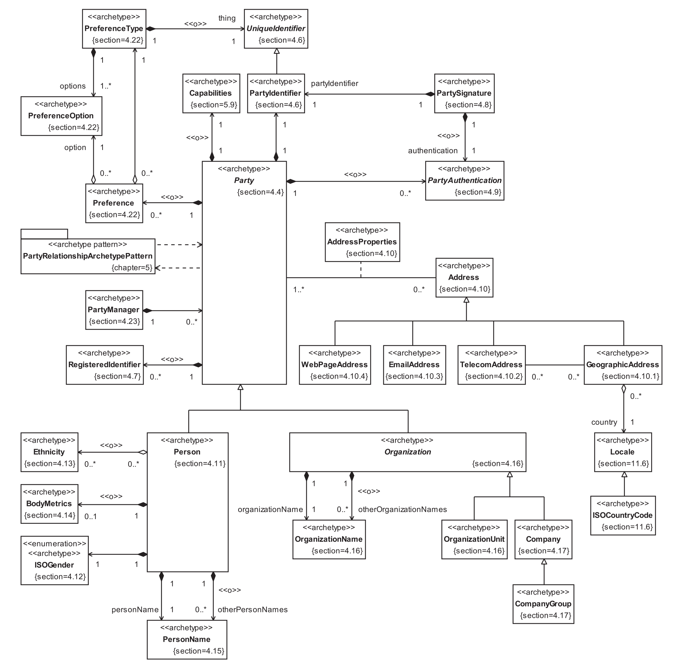
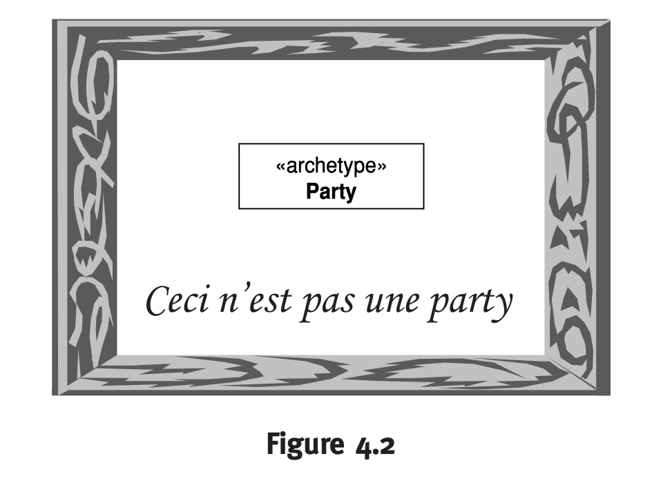
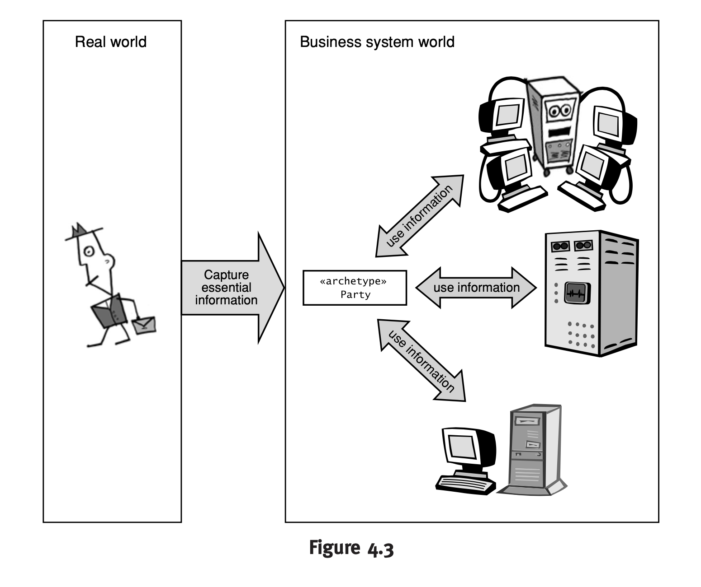
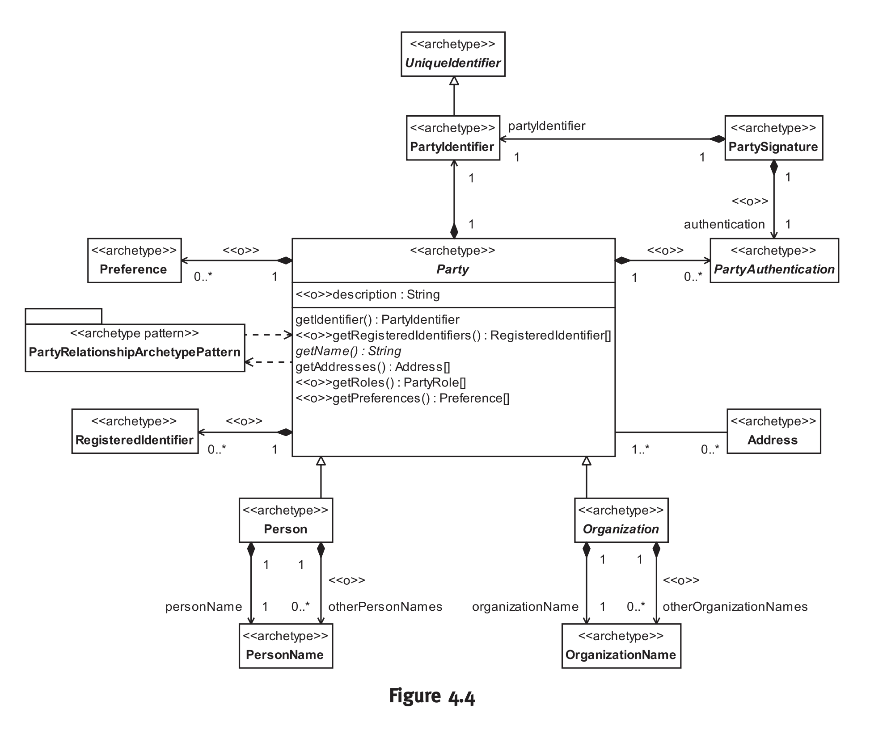
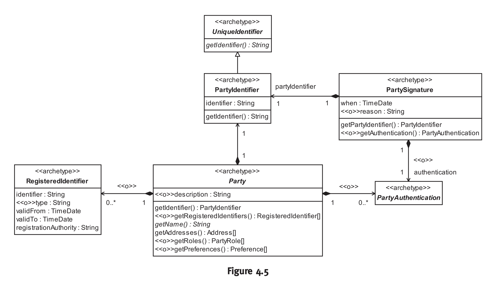
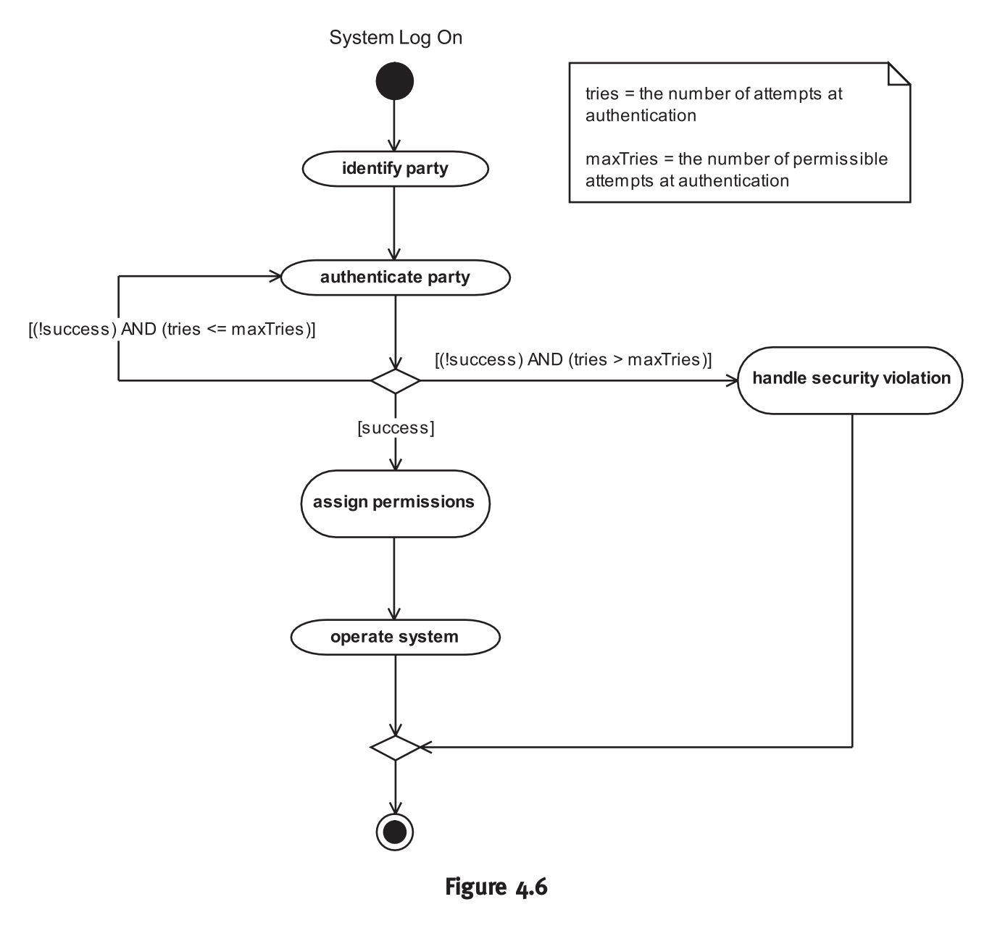
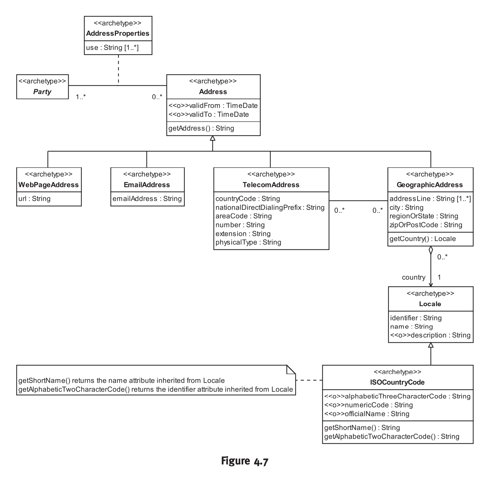
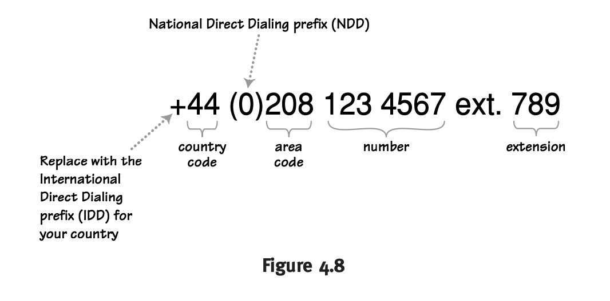

## Przedmowa
​	Niecałe 200 metrów od miejsca, w którym obecnie siedzę, miała miejsce rewolucja.
W odpowiedzi na wezwanie sławnego nocnego jeźdźca, garstka ludzi zjawiła się w środku nocy, aby obronić swoje rodziny, swoje ziemie i "prawa człowieka", które właściwie dopiero co odkryli. Ich nie do zniesienia traktowanie przez odległego tyrana skłoniło ich do ryzykowania wszystkim - nawet życiem - aby chronić swoją sposób życia. Niektórzy zapłacili ostateczną cenę tego ranka, przesyłając wiadomość, która rozbrzmiała na całym świecie, stając się migaczem rewolucji, która miała rozbrzmiewać przez całą Epokę Oświecenia aż po dzisiaj.
Chcieli stworzyć niczym innym jak lepsze społeczeństwo, sprawiedliwe społeczeństwo, różniące się od tego, co widzieli w dziedzinie odległego tyranii. Chcieli zmienić wszystko, wymazać tablicę, rozwiązać polityczne więzy, które wiązały ich z przeszłością. Opierając się na poprzednich stu latach filozofii politycznej, wierzyli, że posiadają to, co niedługo nazwano "niezbywalnymi prawami", i mieli zamiar te prawa zastosować.
Wynikiem były lata bolesnych walk, transoceaniczna wojna między największą potęgą światową a grupą buntowników, prowadzoną przez postać określaną przez tę potęgę jako "zdrajca". Pomimo wszelkich przeciwności, buntownicy wygrali wojnę w zaledwie osiem lat, zapisując się w historii i uzyskując kontrolę nad własnymi losami.
Jednak... ponad 200 lat później, tutaj siedzę w tym samym kraju, pijąc kawę w mojej lokalnej kawiarni, gdzie stała 200 lat temu inna kawiarnia. Mimo że ten kraj i jego były despotyczny, imperialny właściciel są rozdzielone od ponad dwóch wieków, wciąż dzielimy ten sam język. Systemy prawne są niemal identyczne; systemy polityczne, choć różne, mają silne i klarowne podobieństwa. Kultury są blisko spokrewnione, na tyle, że dzielimy się tymi samymi źródłami rozrywki. W rzeczywistości ci dawno temu wrogowie uważani są za "specjalne relacje", które przewyższają wszelkie inne Stosunki dyplomatyczne, czasem nawet kosztem najbliższych sąsiadów i partnerów handlowych obu krajów, są wyraźne. Komunikat jest jasny: czasami co najmniej rewolucje są ewolucyjne. Chęć przeinaczenia, wymazania wszystkiego i rozpoczęcia od nowa, bardzo często zamiast tego ugruntowuje istniejący system - w tym przypadku wolność osobista w kontekście systemu prawnego opartego na precedensach, zorganizowanego wokół rządu ludu, dla ludu i przez lud.
Przesuwając nasze skupienie z historii politycznej na strukturę rewolucji naukowych i przemysłowych, znajdujemy niemal tę samą sytuację. Widok świata Thomasa Kuhna jest stale przywoływany w branży technologii informacyjnych, ale często "przesunięcia paradygmatyczne" w IT to w istocie jedynie przesunięcia terminologii.
Model Driven Architecture (MDA), wizja Object Management Group (OMG) mająca na celu przeniesienie rozwoju oprogramowania z głębin rękodzieła na szczyty inżynierii, niewątpliwie stanowi przesunięcie paradygmatu. Skupiając się na architekturze i ujmując projekt "na papierze" w sposób analogiczny do tego, jak architekci budowlani rejestrują projekty, OMG ma na celu nie tylko obniżenie początkowych kosztów rozwoju oprogramowania, ale przede wszystkim zmniejszenie nieustannie rosnących kosztów integracji i konserwacji oprogramowania (które absorbują obecnie około 90 procent zasobów cyklu życia oprogramowania). Jednocześnie MDA zaczyna od języka graficznego, a nie tekstu, i zmusza programistów do projektowania przed kodowaniem (lub nawet zamiast kodowania). Wyraźnie następuje rewolucja. Jednocześnie jednak MDA reprezentuje jedynie kolejny poziom abstrakcji, kolejny poziom kompilacji. Autorzy tej książki nazywają MDA "rewolucją" podobną do przesiadki z języków programowania proceduralnych na obiektowe pod koniec XX wieku; ale nawet to było jedynie kolejnym poziomem abstrakcji opartym na kompilatorze (mało który zestaw instrukcji jest obiektowy; języki obiektowe muszą być kompilowane do tych architektur zestawów instrukcji, które nie są obiektowe). W rzeczywistości rewolucja MDA już przynosi korzyści, nie rezygnując z tego, co było wcześniej; innymi słowy, to rewolucja ewolucyjna.

Każda rewolucja, niezależnie od tego, jak dobrze zastępuje lub poszerza istniejący porządek, musi mieć swój język; rewolucje polityczne mają swoje konstytucje i deklaracje, a rewolucja MDA skupia się na procesach i zasobach oprogramowania. Ta książka, podczas krótkiego przedstawienia procesu rozwoju oprogramowania, koncentruje się przede wszystkim (i w przewidujący i klarowny sposób) na opracowywaniu zestawu wzorców, aby uprościć rozwijanie oprogramowania. Książka ta stanowi efektywnie słownik nowego języka MDA, zestaw podstawowych planów, które przyspieszą budowę budynku, który masz na myśli. Budowniczowie nie muszą wszyscy wynajdywać na nowo stalowych belki I, a programiści nie muszą wynajdywać na nowo katalogu produktów.

Podsumowując, trzymasz w rękach klucze do rewolucji ewolucyjnej, której wpływ już odczuwalny jest w świecie rozwoju oprogramowania. Muszę przyznać się do pewnej osobistej słabości, że czerpię radość z czytania encyklopedii i słowników. Sącząc kawę w pobliżu miejsca rewolucji ewolucyjnej, trudno nie cieszyć się czytaniem kolejnej deklaracji.

— Richard Mark Soley, Ph.D. Lexington, Massachusetts, USA. Październik 2003

## Introduction
### About this book
Naszą książkę nazwaliśmy "Enterprise Patterns and MDA — Building Better Software with Archetypes Patterns and UML". Pierwsza część tytułu określa ogólny temat całej książki: naszym celem jest dostarczenie zestawu istotnych wzorców dla informatyki przedsiębiorstwa. Nie są to techniczne "wzorce projektowe"; są to raczej istotne wzorce biznesowe, które występują przynajmniej w pewnym stopniu praktycznie we wszystkich przedsiębiorstwach. Powinieneś zauważyć, że jeden lub więcej z tych wzorców jest od razu zastosowalny w projektach rozwoju oprogramowania. Są to komponenty modelu o wysokiej wartości, które łatwo możesz używać we własnych modelach UML. Każdy wzorzec dostarcza rozwiązania do zrozumienia i modelowania określonej części systemu biznesowego. Ponadto pokazujemy, jak można używać rozwijającej się dyscypliny Model Driven Architecture (MDA), aby zastosować te wzorce z dużym stopniem automatyzacji.

Druga część tytułu przedstawia, w jaki sposób osiągamy nasz cel stworzenia zestawu wzorców przydatnych na poziomie przedsiębiorstwa. Wprowadzamy nowe koncepcje archetypów i wzorców archetypów, aby zdefiniować poziom abstrakcji zoptymalizowany pod kątem ponownego użycia oraz możliwości automatyzacji MDA. Te wzorce są udokumentowane za pomocą techniki modelowania literackiego, która osadza wzorce, wyrażone jako modele UML, w narracji, dzięki czemu wzorce mogą być zrozumiane, walidowane i dostosowywane nawet przez czytelników niefachowych.

Ta książka jest praktycznym przewodnikiem, który dostarcza użytecznego zestawu wzorców archetypów oraz teorii niezbędnej do ich efektywnego wykorzystania w kontekście przedsiębiorstwa. Mamy nadzieję, że pomoże Ci to zaoszczędzić dużo czasu i wysiłku w projektach rozwoju oprogramowania.

Te wzorce są cenne — podobny, ale znacznie mniej rozwinięty zestaw wzorców został niedawno niezależnie wyceniony przez renomowaną firmę na kwotę około 300 000 dolarów.

Korzystanie z dowolnego z tych wzorców, nawet fragmentu wzorca, może zaoszczędzić wiele dni lub miesięcy pracy. Może nawet jeszcze ważniejsze niż ta oszczędność jest to, że wiedza wbudowana w każdy wzorzec archetypu może uchronić Cię przed kosztownymi i czasochłonnymi błędami!

Wszystkie wzorce przedstawione w tej publikacji współpracują harmonijnie, tworząc zintegrowany język wzorców do rozmawiania o systemach sprzedaży. Ta harmonia znacznie zwiększa ich wartość.

W chwili pisania tego tekstu w 2003 roku, uważamy, że jesteśmy na początku rewolucji w rozwoju oprogramowania. Podobnie jak lata 90. przyniosły wzrost poziomu abstrakcji od kodu proceduralnego do kodu obiektowego (OO), wierzymy, że ten dziesięciolecie przyniesie dalszy, bardziej istotny wzrost poziomu abstrakcji. Będzie to zmiana od programowania skoncentrowanego na kodzie do programowania skoncentrowanego na modelu poprzez MDA.

Mamy nadzieję, że koncepcje, techniki, narzędzia i wzorce, które opisujemy w tej książce, pomogą nam wszystkim uczynić tę rewolucję w rozwoju oprogramowania rzeczywistością.

### Nasza wizja
Jednym z powodów powstania tej książki było uczucie nudy! Po latach modelowania doszliśmy do wniosku, że często po prostu powtarzamy te same czynności. Na odpowiednim poziomie abstrakcji większość przedsiębiorstw wydaje się składać z tych samych elementów semantycznych — Klient, Produkt, Zamówienie, Strona i tak dalej. Tak powszechne są niektóre z tych elementów, że doprowadziło nas to do pojęcia wzorców archetypów biznesowych.
Spekulowaliśmy, że większość systemów biznesowych można złożyć, podobnie jak klocki Lego, z wystarczająco kompletnego zestawu wzorców archetypów.

Istotą naszej wizji jest to, że wzorce archetypów powinny być traktowane jako rodzaj "komponentów modelu", które można wyjąć z półki, dostosować i użyć w swoich własnych modelach. Ten proces można przeprowadzić ręcznie, ale idealnie byłoby zautomatyzować go na jak najwyższym poziomie przy użyciu narzędzia MDA.

Dziś możesz używać kreatora interfejsów graficznych (GUI) do szybkiego tworzenia graficznych interfejsów użytkownika z komponentów GUI. Praca, którą opisujemy w Rozdziale 2, umożliwia szybkie konstruowanie semantycznie poprawnych i zweryfikowanych modeli UML z platformoniezależnych, ogólnych komponentów modelu z dużym stopniem automatyzacji. Wierzymy, że może to być przyszłość rozwoju oprogramowania. Nazywamy to modelowaniem opartym na komponentach.

To jest duże odnowienie idei ponownego wykorzystania — systemy oprogramowania nie są uważane za zbiory wielokrotnie używanych klas, wielokrotnie używanych komponentów kodu czy nawet wielokrotnie używanych podsystemów, ale za raczej z wielokrotnie używanych elementów semantycznych, które są wzorcami archetypów. W rzeczywistości, w dużej mierze istota systemu biznesowego tkwi w jego archetypach i ich wzorcach, a nie w jakimkolwiek kodzie czy artefaktach projektowych. Praktyki kodowania, praktyki projektowe, a nawet architektury zmieniają się wraz z postępem technologii, ale same archetypy przetrwają, w dużej mierze niezmienione, czasem przez tysiąclecia.

### Dlaczego nie zrobiliśmy tego wcześniej
Chcieliśmy napisać tę książkę od kilku lat, ale pojawiły się przeszkody, które udało nam się przezwyciężyć dopiero niedawno.

- Stan sztuki modelowania UML. Do niedawnej inicjatywy MDA (Model Driven Architecture) grupy Object Management Group (OMG) naprawdę nie mieliśmy narzędzi koncepcyjnych, które byłyby niezbędne do opisu wzorców archetypów w dobry sposób.
- Problem zróżnicowania wzorców. Wzorce biznesowe często muszą dostosować swoje formy do konkretnego kontekstu biznesowego. Teraz opracowaliśmy prosty sposób rozwiązania tego problemu, który pozwala nam tworzyć wzorce archetypów, które są dostosowalne do różnych środowisk biznesowych.
- Problem komunikacji modeli UML do szerokiego grona odbiorców. W rzeczywistości mamy dobre rozwiązanie tego problemu od kilku lat, w postaci modelowania literackiego (opisanego w Rozdziale 3).
- Wsparcie narzędzi modelowania UML. To dobrze prezentować teorię wzorców archetypów, ale taka teoria jest przydatna dla przeciętnego inżyniera oprogramowania tylko wtedy, gdy może być wdrożona w praktyce. Na rynku pojawiły się niedawno narzędzia do modelowania, które spełniają nasze wymagania dotyczące automatyzacji wzorców archetypów.

### Struktura tej książki
#### Książka składa się z czterech głównych wątków:

1. Teoria archetypów i wzorców archetypów (Rozdziały 1 i 2)
2. Automatyzacja wzorców przy użyciu MDA (Rozdział 2)
3. Zwiększenie wartości biznesowej modeli UML poprzez uczynienie ich dostępnymi dla szerokiego grona odbiorców za pomocą modelowania literackiego (Rozdział 3)
4. Cenny katalog wzorców, który możesz wykorzystać we własnych modelach (Rozdział 4 i dalej)

Rozdziały 1, 2 i 3 dostarczają teoretycznych podstaw reszty książki, i zauważysz, że obejmują one wiele nowego materiału.

W Rozdziale 1 opisujemy nowe podejście do radzenia sobie z problemem zróżnicowania wzorców — jak dostosować wzorce do różnych kontekstów użycia.

W Rozdziale 2 pokazujemy, jak możesz zautomatyzować proces korzystania z wzorców archetypów przy użyciu narzędzia do modelowania UML obsługiwanego przez MDA. Pierwsze dwa rozdziały są ze sobą ściśle powiązane. Automatyzacja wzorców opisana w Rozdziale 2 zależy od teorii archetypów i wzorców archetypów przedstawionej w Rozdziale 1.

Rozdział 3 opisuje technikę modelowania literackiego, którą możesz używać do dokumentowania swoich wzorców. Ten rozdział jest dość samodzielny. Modelowanie literackie to potężny sposób komunikowania modeli UML szerokiemu gronu odbiorców.

Każdy z pierwszych trzech rozdziałów zawiera podsumowanie, które powtarza kluczowe informacje w formie bardzo zwięzłego zarysu. Jest to świetne do powtórek, a także użyteczne źródło punktów do prezentacji.

Katalog wzorców może istnieć samodzielnie. Jeśli wybierzesz korzystanie z książki głównie jako katalogu wzorców (Rozdział 4 do Rozdziału 12), możesz pominąć wiele teoretycznych podstaw zawartych w pierwszych trzech rozdziałach. Użyj katalogu wzorców jako cennego źródła dla swoich własnych modeli. Każdy z rozdziałów wzorców kończy się krótkim podsumowaniem, które zawiera kluczowe koncepcje i archetypy wprowadzone w tym rozdziale. Ponownie robimy to w formie zarysu.

Mówiąc, że katalog wzorców może istnieć samodzielnie, uważamy jednak, że będziesz w stanie skuteczniej stosować wzorce, jeśli masz przynajmniej podstawowe zrozumienie teorii archetypów. Wszystko, czego potrzebujesz, znajdziesz w Rozdziale 1. Wszystkie wzorce w katalogu wzorców są bezpośrednim rezultatem zastosowania teorii i technik opisanych w pierwszych trzech rozdziałach. Pojęcia archetypów, wzorców archetypów, konfiguracji wzorców i modelowania literackiego pozwoliły nam stworzyć znacznie bardziej kompleksowe i solidne wzorce, niż byłoby to możliwe inaczej.

Wreszcie, dostarczamy słownika archetypów, bibliografii i pełnego indeksu.

### Jak korzystać z tej książki
W tej sekcji przedstawiamy mapy dla różnych sposobów, w jakie możesz chcieć używać tej książki, oraz kilka zaleceń dotyczących tego, jak mogłbyś się do niej zabrać.

Pamiętaj, że to nie jest książka dla początkujących, więc może być kilka wymagań wstępnych dla niektórych ścieżek, które chciałbyś podążać. Żadne z tych wymagań wstępnych nie są szczególnie trudne do osiągnięcia, ale zawsze warto upewnić się, że posiadasz masz to, co potrzebujesz, albo przynajmniej wiesz, gdzie to zdobyć, zanim wyruszysz w podróż!

| Kim jesteś              | Twój cel w                                                   | Wymagania wstępne                                            | Kierunek działania (Roadmap)                     |
| ----------------------- | ------------------------------------------------------------ | ------------------------------------------------------------ | ------------------------------------------------ |
| Analityk/projektant OO  | Chcę zrozumieć teorię archetypów i wzorców archetypów        | Umiejętność pracy z UML                                      | Rozdział 1                                       |
| Analityk/projektant OO  | Chcę zobaczyć, jak narzędzia MDA mogą być używane do automatyzacji korzystania z archetypów (i innych) wzorców | Umiejętność pracy z UML (praktyczna wiedza o MDA byłaby także pomocna) | Rozdział 1 Rozdział 2                            |
| Analityk/projektant OO  | Chcę ulepszyć moje modele UML i dowiedzieć się, jak mogę je udostępnić szerszej publiczności | Umiejętność pracy z UML                                      | Rozdział 3                                       |
| Analityk/projektant OO  | Chcę ponownie używać wzorców archetypów w moich własnych modelach w sposób nieformalny, korzystając z wzorców, fragmentów wzorców lub po prostu pomysłów | Umiejętność pracy z UML Umiejętność pracy z dziedziną biznesową, w której zamierzam zastosować wzorce | Katalog wzorców                                  |
| Analityk/projektant OO  | Chcę ponownie używać wzorców archetypów w moich własnych modelach w sposób formalny, zrozumieć teorię stojącą za nimi | Umiejętność pracy z UML                                      | Rozdział 1 Rozdział 2 Rozdział 3 Katalog wzorców |
| Analityk/projektant OO  | Chcę używać katalogu wzorców do zrozumienia konkretnego obszaru biznesu | Umiejętność pracy z dziedziną biznesową, w której zamierzam zastosować wzorce | Katalog wzorców                                  |
| Analityk biznesowy      | Chcę zrozumieć teorię archetypów i wzorców archetypów        | Umiejętność pracy z UML                                      | Rozdział 1                                       |
| Kierownik projektu      | Chcę zobaczyć, jak narzędzia MDA mogą być używane do automatyzacji korzystania z archetypów (i innych) wzorców | Umiejętność pracy z UML (praktyczna wiedza o MDA byłaby także pomocna) | Rozdział 1 Rozdział 2                            |
| Inżynier oprogramowania | Chcę ulepszyć moje modele UML i dowiedzieć się, jak mogę je udostępnić szerszej publiczności | Umiejętność pracy z UML                                      | Rozdział 3                                       |

W Tabeli 1 (naturalnie) odwołujemy się do naszej poprzedniej książki, "UML and the Unified Process", jako źródła przydatnego dla czytelników, którzy potrzebują wstępnego materiału na temat UML. Gdy pisaliśmy tę książkę, zawsze mieliśmy na uwadze, że może ona służyć jako przydatne wprowadzenie do bardziej zaawansowanych tekstów, takich jak ten.

Rozdziały dotyczące wzorców zawierają dużo informacji, i może być pomocne postępowanie zgodnie z poniższym planem podczas czytania każdego z rozdziałów.

1. Przeczytaj sekcję kontekstu biznesowego rozdziału. Jak sama nazwa wskazuje, ta sekcja dostarcza informacji, która umieszcza wzorzec w kontekście biznesowym.
2. Przeczytaj sekcję podsumowującą rozdział. Dostarczy ona jasnego zarysu tego, co znajdziesz w rozdziale.
3. Przejrzyj roadmap rozdziału. Dostarczy on przeglądu archetypów i ich relacji oraz miejsca, gdzie są one omawiane w tekście.
4. Przeczytaj rozdział.

### Konwencje
Zastosowaliśmy następujące konwencje.

Archetypy, pleomorfy, atrybuty, operacje, nazwy relacji, nazwy ról relacji i fragmenty kodu są napisane tą czcionką: `AnArchetype`, `APleomorph`, `anAttribute`, `anOperation()`, `aRelationshipName`, `aRoleName`, jakiś kod.

Definicje archetypów wyglądają tak:

**Archetyp Pieniądza reprezentuje kwotę w określonej walucie. Ta waluta jest akceptowana w jednym lub wielu obszarach lokalnych.**

Definicje terminów wyglądają tak:

*Proces biznesowy to sekwencja działań biznesowych, które, gdy są realizowane, są zaprojektowane w taki sposób, aby przynieść pewne korzyści biznesowe*.

### Podziękowania

Chcielibyśmy podziękować naszemu redaktorowi z Wielkiej Brytanii, Simonowi Plumtree, za dostrzeżenie potencjału tego projektu. Chcielibyśmy także podziękować naszemu redaktorowi z USA, Mary O’Brien, oraz jej zespołowi, Brendzie Mulligan, Julie Nahil, Kim Arney Mulcahy, Chrysta Meadowbrooke, Kathy Benn McQueen i Carol Noble za całą ich pracę i wsparcie.

Dziękujemy dr. Wolfgangowi Emmerichowi i Johnowi Quinnowi za ich wkład w pracę nad modelowaniem literackim opisanym w Rozdziale 3. Chcielibyśmy wyrazić uznanie naszym przyjaciołom z iO Software, Richardowi Hubertowi, Ronaldowi Steinhau i Marcusowi Munzertowi, bez których Rozdział 2 byłby znacznie krótszy. Fabrizio Ferrandina z Zuhlke Engineering był nieocenioną pomocą, rozpowszechniając naszą pracę i wprowadzając nas do kluczowych kontaktów.

Otrzymaliśmy istotną pomoc od Johna Watkinsa z IBM i Andy'ego Carmichaela z Borland, którzy dostarczyli nam narzędzi do wykonania pracy. Andrew Watson z OMG okazał ogromną pomoc w zwróceniu uwagi tej instytucji na naszą pracę. Liz Dobson z Zuhlke Engineering zawsze była pomocna i entuzjastyczna, nawet gdy musieliśmy odrzucić propozycje konsultacyjne, aby móc pracować nad rękopisem.

Nasi recenzenci, Richard Soley (OMG), John Poole (Hyperion Software), Steve Vinoski (IONA Technologies) i Fred Waskiewicz (OMG), pomogli nam poprawić jakość ostatecznego rękopisu, a Richard napisał dla nas doskonałe słowo wstępne.

Jeszcze raz mieliśmy szczęście cieszyć się doskonałym wsparciem ze strony Sue i Davida Epsteina. W szczególności David udzielił nam kluczowej porady dotyczącej pisania, gdy ta książka była jeszcze w fazie planowania.

Wreszcie, chcielibyśmy podziękować naszym kotom, które, jak zawsze, były ważną częścią tego projektu. Rozwiązaliśmy wiele problemów związanych z modelowaniem, głaszcząc Homera. Paddy leży na naszych monitorach i nonszalancko wskazuje błędy modelowania łapami i ogonem. Meg generuje nowe pomysły, zestawiając ze sobą niepowiązane strony rękopisu w nowatorski sposób.

# Część 1 Teoria, praktyka archetypów i Model Driven Architecture (MDA)

### 1.1 Wprowadzenie
​	W tym rozdziale przedstawiamy i wyjaśniamy pojęcia archetypów biznesowych oraz wzorców archetypów. Znaleźliśmy te koncepcje ekscytujące i bardzo przydatne w naszej własnej pracy nad modelowaniem obiektowym, i mamy nadzieję, że również dla Ciebie okażą się one fascynujące.
Chociaż zrozumienie archetypów i wzorców archetypów było kluczowe dla stworzenia przedstawionych wzorców archetypów w głównej części tej książki, nie jest to niezbędne do praktycznego zastosowania tych wzorców w systemach biznesowych. Jeśli chcesz po prostu używać tej książki jako przydatnego katalogu wzorców, śmiało możesz przejrzeć ten rozdział, który jest głównie teoretyczny. Niemniej jednak, powinieneś przynajmniej rzucić okiem na Sekcję 1.7, aby zrozumieć profil języka Unified Modeling Language (UML), który używamy.
Jeśli zajmujesz się rejestrowaniem wzorców biznesowych lub tworzeniem obiektowych modeli na wysokim poziomie, a nawet na poziomie przedsiębiorstwa, być może uznałeśbyś "narzędzia myślowe" przedstawione w tym rozdziale za bardzo cenne.
Zaczynamy od ogólnej dyskusji na temat archetypów (Sekcja 1.2), definiujemy, co rozumiemy przez archetypy biznesowe i wzorce archetypów (Sekcja 1.3), a także omawiamy, jak możemy modelować archetypy i wzorce archetypów za pomocą UML (Sekcja 1.7). Zajmujemy się kwestią zmienności wzorców (Sekcja 1.9) i wprowadzamy potężne pojęcie pleomorfizmu jako sposobu zrozumienia, jak archetypy i wzorce archetypów dostosowują się do konkretnych środowisk biznesowych (Sekcja 1.12).

## 1.2 Czym są archetypy?

​	Słowo "archetyp" pochodzi od greckiego archetypo (αρχετυπο), co oznacza "oryginalny wzór." Oto jedna z definicji.

*Archetyp to pierwotna rzecz lub okoliczność, która regularnie się powtarza i uważana jest za uniwersalny koncept lub sytuację.*

​	Według psychologa Carla Gustava Junga [Jung 1981], archetypy wynikają z wspólnego zasobu ludzkich doświadczeń (nieświadomość zbiorowa), który wykorzystuje archetypy jako jeden ze swoich zasadniczych mechanizmów uporządkowania i strukturyzacji. Faktycznie, wszędzie tam, gdzie istnieje wspólne doświadczenie ludzkie przez długi czas, archetypy pojawiają się, aby pomóc w strukturyzacji tych doświadczeń.
Jednym z najbardziej intrygujących aspektów jungowskich archetypów jest to, że naturalnie wykazują one zmienną postać - zmieniają swoją formę, aby dostosować się do konkretnych kontekstów kulturowych, podczas gdy ich rdzenne znaczenia pozostają stałe. Na przykład archetyp Bohatera wygląda zupełnie inaczej w paradygmacie Indian Ameryki Północnej niż w paradygmacie Aborygenów Australijskich, a mimo to Bohater zawsze jest jakoś rozpoznawalny jako Bohater. Wkrótce zobaczymy, że ta naturalna zmiennność jest istotną cechą archetypów.
Ponieważ archetypy stanowią podstawowy ludzki mechanizm organizacji, podsumowywania i uogólniania informacji o świecie, można z uzasadnieniem oczekiwać, że mają one zastosowanie w tworzeniu oprogramowania.

​	Ludzie zaangażowani są w działalność biznesową od tysiącleci, i uważamy, że jest całkiem sensowne przypuszczać, iż wiele archetypów powstało w dziedzinie biznesu. Na przykład, jeśli pomyślisz o podstawowej działalności biznesowej, jaką jest sprzedaż, najwcześniejsze zarejestrowane przypadki tej działalności datują się sprzed około 5000 lat. Nie ma wątpliwości, że ta działalność występowała znacznie wcześniej. Wszystkie sprzedaże w tym ogromnym okresie czasu w jakiś sposób obejmowały podstawowe koncepcje produktu, ceny (w kontekście pojęcia wartości produktu), sprzedawcy i kupującego.
Można zauważyć, że istnieją tutaj bardzo fundamentalne (powiedzielibyśmy archetypowe) koncepcje, oraz że istnieje również archetypowy wzorzec relacji między tymi koncepcjami. Na przykład cena zawsze jest w jakiś sposób powiązana z produktem.
Agenda tej książki polega na próbie uchwycenia niektórych z tych archetypów i wzorców archetypów w modelach obiektowych UML. W tym celu wprowadzamy następujące nowe koncepcje.

- Archetypy biznesowe
- Wzorce archetypów biznesowych
- Zmiennność archetypów i wzorców archetypów
- Pleomorfizm
- Konfiguracja wzorca

Omówimy pierwsze cztery z tych idei w następnych kilku sekcjach, a dużo uwagi poświęcimy Konfiguracji wzorca 

## 1.3 Czym są archetypy biznesowe?

Systemy oprogramowania zorientowane obiektowo (OO) odzwierciedlają dziedziny biznesowe, w których działają. Możesz zatem spodziewać się znaleźć archetypy w dziedzinie biznesu, w systemach oprogramowania i w modelach tych systemów. Nazywamy ten rodzaj archetypu archetypem biznesowym.

*Archetyp biznesowy to pierwotna rzecz, która występuje konsekwentnie i uniwersalnie w dziedzinach biznesowych oraz w systemach oprogramowania biznesowego.*

Dobrym przykładem archetypu biznesowego jest Pojęcie. Pojęcie reprezentuje zidentyfikowalną, adresowalną jednostkę, która może mieć status prawny. Zazwyczaj reprezentuje to osobę lub jakąś organizację. Wszystkie systemy biznesowe mają pewne pojęcie o Pojęciu. Możesz przyjrzeć się rzeczywistej definicji i semantyce archetypu Pojęcie w Rozdziale 4.
Pojęcie archetypów jest bardzo ogólne, i z pewnością istnieją archetypy w innych dziedzinach (takich jak opieka zdrowotna i inżynieria), a także w dziedzinie biznesu. Możesz użyć terminu archetyp <nazwa dziedziny>, aby odnosić się specyficznie do tych innych archetypów. Jednakże, w tej książce ograniczamy się do dziedziny biznesowej.

Oprócz istnienia archetypalnych elementów w systemach biznesowych, te elementy mogą oddziaływać w wzorcach, które same są archetypalne. Na przykład współpraca między archetypami Party, Product i Order stanowi podstawę praktycznie każdego biznesu, który sprzedaje towary lub usługi. Określamy te archetypalne współprace jako wzorce archetypów biznesowych.

*Wzorzec archetypu biznesowego to współpraca między archetypami biznesowymi, która występuje konsekwentnie i uniwersalnie w środowiskach biznesowych oraz w systemach oprogramowania.*

W tej książce, dla wygody, zazwyczaj odnosimy się do archetypów biznesowych i wzorców archetypów biznesowych po prostu jako do archetypów i wzorców archetypów.
Poniżej przedstawiamy istotne cechy archetypów i wzorców archetypów.
- Uniwersalność: aby coś było archetypalne, musi występować konsekwentnie w dziedzinach biznesowych i systemach.
- Powszechne występowanie: pojawiają się zarówno w dziedzinie biznesowej, jak i w dziedzinie oprogramowania. Tworząc systemy obiektowe, należy oczekiwać, że rzeczy i wzorce archetypowe z dziedziny biznesowej pojawią się w podobnej formie w dziedzinie oprogramowania. To zasada inżynierii konwergentnej opisana w [Taylor 1995] i bardziej niedawno w [Hubert 2001].
- Głęboka historia: na przykład archetyp produktu istnieje od czasów, gdy ludzie zaczęli wymieniać dobra i sprzedawać.
- Oczywisty dla ekspertów dziedziny: nie zawsze tak jest, ale jeśli archetyp nie jest oczywisty dla eksperta dziedziny, z pewnością warto zastanowić się, czy naprawdę jest to archetyp.

Szybkie wyjaśnienie dotyczące terminologii: termin "archetyp" został użyty w kontekście informatyki przez innych autorów. Peter Coad i jego współpracownicy definiują archetyp jako "formę, z której wszystko tego samego rodzaju bardziej lub mniej wynika" [Coad 1999, s. 2]. Coad używa swoich archetypów w sposób w pewnych względach podobny do tego, w jaki używamy naszych, ale archetypy Coad występują na znacznie wyższym poziomie abstrakcji i nie posiadają żadnego formalnego profilu UML.

Mellor i Balcer definiują archetyp jako "fragment logiki dostępu do danych i manipulacji tekstem, który formalnie określa, jak osadzić wykonywalny model UML w tekście" [Mellor 2002, s. 294]. Innymi słowy, termin ten jest używany do opisania konkretnej części wykonywalnego modelu UML. Jest to bardzo różne od dowolnej definicji tego terminu w słowniku.

Obie te definicje słowa "archetyp" różnią się od naszego użycia terminu w kontekście "archetyp biznesowy". Ogólnie rzecz biorąc, kiedykolwiek używamy terminu "archetyp" w tej książce, używamy go jako skrótu od "archetyp biznesowy", chyba że wyraźnie zaznaczymy inaczej.

W modelowaniu obiektowym istnieją dwie fundamentalnie różne rodzaje klas, jak pokazano w Tabeli 1.1.

| Rodzaj klasy        | Semantyka                                                    |
| ------------------- | ------------------------------------------------------------ |
| Klasa analizy       | Przedstawia wyraźną abstrakcję w dziedzinie problemu; Odzwierciedla rzeczywiste biznesowe koncepcje |
| Klasa projektowania | Klasa, której specyfikacja jest na tyle kompletna, że może być zaimplementowana; Zawiera cechy zarówno z dziedziny problemu, jak i dziedziny rozwiązania (technologia implementacyjna) |

Omówiliśmy oba rodzaje klas znacznie szczegółowiej w poprzedniej książce [Arlow 2001], więc nie będziemy powtarzać tej szczegółowej dyskusji tutaj. Ale podsumowując, klasa analizy wynika bezpośrednio z dziedziny problemu (np. sprzedaż mebli) i nie ma cech specyficznych dla implementacji. Z drugiej strony klasa projektowania może zawierać cechy zarówno z dziedziny problemu, jak i dziedziny rozwiązania (np. J2EE, .NET lub usługi internetowe). Klasy analizy służą zrozumieniu biznesu, podczas gdy klasy projektowania służą zrozumieniu technicznego rozwiązania.
Ważne jest zrozumienie, że archetypy zawsze są na wyższym poziomie abstrakcji niż normalne klasy analizy. Z punktu widzenia koncepcyjnego dzieje się tak, ponieważ archetypy dotyczą świadomego rozpoznawania i uchwytu uniwersalnych koncepcji, podczas gdy klasy analizy nie muszą koniecznie zajmować się uniwersalnością w ogóle. Z punktu widzenia technicznego (jak niedługo zobaczysz), archetypy generują jedną lub więcej klas analizy.

### 1.5 Czym są wzorce?
W tej sekcji przedstawimy bardzo krótkie wprowadzenie do wzorców, ale dla bardziej szczegółowych informacji zalecamy sięgnąć po kluczowy tekst o wzorcach, "Design Patterns—Elements of Reusable Object-Oriented Software" autorstwa Ericha Gamma, Richarda Helma, Ralpha Johnsona i Johna Vlissidesa [Gamma 1995].
Zgodnie z [Gamma 1995], wzorzec to rozwiązanie problemu w określonym kontekście. Aby być bardziej precyzyjnym, wzorzec składa się z opisu problemu, kontekstu, w którym problem występuje, oraz możliwego rozwiązania tego problemu w danym kontekście. Wzorzec można traktować jak "przepis", który opisuje, jak można rozwiązać konkretny problem w określonych okolicznościach.
Idea wzorców wywodzi się z prac Christophera Alexandra nad architekturą miast i budynków [Alexander 1977]. Alexander stwierdził, że wzorzec opisuje powtarzający się problem oraz kluczowe elementy rozwiązania tego problemu w taki sposób, który pozwala na zastosowanie rozwiązania wielokrotnie, za każdym razem w nowatorski, ale spójny sposób.
Gamma i jego koledzy zastosowali tę ideę do systemów informatycznych w swojej książce. Każdy przez nich zdefiniowany wzorzec składa się z czterech elementów.

- Nazwa wzorca: nazwa wzorca, co pozwala na rozmawianie o wzorcu bez konieczności opisywania jego szczegółów. Nazwy wzorców definiują język, który umożliwia projektantom komunikację na wysokim poziomie abstrakcji na temat projektów.
- Problem: opis problemu, który jest rozwiązywany przez wzorzec, na przykład, jak zaprojektować obiekt, który może mieć tylko jedną instancję (wzorzec Singleton).
- Rozwiązanie: projekt wzorca jako model UML. Ten projekt nie opisuje rzeczywistych klas, ale raczej współpracę, którą klasy w twoim modelu mogą zaimplementować.
- Konsekwencje: skutki zastosowania wzorca.

Wzorce mogą istnieć na wielu różnych poziomach abstrakcji. [Gamma 1995] opisuje wzorce projektowe, które są możliwymi rozwiązaniami dla powszechnych problemów występujących w projektowaniu obiektowym. Powinny stanowić istotny składnik twojego zestawu narzędzi dla projektantów obiektowych!

Fowler rozszerzył ideę wzorców na dziedzinę analizy w swojej książce "Analysis Patterns—Reusable Object Models" [Fowler 1996]. Książka ta zawiera pewne interesujące wzorce, ale są one ogólnie dość abstrakcyjne i wymagają dużo doprecyzowania przed zastosowaniem ich w rzeczywistej sytuacji deweloperskiej.

Porównamy i skontrastujemy wzorce archetypów z wzorcami analizy w następnym rozdziale.

### 1.6 Wzorce archetypów a wzorce analizy

Ta sekcja jest dedykowana tym z was, którzy chcą dowiedzieć się, w jaki sposób różnią się wzorce archetypów od wzorców analizy. Jeśli nie interesuje cię ten temat, śmiało możesz pominąć tę sekcję.

Kiedy przed publikacją prezentowaliśmy materiały dotyczące wzorców archetypów na konferencjach, czasem padło pytanie: "Czy wzorce archetypów to po prostu wzorce analizy?" Odpowiedź brzmi nie — wzorce archetypów posiadają wiele unikalnych cech, które sprawiają, że są znacznie bardziej niż tylko wzorcami analizy.

Jak wspomnieliśmy wcześniej, wzorce analizy zostały po raz pierwszy opisane przez Fowlera i zdefiniowane w następujący sposób: "Wzorce analizy to grupy koncepcji reprezentujące wspólną konstrukcję w modelowaniu biznesowym. Mogą być związane z jedną dziedziną lub obejmować wiele dziedzin" [Fowler 1996, s. 8].

Zauważ, że w tej definicji nie ma pojęcia koncepcji archetypalnych. To jest główna różnica koncepcyjna między wzorcami analizy a wzorcami archetypów.

W rzeczywistości wzorce archetypów są znacznie bogatsze zarówno pod względem koncepcyjnym, jak i technologicznym w porównaniu do wzorców analizy. Te różnice zostały podsumowane w Tabeli 1.2.

| Cecha                                                        | Wzorce Archetypów | Wzorce Analizy | Odnośniki     |
| ------------------------------------------------------------ | ----------------- | -------------- | ------------- |
| Dotyczy koncepcji archetypalnych                             | Zawsze            | Czasami        | Rozdział 1    |
| Wprowadza zasadę inżynierii konwergentnej                    | Zawsze            | Często         | [Taylor 1995] |
| Wspierane przez profil UML                                   | Tak               | Nie            | Sekcja 1.7    |
| Wystarczająco szczegółowe, aby być używanym w procesie Model Driven Architecture (MDA) jako platforma niezależna od platformy (PIM) | Tak               | Nie            | Rozdział 2    |
| Obsługuje zmienną zawartość elementów modelu                 | Tak               | Czasami        | Sekcja 1.9    |
| Wsparcie dla pleomorfizmu                                    | Tak               | Nie            | Sekcja 1.12   |
| Wprowadza zasady konfiguracji wzorca dla obsługi konfiguracji wzorca | Tak               | Nie            | Sekcja 2.5    |
| Definiuje zestaw modeli platformy niezależnej                | Tak               | Nie            | Sekcja 2.3    |
| Stosuje się do różnych dziedzin biznesowych                  | Tak               | Nie            | Rozdział 1    |
| Dostarczane jako modele czytelne dla człowieka               | Tak               | Nie            | Rozdział 3    |
| Może być zautomatyzowane przy użyciu narzędzi modelowania MDA | Tak               | Nie            | Rozdział 2    |

Jak zauważysz w Rozdziale 1.15 i w Rozdziale 2, wzorce archetypów biznesowych są również stosowane w sposób bardzo inny niż wzorce analizy.

### 1.7 Profil UML dla archetypów i wzorców archetypów
Możesz wprowadzić nowe rozszerzenia modelowania do UML, definiując profil UML. Składa się on z zestawu stereotypów, wartości oznaczonych i ograniczeń, które określają semantykę nowych rozszerzeń modelowania, które chcesz wprowadzić. Profil rozszerza metamodel UML o zestaw nowych elementów modelowania.
Nasz profil UML dla wzorców archetypów jest zdefiniowany w Tabeli 1.3. Staraliśmy się zachować go jak najprostszym.

# Część 3 Katalog archetypów

## Rozdział 4 Wzorzec archetypu Strona (Party)

### 4.1 Kontekst biznesowy

​	Wzorzec archetypu Strona (Party) opisuje, w jaki sposób przedstawiać istotne informacje dotyczące ludzi i organizacji. Używamy terminu "Strona" jako ogólnego określenia dla osoby lub organizacji, takiej jak firma.
Prawie każda firma zajmuje się w pewnym stopniu utrzymywaniem informacji o stronach oraz o rolach, jakie te strony odgrywają w różnych relacjach z nimi. To zainteresowanie jest stare jak samo prowadzenie biznesu. Nawet w bardzo wczesnych działaniach biznesowych opartych na barterze, transakcje opierały się na zaufaniu, które wynikało z posiadania pewnej wiedzy, czy to formalnie reprezentowanej, czy nie, na temat partnerów handlowych.
Bardzo częstym problemem jest brak standardowego i jednolitego sposobu reprezentacji informacji o stronach w wielu firmach. To zaniedbanie powoduje wiele problemów:

● Redundancja w systemach (co prowadzi do wysokich kosztów utrzymania)
● Słaba jakość danych (co prowadzi do awarii usług)
● Utrata szans biznesowych
● Słaba jakość usług
● Problemy prawne

Na przykład informacje o klientach często są replikowane i przechowywane w wielu różnych formatach w różnych systemach. Mogą nawet być rozproszone między wieloma systemami. Przydatne jest zbadanie, w jaki sposób informacje o klientach są przechowywane w twojej firmie. Możesz stwierdzić, że standardowy, ujednolicony widok na klienta i jego szczegóły, wymagania, preferencje, wzorce zakupowe, relacje itp. nie są dostępne. Jakie konkretne problemy wynikają z tego dla Ciebie?
W tym rozdziale analizujemy standardowy sposób reprezentowania informacji o stronach we wszystkich dziedzinach biznesowych. Choć wzorzec archetypu dla tej rozwiązania jest zasadniczo prosty, w praktyce jego jednolite zastosowanie we wszystkich systemach biznesowych w Twojej organizacji może wymagać lat.
Omówimy istotną kwestię ról i relacji stron w Rozdziale 5.

| Norma                                       | Zawartość                                         | Odnośniki                                                    |
| ------------------------------------------- | ------------------------------------------------- | ------------------------------------------------------------ |
| OMG Party Management Facility Specification | Standard wspierający zarządzanie stronami         | [www.omg.org/technology/documents/formal/party_mgmt](www.omg.org/technology/documents/formal/party_mgmt) |
| ISO 3166                                    | Kody krajów dwu- i trzyliterowe oraz nazwy krajów | [www.iso.org](www.iso.org)                                   |
| ISO 5218                                    | Reprezentacja płci ludzkiej                       | [www.iso.org](www.iso.org)                                   |
| ITU-T Recommendations                       | Standardy dotyczące adresów telekomunikacyjnych   | [www.itu.int](www.itu.int)                                   |

### 4.3 Przegląd archetypu wzorca Party oraz mapa drogowa

Ponieważ wzorzec archetypu Party jest dość obszerny, podzieliliśmy go na główny wzorzec (Rysunek 4.1) oraz relacje PartyRelationships (patrz Rozdział 5).

### 4.4 Archetyp wzorca Party Podmiot (Jednostka , Partycypant itd)

**Archetyp Party reprezentuje identyfikowalną, adresowalną jednostkę, która może mieć status prawny i zazwyczaj posiada autonomiczną kontrolę nad (przynajmniej niektórymi) swoimi działaniami.**

Zazwyczaj archetyp Party zawiera istotne informacje dotyczące osoby lub organizacji, ale jest to jedynie reprezentacja tej osoby lub organizacji w systemie informatycznym. Ta reprezentacja przechowuje informacje istotne dla twoich działalności biznesowych, i ważne jest, abyś był świadomy, że utrzymywanie właściwego skupienia. Nigdy, pod żadnymi okolicznościami, nie należy mylić Party z rzeczywistą osobą lub organizacją. Różnica między reprezentacją, czyli symbolem, a samą rzeczą, stała się słynna dzięki belgijskiemu surrealiście René Magritte'owi w jego obrazie "Zdrada obrazów", na którym luźno oparliśmy Rysunek 4.2.

 Klarowność w tym punkcie pomaga określić, jakie dokładnie informacje Archetyp Party musi zawierać i utrzymywać w systemach biznesowych, aby osiągnąć konkretne cele biznesowe, a jakie informacje są zbędne. Ilustruje to Rysunek 4.3.

Rzeczywista osoba lub organizacja jest reprezentowana w systemach biznesowych przez instancję archetypu.

Informacje utrzymywane przez archetyp Osoby obejmują zazwyczaj:

- Unikalny identyfikator
- Imię i nazwisko
- Adres
Obejmować to może również:
- Zarejestrowane identyfikatory (paszporty, dowody tożsamości itp.)
- Preferencje
- Jakiekolwiek inne informacje, których potrzebuje Twoja firma

Archetyp Party przedstawiony jest na Rysunku 4.4.

Trochę później w tym rozdziale zajmiemy się bardziej szczegółowo tym, w jaki sposób można przedstawić wszystkie te rodzaje informacji.

### 4.5 Rodzaje Jednostek (Party) - a może Podmiotu ?

Archetyp Jednostki (Party) sam w sobie jest bardzo abstrakcyjnym bytem, posiadającym jedynie najbardziej podstawową semantykę. Większość semantyki jest faktycznie uchwycona przez Podklasy Osoba (Person) i Organizacja (Organization) Jednostki.
Zazwyczaj nie ma potrzeby tworzenia podklas dla Osoby (sekcja 4.11) - ludzie wydają się istnieć tylko w jednym rodzaju, jeśli chodzi o systemy oprogramowania! Jednak istnieje wiele różnych typów Organizacji (sekcja 4.16).

Generalnie rzecz biorąc, Jednostki nie wykazują interesującego zachowania - po prostu przechowują informacje. To ważne stwierdzenie, ponieważ czyni Jednostkę wielokrotnie użyteczną w różnych dziedzinach biznesowych. Jeśli dodałbyś znaczną ilość zachowań do Jednostki lub którejkolwiek z jej podklas, te zachowania mogą być odpowiednie dla niektórych domen, ale nie dla innych. Dlatego najlepiej traktować różne typy Jednostek głównie jako biernych przechowalników danych i pozwolić innym elementom działać na nich.

### 4.6 Archetyp Identyfikatora Jednostki (PartyIdentifier)
*Archetyp Identyfikatora Jednostki reprezentuje unikalny identyfikator dla Jednostki.*

*Archetyp Unikalnego Identyfikatora reprezentuje identyfikator, który jest unikalny w określonym kontekście*.

Jednym z pierwszych problemów, z którymi się spotykasz, pracując z Jednostkami, jest kwestia identyfikacji. Jak jednoznacznie zidentyfikować Jednostkę w całej firmie i być może w różnych firmach?

Niestety nie ma jednolitego, międzynarodowo akceptowanego sposobu jednoznacznego identyfikowania Jednostek. Dlatego najlepszym podejściem jest przypisanie każdej instancji Jednostki unikalnego Identyfikatora Jednostki, który generujesz samodzielnie, jak pokazano na Rysunku 4.5.

Korzystając z terminologii baz danych, Identyfikator Jednostki działa jako klucz główny do uzyskiwania dostępu do informacji o Jednostce. Tak naprawdę, te informacje są zazwyczaj przechowywane w pewnym trwałym magazynie, takim jak baza danych. Zgodnie z zasadami jakości danych, ten identyfikator musi spełniać następujące cechy.

- Musi być unikalny w całej firmie.
- Zazwyczaj powinien być ciągiem alfanumerycznym. (Widzieliśmy systemy, które używają liczb całkowitych, ale to nie jest stabilna opcja, ponieważ liczby całkowite mogą mieć różne rozmiary na różnych platformach.)
- Nie może być wartością null.
- Musi być tworzone, gdy nowy obiekt Jednostki jest zapisywany w trwałym magazynie (takim jak baza danych).
- Nie może być zmieniane.
- Nie może mieć znaczenia.

Ostatni punkt jest istotny. Ogólnie rzecz biorąc, to bardzo zła koncepcja kodowania jakiejkolwiek informacji o Jednostce w kluczu używanym do dostępu do tej informacji. Istnieje kilka dobrych powodów dla tego.
- Możesz nie znać wymaganych informacji o Jednostce w momencie, w którym obiekt Jednostki jest zapisywany w trwałym magazynie.
- Możesz błędnie zgromadzić informacje o Jednostce (co jest dość powszechne, szczególnie gdy informacje są zbierane przez telefon).
- Dowolne informacje o Jednostce mogą się zmieniać z czasem (z powodu rzeczywistych zmian w danych Jednostki lub poprawiania błędów), ale ważne jest, aby unikalny identyfikator nie ulegał zmianie.
Archeotyp PartyIdentifier może przynieść wielkie korzyści twojej firmie. Posiadanie jednego, unikalnego identyfikatora dla Jednostki pomoże poprawić jakość danych o Jednostce. W szczególności możliwe będzie zidentyfikowanie i uporządkowanie zduplikowanych oraz niezgodnych danych, a zarządzanie relacjami z Jednostkami stanie się znacznie łatwiejsze.

### 4.7 RegisteredIdentifier

*Archeotyp RegisteredIdentifier reprezentuje identyfikator dla Strony (Party), który został nadany przez uznane ciało lub organ statutowy.*

Archeotyp RegisteredIdentifier jest przedstawiony na rysunku 4.5. Zauważ, że RegisteredIdentifier nie jest UniqueIdentifier. Dzieje się tak, ponieważ RegisteredIdentifier nie musi być koniecznie unikalny.
Każdy RegisteredIdentifier może zawierać następujące informacje:

- Sam identyfikator
- Opcjonalny typ, który może być używany do klasyfikacji RegisteredIdentifier (np. VATRegistrationNumber lub PESEL)
- Datę ważności RegisteredIdentifier (validFrom)
- Datę ważności RegisteredIdentifier (validTo)
- Organ odpowiedzialny za rejestrację (registrationAuthority)

Jak zaznaczyliśmy w sekcji 4.6, nie istnieje jedno, ogólnoświatowo akceptowane rozwiązanie, które jednoznacznie identyfikuje Strony (Parties). Niemniej jednak różne identyfikatory mają szerokie zastosowanie i ważność w kontekście kraju, branży lub działalności. Na przykład różne organy statystyczne rejestrują obywateli i firmy, a także mogą przyznawać pewien rodzaj Zarejestrowanego Identyfikatora (RegisteredIdentifier). Inne organy rejestracyjne, takie jak federacje sportowe i stowarzyszenia branżowe, również mogą rejestrować osoby lub organizacje i przypisywać im Zarejestrowane Identyfikatory.

Powszechne użycie Zarejestrowanych Identyfikatorów to przechwytywanie kodów identyfikacyjnych podatków (takich jak Numery Identyfikacyjne VAT w Unii Europejskiej) dla różnych rodzajów firm, począwszy od jednoosobowych działalności po różne rodzaje przedsiębiorstw, które są zarejestrowane w celu pobierania podatku od sprzedaży.

Zarejestrowane Identyfikatory są rozważane dla Osób w sekcji 4.11.1, dla Firm w sekcji 4.19 i dla Jednostek Organizacyjnych w sekcji 4.20.1.

### 4.8 Party Signature (Podpis cyfrowy)

Czasami w systemach biznesowych istotne jest zidentyfikowanie, że działanie lub decyzja zostały zatwierdzone przez odpowiednią Stronę/Podmiot, lub aby formalnie określić, który Podmiot podjął konkretne działanie lub decyzję.

***Archeotyp Podpisu Podmiotu reprezentuje znak identyfikacyjny Podmiotu/Strony.***

Archeotyp Podpisu Strony jest przedstawiony na Rysunku 4.5. Określa, kiedy został utworzony podpis wraz z opcjonalnym powodem dla Podpisu Strony. Na przykład, Podpis Strony może być skojarzony z Przydzieloną Odpowiedzialnością (patrz Sekcja 5.8), aby wskazać, kto dokonał przydzielenia.
Podpis Strony może opcjonalnie odnosić się do Autentykacji Strony, która potwierdza autentyczność Podpisu Strony. Omówimy to w następnej sekcji.

### 4.9 Autentykacja Podmiotu

Autentykacja Strony to ważny element systemów informatycznych, szczególnie w kontekście bezpieczeństwa. Oznacza to dostarczenie sposobu weryfikacji, czy Podmiot jest tym, za kogo się podaje. Założenie to implikuje istnienie pewnego mechanizmu bezpieczeństwa, który może obejmować metody uwierzytelniania, takie jak hasła, klucze, certyfikaty czy inne.

***Archetyp autentykacji Podmiotu reprezentuje uzgodniony i zaufany sposób potwierdzania tożsamości Strony.***

Archeotyp Autentykacji Podmiotu przedstawiony jest na Rysunku 4.5. Określa on, kiedy autentykacja została utworzona, wraz z opcjonalnym powodem Autentykacji Strony. Autentykacja Strony może być wykorzystywana w różnych kontekstach, na przykład do weryfikacji tożsamości Strony w celu dostępu do określonych zasobów lub potwierdzenia, że Strona potwierdziła konkretne informacje lub podjęła konkretne działania.

Możesz modelować autentykację, łącząc każdy Podmiot z zerem lub więcej Autentykacjami Strony (patrz Rysunek 4.5).

W naszym modelu, "PartyAuthentication" jest tylko miejscem, aby pokazać, jak autentykacja związana jest z innymi archetypami. To dlatego, że istnieje wiele możliwości dostarczania autentykacji.
"A PartyAuthentication" może być tak prosta, jak kombinacja identyfikatora użytkownika i hasła, lub może to być system własnych tokenów bezpieczeństwa lub bezpieczny certyfikat cyfrowy od zaufanego podmiotu trzeciego, takiego jak VeriSign (www.verisign.com) lub Thawte (www.thawte.com).
Na przykład na wielu stronach internetowych ja (Jim) mam tylko nazwę użytkownika i hasło. Jeśli zapomnę któregoś z tych elementów, mogę otrzymać informacje wysłane na mój zarejestrowany adres e-mail, wpisując hasło. To zazwyczaj zapewnia wystarczający poziom bezpieczeństwa dla użytku osobistego.
Jednak na niektórych bardzo bezpiecznych stronach internetowych, do których mam dostęp, używam SecurID od RSA Security (www.rsasecurity.com). Składa się on z nazwy użytkownika i hasła dwuczęściowego. Pierwsza część hasła pozostaje stała, ale drugą część otrzymuję z małego urządzenia elektronicznego, które prezentuje mi się z ciągle zmieniającym się numerem. Zapewnia to wystarczający poziom bezpieczeństwa dla wymagań bezpieczeństwa korporacyjnego.
Cała koncepcja autentykacji opiera się na istnieniu pewnego rodzaju systemu bezpieczeństwa. Większość systemów bezpieczeństwa działa zgodnie z ogólnym mechanizmem przedstawionym na rysunku 4.6.
Oto krótka prezentacja procesu na rysunku 4.6, którą przedstawiamy, aby podkreślić niektóre kwestie, które trzeba wziąć pod uwagę. Dla bardziej kompletnego omówienia bezpieczeństwa, zapraszamy do lektury [Bishop 2002].

##### Tożsamość podmiotu
Ta aktywność uzyskuje tożsamość użytkownika. Istnieje kilka opcji.

1. Podmiot może wprowadzić nazwę użytkownika, numer użytkownika lub inny unikalny ciąg (nie jest to tożsame z PartyIdentifier) lub może użyć jakiegoś fizycznego tokena, takiego jak karta (np. w bankomacie).
2. Podmiot może wprowadzić pewne dane identyfikacyjne, które system przekształca na własny wewnętrzny identyfikator.
3. System może automatycznie zidentyfikować podmiot (może to być uzyskane poprzez plik cookie lub inny trwały identyfikator z komputera użytkownika).

​	Stopień bezpieczeństwa, który jest wymagany, określi, która z tych opcji jest odpowiednia.
​	Opcja 1 jest najbardziej bezpieczna, jeśli wymaga się, aby Podmiot zachował w tajemnicy ciąg użytkownika, ale jest zależna od tego, czy Podmiot pamięta ten ciąg.
​	Opcja 2 próbuje pozbyć się wymagania zapamiętywania ciągu użytkownika, próbując identyfikacji na podstawie powszechnych informacji osobistych, takich jak imię, kod pocztowy, lub może numer paszportu. To podejście może być mniej bezpieczne, ponieważ powszechne informacje osobiste mogą być łatwo dostępne dla każdego, nie tylko dla danego Podmiotu. Ponadto, w zależności od żądanych informacji osobistych, może zostać zwróconych więcej niż jedno wystąpienie Podmiotu.

​	Opcja 3, automatyczne uzyskiwanie ID Podmiotu z jego maszyny, zawsze jest atrakcyjna w systemach sprzedaży, ponieważ stanowi najniższe ograniczenie wejścia do systemu. Ale z perspektywy użytkownika jest to najmniej bezpieczne. W zależności od tego, w jaki sposób jest zaimplementowana uwierzytelnianie Podmiotu, to podejście może umożliwiać innym osobom zakupienie dóbr lub uzyskanie dostępu do usług na koncie użytkownika bez jego wiedzy lub zgody.

##### Uwierzytelnianie podmiotu

Uwierzytelnianie polega na potwierdzaniu, że Podmiot to ten, za kogo się podaje. Zazwyczaj odbywa się to poprzez wymianę tajnego tokena, takiego jak hasło, lub nawet certyfikatu bezpieczeństwa, przez bezpieczny kanał. Systemy sprzedaży online mogą dawać Podmiotowi opcję przechowywania tego hasła w trwałej formie na jego maszynie, dzięki czemu system może uzyskiwać do niego automatyczny dostęp. Ponownie jest to najmniej bezpieczna opcja – zawsze należy udzielać użytkownikom porad dotyczących konsekwencji bezpieczeństwa tego rozwiązania i zawsze dawać im opcję wyłączenia tej funkcji.

##### handle security violation

Większość systemów pozwala na maksymalną liczbę prób uwierzytelniania, być może w określonym okresie czasu, a następnie traktuje niepowodzenie jako naruszenie bezpieczeństwa. To naruszenie może prowadzić do działań o różnym stopniu powagi.

1. Nic nie rób.
2. Zapisz naruszenie.
3. Zapisz naruszenie i natychmiast powiadom administratora bezpieczeństwa.
4. Zapisz naruszenie, natychmiast powiadom administratora bezpieczeństwa i zawieś konto użytkownika (w przypadku fizycznego tokenu, takiego jak karta w bankomacie, token może zostać skonfiskowany lub w inny sposób unieważniony).

​	Najmniej skrajną opcją jest zignorowanie sytuacji, ale jest to rzadko kiedy odpowiednie podejście! Najmniej skrajną, ale realistyczną opcją jest po prostu zapisanie naruszenia w celu późniejszej analizy przez administratora bezpieczeństwa. To podejście nie jest bardzo bezpieczne, ponieważ może pozostawić Twój system otwarty na próby ataków siłowych, jeśli administrator nie zajmie się naruszeniem w odpowiednim czasie. Opcje 3 i 4 powyżej dostarczają bardziej bezpiecznych rozwiązań.

##### assign permissions

Ta czynność przypisuje Podmiotowi uprawnienia do dostępu do różnych zasobów systemowych. operować systemem
Podmiot obsługuje system w pewien sposób.

### 4.10 Adres

***Adres archetypu reprezentuje informacje, które można użyć do skontaktowania się z Podmiotem.***

Ilustruje to rysunek 4.7, gdzie możesz zobaczyć, że:
● Podmiot może mieć zero lub więcej powiązanych adresów.
● Istnieje cztery rodzaje adresów — omówimy każdy z nich w kolejnych
czterech podsekcjach.
● Za każdym razem, gdy Adres jest powiązany z Podmiotem, istnieje powiązany
obiekt AddressProperties (zdefiniowany poniżej). Ten obiekt powinien co
najmniej określa użycie Adresu (tj. ograniczyć kontekst, w którym Adres jest
stosowany — biznesowy, domowy, kontakt po godzinach, kontakt awaryjny itp.).
Możesz również używać cechy "preferred" (preferowany), aby określić, czy
Adres jest preferowanym adresem dla Podmiotu. Inne właściwości mogą być
dodawane do AddressProperties zgodnie z wymaganiami twojej firmy.

***Archetyp Właściwości Adresu określa informacje dotyczące adresu przypisanego określonemu Podmiotowi.***

##### 4.10.1 AdresGeograficzny

Semantyka atrybutów Archetypu Adresu Geograficznego (patrz Rysunek 4.7) została podsumowana w Tabeli 4.2 

| Atrybut           | Opis                                                         |
| ----------------- | ------------------------------------------------------------ |
| addressLine[1..*] | Jedno lub więcej wierszy adresu. Pierwszy wiersz może zawierać nazwę budynku, numer budynku, ulicę lub numer skrzynki pocztowej. Kolejne wiersze zawierają dodatkowe informacje o lokalizacji. |
| city              | Nazwa miasta lub miejscowości.                               |
| regionOrState     | Nazwa geograficznego regionu w obrębie kraju. W Ameryce może to być stan; w Anglii hrabstwo, a w Szwajcarii kanton. |
| zipOrPostCode     | Kod używany do identyfikacji obszaru geograficznego.         |

Każdy Adres Geograficzny ma dokładnie jedno Miejsce (patrz Sekcja 11.6). Jest to często Kod Kraju ISO (również omówiony w Sekcji 11.6), który reprezentuje alfabetyczne i numeryczne kody krajów oraz angielskie nazwy krajów zdefiniowane w ISO 3166. 

ISO 3166 to międzynarodowy standard opublikowany przez Międzynarodową Organizację Normalizacyjną (ISO). Możesz dowiedzieć się więcej o normach ISO na stronie internetowej ISO, www.iso.org. Ta strona umożliwia zakup dokumentacji norm ISO i udostępnia pełne i aktualne listy kodów krajów oraz nazw krajów do pobrania w formatach HTML i tekstowym z separatorem średnika.

##### 4.10.2 TelecomAddress
​	W przyszłości mogą pojawić się rodzaje urządzeń telefonicznych, o których jeszcze nie wiemy. Na przykład istnieją już systemy automatyzacji domowej, które pozwalają na dzwonienie do kontrolera i instruowanie go lub przesłuchiwanie go za pomocą klawiatury telefonicznej z tonami dotykowymi.
Międzynarodowy Związek Telekomunikacyjny (www.itu.int) ustala standardy dla adresów telekomunikacyjnych. Każdy adres składa się z części przedstawionych na rysunku 4.8.

Każda część numeru, z wyjątkiem IDD, jest reprezentowana przez atrybut w archetypie TelecomAddress, zgodnie z opisem w Tabeli 4.3. IDD nie jest częścią TelecomAddress, ponieważ jest to numer, który trzeba dodać do adresu telekomunikacyjnego, aby korzystać z międzynarodowego wybierania bezpośredniego. Numer ten zależy od kraju, w którym znajdujesz się podczas próby wybierania bezpośredniego, dlatego zazwyczaj jest reprezentowany przez znak plusa. Na przykład w Wielkiej Brytanii IDD to 00, w Stanach Zjednoczonych to 011, a we Francji i kilku innych krajach różni się w zależności od dostawcy telekomunikacyjnego, którego chcesz użyć do swojego międzynarodowego połączenia. (Zobacz www.kropla.com, aby uzyskać szczegółowe listy kodów krajów, IDD i NDD.)