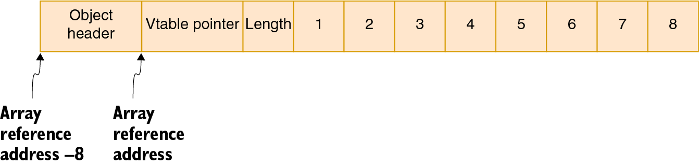

# Street Coder - Zasady do złamania i jak je złamać


tłumaczenie czatem GuPeTe 

https://www.manning.com/books/street-coder

Wskazane czytanie na jasnym tle. Jesli masz czarne tlko nie bedziesz widzial polowy obrazków !


Od Autora :

Będę rozmawiał o mojej książce "Street Coder" i konkretnie o fragmencie, w którym wspominam o przydatnych antywzorcach. Co to są antywzorce, zastanawiasz się? Antywzorce są odpowiednikami najlepszych wzorców projektowych i praktyk, w zasadzie zasad i tak dalej. W świecie programowania mamy pewne paradygmaty w rozwoju oprogramowania, jak na przykład w ciągu czasu programowania opracowaliśmy pewne najlepsze praktyki, które możemy zastosować do programowania, nie musząc sięgać po to, jak możemy pracować nad określonym problemem. Są to dla nas jak skróty, ale złe w nich jest to, że stały się bardzo utrwalone, ale jednocześnie stały się jak kult programistyczny, jakbyś naprawdę mógł rozwiązać problem innym podejściem niż zalecany wzorzec. W przydatnych antywzorcach omawiam pewne techniki, które przeczą niektórym z tych paradygmatów, zasad i wzorców projektowych. Co mamy tutaj? Pozwól mi zacząć od mówienia trochę o sobie. Jestem samoukiem programistą. Nie uczyłem się w college'u o programowaniu. Nauczyłem się sam, ponieważ dorastałem w małym mieście w środkowej Turcji, więc bez dostępu do wielu książek ani zasobów do programowania, co faktycznie zmusiło mnie do szukania skomplikowanych szczegółów programowania, przeglądania fragmentów czasopism i pytań znajomych, każdego, kto się na tym znał. Musiałem się nauczyć wszystkiego sam, co faktycznie dało mi pewną perspektywę na rozwój oprogramowania, której niektórzy ludzie, którzy uczą się o tym w college'u, mogą nie mieć. Jedną z najważniejszych rzeczy, jakie się nauczyłem, było to, że niektóre koncepcje, które mogą wydawać się nudne lub bezużyteczne w programie uniwersyteckim, mogą być naprawdę bardziej przydatne w profesjonalnym środowisku, niż myślimy, i podobnie wiele z najlepszych praktyk, które się uczymy, lub złych praktyk, które nam odradzano, mogą być naprawdę przydatne w tych ustawieniach.

Więc myślę, że zdobyłem pewną perspektywę, którą mogę dostarczyć programistom na początku ich kariery, aby mogli zastosować ją do swojego własnego rozwoju i wzrostu osobistego. Później, w mojej karierze, pracowałem jako inżynier oprogramowania w firmie Microsoft. Założyłem również popularną stronę o nazwie Eksi Sozluk, która jest jedną z najpopularniejszych tureckich stron internetowych na świecie w chwili obecnej. Mam teraz ponad 20 lat doświadczenia zawodowego w programowaniu, więc "Street Coder" to książka, w której staram się przekazać część mojego doświadczenia, aby spowodować zmianę perspektywy u programistów. To właśnie jest moim celem, i w książce staram się udzielić kilku wskazówek i trików, tak jak tutaj. To, co próbuję zrobić, zamiast być kompleksową książką z wytycznymi programowania, to być światłem przewodnim dla programistów, którzy chcą zmienić swoje podejście do, jak już wspomniałem, ustalonych paradygmatów i najlepszych praktyk. Wspominam głównie o rzeczach, które są najczęściej pomijane w rozwoju oprogramowania, więc, jak powiedziałem, przygotowałem długie ćwiczenia, i prawdopodobnie nie będziemy mieli czasu, aby przejść przez każde z nich, ale dobra wiadomość jest taka, że wszystko to znajduje się w książce. Więc jeśli kupisz książkę, będziesz miał dostęp do wszystkiego, ale postaram się być jak najbardziej klarowny.

w tej prezentacji, więc jak już powiedziałem, antywzorce to po prostu odpowiedniki wzorców projektowych lub najlepszych praktyk. Używam tego jako ogólnego terminu, w zasadzie rzeczy, na które patrzy się z góry w obecnej chwili w programowaniu. Jedną z rzeczy, które mogą sprawić ci trudność, jest powtarzanie siebie. Mam na myśli, że jedną z najlepszych zasad jest DRY: don't repeat yourself, prawda?
Dlatego ja zamiast tego sugeruję powtarzanie siebie w książce, więc polecam zrobienie odwrotnie niż niepowtarzanie siebie. Dlaczego więc w ogóle istnieje zasada o nazwie DRY, czyli nie powtarzaj się? Jednym z powodów tego jest to, że ludzie nie chcą robić wszystkiego od nowa. Nie chcą powtarzać siebie. Nie chcą marnować czasu na wpisywanie czegoś wielokrotnie,
ani nie chcą być obciążeni utrzymaniem dwóch rzeczy jednocześnie. Powiedzmy, że masz fragment kodu i chcesz go użyć w dwóch różnych miejscach. W takim przypadku powtarzanie się obciążyłoby cię aktualizacją dwóch różnych miejsc, gdy masz aktualizację i zmianę dla tego fragmentu kodu, więc musisz pracować dwa razy więcej, prawda? Dlatego wszyscy mówią: "Nie powtarzaj się; po prostu używaj ponownie kodu," ale sprawy może być zła. Oczywiście nie zawsze jest zła.  Najczęściej może być użyteczne, ale może być złe, gdy faktycznie wprowadza się złożoność i sprzężenie z tym. Chciałbym przejść przez przykład i pokazać, jak to może się zdarzyć i przerodzić z kuli śnieżnej w lawinę, próbując ciągle używać tego samego kodu. 

	Pozwól mi uruchomić Visual Studio. Stworzę po prostu aplikację konsolową, bo to najłatwiejsze do odtworzenia w ten sposób, i w razie problemów z kodem, mogę przywrócić jedno z wcześniejszych rozwiązań, ale chcę to napisać od nowa, abyś mógł przeżyć ten proces razem ze mną. Powiedzmy, nazwijmy to NewStream. .NET 5 jest w porządku,
więc utwórzmy tutaj nasz projekt. Mamy tutaj prostą aplikację "Witaj, świecie!", prawda? A powiedzmy, mamy prosty problem jak normalizacja formularza. Co to jest normalizacja? Zazwyczaj, gdy masz formularz na swojej stronie internetowej lub w aplikacji internetowej, firmy mogą zdecydować się na normalizację pól. Na przykład, jeśli masz imię pisane małymi literami, chcą, żeby było, jak w tym przypadku, powiedzmy, wpisuję moje imię tutaj, a ludzie mogą chcieć to znormalizować tylko po to, aby widzieć to w jednolity sposób, aby wszystkie nazwy klientów wyglądały jednolicie. To zazwyczaj nie jest dobry pomysł. Mam na myśli, że mogą istnieć kultury, w których preferowane są małe litery, albo mogą mieć osobiste preferencje co do małych liter w swoim imieniu, więc faktycznie nie polecam normalizacji, ale możesz spotkać się z takim przypadkiem w swojej karierze. Twoi szefowie mogą podejść i powiedzieć: "Hej, po prostu to znormalizuj i nie obchodzi mnie nic więcej", więc jak to zrobić? To wydaje się być prosty problem, więc po prostu poproszę o wejście, ReadLine. Przeczytajmy imię z konsoli i poprośmy o imię, "Podaj swoje imię: ", prawda? Mamy tu imię i chcielibyśmy wydrukować wynik tutaj, tak, że gdy wpiszę moje imię tak, jak jest, zostanie to wydrukowane tak, jak jest, więc chciałbym to znormalizować, prawda? Więc to, co zrobię, to po prostu wywołam funkcję i wygeneruję dla niej kod. Dużo korzystam z narzędzi do generowania kodu w Visual Studio, ponieważ pomagają mi one, jak już to powtarzam. (śmiech) Tak więc, mamy funkcję tutaj, prawda? To, co robię, to po prostu naciskam Ctrl + kropka, i pojawia się menu, menu refaktoryzacji, a ja już mam opcję utworzenia funkcji, więc właśnie to robię. Po prostu naciskam Enter i podaję to tutaj, więc po prostu dzielimy imię na poszczególne słowa
i kapitalizujemy je indywidualnie, prawda? Więc to, co zrobię, to podzielimy to na tablicę w ten sposób, używając spacji jako separatora, i będę po prostu przechodzić przez każde słowo, ups, nie tak, bo będę potrzebować indeksu, aby umieścić znormalizowane słowo ponownie w tablicy, i po prostu zwrócę, String.Join,

...cdn


## 1 Na ulicy

Ten rozdział obejmuje

- Rzeczywistość ulic
- Kim jest programista uliczny?
- Problemy współczesnego rozwoju oprogramowania
- Jak rozwiązać swoje problemy za pomocą wiedzy ulicznej


Mam szczęście. Napisałem swoją pierwszą pętlę w latach 80. Wystarczyło mi tylko włączyć komputer, co zajęło mniej niż sekundę, napisać 2 linie kodu, wpisać RUN, i voila! Ekran nagle zapełnił się moim imieniem. Byłem od razu pod wrażeniem możliwości. Jeśli mogłem to zrobić za pomocą 2 linii, wyobraź sobie, co mogłem zrobić z 6 liniami, czy nawet z 20 liniami! Moje dziewięcioletnie mózgowe było zalane tyle dopaminy, że od razu uzależniłem się od programowania.

Dziś rozwój oprogramowania jest ogromnie bardziej skomplikowany. Nie ma już tej prostoty lat 80., gdy interakcje użytkownika ograniczały się do "naciśnij dowolny klawisz, aby kontynuować", chociaż czasami użytkownicy mieli problem ze znalezieniem "dowolnego" klawisza na swojej klawiaturze. Nie było okien, myszy, stron internetowych, elementów interfejsu użytkownika, bibliotek, frameworków, maszyn wirtualnych, urządzeń mobilnych. Miałeś tylko zestaw poleceń i statyczną konfigurację sprzętu.

Istnieje powód dla każdego poziomu abstrakcji, który teraz posiadamy, i nie jest tak, że jesteśmy masochistami, z wyjątkiem programistów Haskell1. Te abstrakcje są wprowadzane, ponieważ są jedynym sposobem na nadążanie za obecnymi standardami oprogramowania. Programowanie już nie polega na wypełnianiu ekranu swoim imieniem. Twoje imię musi być we właściwej czcionce i musi znajdować się w oknie, które możesz przeciągać i zmieniać jego rozmiar. Twój program musi wyglądać dobrze. Powinien obsługiwać kopiowanie i wklejanie. Musi obsługiwać różne nazwy dla konfigurowalności. Być może powinien przechowywać nazwy w bazie danych, nawet w chmurze. Wypełnianie ekranu swoim imieniem już nie jest takie zabawne.

Na szczęście mamy zasoby, które pomagają nam poradzić sobie z tą złożonością: uniwersytety, hackathony, obozy programistyczne, kursy online i kaczki gumowe.

PORADA

Kaczka gumowa debugging to ezoteryczna metoda znajdowania rozwiązań problemów programistycznych. Polega na rozmawianiu z żółtym plastikowym ptakiem. Opowiem ci więcej o tym w rozdziale o debugowaniu.


### 1.1 Co ma znaczenie na ulicach
Świat zawodowego rozwoju oprogramowania jest dość tajemniczy. Niektórzy klienci przysięgają, że zapłacą Ci w ciągu kilku dni za każdym razem, gdy do nich dzwonisz przez miesiące. Niektórzy pracodawcy w ogóle nie płacą Ci wynagrodzenia, ale upierają się, że zapłacą Ci "kiedy już zarobią pieniądze". Chaotyczna przypadkowość wszechświata decyduje, kto dostaje biurowe okno. Niektóre błędy znikają, gdy używasz debugera. Niektóre zespoły w ogóle nie korzystają z kontroli wersji. Tak, to przerażające. Ale musisz zmierzyć się z rzeczywistością.

Jedno jest jasne na ulicach: najważniejsza jest wydajność. Nikogo nie obchodzi twój elegancki projekt, twoja wiedza o algorytmach czy wysokiej jakości kod. Wszystko, co ich obchodzi, to ile możesz dostarczyć w określonym czasie. Wbrew intuicji, dobry projekt, dobre wykorzystanie algorytmów i wysokiej jakości kod mogą znacząco wpływać na twoją wydajność, a tego wielu programistów nie rozumie. Takie sprawy są zazwyczaj postrzegane jako przeszkody, tarcia między programistą a terminem. Taki sposób myślenia może uczynić z ciebie zombi z kulą u nogi.

W rzeczywistości niektórym ludziom zależy na jakości twojego kodu: twoim kolegom. Nie chcą pilnować twojego kodu. Chcą, żeby twój kod działał, był łatwo zrozumiały i możliwy do utrzymania. To jest coś, co im zawdzięczasz, ponieważ kiedy raz zatwierdzisz swój kod w repozytorium, staje się on kodem każdego. W zespole wydajność zespołu jest ważniejsza niż wydajność każdego z jego członków. Jeśli piszesz zły kod, spowalniasz swoich kolegów. Brak jakości twojego kodu szkodzi zespołowi, a spowolniony zespół szkodzi produktowi, a niezrealizowany produkt szkodzi twojej karierze.

Najłatwiejszą rzeczą, którą możesz napisać od zera, jest pomysł, a następną najłatwiejszą rzeczą jest projekt. Dlatego dobre projektowanie ma znaczenie. Dobre projektowanie to nie coś, co dobrze wygląda na papierze. Możesz mieć projekt w głowie, który działa. Natkniesz się na ludzi, którzy nie wierzą w projektowanie i improwizują kod. Ci ludzie nie cenią swojego czasu.

Podobnie dobry wzorzec projektowy czy algorytm może zwiększyć twoją wydajność. Jeśli nie pomaga w twojej wydajności, nie jest użyteczny. Ponieważ prawie wszystko można przyporządkować wartość pieniężną, wszystko, co robisz, można zmierzyć pod względem wydajności.

Możesz mieć wysoką wydajność przy złym kodzie, ale tylko w pierwszej iteracji. W chwili, gdy klient prosi o zmianę, zostajesz z utrzymaniem okropnego kodu. Przez całą tę książkę będę mówił o przypadkach, w których możesz zdać sobie sprawę, że wpadasz w pułapkę i wydostać się z niej, zanim stracisz zmysły.

### 1.2 Kim jest programista uliczny?
Microsoft rozważa dwie różne kategorie kandydatów podczas rekrutacji: absolwentów wydziałów informatyki i ekspertów branżowych, którzy posiadają znaczne doświadczenie w rozwoju oprogramowania.

Nie ważne, czy jesteś samoukiem czy ktoś, kto studiował informatykę, na początku swojej kariery brakuje ci wspólnego elementu: wiedzy ulicznej, czyli umiejętności wiedzenia, co jest najważniejsze. Samouk programista ma za sobą wiele prób i błędów, ale może brakować mu wiedzy na temat formalnej teorii i tego, jak można ją zastosować w codziennym programowaniu. Absolwent uczelni z kolei wie wiele o teorii, ale brakuje mu praktyczności i czasami podejścia krytycznego do tego, co się nauczył. Patrz rysunek 1.1.


Korpus, który zdobywasz w szkole, nie ma z nim związanej priorytetowości. Uczysz się według ścieżki edukacyjnej, a nie według ważności. Nie masz pojęcia, jakie pewne przedmioty mogą być użyteczne na ulicach, gdzie konkurencja jest bezlitosna. Terminy są nierealistyczne. Kawa jest zimna. Najlepszy framework na świecie ma ten jeden błąd, który sprawia, że tydzień twojej pracy idzie na marne. Twoja doskonale zaprojektowana abstrakcja rozpada się pod naciskiem klienta, który nieustannie zmienia swoje wymagania. Udaje ci się szybko zrefaktoryzować swój kod za pomocą kopiuj-wklej, ale teraz musisz edytować 15 różnych miejsc tylko po to, aby zmienić jedną wartość konfiguracji.

Przez lata zdobywasz nowe umiejętności, aby radzić sobie z niejasnością i złożonością. Samoucy programiści uczą się pewnych algorytmów, które im pomagają, a absolwenci uczelni w końcu rozumieją, że najlepsza teoria nie zawsze jest najbardziej praktyczna.

Programista uliczny to każdy z doświadczeniem w rozwoju oprogramowania w przemyśle, którego przekonania i teorie zostały ukształtowane przez rzeczywistość nierealistycznego szefa, który chciał, żeby tydzień pracy został zrobiony rano. Nauczyli się oni robić kopie zapasowe wszystkiego na wielu nośnikach po tym, jak stracili tysiące linii kodu i musieli to wszystko pisać od nowa. Widzieli migoczące światło C-beam w pomieszczeniu serwerowym spowodowane palącymi się dyskami twardymi i walczyli z administratorem systemu na drzwiach pomieszczenia serwerowego, tylko po to, aby uzyskać dostęp do produkcji, ponieważ ktoś właśnie wdrożył nieprzetestowany kawałek kodu. Testowali swój kod kompresji oprogramowania na własnym kodzie źródłowym, tylko po to, aby odkryć, że wszystko zostało skompresowane do jednego bajtu, a wartość tego bajtu wynosi 255. Alorytm dekompresji musi być jeszcze wynaleziony.

Właśnie skończyłeś studia i szukasz pracy, albo fascynujesz się programowaniem, ale nie masz pojęcia, co cię czeka. Wyszedłeś z obozu programistycznego i szukasz możliwości zatrudnienia, ale nie jesteś pewien, co brakuje ci w umiejętnościach. Nauczyłeś się samodzielnie jakiegoś języka programowania, ale nie wiesz, czego brakuje ci w swoim zestawie narzędzi umiejętności. Witaj na ulicach.

### 1.3 Wspaniali programiści uliczni
Oprócz reputacji na ulicy, honoru i lojalności, programista uliczny powinien idealnie posiadać te cechy:

#### 1.3.1 Podejście Krytyczne
Osoba rozmawiająca z samą sobą jest uważana za nietypową, zwłaszcza jeśli nie ma odpowiedzi na pytania, które sobie zadaje. Jednakże bycie osobą krytyczną, zadawanie pytań sobie, kwestionowanie najbardziej powszechnie akceptowanych pojęć i ich dekonstrukcja mogą oczyścić twoją wizję.

Wiele książek, ekspertów od oprogramowania i Slavoj Žižek podkreśla wagę bycia krytycznym i dociekliwym, ale niewielu z nich dostarcza ci narzędzi do pracy. W tej książce znajdziesz przykłady bardzo znanych technik i najlepszych praktyk oraz jak mogą być mniej skuteczne, niż twierdzą.

Krytyka techniki nie oznacza, że jest ona bezużyteczna. Jednakże poszerzy twoje horyzonty, dzięki czemu będziesz w stanie zidentyfikować pewne przypadki użycia, w których alternatywna technika może być lepsza.

Celem tej książki nie jest omówienie każdej techniki programowania od podstaw do końca, ale przedstawienie ci perspektywy, jak traktować najlepsze praktyki, jak je priorytetyzować na podstawie wartości, i jak możesz rozważyć za i przeciw alternatywnych podejść.

#### 1.3.2 Skoncentrowany na Wynikach
Możesz być najlepszym programistą na świecie, znającym wszystkie niuanse rozwoju oprogramowania, potrafiącym wymyślić najlepszy projekt dla własnego kodu, ale to nic nie znaczy, jeśli nie dostarczasz, jeśli nie wypuszczasz produktu.

Według paradoksu Zenona, aby osiągnąć cel końcowy, musisz najpierw osiągnąć punkt w połowie drogi. To paradoks, ponieważ aby osiągnąć punkt w połowie drogi, musisz osiągnąć punkt w ćwiartce drogi, i tak dalej, co sprawia, że nie możesz osiągnąć żadnego miejsca. Zenon miał rację: aby mieć produkt końcowy, musisz spełniać terminy i osiągać po drodze cele pośrednie. W przeciwnym razie niemożliwe jest osiągnięcie celu końcowego. Bycie skoncentrowanym na wynikach oznacza również koncentrację na celach pośrednich, na postępach.

„Jak projekt ma się stać rok po terminie? ... Dzień po dniu.”

—Fred Brooks, The Mythical Man Month

Osiąganie wyników może oznaczać poświęcenie jakości kodu, elegancji i doskonałości technicznej. Ważne jest, aby mieć takie spojrzenie na rzeczywistość i zachować kontrolę nad tym, co robisz i dla kogo.

Poświęcanie jakości kodu nie oznacza poświęcania jakości produktu. Jeśli masz dobre testy, jeśli są dobre wymagania pisemne, możesz nawet pisać wszystko w PHP. Może to jednak oznaczać, że w przyszłości będziesz musiał ponieść pewne koszty, ponieważ kod niskiej jakości w końcu cię ugryzie. Nazywa się to karmą kodu.

Niektóre z technik, które przyswoisz z tej książki, pomogą ci podejmować decyzje w celu osiągnięcia wyników.

#### 1.3.3 Wysoka Wydajność
Największymi czynnikami wpływającymi na szybkość twego rozwoju są doświadczenie, dobre i jasne specyfikacje oraz mechaniczne klawiatury. Tylko żartuję - wbrew powszechnemu przekonaniu, mechaniczne klawiatury wcale nie przyspieszają twojej pracy. Po prostu wyglądają fajnie i świetnie irytują twojego partnera. W rzeczywistości nie sądzę, że prędkość pisania ma cokolwiek wspólnego z szybkością rozwoju. Twoja pewność w prędkości pisania może nawet skłonić cię do pisania bardziej rozbudowanego kodu, niż jest to konieczne.

Część wiedzy można zdobyć, ucząc się na cudzych błędach i desperacji. W tej książce znajdziesz przykłady takich przypadków. Techniki i wiedza, które przyswoisz, sprawią, że napiszesz mniej kodu, podejmiesz szybsze decyzje i pozwoli ci mieć jak najmniejsze zadłużenie techniczne, aby nie spędzać dni na rozplątywaniu kodu, który napisałeś zaledwie pół roku temu.

#### 1.3.4 Przyjmowanie Złożoności i Niejasności
Złożoność jest przerażająca, a niejasność jeszcze bardziej, ponieważ nie wiesz nawet, jak bardzo powinieneś się bać, co jeszcze bardziej cię przeraża.

Radzenie sobie z niejasnością to jedna z kluczowych umiejętności, o które pytają rekruterzy Microsoftu podczas rozmów kwalifikacyjnych. Zwykle obejmuje to hipotetyczne pytania, takie jak "Ile jest warsztatów naprawy skrzypiec w Nowym Jorku?", "Ile jest stacji benzynowych w Los Angeles?" lub "Ile agentów tajnej służby ma prezydent i jaki mają grafik zmianowy? Podaj ich imiona, a najlepiej pokaż ich ścieżki chodzenia na tym planie Białego Domu."

Sztuczka polega na rozjaśnianiu wszystkiego, co wiesz o problemie i opracowaniu przybliżenia na podstawie tych faktów. Na przykład możesz zacząć od ludności Nowego Jorku i od ilości osób, które mogą tam grać na skrzypcach. To da ci pojęcie o wielkości rynku i o tym, ile konkurencji może obsłużyć ten rynek.

Podobnie, gdy stajesz przed problemem z nieznanymi parametrami, takim jak oszacowanie czasu potrzebnego do opracowania funkcji, zawsze możesz zawęzić okno przybliżenia na podstawie tego, co wiesz. Możesz wykorzystać swoją wiedzę na swoją korzyść i jak najbardziej ją wykorzystać, co może zredukować niejasność do minimum.

Co ciekawe, radzenie sobie z złożonością jest podobne. Coś, co wydaje się niezwykle skomplikowane, można podzielić na części, które są znacznie bardziej zarządzalne, mniej złożone i ostatecznie prostsze.

Im więcej rzeczy wyjaśnisz, tym więcej będziesz w stanie uporać się z nieznanym. Techniki, które przyswoisz z tej książki, rozjaśnią niektóre z tych rzeczy i sprawią, że będziesz pewniejszy w radzeniu sobie z niejasnością i złożonością.


### 1.4 Problemy nowoczesnego rozwoju oprogramowania
Oprócz wzrastającej złożoności, licznych warstw abstrakcji i moderacji na Stack Overflow, nowoczesny rozwój oprogramowania ma również inne problemy:

1. Jest zbyt wiele technologii: zbyt wiele języków programowania, zbyt wiele frameworków, i z pewnością zbyt wiele bibliotek, biorąc pod uwagę, że npm (menedżer pakietów dla frameworka Node.js) miał bibliotekę o nazwie "left-pad" służącą tylko do dodawania spacji na końcu ciągu znaków.

2. Jest napędzany paradygmatami, a zatem konserwatywny. Wielu programistów uważa języki programowania, najlepsze praktyki, wzorce projektowe, algorytmy i struktury danych za relikty starożytnej obcej rasy i nie ma pojęcia, jak one działają.

3. Technologia staje się bardziej nieprzejrzysta, podobnie jak samochody. Ludzie kiedyś potrafili samodzielnie naprawiać swoje samochody. Teraz, gdy silniki stają się coraz bardziej zaawansowane, pod maską widzimy tylko metalową pokrywę, podobną do tej na grobowcu faraona, która uwolni przeklęte dusze na każdego, kto ją otworzy. Technologie w rozwoju oprogramowania są podobne. Mimo że prawie wszystko jest teraz open source, uważam, że nowe technologie są bardziej niejasne niż dekompilowane kody binarne z lat 90., ze względu na ogromnie wzrosłą złożoność oprogramowania.

4. Ludzie nie przejmują się nadmiernym obciążeniem swojego kodu, ponieważ mamy dostęp do rzeczywistości w skali dziesiątek tysięcy. Napisałeś nową prostą aplikację do czatu? Dlaczego by jej nie spakować z pełnoprawną przeglądarką internetową, bo wiesz, że to po prostu oszczędza ci czas, i nikt nie kiwnie powieką, kiedy i tak używasz gigabajtów pamięci?

5. Programiści skupiają się na swoim stosie technologicznym i ignorują, jak reszta działa, i słusznie: muszą zapewnić jedzenie na stole, i nie ma czasu na naukę. Nazywam to "problemem kuchennych programistów". Wiele rzeczy, które wpływają na jakość ich produktu, pozostaje niezauważonych ze względu na ograniczenia, które mają. Programista webowy zazwyczaj nie ma pojęcia, jak działają protokoły sieciowe pod warstwą internetu. Akceptują opóźnienia podczas ładowania strony takie, jakie są, i uczą się żyć z nimi, ponieważ nie wiedzą, że drobny techniczny szczegół, jak zbyt długa łańcuch certyfikatów, może spowolnić ładowanie strony internetowej.

6. Ze względu na nauczane paradygmaty, istnieje stigma przeciwko monotonnej pracy, takiej jak powtarzanie się czy kopiuj-wklej. Oczekuje się, że znajdziesz rozwiązanie DRY (Don't Repeat Yourself). Tego rodzaju kultura sprawia, że zaczynasz wątpić w siebie i swoje umiejętności, co szkodzi twojej produktywności.

> **HISTORIA NPM I LEFT-PAD**
>
> npm stało się w ostatniej dekadzie de facto ekosystemem pakietów JavaScript. Ludzie mogli przyczyniać się do tego ekosystemu swoimi własnymi pakietami, a inne pakiety mogły z nich korzystać, ułatwiając rozwijanie dużych projektów. Azer Koçulu był jednym z tych programistów. Left-pad był tylko jednym z pakietów spośród 250, które przyczynił się do ekosystemu npm. Miał tylko jedną funkcję: dodawać spacje do ciągu znaków, aby zawsze miał stały rozmiar, co jest dość trywialne.
>
> Pewnego dnia otrzymał e-mail od npm, w którym poinformowano go, że usunięto jeden z jego pakietów o nazwie "Kik", ponieważ firma o tej samej nazwie złożyła skargę. npm zdecydowało się usunąć pakiet Azer'a i przyznać nazwę innej firmie. To sprawiło, że Azer był tak zły, że usunął wszystkie swoje pakietu, w tym left-pad. Problem polegał na tym, że były setki projektów o dużych rozmiarach na całym świecie, które bezpośrednio lub pośrednio używały tego pakietu. Jego działania spowodowały zatrzymanie wszystkich tych projektów. To było dość katastrofalne i dobre nauczanie zaufania, jakie mamy do platform.
>
> Morał z tej historii jest taki, że życie na ulicy jest pełne niepożądanych niespodzianek.
>

W tej książce proponuję rozwiązania tych problemów, w tym przejście przez niektóre podstawowe koncepcje, które mogą ci się wydać nudne, priorytetyzowanie praktyczności, prostoty, odrzucanie niektórych długo utrzymywanych niepodważalnych przekonań i, co najważniejsze, kwestionowanie wszystkiego, co robimy. Wartość polega na zadawaniu pytań najpierw.

#### 1.4.1 Zbyt wiele technologii
Nasze nieustanne poszukiwanie najlepszej technologii wynika z fałszywego przekonania o istnieniu srebrnej kuli. Myślimy, że istnieje technologia, która może zwiększyć naszą produktywność o rzędy wielkości. Nie istnieje. Na przykład Python7 to język interpretowany. Nie musisz kompilować kodu Pythona - działa od razu. Co więcej, nie musisz określać typów zmiennych, które deklarujesz, co sprawia, że jesteś jeszcze szybszy, więc Python musi być lepszą technologią niż C#, prawda? Niekoniecznie.

Ponieważ nie poświęcasz czasu na adnotowanie swojego kodu typami i kompilację, pomijasz popełniane błędy. Oznacza to, że możesz je odkryć tylko podczas testowania lub w produkcji, co jest znacznie droższe niż po prostu kompilacja kodu. Większość technologii to kompromisy, a nie zwiększacze produktywności. To, co zwiększa twoją produktywność, to jak biegły jesteś w tej technologii i jakie masz techniki, a nie to, jakie technologie używasz. Tak, są lepsze technologie, ale rzadko sprawiają one różnicę rzędu wielkości.

Kiedy chciałem stworzyć moją pierwszą interaktywną stronę internetową w 1999 roku, absolutnie nie miałem pojęcia, jak zacząć pisać aplikację internetową. Gdybym próbował najpierw znaleźć najlepszą technologię, musiałbym nauczyć się VBScript lub Perl. Zamiast tego użyłem tego, co najlepiej znałem wtedy: Pascal.8 Był to jeden z najmniej odpowiednich języków do tego celu, ale zadziałał. Oczywiście były z nim problemy. Za każdym razem, gdy się zawieszał, proces pozostawał aktywny w pamięci na losowym serwerze w Kanadzie, i użytkownik musiał dzwonić do dostawcy usług za każdym razem i prosić o ponowne uruchomienie fizycznego serwera. Mimo to Pascal pozwolił mi szybko osiągnąć prototyp, ponieważ czułem się z nim swobodnie. Zamiast uruchomić stronę internetową, którą sobie wyobrażałem po miesiącach pracy i nauki, napisałem i opublikowałem kod w trzy godziny.

Z niecierpliwością czekam, aby pokazać ci sposoby, dzięki którym możesz być bardziej efektywny, korzystając z istniejącego zestawu narzędzi, które masz pod ręką.


#### 1.4.2 Paralotniarstwo na paradoksach
Najwcześniejszym paradygmatem programowania, z którym się spotkałem, był programowanie strukturalne w latach 80. Programowanie strukturalne polegało głównie na pisaniu kodu w strukturalnych blokach, takich jak funkcje i pętle, zamiast numerów linii, instrukcji GOTO czy wysiłku i łez. Sprawiało to, że kod był łatwiejszy do czytania i utrzymania, nie tracąc przy tym wydajności. Programowanie strukturalne zainteresowało mnie językami programowania takimi jak Pascal i C.

Następny paradygmat, z którym się zetknąłem, pojawił się co najmniej pół dekady po tym, jak nauczyłem się o programowaniu strukturalnym: programowanie obiektowe, czyli OOP (Object-Oriented Programming). Pamiętam, że wtedy magazyny komputerowe nie mogły się go doczekać. Była to kolejna wielka rzecz, która pozwoliła nam pisać jeszcze lepsze programy niż w przypadku programowania strukturalnego.

Po OOP spodziewałem się, że będę zetknął się z nowym paradygmatem co pięć lat lub coś w tym stylu. Jednakże zaczęły się one pojawiać częściej. W latach 90. poznaliśmy JIT-compiled9 zarządzane języki programowania dzięki nadejściu Javy, skrypty internetowe z użyciem JavaScript oraz programowanie funkcyjne, które powoli zaczęło przesuwać się do mainstreamu pod koniec lat 90.

Potem przyszły lata 2000. W następnych dekadach zaczęliśmy używać coraz częściej terminu aplikacje wielowarstwowe N-tier. Grube klienty. Cienkie klienty. Generyki. MVC, MVVM i MVP. Programowanie asynchroniczne zaczęło się rozpowszechniać dzięki obietnicom (promises), przyszłościom (futures) i ostatecznie programowaniu reaktywnemu. Mikroserwisy. Więcej koncepcji związanych z programowaniem funkcyjnym, takich jak LINQ, dopasowywanie wzorców (pattern matching) i niemutowalność, znalazło się w językach mainstreamowych. To jest tornado słów kluczowych.

Nawet nie wspomniałem jeszcze o wzorcach projektowych czy najlepszych praktykach. Mamy niezliczone najlepsze praktyki, porady i sztuczki dotyczące prawie każdego tematu. Napisano manifesty na temat tego, czy powinniśmy używać tabulacji czy spacji do wcięć w kodzie źródłowym, mimo że oczywista odpowiedź brzmi: spacje.10

Zakładamy, że nasze problemy można rozwiązać, stosując paradygmat, wzorzec, framework lub bibliotekę. Biorąc pod uwagę złożoność problemów, które teraz mamy do rozwiązania, to nie jest bezpodstawne. Jednak ślepe przyjmowanie tych narzędzi może przysporzyć więcej problemów w przyszłości: mogą spowolnić pracę, wprowadzając nową wiedzę dziedzinową do nauki oraz własne zestawy błędów. Mogą nawet zmusić cię do zmiany projektu. Ta książka sprawi, że będziesz bardziej pewny, że używasz wzorców poprawnie, podchodząc do nich bardziej dociekliwie, i będziesz gromadzić dobre argumenty do użycia podczas przeglądów kodu.


#### 1.4.3 Czarne skrzynki technologii
Framework lub biblioteka to pakiet. Programiści instalują go, czytają jego dokumentację i używają. Ale zwykle nie wiedzą, jak działa. Tak samo podchodzą do algorytmów i struktur danych. Używają słownika, ponieważ wygodnie jest przechowywać klucze i wartości. Nie znają konsekwencji.

Niewzruszone zaufanie do ekosystemów pakietów i frameworków jest podatne na poważne błędy. Może nas to kosztować dni debugowania, ponieważ po prostu nie wiedzieliśmy, że dodawanie elementów do słownika o tym samym kluczu będzie różnić się od listy pod względem wydajności wyszukiwania. Używamy generatorów w C#, gdy wystarczyłby prosty tablica, i doznajemy znacznego pogorszenia wydajności, nie wiedząc dlaczego.

Pewnego dnia w 1993 roku przyjaciel podał mi kartę dźwiękową i poprosił, żebym zainstalował ją w moim komputerze PC. Tak, kiedyś potrzebowaliśmy dodatkowych kart, żeby uzyskać porządny dźwięk z PC, bo inaczej słyszeliśmy tylko beep. W każdym razie nigdy wcześniej nie otwierałem obudowy swojego komputera, i bałem się, że coś zniszczę. Powiedziałem mu: "Czy nie możesz tego zrobić za mnie?" Mój przyjaciel powiedział mi: "Musisz to otworzyć, żeby zobaczyć, jak to działa."

To rezonowało we mnie, ponieważ zrozumiałem, że moje lęki wynikały z mojej niewiedzy, a nie z mojej niezdolności. Otwarcie obudowy i zobaczenie wnętrza mojego własnego komputera mnie uspokoiło. Zawierał tylko kilka płyt. Karta dźwiękowa wchodziła do jednego z gniazd. To dla mnie już nie było tajemnicze pudełko. Później użyłem tej samej techniki, ucząc studentów szkoły artystycznej podstaw komputerów. Otworzyłem myszkę i pokazałem im jej kulkę. Myszy miały kule wtedy. No cóż, to było niestety dwuznaczne. Otworzyłem obudowę komputera. "Widzicie, to nie jest straszne, to jest płyta główna i kilka gniazd."

To później stało się moim mottem w radzeniu sobie z czymś nowym i skomplikowanym. Przestałem się bać otwierać pudełko i zwykle robiłem to jako pierwszą rzecz, żeby móc zmierzyć się z pełnym zakresem złożoności, która zawsze była mniejsza, niż się jej obawiałem.

Podobnie szczegóły tego, jak działa biblioteka, framework czy komputer, mogą mieć ogromny wpływ na twoje zrozumienie tego, co jest na nich zbudowane. Otwarcie pudełka i przyjrzenie się częściom może pomóc ci w prawidłowym użyciu pudełka. Nie musisz od razu czytać kodu od początku do końca ani przechodzić przez tysiącstronicową książkę teorii, ale przynajmniej powinieneś wiedzieć, która część idzie gdzie i jak może wpływać na twoje przypadki użycia.

Dlatego niektóre z tematów, o których będę mówił, są fundamentalne lub niskopoziomowe. Chodzi o otwarcie pudełka i zobaczenie, jak to działa, żebyśmy mogli podejmować lepsze decyzje w programowaniu na wysokim poziomie.


##### 1.4.4 Zbyt lekceważony nadmiar
Cieszę się, że każdego dnia widzimy coraz więcej aplikacji opartych na chmurze. Są one nie tylko opłacalne, ale także rzeczywistym sprawdzianem dla zrozumienia rzeczywistych kosztów naszego kodu. Kiedy zaczynasz płacić dodatkowego centa za każdą złą decyzję w kodzie, nadmiar nagle staje się problemem.

Frameworki i biblioteki zwykle pomagają nam unikać nadmiaru, co czyni je użytecznymi abstrakcjami. Niemniej jednak nie możemy przekazywać całego naszego procesu podejmowania decyzji frameworkom. Czasami musimy sami podejmować decyzje i musimy uwzględnić nadmiar. W przypadku aplikacji o dużym zasięgu nadmiar staje się jeszcze bardziej istotny. Każdy millisekundy, który oszczędzisz, może pomóc odzyskać cenne zasoby.

Priorytetem programisty nie powinno być eliminowanie nadmiaru. Niemniej jednak wiedza o tym, jak unikać nadmiaru w określonych sytuacjach i perspektywa jako narzędzie w twoim arsenale pomogą ci zaoszczędzić czas, zarówno dla siebie, jak i dla użytkownika, który czeka na ten kręcący się spinner na twojej stronie internetowej.

W trakcie lektury książki znajdziesz scenariusze i przykłady, jak można łatwo unikać nadmiaru, nie robiąc z tego swojego najważniejszego celu.

##### 1.4.5 To nie moja praca
Jednym ze sposobów radzenia sobie z złożonością jest skupienie się wyłącznie na swoich obowiązkach: na komponencie, który posiadasz, na kodzie, który piszesz, na błędach, które popełniłeś, i czasami na rozsadzanym lasagne w mikrofalówce w biurze. Może się to wydawać najbardziej efektywnym sposobem wykonywania pracy, ale jak wszelkie istoty, tak i kod jest ze sobą powiązany.

Poznanie, jak działa określona technologia, jak biblioteka wykonuje swoją pracę i jakie są zależności oraz jak są ze sobą połączone, pozwala nam podejmować lepsze decyzje, gdy piszemy kod. Przykłady w tej książce dadzą ci perspektywę skupienia się nie tylko na swojej dziedzinie, ale także na jej zależnościach i problemach, które wykraczają poza twoją strefę komfortu, ponieważ odkryjesz, że one przewidują los twojego kodu.

##### 1.4.6 Powszednie jest genialne
Wszystkie zasady nauczane w rozwoju oprogramowania sprowadzają się do jednego napomnienia: spędzaj mniej czasu wykonując swoją pracę. Unikaj powtarzających się, bezmyślnych zadań, takich jak kopiowanie i wklejanie oraz pisanie tego samego kodu od zera z drobnymi zmianami. Po pierwsze, zajmują one więcej czasu, a po drugie, jest niezwykle trudno je utrzymać.

Nie wszystkie zadania powszednie są złe. Nawet kopiowanie i wklejanie nie są złe. Istnieje silne piętno wobec nich, ale są sposoby, aby uczynić je bardziej wydajnymi niż niektóre najlepsze praktyki, które cię nauczono.

Ponadto nie cały kod, który piszesz, działa jako kod rzeczywistego produktu. Niektóry kod, który piszesz, będzie używany do opracowywania prototypu, niektóry będzie służył do testów, a niektóry będzie cię przygotowywać do właściwego zadania. Omówię niektóre z tych scenariuszy i jak możesz wykorzystać te zadania na swoją korzyść.

### 1.5 Czym książka nie jest

Ta książka nie jest kompleksowym przewodnikiem po programowaniu, algorytmach ani żadnym innym zagadnieniu. Nie uważam się za eksperta w konkretnych tematach, ale mam wystarczającą wiedzę na temat rozwoju oprogramowania. Książka składa się głównie z informacji, które nie są oczywiste w popularnych i znakomitych książkach dostępnych na rynku. To zdecydowanie nie jest przewodnikem do nauki programowania.

Doświadczeni programiści mogą znaleźć niewielkie korzyści z tej książki, ponieważ zdobyli już wystarczającą wiedzę i stali się już programistami znającymi ulice. Niemniej jednak mogą być zaskoczeni niektórymi spostrzeżeniami zawartymi w tej książce.

Ta książka to także eksperyment w dziedzinie tego, jak książki programistyczne mogą być zabawne w czytaniu. Chciałbym przede wszystkim przedstawić programowanie jako zabawę. Książka nie traktuje siebie zbyt poważnie, więc ty też nie powinieneś. Jeśli po przeczytaniu książki poczujesz się lepszym programistą i będziesz się dobrze bawić, uznaję siebie za spełnionego.


### # 1.6 Tematy

Pewne tematy będą się powtarzać w całej książce:

1. Minimalna wiedza podstawowa, która wystarcza, aby poradzić sobie na ulicach. Te tematy nie będą wyczerpujące, ale mogą zainteresować cię, jeśli wcześniej wydawały ci się nudne. To zazwyczaj kluczowa wiedza, która pomaga podjąć decyzje.
2. Powszechnie znane lub akceptowane najlepsze praktyki lub techniki, które ja proponuję jako antywzorce, które w pewnych przypadkach mogą być bardziej efektywne. Im więcej przeczytasz na ich temat, tym bardziej zostanie wyostrzony twój szósty zmysł do krytycznego myślenia o praktykach programistycznych.
3. Pozornie nieistotne techniki programowania, takie jak triki optymalizacji na poziomie CPU, które mogą wpływać na twoje decyzje i pisanie kodu na wyższym poziomie. Znajomość wewnętrznych mechanizmów, "otwieranie pudełka", ma ogromną wartość, nawet jeśli nie korzystasz bezpośrednio z tej wiedzy.
4. Techniki, które uważam za przydatne w mojej codziennej pracy programisty, które mogą ci pomóc zwiększyć swoją produktywność, w tym obgryzanie paznokci i stawanie się niewidzialnym dla swojego szefa.

Te tematy będą podkreślać nową perspektywę, kiedy będziesz przyglądać się zagadnieniom programistycznym, zmieniać twoje zrozumienie pewnych "nudnych" tematów i być może zmieniać twoje podejście do pewnych dogmatów. Pomogą ci czerpać radość z pracy.

#### Podsumowanie

Surowa rzeczywistość "ulic", czyli świata profesjonalnego rozwoju oprogramowania, wymaga umiejętności, które nie są nauczane lub nie są priorytetem w formalnym kształceniu, a czasem zupełnie pomijane podczas samodzielnej nauki.

Nowi programiści często albo zwracają uwagę na teorię, albo zupełnie ją ignorują. Ostatecznie znajdziesz złoty środek, ale można go przyspieszyć pewną perspektywą.

Współczesny rozwój oprogramowania jest znacznie bardziej złożony niż kilka dekad temu. Aby stworzyć prostą działającą aplikację, wymaga się ogromnej wiedzy na wielu poziomach.

Programiści stoją przed dylematem między tworzeniem oprogramowania a nauką. Można to przezwyciężyć, zmieniając sposób postrzegania tematów w sposób bardziej pragmatyczny.

Brak jasności co do tego, nad czym pracujesz, sprawia, że programowanie staje się nudnym zadaniem, co w rezultacie obniża twoją rzeczywistą produktywność. Lepsze zrozumienie tego, czym się zajmujesz, przyniesie ci więcej radości.

1. Haskell to ezoteryczny język programowania, który został stworzony jako wyzwanie, aby zmieścić jak najwięcej prac naukowych w jednym języku programowania.

2. Linus Torvalds stworzył system operacyjny Linux i oprogramowanie do kontroli wersji Git oraz poparł przekonanie, że przeklinanie wolontariuszy pracujących nad projektem jest w porządku, jeśli są technicznie w błędzie.

3. Slavoj Žižek to współczesny filozof, który cierpi na schorzenie, które zmusza go do krytykowania wszystkiego na świecie, bez wyjątków.

4. Zenon z Elei był starożytnym Grekiem, który żył tysiące lat temu i nie mógł przestać zadawać frustrujących pytań. Naturalnie żadne z jego pism nie przetrwały. Wszystkie Zenki to fajne chłopaki (oprócz Zenka Martyniuka).

5. PHP był kiedyś językiem programowania, który stanowił przykład tego, jak nie projektować języka programowania. O ile wiem, PHP przeszedł długą drogę od czasów, gdy był obiektem żartów programistycznych, i teraz jest fantastycznym językiem programowania. Niemniej jednak wciąż ma pewne problemy z wizerunkiem marki do rozwiązania.

6. DRY. Nie powtarzaj się. Przesąd, że jeśli ktoś powtarza linię kodu zamiast owijać ją w funkcję, natychmiast zostanie przekształcony w żabę.

7. Python to kolektywna próba promowania białych znaków, udająca praktyczny język programowania.

8. Wczesny kod źródłowy Ekşi Sözlük jest dostępny na GitHubie: https://github.com/ssg/sozluk-cgi.

9. JIT, kompilacja "just-in-time". Mityczne pojęcie stworzone przez firmę Sun Microsystems, twórcę języka Java, że jeśli skompilujesz kod podczas jego działania, stanie się szybszy, ponieważ optymalizator będzie miał więcej danych zebranych podczas działania. To nadal mit.

10. Napisałem o debacie dotyczącej używania tabulatorów czy spacji z pragmatycznego punktu widzenia: 

    https://medium.com/@ssg/tabs-vs-spaces-towards-a-better-bike-shed-686e111a5cce.

11. Spinnery są współczesnymi klepsydrami w świecie komputerów. W czasach starożytnych, komputery używały klepsydr do sprawienia, żebyś czekał przez nieokreślony czas. Spinner to nowoczesny odpowiednik tej animacji. Zazwyczaj jest to nieskończony obracający się łuk. To tylko dystrakcja, która pozwala utrzymać frustrację użytkownika pod kontrolą.

## Praktyczna teoria

Rozdział ten obejmuje:

- **Dlaczego teoria informatyki jest istotna dla twojego przetrwania**
- **Jak wykorzystać typy danych na swoją korzyść**
- **Zrozumienie cech algorytmów**
- **Struktury danych i ich dziwaczne cechy, o których twoi rodzice zapomnieli ci powiedzieć**

Wbrew powszechnie przyjętemu przekonaniu, programiści są ludźmi. Mają te same błędy poznawcze co inni ludzie w praktyce tworzenia oprogramowania. Szeroko przeceniają korzyści płynące z pomijania typów danych, niezwracania uwagi na poprawne struktury danych czy zakładania, że algorytmy są ważne jedynie dla autorów bibliotek.

Ty nie jesteś wyjątkiem. Oczekuje się od ciebie, że dostarczysz produkt na czas, z dobrą jakością, i z uśmiechem na twarzy. Jak mówi przysłowie, programista to efektywny organizm, który otrzymuje kawę jako wejście i tworzy oprogramowanie jako wyjście. Możesz równie dobrze pisać wszystko na najgorszy możliwy sposób, używać kopiuj-wklej, korzystać z kodu znalezionego na Stack Overflow, używać plików tekstowych do przechowywania danych, albo nawet zawierać pakt z demonem, jeśli twoja dusza jeszcze nie podpisała umowy o poufności.1 Tylko twoi rówieśnicy naprawdę przejmują się tym, jak wykonujesz swoją pracę – wszyscy inni chcą po prostu, aby produkt działał i był dobry.

Teoria może być przytłaczająca i niezwiązana z rzeczywistością. Algorytmy, struktury danych, teoria typów, notacja Big-O i złożoność wielomianowa mogą wydawać się skomplikowane i nieistotne w kontekście tworzenia oprogramowania. Istniejące biblioteki i frameworki już zajmują się tym w zoptymalizowany i przetestowany sposób. Zazwyczaj jest zalecane, aby nigdy nie implementować algorytmu od zera, zwłaszcza w kontekście bezpieczeństwa informacji lub napiętych terminów.

To dlaczego powinieneś interesować się teorią? Ponieważ wiedza z dziedziny informatyki pozwala ci nie tylko rozwijać algorytmy i struktury danych od podstaw, ale także właściwie określać, kiedy należy zastosować daną technikę. Pomaga zrozumieć koszty podejmowanych decyzji kompromisowych. Pomaga zrozumieć charakterystyki skalowalności kodu, który piszesz. Pozwala patrzeć w przyszłość. Prawdopodobnie nigdy nie będziesz implementować struktury danych ani algorytmu od podstaw, ale wiedza na temat ich działania uczyni cię efektywnym programistą. Poprawi twoje szanse na przetrwanie na "ulicach".

Ta książka omówi tylko pewne kluczowe aspekty teorii, które mogłeś przeoczyć w czasie nauki - niektóre mniej znane aspekty typów danych, zrozumienie złożoności algorytmów i sposób działania pewnych struktur danych. Jeśli wcześniej nie uczyłeś się o typach danych, algorytmach lub strukturach danych, ten rozdział dostarczy ci wskazówek, które mogą zainteresować cię tym tematem.


### 2.1 Krótki kurs na temat algorytmów

Algorytm to zestaw reguł i kroków mających na celu rozwiązanie problemu. Dziękuję za udział w moim wykładzie TED. Spodziewałeś się bardziej skomplikowanej definicji, prawda? Na przykład przeglądanie elementów tablicy w celu sprawdzenia, czy zawiera określoną liczbę, jest algorytmem, nawet jeśli prostym:

```csharp
public static bool Contains(int[] array, int lookFor) {
   for (int n = 0; n < array.Length; n++) {
       if (array[n] == lookFor) {
           return true;
       }
   }
   return false;
}
```

Moglibyśmy nazwać to "Algorytmem Sedata", gdybym to ja był osobą, która go wynalazła, ale prawdopodobnie był to jeden z pierwszych algorytmów, które kiedykolwiek powstały. Nie jest w żaden sposób wymyślny, ale działa i ma sens. To jeden z istotnych punktów dotyczących algorytmów: muszą one działać zgodnie z twoimi potrzebami. Niekoniecznie muszą zdziałać cuda. Kiedy wkładasz naczynia do zmywarki i ją uruchamiasz, również stosujesz algorytm. Istnienie algorytmu nie oznacza, że jest on inteligentny.

Mając powiedziane, mogą istnieć bardziej zaawansowane algorytmy, w zależności od twoich potrzeb. W poprzednim przykładzie kodu, jeśli wiesz, że lista zawiera tylko liczby całkowite, możesz dodać specjalne obsługi dla liczb niebędących dodatnimi:

```csharp
public static bool Contains(int[] array, int lookFor) {
   if (lookFor < 1) {
       return false;
   }
   for (int n = 0; n < array.Length; n++) {
       if (array[n] == lookFor) {
           return true;
       }
   }
   return false;
}
```

To może znacznie przyspieszyć działanie algorytmu, w zależności od tego, jak często jest wywoływany z liczbą ujemną. W najlepszym przypadku twoja funkcja zawsze byłaby wywoływana z liczbami ujemnymi lub zerami, zwracając od razu, nawet jeśli tablica miała miliardy liczb całkowitych. W najgorszym przypadku twoja funkcja byłaby zawsze wywoływana z liczbami dodatnimi, a ty miałbyś tylko jedno dodatkowe, zbędne sprawdzenie. Typy danych mogą ci tu pomóc, ponieważ w języku C# istnieją bezznakowe wersje liczb całkowitych, nazywane uint. Dzięki nim możesz zawsze otrzymywać liczby dodatnie, a kompilator będzie sprawdzał to za ciebie, nie wprowadzając żadnych problemów z wydajnością:

```csharp
public static bool Contains(uint[] array, uint lookFor) {
   for (int n = 0; n < array.Length; n++) {
       if (array[n] == lookFor) {
           return true;
       }
   }
   return false;
}
```

Naprawiliśmy wymaganie dotyczące liczb dodatnich, stosując restrykcje typów, zamiast zmieniać nasz algorytm, ale nadal może być on szybszy w zależności od kształtu danych. Czy posiadamy więcej informacji o danych? Czy tablica jest posortowana? Jeśli tak, możemy przypuszczać więcej o miejscu, w którym może znajdować się nasza liczba. Porównując naszą liczbę z dowolnym elementem w tablicy, możemy łatwo wykluczyć ogromną ilość elementów (zobacz rysunek 2.1).


Jeśli nasza liczba wynosi na przykład 3, i porównujemy ją z 5, możemy być pewni, że nasza liczba nie znajdzie się po prawej stronie od 5. To oznacza, że możemy natychmiast wyeliminować wszystkie elementy znajdujące się po prawej stronie listy.

Zatem, jeśli wybierzemy element ze środka listy, możemy zagwarantować, że po porównaniu możemy natychmiast wyeliminować co najmniej połowę listy. Możemy zastosować tę samą logikę do pozostałej części, wybierając środkowy punkt i kontynuując. Oznacza to, że potrzebujemy co najwyżej 3 porównań do posortowanej tablicy z 8 elementami, aby stwierdzić, czy dany element istnieje w niej. Co ważniejsze, zajmie to maksymalnie około 10 przeszukań, aby stwierdzić, czy dany element istnieje w tablicy z 1000 elementami. To jest moc, którą uzyskujesz, dzieląc na pół. Twoja implementacja mogłaby wyglądać jak w przykładzie 2.1. W zasadzie ciągle znajdujemy środkowe miejsce i eliminujemy pozostałą połowę, zależnie od tego, jak wartość, której szukamy, wpasowuje się w nią. Zapisujemy formułę w dłuższej, bardziej rozbudowanej formie, chociaż odpowiada ona (start + koniec) / 2. To dlatego, że start + koniec może przekroczyć wartość dla dużych wartości startu i końca i doprowadzić do znalezienia nieprawidłowego środka. Jeśli zapiszesz wyrażenie tak, jak w poniższym przykładzie, unikniesz tego przypadku przepełnienia.

Przykład 2.1 Wyszukiwanie w posortowanej tablicy za pomocą wyszukiwania binarnego

```csharp
public static bool Contains(uint[] array, uint lookFor) {
  int start = 0;
  int end = array.Length - 1;
  while (start <= end) {
    int middle = start + ((end - start) / 2);
    uint value = array[middle];
    if (lookFor == value) {
      return true;
    }
    if (lookFor > value) {
      start = middle + 1;
    } else {
      end = middle - 1;
    }
  }
  return false;
}
```

Tutaj zaimplementowaliśmy wyszukiwanie binarne, znacznie szybszy algorytm niż Algorytm Sedata. Teraz, gdy możemy sobie wyobrazić, jak wyszukiwanie binarne może być szybsze niż zwykła iteracja, możemy zacząć myśleć o szanowanej notacji Big-O.


#### 2.1.1 Big-O musi być dobrze zrozumiane
Zrozumienie wzrostu to doskonała umiejętność dla programisty. Bez względu na to, czy chodzi o rozmiar czy liczbę, kiedy wiesz, jak szybko coś rośnie, możesz zobaczyć przyszłość i ocenić, w jakiego rodzaju kłopoty się wpakowujesz, zanim na to zbyt dużo czasu poświęcisz. Jest to szczególnie przydatne, gdy światło na końcu tunelu rośnie, choć ty się nie poruszasz.

Notacja Big-O, jak sama nazwa wskazuje, jest po prostu sposobem wyjaśnienia wzrostu, ale również podlega nieporozumieniom. Kiedy pierwszy raz zobaczyłem O(N), myślałem, że to zwykła funkcja, która powinna zwracać liczbę. Ale nie jest. To sposób, w jaki matematycy opisują wzrost. Daje nam podstawowy pomysł na to, jak skalowalny jest algorytm. Przechodzenie przez każdy element sekwencyjnie (zwane także Algorytmem Sedata) wymaga liczby operacji liniowo proporcjonalnej do liczby elementów w tablicy. Oznaczamy to, pisząc O(N), gdzie N oznacza liczbę elementów. Nadal nie możemy dokładnie określić, ile kroków algorytm wykona, patrząc tylko na O(N), ale wiemy, że wzrasta to liniowo. Pozwala nam to dokonywać założeń na temat charakterystyki wydajności algorytmu w zależności od wielkości danych. Możemy przewidzieć, w którym momencie może stać się to problemem, patrząc na to.

Wyszukiwanie binarne, które zaimplementowaliśmy, ma złożoność O(log2n). Jeśli nie jesteś zaznajomiony z logarytmami, jest to przeciwieństwo funkcji wykładniczej, więc złożoność logarytmiczna jest naprawdę wspaniała, chyba że chodzi o pieniądze. W tym przykładzie, jeśli nasz algorytm sortowania magicznie miałby złożoność logarytmiczną, potrzebowałby tylko 18 porównań, aby posortować tablicę z 500 000 elementów. Nasza implementacja wyszukiwania binarnego jest więc świetna.

Notacja Big-O nie służy tylko do pomiaru wzrostu kroków obliczeniowych, czyli złożoności czasowej, ale również do pomiaru wzrostu zużycia pamięci, co nazywane jest złożonością przestrzeniową. Algorytm może być szybki, ale może mieć wzrost wielomianowy w pamięci, jak w naszym przykładzie sortowania. Powinniśmy zrozumieć tę różnicę.

> PORADA
>
> Wbrew powszechnemu przekonaniu, O(Nx) nie oznacza złożoności wykładniczej. Oznacza to złożoność wielomianową, która, choć dosyć zła, nie jest tak straszna jak złożoność wykładnicza, która jest oznaczana jako O(xn). Przy zaledwie 100 elementach O(N2) wykona 10 000 iteracji, podczas gdy O(2n) wykona jakąś nieprawdopodobną liczbę iteracji z 30 cyframi—nawet nie jestem w stanie tego wymówić. Istnieje także złożoność silniowa, która jest jeszcze gorsza niż wykładnicza, ale nie widziałem żadnych algorytmów, które by ją używały, poza obliczaniem permutacji lub kombinacji, prawdopodobnie dlatego, że nikt nie był w stanie jej wynaleźć do końca.


| Algorytm wyszukiwania                                        | Złożoność | Czas znalezienia rekordu wśród 60 wierszy                    |
| ------------------------------------------------------------ | --------- | ------------------------------------------------------------ |
| Domowy kwantowy komputer, który wujek Lisy ma w swoim garażu | O(1)      | 1 sekunda                                                    |
| Wyszukiwanie binarne                                         | O(log N)  | 6 sekund                                                     |
| Wyszukiwanie liniowe (ponieważ szef poprosił cię o to godzinę przed prezentacją) | O(N)      | 60 sekund                                                    |
| Praktykant przypadkowo dodał zagnieżdżone dwie pętle.        | O(N^2)    | 1 godzina                                                    |
| Jakiś kod wklejony przypadkowo ze Stack Overflow, który znajduje również rozwiązanie pewnego problemu szachowego podczas wyszukiwania, ale programista nie zadał sobie trudu, aby to usunąć | O(2^N)    | 36,5 miliarda lat                                            |
| Zamiast znalezienia rzeczywistego rekordu, algorytm próbuje znaleźć układ rekordów, które ułożone w pewien sposób tworzą szukany rekord. Dobra wiadomość polega na tym, że ten programista już tu nie pracuje. | O(N!)     | Koniec wszechświata, ale nadal przed tym, zanim małpy skończą swoje tak zwane "Shakespeare'y" |

Musisz być zaznajomiony z tym, jak notacja Big-O opisuje wzrost prędkości wykonania algorytmu i zużycia pamięci, abyś mógł podejmować świadome decyzje podczas wyboru struktury danych i algorytmu do użycia. Zapoznaj się z notacją Big-O, nawet jeśli nie musisz implementować algorytmu. Uważaj na złożoność.


### 2.2 Struktury danych od środka
Na początku była pustka. Kiedy pierwsze sygnały elektryczne trafiły do pierwszego bitu w pamięci, zrodziły się dane. Dane były początkowo wolno unoszącymi się bajtami. Te bajty zeszły się razem i stworzyły strukturę.

— Początek 0:1

Struktury danych dotyczą tego, jak dane są rozmieszczone. Ludzie odkryli, że gdy dane są rozmieszczone w określony sposób, mogą być bardziej przydatne. Lista zakupów na kartce jest łatwiejsza do czytania, jeśli każdy przedmiot znajduje się w osobnej linii. Tabela mnożenia jest bardziej użyteczna, jeśli jest ułożona w siatkę. Zrozumienie, jak działa określona struktura danych, jest kluczowe dla twojego rozwoju jako programisty. To zrozumienie zaczyna się od zerknięcia pod maskę i przyjrzenia się, jak struktura działa.

Przyjrzyjmy się na przykład tablicom. Tablica w programowaniu to jedna z najprostszych struktur danych, a jest rozmieszczana jako ciągłe elementy w pamięci. Załóżmy, że masz taką tablicę:

```csharp
var wartosci = new int[] { 1, 2, 3, 4, 5, 6, 7, 8 };
```

Możesz sobie wyobrazić, jak wyglądałaby w pamięci, jak na rysunku 2.2.


Tak naprawdę nie wyglądałoby to w pamięci w taki sposób, ponieważ każdy obiekt w .NET ma określony nagłówek, wskaźnik do tablicy wskaźników do tabeli wirtualnych metod oraz informacje o długości, jak pokazano na rysunku 2.3.




Staje się to jeszcze bardziej realistyczne, gdy spojrzysz na to, jak jest umieszczone w pamięci RAM, ponieważ RAM nie jest zbudowany z pojedynczych liczb całkowitych, jak pokazano na rysunku 2.4. Dzielę się tymi informacjami, ponieważ chcę, abyś nie bał się tych niskopoziomowych koncepcji. Ich zrozumienie pomoże ci na wszystkich poziomach programowania.


To nie jest wygląd twojej rzeczywistej pamięci RAM, ponieważ każdy proces ma swój własny fragment pamięci do niego dedykowany, zgodnie z tym, jak działają nowoczesne systemy operacyjne. Ale ten układ będzie zawsze mieć z nim do czynienia, chyba że zaczniesz tworzyć swój własny system operacyjny lub własne sterowniki urządzeń.

Ogólnie rzecz biorąc, sposób, w jaki dane są rozmieszczone, może sprawić, że rzeczy będą działać szybciej lub bardziej efektywnie, lub wręcz przeciwnie. Ważne jest, aby znać podstawowe struktury danych i jak działają wewnętrznie.

##### 2.2.1 Ciągi znaków
Ciągi znaków mogą być najbardziej przyjaznym typem danych w świecie programowania. Reprezentują tekst i zazwyczaj mogą być czytelne dla ludzi. Nie powinieneś używać ciągów znaków, gdy inny typ lepiej się nadaje, ale są one nieuniknione i wygodne. Korzystając z ciągów znaków, musisz znać kilka podstawowych faktów na ich temat, które nie są oczywiste od razu.

Mimo że są podobne do tablic pod względem użycia i struktury, ciągi znaków w .NET są niemodyfikowalne. Niemodyfikowalność oznacza, że zawartość struktury danych nie może być zmieniana po jej zainicjowaniu. Załóżmy, że chcemy połączyć imiona osób, aby utworzyć pojedynczy ciąg znaków oddzielony przecinkami i że wróciliśmy dwie dekady wstecz w czasie, więc nie ma lepszego sposobu na wykonanie tego zadania:

```csharp
public static string JoinNames(string[] names) {
    string result = String.Empty;
    int lastIndex = names.Length - 1;
    for (int i = 0; i < lastIndex; i++) {
        result += names[i] + ", ";
    }
    result += names[lastIndex];
    return result;
}
```

Na pierwszy rzut oka może się wydawać, że mamy ciąg znaków o nazwie result i modyfikujemy ten sam ciąg znaków podczas wykonywania operacji, ale tak nie jest. Za każdym razem, gdy przypisujemy zmiennej result nową wartość, tworzony jest nowy ciąg znaków w pamięci. .NET musi określić długość nowego ciągu znaków, zaalokować nową pamięć na jego potrzeby, skopiować zawartość innych ciągów znaków do nowo zbudowanej pamięci i zwrócić ci go. To dość kosztowna operacja, a koszt rośnie w miarę wydłużania się ciągu znaków oraz śladu śmieci do zebrania.

W frameworku są narzędzia, które pozwalają unikać tego problemu. Nawet jeśli nie zależy ci na wydajności, te narzędzia są darmowe, więc nie musisz zmieniać swojej logiki ani starać się osiągnąć lepszą wydajność. Jednym z nich jest StringBuilder, z którym możesz pracować, aby budować ostateczny ciąg znaków i uzyskać go za pomocą wywołania ToString w jednym kroku:

```csharp
public static string JoinNames(string[] names) {
   var builder = new StringBuilder();
   int lastIndex = names.Length - 1;
   for (int i = 0; i < lastIndex; i++) {
       builder.Append(names[i]);
       builder.Append(", ");
   }
   builder.Append(names[lastIndex]);
   return builder.ToString();
}
```

StringBuilder wewnętrznie używa kolejnych bloków pamięci zamiast realokować i kopiować za każdym razem, gdy musi zwiększyć rozmiar ciągu znaków. Dlatego zazwyczaj jest bardziej wydajny niż budowanie ciągu znaków od zera.

Oczywiście od dłuższego czasu dostępne jest idiomatyczne i znacznie krótsze rozwiązanie, ale twoje przypadki użycia nie zawsze muszą pokrywać się z tymi przypadkami:

```csharp
String.Join(", ", names);
```

Łączenie ciągów znaków jest zazwyczaj akceptowalne podczas inicjalizacji ciągu, ponieważ obejmuje tylko jedną alokację bufora po obliczeniach wymaganej całkowitej długości. Na przykład jeśli masz funkcję, która łączy imię, drugie imię i nazwisko, oddzielając je spacją za pomocą operatora dodawania, tworzysz tylko jeden nowy ciąg znaków w jednym momencie, a nie w wielu krokach:

```csharp
public string ConcatName(string firstName, string middleName, string lastName) {
    return firstName + " " + middleName + " " + lastName;
}
```

Może to wydawać się niewłaściwe, gdybyśmy zakładali, że `firstName + " "` stworzyłoby najpierw nowy ciąg znaków, a następnie tworzył nowy ciąg znaków z middleName i tak dalej, ale kompilator faktycznie zamienia to na pojedyncze wywołanie funkcji `String.Concat()`, która alokuje nowy bufor o długości sumy długości wszystkich ciągów znaków i zwraca go w jednym kroku. Dlatego jest to nadal szybkie. Ale gdy łączysz ciągi znaków w wielu krokach z pomiędzy klauzul if lub pętli, kompilator nie może tego zoptymalizować. Musisz wiedzieć, kiedy można łączyć ciągi znaków, a kiedy nie.

Mówiąc o tym, niemutowalność nie jest świętą pieczęcią, której nie można złamać. Istnieją sposoby na modyfikowanie ciągów znaków w miejscu lub innych niemodyfikowalnych strukturach, które głównie obejmują niebezpieczny kod i istoty astralne, ale zazwyczaj nie są one zalecane, ponieważ ciągi znaków są deduplikowane przez środowisko wykonawcze .NET, a niektóre z ich właściwości, takie jak hasze, są buforowane. Wewnętrzna implementacja silnie polega na właściwości niemutowalności.


Funkcje dla ciągów znaków domyślnie działają w kontekście bieżącej kultury (culture), co może być bolesne doświadczenie, gdy twoja aplikacja przestaje działać w innym kraju.

UWAGA

Kultura, znana również jako lokalizacja w niektórych językach programowania, to zestaw reguł dotyczących wykonywania operacji związanych z danym regionem, takich jak sortowanie ciągów znaków, wyświetlanie daty/czasu we właściwym formacie, układanie sztućców na stole i tak dalej. Bieżąca kultura to zazwyczaj to, co system operacyjny uznaje za aktualnie używaną.

Zrozumienie kultur może uczynić twoje operacje na ciągach znaków bezpieczniejszymi i szybszymi. Na przykład rozważ kod, w którym sprawdzamy, czy podana nazwa pliku ma rozszerzenie .gif:

```csharp
public bool CzyGif(string nazwaPliku) {
   return nazwaPliku.ToLower().EndsWith(".gif");
}
```

Jesteśmy sprytni, widzisz: zamieniamy ciąg znaków na małe litery, więc radzimy sobie z przypadkiem, gdy rozszerzenie może być .GIF lub .Gif lub jakimkolwiek innym połączeniem wielkich i małych liter. Problem polega na tym, że nie wszystkie języki mają takie same zasady małych liter. W języku tureckim na przykład mała litera "I" to nie "i," ale "ı," znane jako kropkowe "i". Kod w tym przykładzie nie zadziałałby w Turcji i być może w niektórych innych krajach, takich jak Azerbejdżan. Zamieniając ciąg znaków na małe litery, faktycznie tworzymy nowy ciąg znaków, co, jak się nauczyliśmy, jest niewydajne.

.NET dostarcza wersje metod dla ciągów znaków, które są niezależne od kultury, takie jak ToLowerInvariant. Oferuje również przeciążenia tych samych metod, które przyjmują wartość StringComparison, która ma alternatywy w postaci invariant (niezależnego od kultury) i ordinal (porównanie znaków według kodów ASCII). Dlatego możemy napisać tę samą metodę w bezpieczniejszy i szybszy sposób:

```csharp
public bool CzyGif(string nazwaPliku) {
   return nazwaPliku.EndsWith(".gif",        
       StringComparison.OrdinalIgnoreCase);
}
```

Korzystając z tej metody, unikamy tworzenia nowego ciągu znaków, a także używamy szybszej i bezpiecznej metody porównywania ciągów znaków, która nie zależy od naszej bieżącej kultury i jej skomplikowanych zasad. Moglibyśmy użyć StringComparison.InvariantCultureIgnoreCase, ale w przeciwieństwie do porównania ordinal, dodaje ono kilka dodatkowych reguł tłumaczenia, takich jak traktowanie niemieckich znaków diakrytycznych lub grafemów ich odpowiednikami w alfabecie łacińskim (ß versus ss), co może powodować problemy z nazwami plików lub innymi identyfikatorami zasobów. Porównanie ordinal porównuje wartości znaków bezpośrednio, bez jakiejkolwiek translacji.

#### 2.2.2 Tablica (Array)

Przejrzeliśmy już, jak wygląda tablica w pamięci. Tablice są praktyczne do przechowywania wielu elementów, których liczba nie będzie przekraczać rozmiaru tablicy. Są to struktury statyczne. Nie mogą rosnąć ani zmieniać swojego rozmiaru. Jeśli potrzebujesz większej tablicy, musisz stworzyć nową i skopiować zawartość starej do nowej. Istnieje kilka rzeczy, które musisz wiedzieć na temat tablic.

Tablice, w przeciwieństwie do ciągów znaków, są mutowalne. O to właśnie w nich chodzi. Możesz dowolnie manipulować ich zawartością. Tak naprawdę trudno jest uczynić je niemodyfikowalnymi, co czyni je słabymi kandydatami do interfejsów. Przyjrzyjmy się tej właściwości:

```csharp
public string[] NazwyUżytkowników { get; }
```

Mimo że właściwość nie ma settera, jej typ wciąż jest tablicą, co sprawia, że jest mutowalna. Nic nie powstrzymuje cię przed wykonaniem poniższego kodu:

```csharp
NazwyUżytkowników[0] = "root";
```

Co może komplikować sytuację, nawet gdy to tylko ty używasz tej klasy. Nie powinieneś pozwalać sobie na dokonywanie zmian w stanie, chyba że jest to absolutnie konieczne. Stan jest korzeniem wszelkiego zła, nie null. Im mniej stanów ma twoja aplikacja, tym mniej problemów będziesz mieć.

Stań na stanowisku, które ma najmniejszą funkcjonalność odpowiednią dla twojego celu. Jeśli potrzebujesz tylko przejść przez elementy sekwencyjnie, użyj `IEnumerable<T>`. Jeśli potrzebujesz także powtarzalnie dostępnego licznika, użyj `ICollection<T>`. Zauważ, że metoda rozszerzenia LINQ `.Count()` ma specjalny kod obsługi dla typów, które obsługują `IReadOnlyCollection<T>`, więc nawet jeśli używasz jej na `IEnumerable`, istnieje szansa, że może zwrócić wartość z pamięci podręcznej.

Tablice najlepiej sprawdzają się do użycia w lokalnym zakresie funkcji. Do każdego innego celu istnieje lepiej dostosowany typ lub interfejs do użycia obok `IEnumerable<T>`, takie jak `IReadOnlyCollection<T>`, `IReadOnlyList<T>` lub `ISet<T>`.


##### 2.2.3 Lista (List)

Lista zachowuje się jak tablica, która może nieznacznie rosnąć, podobnie jak działa StringBuilder. Możliwe jest stosowanie list zamiast tablic prawie wszędzie, ale to spowoduje niepotrzebne obciążenie wydajności, ponieważ dostępy indeksowane są wywołaniami wirtualnymi w liście, podczas gdy tablica używa bezpośredniego dostępu.

Wiesz, programowanie obiektowe pozwala na używanie przyjemnej funkcji zwanej polimorfizmem, co oznacza, że obiekt może zachowywać się zgodnie z jego podstawową implementacją, bez zmiany jego interfejsu. Jeśli masz, na przykład, zmienną `a` z typem interfejsu `IOpenable`, `a.Open()` może otworzyć plik lub połączenie sieciowe, w zależności od typu obiektu przypisanego do niej. Osiąga się to przez przechowywanie odwołań do tabeli, która mapuje funkcje wirtualne do wywołania dla typu na początku obiektu, nazywanego tabelą metod wirtualnych lub vtable. W ten sposób, chociaż `Open` mapuje do tego samego wpisu w tabeli w każdym obiekcie tego samego typu, nie będziesz wiedzieć, dokąd prowadzi, dopóki nie sprawdzisz rzeczywistej wartości w tabeli.

Ponieważ nie wiemy, co dokładnie wywołujemy, są to wywołania wirtualne. Wywołanie wirtualne obejmuje dodatkowe wyszukiwanie w tabeli metod wirtualnych, więc jest nieco wolniejsze niż zwykłe wywołania funkcji. To może nie być problemem w przypadku kilku wywołań funkcji, ale gdy dzieje się to wewnątrz algorytmu, jego nadmiar może wzrastać w sposób wykładniczy. W rezultacie, jeśli twoja lista nie będzie rosła po inicjalizacji, możesz chcieć użyć tablicy zamiast listy w lokalnym zakresie.

Zwykle nie powinieneś zbytnio zastanawiać się nad tymi szczegółami. Ale gdy znasz różnicę, są sytuacje, w których tablica może być lepsza od listy.

Listy są podobne do StringBuilder. Obydwa są strukturami danych o dynamicznie rosnącej liczbie elementów, ale listy są mniej wydajne w mechanice wzrostu. Kiedy lista stwierdza, że potrzebuje wzrosnąć, alokuje nową tablicę o większym rozmiarze i kopiuje do niej istniejącą zawartość. Z drugiej strony StringBuilder trzyma ze sobą połączone fragmenty pamięci, co nie wymaga operacji kopiowania. Obszar bufora dla list rośnie, gdy osiągnięty zostanie limit bufora, ale rozmiar nowego bufora podwaja się za każdym razem, co oznacza, że potrzeba wzrostu zmniejsza się w miarę czasu. To jest przykład, w którym użycie konkretnej klasy do danego zadania jest bardziej wydajne niż użycie klasy ogólnej.

Można także uzyskać doskonałą wydajność z list, określając ich pojemność. Jeśli nie określisz pojemności dla listy, zacznie ona od pustej tablicy, następnie zwiększy swoją pojemność do kilku elementów. Po osiągnięciu limitu, podwaja swoją pojemność, gdy zostanie zapełniona. Jeśli ustawisz pojemność podczas tworzenia listy, unikniesz niepotrzebnych operacji wzrostu i kopiowania. Pamiętaj o tym, gdy już wiesz, ile maksymalnie elementów będzie mieć lista.

Mając to na uwadze, nie rób nawyku określania pojemności listy bez znanego powodu. Może to spowodować zbędny nadmiar pamięci, który może się akumulować. Używaj tych funkcji świadomie.

##### 2.2.4 Lista dwukierunkowa (Linked list)
Listy dwukierunkowe to listy, w których elementy nie są ułożone kolejno w pamięci, ale każdy element wskazuje na adres następnego elementu. Są użyteczne ze względu na ich wydajność przy operacjach wstawiania i usuwania, które mają złożoność O(1). Nie można uzyskać dostępu do pojedynczych elementów za pomocą indeksu, ponieważ mogą być one przechowywane w dowolnym miejscu w pamięci, co nie jest możliwe do obliczenia. Jednak jeśli głównie uzyskujesz dostęp do początku lub końca listy, lub jeśli potrzebujesz tylko przeglądać elementy, może być równie szybka. W przeciwnym razie sprawdzanie, czy element istnieje w liście dwukierunkowej, ma złożoność O(N), podobnie jak w przypadku tablic i list. Rysunek 2.5 przedstawia przykładowy układ listy dwukierunkowej.


To nie oznacza, że lista dwukierunkowa zawsze jest szybsza niż zwykła lista. Indywidualne przydzielanie pamięci dla każdego elementu zamiast alokacji całego bloku pamięci na raz oraz dodatkowe odwołania do referencji mogą wpływać negatywnie na wydajność.

Lista dwukierunkowa może być potrzebna, gdy potrzebujesz struktury kolejki lub stosu, ale .NET ma to już wbudowane. Idealnie rzecz biorąc, chyba że interesujesz się programowaniem systemowym, nie powinieneś potrzebować używać listy dwukierunkowej w swojej codziennej pracy, z wyjątkiem sytuacji podczas rozmów kwalifikacyjnych o pracę. Niestety, osoby przeprowadzające rozmowy kwalifikacyjne uwielbiają zagadki związane z listami dwukierunkowymi, dlatego warto z nimi się zapoznać.

NIE, NIE BĘDZIESZ ODWRACAĆ LISTY DWUKIERUNKOWEJ

Odpowiadanie na pytania związane z kodowaniem podczas rozmów kwalifikacyjnych to rytuał dla stanowisk związanych z rozwojem oprogramowania. Większość pytań dotyczy również pewnych struktur danych i algorytmów. Listy dwukierunkowe są częścią tego zestawu, więc istnieje szansa, że ktoś poprosi cię o odwrócenie listy dwukierunkowej lub odwrócenie drzewa binarnego.

Prawdopodobnie nigdy nie będziesz wykonywać tych zadań w swojej rzeczywistej pracy, ale aby oddać sprawiedliwość osobie przeprowadzającej rozmowę kwalifikacyjną, testują one twoją wiedzę z zakresu struktur danych i algorytmów, aby po prostu upewnić się, że wiesz, co robisz. Chcą sprawdzić, czy jesteś w stanie podjąć odpowiednie decyzje, gdy pojawi się potrzeba użycia odpowiedniej struktury danych we właściwym miejscu. Testują również twoją umiejętność myślenia analitycznego i rozwiązywania problemów, dlatego ważne jest, abyś myślał na głos i dzielił się swoim sposobem myślenia z osobą przeprowadzającą rozmowę.

Nie zawsze musisz rozwiązywać dane pytanie. Osoba przeprowadzająca rozmowę zwykle szuka kogoś, kto jest pasjonatem i ma wiedzę na temat pewnych podstawowych koncepcji oraz potrafi się odnaleźć, nawet jeśli czasem się zagubi.

Na przykład ja zwykle dodawałem dodatkowy etap do moich pytań podczas rozmów kwalifikacyjnych w Microsoft, w którym kandydat musiał znaleźć błędy w swoim kodzie. To sprawiało, że czuli się lepiej, ponieważ mieli świadomość, że błędy są oczekiwane i nie byli oceniani na podstawie tego, jak bezbłędny jest ich kod, ale na podstawie tego, jak potrafią zidentyfikować błędy.

Rozmowy kwalifikacyjne nie polegają tylko na znalezieniu odpowiedniej osoby, ale także na znalezieniu kogoś, z kim przyjemnie będzie się pracować. Ważne jest, abyś był ciekawski, pełen pasji, wytrwały i łatwy w obyciu, kto naprawdę może pomóc im w wykonywaniu ich zadań.

Listy dwukierunkowe były bardziej popularne w czasach prehistorycznych programowania, ponieważ priorytetem było efektywne zarządzanie pamięcią. Nie mogliśmy pozwolić sobie na alokację kilobajtów pamięci tylko dlatego, że nasza lista potrzebowała rosnąć. Musieliśmy trzymać się szczelnej gospodarki pamięcią. Lista dwukierunkowa była idealną strukturą danych dla tego celu. Są nadal często używane w jądrach systemów operacyjnych ze względu na ich nieodpartą charakterystykę O(1) dla operacji wstawiania i usuwania.


##### 2.2.5 Queue

Kolejka to struktura danych, która reprezentuje najbardziej podstawową formę cywilizacji. Pozwala odczytywać elementy z listy w kolejności ich dodawania. Kolejka może być po prostu tablicą, pod warunkiem, że trzymasz osobne miejsca na odczytanie następnego elementu i wstawienie nowego. Jeśli dodalibyśmy rosnące liczby do kolejki, wyglądałaby to mniej więcej tak jak na rysunku 2.6.


Bufor klawiatury na komputerach PC w czasach MS-DOS używał prostego tablicy bajtów do przechowywania naciśnięć klawiszy. Bufor zapobiegał utracie naciśniętych klawiszy ze względu na wolne lub niewydolne oprogramowanie. Gdy bufor był pełny, BIOS wydawał sygnał dźwiękowy, abyśmy wiedzieli, że nasze naciśnięcia klawiszy nie są już rejestrowane. Na szczęście w .NET istnieje gotowa klasa Queue<T>, którą możemy używać bez konieczności martwienia się o szczegóły implementacji i wydajność.

##### 2.2.6 Directory

Słowniki, nazywane również hashmapami lub czasem strukturami klucz/wartość, należą do najbardziej przydatnych i najczęściej używanych struktur danych. Zwykle nie zastanawiamy się nad ich zdolnościami, traktujemy je jak coś oczywistego. Słownik to pojemnik, który może przechowywać klucz i wartość. Później może odnaleźć wartość związana z kluczem w czasie stałym, czyli O(1). Oznacza to, że są one niezwykle szybkie w pobieraniu danych. Dlaczego są tak szybkie? Gdzie tkwi magia?

Magia tkwi w słowie "hash" (hasz). Haszowanie to proces generowania pojedynczej liczby na podstawie dowolnych danych. Wygenerowana liczba musi być deterministyczna, co oznacza, że dla tych samych danych zawsze będzie generować tę samą liczbę, ale nie musi być unikalna. Istnieje wiele różnych sposobów obliczania wartości hasza. Logika haszowania obiektu znajduje się w implementacji GetHashCode.

Hasze są fajne, ponieważ za każdym razem dostajesz tę samą wartość, co pozwala na ich używanie do przeszukiwania. Na przykład mając tablicę wszystkich możliwych wartości hasz, można je przeszukać, używając indeksów tablicy. Ale taka tablica zajęłaby około 16 gigabajtów dla każdego utworzonego słownika, ponieważ każda liczba całkowita zajmuje cztery bajty i może mieć około czterech miliardów możliwych wartości.

Słowniki przydzielają znacznie mniejszą tablicę i polegają na równomiernym rozłożeniu wartości hasza. Zamiast przeszukiwania wartości hasza, szukają "wartość hasza modulo długość tablicy". Załóżmy, że słownik z kluczami całkowitymi przydziela tablicę sześciu elementów, aby je indeksować, a metoda GetHashCode() dla liczby całkowitej zwraca po prostu jej wartość. To oznacza, że nasza formuła do określenia, gdzie element zostanie zmapowany, byłaby po prostu wartość % 6, ponieważ indeksy tablicy zaczynają się od zera. Tablica liczb od 1 do 6 zostałaby rozłożona, jak pokazano na rysunku 2.7.

Co się dzieje, gdy mamy więcej elementów niż pojemność słownika? Na pewno będą się nakładać, więc słowniki przechowują te nakładające się elementy w dynamicznie rosnącej liście. Jeśli przechowujemy elementy z kluczami od 1 do 7, tablica wyglądałaby tak, jak to pokazano na rysunku 2.8.

Rys 2.7


Rys 2.8


Dlaczego omawiam ten temat? Ponieważ wydajność wyszukiwania klucza w słowniku wynosi zazwyczaj O(1), podczas gdy nadmiar wyszukiwania w liście połączonej wynosi O(N). Oznacza to, że w miarę wzrostu liczby nakładających się elementów, wydajność wyszukiwania będzie się pogarszać. Jeśli na przykład miałbyś funkcję GetHashCode, która zawsze zwracałaby 4:

```csharp
public override int GetHashCode() {
   return 4; // wybrane za pomocą uczciwego rzutu kością
}
```

Oznacza to, że wewnętrzna struktura słownika przy dodawaniu do niego elementów przypominałaby schemat przedstawiony na rysunku 2.9.

Rys 2.9


Słownik nie jest lepszy od listy połączonej, jeśli masz złe wartości funkcji skrótu (GetHashCode). Może nawet działać gorzej ze względu na dodatkowe działania, jakie musi wykonać słownik, aby obsłużyć te elementy. To przynosi nas do najważniejszego punktu: Twoja funkcja GetHashCode musi być jak najbardziej unikalna. Jeśli masz wiele nakładających się elementów, Twoje słowniki będą cierpieć, cierpiący słownik sprawi, że Twoja aplikacja będzie cierpieć, a cierpiąca aplikacja sprawi, że cała firma będzie cierpieć. W końcu to Ty będziesz cierpieć. Przez brak gwoździa, cała królestwo zostało utracone.

Czasami musisz połączyć wartości z wielu właściwości w klasie, aby obliczyć unikalną wartość skrótu. Na przykład nazwy repozytoriów na GitHubie są unikalne dla każdego użytkownika. Oznacza to, że dowolny użytkownik może mieć repozytorium o tej samej nazwie, a sama nazwa repozytorium nie jest wystarczająca, aby je uczynić unikalnym. Jeśli użyjesz tylko samej nazwy, spowoduje to większe kolizje. Oznacza to, że musisz połączyć wartości skrótu. Podobnie, jeśli nasza witryna ma unikalne wartości dla różnych tematów, mielibyśmy ten sam problem.

Aby skutecznie łączyć wartości skrótu, musisz znać ich zakresy i zajmować się ich reprezentacją bitową. Jeśli po prostu używasz operatora jak dodawanie lub proste operacje OR/XOR, nadal możesz otrzymać znacznie więcej kolizji, niż się tego spodziewasz. Musisz również używać przesunięć bitowych. Prawidłowa funkcja GetHashCode będzie używała operacji bitowych, aby uzyskać równomierne rozłożenie na pełnych 32 bitach liczby całkowitej.

Kod takiej operacji może wyglądać jak sceny hakerskie z tandetnego filmu o hakerach. Jest enigmatyczny i trudny do zrozumienia nawet dla kogoś, kto jest zaznajomiony z tym pojęciem. W zasadzie obracamy jedną z 32-bitowych liczb całkowitych o 16 bitów, więc jej najniższe bajty są przesuwane ku środkowi i XORujemy ("^") tę wartość z inną 32-bitową liczbą całkowitą, co znacznie zmniejsza szanse na kolizje. Wygląda to tak—przerażająco:

```csharp
public override int GetHashCode() {
   return (int)(((TopicId & 0xFFFF) << 16) 
       ^ (TopicId & 0xFFFF0000 >> 16) 
       ^ PostId);
}
```

Na szczęście, wraz z pojawieniem się .NET Core i .NET 5, łączenie wartości skrótu w sposób minimalizujący kolizje zostało zasłonięte za pomocą klasy HashCode. Aby połączyć dwie wartości, wystarczy zrobić tak:

```csharp
public override int GetHashCode() {
   return HashCode.Combine(TopicId, PostId);
}
```

Kody skrótu są używane nie tylko jako klucze słowników, ale także w innych strukturach danych, takich jak zbiory. Ponieważ jest znacznie łatwiej napisać odpowiednią funkcję GetHashCode za pomocą funkcji pomocniczych, nie masz wymówki, aby tego nie zrobić. Bądź czujny w tym zakresie.

Kiedy nie powinieneś używać słownika? Jeśli potrzebujesz przejść po parach klucz-wartość sekwencyjnie, słownik nie oferuje żadnych korzyści. W rzeczywistości może nawet zaszkodzić wydajności. Warto wówczas rozważyć użycie List<KeyValuePair<K, V>>, aby uniknąć niepotrzebnego narzutu.

Przepraszam za moje niedoprecyzowanie. Oto tłumaczenie nagłówka:

##### 2.2.7 HashSet

HashSet (Zbiór) to struktura danych podobna do tablicy lub listy, z tą różnicą, że może zawierać tylko unikalne wartości. Jej przewagą nad tablicami lub listami jest to, że ma stały czas dostępu O(1) podobnie jak klucze w słowniku, dzięki mapom opartym na funkcjach skrótu, o których właśnie rozmawialiśmy. Oznacza to, że jeśli musisz często sprawdzać, czy dana tablica lub lista zawiera określony element, używanie zbioru może być szybsze. W .NET jest to nazywane HashSet i jest dostępne za darmo.

Ponieważ HashSet jest szybki podczas wyszukiwania i wstawiania, nadaje się również do operacji na przecięciach i sumach zbiorów. Nawet dostarcza metody, które umożliwiają korzystanie z tych funkcji. Aby czerpać korzyści z tych możliwości, musisz zwrócić uwagę na implementacje metody GetHashCode().

##### 2.2.8 Stos

Stosy to kolejki LIFO (Last In First Out). Są użyteczne, gdy chcesz zapisać stan i przywrócić go w odwrotnej kolejności, w jakiej został zapisany. Kiedy odwiedzasz urząd Departamentu Komunikacji Samochodowej (DMV) w rzeczywistości, czasami musisz korzystać ze stosu. Najpierw podchodzisz do stanowiska 5, a pracownik przy stanowisku sprawdza twoje dokumenty i widzi, że brakuje ci płatności, więc odsyła cię do stanowiska 13. Pracownik przy stanowisku 13 widzi, że brakuje ci zdjęcia w dokumentach i odsyła cię do kolejnego stanowiska, tym razem do stanowiska 47, aby zrobić zdjęcie. Następnie musisz wrócić do stanowiska 13, gdzie odbierasz potwierdzenie płatności, a następnie wrócić do stanowiska 5, aby odebrać prawo jazdy. Lista stanowisk i sposób ich przetwarzania w kolejności (LIFO) to operacja przypominająca stos, która zazwyczaj jest bardziej wydajna niż w przypadku DMV.

Stos można reprezentować za pomocą tablicy. Różnica polega na tym, gdzie umieszczasz nowe elementy i skąd odczytujesz następny element. Gdybyśmy zbudowali stos, dodając liczby w kolejności rosnącej, wyglądałby jak na rysunku 2.10.

Rys 2.10


Dodawanie do stosu jest zwykle nazywane "pushing", a odczytywanie następnej wartości ze stosu nazywane jest "popping". Stosy są przydatne do cofania się po wykonanych krokach. Być może już jesteś zaznajomiony ze stosu wywołań, ponieważ pokazuje on nie tylko miejsce wystąpienia wyjątku, ale także ścieżkę wykonania, którą podążył program. Funkcje wiedzą, gdzie wrócić po zakończeniu wykonania, używając stosu. Przed wywołaniem funkcji, adres powrotu jest dodawany na stos. Gdy funkcja chce wrócić do swojego wywołującego, odczytywany jest ostatni adres dodany na stos i CPU kontynuuje wykonywanie kodu od tego adresu.

##### 2.2.9 Stos wywołań

Stos wywołań to struktura danych, w której funkcje przechowują adresy powrotu, dzięki czemu wywołane funkcje wiedzą, gdzie wrócić po zakończeniu działania. Istnieje jeden stos wywołań na wątek.

Każda aplikacja działa w jednym lub więcej osobnych procesach. Procesy pozwalają na izolację pamięci i zasobów. Każdy proces ma jeden lub więcej wątków. Wątek jest jednostką wykonawczą. Wszystkie wątki działają równolegle na systemie operacyjnym, stąd nazwa wielowątkowość. Nawet jeśli masz procesor czterordzeniowy, system operacyjny może równocześnie uruchamiać tysiące wątków. Możliwe jest to, ponieważ większość wątków większość czasu czeka na zakończenie jakiegoś procesu, więc można zapełnić ich miejsce innym wątkiem, co daje wrażenie działania wszystkich wątków równocześnie. Dzięki temu nawet na pojedynczym procesorze możliwe jest wielozadaniowość.

Kiedyś proces był zarówno kontenerem dla zasobów aplikacji, jak i jednostką wykonawczą w starszych systemach UNIX. Chociaż podejście to było proste i eleganckie, powodowało problemy, takie jak procesy zombie. Wątki są bardziej lekkie i nie mają takiego problemu, ponieważ są związane z czasem życia wykonania.

Każdy wątek ma swój własny stos wywołań: stałą ilość pamięci. Tradycyjnie stos rośnie od góry do dołu w przestrzeni pamięci procesu, gdzie góra oznacza koniec przestrzeni pamięci, a dół oznacza nasz słynny wskaźnik zerowy: adres zero. Dodanie elementu na stos wywołań oznacza umieszczenie go tam i zmniejszenie wskaźnika stosu.

Jak każda dobra rzecz, stos ma swój koniec. Ma stały rozmiar, więc gdy przekroczy tę wielkość, CPU generuje wyjątek StackOverflowException, z którym będziesz się spotykać w swojej karierze, gdy przypadkowo wywołasz funkcję od siebie samej. Stos jest dość duży, więc zazwyczaj nie martwisz się o osiągnięcie limitu w normalnych przypadkach.

Stos wywołań przechowuje nie tylko adresy powrotu, ale także parametry funkcji i zmienne lokalne. Ponieważ zmienne lokalne zajmują tak mało pamięci, stos jest bardzo efektywny dla nich, ponieważ nie wymaga dodatkowych kroków zarządzania pamięcią, takich jak alokacja i dealokacja. Stos jest szybki, ale ma stały rozmiar i ma taki sam czas życia jak funkcja go używająca. Po zwróceniu się z funkcji, przestrzeń stosu jest oddawana. Dlatego idealne jest przechowywanie w nim małej ilości danych lokalnych. W związku z tym zarządzane środowiska wykonawcze, takie jak C# czy Java, nie przechowują danych klas w stosie, a jedynie ich odwołania.

To jest kolejny powód, dla którego typy wartości mogą mieć lepszą wydajność w pewnych przypadkach w porównaniu do typów referencyjnych. Typy wartości istnieją na stosie tylko wtedy, gdy są deklarowane lokalnie, chociaż są przekazywane przez kopiowanie.

### 2.3 O co chodzi z typami danych?
Programiści często biorą typy danych za pewnik. Niektórzy nawet twierdzą, że programiści są szybsi w językach o typach dynamicznych, takich jak JavaScript czy Python, ponieważ nie muszą przejmować się skomplikowanymi detalami, jak na przykład określanie typu każdej zmiennej.

UWAGA

Typ dynamiczny oznacza, że typy danych zmiennych lub elementów klas w języku programowania mogą się zmieniać podczas działania programu. W języku JavaScript możesz przypisać zmienną najpierw jako string, a później jako liczbę całkowitą, ponieważ jest to język o typach dynamicznych. Języki o typach statycznych, takie jak C# czy Swift, nie pozwoliłyby na takie działanie. Omówimy to dokładniej później.

Tak, określanie typów dla każdej zmiennej, każdego parametru i każdego elementu w kodzie może być uciążliwe, ale musisz podchodzić do tego w sposób całościowy, jeśli chcesz być szybszy. Bycie szybkim nie polega tylko na pisaniu kodu, ale także na jego utrzymaniu. Mogą być przypadki, kiedy nie musisz martwić się o utrzymanie, na przykład gdy właśnie zostałeś zwolniony i nie obchodzi cię to. Poza takimi sytuacjami, rozwijanie oprogramowania to maraton, a nie sprint.

Szybkie wykrywanie błędów to jedna z najlepszych praktyk w programowaniu. Typy danych stanowią jedną z najwcześniejszych obron przed tarciem w trakcie tworzenia kodu. Typy pozwalają ci na szybkie wykrywanie błędów i naprawę ich, zanim staną się problemem. Oprócz oczywistej korzyści z unikania przypadkowego mylenia stringa z liczbą całkowitą, typy mogą działać na twoją korzyść także w inny sposób.

#### 2.3.1 Silne związki z typami

Większość języków programowania posiada typy danych. Nawet najprostsze języki programowania, takie jak BASIC, miały typy danych: stringi i liczby całkowite. Niektóre ich dialekty miały nawet liczby rzeczywiste. Istnieją także języki określane jako "beztroskie związki" (typeless), takie jak Tcl, REXX, Forth, i tak dalej. W tych językach operacje są wykonywane tylko na jednym typie danych, zwykle na stringach lub liczbach całkowitych. Brak konieczności myślenia o typach danych sprawia, że programowanie jest wygodniejsze, ale prowadzi do wolniejszego i bardziej podatnego na błędy kodu.

Typy danych to podstawowe narzędzie do zapewnienia poprawności kodu, więc zrozumienie systemu typów może znacznie pomóc w staniu się produktywnym programistą. Sposób, w jaki języki programowania implementują typy danych, jest silnie powiązany z tym, czy są one interpretowane czy kompilowane:

- Interpretowane języki programowania, takie jak Python czy JavaScript, pozwalają na natychmiastowe uruchamianie kodu z pliku tekstowego bez konieczności etapu kompilacji. Ze względu na swoją natychmiastową naturę, zmienne mają zwykle elastyczne typy: możesz przypisać string do zmiennej, która wcześniej przechowywała liczbę całkowitą, a nawet dodawać do siebie stringi i liczby. Są one zwykle określane jako języki o typach dynamicznych ze względu na sposób, w jaki implementują typy danych. W językach interpretowanych kod można pisać znacznie szybciej, ponieważ nie trzeba deklarować typów.

- Kompilowane języki programowania są zwykle bardziej restrykcyjne. Jak restrykcyjne są, zależy od tego, jak wiele trudności chce ci sprawić projektant języka. Na przykład język Rust może być uważany za niemieckie inżynieria wśród języków programowania: bardzo rygorystyczny, perfekcjonistyczny i dlatego wolny od błędów. Język C także można porównać do niemieckiej inżynierii, ale bardziej jak Volkswagen: pozwala ci łamać zasady i później płacić za to cenę. Oba języki są statycznie typowane. Po zadeklarowaniu zmiennej jej typ nie może się zmienić, ale Rust jest uważany za silnie typowany, podobnie jak C#, podczas gdy C uznawany jest za słabo typowany.

"Silnie typowane" i "słabo typowane" oznaczają, jak elastycznie język pozwala na przypisywanie różnych typów zmiennych do siebie nawzajem. W tym sensie C jest bardziej elastyczny: możesz przypisać wskaźnik do liczby całkowitej i odwrotnie bez problemów. Z drugiej strony C# jest bardziej restrykcyjny: wskaźniki/referencje i liczby całkowite to niezgodne typy. Tabela 2.2 pokazuje, do jakich kategorii należą różne języki programowania.

|                                              | Statycznie Typowane                                          | Dynamicznie Typowane                                         |
| -------------------------------------------- | ------------------------------------------------------------ | ------------------------------------------------------------ |
|                                              | Typ zmiennej nie może się zmieniać w trakcie działania programu. | Typ zmiennej może się zmieniać w trakcie działania programu. |
| Silnie Typowane                              |                                                              |                                                              |
| Różne typy nie mogą być zamienione nawzajem. | C#, Java, Rust, Swift, Kotlin,TypeScript, C++                | Python, Ruby, Lisp                                           |
| Słabo Typowane                               |                                                              |                                                              |
| Różne typy mogą byćzamienione nawzajem.      | Visual Basic, C                                              | JavaScript, VBScript                                         |
|                                              |                                                              |                                   

Ścisłe języki programowania mogą być frustrujące. Języki takie jak Rust mogą nawet sprawić, że zaczniemy zastanawiać się nad sensem życia i istnieniem we wszechświecie. Deklarowanie typów i jawne ich konwertowanie, gdy jest to potrzebne, może wydawać się uciążliwe i pełne biurokracji. Przykładowo, w języku JavaScript nie musisz deklarować typów każdej zmiennej, argumentu czy elementu klasy. Dlaczego więc obciążamy się jawnymi deklaracjami typów, skoro wiele języków programowania może działać bez nich?

Odpowiedź jest prosta: typy mogą pomóc nam pisać kod, który jest bezpieczniejszy, szybszy i łatwiejszy do utrzymania. Dzięki nim odzyskujemy czas, który straciliśmy na deklarowaniu typów zmiennych, adnotacji naszych klas. Zyskujemy go dzięki mniejszej liczbie błędów do debugowania i mniejszej ilości problemów z wydajnością.

Oprócz oczywistych korzyści wynikających z korzystania z typów, mają one również subtelne zalety. Przeanalizujmy je.


##### 2.3.2 Dowód poprawności

Dowód poprawności to jedna z mniej znanych korzyści płynących z posiadania predefiniowanych typów. Załóżmy, że tworzysz platformę mikroblogowania, która pozwala na określoną liczbę znaków w każdym poście, i w zamian nie jesteś oceniany za lenistwo w pisaniu czegoś dłuższego niż zdanie. Na tej hipotetycznej platformie mikroblogowania możesz wspominać innych użytkowników w poście za pomocą prefiksu @ oraz oznaczać inne posty za pomocą prefiksu #, po którym następuje identyfikator posta. Możesz nawet odnaleźć post, wpisując jego identyfikator w polu wyszukiwania. Jeśli wpiszesz nazwę użytkownika z prefiksem @ w polu wyszukiwania, pojawi się profil tego użytkownika.

Wejście użytkownika wiąże się z nowym zestawem problemów z walidacją. Co się stanie, jeśli użytkownik wpisze litery po prefiksie #? Co jeśli wpiszą dłuższą liczbę, niż jest dozwolona? Może się wydawać, że te scenariusze same się rozwiążą, ale zwykle aplikacja się zawiesi, ponieważ w jakimś miejscu ścieżki kodu coś, co nie oczekuje na nieprawidłowe dane wejściowe, spowoduje wystąpienie wyjątku. To jest najgorsze możliwe doświadczenie dla użytkownika: nie wiedzą, co poszło nie tak, i nie wiedzą nawet, co mają zrobić dalej. Może to nawet stać się problemem związanym z bezpieczeństwem, jeśli wyświetlasz to wejście bez jego oczyszczenia.

Walidacja danych nie zapewnia dowodu poprawności w całym kodzie. Możesz zwalidować dane wejściowe po stronie klienta, ale ktoś, na przykład aplikacja stron trzecich, może wysłać żądanie bez walidacji. Możesz zwalidować kod obsługujący żądania internetowe, ale inna twoja aplikacja, na przykład kod API, może wywołać kod usługi bez koniecznej walidacji. Podobnie, kod bazy danych może otrzymywać żądania z różnych źródeł, takich jak warstwa usługi i zadanie konserwacyjne, dlatego musisz upewnić się, że wstawiasz odpowiednie rekordy do bazy danych. Rysunek 2.11 przedstawia punkty, w których aplikacja może potrzebować zwalidować dane wejściowe.


To w rezultacie może doprowadzić do tego, że będziesz musiał zweryfikować dane wejściowe w wielu miejscach w kodzie, a ponadto musisz być konsekwentny w walidacji. Nie chcesz mieć posta z identyfikatorem -1 lub profilu użytkownika o nazwie ' OR 1=1— (co jest podstawowym atakiem SQL injection, który omówimy w rozdziale dotyczącym bezpieczeństwa).

Typy mogą zapewnić dowód poprawności. Zamiast przekazywać liczby całkowite jako identyfikatory postów na blogu lub ciągi znaków jako nazwy użytkowników, możesz używać klas lub struktur, które zwalidują swoje dane wejściowe podczas konstrukcji, co sprawia, że niemożliwe jest ich zawarcie nieprawidłowej wartości. Jest to proste, ale potężne narzędzie. Każda funkcja, która otrzymuje identyfikator posta jako parametr, prosi o klasę PostId zamiast liczby całkowitej. Pozwala to przenieść dowód poprawności po pierwszej walidacji w konstruktorze. Jeśli jest to liczba całkowita, wymaga walidacji; jeśli jest to PostId, został już zweryfikowany. Nie ma potrzeby sprawdzania jego zawartości, ponieważ nie ma możliwości jego utworzenia bez walidacji, jak widać w poniższym fragmencie kodu. Jedynym sposobem na utworzenie instancji PostId w fragmencie kodu jest wywołanie jego konstruktora, który zwaliduje jego wartość i w razie niepowodzenia zgłosi wyjątek. Oznacza to, że niemożliwe jest posiadanie niewłaściwej instancji PostId:

```csharp
public class PostId
{
    public int Value { get; private set; }
    public PostId(int id) {
        if (id <= 0)  {
            throw new ArgumentOutOfRangeException(nameof(id));
        }
        Value = id;
    }
}
```

STYL KODU W PRZYKŁADACH

Rozmieszczenie nawiasów klamrowych to drugi najbardziej kontrowersyjny temat w programowaniu, który jeszcze nie został rozstrzygnięty jednomyślnie, zaraz po kwestii używania tabulatorów czy spacji. Osobiście preferuję styl Allman dla większości języków podobnych do C, zwłaszcza dla C# i Swift. W stylu Allman każdy znak nawiasu klamrowego znajduje się w swojej własnej linii. Oficjalnie Swift zaleca stosowanie stylu 1TBS (One True Brace Style), zwanej także ulepszonym stylem K&R, gdzie nawias otwierający jest w tej samej linii co deklaracja. Niemniej jednak ludzie nadal czują potrzebę dodawania dodatkowych pustych linii po każdej deklaracji bloku, ponieważ styl 1TBS jest zbyt ciasny. Gdy dodasz puste linie, efektywnie zamienia się to w styl Allman, ale ludzie nie potrafią się do tego przyznać.

W C# domyślnym stylem jest Allman, gdzie każdy nawias klamrowy znajduje się w swojej własnej linii. Uważam, że jest to znacznie czytelniejsze niż 1TBS lub K&R. Java używa stylu 1TBS, swoją drogą.

Musiałem sformatować kod w stylu 1TBS ze względu na ograniczenia składania wydawnictwa, ale sugeruję, abyś rozważył użycie stylu Allman, zwłaszcza w przypadku C#, nie tylko dlatego, że jest bardziej czytelny, ale także dlatego, że jest najczęściej stosowanym stylem dla C#.

Jednakże, gdy zdecydujesz się na ten styl, nie jest to takie proste jak w przykładzie, który pokazałem. Na przykład porównanie dwóch różnych obiektów PostId o takiej samej wartości nie zadziałałoby tak, jak oczekujesz, ponieważ domyślnie porównanie porównuje jedynie referencje, a nie zawartość klas (mówię o referencjach kontra wartości później w tym rozdziale). Musisz dodać pełną strukturę wokół tego, aby działało bez problemów. Oto krótka lista kontrolna:

1. Musisz przynajmniej zaimplementować nadpisanie metody Equals, ponieważ niektóre funkcje frameworka i biblioteki mogą od niej zależeć, aby porównać dwie instancje twojej klasy.

2. Jeśli planujesz porównywać wartości samodzielnie, używając operatorów równości (== i !=), musisz zaimplementować ich przeciążenia operatorów w klasie.

3. Jeśli planujesz używać klasy w Dictionary<K,V> jako klucza, musisz nadpisać metodę GetHashCode. Wyjaśnię później w tym rozdziale, jak związane są haszowanie i słowniki.

Funkcje formatowania ciągów znaków, takie jak String.Format, używają metody ToString do uzyskania odpowiedniej reprezentacji ciągu znaków klasy do drukowania.


NIE UŻYWAJ PRZECIĄŻANIA OPERATORÓW, ODMIENIAJ JE TYLKO WTEDY, GDY JEST TO KONIECZNE

Przeciążanie operatorów to sposób zmiany zachowania operatorów, takich jak ==, !=, + i -, w języku programowania. Programiści, którzy uczą się przeciążania operatorów, czasem przesadzają i zaczynają tworzyć własne, dziwaczne zachowanie dla nieistotnych klas, na przykład przeciążając operator +=, aby wstawić rekord do tabeli za pomocą składni takiej jak db += rekord. Prawie niemożliwe jest zrozumienie intencji takiego kodu. Jest również niemożliwe do zrozumienia, chyba że przeczytasz dokumentację. Nie ma funkcji w środowisku IDE do odkrywania, które operatory zostały przeciążone dla danego typu. Nie bądź osobą, która bez potrzeby stosuje przeciążanie operatorów. Nawet sam zapomnisz, co dany operator robi, i będziesz się za to obwiniał. Przeciążaj operatory tylko wtedy, gdy konieczne jest dostarczenie alternatywnych operatorów równości i rzutowania typów. Nie trać czasu na ich implementację, jeśli nie będą potrzebne.

W niektórych przykładach będziemy korzystać z przeciążania operatorów, ponieważ jest to wymagane, aby klasy były semantycznie równoważne wartościom, które reprezentują. Oczekujesz, że klasa będzie działać z operatorem == w taki sam sposób jak liczba, którą reprezentuje.

Listing 2.2 pokazuje klasę PostId z wszelkimi niezbędnymi konstrukcjami, aby upewnić się, że działa we wszystkich przypadkach równości. Przeciążyliśmy ToString(), więc nasza klasa staje się zgodna z formatowaniem ciągów znaków i łatwiejsza do zbadania jej wartości podczas debugowania. Przeciążyliśmy GetHashCode(), więc zwraca ona Value bezpośrednio, ponieważ sama wartość idealnie mieści się w typie int. Przeciążyliśmy metodę Equals(), aby sprawdzenia równości w kolekcjach tej klasy działały poprawnie, jeśli potrzebujemy unikalnych wartości lub chcemy przeszukać tę wartość. Wreszcie przeciążyliśmy operatory == i !=, abyśmy mogli porównywać wartości PostId bezpośrednio, nie uzyskując dostępu do ich wartości.

UWAGA

Niemodyfikowalna klasa służąca wyłącznie do reprezentowania wartości w ulicznej terminologii nazywana jest typem wartości ValueType. Dobrze jest znać potoczne nazwy, ale nie skupiaj się na nich. Skup się na ich użyteczności.

```swift
public class PostId
{
    public int Value { get; private set; }
    public PostId(int id) 
    {
        if (id <= 0) 
    		{
            throw new ArgumentOutOfRangeException(nameof(id));
        }
        Value = id;
    }
    public override string ToString() => Value.ToString();
    public override int GetHashCode() => Value;
    public override bool Equals(object obj) 
    {
        return obj is PostId other && other.Value == Value;
    }
    public static bool operator ==(PostId a, PostId b) 
    {
        return a.Equals(b);
    }
    public static bool operator !=(PostId a, PostId b) 
    {
        return !a.Equals(b);
    }
}
```

Składnia strzałki została wprowadzona do języka C# w wersji 6.0 i jest równoważna zwykłej składni metody z pojedynczym poleceniem return. Możesz wybrać składnię strzałki, jeśli kod staje się dzięki temu łatwiejszy do czytania. Nie ma jednoznacznej odpowiedzi na to, czy należy używać składni strzałki czy tradycyjnej—poprawny kod to czytelny kod, a nieczytelny kod jest błędny.

Metoda

```csharp

public int Suma(int a, int b) {
   return a + b;
}
```

jest równoważna zapisowi

```csharp
public int Suma(int a, int b) => a + b;
```

To zazwyczaj nie jest konieczne, ale jeśli twoja klasa musi być przechowywana w kontenerze, który jest sortowany lub porównywany, musisz zaimplementować dwie dodatkowe funkcje:

1. Musisz zapewnić możliwość sortowania, implementując interfejs IComparable<T>, ponieważ samo porównanie równości nie jest wystarczające do określenia kolejności. Nie użyliśmy tego w przykładzie z listingu 2.1, ponieważ identyfikatory nie są oceniane.
2. Jeśli planujesz porównywać wartości za pomocą operatorów mniejsze niż (<) lub większe niż (>), musisz także zaimplementować odpowiednie przeciążenia tych operatorów (<=, >=).

To może wydawać się dużo pracy, zwłaszcza gdy można po prostu przekazywać liczbę całkowitą, ale w dużych projektach, zwłaszcza w pracy zespołowej, ta praktyka przynosi korzyści. Więcej zalet zobaczysz w kolejnych sekcjach.


Nie zawsze musisz tworzyć nowe typy, aby korzystać z kontekstu walidacji. Możesz użyć dziedziczenia, aby tworzyć podstawowe typy, które zawierają określone typy podstawowe z wspólnymi regułami. Na przykład możesz mieć ogólny typ identyfikatora, który można dostosować do innych klas. Po prostu możesz zmienić nazwę klasy PostId z listingu 2.1 na DbId i dziedziczyć wszystkie typy po nim.

Zawsze, gdy potrzebujesz nowego typu, jak PostId, UserId lub TopicId, możesz odziedziczyć go po DbId i rozszerzyć według potrzeb. W ten sposób możemy mieć w pełni funkcjonalne odmiany tego samego typu identyfikatora, aby lepiej je odróżnić od innych typów. Możesz również dodać więcej kodu do klas, aby je specjalizować w własny sposób:

```csharp
public class PostId: DbId {
    public PostId(int id): base(id) { }
}

public class TopicId: DbId {
    public TopicId(int id) : base(id) { }
}

public class UserId: DbId {
    public UserId(int id): base(id) { }
}
```

Posiadanie osobnych typów dla elementów projektowych ułatwia semantyczną kategoryzację różnych zastosowań naszego typu DbId, jeśli używasz ich razem i często. Dodatkowo chroni cię przed przekazywaniem niewłaściwego typu identyfikatora do funkcji.

UWAGA

Zawsze, gdy widzisz rozwiązanie problemu, upewnij się, że wiesz, kiedy go nie używać. Ten scenariusz dotyczący ponownego wykorzystywania nie jest wyjątkiem. Możesz nie potrzebować tak zaawansowanego podejścia do swojego prostego prototypu – być może nie będziesz nawet potrzebować niestandardowej klasy. Kiedy zauważysz, że często przekazujesz tę samą wartość do funkcji i zapominasz, czy wymagała ona walidacji, może być korzystne, aby objąć ją klasą i przekazywać ją jako obiekt.

Niestandardowe typy danych są potężne, ponieważ mogą lepiej wyjaśnić twoje projekty niż typy podstawowe i pomóc w unikaniu powtarzającej się walidacji, a co za tym idzie, błędów. Mogą być warte trudu implementacji. Ponadto, używany przez ciebie framework może już dostarczać odpowiednich typów, których potrzebujesz.


##### 2.3.3 Nie unikaj frameworku, korzystaj z niego mądrze

.NET, podobnie jak wiele innych frameworków, dostarcza zestawu przydatnych abstrakcji dla pewnych typów danych, które zazwyczaj są mało znane lub ignorowane. Niestandardowe wartości tekstowe, takie jak adresy URL, adresy IP, nazwy plików czy nawet daty, są zazwyczaj przechowywane jako ciągi znaków. Przyjrzymy się kilku z tych gotowych typów i jak możemy je wykorzystać.

Możliwe, że już znasz klasy w .NET dla tych typów danych, ale nadal możesz preferować użycie ciągu znaków, ponieważ jest łatwiejszy w obsłudze. Problem z ciągami znaków polega na braku dowodu walidacji; twoje funkcje nie wiedzą, czy dany ciąg znaków został już zweryfikowany, czy nie, co może prowadzić do przypadkowych błędów lub niepotrzebnego kodu ponownej walidacji, co z kolei spowalnia pracę. Korzystanie z gotowej klasy dla określonego typu danych jest lepszym wyborem w takich przypadkach.

Kiedy jedynym narzędziem, jakie masz, jest młotek, każdy problem wydaje się gwoździem. To samo dotyczy ciągów znaków. Ciągi znaków są świetnym ogólnym narzędziem do przechowywania treści i łatwo je analizować, dzielić, łączyć czy manipulować nimi. Są bardzo kuszące. Ale ta pewność co do ciągów znaków sprawia, że skłonny jesteś czasami wynajdować koło na nowo. Kiedy zaczynasz obsługiwać rzeczy za pomocą ciągu znaków, masz tendencję do wykonywania wszystkiego za pomocą funkcji przetwarzania ciągów znaków, chociaż może to być zupełnie zbędne.

Rozważ ten przykład: masz za zadanie napisać usługę wyszukiwania dla firmy skracającej adresy URL o nazwie Supercalifragilisticexpialidocious, która ma problemy finansowe z nieznanych powodów, i jesteś ich jedyną nadzieją, czyli Obi-wanem. Ich usługa działa w ten sposób:

Użytkownik podaje długi adres URL, na przykład:

https://llanfair.com/pwllgw/yngyll/gogerych/wyrndrobwll/llan/tysilio/gogo/goch.html

Usługa tworzy krótki kod dla tego URL-a oraz nowy krótki URL, na przykład:

https://su.pa/mK61

Za każdym razem, gdy użytkownik przechodzi do skróconego URL-a ze swojej przeglądarki internetowej, zostaje przekierowany pod podany w długim URL-u adres.

Funkcję, którą musisz zaimplementować, należy wykorzystać, aby wyodrębnić krótki kod ze skróconego URL-a. Podejście oparte na ciągach znaków wyglądałoby tak:

```csharp
public string GetShortCode(string url)
{
    const string urlValidationPattern = 
        @"^https?://([\w-]+.)+[\w-]+(/[\w- ./?%&=])?$";
    if (!Regex.IsMatch(url, urlValidationPattern)) {                
        return null;
    }
    // weź część po ostatnim ukośniku
    string[] parts = url.Split('/');
    string lastPart = parts[^1];
    return lastPart;
}
```

Ten kod może wyglądać na prawidłowy na pierwszy rzut oka, ale już teraz zawiera błędy, oparte na naszej hipotetycznej specyfikacji. Wzorzec walidacji dla adresu URL jest niekompletny i pozwala na nieprawidłowe URL-e. Nie uwzględnia możliwości występowania wielu ukośników w ścieżce URL. Dodatkowo niepotrzebnie tworzy tablicę ciągów znaków tylko po to, aby uzyskać końcową część URL-a.

WAŻNE

Błąd może istnieć tylko w kontekście specyfikacji. Jeśli nie masz żadnej specyfikacji, nie możesz twierdzić, że coś jest błędem. Dzięki temu firmy unikają skandali PR-owych, odrzucając błędy stwierdzeniem, że „To jest cecha”. Specyfikacja nie musi być udokumentowana na piśmie – może istnieć tylko w twojej głowie, o ile możesz odpowiedzieć na pytanie, „Czy tak ma działać ta funkcja?”

Co ważniejsze, logika nie jest widoczna w kodzie. Lepsze podejście może wykorzystać klasę Uri z frameworka .NET i wyglądać jak w tym przykładzie:

```csharp
public string GetShortCode(Uri url)
{
    string path = url.AbsolutePath;
    if (path.Contains('/')) {
        return null;
    }
    return path;
}
```

Tym razem nie mamy do czynienia z analizą ciągów znaków samodzielnie. To zostało już obsłużone przed wywołaniem naszej funkcji. Nasz kod jest bardziej opisowy i łatwiej jest go napisać, ponieważ użyliśmy Uri zamiast string. Ponieważ analiza i walidacja zachodzą wcześniej w kodzie, jest to również łatwiejsze do debugowania. Ta książka ma cały rozdział poświęcony debugowaniu, ale najlepszym rozwiązaniem jest nie musieć debugować od samego początku.

Oprócz podstawowych typów danych, takich jak int, string, float itp., .NET udostępnia wiele innych przydatnych typów danych do użycia w naszym kodzie. IPAddress jest lepszą alternatywą dla string do przechowywania adresów IP, nie tylko dlatego, że zawiera walidację, ale także dlatego, że obsługuje IPv6, które jest obecnie używane. To niewiarygodne, wiem. Klasa ta ma także skrócone metody do definiowania lokalnego adresu:

```csharp
var testAddress = IPAddress.Loopback;
```

W ten sposób unikasz pisania 127.0.0.1 za każdym razem, gdy potrzebujesz adresu pętli zwrotnej, co sprawia, że pracujesz szybciej. Jeśli popełnisz błąd w adresie IP, złapiesz go wcześniej niż w przypadku stringa.

Inny taki typ to TimeSpan. Jak sama nazwa wskazuje, reprezentuje okres czasu. Okresy czasu są używane prawie wszędzie w projektach oprogramowania, zwłaszcza w mechanizmach pamięci podręcznej lub wygaszania. Zazwyczaj definiujemy okresy czasu jako stałe kompilacji. Najgorszy możliwy sposób to ten:

```csharp
const int cacheExpiration = 5; // minuty
```

Nie jest od razu jasne, że jednostką wygaśnięcia pamięci podręcznej są minuty. Bez przeglądania kodu źródłowego niemożliwe jest ustalenie jednostki. Lepszym pomysłem jest przynajmniej jej uwzględnienie w nazwie, więc Twoi koledzy, a nawet Ty sam w przyszłości, będą wiedzieć, jakiego typu jest ta wartość, nie zaglądając do kodu źródłowego:

```csharp
public const int cacheExpirationMinutes = 5;
```

To jest lepsze, ale gdy będziesz musiał używać tego samego okresu czasu dla innej funkcji, która przyjmuje inną jednostkę, będziesz musiał go przeliczyć:

```csharp
cache.Add(key, value, cacheExpirationMinutes * 60);
```

To dodatkowa praca. Musisz pamiętać, żeby to zrobić. Jest to także podatne na błędy. Możesz źle wpisać 60 i otrzymać nieprawidłową wartość na końcu, co może prowadzić do wielogodzinnego debugowania lub niepotrzebnej optymalizacji wydajności z powodu takiej prostej pomyłki.

TimeSpan jest niesamowity pod tym względem. Nie ma powodu, aby reprezentować jakikolwiek okres czasu w inny sposób niż za pomocą TimeSpan, nawet gdy funkcja, którą wywołujesz, nie akceptuje TimeSpan jako parametru:

```csharp
public static readonly TimeSpan cacheExpiration = TimeSpan.FromMinutes(5);
```

Patrzcie na tę piękną konstrukcję! Już wiesz, że to jest okres czasu, i jest zadeklarowany. Co lepsze, nie musisz znać jego jednostki nigdzie indziej. Dla każdej funkcji, która przyjmuje TimeSpan, po prostu go przekazujesz. Jeśli funkcja przyjmuje określoną jednostkę, na przykład minuty, jako liczbę całkowitą, możesz ją wywołać w ten sposób:

```csharp
cache.Add(key, value, cacheExpiration.TotalMinutes);
```

I zostanie przekształcone na minuty. Genialne!

Wiele innych typów jest podobnie użytecznych, na przykład DateTimeOffset, który reprezentuje określoną datę i czas jak DateTime, ale zawiera informacje o strefie czasowej, dzięki czemu nie tracisz danych, gdy nagle zmieniają się informacje o strefie czasowej twojego komputera lub serwera. W rzeczywistości zawsze powinieneś próbować używać DateTimeOffset zamiast DateTime, ponieważ jest również łatwo konwertowalny na/from DateTime. Możesz nawet używać operatorów arytmetycznych z TimeSpan i DateTimeOffset dzięki przeciążaniu operatorów:

```csharp
var teraz = DateTimeOffset.Now;
var dataUrodzenia = new DateTimeOffset(1976, 12, 21, 02, 00, 00, TimeSpan.FromHours(2));
TimeSpan czasOdUrodzenia = teraz - dataUrodzenia;
Console.WriteLine($"Minęło {czasOdUrodzenia.TotalSeconds} sekund od mojego urodzenia!");
```

UWAGA

Obsługa daty i czasu to bardzo delikatny temat i łatwo go zepsuć, zwłaszcza w globalnych projektach. Dlatego istnieją oddzielne zewnętrzne biblioteki, które pokrywają brakujące przypadki użycia, takie jak Noda Time autorstwa Jona Skeeta.

.NET jest jak kupa złota, do której Sknerus McKwacz skacze i płynie w niej. Pełen jest świetnych narzędzi, które ułatwiają nam życie. Może się wydawać, że ich nauka jest marnotrawstwem czasu lub nudna, ale jest znacznie szybsza niż próba używania ciągów tekstowych lub wymyślanie własnych prowizorycznych implementacji.


##### 2.3.4 Typy zamiast literówek

Pisanie komentarzy w kodzie może być uciążliwe, a w dalszej części książki przedstawiam argumenty przeciwko robieniu tego, chociaż zalecam poczekanie z oceną tego stanowiska, zanim zaczniesz rzucać w moim kierunku klawiaturą. Nawet bez komentarzy, twój kod nie musi być pozbawiony opisu. Typy mogą pomóc ci w wyjaśnieniu swojego kodu.

Wyobraź sobie, że trafiasz na ten fragment w labiryntach kodu twojego projektu:

```csharp
public int Move(int from, int to) {
   // ... dość sporo kodu tutaj
   return 0;
}
```

Co robi ta funkcja? Co przemieszcza? Jakiego rodzaju parametry przyjmuje? Jakiego rodzaju wynik zwraca? Odpowiedzi na te pytania są niejasne bez typów. Możesz próbować zrozumieć kod lub sprawdzić klasę obejmującą, ale to zajmie czas. Twoje doświadczenie mogłoby być znacznie lepsze, gdyby zostało nazwane lepiej:

```csharp
public int MoveContents(int fromTopicId, int toTopicId) {
   // ... dość sporo kodu tutaj
   return 0;
}
```

Teraz jest znacznie lepiej, ale nadal nie wiesz, jakiego rodzaju wynik zwraca ta funkcja. Czy to kod błędu, czy liczba przemieszczonych elementów, czy nowy identyfikator tematu wynikający z konfliktów w operacji przenoszenia? Jak możesz przekazać tę informację bez polegania na komentarzach w kodzie? Oczywiście, za pomocą typów. Zastanów się nad tym fragmentem kodu zamiast tego:

```csharp
public MoveResult MoveContents(int fromTopicId, int toTopicId) {
   // ... wciąż dość sporo kodu tutaj
   return MoveResult.Success;
}
```

To nieco jasniejsze. Nie dodaje wiele, ponieważ już wiedzieliśmy, że typ `int` był wynikiem funkcji `move`, ale istnieje różnica – teraz możemy zgłębić, co znajduje się w typie `MoveResult`, aby zobaczyć, co właściwie robi ta funkcja, po prostu naciskając klawisz F12 w programach Visual Studio i VS Code:

```csharp
public enum MoveResult 
{
   Success,
   Unauthorized,
   AlreadyMoved
}
```

Mamy teraz znacznie lepszy pomysł. Zmiany nie tylko poprawiają zrozumienie API metody, ale także sam kod w funkcji, ponieważ zamiast stałych lub, co gorsza, hardcoded wartości całkowitych, widzisz czytelne `MoveResult.Success`. W przeciwieństwie do stałych w klasie, enumeracje ograniczają możliwe wartości, które można przekazywać, i posiadają swoją własną nazwę typu, co pozwala lepiej opisać intencję.

Ponieważ funkcja przyjmuje liczby całkowite jako parametry, musi zawierać pewną walidację, ponieważ jest to publicznie dostępne API. Można powiedzieć, że może być nawet potrzebne w kodzie wewnętrznym lub prywatnym ze względu na powszechność walidacji. To wyglądałoby lepiej, gdyby była tam logika walidacji w oryginalnym kodzie:

```csharp
public MoveResult MoveContents(TopicId from, TopicId to) {
   // ... nadal dość sporo kodu tutaj
   return MoveResult.Success;
}
```

Jak widać, typy mogą działać na twoją korzyść, przenosząc kod w odpowiednie miejsce i ułatwiając zrozumienie. Ponieważ kompilator sprawdza, czy poprawnie napisałeś nazwę typu, chronią cię przed literówkami.

##### 2.3.5 Być nullable czy nie być nullable

W dłuższej perspektywie każdy programista napotka na wyjątek NullReferenceException. Choć Tony Hoare, potocznie znany jako wynalazca null, nazywa swoje wprowadzenie go do programowania „błędem za miliard dolarów”, nie wszystko jest stracone.

**KILKA SŁÓW O NULL**

Null, zwane także nil w niektórych językach, to wartość symbolizująca brak wartości lub apatię programisty. Zwykle jest synonimem wartości zero. Ponieważ adres pamięci o wartości zero oznacza nieprawidłowy obszar w pamięci, nowoczesne procesory potrafią wykryć ten nieprawidłowy dostęp i zamienić go na przyjazną wiadomość o wyjątku. W średniowiecznej erze komputingu, gdy dostępy do nulli nie były sprawdzane, komputery zamrażały się, ulegały korupcji lub po prostu się restartowały.

Problemem nie jest dokładnie sama wartość null - w naszym kodzie musimy i tak opisać brakującą wartość. Ona istnieje z określonym celem. Problem polega na tym, że wszystkim zmiennym można przypisać nulla domyślnie i nigdy nie jest sprawdzane, czy nie zostały one nieoczekiwanie przypisane do nulli, co powoduje, że są one przypisywane do nulli w najbardziej nieoczekiwanych miejscach i w końcu program się zawiesza.

JavaScript, jakby nie miał już dość problemów z systemem typów, posiada dwie różne wartości null: null i undefined. Null symbolizuje brakującą wartość, podczas gdy undefined symbolizuje brak przypisania. Wiem, to boli. Musisz zaakceptować JavaScript takim, jaki jest.

C# 8.0 wprowadził nową funkcję, zwaną nullable references (nullable references). Wydaje się to być prostą zmianą: referencje nie mogą być domyślnie przypisywane do null. To wszystko. Nullable references są prawdopodobnie najważniejszą zmianą w języku C# od wprowadzenia generyków. Każda inna funkcja związana z nullable references jest powiązana z tą podstawową zmianą.

Mylącą nazwą tej funkcji jest, że referencje były już nullable przed C# 8.0. Powinno to być nazwane non-nullable references (non-nullable references), aby dać programistom lepszy pomysł na to, co oznacza. Rozumiem logikę w nazwaniu tego ze względu na wprowadzenie nullable value types, ale wielu programistów może uważać, że nie wprowadza to niczego nowego. Kiedy wszystkie referencje były nullable, wszystkie funkcje, które przyjmowały referencje, mogły otrzymać dwie różne wartości: prawidłową referencję i null. Każda funkcja, która nie spodziewała się wartości null, powodowała awarię, gdy próbowała odnieść się do wartości.

Robienie referencji non-nullable jako domyślne zachowanie zmieniło to. Funkcje nigdy nie otrzymają już wartości null, o ile kod wywołujący istnieje w tym samym projekcie. Przyjrzyj się poniższemu kodowi:

```csharp
public MoveResult MoveContents(TopicId from, TopicId to) {
    if (from is null) {
        throw new ArgumentNullException(nameof(from));
    }
    if (to is null) {
        throw new ArgumentNullException(nameof(to));
    }
    // .. tutaj jest właściwy kod
    return MoveResult.Success;
}
```

Wskazówka:

Składnia `is null` w powyższym kodzie może wydać ci się obca. Ostatnio zacząłem używać jej zamiast `x == null`, gdy dowiedziałem się o niej w dyskusji na Twitterze prowadzonej przez starszych inżynierów Microsoftu. Wygląda na to, że operator `is` nie może być przeciążony, więc zawsze gwarantuje poprawny wynik. Podobnie możesz używać składni `x is object`, zamiast `x != null`. Sprawdzenie non-nullable eliminuje potrzebę sprawdzania nulli w kodzie, ale zewnętrzny kod nadal może wywoływać twój kod z nullami, na przykład, jeśli publikujesz bibliotekę. W takim przypadku nadal możesz potrzebować jawnie sprawdzać nulli.

DLACZEGO SPRAWDZAMY NULL, SKORO I TAK KOD ZAWIESI SIĘ?

Jeśli nie sprawdzisz argumentów na null na początku funkcji, funkcja będzie nadal działać, aż odniesie się do tej wartości null. Oznacza to, że może zatrzymać się w niepożądanym stanie, takim jak połowicznie zapisany rekord, lub może nie zatrzymać się w ogóle, ale wykonać nieprawidłową operację, o której nie zauważysz. Jak najszybsze wykrycie błędów i unikanie niewłaściwych stanów zawsze są dobrymi pomysłami. Nie ma powodu, by bać się awarii: to szansa dla ciebie, aby znaleźć błędy.

Jeśli zawiśnie wcześnie, ślad stosu dla wyjątku będzie wyglądać czyściej. Będziesz dokładnie wiedzieć, który parametr spowodował awarię funkcji.

Nie wszystkie wartości null muszą być sprawdzane. Możesz otrzymywać wartość opcjonalną, a null jest najprostszym sposobem wyrażenia tego zamiaru. Rozdział dotyczący obsługi błędów będzie omawiał ten temat bardziej szczegółowo.


Można włączyć sprawdzanie nulli na poziomie projektu lub pliku. Zawsze polecam włączanie go na poziomie projektu dla nowych projektów, ponieważ zachęca to do pisania poprawnego kodu od samego początku, dzięki czemu mniej czasu trzeba poświęcać na naprawę błędów. Aby włączyć to na poziomie pliku, dodajesz linię #nullable enable na początku pliku.

Rada eksperta:

Zawsze zakończ dyrektywę kompilatora enable/disable odpowiednikiem restore, a nie przeciwnością enable/disable. W ten sposób nie wpływasz na ustawienia globalne. Pomaga to, gdy eksperymentujesz ze zbiorczymi ustawieniami projektu. W przeciwnym razie możesz przegapić cenne informacje zwrotne.

Po włączeniu sprawdzania nulli, twój kod wygląda tak:

```csharp
#nullable enable
public MoveResult MoveContents (TopicId from, TopicId to) {
    // .. tutaj jest właściwy kod
    return MoveResult.Success;
}
#nullable restore
```

Gdy próbujesz wywołać funkcję MoveResult z wartością null lub wartością nullable, otrzymasz natychmiastowe ostrzeżenie kompilatora, zamiast błędu w losowym momencie w produkcji. Zidentyfikujesz błąd jeszcze przed próbą uruchomienia kodu. Możesz zdecydować się zignorować ostrzeżenia i kontynuować, ale nigdy nie powinieneś tego robić.


Nullable references mogą być początkowo uciążliwe. Nie możesz łatwo deklarować klas tak, jak kiedyś to robiłeś. Załóżmy, że tworzymy stronę rejestracyjną na konferencję, która otrzymuje imię i adres e-mail uczestnika i zapisuje wyniki do bazy danych. Nasza klasa ma pole źródło kampanii, które jest dowolnym ciągiem znaków przekazywanym z sieci reklamowej. Jeśli ciąg nie ma wartości, oznacza to, że strona jest dostępna bezpośrednio, a nie po kliknięciu w reklamę. Załóżmy, że mamy klasę taką jak ta:

```csharp
#nullable enable
class ConferenceRegistration
{    
    public string CampaignSource { get; set; }
    public string FirstName { get; set; }
    public string? MiddleName { get; set; }
    public string LastName { get; set; }
    public string Email { get; set; }
    public DateTimeOffset CreatedOn { get; set; }
}
#nullable restore
```

Kiedy próbujesz skompilować klasę ze snippetu, otrzymasz ostrzeżenie kompilatora dla wszystkich niemodyfikowalnych ciągów znaków, czyli wszystkich właściwości oprócz MiddleName i CreatedOn:

```
Non-nullable property '...' is uninitialized. Consider declaring the property
as nullable.
```

Drugie imię jest opcjonalne, dlatego zadeklarowaliśmy MiddleName jako nullable. Dlatego nie otrzymałeś błędu kompilatora.

UWAGA

Nigdy nie używaj pustych ciągów znaków do oznaczania opcjonalności. Do tego celu używaj null. Niemożliwe jest dla twoich kolegów zrozumienie twojego zamiaru za pomocą pustego ciągu znaków. Czy puste ciągi znaków są prawidłowymi wartościami, czy wskazują opcjonalność? Niemożliwe do ustalenia. Null jest jednoznaczny.


NA TEMAT PUSTYCH CIĄGÓW ZNAKÓW

Przez całą swoją karierę będziesz musiał deklarować puste ciągi znaków w celach innych niż opcjonalność. Kiedy zrobisz to, unikaj stosowania notacji "" do oznaczania pustych ciągów znaków. Ze względu na wiele różnych środowisk, w których kod może być wyświetlany, takich jak twój edytor tekstu, okno wyjściowe testowego uruchomienia lub strona ciągłej integracji, łatwo jest je pomylić z ciągiem znaków zawierającym pojedynczą spację (" "). Wyraźnie deklaruj puste ciągi znaków za pomocą String.Empty, aby wykorzystać istniejące typy. Możesz go również używać z małej litery, jako string.Empty, zgodnie z zasadami konwencji w twoim kodzie. Pozwól, że to kod przekazywać będzie twoje zamiary.

Z kolei CreatedOn to struktura, więc kompilator wypełnia ją zerami. Dlatego nie generuje on błędu kompilacji, ale nadal może być to coś, czego chcemy uniknąć.

Pierwszą reakcją programisty na naprawę błędu kompilacji jest zastosowanie sugerowanej przez kompilator propozycji. W poprzednim przykładzie oznaczałoby to deklarację właściwości jako nullable, co jednak zmienia nasze zrozumienie. Nagle robimy właściwości dotyczące imienia i nazwiska opcjonalnymi, co nie jest naszym celem. Musimy zastanowić się, jak chcemy zastosować semantykę opcjonalności.

Jeśli chcesz, aby właściwość nie była wartością null, musisz sobie zadać kilka pytań. Po pierwsze, "Czy właściwość ma wartość domyślną?"

Jeśli tak, możesz przypisać wartość domyślną podczas konstrukcji. To pozwoli ci lepiej zrozumieć zachowanie klasy, gdy przeglądasz kod. Jeśli pole źródła kampanii ma wartość domyślną, można to wyrazić w ten sposób:

```csharp
public string CampaignSource { get; set; } = "organic";
public DateTimeOffset CreatedOn { get; set; } = DateTimeOffset.Now;
```

To usunie ostrzeżenie kompilatora i przekazywać będzie twoje intencje osobie czytającej twój kod.

Imiona i nazwiska nie mogą być opcjonalne ani mieć wartości domyślnych. Nie próbuj ustawić wartości domyślnych na "John" i "Doe". Zadaj sobie pytanie: „Jak chcę zainicjalizować tę klasę?”

Jeśli chcesz, aby twoja klasa była inicjalizowana za pomocą niestandardowego konstruktora, aby nie zezwalała na wartości nieprawidłowe, możesz przypisać wartości właściwości w konstruktorze i oznaczyć je jako private set, dzięki czemu będzie niemożliwe ich zmienienie. Omówimy to bardziej szczegółowo w sekcjach dotyczących niemutowalności. Opcjonalność można oznaczyć w konstruktorze za pomocą parametru opcjonalnego o wartości domyślnej null, jak pokazano poniżej.

Listing 2.3 Przykładowa niemodyfikowalna klasa

```csharp
class ConferenceRegistration
{
    public string CampaignSource { get; private set; }
    public string FirstName { get; private set; }
    public string? MiddleName { get; private set; }
    public string LastName { get; private set; }
    public string Email { get; private set; }
    public DateTimeOffset CreatedOn { get; private set; } = DateTime.Now;
 
    public ConferenceRegistration(
        string firstName,
        string? middleName,
        string lastName,
        string email,
        string? campaignSource = null) {
        FirstName = firstName;
        MiddleName = middleName;
        LastName = lastName;
        Email = email;
        CampaignSource = campaignSource ?? "organic";
    }
}
```

Słyszę, jak marudzisz: „Ale to za dużo pracy”. Zgadzam się. Tworzenie niemodyfikowalnej klasy nie powinno być takie trudne. Na szczęście zespół C# wprowadził nową konstrukcję o nazwie rekordy w C# 9.0, aby ułatwić to zadanie, ale jeśli nie możesz używać C# 9.0, musisz podjąć decyzję: czy chcesz mieć mniej błędów, czy chcesz po prostu jak najszybciej zakończyć pracę?


REKORDY RATUJĄ

C# 9.0 wprowadził rekordy, które sprawiają, że tworzenie niemodyfikowalnych klas jest niezwykle łatwe. Klasę z listingu 2.3 można wyrazić za pomocą takiego kodu:

```csharp
public record ConferenceRegistration(
    string CampaignSource,
    string FirstName,
    string? MiddleName,
    string LastName,
    string Email,
    DateTimeOffset CreatedOn);
```

Rekord automatycznie tworzy właściwości o tych samych nazwach, co argumenty podane w liście parametrów, i czyni te właściwości niemodyfikowalnymi, więc kod rekordu będzie działał dokładnie tak samo jak klasa pokazana w listingu 2.3. Możesz również dodawać metody i dodatkowe konstruktory w bloku rekordu, tak jak w zwykłej klasie, zamiast kończyć deklarację średnikiem. To fenomenalne ułatwienie. Oszczędza mnóstwo czasu.

To trudna decyzja, ponieważ ludzie są dość kiepscy w szacowaniu kosztów przyszłych wydarzeń i zwykle skupiają się tylko na bliskiej przyszłości. To właśnie dlatego udało mi się napisać tę książkę teraz – przestrzegam nakazu pozostawania w miejscu zamieszkania w San Francisco z powodu pandemii COVID-19, ponieważ ludzkość nie przewidziała przyszłych kosztów małego wybuchu w Wuhanie, w Chinach. Jesteśmy bardzo słabymi oszacowującymi. Przyjmijmy to do wiadomości.

Rozważmy to: masz szansę wyeliminować całą klasę błędów spowodowanych brakiem kontroli wartości null i niepoprawnym stanem, po prostu mając taki konstruktor, albo możesz pozostawić to tak, jak jest, i zmagać się z konsekwencjami dla każdego zgłoszonego błędu: raportami o błędach, śledzeniem problemów, omawianiem tego z menedżerem projektu, sortowaniem i naprawianiem odpowiedniego błędu, tylko po to, by napotkać kolejny błąd tej samej klasy, dopóki nie zdecydujesz: "Ok, dość tego, zrobię to tak, jak Sedat mi powiedział." Którą ścieżkę chcesz wybrać?

Jak już wcześniej powiedziałem, wymaga to pewnego rodzaju intuicji dotyczącej tego, ile błędów przewidujesz w jakiejś części kodu. Nie powinieneś ślepo stosować sugestii. Powinieneś mieć pewien obraz przyszłych zmian, czyli ilość zmian w danym fragmencie kodu. Im więcej kod będzie się zmieniać w przyszłości, tym bardziej będzie podatny na błędy.

Ale powiedzmy, że już to zrobiłeś i zdecydowałeś: "Nie, to będzie w porządku, nie warto sobie tym zawracać głowy." Możesz nadal uzyskać pewien poziom bezpieczeństwa przed wartościami null, zachowując kontrole wartości null, ale inicjalizując pola wcześniej, na przykład tak:

```csharp
class ConferenceRegistration
{
    public string CampaignSource { get; set; } = "organic";
    public string FirstName { get; set; } = null!;
    public string? MiddleName { get; set; }
    public string LastName { get; set; } = null!;
    public string Email { get; set; } = null!;
    public DateTimeOffset CreatedOn { get; set; }
}
```

Operator wykrzyknika (!) precyzyjnie informuje kompilator: "Wiem, co robię": w tym przypadku oznacza to, że "Będę się upewniać, że zainicjalizuję te właściwości zaraz po utworzeniu tej klasy. Jeśli tego nie zrobię, akceptuję, że sprawdzenia wartości null nie będą działać dla mnie w ogóle." W zasadzie nadal zachowujesz pewność co do wartości null, jeśli dotrzymasz obietnicy i zainicjujesz te właściwości od razu po utworzeniu obiektu.

To jednak delikatne pole do działania, ponieważ może być trudno przekonać cały zespół do tego podejścia, a niektórzy mogą nadal inicjować te właściwości później. Jeśli uważasz, że możesz zapanować nad ryzykiem, możesz się trzymać tego podejścia. Może to być nawet nieuniknione w przypadku niektórych bibliotek, takich jak Entity Framework, które wymagają domyślnego konstruktora i właściwości, które można ustawiać.

*MAYBE* <T> UMARŁO, NIECH ŻYJE NULLABLE<T>!

Ponieważ typy nullable w C# wcześniej nie miały wsparcia kompilatora do egzekwowania ich poprawności, a błąd mógłby spowodować awarię całego programu, były one historycznie uważane za gorsze rozwiązanie do oznaczania opcjonalności. Ze względu na to ludzie implementowali własne typy opcjonalne, nazywane Maybe<T> lub Option<T>, aby uniknąć ryzyka wystąpienia wyjątku null reference. C# 8.0 wprowadza kontrolę poprawności wartości null przez kompilator jako pierwszorzędową funkcję, więc era tworzenia własnych typów opcjonalnych oficjalnie dobiegła końca. Kompilator może lepiej sprawdzać i optymalizować typy nullable niż ad hoc implementacje. Dodatkowo język oferuje wsparcie składniowe, takie jak operatory i dopasowanie wzorców. Niech żyje Nullable<T>!

Sprawdzenia wartości null pomagają zrozumieć twoje intencje dotyczące pisania kodu. Będziesz miał jasniejszy obraz, czy ta wartość jest naprawdę opcjonalna, czy może wcale nie musi być opcjonalna. To zmniejszy liczbę błędów i uczyni cię lepszym programistą.


##### 2.3.6 Lepsza wydajność za darmo

Wydajność nie powinna być twoim głównym zmartwieniem, kiedy piszesz prototyp, ale ogólne zrozumienie charakterystyk wydajności typów, struktur danych i algorytmów może sprawić, że twoja droga będzie szybsza. Możesz napisać szybszy kod, nie zdając sobie z tego sprawy. Używanie odpowiedniego typu do konkretnej pracy zamiast bardziej ogólnych może pomóc ci za kulisami.

Istniejące typy mogą korzystać z bardziej wydajnych metod przechowywania za darmo. Na przykład prawidłowy ciąg znaków IPv6 może mieć nawet 65 znaków. Adres IPv4 ma co najmniej siedem znaków. Oznacza to, że przechowywanie oparte na ciągach znaków zajmie od 14 do 130 bajtów, a gdy doliczymy nagłówki obiektów, to między 30 a 160 bajtów. Typ IPAddress z kolei przechowuje adres IP jako serię bajtów i używa od 20 do 44 bajtów. Rysunek 2.12 pokazuje różnicę w układzie pamięci między przechowywaniem opartym na ciągach znaków a bardziej "rodzimą" strukturą danych.


To może wydawać się niewiele, ale pamiętaj, że to wszystko jest darmowe. Im dłuższy staje się adres IP, tym więcej oszczędzasz miejsca. Zapewnia również weryfikację, dzięki czemu możesz bezpiecznie zaufać, że przekazany obiekt zawiera poprawny adres IP przez cały kod. Twój kod staje się łatwiejszy do czytania, ponieważ typy także opisują intencję za danymi.

Z drugiej strony wszyscy wiemy, że nie ma darmowego obiadu. Jaka jest tutaj haczyk? Kiedy nie powinieneś tego używać? Cóż, istnieje niewielkie obciążenie analizą ciągu znaków, aby go rozebrać na bajty. Pewien fragment kodu analizuje ciąg znaków, aby określić, czy to adres IPv4, czy IPv6, i odpowiednio parsuje go za pomocą zoptymalizowanego kodu. Z drugiej jednak strony, ponieważ ciąg zostanie zweryfikowany po analizie, to w zasadzie eliminuje potrzebę walidacji w reszcie kodu, rekompensując niewielkie obciążenie spowodowane parsowaniem. Użycie właściwego typu od samego początku pozwala uniknąć obciążenia związanego z upewnianiem się, że przekazane argumenty są prawidłowego typu. Ostatecznie, preferowanie odpowiedniego typu może również wykorzystywać typy wartości w niektórych przypadkach, gdzie są one korzystne. Więcej na ten temat dowiemy się w następnym rozdziale.

Wydajność i skalowalność to nie jednowymiarowe koncepcje. Na przykład optymalizacja przechowywania danych może czasem prowadzić do gorszej wydajności, jak to wyjaśnię w rozdziale 7. Ale z uwagi na wszystkie zalety stosowania odpowiedniego typu do zadania, używanie specjalistycznego typu danych jest większość czasu oczywistym wyborem.


##### 2.3.7 Typy referencyjne vs. typy wartości

Różnica między typami referencyjnymi a typami wartości polega głównie na tym, jak są przechowywane w pamięci. W prostych słowach, zawartość typów wartości jest przechowywana na stosie wywołań, podczas gdy typy referencyjne są przechowywane na stercie, a na stosie jest przechowywany jedynie odnośnik do ich zawartości. Oto prosty przykład, jak to wygląda w kodzie:

```csharp
int result = 5;
var builder = new StringBuilder();
var date = new DateTime(1984, 10, 9);
string formula = "2 + 2 = ";
builder.Append(formula);
builder.Append(result);
builder.Append(date.ToString());
Console.WriteLine(builder.ToString());
```

Java nie posiada typów wartości oprócz podstawowych, takich jak int. C# pozwala dodatkowo definiować własne typy wartości. Znajomość różnicy między typami referencyjnymi a typami wartości pozwala ci być bardziej efektywnym programistą, ponieważ pozwala używać odpowiedniego typu dla konkretnej sytuacji. To nie jest trudne do nauczenia się. 

Referencja jest analogiczna do zarządzanego wskaźnika. Wskaźnik to adres w pamięci. Zwykle wyobrażam sobie pamięć jako wyjątkowo długi ciąg bajtów, jak pokazano na rysunku 2.13.


To nie cała twoja pamięć RAM; to tylko układ pamięci jednego procesu. Zawartość twojej fizycznej pamięci RAM wygląda znacznie bardziej skomplikowanie, ale systemy operacyjne ukrywają fakt, że pamięć RAM jest chaotyczna, prezentując ci schludny, czysty, ciągły obszar pamięci dla każdego procesu, który może nawet nie istnieć w twojej pamięci RAM. Dlatego nazywa się to pamięcią wirtualną. Do roku 2020 nikt nie posiadał nawet blisko 8 TB pamięci RAM w swoich komputerach, ale na 64-bitowym systemie operacyjnym można uzyskać dostęp do 8 TB pamięci. Jestem pewien, że ktoś w przyszłości będzie na to patrzył i śmiał się, podobnie jak ja śmieję się z mojego starego komputera, który miał 1 MB pamięci w latach 90.

DLACZEGO 8 TB? MYŚLAŁEM, ŻE 64-BITOWE PROCESORY MOGĄ OBSŁUGIWAĆ 16 EXABAJTÓW!

Mogą. Ograniczenie przestrzeni użytkownika ma głównie praktyczne uzasadnienie. Tworzenie tabel mapowania pamięci wirtualnej dla mniejszego zakresu pamięci zużywa mniej zasobów i jest szybsze dla systemu operacyjnego. Na przykład przełączanie się między procesami wymaga pełnego przemapowania pamięci, a większa przestrzeń adresowa sprawiłaby, że proces ten byłby wolniejszy. W przyszłości będzie możliwe zwiększenie zakresu przestrzeni użytkownika, gdy 8 TB RAM stanie się powszechnie dostępnym towarem, ale do tego czasu 8 TB stanowi nasz horyzont.

Wskaźnik to po prostu liczba wskazująca na adres w pamięci. Korzyścią z używania wskaźników zamiast rzeczywistych danych jest unikanie niepotrzebnego kopiowania, co może być dość kosztowne. Możemy przekazywać gigabajty danych z funkcji do funkcji, przekazując jedynie adres, czyli wskaźnik. W przeciwnym razie musielibyśmy kopiować gigabajty pamięci przy każdym wywołaniu funkcji. W tym przypadku kopiujemy tylko liczbę.

Oczywiście nie ma sensu używać wskaźników dla wartości mniejszych niż rozmiar wskaźnika. 32-bitowa liczba całkowita (int w C#) jest tylko w połowie rozmiaru wskaźnika na systemie 64-bitowym. Dlatego typy podstawowe, takie jak int, long, bool i byte, są uważane za typy wartości. Oznacza to, że zamiast wskaźnika na ich adres, przekazywana jest tylko ich wartość do funkcji.

Referencja jest synonimem wskaźnika, z tą różnicą, że dostęp do jej zawartości jest zarządzany przez środowisko wykonawcze .NET. Nie możesz poznać wartości referencji. Dzięki temu system GC (Garbage Collector) może przenosić pamięć wskazywaną przez referencje w dowolne miejsce, bez twojej wiedzy na ten temat. W C# możesz również używać wskaźników, ale jest to możliwe tylko w kontekście niesafe.


GARBAGE COLLECTION

Programista musi śledzić alokację pamięci i zwolnić (dealokować) przydzieloną pamięć, gdy już nie jest ona potrzebna. W przeciwnym razie zużycie pamięci w aplikacji stale rośnie, co jest nazywane wyciekiem pamięciowym. Ręczna alokacja i zwalnianie pamięci jest podatna na błędy. Programista może zapomnieć zwolnić pamięć lub, co gorsza, próbować zwolnić już zwolnioną pamięć, co jest źródłem wielu błędów bezpieczeństwa.

Jednym z pierwszych proponowanych rozwiązań dla problemów z manualnym zarządzaniem pamięcią było zliczanie referencji. Jest to prymitywna forma garbage collection. Zamiast pozostawiać inicjatywę zwalniania pamięci programiście, środowisko uruchomieniowe przechowuje ukryty licznik dla każdego przydzielonego obiektu. Każda referencja do danego obiektu zwiększa ten licznik, a za każdym razem, gdy zmienna wskazująca na obiekt wychodzi poza zakres, licznik jest zmniejszany. Gdy licznik osiągnie zero, oznacza to, że nie ma zmiennych wskazujących na obiekt, więc zostaje zwolniony.

Zliczanie referencji działa dobrze w wielu przypadkach, ale ma kilka wad: jest wolne, ponieważ za każdym razem, gdy referencja wychodzi poza zakres, wykonuje się dealokacja, która zwykle jest mniej wydajna niż zwalnianie odpowiednich bloków pamięci razem. Tworzy także problem z cyklicznymi referencjami, który wymaga dodatkowej pracy i staranności ze strony programisty, aby ich uniknąć.

Następnie jest garbage collection, a dokładniej garbage collection typu mark and sweep, ponieważ zliczanie referencji jest również formą garbage collection. Garbage collection stanowi kompromis między zliczaniem referencji a manualnym zarządzaniem pamięcią. W garbage collection nie przechowuje się osobnych liczników referencji. Zamiast tego osobny proces przechodzi przez całe drzewo obiektów, aby znaleźć obiekty, które nie są już referencjonowane, i oznacza je jako śmieci. Śmieci są przechowywane przez pewien czas, a gdy ich liczba przekroczy określony próg, garbage collector przychodzi i zwalnia nieużywaną pamięć jednym przebiegiem. To redukuje nakład operacji dealokacji pamięci i fragmentację pamięci spowodowaną częstymi małymi dealokacjami. Brak konieczności przechowywania liczników sprawia również, że kod działa szybciej.

Język programowania Rust wprowadził innowacyjne podejście do zarządzania pamięcią zwane borrow checker. Kompilator śledzi dokładny moment, kiedy przydzielona pamięć przestaje być potrzebna. Oznacza to, że alokacja pamięci nie ma dodatkowego kosztu w czasie wykonania, pod warunkiem, że kod jest napisany w określony sposób i obejmuje rozwiązywanie błędów kompilatora, aż do znalezienia odpowiedniego sposobu postępowania.

W języku C# programiści mają możliwość korzystania z bardziej złożonych typów wartości zwanych strukturami (structs). Struktura jest podobna do klasy pod względem definicji, ale w przeciwieństwie do klasy jest zawsze przekazywana przez wartość. Gdy struktura jest przekazywana do funkcji, tworzony jest jej egzemplarz, a gdy ta funkcja przekazuje ją do innej funkcji, tworzony jest kolejny egzemplarz. Struktury są zawsze kopiowane. Poniższy przykład ilustruje ten proces.


Listing 2.4 Przykład niemodyfikowalności

```csharp
struct Point
{
   public int X;
   public int Y;
   public override string ToString() => $"X:{X},Y:{Y}";
}

static void Main(string[] args) {
   var a = new Point() {
       X = 5,
       Y = 5,
   };
   var b = a;
   b.X = 100;
   b.Y = 200;
   Console.WriteLine(b);
   Console.WriteLine(a);
}
```

Co myślisz, co ten program wypisze na konsoli? Kiedy przypisujesz `a` do `b`, środowisko uruchomieniowe tworzy nową kopię `a`. Oznacza to, że gdy modyfikujesz `b`, zmieniasz nową strukturę o wartościach `a`, a nie samą `a`. Co by było, gdyby `Point` był klasą? Wtedy `b` miałoby ten sam odnośnik co `a`, i zmiana zawartości `a` oznaczałaby jednoczesną zmianę `b`.

Typy wartości istnieją, ponieważ istnieją przypadki, w których są one bardziej efektywne niż typy referencyjne, zarówno pod względem przechowywania, jak i wydajności. Omówiliśmy już, jak typ o rozmiarze referencji lub mniejszym może być bardziej efektywnie przekazywany przez wartość. Typy referencyjne wymagają także jednego poziomu pośrednictwa. Za każdym razem, gdy musisz uzyskać dostęp do pola typu referencyjnego, środowisko uruchomieniowe .NET musi najpierw odczytać wartość referencji, przejść pod adres wskazywany przez referencję, a następnie odczytać rzeczywistą wartość. Dla typu wartości, środowisko uruchomieniowe odczytuje wartość bezpośrednio, co sprawia, że dostęp jest szybszy.

### Podsumowanie

- Teoria informatyki może być nudna, ale znajomość pewnych koncepcji może uczynić cię lepszym programistą.
- Typy są często postrzegane jako zbędny kod w językach silnie typowanych, ale mogą także pomóc w redukcji ilości kodu.
- .NET oferuje bardziej wydajne struktury danych dla określonych typów danych, co może znacznie przyspieszyć i ulepszyć twój kod.
- Używanie typów może sprawić, że twój kod będzie bardziej zrozumiały, co oznacza mniej potrzeby komentowania kodu.
- Wprowadzona w C# 8.0 funkcja nullable references może sprawić, że twój kod będzie bardziej niezawodny i pozwoli ci zaoszczędzić czas potrzebny na debugowanie aplikacji.
- Różnica między typami wartościowymi a typami referencyjnymi jest istotna, a zrozumienie tej różnicy uczyni cię bardziej efektywnym programistą.
- Stringi są bardziej użyteczne i wydajne, jeśli znasz ich wewnętrzną strukturę.
- Tablice są szybkie i wygodne, ale mogą nie być najlepszym wyborem dla publicznego interfejsu API.
- Listy są świetne do dynamicznego powiększania się, ale tablice są bardziej wydajne, jeśli nie planujesz dynamicznego zmieniania ich rozmiaru.
- Lista dwukierunkowa to specyficzna struktura danych, ale zrozumienie jej cech może pomóc w zrozumieniu kompromisów związanych z korzystaniem z słowników.
- Słowniki są doskonałe do szybkich wyszukiwań kluczy, ale ich wydajność zależy w dużej mierze od prawidłowej implementacji funkcji GetHashCode().
- Listę unikalnych wartości można reprezentować za pomocą HashSet, co zapewnia świetną wydajność podczas wyszukiwania.
- Stosy są doskonałymi strukturami danych do cofania się wstecz. Stos wywołań jest ograniczony.
- Zrozumienie działania stosu wywołań uzupełnia również aspekty wydajnościowe związane z typami wartościowymi i referencyjnymi.

Przypisy

1. NDA (Non-disclosure agreement) to umowa, która uniemożliwia pracownikom mówienie o swojej pracy, chyba że rozpoczną rozmowę od słów „Nie słyszałeś tego ode mnie, ale...”
2. Inspiracja do tego tekstu pochodziła z doskonałego komiksu xkcd o liczbach losowych: https://xkcd.com/221.


## 3 Przydatne Antywzorce

Rozdział ten obejmuje:
- Znane złe praktyki, które można wykorzystać w dobry sposób
- Antywzorce, które w rzeczywistości są przydatne
- Rozpoznawanie, kiedy stosować najlepsze praktyki, a kiedy ich złe odpowiedniki

Literatura programistyczna obfituje w najlepsze praktyki i wzorce projektowe. Niektóre z nich wydają się być niezaprzeczalne i mogą wywoływać zdziwienie, gdy ktoś zaczyna podważać ich skuteczność. Z czasem stają się one dogmatami, rzadko poddawanymi w wątpliwość. Okazjonalnie ktoś napisze na ich temat artykuł na blogu, a jeśli zdobędzie akceptację społeczności, na przykład na Hacker News, można uznać go za uzasadnioną krytykę i otworzyć drzwi dla nowych pomysłów. W przeciwnym razie nie można nawet ich omawiać. Gdybym miał przekazać jedną wiadomość świecie programowania, byłoby to wezwanie do kwestionowania wszystkich rzeczy, które są ci przekazywane - ich przydatności, sensu, korzyści i kosztów.

Dogmaty, czyli niezmienne prawa, tworzą obszary naszej ślepoty, a im dłużej się ich trzymamy, tym większe stają się te obszary. Mogą one przysłonić nam pewne użyteczne techniki, które w określonych przypadkach mogą być nawet bardziej przydatne.

Antywzorce, czyli złe praktyki, zasługują na swoją złą sławę, ale to nie znaczy, że powinniśmy ich unikać jak substancji radioaktywnych. W tekście zostaną przedstawione niektóre z tych wzorców, które mogą okazać się bardziej pomocne niż ich najlepsze praktyki. W ten sposób będziesz również korzystać z najlepszych praktyk i doskonałych wzorców projektowych, lepiej rozumiejąc, w jaki sposób one pomagają i kiedy nie są pomocne. Zobaczysz, co jest poza twoim polem widzenia i jakie skarby tam się kryją.

### 3.1 Jak to nie jest zepsute, to zepsuj

Jedną z pierwszych rzeczy, które nauczyłem się w firmach, w których pracowałem - oprócz lokalizacji toalet - było unikanie zmian w kodzie, nazywane również "code churn", za wszelką cenę. Każda zmiana, którą wprowadzasz, niesie ze sobą ryzyko stworzenia regresji, czyli błędu, który psuje już działający scenariusz. Błędy są już kosztowne, a ich naprawa zajmuje czas, zwłaszcza gdy stanowią część nowej funkcji. Jeśli chodzi o regresję, to jest to sytuacja gorsza niż wydanie nowej funkcji z błędami - to krok wstecz. Spudłowanie rzutu w koszykówce to błąd. Samodzielne zdobycie bramki w swojej bramce, efektywnie zdobycie punktu dla przeciwnika, to regresja. Czas jest najważniejszym zasobem w rozwoju oprogramowania, a utrata czasu ma najpoważniejsze konsekwencje. Regresje zabierają najwięcej czasu. Ma sens unikać regresji i unikać psucia kodu.

Unikanie zmian może jednak prowadzić do dylematu, ponieważ jeśli nowa funkcja wymaga, żeby coś było zepsute i ponownie naprawione, może to spotkać się z oporem podczas jej rozwoju. Możesz przyzwyczaić się do chodzenia na palcach wokół istniejącego kodu i próby dodawania wszystkiego w nowym kodzie, bez dotykania istniejącego kodu. Twoje starania o pozostawienie kodu nietkniętego mogą zmusić cię do tworzenia większej ilości kodu, co tylko zwiększa ilość kodu do utrzymania.

Jeśli musisz zmienić istniejący kod, to jest to większy problem. Tym razem nie ma możliwości skradania się. Modyfikacja istniejącego kodu może być bardzo trudna, ponieważ jest on ściśle związany z określonym sposobem działania, a jego zmiana wymusi zmiany w wielu innych miejscach. Odporność istniejącego kodu na zmiany nazywa się sztywnością kodu. Oznacza to, że im bardziej sztywny staje się kod, tym więcej kodu trzeba zepsuć, aby go manipulować.

#### 3.1.1 Stawianie czoła sztywności kodu

Sztywność kodu opiera się na wielu czynnikach, a jednym z nich jest zbyt wiele zależności w kodzie. Zależność może odnosić się do różnych rzeczy: może dotyczyć zestawu narzędziowego, zewnętrznej biblioteki lub innej jednostki w twoim własnym kodzie. Wszelkiego rodzaju zależności mogą sprawiać problemy, jeśli twój kod się w nich zaplącze. Zależność może być zarówno błogosławieństwem, jak i przekleństwem. Rysunek 3.1 przedstawia fragment oprogramowania z okropnym grafem zależności. Narusza on granice zainteresowań, a każde zakłócenie w jednej z komponentów wymagałoby zmian w prawie całym kodzie.


Dlaczego zależności powodują problemy? Kiedy rozważasz dodawanie zależności, rozważ także każdy komponent jako innego klienta lub każdą warstwę jako inny segment rynku o różnych potrzebach. Obsługa wielu segmentów klientów to większa odpowiedzialność niż obsługa tylko jednego rodzaju klienta. Klienci mają różne potrzeby, co może zmusić cię do niepotrzebnego zaspokajania różnych wymagań. Zastanów się nad tymi relacjami, gdy decydujesz się na łańcuchy zależności. Najlepiej starać się obsługiwać jak najmniejszą liczbę rodzajów klientów. To klucz do utrzymania twojego komponentu lub całej warstwy jak najprostszym.

Nie możemy unikać zależności. Są one niezbędne do ponownego użytku kodu. Ponowne użycie kodu to dwustronny kontrakt. Jeśli komponent A zależy od komponentu B, pierwsza klauzula brzmi: „B będzie świadczył usługi dla A”. Istnieje także druga klauzula, którą często pomija się: „A będzie przechodzić przez konserwację, kiedy B wprowadzi zmianę łamiącą zgodność”. Zależności wynikające z ponownego użycia kodu są akceptowalne, o ile możesz zachować uporządkowaną i skompartmentalizowaną strukturę łańcucha zależności.

Dlaczego musisz zepsuć ten kod, czyli sprawić, że nie kompiluje się lub nie przechodzi testów? Ponieważ wzajemne zależności powodują sztywność w kodzie, która sprawia, że staje się on odporny na zmiany. To strome wzniesienie sprawi, że będziesz zwalniać z czasem, a ostatecznie zatrzymasz się. Łatwiej jest radzić sobie z problemami na początku, dlatego musisz zidentyfikować te problemy i zepsuć swój kod, nawet gdy działa. Możesz zobaczyć, jak zależności wymuszają pewne działania na rysunku 3.2.

Komponent bez żadnych zależności jest najłatwiejszy do zmiany. Niemożliwe jest zepsucie czegokolwiek innego. Jeśli twój komponent zależy od jednego z twoich innych komponentów, powstaje pewna sztywność, ponieważ zależność oznacza umowę.

Jeśli zmienisz interfejs na B, oznacza to, że musisz zmienić także A. Jeśli zmienisz implementację B bez zmiany interfejsu, nadal możesz zepsuć A, ponieważ psujesz B. To staje się większym problemem, gdy masz wiele komponentów, które zależą od jednego komponentu.

Zmiana A staje się trudniejsza, ponieważ wymaga zmiany zależnego komponentu i niesie ryzyko zepsucia któregoś z nich. Programiści często zakładają, że im więcej kodu ponownie użyją, tym więcej czasu zaoszczędzą. Ale za jaką cenę? Musisz to wziąć pod uwagę.


Pierwszym nawykiem, który musisz przyjąć, jest unikanie naruszania granic abstrakcji dla zależności. Granicą abstrakcji jest logiczny obszar, którym otaczasz warstwy swojego kodu, zbiór zadań danej warstwy. Na przykład możesz mieć w swoim kodzie warstwy odpowiedzialne za interfejs sieciowy, logikę biznesową i bazę danych jako abstrakcje. Gdy układasz kod w warstwy, warstwa odpowiedzialna za bazę danych nie powinna wiedzieć o warstwie interfejsu sieciowego czy warstwie biznesowej, a warstwa interfejsu sieciowego nie powinna być świadoma warstwy bazy danych, jak pokazano na rysunku 3.3.


Dlaczego przekraczanie granic jest złą praktyką? Ponieważ eliminuje korzyści płynące z abstrakcji. Gdy przenosisz złożoność niższych warstw do wyższych, stajesz się odpowiedzialny za utrzymanie zmian wszędzie, także w niższych warstwach. Wyobraź sobie zespół, którego członkowie są odpowiedzialni za własne warstwy kodu. Nagle deweloper odpowiedzialny za warstwę interfejsu sieciowego musi nauczyć się SQL-a. Ponadto zmiany w warstwie bazy danych muszą być teraz komunikowane z większą liczbą osób, niż to jest konieczne. Obciąża to dewelopera zbędnymi obowiązkami. Czas potrzebny na osiągnięcie porozumienia wśród osób, które trzeba przekonać, wzrasta wykładniczo. Tracisz czas i tracisz wartość abstrakcji.

Jeśli napotkasz takie problemy z granicami, przejdź przez kod, czyli zdemontuj go tak, aby mógł przestać działać, usuń naruszenie, przeprowadź refaktoring kodu i zajmij się konsekwencjami. Napraw inne części kodu, które od niego zależą. Musisz być czujny na takie problemy i natychmiast je odciąć, nawet jeśli grozi to zepsuciem kodu. Jeśli kod sprawia, że boisz się go zepsuć, to jest źle zaprojektowany kod. To nie oznacza, że dobry kod nigdy się nie psuje, ale gdy tak się dzieje, łatwiej jest skleić jego fragmenty z powrotem.

Ważność testów

Musisz być w stanie ocenić, czy zmiana w kodzie może spowodować awarię scenariusza. Możesz polegać na własnym zrozumieniu kodu, ale Twoja skuteczność będzie maleć, gdy kod stanie się bardziej złożony w miarę upływu czasu.

Pod tym względem testy są prostsze. Testy mogą być listą instrukcji na kartce papieru lub mogą być w pełni zautomatyzowane. Testy zautomatyzowane są zazwyczaj preferowane, ponieważ piszesz je tylko raz i nie marnujesz czasu na ich ręczne wykonywanie. Dzięki frameworkom do testowania, ich napisanie jest również dość proste. Zagłębimy się głębiej w ten temat w rozdziale poświęconym testowaniu.

Czy oznacza to, że warstwa internetowa na rysunku 3.3 nigdy nie może mieć wspólnej funkcjonalności z bazą danych? Oczywiście, że może. Ale takie przypadki wskazują na potrzebę osobnego komponentu. Na przykład obie warstwy mogą polegać na wspólnych klasach modelu. W takim przypadku diagram związków wyglądałby jak ten pokazany na rysunku 3.4.


Przerabianie kodu może spowodować, że proces kompilacji się załamie lub że testy zawiodą, teoretycznie więc tego nigdy nie powinieneś robić. Ja jednak uważam takie naruszenia za ukryte awarie. Wymagają one natychmiastowej uwagi, a jeśli powodują większe uszkodzenia i więcej błędów w procesie, nie oznacza to, że zepsułeś działający kod: to oznacza, że błąd, który już istniał, teraz ujawnił się w sposób łatwiejszy do zrozumienia.

Przyjrzyjmy się przykładowi. Załóżmy, że piszesz interfejs API dla aplikacji czatowej, w której można komunikować się tylko za pomocą emotikon. Tak, brzmi okropnie, ale kiedyś istniała aplikacja czatowa, w której można było wysyłać tylko "Yo" jako wiadomość.² Nasza aplikacja jest przynajmniej nieco lepsza niż ta. 

Projektujemy aplikację z warstwą internetową, która przyjmuje żądania od urządzeń mobilnych i wywołuje warstwę biznesową (nazywaną również warstwą logiczną), która wykonuje rzeczywiste operacje. Taki podział pozwala nam testować warstwę biznesową bez warstwy internetowej. Możemy również później użyć tej samej logiki biznesowej na innych platformach, takich jak strona mobilna. Dlatego rozdzielenie logiki biznesowej ma sens.

UWAGA

Słowo "biznes" w logice biznesowej lub warstwie biznesowej niekoniecznie oznacza coś związanego z biznesem, ale bardziej odnosi się do głównej logiki aplikacji z abstrakcyjnymi modelami. Można argumentować, że czytanie kodu warstwy biznesowej powinno dać ci pojęcie o tym, jak aplikacja działa w wyższym sensie.

Warstwa biznesowa nie ma pojęcia o bazach danych ani o technikach przechowywania danych. Do tego celu korzysta z warstwy bazy danych. Warstwa bazy danych kapsułkuje funkcjonalność bazy danych w sposób niezależny od konkretnej bazy danych. Taki podział odpowiedzialności ułatwia testowanie logiki biznesowej, ponieważ możemy łatwo podłączyć zmockowaną implementację warstwy przechowywania danych do warstwy biznesowej. Co ważniejsze, taka architektura pozwala nam zmieniać bazę danych za kulisami, nie zmieniając przy tym ani jednej linijki kodu w warstwie biznesowej, czy nawet w warstwie internetowej. Możesz zobaczyć, jak taki podział warstw wygląda na rysunku 3.5.


Wadą tego podejścia jest to, że za każdym razem, gdy dodajesz nową funkcję do interfejsu API, musisz utworzyć nową klasę lub metodę warstwy biznesowej oraz odpowiednią klasę i metody warstwy bazy danych. Wydaje się to być dużą pracą, zwłaszcza gdy mamy napięte terminy i funkcja jest stosunkowo prosta. "Dlaczego mam się bawić w to wszystko dla prostej zapytania SQL?" możesz pomyśleć. Niech więc spełni się fantazja wielu programistów i naruszmy istniejące abstrakcje.

#### 3.1.5 Przykładowa strona web

Przyjmijmy, że otrzymałeś żądanie od swojego menedżera o dodanie nowej funkcji, nowej karty statystyk, która pokazuje, ile użytkownik wysłał i otrzymał wiadomości ogółem. To są tylko dwa proste zapytania SQL do wykonania po stronie serwera:

```sql
SELECT COUNT(*) as Sent FROM Messages WHERE FromId=@userId
SELECT COUNT(*) as Received FROM Messages WHERE ToId=@userId
```

Możesz uruchomić te zapytania w warstwie API. Nawet jeśli nie jesteś zaznajomiony z ASP.NET Core, rozwojem stron internetowych czy nawet samym SQL, nie powinieneś mieć problemów z zrozumieniem głównej idei kodu przedstawionego w przykładzie 3.1. Ten kod definiuje model do zwrócenia do aplikacji mobilnej. Model ten jest automatycznie serializowany do formatu JSON. Pobieramy ciąg połączenia z naszej bazy danych na serwerze SQL. Używamy tego ciągu do otwarcia połączenia, wykonania naszych zapytań do bazy danych i zwrócenia wyników.

Klasa StatsController przedstawiona w przykładzie 3.1 stanowi abstrakcję nad obsługą sieciową, w której otrzymane parametry zapytań są argumentami funkcji, a adres URL jest określany przez nazwę kontrolera, a wynik jest zwracany jako obiekt. Dlatego dostaniesz się do tego kodu za pomocą adresu URL takiego jak https://twojadomena/Stats/Get?userId=123, a infrastruktura MVC automatycznie mapuje parametry zapytania na parametry funkcji oraz zwrócony obiekt na rezultat JSON. Ułatwia to pisanie kodu obsługi sieci, ponieważ nie musisz faktycznie zajmować się adresami URL, ciągami zapytań, nagłówkami HTTP ani serializacją do formatu JSON.

Listing 3.1 przedstawia implementację funkcji poprzez naruszenie abstrakcji:

```csharp
public class UserStats {
  public int Received { get; set; }
  public int Sent { get; set; }
}
 
public class StatsController: ControllerBase {
  public UserStats Get(int userId) {
    var result = new UserStats();
    string connectionString = config.GetConnectionString("DB");
    using (var conn = new SqlConnection(connectionString)) {
      conn.Open();
      var cmd = conn.CreateCommand();
      cmd.CommandText = 
        "SELECT COUNT(*) FROM Messages WHERE FromId={0}";
      cmd.Parameters.Add(userId);
      result.Sent = (int)cmd.ExecuteScalar();
      cmd.CommandText = 
        "SELECT COUNT(*) FROM Messages WHERE ToId={0}";
      result.Received = (int)cmd.ExecuteScalar();
    }
    return result;
  }
}
```

Prawdopodobnie zajęło mi to pięć minut napisanie tej implementacji. Wydaje się być prosta. Dlaczego więc mamy się przejmować abstrakcjami? Po prostu umieśćmy wszystko w warstwie API, prawda?

Takie rozwiązania mogą być akceptowalne podczas pracy nad prototypami, które nie wymagają doskonałego projektu. Ale w systemie produkcyjnym musisz być ostrożny, podejmując takie decyzje. Czy masz zgodę na wprowadzenie zmian w produkcji? Czy jest w porządku, jeśli strona zostanie wyłączona na kilka minut? Jeśli tak, to możesz śmiało używać tego podejścia. A co z twoim zespołem? Czy osoba odpowiedzialna za warstwę API jest zadowolona z tego, że takie zapytania SQL są rozproszone w różnych miejscach? A co z testowaniem? Jak przetestować ten kod i upewnić się, że działa poprawnie? Co z dodaniem nowych pól? Spróbuj sobie wyobrazić, jak będą cię traktować ludzie w biurze następnego dnia. Czy widzisz ich ściskających cię w ramionach? Kibicujących ci? Czy może znajdziesz swoje biurko i krzesło ozdobione pinezkami?

Dodajesz zależność od fizycznej struktury bazy danych. Jeśli będziesz musiał zmienić układ tabeli Messages lub technologię bazy danych, będziesz musiał przejść przez cały kod i upewnić się, że wszystko działa z nową bazą danych lub nowym układem tabeli.

#### 3.1.6 Nie pozostawiaj zadłużenia

My, programiści, nie jesteśmy dobrzy w przewidywaniu przyszłych wydarzeń i ich kosztów. Kiedy podejmujemy niekorzystne decyzje tylko po to, aby spełnić termin, utrudniamy spełnienie kolejnego ze względu na bałagan, który stworzyliśmy. Programiści często nazywają to długiem technicznym.

Długi techniczne są świadomymi decyzjami. Te nieświadome nazywane są nieudolnością techniczną. Są one nazywane długami, ponieważ albo spłacisz je później, albo kod przyjdzie do ciebie w nieprzewidzianej przyszłości i złamie ci nogi żelaznym kołem.

Istnieje wiele sposobów, w jakie dług techniczny może się nagromadzić. Może wydawać się łatwiej przekazać arbitralną wartość zamiast tworzyć dla niej stałą. "Ciąg znaków wydaje się działać tam dobrze", "Nie będzie szkody z tego, że skrócę nazwę", "Pozwól mi po prostu skopiować wszystko i zmienić niektóre jego części", "Wiem, użyję wyrażeń regularnych." Każda mała zła decyzja doda sekundy do twojej i twojego zespołu wydajności. Twój przepływ pracy będzie degradować się kumulacyjnie w czasie. Będziesz stawać się coraz wolniejszy, otrzymując mniej satysfakcji z pracy i mniej pozytywnych opinii od zarządzania. Będąc niewłaściwie leniwym, skazujesz się na porażkę. Bądź właściwie leniw: pracuj na przyszłe lenistwo.

Najlepszym sposobem na radzenie sobie z długiem technicznym jest odkładanie go na później. Czeka cię większe zadanie? Użyj tego jako okazji do rozruszania się. To może zepsuć kod. To dobrze – użyj tego jako szansy na zidentyfikowanie sztywnych części kodu, spraw, by stały się bardziej elastyczne. Spróbuj się zająć tym, zmień to, a następnie, jeśli uznasz, że nie działa wystarczająco dobrze, cofnij wszystkie swoje zmiany.

### 3.2 Zaczynaj od nowa

Jeśli zmiana kodu jest ryzykowna, napisanie go od nowa musi być o rząd wielkości bardziej ryzykowne. Oznacza to, że każdy nieprzetestowany scenariusz może być uszkodzony. Nie tylko oznacza to, że wszystko musi być napisane od nowa, ale także naprawiane od nowa, wszystkie błędy. Uważane jest za bardzo nieefektywną metodę naprawy wad projektu.

Jednak jest to prawdziwe tylko dla kodu, który już działa. Dla kodu, nad którym już pracowano, rozpoczęcie od nowa może być błogosławieństwem. Jak to możliwe, zapytasz? Wszystko to jest związane ze spiralą desperacji podczas pisania nowego kodu. To wygląda mniej więcej tak:

1. Zaczynasz od prostego i eleganckiego projektu.
2. Zaczniesz pisać kod.
3. Następnie pojawią się pewne przypadki brzegowe, o których nie pomyślałeś.
4. Zaczynasz przemyślać swój projekt.
5. Potem zauważasz, że aktualny projekt nie spełnia wymagań.
6. Zaczynasz ponownie dostosowywać projekt, ale unikasz jego ponownego napisania, ponieważ spowodowałoby to zbyt wiele zmian. Każda linijka gnębi cie coraz bardziej.
7. Twój projekt staje się teraz monstrum Frankenstein'a, w którym pomysły i kod są ze sobą zmieszane. Elegancja jest utracona, prostota jest utracona, a wszelka nadzieja jest utracona.


W tym momencie wpadasz w pętlę błędnego przekonania o koszcie. Czas, który już poświęciłeś swojemu istniejącemu kodowi, sprawia, że boisz się go zaczynać od nowa. Ale ponieważ nie może rozwiązać głównych problemów, poświęcasz dni na przekonywanie samego siebie, że projekt może działać. Być może uda ci się go naprawić w pewnym momencie, ale może cię to kosztować tygodnie, tylko dlatego, że zaszpachlowałeś się w dziurze.


#### 3.2.1 Skasuj i przepisz

Ja mówię: zacznij od nowa, przepisz to. Wyrzuć wszystko, co już zrobiłeś, i napisz każdy fragment od nowa. Nie potrafisz sobie wyobrazić, jak odświeżające i szybkie może to być. Możesz myśleć, że przepisanie wszystkiego od nowa byłoby ogromnie nieefektywne i zajęłoby ci podwójnie więcej czasu, ale to nieprawda, ponieważ już to raz zrobiłeś. Już znasz rozwiązanie problemu. Korzyści z ponownego wykonania zadania przypominają coś takiego, jak to pokazano na rysunku 3.6.


Trudno przecenić zyski związane z prędkością, gdy robisz coś po raz drugi. W przeciwieństwie do przedstawianych w filmach hakerów, większość czasu spędzasz patrząc na ekran: nie piszesz rzeczy, ale myślisz o rzeczach, zastanawiasz się nad właściwym sposobem ich zrobienia. Programowanie to nie tyle tworzenie rzeczy, co poruszanie się po labiryncie skomplikowanego drzewa decyzyjnego. Kiedy zaczynasz od nowa, znasz już możliwe potknięcia, znasz pułapki, których należy unikać, oraz pewne projekty, do których doszedłeś w poprzedniej próbie.

Jeśli czujesz się zablokowany, próbując coś nowego, napisz to od nowa. Ja bym powiedział, że nawet nie zapisuj poprzedniej wersji swojej pracy, ale może chcesz to zrobić, jeśli nie jesteś pewien, czy zdołasz szybko to zrobić ponownie. No dobrze, zapisz kopię gdzieś, ale zapewniam cię, że większość czasu nie będziesz nawet musiał patrzeć na swoją poprzednią pracę. Jest już w twojej głowie, prowadząc cię znacznie szybciej, i bez wpadania w ten sam spiralny stan desperacji.

Co ważniejsze, kiedy zaczynasz od nowa, znasz wcześniej błędny kierunek w procesie niż wcześniej. Twoje radar pułapek zostanie zainstalowany już tym razem. Zdobędziesz wrodzony zmysł dla tego, jak rozwijać daną funkcję w odpowiedni sposób. Programowanie w ten sposób przypomina grę w gry konsolowe takie jak Marvel's Spider-Man czy The Last of Us. Nieustannie umierasz i zaczynasz tę sekwencję od nowa. Umierasz, odradzasz się. Z każdym powtórzeniem stajesz się lepszy, im więcej powtarzasz, tym lepiej stajesz się w programowaniu. Pisanie od nowa poprawia twoje umiejętności rozwijania tej konkretnej funkcji, tak, ale także ulepsza twoje ogólne umiejętności programowania dla wszystkich przyszłych kodów, które będziesz pisać.

Nie wahaj się porzucić swojej pracy i zacznij pisać od nowa. Nie daj się zwieść błędowi kosztów utopionych.

### 3.3 Naprawiaj, nawet jeśli nie jest zepsute

Istnieją sposoby na radzenie sobie z sztywnością kodu, a jednym z nich jest regularne wprowadzanie zmian, aby nie stał się on zbyt sztywny—o ile chodzi o tę analogię. Dobry kod powinien być łatwy do zmiany i nie powinien wymagać zmiany w tysiącach miejsc, aby wprowadzić potrzebną zmianę. Pewne zmiany można przeprowadzić w kodzie, które nie są konieczne, ale mogą pomóc w dłuższej perspektywie. Możesz uczynić z tego regularny nawyk, dbając o to, aby utrzymywać aktualność swoich zależności, sprawiając, że Twoja aplikacja pozostaje płynna, oraz identyfikować najbardziej sztywne części, które są trudne do zmiany. Możesz również poprawiać kod jako swoistą aktywność ogrodniczą, regularnie dbając o drobne problemy w kodzie.

#### 3.3.1 Wyścig w kierunku przyszłości
Niezwykle prawdopodobne jest, że będziesz używać jednego lub więcej pakietów z ekosystemu pakietów, które pozostawisz takimi, jakie są, ponieważ nadal działają dla Ciebie. Problem w tym, że gdy będziesz musiał użyć innego pakietu, który wymaga nowszej wersji Twojego pakietu, proces aktualizacji może być znacznie bardziej bolesny niż stopniowe aktualizowanie pakietów i pozostawanie na bieżąco. Taki konflikt możesz zobaczyć na rysunku 3.7.


Większość czasu, twórcy pakietów myślą tylko o scenariuszach aktualizacji między dwiema głównymi wersjami, a nie o wielu pośrednich wersjach. Na przykład popularna biblioteka Elasticsearch do wyszukiwania wymaga, aby aktualizacje wersji głównej były wykonywane pojedynczo; nie obsługuje bezpośredniej aktualizacji z jednej wersji na drugą.

.NET obsługuje przekierowania powiązań (binding redirects), aby uniknąć problemu wielu wersji tego samego pakietu, w pewnym stopniu. Przekierowanie powiązań to dyrektywa w konfiguracji aplikacji, która powoduje, że .NET przekierowuje wywołania do starszej wersji zestawu do jego nowszej wersji, lub odwrotnie. Oczywiście działa to tylko wtedy, gdy obie wersje pakietów są ze sobą kompatybilne. Zazwyczaj nie musisz samodzielnie zajmować się przekierowaniami powiązań, ponieważ Visual Studio może to zrobić za Ciebie, jeśli już zaznaczyłeś opcję Automatycznie generuj przekierowania powiązań w oknie właściwości projektu.

Okresowe aktualizowanie swoich pakietów będzie miało dwa ważne korzyści. Po pierwsze, rozłożysz wysiłek związany z aktualizacją do bieżącej wersji na okres utrzymania. Każdy krok będzie mniej bolesny. Po drugie, co ważniejsze, każda drobna aktualizacja może psuć Twój kod lub projekt w mały lub subtelny sposób, który będziesz musiał naprawić, aby przejść do przyszłości. Może to brzmieć niepożądanie, ale zmusi Cię do poprawy kodu i projektu stopniowo, pod warunkiem, że masz już testy na swoim miejscu.

Możesz mieć aplikację internetową, która używa Elasticsearch do operacji wyszukiwania i Newtonsoft.Json do analizy i generowania JSON. Są to jedne z najbardziej powszechnie używanych bibliotek. Problem pojawia się, gdy musisz zaktualizować pakiet Newtonsoft.Json, aby używać nowej funkcji, ale Elasticsearch używa starej wersji. Ale aby zaktualizować Elasticsearch, musisz także zmienić kod obsługujący Elasticsearch. Co zrobić?

Większość pakietów obsługuje tylko pojedyncze aktualizacje wersji. Elasticsearch, na przykład, oczekuje od Ciebie, że przeprowadzisz aktualizację z wersji 5 do 6, i ma wytyczne, jak to zrobić. Nie ma wytycznych dotyczących aktualizacji z wersji 5 do 7. Musisz stosować każdy poszczególny krok aktualizacji oddzielnie. Niektóre aktualizacje wymagają również znaczących zmian w kodzie. Elasticsearch 7 prawie sprawia, że musisz napisać kod od nowa.

Możesz pozostać w starszych wersjach, gdzie Twój kod pozostaje bez zmian, ale nie tylko wsparcie dla starszych wersji kończy się w pewnym momencie, ale także dokumentacja i przykłady kodu nie zostają na zawsze. Stack Overflow zapełnia się odpowiedziami dotyczącymi nowszych wersji, ponieważ ludzie używają najnowszej wersji, gdy zaczynają nowy projekt. Twoja sieć wsparcia dla starszej wersji zanika z czasem. To sprawia, że aktualizacja staje się trudniejsza z każdym kolejnym rokiem, co popycha Cię w dół spiralę desperacji.

Moje rozwiązanie tego problemu polega na dołączeniu do wyścigu ku przyszłości. Trzymaj biblioteki aktualne. Stań się nawykiem regularnie aktualizować biblioteki. To spowoduje okresowe problemy w twoim kodzie, a dzięki temu dowiesz się, który fragment kodu jest bardziej kruchy, i będziesz mógł zwiększyć pokrycie testami.

Kluczowym pomysłem jest to, że aktualizacje mogą powodować awarie w twoim kodzie, ale pozwalając im na mikropauzy, zapobiegniesz ogromnym przeszkodom, które stają się naprawdę trudne do pokonania. Inwestujesz nie tylko w fikcyjne przyszłe korzyści, ale także w elastyczność zależności twojej aplikacji, pozwalając jej się psuć i naprawiać tak, aby nie łamała się tak łatwo przy kolejnej zmianie, niezależnie od aktualizacji pakietów. Im mniej oporny jest twój kod na zmiany, tym lepiej pod względem projektowania i łatwości utrzymania.


#### 3.3.2 Czystość bliska kodowaniu

To, co najbardziej polubiłem w komputerach, to ich determinizm. To, co napisałeś, zawsze będzie działo się tak samo, gwarantowane. Kod, który działa, zawsze będzie działał. W tym znajdowałem pocieszenie. Ale jak naiwny byłem. W mojej karierze widziałem wiele przypadków błędów, które można było zaobserwować tylko okazjonalnie, w zależności od prędkości procesora lub pory dnia. Pierwszą prawdą uliczną jest: "Wszystko się zmienia". Twój kod się zmieni. Wymagania się zmienią. Dokumentacja się zmieni. Środowisko się zmieni. Niemożliwe jest utrzymanie stabilnego kodu, nie ruszając go.

Skoro już to przekuliśmy, możemy się zrelaksować i powiedzieć, że nic nie szkodzi ruszyć kod. Nie powinniśmy bać się zmian, ponieważ i tak się zdarzą. Oznacza to, że nie powinieneś wahać się nad poprawą działającego kodu. Poprawki mogą być niewielkie: dodanie niezbędnych komentarzy, usunięcie zbędnych, lepsze nazewnictwo rzeczy. Utrzymuj kod przy życiu. Im więcej zmian wprowadzisz w kodzie, tym mniej oporny stanie się on na przyszłe zmiany. To dlatego, że zmiany spowodują awarie, a awarie pozwolą ci zidentyfikować słabe punkty i uczynić je bardziej zarządzalnymi. Powinieneś zrozumieć, jak i gdzie twój kod może ulec awarii. Ostatecznie zyskasz wrodzoną zdolność oceny, jaki rodzaj zmiany będzie najmniej ryzykowny.

Można nazwać ten rodzaj aktywności poprawiającej kod "ogrodnictwem". Niekoniecznie dodajesz funkcji ani nie naprawiasz błędów, ale kod powinien być lekko ulepszony po zakończeniu pracy nad nim. Taka zmiana może pozwolić następnemu programiście, który odwiedzi kod, lepiej go zrozumieć lub poprawić pokrycie testowe kodu, jakby ktoś zostawił prezenty na noc lub jakby bonsai w biurze tajemniczo ożyło.

Dlaczego więc miałbyś trudzić się przy zadaniu, które nigdy nie będzie docenione przez nikogo w twojej karierze? Idealnie byłoby, gdyby było to doceniane i wynagradzane, ale nie zawsze jest to możliwe. Nawet możesz spotkać się z krytyką ze strony swoich kolegów, ponieważ może im się nie podobać zmiana, którą wprowadziłeś. Nawet możesz zakłócić ich pracę, nie łamiąc kodu. Możesz przekształcić go w gorszy projekt niż pierwotnie zamierzał to zrobić oryginalny programista, podczas gdy próbujesz go ulepszyć.

Tak, i to jest oczekiwane. Jedynym sposobem na dojrzałość w kwestii radzenia sobie z kodem jest jego wielokrotne zmienianie. Upewnij się, że twoje zmiany są łatwo odwracalne, więc w przypadku zaniepokojenia kogoś, możesz cofnąć swoje zmiany. Nauczysz się również, jak komunikować się z kolegami na temat zmian, które mogą ich dotyczyć. Dobra komunikacja to najważniejsza umiejętność, którą możesz rozwijać w programowaniu.

Największą korzyścią z drobnych poprawek kodu jest to, że szybko wkraczasz w tryb programowania. Duże zadania są najcięższymi mentalnymi ciężarami. Zazwyczaj nie wiesz, od czego zacząć i jak się zająć tak dużą zmianą. Pesymizm typu "O, to będzie takie trudne, że będę musiał to tylko znosić" sprawia, że odkładasz rozpoczęcie projektu. Im bardziej to odkładasz, tym bardziej będziesz obawiać się kodowania.

Drobne ulepszenia kodu są sztuczką, aby szybko wkręcić swoje umysłowe koła, dzięki czemu możesz się wystarczająco rozgrzać, aby poradzić sobie z większym problemem. Ponieważ już kodujesz, twoje myśli przeciwstawiają się przełączaniu się na inne tryby mniej niż w przypadku próby przejścia od przeglądania mediów społecznościowych do kodowania. Odpowiednie części twojego mózgu zostały już uruchomione i są gotowe na większy projekt.

Jeśli nie możesz znaleźć nic do poprawy, możesz skorzystać z analizatorów kodu. To świetne narzędzia do znajdowania drobnych problemów w kodzie. Upewnij się, że dostosowujesz opcje używanego przez ciebie analizatora kodu, aby unikać jak największych kontrowersji. Porozmawiaj z kolegami, co o tym myślą. Jeśli uważają, że nie chce im się naprawiać problemów, obiecaj im, że naprawisz pierwszą partię sam i wykorzystaj to jako okazję do rozgrzewki. W przeciwnym razie możesz użyć alternatywy w wierszu poleceń lub własnych funkcji analizy kodu w programie Visual Studio do uruchamiania analizy kodu, nie łamiąc wytycznych zespołu dotyczących kodowania.

Nawet nie musisz stosować wprowadzonych zmian, ponieważ służą one tylko do rozgrzewki przed kodowaniem. Na przykład możesz być niepewny, czy możesz zastosować określoną poprawkę, może wydawać się ryzykowna, ale zrobiłeś już tak wiele. Ale jak już się nauczyłeś, po prostu to odrzuć. Zawsze możesz zacząć od nowa i zrobić to jeszcze raz. Nie martw się zbytnio o odrzucanie swojej pracy. Jeśli jesteś bardzo zainteresowany, zrób kopię zapasową, ale naprawdę bym się tym nie martwił.

Jeśli wiesz, że twoja drużyna będzie zadowolona z wprowadzonych zmian, opublikuj je. Satysfakcja z poprawy, choćby najmniejszej, może cię zmotywować do wprowadzenia większych zmian.


#### 3.4 Nie powtarzaj się
Powielanie i programowanie metodą kopiuj-wklej to koncepcje, które są patrzone z goryczą w środowisku rozwoju oprogramowania. Jak każda zdrowa zasada, stały się one ostatecznie jakaś formą religii, co powoduje cierpienie ludzi.

Teoria jest taka: napisujesz kawałek kodu. Potrzebujesz tego samego kawałka kodu w innym miejscu w programie. Zachętą początkującego programisty byłoby po prostu skopiowanie i wklejenie tego samego kodu i użycie go. Na razie wszystko jest w porządku. Następnie znajdujesz błąd w skopiowanym kodzie. Teraz musisz zmienić kod w dwóch oddzielnych miejscach. Musisz trzymać je w synchronizacji. To stworzy więcej pracy i sprawi, że nie dotrzymasz terminów.

Brzmi logicznie, prawda? Zazwyczaj rozwiązaniem tego problemu jest umieszczenie kodu w wspólnym pliku klasy lub module i używanie go w obu częściach programu. Więc, kiedy zmieniasz wspólny kod, zmieniasz go magicznie wszedzie tam, gdzie jest używany, co pozwala zaoszczędzić wiele czasu.

Na razie wszystko jest w porządku, ale to nie trwa wiecznie. Problemy zaczynają się pojawiać, kiedy zaczynasz stosować tą zasadę do wszystkiego, co możliwe, i to w niewłączony sposób. Jedna drobna rzecz, którą pomijasz, próbując przerobić kod na ponownie używalne klasy, polega na tym, że tworzysz nowe zależności, a zależności wpływają na twój projekt. Czasami nawet mogą cię zmusić do określonego podejścia.

Największy problem z wspólnymi zależnościami polega na tym, że części oprogramowania, które używają wspólnego kodu, mogą się różnić w swoich wymaganiach. Kiedy to się zdarzy, odruchem programisty jest dostosowanie się do różnych potrzeb przy użyciu tego samego kodu. Oznacza to dodawanie opcjonalnych parametrów, logiki warunkowej, aby upewnić się, że wspólny kod może obsługiwać dwa różne wymagania. To sprawia, że właściwy kod staje się bardziej skomplikowany, co ostatecznie powoduje więcej problemów, niż rozwiązuje. W pewnym momencie zaczynasz myśleć o bardziej skomplikowanym projekcie niż kod kopiowany i wklejany.

Rozważmy przykład, w którym masz za zadanie napisać interfejs API dla sklepu internetowego. Klient chce zmienić adres dostawy dla klienta, który jest reprezentowany przez klasę o nazwie PostalAddress, wyglądającą tak:

```csharp
public class PostalAddress {
    public string FirstName { get; set; }
    public string LastName { get; set; }
    public string Address1 { get; set; }
    public string Address2 { get; set; }
    public string City { get; set; }
    public string ZipCode { get; set; }
    public string Notes { get; set; }
}
```

Musisz zastosować pewne normalizacje do pól, takie jak kapitalizacja, aby wyglądały one odpowiednio nawet wtedy, gdy użytkownik nie poda prawidłowych danych wejściowych. Funkcja aktualizacji mogłaby wyglądać jak sekwencja operacji normalizacji i aktualizacji w bazie danych:

```csharp
public void SetShippingAddress(Guid customerId, PostalAddress newAddress) {
    normalizeFields(newAddress);
    db.UpdateShippingAddress(customerId, newAddress);
}

private void normalizeFields(PostalAddress address) {
    address.FirstName = TextHelper.Capitalize(address.FirstName);
    address.LastName = TextHelper.Capitalize(address.LastName);
    address.Notes = TextHelper.Capitalize(address.Notes);
}
```

Nasza metoda `Capitalize` działałaby przez zamienianie pierwszego znaku na wielką literę, a resztę ciągu na małe litery.


Teraz wydaje się, że działa to dla notatek i imion: "gunyuz" staje się "Gunyuz", a "PLEASE LEAVE IT AT THE DOOR" staje się "Proszę zostawić to przy drzwiach", co oszczędza nieco nerwów dostawcy. Po uruchomieniu aplikacji na pewien czas chcesz również znormalizować nazwy miast. Dodajesz to do funkcji `normalizeFields`:

```csharp
address.City = TextHelper.Capitalize(address.City);
```

Jak dotąd wszystko jest w porządku, ale gdy zaczynasz otrzymywać zamówienia z San Francisco, zauważasz, że są one znormalizowane jako "San francisco." Teraz musisz zmienić logikę funkcji kapitalizującej, aby kapitalizować każde słowo, więc nazwa miasta staje się "San Francisco." To pomoże również w przypadku imion dzieci Elona Muska. Ale potem zauważasz, że notatka dostawy staje się "Please Leave It At The Door." To jest lepsze niż całe zdanie w dużych literach, ale szef chce, żeby było idealnie. Co zrobić?

Najłatwiejszą zmianą, która wprowadza najmniejsze zmiany w kodzie, wydaje się być zmiana funkcji `Capitalize`, aby przyjmowała dodatkowy parametr dotyczący zachowania. Kod w poniższym listingu 3.2 przyjmuje dodatkowy parametr o nazwie `everyWord`, który określa, czy ma kapitalizować każde słowo czy tylko pierwsze słowo. Proszę zauważyć, że nie nazwałeś tego parametru `isCity` lub czegoś w tym stylu, ponieważ to, do czego go używasz, nie jest problemem funkcji `Capitalize`. Nazwy powinny wyjaśniać rzeczy w kontekście, w którym są używane, a nie wywołującego. W każdym razie dzielisz tekst na słowa, jeśli `everyWord` jest prawdziwe, i kapitalizujesz każde słowo osobno, wywołując siebie dla każdego słowa, a następnie łączysz słowa z powrotem w nowy ciąg znaków.

```swift
public static string Capitalize(string text, 
    bool everyWord = false) {
    if (text.Length < 2) {
      return text;
    }
    if (!everyWord) {
      return Char.ToUpper(text[0]) + text.Substring(1).ToLower(); 
    }    
    string[] words = text.Split(' ');
    for (int i = 0; i < words.Length; i++) {
      words[i] = Capitalize(words[i]);
    }
    return String.Join(" ", words);
  }
```

Już teraz zaczyna to wyglądać na skomplikowane, ale proszę wytrzymaj ze mną - naprawdę chcę, abyś się przekonał o tym. Zmiana zachowania funkcji wydaje się być najprostszym rozwiązaniem. Po prostu dodajesz parametr i stosujesz tu i ówdzie instrukcje warunkowe, i gotowe. To tworzy złą nawyk, niemal odruch, aby każdą małą zmianę traktować w ten sposób, co może stworzyć ogromną ilość złożoności.

Załóżmy, że potrzebujesz również kapitalizacji dla nazw plików do pobrania w swojej aplikacji, i już masz funkcję, która poprawia wielkość liter, więc potrzebujesz tylko kapitalizacji nazw plików i ich oddzielenia podkreśleniem. Na przykład, jeśli API otrzyma raport faktury, powinien stać się Invoice_Report. Ponieważ już masz funkcję kapitalizacji, twoim pierwszym instynktem będzie znowu nieznaczna modyfikacja jej zachowania. Dodajesz nowy parametr o nazwie `filename`, ponieważ dodawane zachowanie nie ma bardziej ogólnej nazwy, i sprawdzasz ten parametr w miejscach, gdzie ma to znaczenie. Przy konwersji na wielkie i małe litery musisz używać funkcji ToUpper i ToLower w wersjach z invariant culture, aby nazwy plików na tureckich komputerach nagle nie stały się İnvoice_Report. Zauważ kropkę nad literą "I" w İnvoice_Report? Nasza implementacja teraz wyglądałaby tak, jak pokazano poniżej.


```swift
public static string Capitalize(string text,
    bool everyWord = false, bool filename = false) {
    if (text.Length < 2) {
      return text;
    }
    if (!everyWord) {
      if (filename) {
        return Char.ToUpperInvariant(text[0]) 
          + text.Substring(1).ToLowerInvariant();
      }
      return Char.ToUpper(text[0]) + text.Substring(1).ToLower();
    }
    string[] words = text.Split(' ');
    for (int i = 0; i < words.Length; i++) {
      words[i] = Capitalize(words[i]);
    }
    string separator = " ";
    if (filename) {
      separator = "_";
    }
    return String.Join(separator, words);
  }
```

Spójrz, jakie monstrum stworzyłeś. Naruszyłeś swoją zasadę dotyczącą krzyżujących się zagadnień i sprawiłeś, że twoja funkcja `Capitalize` stała się świadoma twoich konwencji dotyczących nazw plików. Nagle stała się częścią konkretnej logiki biznesowej, zamiast pozostać ogólna. Tak, maksymalnie wykorzystujesz kod wielokrotnego użytku, ale utrudniłeś sobie pracę w przyszłości.

Zauważ, że stworzyłeś nowy przypadek, który nawet nie był uwzględniony w twoim projekcie: nowy format nazwy pliku, w którym nie wszystkie słowa są zapisane wielkimi literami. Jest to widoczne poprzez warunek, gdzie `everyWord` jest fałszywe, a `filename` jest prawdziwe. Nie zamierzałeś tego, ale teraz to masz. Inny programista może polegać na tym zachowaniu, i to właśnie sprawia, że twój kod staje się z czasem chaosem.

Proponuję czystsze podejście: nie bój się powtarzać. Zamiast próbować scalenia każdego drobiazgu logicznego w ten sam kod, staraj się mieć osobne funkcje, które być może mają nieco powtarzający się kod. Możesz mieć oddzielne funkcje dla każdego przypadku użycia. Możesz mieć jedną, która kapitalizuje tylko pierwszą literę, inną, która kapitalizuje każde słowo, i jeszcze inną, która faktycznie formatuje nazwę pliku. Nawet nie muszą one być obok siebie - kod dotyczący nazwy pliku może pozostać bliżej logiki biznesowej, dla której jest wymagany. Zamiast tego masz te trzy funkcje, które lepiej przekazują swoje intencje. Pierwsza nosi nazwę `CapitalizeFirstLetter`, więc jej funkcja jest jasna. Druga to `CapitalizeEveryWord`, co też lepiej wyjaśnia, co robi. Wywołuje `CapitalizeFirstLetter` dla każdego słowa, co jest znacznie łatwiejsze do zrozumienia niż próba zastanawiania się nad rekurencją. Na koniec masz `FormatFilename`, która ma zupełnie inną nazwę, ponieważ kapitalizacja to nie jedyna rzecz, którą robi. Zawiera całą logikę kapitalizacji zaimplementowaną od podstaw. Pozwala to swobodnie modyfikować funkcję, gdy twoje zasady formatowania nazw plików się zmieniają, bez konieczności zastanawiania się, jak wpłynie to na pracę z wielkością liter, jak pokazano poniżej.

```swift
public static string CapitalizeFirstLetter(string text) {
   if (text.Length < 2) {
     return text.ToUpper();
   }
   return Char.ToUpper(text[0]) + text.Substring(1).ToLower();
 }

 public static string CapitalizeEveryWord(string text) {
   var words = text.Split(' ');
   for (int n = 0; n < words.Length; n++) {
     words[n] = CapitalizeFirstLetter(words[n]);
   }
   return String.Join(" ", words);
 }

 public static string FormatFilename(string filename) {
   var words = filename.Split(' ');
   for (int n = 0; n < words.Length; n++) {
     string word = words[n];
     if (word.Length < 2) {
       words[n] = word.ToUpperInvariant();
     } else {
       words[n] = Char.ToUpperInvariant(word[0]) +
         word.Substring(1).ToLowerInvariant();
     }
   }
   return String.Join("_", words);
 }
```

W ten sposób nie będziesz musiał wciskać każdego możliwego fragmentu logiki do jednej funkcji. To staje się szczególnie istotne, gdy wymagania różnią się między użytkownikami.

**3.4.1 Powtórne użycie czy kopiowanie?**
Jak decydujesz między ponownym użyciem kodu a jego replikacją w innym miejscu? Największym czynnikiem jest to, jak opisujesz obawy użytkownika, czyli opisanie wymagań użytkownika tak, jak są one naprawdę. Gdy opisujesz wymagania funkcji, w której nazwa pliku musi być sformatowana, jesteś stronniczy ze względu na istnienie funkcji, która jest dość bliska temu, co chcesz zrobić (kapitalizacja), co natychmiast sygnalizuje twojemu umysłowi, aby użyć tej istniejącej funkcji. Jeśli nazwa pliku miałaby być kapitalizowana dokładnie tak samo, może to mieć sens, ale różnice w wymaganiach powinny być sygnałem alarmowym.

W informatyce trzy rzeczy są trudne: nieprawidłowe nazywanie, nazywanie rzeczy i błędy o jeden.3 Prawidłowe nazywanie rzeczy jest jednym z najważniejszych czynników podczas rozumienia konfliktujących wymagań w ponownym użyciu kodu. Nazwa `Capitalize` prawidłowo określa funkcję. Mogliśmy nazwać ją `NormalizeName`, gdy ją pierwszy raz tworzyliśmy, ale uniemożliwiłoby nam to ponowne użycie jej w innych polach. To, co zrobiliśmy, to nazwanie rzeczy tak blisko, jak to tylko możliwe, ich rzeczywistej funkcjonalności. W ten sposób nasza funkcja może obsługiwać różne cele bez wprowadzania zamieszania, a co ważniejsze, lepiej wyjaśnia swoją pracę, gdziekolwiek jest używana. Możesz zobaczyć, jak różne podejścia do nazywania wpływają na opis rzeczywistego zachowania na rysunku 3.8.


Moglibyśmy zagłębić się w rzeczywistą funkcjonalność, taką jak "Ta funkcja zamienia pierwsze litery każdego słowa w ciągu na wielkie litery i pozostałe litery zamienia na małe litery", ale to trudno zmieścić w nazwie. Nazwy powinny być jak najkrótsze i jak najbardziej jednoznaczne. Nazwa `Capitalize` spełnia te wymagania.

Świadomość obaw związanych z danym fragmentem kodu to ważna umiejętność. Zazwyczaj przypisuję funkcjom i klasom osobowości, aby sklasyfikować ich obawy. Mówię na przykład: "Ta funkcja się tym nie przejmuje", jakby to była osoba. W ten sposób możesz zrozumieć obawy danego fragmentu kodu. Dlatego nazwaliśmy parametr do kapitalizacji każdego słowa `everyWord`, a nie `isCity`, ponieważ funkcja po prostu nie przejmuje się tym, czy to miasto, czy nie. To nie jest troska funkcji.

Kiedy nazywasz rzeczy bliżej ich kręgu zainteresowań, ich wzorce użycia stają się bardziej widoczne. Dlaczego więc nazwaliśmy funkcję formatującą nazwę pliku `FormatFilename`? Czy nie powinniśmy nazwać jej `CapitalizeInvariantAndSeparateWithUnderscores`? Nie. Funkcje mogą wykonywać wiele rzeczy, ale wykonują tylko jedno zadanie, i powinny być nazwane zgodnie z tym zadaniem. Jeśli czujesz potrzebę użycia spójników "i" lub "lub" w nazwie funkcji, albo źle ją nazwałeś, albo nadajesz jej zbyt wiele odpowiedzialności.

Nazwa to tylko jeden aspekt obaw związanych z kodem. Gdzie kod się znajduje, jego moduł, jego klasa, także może być wskazaniem, jak zdecydować, czy go ponownie użyć.

### 3.5 Wymyśl to sam
Istnieje powszechne tureckie wyrażenie, które dosłownie tłumaczy się na "Nie wymyślaj teraz wynalazku". Oznacza to: "Nie sprawiaj nam kłopotów próbując teraz czegoś nowego, nie mamy na to czasu". Wynajdywanie koła na nowo jest problematyczne. Ta patologia ma nawet swoją nazwę w środowisku informatycznym: Zespół "Nie Wynaleźliśmy Tego Tu". Odnosi się ona do osób, które nie potrafią spać spokojnie, jeśli sami nie wynalazą już istniejącego produktu.

Oczywiście, tworzenie czegoś od podstaw, kiedy istnieje znane i działające alternatywne rozwiązanie, to dużo pracy. Jest to również podatne na błędy. Problem pojawia się, gdy ponowne używanie istniejących rozwiązań staje się normą, a tworzenie czegoś nowego staje się nieosiągalne. Zaognienie tego punktu widzenia ostatecznie zamienia się w motto "nigdy niczego nie wynajduj". Nie powinieneś bać się wynajdywania rzeczy.

Po pierwsze, wynalazca ma umysł pytający. Jeśli będziesz ciągle zadawać pytania, nieuchronnie stanie się z ciebie wynalazca. Kiedy wyraźnie uniemożliwiasz sobie zadawanie pytań, zaczynasz stawać się nudny i zamieniasz się w pracownika umysłowego. Powinieneś unikać tego podejścia, ponieważ osobie pozbawionej pytającego umysłu niemożliwe jest zoptymalizowanie swojej pracy.

Po drugie, nie wszystkie wynalazki mają alternatywy. Twoje własne abstrakcje to także wynalazki - twoje klasy, twoje projekty, pomocnicze funkcje, które wymyślasz. Wszystkie one są ułatwieniem pracy, ale wymagają wynalezienia.

Zawsze chciałem napisać stronę internetową, która dostarcza raporty ze statystyk Twittera dotyczące moich obserwujących oraz osób, które obserwuję. Problem polega na tym, że nie chcę uczyć się, jak działa Twitter API. Wiem, że istnieją biblioteki, które się tym zajmują, ale również nie chcę uczyć się, jak one działają, a co ważniejsze, nie chcę, aby ich implementacja wpływała na mój projekt. Jeśli użyję konkretnej biblioteki, zwiąże mnie to z API tej biblioteki, i jeśli zechcę ją zmienić, będę musiał przepisać kod wszędzie.

Sposób radzenia sobie z tymi problemami polega na wynalezieniu czegoś własnego. Tworzymy nasze wymarzone interfejsy i umieszczamy je jako abstrakcje przed biblioteką, którą używamy. W ten sposób unikamy związania się z konkretnym projektem API. Jeśli chcemy zmienić używaną bibliotekę, po prostu zmieniamy naszą abstrakcję, a nie cały kod w naszym projekcie. Obecnie nie mam pojęcia, jak działa Twitterowe API internetowe, ale wyobrażam sobie, że jest to zwykły żądanie sieciowe z jakimś elementem identyfikującym autoryzację dostępu do API Twittera. Oznacza to uzyskanie informacji od Twittera.

Pierwszy odruch programisty to znalezienie pakietu i sprawdzenie dokumentacji, jak go zintegrować z własnym kodem. Zamiast tego wynalazłem własne API i używam go, które ostatecznie wywołuje bibliotekę, którą używam pod spodem. Moje API powinno być jak najprostsze dla moich wymagań. Stań się swoim własnym klientem.

Po pierwsze, przejrzyj wymagania dotyczące API. API oparte na stronie internetowej zapewnia interfejs użytkownika w sieci, umożliwiający udzielenie uprawnień dla aplikacji. Otwiera stronę na Twitterze, która prosi o pozwolenie i przekierowuje z powrotem do aplikacji, jeśli użytkownik zatwierdzi. Oznacza to, że musimy wiedzieć, którego URL-a użyć do autoryzacji i którego URL-a przekierować z powrotem. Następnie możemy użyć danych ze strony przekierowanej do wykonania dodatkowych wywołań API później.

Nie powinniśmy potrzebować niczego więcej po autoryzacji. Wyobrażam sobie API do tego celu w następujący sposób.


```swift
public class Twitter { 
  public static Uri GetAuthorizationUrl(Uri callbackUrl) {
    string redirectUrl = ""; 
    // ... do something here to build the redirect url 
    return new Uri(redirectUrl); 
  } 
 
  public static TwitterAccessToken GetAccessToken(
    TwitterCallbackInfo callbackData) { 
    // we should be getting something like this  
    return new TwitterAccessToken(); 
  } 
 
  public Twitter(TwitterAccessToken accessToken) { 
    // we should store this somewhere 
  } 
 
  public IEnumerable<TwitterUserId> GetListOfFollowers(
    TwitterUserId userId) { 
    // no idea how this will work 
  } 
} 
 
public class TwitterUserId {
  // who knows how twitter defines user ids 
} 
 
public class TwitterAccessToken {
  // no idea what this will be 
} 
 
public class TwitterCallbackInfo {
  // this neither 
}
```


Wynaleźliśmy coś od podstaw, nowe API Twittera, chociaż niewiele wiemy o tym, jak naprawdę działa Twitter API. Nasze API może nie być najlepsze dla ogólnego użytku, ale naszymi klientami jesteśmy sami, więc mamy luksus zaprojektowania go tak, aby odpowiadał naszym potrzebom. Na przykład nie sądzę, że będę musiał radzić sobie z tym, jak dane są przesyłane porcjami z oryginalnego API, i nie obchodzi mnie, czy muszę czekać i blokować działający kod, co może nie być pożądane w bardziej ogólnym API.

UWAGA

To podejście do posiadania własnych wygodnych interfejsów, które działają jako adapter, jest, jak nietrudno się domyślić, nazywane wzorcem adaptera na ulicach. Unikam podkreślania nazw nad rzeczywistą użyteczność, ale w przypadku, gdy ktoś zapyta, teraz już wiesz.

Później możemy wyodrębnić interfejs z klas, które zdefiniowaliśmy, aby nie musieć polegać na konkretnych implementacjach, co ułatwia testowanie. Nawet nie wiemy, czy używana przez nas biblioteka Twittera obsługuje łatwe zastępowanie swojej implementacji. Czasami możesz napotkać przypadki, gdy twój wymarzony projekt naprawdę nie pasuje do projektu rzeczywistego produktu. W takim przypadku musisz dostosować swój projekt, ale to dobry znak - oznacza to, że twój projekt również odzwierciedla twoje zrozumienie podstawowej technologii.

Więc może trochę skłamałem. Nie pisz biblioteki Twittera od zera. Ale nie odbiegaj od myślenia wynalazcy. Idą one w parze i powinieneś trzymać się obu.

### 3.6 Nie używaj dziedziczenia

Programowanie obiektowe (OOP) spadło na świat programowania jak kowadło w latach 90. XX wieku, powodując zmianę paradygmatu z programowania strukturalnego. Uważano je za rewolucyjne. Wiekowe problemy związane z ponownym użyciem kodu zostały wreszcie rozwiązane.

Najbardziej podkreślaną cechą OOP była dziedziczenie. Można było definiować ponowne użycie kodu jako zestaw dziedziczonych zależności. Dzięki temu możliwe było nie tylko prostsze ponowne użycie kodu, ale także prostsza modyfikacja kodu. Aby stworzyć nowy kod o nieco innych zachowaniach, nie musiałeś myśleć o zmianie oryginalnego kodu. Po prostu dziedziczyłeś go i przesłaniałeś odpowiednią część, aby uzyskać zmodyfikowane zachowanie.

Dziedziczenie przysporzyło jednak więcej problemów, niż rozwiązało w dłuższej perspektywie. Jednym z pierwszych problemów było wielokrotne dziedziczenie. Co by było, gdybyś musiał użyć kodu z wielu klas, a wszystkie miały metodę o tej samej nazwie, być może o tej samej sygnaturze? Jak to miałoby działać? A co z problemem diamentowej zależności, przedstawionym na rysunku 3.9? Byłoby to naprawdę skomplikowane, dlatego bardzo mało języków programowania zdecydowało się na jego implementację.


Oprócz wielokrotnego dziedziczenia, większym problemem z dziedziczeniem jest silna zależność, znana również jako ścisłe powiązanie. Jak już wspomniałem, zależności są korzeniem wszelkiego zła. Ze względu na swoją naturę dziedziczenie łączy cię z konkretną implementacją, co jest uważane za naruszenie jednej z uznawanych zasad programowania obiektowego, czyli zasady odwrócenia zależności. Ta zasada mówi, że kod nie powinien zależeć od konkretnej implementacji, lecz od abstrakcji.

Dlaczego istnieje taka zasada? Ponieważ gdy jesteś związany z konkretną implementacją, twój kod staje się sztywny i niezmienny. Jak już widzieliśmy, sztywny kod jest bardzo trudny do przetestowania lub zmodyfikowania.

Jak więc można ponownie użyć kodu? Jak można odziedziczyć swoją klasę po abstrakcji? To proste - nazywa się to kompozycją. Zamiast dziedziczyć po klasie, otrzymujesz jej abstrakcję jako parametr w swoim konstruktorze. Wyobraź sobie swoje komponenty jako klocki Lego, które wzajemnie się wspierają, zamiast jako hierarchię obiektów.

W przypadku zwykłego dziedziczenia, związek między wspólnym kodem a jego wariantami jest wyrażany modelem przodka/potomka. W przeciwieństwie do tego, kompozycja traktuje wspólną funkcję jako osobny komponent.


ZASADY SOLID

Istnieje słynny skrótowiec SOLID, który oznacza pięć zasad programowania obiektowego. Problem polega na tym, że SOLID wydaje się być stworzony po to, aby utworzyć sensowne słowo, a nie po to, aby uczynić nas lepszymi programistami. Nie uważam, że wszystkie jego zasady mają takie samo znaczenie, a niektóre mogą w ogóle nie mieć znaczenia. Zdecydowanie sprzeciwiam się przyjmowaniu zestawu zasad bez przekonania się o ich wartości.

Zasada pojedynczej odpowiedzialności, litera S w SOLID, mówi, że klasa powinna być odpowiedzialna za jedną rzecz, a nie za wiele, jak w przypadku tzw. klas boskich. Jest to dość niejasne, ponieważ to my definiujemy, co oznacza jedna rzecz. Czy możemy powiedzieć, że klasa z dwoma metodami nadal jest odpowiedzialna za jedną rzecz? Nawet klasa boska jest odpowiedzialna za jedną rzecz na pewnym poziomie: bycie klasą boską. Zamiast tego proponuję zasadę klarownej nazwy: nazwa klasy powinna jak najmniej niejasno wyjaśniać jej funkcję. Jeśli nazwa jest zbyt długa lub niejasna, klasę należy podzielić na kilka mniejszych klas.

Zasada otwarte/zamknięte, litera O w SOLID, mówi, że klasa powinna być otwarta na rozszerzenie, ale zamknięta na modyfikację. Oznacza to, że powinniśmy projektować klasy tak, aby ich zachowanie można było modyfikować z zewnątrz. Jest to ponownie bardzo niejasne i może być czasochłonne. Rozszerzalność to decyzja projektowa, która nie zawsze jest pożądana, praktyczna lub nawet bezpieczna. Wydaje się to być porównywalne do rady „użyj opon wyścigowych” w programowaniu. Zamiast tego powiedziałbym „Potraktuj rozszerzalność jako funkcję”.

Zasada podstawienia Liskov, wymyślona przez Barbarę Liskov, mówi, że zachowanie programu nie powinno się zmieniać, jeśli jedną z używanych klas zostanie zastąpiona klasą pochodną. Chociaż rada jest słuszna, nie sądzę, że ma znaczenie w codziennej pracy programisty. Wydaje się to być porównywalne do rady „Nie popełniaj błędów”. Jeśli łamiesz kontrakt interfejsu, program będzie miał błędy. Jeśli projektujesz zły interfejs, program również będzie miał błędy. To naturalny porządek rzeczy. Może to być ujęte w prostsze i bardziej praktyczne rady, takie jak „Przestrzegaj kontraktu”.

Zasada segregacji interfejsów faworyzuje mniejsze i konkretne interfejsy nad ogólnymi i szeroko zakrojonymi interfejsami. Jest to zbyt skomplikowana i niejasna rada, a czasem po prostu błędna. Mogą wystąpić sytuacje, w których szeroko zakrojone interfejsy są bardziej odpowiednie dla zadania, a nadmiernie rozbudowane interfejsy mogą generować zbyt duże obciążenie. Podział interfejsów powinien wynikać z rzeczywistych wymagań projektowych, a nie arbitralnych kryteriów dotyczących ich zakresu. Jeśli pojedynczy interfejs nie spełnia wymagań, można go podzielić, ale nie dla spełnienia określonych kryteriów granulacji.

Zasada odwrócenia zależności jest ostatnią zasadą. Ponownie, nie jest to zbyt dobra nazwa. Po prostu nazywajmy to zależnością od abstrakcji. Tak, uzależnienie od konkretnych implementacji prowadzi do silnego powiązania, a widzieliśmy już jego niepożądane skutki. Ale to nie oznacza, że powinieneś zaczynać tworzyć interfejsy dla każdej zależności. Wręcz przeciwnie: warto uzależniać się od abstrakcji, gdy zależy nam na elastyczności i widzimy w tym wartość, a od konkretnej implementacji w przypadkach, gdzie to nie ma znaczenia. Twój kod powinien dostosowywać się do twojego projektu, a nie na odwrót. Śmiało eksperymentuj z różnymi modelami.


Kompozycja jest bardziej podobna do relacji klient-serwer niż do relacji rodzic-dziecko. Wywołujesz ponownie używany kod za jego referencją, zamiast dziedziczyć jego metody w swoim zakresie. Możesz konstruować klasę, od której zależysz, w swoim konstruktorze, a jeszcze lepiej, możesz ją otrzymać jako parametr, co pozwoliłoby ci używać jej jako zewnętrznego źródła. Pozwala to na bardziej konfigurowalne i elastyczne zarządzanie tą relacją.

Otrzymywanie jej jako parametru ma dodatkową zaletę ułatwiającą testowanie jednostkowe obiektu przez wstrzykiwanie atrap (ang. mock) konkretnych implementacji. Omówię wstrzykiwanie zależności bardziej szczegółowo w rozdziale 5.

Użycie kompozycji zamiast dziedziczenia może wymagać napisania znacznie więcej kodu, ponieważ możesz potrzebować definiować zależności za pomocą interfejsów zamiast konkretnych odwołań, ale jednocześnie pozwoli to na uwolnienie kodu od zależności. Nadal musisz rozważyć za i przeciw kompozycji, zanim zdecydujesz się jej użyć.


**3.7 Nie używaj klas**

Żeby było jasne – klasy są świetne. Wykonują swoją pracę, a potem ustępują miejsca. Jak omawiałem w rozdziale 2, niosą ze sobą niewielkie obciążenie odwołań do referencji i zajmują nieco więcej przestrzeni w stosunku do typów wartości. Te kwestie nie będą miały znaczenia większość czasu, ale ważne jest, abyś znał ich zalety i wady, aby zrozumieć kod oraz jak możesz wpływać na niego podejmując złe decyzje.

Typy wartości mogą być, cóż, wartościowe. Podstawowe typy wartości dostępne w języku C#, takie jak int, long i double, już są typami wartości. Możesz również tworzyć własne typy wartości za pomocą konstrukcji takich jak enum i struct.


### 3.7.1 Enumeracje są cacy!

Enumeracje są świetne do przechowywania dyskretnych wartości porządkowych. Klasy również mogą być używane do definiowania dyskretnych wartości, ale brakuje im pewnych udogodnień, których enums posiadają. Oczywiście, klasa zawsze jest lepsza od zakodowania wartości na stałe.

Jeśli piszesz kod obsługujący odpowiedź na żądanie sieciowe, które wysyłasz w swojej aplikacji, możesz być zmuszony do radzenia sobie z różnymi numerycznymi kodami odpowiedzi. Załóżmy, że odpytujesz serwis pogodowy Narodowej Służby Meteorologicznej o informacje pogodowe dla podanej lokalizacji użytkownika i piszesz funkcję do pobierania potrzebnych danych. W kodzie przedstawionym w listingu 3.6 używamy RestSharp do żądań API oraz Newtonsoft.JSON do analizy odpowiedzi, sprawdzając, czy kod statusu HTTP jest udany, korzystając z hardcoded wartości (200) w warunku if. Następnie używamy biblioteki Json.NET do analizy odpowiedzi na dynamiczny obiekt, aby wydobyć potrzebne informacje.


```swift
static double? getTemperature(double latitude,
  double longitude) {
  const string apiUrl = "https://api.weather.gov";
  string coordinates = $"{latitude},{longitude}";
  string requestPath = $"/points/{coordinates}/forecast/hourly";
  var client = new RestClient(apiUrl);
  var request = new RestRequest(requestPath);
  var response = client.Get(request);
  if (response.StatusCode == 200) {
    dynamic obj = JObject.Parse(response.Content);
    var period = obj.properties.periods[0];
    return (double)period.temperature;
  }
  return null;
}
```

Największym problemem z zakodowanymi na stałe wartościami jest niezdolność ludzi do zapamiętania liczb. Nie jesteśmy w tym dobry. Nie jesteśmy w stanie zrozumieć ich od razu, z wyjątkiem liczby zer na naszych wypłatach. Są trudniejsze do wpisania niż proste nazwy, ponieważ trudno jest skojarzyć liczby z mnemonikami, a jednak łatwo popełnić literówkę. Drugim problemem z zakodowanymi wartościami jest to, że wartości mogą się zmieniać. Jeśli używasz tej samej wartości wszędzie indziej, oznacza to, że trzeba zmienić wszystko inne tylko po to, aby zmienić jedną wartość.

Drugi problem z liczbami polega na tym, że brakuje im intencji. Wartość numeryczna, tak jak 200, może oznaczać cokolwiek. Nie wiemy, co to jest. Dlatego unikaj zakodowywania wartości na stałe.

Klasy są jednym ze sposobów na hermetyzowanie wartości. Możesz hermetyzować kody statusu HTTP w klasie, na przykład tak:

```csharp
class HttpStatusCode {
    public const int OK = 200;
    public const int NotFound = 404;
    public const int ServerError = 500;
    // ... i tak dalej
}
```

W ten sposób możesz zmienić linię, która sprawdza, czy żądanie HTTP zostało pomyślnie wykonane, używając kodu podobnego do tego:

```csharp
if (response.StatusCode == HttpStatusCode.OK) {
    // ...
}
```

Ta wersja jest znacznie bardziej opisowa. Od razu rozumiemy kontekst, co wartość oznacza i jakie ma znaczenie w danym kontekście. Jest to absolutnie opisowe.

A więc po co są enumy? Czy nie możemy użyć klas do tego? Weźmy pod uwagę, że mamy inną klasę do przechowywania wartości:

```csharp
class ImageWidths {
    public const int Small = 50;
    public const int Medium = 100;
    public const int Large = 200;
}
```

Teraz ten kod skompiluje się i co ważniejsze, zwróci prawdę:

```csharp
return HttpStatusCode.OK == ImageWidths.Large;
```

To coś, czego prawdopodobnie nie chcesz. Załóżmy, że napisalibyśmy to za pomocą enuma:

```csharp
enum HttpStatusCode {
    OK = 200,
    NotFound = 404,
    ServerError = 500,
}
```

To o wiele łatwiejsze do napisania, prawda? Jego użycie byłoby takie samo w naszym przykładzie. Co ważniejsze, każdy zdefiniowany typ enum jest odrębny, co sprawia, że wartości są bezpieczne pod względem typów, w przeciwieństwie do naszego przykładu z klasami i constami. Enumy są błogosławieństwem w naszym przypadku. Gdybyśmy próbowali porównać dwie różne typy enum, kompilator wygenerowałby błąd:

```csharp
error CS0019: Operator '==' cannot be applied to operands of type 
'HttpStatusCode' and 'ImageWidths'
```

Świetnie! Enumy oszczędzają nam czasu, nie pozwalając nam porównywać jabłek do pomarańczy podczas kompilacji. Przekazują też intencję, podobnie jak klasy zawierające wartości. Enumy są również typami wartości, co oznacza, że są tak szybkie jak przekazywanie wartości liczbowej.

### 3.7.2 Struktury są świetne!

Jak wskazano w rozdziale 2, klasy posiadają niewielki narzut na pamięć. Każda klasa musi przechowywać nagłówek obiektu oraz tablicę metod wirtualnych, gdy jest instancjonowana. Dodatkowo klasy są alokowane na stercie (heap) i są ewidencjonowane przez mechanizm zbierania śmieci.

Oznacza to, że .NET musi śledzić każdą zinstancjonowaną klasę i usuwać je z pamięci, gdy nie są już potrzebne. To bardzo wydajny proces - większość czasu nawet nie zauważasz, że tam jest. Jest to magia. Nie wymaga ręcznego zarządzania pamięcią. Więc nie, nie musisz się obawiać używania klas.

Ale jak widzieliśmy, warto wiedzieć, kiedy możesz skorzystać z darmowej korzyści, gdy jest dostępna. Struktury są podobne do klas. Możesz w nich definiować właściwości, pola i metody. Struktury mogą również implementować interfejsy. Jednak struktura nie może być dziedziczona i także nie może dziedziczyć po innej strukturze ani klasie. To dlatego, że struktury nie mają tablicy metod wirtualnych ani nagłówka obiektu. Nie są zbierane przez mechanizm zbierania śmieci, ponieważ są alokowane na stosie wywołań (call stack).

Jak już wspomniałem w rozdziale 2, stos wywołań to po prostu ciągły blok pamięci, którego jedyną zmienną jest wskaźnik do jego górnej części, który porusza się w górę i w dół w miarę wywoływania i kończenia funkcji. To sprawia, że stos jest bardzo efektywnym mechanizmem przechowywania, ponieważ oczyszczanie jest szybkie i automatyczne. Nie ma możliwości fragmentacji, ponieważ zawsze jest to LIFO (Last In, First Out).

Skoro stos jest tak szybki, dlaczego nie używamy go do wszystkiego? Dlaczego istnieje sterta (heap) i mechanizm zbierania śmieci? To dlatego, że stos może istnieć tylko przez czas życia funkcji. Gdy twoja funkcja zwróci wartość, wszystko na stosie ramki funkcji jest usuwane, więc inne funkcje mogą używać tego samego miejsca na stosie. Potrzebujemy sterty dla obiektów, które przetrwają funkcje.


Warto również wiedzieć, że stos ma ograniczony rozmiar. To właśnie z tego powodu istnieje cała strona internetowa o nazwie "Stack Overflow": dlatego, że twoja aplikacja ulegnie awarii, jeśli przekroczysz limit stosu. Respektuj stos - poznaj jego ograniczenia.

Mimo że struktury same w sobie są typami wartości, mogą nadal zawierać typy referencyjne. Jeśli na przykład struktura zawiera ciąg znaków, nadal jest to typ referencyjny wewnątrz typu wartości, podobnie jak możesz mieć typy wartości wewnątrz typu referencyjnego. Pokażę to na ilustracjach w tej sekcji.

Jeśli masz strukturę, która zawiera tylko wartość całkowitą, to zajmuje ona ogólnie mniej miejsca w pamięci niż referencja do klasy zawierającej wartość całkowitą, jak pokazano na rysunku 3.10. Nasze struktury i warianty klas służą do przechowywania identyfikatorów, o których rozmawiałem w rozdziale 2. Dwa rodzaje tej samej struktury wyglądałyby tak, jak pokazano w poniższym przykładzie.


```swift
public class Id {
 public int Value { get; private set; }

 public Id (int value) {
   this.Value = value;
 }
}

public struct Id {
 public int Value { get; private set; }

 public Id (int value) {
   this.Value = value;
 }
}
```


Jedyna różnica w kodzie polega na słowach kluczowych `struct` i `class`, ale zauważ, jak różnią się one w sposobie przechowywania, gdy są tworzone w funkcji, np. takiej jak ta:

```csharp
var a = new Id(123);
```

Rysunek 3.10 pokazuje, jak są one rozmieszczone.


Ponieważ struktury są typami wartości, przypisanie jednej struktury do drugiej tworzy również kolejną kopię całej zawartości struktury, zamiast tworzyć tylko kolejną kopię referencji:

```csharp
var a = new Id(123);
var b = a;
```

W tym przypadku rysunek 3.11 pokazuje, jak struktury mogą być efektywne w przechowywaniu małych typów.


Chociaż przechowywanie danych na stosie jest tymczasowe podczas wykonywania funkcji, jest ono znacznie mniejsze w porównaniu do sterty. Stos ma rozmiar 1 megabajta w .NET, podczas gdy sterta może pomieścić terabajty danych. Stos jest szybki, ale jeśli wypełnisz go dużymi strukturami, może łatwo się zapełnić. Ponadto kopiowanie dużych struktur jest również wolniejsze niż kopiowanie tylko referencji. Załóżmy, że chcemy przechowywać pewne informacje o użytkowniku razem z naszymi identyfikatorami. Nasza implementacja wyglądałaby jak w poniższym przykładzie.

Listing 3.8 Definicja większej klasy lub struktury

```csharp
public class Person {
  public int Id { get; private set; }
  public string FirstName { get; private set; }
  public string LastName { get; private set; }
  public string City { get; private set; }
 
  public Person(int id, string firstName, string lastName,
    string city) {
    Id = id;
    FirstName = firstName;
    LastName = lastName;
    City = city;
  }
}
```

Jedyna różnica między tymi dwoma definicjami to słowa kluczowe struct i class. Niemniej jednak tworzenie i przypisywanie jednego do drugiego ma głęboki wpływ na to, jak działają rzeczy za kulisami. Rozważ ten prosty kod, gdzie Person może być zarówno strukturą, jak i klasą:

```csharp
var a = new Person(42, "Sedat", "Kapanoglu", "San Francisco");
var b = a;
```

Po przypisaniu a do b, różnice w układach pamięci wynikowych są pokazane na rysunku 3.12.


Stos wywołań może być niezwykle szybki i efektywny w przechowywaniu danych. Są świetne do pracy z małymi wartościami o mniejszym nakładzie pracy, ponieważ nie podlegają one gromadzeniu odpadów (garbage collection). Ponieważ nie są typami referencyjnymi, nie mogą mieć wartości null, co oznacza, że nie jest możliwe wystąpienie wyjątku null reference exception w przypadku struktur.

Nie można używać struktur do wszystkiego, co jest oczywiste ze względu na sposób ich przechowywania: nie można udostępniać im wspólnego odniesienia, co oznacza, że nie można zmieniać wspólnej instancji z różnych odniesień. To jest coś, co często robimy nieświadomie i o czym nigdy nie myślimy. Rozważmy, że chcemy, aby struktura była mutowalna i używamy modyfikatorów get; set; zamiast get; private set;. Oznacza to, że możemy modyfikować strukturę na bieżąco. Spójrzmy na poniższy przykład.

```swift
public struct Person {
 public int Id { get; set; }
 public string FirstName { get; set; }
 public string LastName { get; set; }
 public string City { get; set; }

 public Person(int id, string firstName, string lastName,
   string city) {
   Id = id;
   FirstName = firstName;
   LastName = lastName;
   City = city;
 }
}
```

Przyjrzyjmy się temu kawałkowi kodu z mutowalną strukturą:

```csharp
var a = new Person(42, "Sedat", "Kapanoglu", "San Francisco");
var b = a;
b.City = "Eskisehir";
Console.WriteLine(a.City);
Console.WriteLine(b.City);
```

Jak myślisz, jaki będzie wynik? Gdyby to była klasa, obie linie pokazałyby "Eskisehir" jako nowe miasto. Ale ponieważ mamy dwie osobne kopie, wydrukuje "San Francisco" i "Eskisehir". Z tego powodu zawsze warto, aby struktury były prawie niezmienne, dzięki czemu nie można ich przypadkowo zmieniać później i powodować błędów.

Chociaż powinieneś preferować kompozycję nad dziedziczeniem dla ponownego użycia kodu, dziedziczenie może być również przydatne, gdy dana zależność jest zawarta. Klasy mogą zapewnić większą elastyczność niż struktury w tych przypadkach.

Klasy mogą zapewnić bardziej efektywne przechowywanie, gdy są większe rozmiarowo, ponieważ w przypadku przypisania będą kopiowane tylko ich odniesienia. Biorąc pod uwagę wszystko to, śmiało używaj struktur do małych, niezmienialnych typów wartości, które nie wymagają dziedziczenia.

### 3.8. Napisz zły kod
Dobre praktyki wynikają z złego kodu, ale zarazem zły kod może również powstawać w wyniku ślepego stosowania dobrych praktyk. Programowanie strukturalne, obiektowe, a nawet funkcyjne są opracowane po to, aby programiści pisali lepszy kod. Podczas gdy uczymy się dobrych praktyk, niektóre złe praktyki są też wytykane jako "zło" i całkowicie wykluczone. Przejrzyjmy niektóre z nich.


#### 3.8.1 Nie używaj instrukcji If/Else
Instrukcja If/Else jest jednym z pierwszych elementów, które uczysz się w programowaniu. Jest to wyraz jednej z podstawowych części komputerów: logiki. Kochamy If/Else. Pozwala nam wyrażać logikę naszego programu w sposób przypominający schemat przepływu. Jednak tego rodzaju wyrażenie może także sprawić, że kod staje się mniej czytelny.

Podobnie jak wiele konstrukcji programistycznych, bloki If/Else powodują, że kod w warunkach jest wcięty. Załóżmy, że chcemy dodać pewną funkcjonalność do naszej klasy Person z ostatniej sekcji, aby przetworzyć rekord w bazie danych. Chcemy sprawdzić, czy właściwość City klasy Person została zmieniona i zmienić ją również w bazie danych, jeśli klasa Person wskazuje na ważny rekord. Jest to dość przesunięta implementacja. Są lepsze sposoby na realizację tych rzeczy, ale chcę ci pokazać, jak kod może się skończyć, a nie jego rzeczywistą funkcjonalność. Przedstawiam ci kształt w poniższym kodzie.

```swift
public UpdateResult UpdateCityIfChanged() {
 if (Id > 0) {
   bool isActive = db.IsPersonActive(Id);
   if (isActive) {
     if (FirstName != null && LastName != null) {
       string normalizedFirstName = FirstName.ToUpper();
       string normalizedLastName = LastName.ToUpper();
       string currentCity = db.GetCurrentCityByName(
         normalizedFirstName, normalizedLastName);
       if (currentCity != City) {
         bool success = db.UpdateCurrentCity(Id, City);
         if (success) {
           return UpdateResult.Success;
         } else {
           return UpdateResult.UpdateFailed;
         }
       } else {
         return UpdateResult.CityDidNotChange;
       }
     } else {
       return UpdateResult.InvalidName;
     }
   } else {
     return UpdateResult.PersonInactive;
   }
 } else {
   return UpdateResult.InvalidId;
 }
}
```

Nawet jeśli wytłumaczyłem, co funkcja robi krok po kroku, po pięciu minutach wrócenie do tej funkcji może ponownie wywołać zamieszanie. Jednym z powodów tego zamieszania jest zbyt dużo wcięć. Ludzie nie są przyzwyczajeni do czytania rzeczy w formacie wciętym, z małym wyjątkiem użytkowników Reddit. Trudno określić, do jakiego bloku należy dany wiersz, jaki jest kontekst. Ciężko jest zrozumieć logikę.

Ogólna zasada unikania niepotrzebnych wcięć polega na jak najszybszym opuszczaniu funkcji oraz unikaniu stosowania else, gdy przepływ już implikuje else. Na listingu 3.11 pokazane jest, jak instrukcje return już same wskazują koniec przepływu kodu, eliminując potrzebę stosowania else.

```swift
public UpdateResult UpdateCityIfChanged() {
  if (Id <= 0) {
    return UpdateResult.InvalidId;
  }
  bool isActive = db.IsPersonActive(Id);
  if (!isActive) {
    return UpdateResult.PersonInactive;
  }
  if (FirstName is null || LastName is null) {
    return UpdateResult.InvalidName;
  }
  string normalizedFirstName = FirstName.ToUpper();
  string normalizedLastName = LastName.ToUpper();
  string currentCity = db.GetCurrentCityByName(
    normalizedFirstName, normalizedLastName);
  if (currentCity == City) {
    return UpdateResult.CityDidNotChange;
  }
  bool success = db.UpdateCurrentCity(Id, City);
  if (!success) {
    return UpdateResult.UpdateFailed;
  }
  return UpdateResult.Success;
}
```

Zastosowana tutaj technika nazywana jest podążaniem ścieżką optymistyczną (happy path). Ścieżka optymistyczna w kodzie to fragment kodu, który jest wykonywany, jeśli nic innego nie pójdzie źle. To, co idealnie powinno zdarzyć się podczas wykonania. Ponieważ ścieżka optymistyczna podsumowuje główną pracę funkcji, musi być najłatwiejsza do odczytania. Przekształcając kod w instrukcje return zamiast używać else, pozwalamy czytelnikowi łatwiej zidentyfikować ścieżkę optymistyczną, niż gdybyśmy mieli matryoszkowe układy instrukcji warunkowych.

Waliduj wcześnie, i zwracaj jak najwcześniej. Umieszczaj przypadki wyjątkowe wewnątrz instrukcji warunkowych, a staramy się umieścić ścieżkę optymistyczną poza blokami. Zapoznaj się z tymi dwoma kształtami, aby uczynić swój kod bardziej czytelnym i łatwiejszym w utrzymaniu.

### 3.8.2 Użyj goto

Cała teoria programowania można streścić jako pamięć, podstawowa arytmetyka oraz instrukcje warunkowe if i goto. Instrukcja goto przekierowuje wykonanie programu bezpośrednio do arbitralnego punktu docelowego. Są trudne do śledzenia, i ich stosowanie było zniechęcane od czasu, gdy Edsger Dijkstra napisał artykuł zatytułowany „Go to statement is considered harmful” (https://dl.acm.org/doi/10.1145/362929.362947). Istnieje wiele nieporozumień dotyczących tego artykułu Dijkstry, przede wszystkim co do jego tytułu. Dijkstra zatytułował swoją pracę „A case against the GO TO statement”, ale jego redaktor, również wynalazca języka Pascal, Niklaus Wirth, zmienił tytuł, co sprawiło, że stanowisko Dijkstry stało się bardziej agresywne, a walka przeciwko goto zamieniła się w polowanie na wiedźmy.

Wszystko to wydarzyło się przed latami 80. Języki programowania miały dużo czasu, aby stworzyć nowe konstrukcje rozwiązujące funkcje instrukcji goto. Pętle for/while, instrukcje return/break/continue, a nawet wyjątki zostały stworzone, aby obsłużyć konkretne scenariusze, które wcześniej były możliwe tylko za pomocą goto. Byli programiści BASIC zapamiętają słynną instrukcję obsługi błędów ON ERROR GOTO, która była prymitywnym mechanizmem obsługi wyjątków.

Chociaż wiele nowoczesnych języków nie ma już odpowiedników instrukcji goto, C# ma, i działa świetnie w jednym konkretnym scenariuszu: eliminuje nadmiarowe punkty wyjścia z funkcji. Możliwe jest użycie instrukcji goto w sposób łatwy do zrozumienia i sprawia, że twój kod jest mniej podatny na błędy, oszczędzając jednocześnie czas. To jak trzykrotne uderzenie w grze Mortal Kombat.

Punkt wyjścia to każda instrukcja w funkcji, która powoduje jej powrót do wywołującego ją kodu. W języku C# każda instrukcja return stanowi punkt wyjścia. Eliminowanie punktów wyjścia w starszych językach programowania było ważniejsze niż obecnie, ponieważ ręczne sprzątanie było bardziej powszechną częścią codziennego życia programisty. Musiałeś pamiętać, co alokowałeś i co musisz posprzątać przed powrotem.

C# dostarcza doskonałe narzędzia do strukturalnego sprzątania, takie jak bloki try/finally i instrukcje using. Mogą wystąpić przypadki, w których żadne z nich nie jest odpowiednie dla twojego scenariusza, i możesz użyć instrukcji goto również do sprzątania, ale naprawdę świetnie się sprawdza w eliminowaniu nadmiarowości. Załóżmy, że rozwijamy formularz wprowadzania adresu dostawy dla strony internetowej z zakupami online. Formularze internetowe są świetne do demonstracji wielopoziomowej walidacji, która w nich zachodzi. Załóżmy, że chcielibyśmy używać ASP.NET Core do tego celu. Oznacza to, że potrzebujemy akcji przesyłania dla naszego formularza. Kod dla niej może wyglądać tak, jak w poniższym przykładzie. Mamy walidację modelu, która odbywa się po stronie klienta, ale jednocześnie potrzebujemy pewnej walidacji po stronie serwera z naszym formularzem, abyśmy mogli sprawdzić, czy adres jest naprawdę poprawny, korzystając z API USPS. Po sprawdzeniu możemy próbować zapisać informacje do bazy danych, a jeśli to się powiedzie, przekierowujemy użytkownika do strony z informacjami o płatności. W przeciwnym razie musimy ponownie wyświetlić formularz adresu dostawy.

```swift
[HttpPost]
public IActionResult Submit(ShipmentAddress form) {
  if (!ModelState.IsValid) {
    return RedirectToAction("Index", "ShippingForm", form);
  }
  var validationResult = service.ValidateShippingForm(form);
  if (validationResult != ShippingFormValidationResult.Valid) {
    return RedirectToAction("Index", "ShippingForm", form);
  }
  bool success = service.SaveShippingInfo(form);
  if (!success) {
    ModelState.AddModelError("", "Problem occurred while " +
      "saving your information, please try again");
    return RedirectToAction("Index", "ShipingForm", form);
  }
  return RedirectToAction("Index", "BillingForm");
}
```


Już omówiłem kilka problemów z kopiowaniem i wklejaniem, ale wiele punktów wyjścia w przykładzie 3.12 stanowi kolejny problem. Zauważyłeś literówkę w trzecim poleceniu return? Przez pomyłkę usunęliśmy znak bez zauważenia, a ponieważ znajduje się on w ciągu znaków, ten błąd jest niemożliwy do wykrycia, chyba że napotkamy problem podczas zapisywania formularza w produkcji lub zbudujemy rozbudowane testy dla naszych kontrolerów. Duplikacja może powodować problemy w tych przypadkach. Instrukcja goto może pomóc w scaleniu poleceń return pod jedną etykietą goto, jak pokazano w przykładzie 3.13. Tworzymy nową etykietę dla przypadku błędu w naszej ścieżce głównej i wielokrotnie jej używamy w naszej funkcji, korzystając z instrukcji goto.

```swift
[HttpPost]
public IActionResult Submit2(ShipmentAddress form) {
  if (!ModelState.IsValid) {
    goto Error;
  }
  var validationResult = service.ValidateShippingForm(form);
  if (validationResult != ShippingFormValidationResult.Valid) {
    goto Error;
  }
  bool success = service.SaveShippingInfo(form);
  if (!success) {
    ModelState.AddModelError("", "Problem occurred while " +
      "saving your shipment information, please try again");
    goto Error;
  }
  return RedirectToAction("Index", "BillingForm");
Error:
  return RedirectToAction("Index", "ShippingForm", form);
}
```


To, co jest świetne w tym rodzaju konsolidacji, polega na tym, że jeśli kiedykolwiek chcesz dodać więcej do wspólnego kodu wyjścia, musisz to zrobić tylko w jednym miejscu. Powiedzmy, że chcesz zapisać plik cookie na kliencie, gdy wystąpi błąd. Wystarczy, że dodasz go po etykiecie "Error", jak pokazano poniżej.

Listing 3.14 Łatwość dodawania dodatkowego kodu do wspólnego kodu wyjścia

```csharp
[HttpPost]
public IActionResult Submit3(ShipmentAddress form) {
  if (!ModelState.IsValid) {
    goto Error;
  }
  var validationResult = service.ValidateShippingForm(form);
  if (validationResult != ShippingFormValidationResult.Valid) {
    goto Error;
  }
  bool success = service.SaveShippingInfo(form);
  if (!success) {
    ModelState.AddModelError("", "Problem occurred while " +
      "saving your information, please try again");
    goto Error;
  }
  return RedirectToAction("Index", "BillingForm");
Error:
  Response.Cookies.Append("shipping_error", "1");
  return RedirectToAction("Index", "ShippingForm", form);
}
```

Korzystając z instrukcji goto, zachowaliśmy czytelniejszy styl kodu, z mniejszą ilością wcięć, zaoszczędziliśmy czas i ułatwiliśmy wprowadzanie zmian w przyszłości, ponieważ musimy to zrobić tylko raz.

Instrukcja goto nadal może wprowadzić w zakłopotanie kolegę, który nie jest przyzwyczajony do tego składni. Na szczęście w C# 7.0 wprowadzono lokalne funkcje, które mogą być używane do wykonania tego samego zadania, być może w sposób łatwiejszy do zrozumienia. Deklarujemy lokalną funkcję o nazwie "error", która wykonuje wspólne operacje zwracania błędów i zwraca jej wynik, zamiast korzystać z instrukcji goto. Możesz zobaczyć to w akcji w poniższym przykładzie.


```swift
[HttpPost]
public IActionResult Submit4(ShipmentAddress form) {
  IActionResult error() {
    Response.Cookies.Append("shipping_error", "1");
    return RedirectToAction("Index", "ShippingForm", form);
  }
  if (!ModelState.IsValid) {
    return error();
  }
  var validationResult = service.ValidateShippingForm(form);
  if (validationResult != ShippingFormValidationResult.Valid) {
    return error();
  }
  bool success = service.SaveShippingInfo(form);
  if (!success) {
    ModelState.AddModelError("", "Problem occurred while " +
      "saving your information, please try again");
    return error();
  }
  return RedirectToAction("Index", "BillingForm");
}
```

Korzystanie z lokalnych funkcji pozwala nam również na deklarację obsługi błędów na początku funkcji, co jest normą w nowoczesnych językach programowania, takich jak Go, za pomocą instrukcji takich jak defer, chociaż w naszym przypadku musimy jawnie wywołać funkcję error(), aby ją wykonać.


### 3.9 Nie pisz komentarzy w kodzie

Turecki architekt o imieniu Sinan żył w XVI wieku. Zbudował słynną meczet Sulejmaniye w Stambule oraz wiele innych budowli. Istnieje opowieść o jego umiejętnościach w architekturze. Według tej historii, wiele lat po śmierci Sinana, grupa architektów rozpoczęła prace restauracyjne na jednym z jego budynków. W jednym z łuków był kluczowy kamień, który musieli wymienić. Ostrożnie usunęli kamień i znaleźli małą fiolkę z zamieszczoną wewnątrz notatką. Notatka brzmiała: „Ten kamień kluczowy przetrwał tylko trzysta lat. Jeśli czytasz tę notatkę, musi się on już zepsuć lub próbujesz go naprawić. Istnieje tylko jeden właściwy sposób, aby właściwie umieścić nowy kamień kluczowy.” Notatka zawierała techniczne szczegóły dotyczące właściwej wymiany kamienia kluczowego.

Sinan architekt mógł być pierwszą osobą w historii, która użyła komentarzy w kodzie prawidłowo. Rozważmy przeciwny przypadek, gdyby budynek był pokryty wszędzie napisami. Drzwi miałyby napis „To jest drzwi”. Okna miałyby napis „Okno” nad nimi. Pomiędzy każdą cegłą znajdowała się fiolka z notatką w środku mówiącą: „To są cegły”.

Nie musisz pisać komentarzy w kodzie, jeśli twój kod jest wystarczająco samowyjaśniający się. Z drugiej strony, nadmiernymi komentarzami możesz zaszkodzić czytelności kodu. Nie pisz komentarzy w kodzie tylko dla samego pisania komentarzy. Używaj ich mądrze i tylko wtedy, gdy jest to konieczne.

Rozważ przykład w poniższym spisie. Gdybyśmy przesadzili z komentarzami w kodzie, mogłoby to wyglądać tak.

```swift
[HttpPost]
public IActionResult Submit(ShipmentAddress form) {
    // Funkcja obsługująca błędy, która zapisuje plik cookie 
    // i przekierowuje użytkownika z powrotem do formularza
    // wprowadzania informacji o przesyłce.
    IActionResult obslugaBledow() {
        Response.Cookies.Append("shipping_error", "1");
        return RedirectToAction("Index", "ShippingForm", form);
    }
    
    // Sprawdź, czy stan modelu jest prawidłowy.
    if (!ModelState.IsValid) {
        return obslugaBledow();
    }

    // Sprawdź poprawność formularza z wykorzystaniem logiki 
    // walidacji po stronie serwera.
    var wynikWalidacji = service.ValidateShippingForm(form);
    // Czy walidacja zakończyła się sukcesem?
    if (wynikWalidacji != ShippingFormValidationResult.Valid) {
        return obslugaBledow();
    }

    // Zapisz informacje o przesyłce.
    bool sukces = service.SaveShippingInfo(form);
    if (!sukces) {
        // Nie udało się zapisać. Zgłoś błąd użytkownikowi.
        ModelState.AddModelError("", "Wystąpił problem podczas " +
            "zapisywania informacji, spróbuj ponownie");
        return obslugaBledow();
    }

    // Przejdź do formularza płatności.
    return RedirectToAction("Index", "BillingForm");
}
```

Kod, który czytamy, opowiada nam historię nawet bez komentarzy. Przejdźmy przez ten sam kod bez komentarzy i odkryjmy ukryte wskazówki w nim (rysunek 3.13).


To może wyglądać na dużo pracy. Próbujesz połączyć różne elementy, aby zrozumieć, co robi kod. Z czasem będzie łatwiej. Im lepiej się w tym znajdziesz, tym mniej wysiłku będziesz musiał wkładać. Istnieją jednak pewne rzeczy, które możesz zrobić, aby ułatwić życie biednej duszy, która czyta twój kod, a nawet sobie samemu, za pół roku, ponieważ po pół roku może to być równie dobrze kod kogoś innego.


#### 3.9.1 Wybieraj świetne nazwy

Dotknąłem znaczenia dobrych nazw na początku tego rozdziału, o tym, jak nasze nazwy powinny jak najdokładniej odzwierciedlać lub podsumowywać funkcjonalność. Funkcje nie powinny mieć dwuznacznych nazw jak Process, DoWork, Make, i tak dalej, chyba że kontekst jest absolutnie jasny. Czasami może to wymagać od Ciebie wpisania dłuższych nazw niż zwykle, ale zazwyczaj można tworzyć dobre nazwy, zachowując jednocześnie zwięzłość.

To samo dotyczy nazw zmiennych. Rezerwuj jednoliterowe nazwy zmiennych tylko dla zmiennych pętli (i, j, n) oraz współrzędnych takich jak x, y i z, gdzie są oczywiste. W przeciwnym razie zawsze wybieraj opisową nazwę i unikaj skrótów. W porządku jest korzystanie z dobrze znanych skrótów takich jak HTTP i JSON lub dobrze znanych skrótów takich jak ID i DB, ale nie skracaj słów. Nazwę zmiennej i tak wpisujesz tylko raz. Później za resztę może zadbać automatyczne uzupełnianie kodu. Korzyści płynące z opisowych nazw są ogromne. Co najważniejsze, oszczędzają Ci czas. Gdy wybierasz opisową nazwę, nie musisz pisać komentarza w pełnym zdaniu, aby wyjaśnić ją tam, gdzie jest używana. Przejrzyj dokumentację dotyczącą konwencji języka programowania, którego używasz. Przykładowo, wytyczne Microsoftu dotyczące konwencji nazewnictwa w .NET są doskonałym punktem wyjścia dla C#: https://docs.microsoft.com/en-us/dotnet/standard/design-guidelines/naming-guidelines.

#### 3.9.2 Wykorzystuj funkcje
Małe funkcje są łatwiejsze do zrozumienia. Postaraj się, aby funkcja była na tyle mała, aby zmieścić się na ekranie programisty. Przewijanie w górę i w dół jest okropne dla zrozumienia tego, co robi kod. Powinieneś być w stanie zobaczyć wszystko, co funkcja robi, bez przewijania ekranu.

Jak skrócić funkcję? Początkujący mogą być skłonni umieścić jak najwięcej na jednej linii, aby funkcja była bardziej skompresowana. Nie! Nigdy nie umieszczaj wielu instrukcji w jednej linii. Zawsze miej co najmniej jedną linię na jedną instrukcję. Możesz nawet dodawać puste linie w funkcji, aby grupować ze sobą odpowiednie instrukcje. W związku z tym przyjrzyjmy się naszej funkcji w następnym przykładzie.

```swift
[HttpPost]
public IActionResult Submit(ShipmentAddress form) {
  IActionResult error() {
    Response.Cookies.Append("shipping_error", "1");
    return RedirectToAction("Index", "ShippingForm", form);
  }
  if (!ModelState.IsValid) {
    return error();
  }
  var validationResult = service.ValidateShippingForm(form);
  if (validationResult != ShippingFormValidationResult.Valid) {
    return error();
  }
  bool success = service.SaveShippingInfo(form);
  if (!success) {
    ModelState.AddModelError("", "Problem occurred while " +
      "saving your information, please try again");
    return error();
  }
  return RedirectToAction("Index", "BillingForm");
}
```

Rzeczywista funkcja jest tak prosta, że prawie czyta się jak zdanie w języku angielskim—no cóż, może jak hybryda angielskiego i tureckiego, ale nadal bardzo czytelne. Osiągnęliśmy bardzo opisowy kod, nie pisząc ani jednej linii komentarza, i to jest klucz, który powinieneś mieć na uwadze, jeśli zastanawiasz się, czy to jest zbyt dużo pracy. To mniej pracy niż pisanie akapitów komentarza. Będziesz również wdzięczny sobie samemu, potrząsając lewą ręką prawą ręką, kiedy dowiesz się, że nie musisz utrzymywać komentarzy i kodu zgodnych, aby komentarze pozostały przydatne przez cały okres trwania projektu. To o wiele lepsze rozwiązanie.

Wyodrębnianie funkcji może wydawać się żmudne, ale w rzeczywistości jest łatwe dzięki środowiskom programistycznym, takim jak Visual Studio. Wystarczy zaznaczyć fragment kodu, który chcesz wyodrębnić, i nacisnąć Ctrl-. (kropka) lub wybrać ikonę żarówki pojawiającą się obok kodu i wybrać opcję Wyodrębnij Metodę. Wszystko, co musisz zrobić, to nadać jej nazwę.

Gdy wyodrębniasz te fragmenty, otwierasz także możliwość ponownego wykorzystania ich w tym samym pliku, co może zaoszczędzić ci czas, gdy piszesz formularz do faktur, jeśli semantyka obsługi błędów nie różni się.

To wszystko może brzmieć, jakbym był przeciwny komentarzom w kodzie. To dokładnie przeciwnie. Unikanie niepotrzebnych komentarzy sprawia, że użyteczne komentarze błyszczą jak klejnoty. To jedyny sposób, aby komentarze były użyteczne. Kiedy piszesz komentarze, myśl jak Sinan: "Czy ktoś będzie potrzebował wyjaśnienia dla tego?" Jeśli to wymaga wyjaśnienia, bądź jak najbardziej jasny, być może rozwlekły, nawet rysuj diagramy ASCII, jeśli to konieczne. Napisz tyle akapitów, ile potrzebujesz, tak aby inni programiści pracujący nad tym samym kodem nie musieli przychodzić do twojego biurka i pytać, co ten fragment kodu robi lub nie naprawiać go błędnie, dlatego że zapomniałeś się wyjaśnić. Gdy produkcja pada, to od ciebie zależy, aby poprawnie naprawić kod. Jesteś to winien zarówno sobie, jak i wszystkim innym.

Są przypadki, w których musisz pisać komentarze, czy są one użyteczne czy nie, takie jak publiczne interfejsy API, ponieważ użytkownicy mogą nie mieć dostępu do kodu. Ale to także nie oznacza, że napisanie komentarzy sprawia, że twój kod staje się łatwy do zrozumienia. Nadal musisz pisać czytelny kod z małymi, łatwymi do strawienia fragmentami.

### Podsumowanie:

- Unikaj tworzenia sztywnego kodu, przestrzegając granic logicznych zależności.

- Nie obawiaj się rozpoczęcia pracy od podstaw, ponieważ za każdym razem będzie to szło znacznie szybciej.

- Rozbijaj kod, gdy istnieją zależności, które w przyszłości mogą sprawić problemy, a następnie je napraw.

- Unikaj pogłębiania się w dołku dziedzictwa, regularnie aktualizuj kod i rozwiązuj problemy, które powoduje.

- Unikaj powtarzania kodu, zamiast tego przemyślaj jego ponowne użycie, aby unikać naruszania logicznych odpowiedzialności.

- Twórz inteligentne abstrakcje, aby przyszły kod wymagał mniej czasu. Używaj abstrakcji jako inwestycji.

- Nie pozwól, aby zewnętrzne biblioteki, które używasz, dyktowały twoje projekty.

- Preferuj kompozycję nad dziedziczeniem, aby uniknąć wiązania kodu z określoną hierarchią.

- Staraj się zachować styl kodu, który jest łatwy do czytania od góry w dół.

- Zakończ funkcje wcześniej i unikaj używania instrukcji else.

- Używaj goto lub, jeszcze lepiej, lokalnych funkcji, aby trzymać wspólny kod w jednym miejscu.

- Unikaj bezcelowych, zbędnych komentarzy w kodzie, które sprawiają, że trudno odróżnić drzewo od lasu.

- Pisz samoopisujący się kod, wykorzystując dobre nazewnictwo zmiennych i funkcji.

- Dziel funkcje na łatwe do przyswajania podfunkcje, aby zachować kod jak najbardziej opisowy.

- Dodawaj komentarze w kodzie, gdy są one przydatne.

  

1. Hacker News to platforma udostępniająca wiadomości związane z technologią, gdzie każdy jest ekspertem we wszystkim: https://news.ycombinator.com.

2. Aplikacja czatowa o nazwie Yo, w której można było wysyłać tylko tekst zawierający "Yo", została kiedyś wyceniona na 10 milionów dolarów. Firma została zamknięta w 2016 roku: https://en.wikipedia.org/wiki/Yo_(app).

3. To doskonała wariacja na słynne słowa Phila Karltona stworzona przez Leona Bambricka (https://twitter.com/secretGeek/status/7269997868). Phil Karlton oryginalnie wypowiedział te słowa bez części dotyczącej "błędów o jeden": [brak linku].

## Smaczne testowanie

### Dlaczego nienawidzimy testowania i jak możemy je pokochać

Testowanie często jest postrzegane przez programistów jako nudna czynność, której nikt nie lubi wykonywać i która rzadko przynosi korzyści. W porównaniu z kodowaniem, testowanie uważane jest za drugorzędne, nie jako prawdziwa praca. Testerzy często są obarczani przekonaniem, że mają to zbyt łatwe.

Powodem niechęci do testowania jest to, że programiści widzą je jako działanie odłączone od tworzenia oprogramowania. Z perspektywy programisty, budowanie oprogramowania to przede wszystkim pisanie kodu, podczas gdy z punktu widzenia menadżera chodzi o ustalenie właściwej ścieżki dla zespołu. Podobnie, dla testerów chodzi o jakość produktu. Testowanie jest uważane za zewnętrzną działalność, ponieważ postrzegamy je jako coś, co nie jest częścią procesu tworzenia oprogramowania, i chcemy być zaangażowani w to jak najmniej.

Testowanie może być integralną częścią pracy programisty i może pomóc mu na wielu płaszczyznach. Może dawać pewność, której żadne inne zrozumienie kodu nie jest w stanie zapewnić. Może oszczędzać czas, a przy tym nie trzeba się za to nienawidzić. Zobaczmy, jak to możliwe.

# 4.1 Typy testów

Testowanie oprogramowania polega na zwiększaniu pewności co do zachowania oprogramowania. To jest ważne: testy nigdy nie gwarantują określonego zachowania, ale zdecydowanie zwiększają prawdopodobieństwo jego wystąpienia, często o kilka rzędów wielkości. Istnieje wiele sposobów kategoryzacji typów testowania, ale najważniejszą różnicą jest sposób ich przeprowadzenia lub implementacji, ponieważ to ma największy wpływ na naszą ekonomię czasu.

#### 4.1.1 Testowanie ręczne

Testowanie może być czynnością manualną i zazwyczaj takie jest dla programistów, którzy testują swój kod, uruchamiając go i sprawdzając jego zachowanie. Testy manualne mają także swoje typy, takie jak testowanie end-to-end, co oznacza przetestowanie każdego obsługiwanego scenariusza oprogramowania od początku do końca. Testowanie end-to-end ma ogromną wartość, ale zajmuje dużo czasu.

Recenzje kodu można traktować jako rodzaj testowania, choć słabego. Można zrozumieć, co kod robi i jak będzie działał w pewnym stopniu. Można w miarę dokładnie zobaczyć, jak spełnia wymagania, ale nie można tego stwierdzić na pewno. Testy, w zależności od ich typów, mogą zapewnić różne poziomy pewności co do działania kodu. W tym sensie recenzja kodu może być uważana za rodzaj testu.

**Czym jest recenzja kodu?**

Głównym celem recenzji kodu jest sprawdzenie kodu przed jego dodaniem do repozytorium i znalezienie potencjalnych błędów. Można to zrobić podczas spotkania w grupie lub za pomocą strony internetowej, takiej jak GitHub. Niestety, na przestrzeni lat, recenzje kodu stały się wieloma różnymi rzeczami, od rytuału inicjacji, który całkowicie niszczy samoocenę programisty, po stos cytowanych z artykułów architektów oprogramowania, które przeczytali.

Najważniejszą częścią recenzji kodu jest to, że jest to ostatni moment, kiedy można krytykować kod, nie musząc go naprawiać samemu. Po tym, jak kawałek kodu przechodzi recenzję, staje się kodem wszystkich, ponieważ wszyscy go zaakceptowali. Zawsze można powiedzieć: "Mogłeś powiedzieć to na recenzji kodu, Marku", kiedy ktoś podniesie kwestię słabego kodu sortującego o złożoności O(N^2), a potem znów założyć słuchawki na uszy. Oczywiście, żartuję - powinieneś poczuć się zawstydzony za napisanie takiego kodu sortującego, zwłaszcza po przeczytaniu tej książki, ale nadal obwiniasz Marka! Powinieneś znać się lepiej. Przyjaźnij się ze swoimi kolegami. Będziesz ich potrzebował.

Idealnie recenzje kodu nie powinny dotyczyć stylu kodu czy jego formatowania, ponieważ narzędzia automatyzujące, zwane linterami lub narzędziami analizy kodu, mogą sprawdzać te kwestie. Głównie powinno chodzić o błędy i zadłużenie techniczne, które kod może wprowadzić dla innych programistów. Recenzja kodu to asynchroniczne programowanie w parach; to sposób na utrzymanie wszystkich na tym samym poziomie i zaangażowanie ich wspólnego umysłu w identyfikowanie potencjalnych problemów w sposób efektywny kosztowo.

#### 4.1.2 Testy automatyczne

Jesteś programistą; masz zdolność do pisania kodu. Oznacza to, że możesz sprawić, że komputer będzie działać dla Ciebie, a to obejmuje także testowanie. Możesz napisać kod, który testuje Twój kod, więc nie musisz tego robić sam. Programiści zazwyczaj skupiają się tylko na tworzeniu narzędzi dla oprogramowania, które rozwijają, a nie na samym procesie tworzenia, ale to jest równie ważne.

Automatyczne testy mogą różnić się pod względem ich zakresu i, co ważniejsze, pod względem tego, jak bardzo zwiększają Twoją pewność co do zachowania oprogramowania. Najmniejsze rodzaje automatycznych testów to testy jednostkowe. Są one także najłatwiejsze do napisania, ponieważ testują tylko pojedynczą jednostkę kodu: publiczną funkcję. Musi być ona publiczna, ponieważ testowanie ma na celu badanie zewnętrznie widocznych interfejsów, a nie wewnętrznych szczegółów klasy. Definicja jednostki czasami może się różnić w literaturze, czy to będzie klasa, moduł czy inny logiczny układ tych elementów, ale uważam funkcje za wygodne jednostki docelowe.

Problem z testami jednostkowymi polega na tym, że choć pozwalają sprawdzić, czy jednostki działają poprawnie, nie są w stanie zagwarantować, że działają poprawnie razem. W związku z tym musisz również sprawdzić, czy ze sobą współpracują. Te testy nazywane są testami integracyjnymi. Automatyczne testy interfejsu użytkownika (UI) są zazwyczaj także testami integracyjnymi, jeśli wykonują kod produkcyjny w celu zbudowania właściwego interfejsu użytkownika.

#### 4.1.3 Ryzykowne podejście: Testowanie na produkcji

Kiedyś kupiłem jednemu z naszych programistów plakat znanego mema. Mówił: „Nie zawsze testuję kod, ale gdy już to robię, robię to na produkcji”. Powiesiłem go na ścianie bezpośrednio za jego monitorem, aby zawsze pamiętał, żeby tego nie robić.

**DEFINICJA**

W żargonie informatycznym termin „produkcja” oznacza środowisko produkcyjne, do którego mają dostęp rzeczywisi użytkownicy, gdzie każda zmiana wpływa na rzeczywiste dane. Wielu programistów myli to z ich własnym komputerem. Jest na to dedykowane środowisko, a nazywa się to środowiskiem developerskim. Termin „developerskie” jako środowisko oznacza kod uruchamiany lokalnie na Twoim komputerze, który nie wpływa na żadne dane, które mogą zaszkodzić produkcji. W celu ochrony przed wprowadzeniem zmian, które mogą zaszkodzić produkcji, czasami istnieje zdalne środowisko podobne do produkcji. Nazywane jest to czasami środowiskiem przedprodukcji (staging), i nie wpływa na rzeczywiste dane widoczne dla użytkowników Twojej witryny.

Testowanie na produkcji, zwane także testowaniem kodu na żywo, uważane jest za złą praktykę; nic dziwnego, że istnieją takie plakaty. Powód tego jest taki, że gdy znajdziesz błąd, może być już za późno, stracisz użytkowników lub klientów. Co więcej, kiedy zepsujesz produkcję, istnieje szansa, że przerwiesz pracę całego zespołu programistycznego. Łatwo to zauważyć po zawiedzionych spojrzeniach i uniesionych brwiach, szczególnie jeśli pracujesz w otwartym biurze, a także po wiadomościach tekstowych typu „WTF!!!!???”, wzroście liczby powiadomień w Slacku jak w wskaźniku prędkości KITT1 lub po dymie wydobywającym się z uszu Twojego szefa.

Jak wiele złych praktyk, testowanie na produkcji nie zawsze jest złe. Jeśli wprowadzany przez Ciebie scenariusz nie jest często używanym, krytycznym ścieżką kodu, możesz ujść z tego na sucho. Dlatego Facebook miał dewizę „Poruszaj się szybko i psuj rzeczy”, ponieważ pozwalał programistom ocenić wpływ zmiany na biznes. Później porzucili tę dewizę po wyborach prezydenckich w USA w 2016 roku, ale wciąż ma to jakieś uzasadnienie. Jeśli to niewielkie zakłócenie w rzadko używanej funkcji, można z tym żyć i jak najszybciej to naprawić.

Nawet nie testowanie kodu może być ok, jeśli uważasz, że zepsucie scenariusza nie jest czymś, dla czego użytkownicy zrezygnowaliby z korzystania z aplikacji. Udało mi się prowadzić jedną z najbardziej popularnych witryn w Turcji przez kilka lat, zupełnie bez automatycznych testów, z wieloma błędami i dużą liczbą przerw w działaniu, oczywiście, bo przecież: brak automatycznych testów!

#### 4.1.4 Wybieranie odpowiedniej metodologii testowania

Musisz być świadomy pewnych czynników dotyczących danego scenariusza, który próbujesz zaimplementować lub zmienić, aby zdecydować, jak chcesz go przetestować. Są to głównie ryzyko i koszt. Jest to podobne do tego, co obliczaliśmy w naszych umysłach, gdy nasi rodzice nakładali na nas obowiązek:

**Koszt**
- Ile czasu musisz poświęcić na zaimplementowanie/uruchomienie określonego testu?
- Ile razy będziesz musiał go powtórzyć?
- Jeśli zmieni się testowany kod, kto będzie wiedział, że trzeba go przetestować?
- Jak trudno utrzymać niezawodność testu?

**Ryzyko**
- Jakie jest prawdopodobieństwo, że ten scenariusz ulegnie awarii?
- Jeśli się zepsuje, jak bardzo to wpłynie na biznes? Ile pieniędzy stracisz, czyli „Czy zostanę zwolniony, jeśli coś się zepsuje?”
- Jeśli się zepsuje, ile innych scenariuszy ulegnie awarii razem z nim? Na przykład jeśli przestanie działać funkcja wysyłania wiadomości e-mail, wiele innych funkcji, które od niej zależą, również przestanie działać.
- Jak często zmienia się ten kod? Jak bardzo przewidujesz, że będzie się zmieniał w przyszłości? Każda zmiana wprowadza nowe ryzyko.

Musisz znaleźć złoty środek, który będzie kosztował cię najmniej i będzie niosło najmniejsze ryzyko. Każde ryzyko jest implikacją większego kosztu. Z czasem będziesz miał mentalną mapę kompromisów dotyczących tego, ile kosztuje wprowadzenie testu i jakie ryzyko za sobą niesie, jak pokazuje rysunek 4.1.


Nigdy nie mów głośno komuś „U mnie działa”. To myśl tylko dla ciebie. Nigdy nie będzie kodu, który możesz opisać, mówiąc: „Cóż, u mnie na komputerze nie działało, ale byłem dziwnie optymistyczny!” Oczywiście, że działa u ciebie na komputerze! Czy potrafisz sobie wyobrazić wdrażanie czegoś, co nawet u siebie nie potrafisz uruchomić? Możesz używać tego jako mantry, gdy zastanawiasz się, czy funkcję należy przetestować, o ile nie ma łańcucha odpowiedzialności. Jeśli nikt nie wymusza odpowiedzi na twoje błędy, to rób, co chcesz. Oznacza to, że nadmierna budżet firmy, dla której pracujesz, pozwala twoim szefom tolerować te błędy.

Jeśli jednak musisz naprawić własne błędy, podejście „U mnie działa” wprowadza cię w bardzo wolny i marnujący czas cykl z powodu opóźnień między wdrożeniem a pętlami zwrotnymi. Jednym z podstawowych problemów z produktywnością programisty jest to, że przerwy powodują znaczne opóźnienia. Powodem jest „strefa”. Omówiłem już, jak zagrzewanie się do kodu może sprawić, że twoje koła produktywności zaczną się kręcić. Ten stan umysłu jest czasem nazywany „strefą”. Jesteś w strefie, jeśli znajdujesz się w tym produktywnym stanie umysłu. Podobnie przerywanie może spowodować zatrzymanie się tych kół i wyjście ze strefy, więc musisz się ponownie rozgrzać. Jak pokazuje rysunek 4.2, zautomatyzowane testy łagodzą ten problem, trzymając cię w strefie, aż osiągniesz pewien stopień pewności co do ukończenia funkcji. Pokazuje to dwa różne cykle, jak kosztowne może być podejście „U mnie działa” zarówno dla biznesu, jak i dla programisty. Za każdym razem, gdy wychodzisz ze strefy, potrzebujesz dodatkowego czasu, aby do niej wrócić, czasami może być to nawet dłużej niż czas wymagany do ręcznego przetestowania swojej funkcji.


Możesz osiągnąć szybki cykl iteracji podobny do zautomatyzowanych testów za pomocą testów manualnych, ale po prostu zajmują one więcej czasu. Dlatego zautomatyzowane testy są świetne: trzymają cię w strefie i kosztują cię najmniej czasu. Można argumentować, że pisanie i uruchamianie testów to rozłączne czynności, które mogą wyprowadzić cię ze strefy. Niemniej jednak uruchamianie testów jednostkowych jest niezwykle szybkie i powinno zakończyć się w ciągu sekund. Pisanie testów jest nieco rozłączną aktywnością, ale pozwala ci zastanowić się nad kodem, który napisałeś. Możesz nawet uznać to za ćwiczenie podsumowujące. Ten rozdział dotyczy głównie testów jednostkowych ogólnie, ponieważ znajdują się one w korzystnej pozycji pod względem kosztów w stosunku do ryzyka, jak pokazano na rysunku 4.1.

4.2 Jak przestać irytować się na testy i je pokochać

Testowanie jednostkowe polega na pisaniu testowego kodu, który testuje pojedynczą jednostkę twojego kodu, zwykle funkcję. Zdarzą się osoby, które będą dyskutować o tym, co stanowi jednostkę. W zasadzie nie ma to dużego znaczenia, pod warunkiem że możesz przetestować daną jednostkę w izolacji. I tak czy inaczej nie możesz przetestować całej klasy za jednym testem. Każdy test faktycznie testuje tylko pojedynczy scenariusz dla danej funkcji. Dlatego zwykle dla jednej funkcji można mieć wiele testów.

Frameworki testowe ułatwiają pisanie testów, ale nie są konieczne. Pakiet testowy może po prostu być oddzielnym programem, który uruchamia testy i pokazuje wyniki. Tak naprawdę, przed pojawieniem się frameworków testowych, to był jedyny sposób na przetestowanie swojego programu. Chciałbym pokazać ci prosty fragment kodu i jak ewoluowało testowanie jednostkowe na przestrzeni lat, dzięki czemu będziesz mógł pisać testy dla danej funkcji tak łatwo, jak to tylko możliwe.

Wyobraź sobie, że masz za zadanie zmienić sposób wyświetlania daty postów na mikroblogowej stronie internetowej o nazwie Blabber. Daty postów były wyświetlane jako pełna data, a zgodnie z nową modą na mediach społecznościowych, bardziej korzystne jest stosowanie skrótów, które pokazują czas od utworzenia posta wyrażony w sekundach, minutach, godzinach, itp. Musisz napisać funkcję, która przyjmuje obiekt DateTimeOffset i zamienia go na ciąg tekstowy, który pokazuje czas trwania jako "3h" dla trzech godzin, "2m" dla dwóch minut lub "1s" dla jednej sekundy. Powinna ona pokazywać tylko najważniejszą jednostkę. Jeśli post ma trzy godziny, dwie minuty i jedną sekundę, powinien pokazać tylko "3h".

**UNIKAJ ZASZUMIANIA AUTOMATYCZNEGO UZUPEŁNIANIA KODU METODAMI ROZSZERZAJĄCYMI**

W języku C# istnieje przyjazny składniowo sposób definiowania dodatkowych metod dla typów, nawet jeśli nie masz dostępu do ich źródła. Jeśli przed pierwszym parametrem funkcji dodasz słowo kluczowe `this`, ta metoda zacznie pojawiać się na liście dostępnych metod danego typu w automatycznym uzupełnianiu kodu. Jest to bardzo wygodne, co sprawia, że programiści polubili metody rozszerzające i często starają się zamieniać wszystko w metody rozszerzające zamiast używać metod statycznych. Załóżmy, że masz prostą metodę, jak ta:

```csharp
static class PomocnikSumy {
 static int Suma(int a, int b) => a + b;
}
```

Aby wywołać tę metodę, musisz napisać `PomocnikSumy.Suma(liczba, stawka);` i, co ważniejsze, musisz wiedzieć, że istnieje klasa o nazwie `PomocnikSumy`. Możesz jednak napisać to jako metodę rozszerzającą, jak w poniższym przykładzie:

```csharp
static class PomocnikSumy {
 static decimal Suma(this int a, int b) => a + b;
}
```

Teraz możesz wywołać tę metodę w ten sposób:

```csharp
int wynik = 5.Suma(10);
```

Wygląda dobrze, ale jest problem. Za każdym razem, gdy tworzysz metodę rozszerzającą dla dobrze znanej klasy, takiej jak string lub int, pojawia się ona w automatycznym uzupełnianiu kodu, które jest rozwijane po wpisaniu kropki po identyfikatorze w programie Visual Studio. Może to być niezwykle irytujące, gdy próbujesz znaleźć odpowiednią metodę wśród zupełnie nieistotnych metod na liście.

Nie dodawaj metody o określonym zastosowaniu do powszechnie używanych klas .NET. Zrób to tylko dla ogólnych metod, które będą powszechnie używane. Na przykład metoda `Reverse` w klasie `string` może być akceptowalna, ale `UtwórzNazwęPlikuCdn` niekoniecznie. `Reverse` może być stosowane w różnych kontekstach, ale `UtwórzNazwęPlikuCdn` byłoby potrzebne tylko wtedy, gdy trzeba byłoby utworzyć nazwę pliku odpowiednią dla sieci dostarczania treści, którą używasz. W przeciwnym razie może to być kłopotliwe zarówno dla ciebie, jak i dla każdego innego programisty w twoim zespole. Nie sprawiaj, aby ludzie cię nie znosili. Co ważniejsze, nie sprawiaj, abyś sam siebie nie znosił. W takich przypadkach doskonale możesz użyć statycznej klasy i składni w rodzaju `Cdn.UtwórzNazwęPliku()`. 

Nie twórz metody rozszerzającej, gdy możesz włączyć ją jako część klasy. Ma to sens tylko wtedy, gdy chcesz wprowadzić nową funkcjonalność poza granicą zależności. Na przykład możesz mieć projekt sieci webowej, który używa klasy zdefiniowanej w bibliotece, która nie zależy od komponentów sieci webowej. Później możesz chcieć dodać określoną funkcjonalność tej klasy związanej z funkcjonalnością sieci webowej w projekcie sieci webowej. Lepiej jest wprowadzić nową zależność tylko dla metody rozszerzającej w projekcie sieci webowej, zamiast sprawiać, aby biblioteka zależała od twoich komponentów sieci webowej. Niepotrzebne zależności mogą splątać twoje sznurowadła.


Listing 4.1 pokazuje taką funkcję. W tym zestawieniu definiujemy metodę rozszerzającą dla klasy `DateTimeOffset` w .NET, dzięki czemu możemy ją wywołać wszędzie tam, gdzie chcemy, jakby była to metoda wbudowana w klasie `DateTimeOffset`.

Obliczamy różnicę między bieżącym czasem a czasem publikacji i sprawdzamy jego pola, aby określić najważniejszą jednostkę tego odstępu, a następnie zwracamy wynik na jej podstawie.

Listing 4.1 Funkcja, która przekształca datę w ciąg znaków reprezentujący odstęp

```csharp
public static class DateTimeExtensions {
  public static string ToIntervalString(
    this DateTimeOffset postTime) {
    TimeSpan interval = DateTimeOffset.Now - postTime;
    if (interval.TotalHours >= 1.0) {
      return $"{(int)interval.TotalHours}h";
    }
    if (interval.TotalMinutes >= 1.0) {
      return $"{(int)interval.TotalMinutes}m";
    }
    if (interval.TotalSeconds >= 1.0) {
      return $"{(int)interval.TotalSeconds}s";
    }
    return "now";
  }
}
```

Mamy ogólną specyfikację funkcji i możemy zacząć pisać dla niej testy. Dobrym pomysłem jest zapisanie możliwych wejść i oczekiwanych wyników w tabeli, aby upewnić się, że funkcja działa poprawnie, jak w przypadku tabeli 4.1.


Mamy ogólną specyfikację dotyczącą funkcji, i możemy zacząć pisać dla niej niektóre testy. Dobrym pomysłem jest zapisanie możliwych danych wejściowych i oczekiwanych wyników w tabeli, takiej jak tabela 4.1 poniżej, aby upewnić się, że funkcja działa poprawnie.

| Input        | Output       |
| ------------ | ------------ |
| < 1 sekunda  | "teraz"      |
| < 1 minuta   | "<sekundy>s" |
| < 1 godzina  | "<minuty>m"  |
| >= 1 godzina | "<godziny>h" |

Jeśli DateTimeOffset byłby klasą, musielibyśmy przetestować również przypadki, gdy przekazujemy wartość null. Jednakże, ponieważ jest to struktura, nie może być null. To pozwoliło nam zaoszczędzić jeden test. Zwykle nie trzeba tworzyć takiej tabeli, zazwyczaj można sobie poradzić z modelem mentalnym, ale jeśli masz wątpliwości, zapisz to.

Nasze testy powinny obejmować wywołania z różnymi DateTimeOffsets i porównania z różnymi ciągami znaków. W tym momencie niepewność dotycząca niezawodności testów staje się problemem, ponieważ DateTime.Now zawsze się zmienia, i nasze testy nie są gwarantowane do uruchamiania się o konkretnej godzinie. Jeśli inny test był uruchomiony lub jeśli coś spowolniło działanie komputera, łatwo można by było uzyskać nieoczekiwane wyniki, nawet dla wartości "teraz". Oznacza to, że nasze testy byłyby niestabilne i czasami mogłyby zawodzić.

To wskazuje na problem z naszym projektem. Prostym rozwiązaniem byłoby uczynienie naszej funkcji deterministyczną, przekazując TimeSpan zamiast DateTimeOffset i obliczając różnicę w miejscu wywołania funkcji. Jak widać, pisanie testów dla kodu pomaga również identyfikować problemy z projektem, co jest jednym z argumentów przemawiających za stosowaniem podejścia znanego jako Test-Driven Development (TDD). W naszym przypadku nie użyliśmy TDD, ponieważ wiemy, że możemy łatwo zmienić funkcję, aby przyjmowała TimeSpan bez tworzenia nowych testów.


```csharp
// Listing 4.2 Nasz udoskonalony design

public static string ToIntervalString(
  this TimeSpan interval) {
  if (interval.TotalHours >= 1.0) {
    return $"{(int)interval.TotalHours}h";
  }
  if (interval.TotalMinutes >= 1.0) {
    return $"{(int)interval.TotalMinutes}m";
  }
  if (interval.TotalSeconds >= 1.0) {
    return $"{(int)interval.TotalSeconds}s";
  }
  return "teraz";
}
```

Nasze przypadki testowe się nie zmieniły, ale nasze testy będą teraz znacznie bardziej niezawodne. Co ważniejsze, oddzieliliśmy od siebie dwa różne zadania: obliczanie różnicy między dwiema datami i konwersję przedziału czasowego na reprezentację tekstową. Rozdzielanie tych zagadnień w kodzie może pomóc w uzyskaniu lepszych projektów. Obliczanie różnic może być też nużące, i możesz mieć osobną funkcję-wrapper dla tego celu.

Teraz jak sprawdzimy, czy nasza funkcja działa? Po prostu możemy ją wprowadzić do produkcji i poczekać kilka minut, żeby usłyszeć jakiekolwiek skargi. Jeśli ich nie ma, jesteśmy gotowi. A tak swoją drogą, czy Twoje CV jest aktualne? Bez powodu, tylko pytam.

Możemy napisać program, który przetestuje funkcję i zobaczymy wyniki. Przykładowy program mógłby wyglądać tak jak w listingu 4.3. Jest to prosty program konsolowy, który odwołuje się do naszego projektu i używa metody Debug.Assert z przestrzeni nazw System.Diagnostics, żeby się upewnić, że funkcja przechodzi testy. Zapewnia, że funkcja zwraca oczekiwane wartości. Ponieważ asercje uruchamiane są tylko w konfiguracji Debug, również upewniamy się na początku, żeby kod nie był uruchamiany w żadnej innej konfiguracji, używając dyrektywy kompilatora.

```csharp
// Listing 4.3 Początkowe testy jednostkowe

#if !DEBUG
#error asercje będą działać tylko w konfiguracji Debug
#endif

using System;
using System.Diagnostics;

namespace DateUtilsTests {
  public class Program {
    public static void Main(string[] args) {
      var span = TimeSpan.FromSeconds(3);
      Debug.Assert(span.ToIntervalString() == "3s",
        "Przypadek 3s niepowodzenie");
      span = TimeSpan.FromMinutes(5);
      Debug.Assert(span.ToIntervalString() == "5m",
        "Przypadek 5m niepowodzenie");
      span = TimeSpan.FromHours(7);
      Debug.Assert(span.ToIntervalString() == "7h",
        "Przypadek 7h niepowodzenie");
      span = TimeSpan.FromMilliseconds(1);
      Debug.Assert(span.ToIntervalString() == "teraz",
        "Przypadek teraz niepowodzenie");
    }
  }
}
```

Dlaczego więc potrzebujemy frameworków do testowania jednostkowego? Czy nie możemy pisać wszystkich testów w ten sposób? Teoretycznie tak, ale wymagałoby to więcej pracy. W naszym przykładzie zauważysz następujące rzeczy:

1. Nie ma możliwości wykrycia, czy któryś z testów nie powiódł się z zewnątrz, np. z narzędzia do budowania. Wymaga to specjalnego podejścia. Frameworki do testowania wraz z narzędziami do ich uruchamiania łatwo sobie z tym radzą.

2. Pierwszy niepowodzenie testu spowoduje zakończenie programu. To będzie czasochłonne, jeśli będziemy mieli wiele innych błędów. Będziemy musieli wielokrotnie uruchamiać testy, co jest marnotrawstwem czasu. Frameworki do testowania potrafią uruchomić wszystkie testy i zgłosić błędy razem, podobnie jak błędy kompilacji.

3. Niemożliwe jest selektywne uruchamianie określonych testów. Możesz pracować nad określoną funkcją i chcieć debugować funkcję, którą napisałeś, debugując kod testów. Frameworki do testowania pozwalają na debugowanie konkretnych testów bez konieczności uruchamiania reszty.

4. Frameworki do testowania mogą generować raport pokrycia kodu, który pomaga zidentyfikować brakujące pokrycie testami w twoim kodzie. Nie jest to możliwe, pisząc ad hoc testowy kod. Jeśli przypadkiem napiszesz narzędzie do analizy pokrycia, równie dobrze możesz pracować nad stworzeniem frameworku do testowania.

5. Chociaż te testy nie zależą od siebie nawzajem, są uruchamiane sekwencyjnie, więc uruchamianie całego zestawu testów zajmuje dużo czasu. Zazwyczaj nie stanowi to problemu przy niewielkiej liczbie przypadków testowych, ale w średnio skomplikowanych projektach może być ich tysiące, a każdy z nich może trwać różną ilość czasu. Można utworzyć wątki i uruchamiać testy równolegle, ale to wymaga dużo pracy. Frameworki do testowania mogą wykonać wszystko to za pomocą jednego przełącznika.

6. Kiedy występuje błąd, wiesz tylko, że jest problem, ale nie masz pojęcia, jaki to rodzaj problemu. Łańcuchy znaków są niezgodne, więc jaki rodzaj niezgodności to jest? Czy funkcja zwróciła null? Czy pojawił się dodatkowy znak? Frameworki do testowania potrafią również raportować te szczegóły.

7. Cokolwiek poza użyciem dostarczanego przez .NET Debug.Assert wymaga od nas napisania dodatkowego kodu: pewnego rodzaju konstrukcji, jeśli chcesz. Jeśli zaczynasz tę ścieżkę, korzystanie z istniejącego frameworku jest znacznie lepsze.

8. Będziesz miał okazję wziąć udział w niekończących się debatach na temat tego, który framework do testowania jest lepszy, i poczuć się wyjątkowy z kompletnie niewłaściwych powodów.

Teraz spróbujmy napisać te same testy za pomocą frameworku do testowania, jak pokazano w listingu 4.4. Większość frameworków do testowania wygląda podobnie, z wyjątkiem xUnit, który był prawdopodobnie rozwijany przez pozaziemskie formy życia odwiedzające Ziemię. W zasadzie nie powinno mieć to znaczenia, który framework używasz, z wyjątkiem drobnych różnic w terminologii. W tym przykładzie używamy NUnit, ale możesz użyć dowolnego innego frameworka. Zobaczysz, jak dużo czytelniejszy jest kod z użyciem frameworku. Większość naszego kodu testowego jest właściwie tekstową wersją naszej tabeli wejścia/wyjścia, jak w tabeli 4.1. Jest jasne, co testujemy, a co ważniejsze, chociaż mamy tylko jedną metodę testową, mamy możliwość uruchamiania lub debugowania każdego testu osobno w narzędziu do uruchamiania testów. Technika, którą użyliśmy w listingu 4.4 z użyciem atrybutów TestCase, nazywa się testem parametryzowanym. Jeśli masz określony zestaw danych wejściowych i wyjściowych, po prostu możesz je zadeklarować jako dane i używać ich w tej samej funkcji wielokrotnie, unikając powtarzania pisania osobnych testów dla każdego przypadku. Podobnie, łącząc wartości ExpectedResult i deklarując funkcję z wartością zwracaną, nie musisz nawet pisać Assertów jawnie. Framework robi to automatycznie. Jest to mniej pracy!


Można uruchomić te testy w oknie Test Explorer w programie Visual Studio: Widok ® Test Explorer. Można także uruchomić test za pomocą polecenia dotnet test w wierszu poleceń, lub nawet użyć zewnętrznego narzędzia do uruchamiania testów, takiego jak NCrunch. Wyniki testów w Test Explorer w programie Visual Studio będą wyglądać jak na rysunku 4.3.

Listing 4.4 Magia frameworku do testowania

```csharp
using System;
using NUnit.Framework;

namespace DateUtilsTests {
  class DateUtilsTest {
    [TestCase("00:00:03.000", ExpectedResult = "3s")]
    [TestCase("00:05:00.000", ExpectedResult = "5m")]
    [TestCase("07:00:00.000", ExpectedResult = "7h")]
    [TestCase("00:00:00.001", ExpectedResult = "now")]
    public string ToIntervalString_ReturnsExpectedValues(
      string timeSpanText) {
      var input = TimeSpan.Parse(timeSpanText);
      return input.ToIntervalString();
    }
  }
}
```

Widzisz, jak pojedyncza funkcja jest faktycznie dzielona na cztery różne funkcje podczas fazy uruchamiania testów, a jej argumenty są wyświetlane razem z nazwą testu na rysunku 4.3. Co ważniejsze, możesz wybrać pojedynczy test, uruchomić go lub debugować. A jeśli test nie powiedzie się, zobaczysz doskonały raport, który precyzyjnie wskazuje, co jest nie tak z Twoim kodem. Powiedzmy, że przez przypadek napisałeś "nov" zamiast "now". Błąd w teście wyglądałby tak:

```
Message: 
     Długości ciągów wynoszą obie 3. Ciągi różnią się na indeksie 2.
     Oczekiwano: "now"
     Otrzymano:  "nov"
     -------------^
```

Nie tylko widzisz, że wystąpił błąd, ale także otrzymujesz klarowne wyjaśnienie, gdzie on wystąpił.

Użycie frameworków do testowania jest oczywiste i zaczniesz kochać pisanie testów jeszcze bardziej, gdy zdasz sobie sprawę, jak oszczędzają Ci dodatkową pracę. To są światełka ostrzegawcze przed startem w NASA, komunikaty o "normalnym stanie systemu", to Twoje małe nanoboty, które pracują za Ciebie. Kochaj testy, kochaj frameworki do testowania.


### 4.3 Nie używaj TDD ani innych skrótów
Testowanie jednostkowe, podobnie jak każda udana religia, podzieliło się na frakcje. Test-Driven Development (TDD) i Behavior-Driven Development (BDD) to przykłady. Zaczynam wierzyć, że są ludzie w branży oprogramowania, którzy naprawdę uwielbiają tworzyć nowe paradygmaty i standardy, które należy bezwzględnie stosować, i są ludzie, którzy uwielbiają je bezwzględnie stosować. Uwielbiamy recepty i rytuały, ponieważ wszystko, co musimy zrobić, to je bezmyślnie podążać. To może kosztować nas wiele czasu i sprawić, że znienawidzimy testowanie.

Idea stojąca za TDD polega na tym, że napisanie testów przed właściwym kodem może pomóc ci napisać lepszy kod. TDD nakazuje, że powinieneś napisać testy dla klasy najpierw, zanim napiszesz jedną linię kodu tej klasy, więc kod, który piszesz, stanowi wytyczną, jak należy zaimplementować właściwy kod. Piszecie testy. Nie kompilują się. Zaczynasz pisać właściwy kod, i kompiluje się. Następnie uruchamiasz testy, i one nie przechodzą. Potem naprawiasz błędy w swoim kodzie, aby testy przeszły. BDD to również podejście test-first z różnicami w nazewnictwie i układzie testów.

Filozofia stojąca za TDD i BDD nie jest całkowicie nonsensowna. Kiedy zastanawiasz się, jak powinien być przetestowany jakiś kod, może to wpływać na sposób myślenia o jego projektowaniu. Problem z TDD nie leży w mentalności, ale w praktyce, w rytualnym podejściu: napisz testy, i ponieważ właściwy kod jeszcze nie istnieje, otrzymasz błąd kompilacji (naprawdę, Sherlock?); po napisaniu kodu, napraw błędy testów. Nienawidzę błędów. Czuję się nieudolnie. Każda czerwona fala podkreślenia w edytorze, każdy znak STOP na liście błędów i każda ikona ostrzeżenia to obciążenie poznawcze, które mnie dezorientuje i rozprasza.

Kiedy skupiasz się na teście, zanim napiszesz choćby jedną linię kodu, zaczynasz myśleć bardziej o testach niż o swojej dziedzinie problemu. Zaczynasz myśleć o lepszych sposobach pisania testów. Twój umysł jest przeznaczony na zadanie pisania testów, syntaktyczne elementy frameworku testowego i organizację testów, zamiast samego kodu produkcyjnego. To nie jest cel testowania. Testy nie powinny sprawiać, że musisz się głowić. Testy powinny być najłatwiejszym fragmentem kodu, jaki możesz napisać. Jeśli tak nie jest, robisz to źle.

Pisanie testów przed napisaniem kodu wywołuje efekt utraconych nakładów. Pamiętasz, jak w rozdziale 3 zależności sprawiały, że twój kod był bardziej sztywny? Zaskoczenie! Testy również zależą od twojego kodu. Kiedy masz pełen zestaw testów, zaczynasz niechętnie zmieniać projekt kodu, ponieważ oznaczałoby to konieczność zmiany testów. To ogranicza twoją elastyczność podczas prototypowania kodu. Można by twierdzić, że testy mogą dać pewne pomysły na to, czy projekt naprawdę działa, ale tylko w izolowanych scenariuszach. Później możesz odkryć, że prototyp nie działa dobrze z innymi komponentami i zmienić projekt przed napisaniem jakichkolwiek testów. Może to być akceptowalne, jeśli poświęcasz dużo czasu na rysunki, gdy projektujesz, ale to zwykle nie jest przypadek w praktyce. Musisz mieć możliwość szybkiej zmiany projektu.

Rozważ pisanie testów, gdy uważasz, że jesteś już w dużej mierze zadowolony z prototypu i wydaje się, że działa w porządku. Tak, testy sprawią, że twój kod będzie trudniejszy do zmiany, ale jednocześnie zrekompensują to, sprawiając, że będziesz pewniejszy w zachowaniu swojego kodu, co ułatwi wprowadzanie zmian. W rezultacie będziesz działać szybciej.

### 4.4 Pisz testy dla własnego dobra
Tak, pisanie testów poprawia oprogramowanie, ale także poprawia Twoje warunki życia. Omówiłem już, jak pisanie testów na początku może ograniczać Cię w zmianach projektu kodu. Pisanie testów na końcu może sprawić, że Twój kod stanie się bardziej elastyczny, ponieważ później łatwo możesz wprowadzać znaczące zmiany, nie martwiąc się o zepsucie zachowania po zapomnieniu o kodzie. Działa jak ubezpieczenie, prawie jak odwrotność efektu utraconych nakładów. Różnica polega na tym, że podczas pisania testów poźniej nie jesteś zniechęcony w szybkim etapie iteracji, takim jak prototypowanie. Musisz przeprojektować jakiś kod? Pierwszym krokiem, jaki musisz podjąć, jest napisanie dla niego testów.

Pisanie testów po stworzeniu dobrego prototypu działa jak powtórka z ćwiczeń dla Twojego projektu. Ponownie przechodzisz przez cały kod z myślą o testach. Możesz zidentyfikować pewne problemy, których nie zauważyłeś podczas tworzenia prototypu.

Pamiętasz, jak zaznaczyłem, że wykonywanie małych, trywialnych poprawek w kodzie może przygotować Cię do większych zadań programistycznych? Cóż, pisanie testów to świetny sposób na to. Znajdź brakujące testy i dodaj je. Nigdy nie zaszkodzi mieć więcej testów, chyba że są one zbędne. Nie muszą one być związane z Twoją nadchodzącą pracą. Po prostu ślepo dodawaj testy, a kto wie, może znajdziesz błędy podczas tego procesu.

Testy mogą pełnić rolę specyfikacji lub dokumentacji, jeśli są napisane w sposób klarowny i łatwy do zrozumienia. Kod dla każdego testu powinien opisywać wejście i oczekiwany wynik funkcji, zarówno przez sposób jego napisania, jak i jego nazwę. Kod może nie być najlepszym sposobem na opisanie czegoś, ale zawsze lepszy niż brak jakiejkolwiek dokumentacji.

Czy nie masz dosyć, gdy Twoi koledzy psują Twój kod? Testy są po to, aby pomóc. Testy wymuszają umowę między kodem a specyfikacją, której programiści nie mogą złamać. Nie będziesz musiał czytać komentarzy takich jak te:

```swift
// Kiedy ten kod został napisany,
// tylko Bóg i ja wiedzieliśmy, co robi.
// Teraz wie tylko Bóg.

```

 *To znane zdanie jest żartem pochodzącym pierwotnie od autora Johna Paula Friedricha Richtera, który żył w XIX wieku. On nie napisał ani jednej linijki kodu https://quoteinvestigator.com/2013/09/24/god-knows/* 

Testy zapewniają, że naprawiony błąd pozostanie naprawiony i nie pojawi się ponownie. Za każdym razem, gdy naprawiasz błąd i dodajesz do niego test, możesz być pewien, że nigdy więcej nie będziesz musiał mieć z nim do czynienia. W przeciwnym razie, kto wie, kiedy kolejna zmiana ponownie go wywoła? Testy są kluczowym narzędziem oszczędzającym czas, gdy są używane w ten sposób.

Testy poprawiają zarówno oprogramowanie, jak i umiejętności dewelopera. Pisz testy, aby być bardziej efektywnym programistą.

### 4.5 Decyzja, co testować

To, co jest niezatrzymane, może wiecznie trwać,
A w dziwnych eonach nawet testy mogą upaść.

— H. P. Codecraft

Napisanie jednego testu i zobaczenie, że przechodzi, to tylko połowa historii. To nie oznacza, że Twoja funkcja działa. Czy zawiódłby, gdyby kod się zepsuł? Pokryłeś wszystkie możliwe scenariusze? Co powinieneś testować? Jeśli Twoje testy nie pomagają Ci znaleźć błędów, są już nieudane.

Jeden z moich menedżerów miał manualną technikę, aby zapewnić, że jego zespół pisze niezawodne testy: losowo usuwał linie kodu z produkcji i uruchamiał testy ponownie. Jeśli testy przechodziły, to oznaczało, że zawodziłeś.

Istnieją lepsze podejścia do określenia, które przypadki testować. Specyfikacja jest świetnym punktem wyjścia, ale rzadko masz do czynienia z nią w praktyce. Być może ma sens stworzenie specyfikacji samodzielnie, ale nawet jeśli masz jedynie kod, są sposoby na określenie, co należy przetestować.

#### 4.5.1 Uwzględniaj granice

Możesz wywołać funkcję, która przyjmuje zwykłą liczbę całkowitą o czterech miliardach różnych wartości. Czy to oznacza, że musisz przetestować, czy Twoja funkcja działa dla każdej z nich? Nie. Zamiast tego powinieneś próbować zidentyfikować, które wartości wejściowe powodują, że kod rozgałęzia się na gałęzi lub powodują przepełnienie wartości, a następnie testować wartości wokół tych przypadków.

Rozważ funkcję, która sprawdza, czy data urodzenia jest prawidłowym wiekiem dla strony rejestracyjnej Twojej gry online. Jest to trywialne dla każdej osoby, która urodziła się 18 lat wcześniej (zakładając, że 18 lat to minimalny wiek dla Twojej gry): po prostu odejmujesz lata i sprawdzasz, czy ma co najmniej 18 lat. Ale co, jeśli ta osoba skończyła 18 lat w zeszłym tygodniu? Czy zamierzasz pozbawić tę osobę możliwości korzystania z Twojej gry typu "płać, aby wygrać" z przeciętną grafiką? Oczywiście, że nie.

Przyjmijmy, że mamy funkcję IsLegalBirthdate. Używamy klasy DateTime zamiast DateTimeOffset do reprezentowania daty urodzenia, ponieważ daty urodzenia nie mają stref czasowych. Jeśli urodziłeś się 21 grudnia na Samoa, Twoje urodziny są 21 grudnia wszędzie na świecie, nawet w Samoa Amerykańskim, który jest 24 godziny przed Samoa, mimo że dzieli je tylko sto mil. Jestem pewien, że tam każdego roku toczą się intensywne dyskusje o tym, kiedy zaprosić krewnych na kolację wigilijną. Strefy czasowe są dziwaczne.

Tak czy inaczej, najpierw obliczamy różnicę w latach. Jedyne przypadki, gdy musimy zajrzeć na dokładne daty, to rok osiemnastych urodzin danej osoby. Jeśli to ten rok, sprawdzamy również miesiąc i dzień. W przeciwnym razie sprawdzamy tylko, czy osoba ma więcej niż 18 lat. Używamy stałej, aby oznaczyć pełnoletniość, zamiast wszędzie wpisywać liczbę, ponieważ wpisywanie liczby jest podatne na literówki. Gdy szef zapyta Cię, "Hej, czy możesz podnieść wiek pełnoletności do 21 lat?", masz tylko jedno miejsce do edycji w tej funkcji. Unikasz także konieczności dodawania komentarzy // pełnoletniość obok każdej liczby 18 w kodzie, aby to wyjaśnić. Nagle staje się to jasne samo przez się. Każde wyrażenie warunkowe w funkcji - obejmujące instrukcje if, pętle while, przypadki switch i tak dalej - powoduje, że tylko określone wartości wejściowe uruchamiają kod wewnątrz niego. Oznacza to, że możemy podzielić zakres wartości wejściowych na podstawie tych warunków, w zależności od parametrów wejściowych. W przykładzie przedstawionym w zestawieniu 4.5, nie musimy testować wszystkich możliwych wartości DateTime pomiędzy 1 stycznia roku 1 naszej ery a 31 grudnia 9999 roku, co daje około 3,6 miliona dat. Musimy przetestować jedynie 7 różnych wejść.

Zestawienie 4.5 Algorytm "bramkarza"

```swift
public static bool IsLegalBirthdate(DateTime birthdate) {
  const int legalAge = 18;
  var now = DateTime.Now;
  int age = now.Year - birthdate.Year;
  if (age == legalAge) {
    return now.Month > birthdate.Month
      || (now.Month == birthdate.Month
          && now.Day > birthdate.Day);
  }
  return age > legalAge;
}
```

Siedem różnych wartości wejściowych znajduje się w tabeli 4.2.

| Różnica lat | Miesiąc daty urodzenia | Dzień daty urodzenia | Oczekiwany wynik |
| ----------- | ---------------------- | -------------------- | ---------------- |
| = 18        | = Obecny miesiąc       | < Obecny dzień       | prawda           |
| = 18        | = Obecny miesiąc       | = Obecny dzień       | fałsz            |
| = 18        | = Obecny miesiąc       | > Obecny dzień       | fałsz            |
| = 18        | < Obecny miesiąc       | Dowolny              | prawda           |
| = 18        | > Obecny miesiąc       | Dowolny              | fałsz            |
| > 18        | Dowolny                | Dowolny              | prawda           |
| < 18        | Dowolny                | Dowolny              | fałsz            |

Nagle ograniczyliśmy naszą liczbę przypadków z 3,6 miliona do 7, po prostu identyfikując warunki logiczne. Te warunki, które dzielą zakres wejściowy, nazywane są warunkami granicznymi, ponieważ określają one granice wartości wejściowych dla możliwych ścieżek kodu w funkcji. Następnie możemy przejść do napisania testów dla tych wartości wejściowych, jak pokazano w listingu 4.6. W zasadzie tworzymy kopię naszej tabeli testowej jako naszych danych wejściowych, konwertujemy je na typ DateTime i przepuszczamy przez naszą funkcję. Nie możemy wprowadzać wartości DateTime bezpośrednio do naszej tabeli wejść/wyjść, ponieważ legalność daty urodzenia zmienia się w zależności od bieżącego czasu.

Moglibyśmy przekształcić to w funkcję opartą na typie TimeSpan, tak jak wcześniej, ale legalny wiek nie opiera się na dokładnej liczbie dni, lecz na dokładnej dacie i godzinie. Tabela 4.2 jest również lepsza, ponieważ lepiej odzwierciedla nasz model myślenia. Używamy -1 dla wartości mniejszych niż, 1 dla wartości większych niż i 0 dla równości, i przygotowujemy nasze rzeczywiste wartości wejściowe, korzystając z tych wartości jako odniesienia.

Listing 4.6 Tworzenie naszej funkcji testowej na podstawie tabeli 4.2

```csharp
[TestCase(18,  0, -1, ExpectedResult = true)]
[TestCase(18,  0,  0, ExpectedResult = false)]
[TestCase(18,  0,  1, ExpectedResult = false)]
[TestCase(18, -1,  0, ExpectedResult = true)]
[TestCase(18,  1,  0, ExpectedResult = false)]
[TestCase(19,  0,  0, ExpectedResult = true)]
[TestCase(17,  0,  0, ExpectedResult = false)]
public bool IsLegalBirthdate_ReturnsExpectedValues(
  int yearDifference, int monthDifference, int dayDifference) {
  var now = DateTime.Now;
  var input = now.AddYears(-yearDifference)
    .AddMonths(monthDifference)
    .AddDays(dayDifference);
  return DateTimeExtensions.IsLegalBirthdate(input);
}
```

Udało się! Zawężyliśmy liczbę możliwych wejść i dokładnie określiliśmy, co należy przetestować w naszej funkcji, tworząc konkretny plan testów.

Kiedy potrzebujesz dowiedzieć się, co przetestować w funkcji, powinieneś zacząć od specyfikacji. W rzeczywistości jednakże zazwyczaj odkryjesz, że specyfikacja nigdy nie istniała lub była przestarzała od dawna, więc drugim najlepszym sposobem jest zaczęcie od warunków granicznych. Korzystanie z testów z parametrami pomaga nam również skupić się na tym, co należy przetestować, zamiast na pisaniu powtarzalnych testów. Czasem nieuniknione jest konieczność stworzenia nowej funkcji dla każdego testu, ale zwłaszcza w przypadku testów z danymi, takich jak ten, testy z parametrami mogą zaoszczędzić Ci wiele czasu.

#### 4.5.2 Pokrycie kodu
Pokrycie kodu to magia i podobnie jak magia, często opiera się na opowieściach. Pokrycie kodu jest mierzone poprzez wstrzykiwanie każdej linii kodu z wywołaniami zwrotnymi, aby śledzić, jak daleko kod wywołany przez test jest wykonywany i które części są pomijane. Dzięki temu można dowiedzieć się, które części kodu nie są testowane i dlatego brakuje im testów.

Środowiska programistyczne rzadko są wyposażone w narzędzia do pomiaru pokrycia kodu na starcie. Takie narzędzia są dostępne w wersjach Visual Studio o kosmicznych cenach lub w płatnych narzędziach innych firm, takich jak NCrunch, dotCover i NCover. Codecov (https://codecov.io) to usługa, która może współpracować z twoim repozytorium online i oferuje darmowy plan. Darmowy pomiar pokrycia kodu lokalnie w .NET był możliwy tylko dzięki bibliotece Coverlet i rozszerzeniom raportowania pokrycia kodu w Visual Studio Code, gdy ta książka była tworzona.

Narzędzia do pomiaru pokrycia kodu informują, które części kodu zostały uruchomione podczas uruchamiania testów. Jest to bardzo przydatne, aby zobaczyć, jakiego rodzaju pokrycie testowe jesteś w stanie uzyskać, aby przetestować wszystkie ścieżki kodu. To jednak nie jest jedyny aspekt tej historii i z pewnością nie jest najskuteczniejszy. O brakujących przypadkach testowych będę rozmawiał później w tym rozdziale.

Załóżmy, że zakomentowaliśmy testy, które wywołują naszą funkcję IsLegalBirthdate z datą urodzenia dokładnie 18 lat temu, jak w poniższym listingu.

Listing 4.7 Brakujące testy

```csharp
//[TestCase(18,  0, -1, ExpectedResult = true)]
//[TestCase(18,  0,  0, ExpectedResult = false)]
//[TestCase(18,  0,  1, ExpectedResult = false)]
//[TestCase(18, -1,  0, ExpectedResult = true)]
//[TestCase(18,  1,  0, ExpectedResult = false)]
[TestCase(19,  0,  0, ExpectedResult = true)]
[TestCase(17,  0,  0, ExpectedResult = false)]
public bool IsLegalBirthdate_ReturnsExpectedValues(
  int yearDifference, int monthDifference, int dayDifference) {
  var now = DateTime.Now;
  var input = now.AddYears(-yearDifference)
    .AddMonths(monthDifference)
    .AddDays(dayDifference);
  return DateTimeExtensions.IsLegalBirthdate(input);
}
```

W tym przypadku narzędzie takie jak NCrunch pokaże brakujące pokrycie, jak na rysunku 4.4. Okrąg pokrycia obok instrukcji return wewnątrz polecenia if jest wygaszony, ponieważ nigdy nie wywołujemy funkcji z parametrem spełniającym warunek age == legalAge. Oznacza to, że brakuje nam pewnych wartości wejściowych.


Gdy odkomentujesz te zakomentowane testy i ponownie uruchomisz testy, pokrycie kodu pokaże, że masz 100% pokrycia kodu, jak pokazano na rysunku 4.5.


Narzędzia do pomiaru pokrycia kodu są dobrym punktem wyjścia, ale nie są w pełni skuteczne w pokazywaniu rzeczywistego pokrycia testami. Nadal powinieneś mieć dobrą znajomość zakresu wartości wejściowych i warunków brzegowych. Sto procent pokrycia kodu nie oznacza 100% pokrycia testami. Rozważmy poniższą funkcję, w której musisz zwrócić element z listy według indeksu:

```csharp
public Tag GetTagDetails(byte numberOfItems, int index) {
    return GetTrendingTags(numberOfItems)[index];
}
```

Wywołanie funkcji `GetTagDetails(1, 0);` powiodłoby się, i od razu uzyskalibyśmy 100% pokrycia kodu. Czy przetestowalibyśmy wszystkie możliwe przypadki? Nie. Nasze pokrycie wejścia byłoby dalekie od tego. Co, jeśli `numberOfItems` wynosi zero, a `index` jest różne od zera? Co się stanie, jeśli `index` jest ujemny?

Te obawy oznaczają, że nie powinniśmy skupiać się wyłącznie na pokryciu kodu i próbie zapełnienia wszystkich luk. Zamiast tego powinniśmy być świadomi pokrycia naszych testów, biorąc pod uwagę wszystkie możliwe wejścia i mądrze dobierając wartości brzegowe. Niemniej jednak te podejścia nie są wzajemnie wykluczające się: można używać obu podejść jednocześnie.

### 4.6 Nie pisz testów
Tak, testowanie jest pomocne, ale nic nie jest lepsze niż całkowite unikanie pisania testów. Jak możesz obejść się bez pisania testów i jednocześnie zachować niezawodność swojego kodu?

#### 4.6.1 Nie pisz kodu
Jeśli kawałek kodu nie istnieje, nie trzeba go testować. Skasowany kod nie ma błędów. Zastanów się nad tym, gdy piszesz kod. Czy warto pisać dla niego testy? Być może wcale nie musisz go pisać. Na przykład czy możesz użyć istniejącego pakietu zamiast implementować go od podstaw? Czy możesz skorzystać z istniejącej klasy, która robi dokładnie to samo, co próbujesz zaimplementować? Na przykład możesz być kuszony, aby pisać niestandardowe wyrażenia regularne do walidacji adresów URL, podczas gdy wystarczy skorzystać z klasy System.Uri.

Oczywiście kod osób trzecich nie jest gwarantowany jako idealny ani zawsze odpowiedni dla twoich celów. Później możesz odkryć, że kod nie działa dla ciebie, ale zwykle warto podjąć to ryzyko przed próbą napisania czegoś od zera. Podobnie w kodzie, nad którym pracujesz, może już istnieć kod wykonujący tę samą pracę, napisany przez kolegę z zespołu. Przeszukaj kod, aby sprawdzić, czy coś już istnieje.

Jeśli nic nie działa, bądź gotów do implementacji własnej wersji. Nie bój się wynajdywania koła na nowo. To może być bardzo pouczające, jak omówiłem w rozdziale 3.

#### 4.6.2 Nie pisz wszystkich testów
Słynna zasada Pareto głosi, że 80% konsekwencji wynika z 20% przyczyn. Przynajmniej tak twierdzi 80% definicji. Powszechnie nazywana jest też zasadą 80/20. Można ją również zastosować w testowaniu. Można uzyskać 80% niezawodności przy 20% pokryciu testów, jeśli mądrze wybierzesz testy.

Błędy nie pojawiają się równomiernie. Nie każda linia kodu ma taką samą prawdopodobieństwo generowania błędu. Najprawdopodobniej błędy występują w kodzie używanym częściej oraz w kodzie o dużym ruchu. Można nazwać te obszary kodu, gdzie problem jest bardziej prawdopodobny, ścieżkami o dużym obciążeniu.

Dokładnie to zrobiłem ze swoją stroną internetową. Nie miała ona żadnych testów, pomimo że stała się jedną z najpopularniejszych tureckich stron na świecie. Potem musiałem dodać testy, ponieważ zaczęło pojawiać się zbyt wiele błędów związanych z parserem znaczników tekstowych. Składnia była niestandardowa i ledwie przypominała Markdown, ale stworzyłem ją jeszcze przed tym, zanim Markdown stał się powszechnie używanym formatem. Ponieważ logika parsowania była skomplikowana i podatna na błędy, stało się ekonomicznie nieopłacalne naprawianie każdego problemu po wdrożeniu do produkcji. Opracowałem dla niej zestaw testów. To było jeszcze przed erą frameworków do testowania, więc musiałem stworzyć swój własny. Stopniowo dodawałem więcej testów w miarę pojawiania się kolejnych błędów, ponieważ nienawidziłem tworzyć tych samych błędów, i później opracowaliśmy dość obszerny zestaw testów, który uratował nas przed tysiącami nieudanych wdrożeń na produkcję. Testy po prostu działają.

Nawet samo przeglądanie strony głównej swojej witryny zapewnia spore pokrycie kodu, ponieważ obejmuje wiele wspólnych ścieżek kodu z innymi stronami. W ulicznej mowie nazywa się to testowaniem dymnym. To pochodzi z czasów, kiedy tworzono pierwszy prototyp komputera i próbowano go uruchomić, aby zobaczyć, czy nie zacznie dymić. Jeśli nie było dymu, było to dość dobrym znakiem. Podobnie jak w przypadku krytycznych, wspólnych komponentów, dobrze jest mieć dobrą pokrywę testów. Jest to ważniejsze niż posiadanie 100% pokrycia kodu. Nie trać godzin na dodawanie pokrycia testów dla pojedynczej linii w prymitywnym konstruktorze, który nie jest pokryty testami, jeśli to nie zrobi dużo różnicy. Wiesz już, że pokrycie kodu to nie cała historia.

### 4.7 Pozwól kompilatorowi przetestować twój kod
W przypadku języka silnie typowanego możesz wykorzystać system typów, aby zmniejszyć liczbę przypadków testowych, które będą potrzebne. Omówiłem już, jak nullażalne referencje mogą pomóc Ci unikać sprawdzania wartości null w kodzie, co również zmniejsza potrzebę pisania testów dla przypadków null. Przyjrzyjmy się prostemu przykładowi. W poprzednim rozdziale sprawdziliśmy, czy osoba, która chce się zarejestrować, ma co najmniej 18 lat. Teraz musimy zweryfikować, czy wybrana nazwa użytkownika jest prawidłowa, więc potrzebujemy funkcji do walidacji nazw użytkowników.

#### 4.7.1 Wyeliminuj sprawdzanie wartości null
Załóżmy, że zasada dotycząca nazwy użytkownika to małe litery, alfanumeryczne znaki, o długości do ośmiu znaków. Wzorzec wyrażenia regularnego dla takiej nazwy użytkownika będzie wyglądał tak: "^[a-z0-9]{1,8}$". Możemy napisać klasę Username, jak w przykładzie w listingu 4.8. Definiujemy klasę Username, aby reprezentować wszystkie nazwy użytkowników w kodzie. Unikamy konieczności zastanawiania się, gdzie powinniśmy zweryfikować nasze dane wejściowe, przekazując je do dowolnego kodu, który wymaga nazwy użytkownika.

Aby upewnić się, że nazwa użytkownika nigdy nie będzie nieprawidłowa, sprawdzamy parametr w konstruktorze i wyrzucamy wyjątek, jeśli nie jest w prawidłowym formacie. Poza konstruktorem, reszta kodu to schemat, który pozwala na porównywanie scenariuszy. Pamiętaj, że zawsze możesz pochodzić od takiej klasy, tworząc podstawową klasę StringValue i pisząc minimalny kod dla każdej klasy wartości opartej na ciągu znaków. Chciałem zachować duplikacje implementacji w książce, aby wyjaśnić, co dokładnie obejmuje kod. Zauważ użycie operatora nameof zamiast wpisanych na stałe ciągów znaków jako odniesienia do parametrów. Pozwala to na utrzymanie zgodności nazw po zmianie. Można go również używać dla pól i właściwości, zwłaszcza w przypadku przypadków testowych, gdzie dane są przechowywane w oddzielnym polu, a trzeba się do niego odnosić za pomocą jego nazwy.

```csharp
public class Username {
  public string Value { get; private set; }
  private const string validUsernamePattern = @"^[a-z0-9]{1,8}$";
 
  public Username(string username) {
    if (username is null) {
      throw new ArgumentNullException(nameof(username));
    }
    if (!Regex.IsMatch(username, validUsernamePattern)) {
      throw new ArgumentException(nameof(username), 
        "Invalid username");
    }
    this.Value = username;
  }
 
  public override string ToString() => base.ToString();
  public override int GetHashCode() => Value.GetHashCode();
  public override bool Equals(object obj) {
    return obj is Username other && other.Value == Value;
  }
  public static implicit operator string(Username username) {
    return username.Value;
  }
  public static bool operator==(Username a, Username b) {
    return a.Value == b.Value;
  }
  public static bool operator !=(Username a, Username b) {
    return !(a == b);
  }
}
```

Testowanie konstruktora klasy `Username` wymagałoby napisania trzech różnych metod testowych, jak pokazano w poniższym kodzie (listing 4.9): jedna dla możliwości przyjęcia wartości null, ponieważ podniesie ona wyjątek innego typu; druga dla niepustego, ale nieprawidłowego wejścia; i wreszcie trzecia dla prawidłowych wejść, ponieważ musimy się upewnić, że także prawidłowe wejścia są uznawane za poprawne.

```csharp
class UsernameTest {
 [Test]
 public void ctor_nullUsername_ThrowsArgumentNullException() {
   Assert.Throws<ArgumentNullException>(
     () => new Username(null));
 }

 [TestCase("")]
 [TestCase("Upper")]
 [TestCase("toolongusername")]
 [TestCase("root!!")]
 [TestCase("a b")]
 public void ctor_invalidUsername_ThrowsArgumentException(string username) {
   Assert.Throws<ArgumentException>(
     () => new Username(username));
 }

 [TestCase("a")]
 [TestCase("1")]
 [TestCase("hunter2")]
 [TestCase("12345678")]
 [TestCase("abcdefgh")]
 public void ctor_validUsername_DoesNotThrow(string username) {
   Assert.DoesNotThrow(() => new Username(username));
 }
}
```

Gdybyśmy włączyli obsługę nullable references dla projektu, w którym znajduje się klasa `Username`, nie musielibyśmy pisać testów dla przypadku wartości null. Jedynym wyjątkiem byłaby sytuacja, gdy piszemy publiczne API, które nie działałoby wobec kodu świadomego nullable references. W takim przypadku nadal musielibyśmy sprawdzać null'e.

Podobnie, deklaracja `Username` jako struktury (struct), gdy jest to odpowiednie, sprawi, że będzie to typ wartościowy, co również wyeliminuje potrzebę sprawdzania wartości null. Używanie odpowiednich typów i właściwych struktur dla typów danych pomoże nam zredukować liczbę testów. Kompilator zadba o poprawność naszego kodu.

Używanie konkretnych typów ogranicza potrzebę pisania testów. Gdy funkcja rejestracji przyjmuje `Username` zamiast zwykłego ciągu znaków (string), nie musisz sprawdzać, czy funkcja rejestracji poprawnie waliduje swoje argumenty. Podobnie, gdy Twoja funkcja przyjmuje argument URL jako obiekt klasy `Uri`, nie musisz już sprawdzać, czy Twoja funkcja poprawnie przetwarza URL.

> MITY NA TEMAT WYRAŻEŃ REGULARNYCH
>
> Wyrażenia regularne są jednym z najbardziej genialnych wynalazków w historii informatyki. Zawdzięczamy je szanowanemu Stephenowi Cole Kleene'owi. Pozwalają stworzyć analizator tekstu za pomocą kilku znaków. Wzorzec "light" pasuje tylko do ciągu "light", podczas gdy "[ln]ight" pasuje zarówno do "light", jak i "night". Podobnie, wyrażenie "li(gh){1,2}t" pasuje tylko do słów "light" i "lighght", co nie jest błędem, ale jednosłowowym wierszem Arama Saroyana.
>
> Jamie Zawinski słynnie powiedział: "Niektórzy ludzie, gdy napotkają problem, myślą: 'Wiem, użyję wyrażeń regularnych'. Teraz mają dwa problemy". Fraza "wyrażenie regularne" wiąże się z określonymi cechami analizy. Wyrażenia regularne nie są świadome kontekstu, więc nie można użyć pojedynczego wyrażenia regularnego, aby znaleźć najbardziej zagnieżdżony tag w dokumencie HTML lub wykryć niepasujące tagi zamykające. Oznacza to, że nie są odpowiednie do skomplikowanych zadań analizy. Niemniej jednak można ich używać do analizy tekstu o strukturze nienestującej.
>
> Wyrażenia regularne są zaskakująco wydajne dla przypadków, które obsługują. Jeśli potrzebujesz dodatkowej wydajności, możesz je skompilować w języku C# tworząc obiekt Regex z opcją RegexOptions.Compiled. Oznacza to, że niestandardowy kod analizujący ciąg na podstawie wzorca zostanie utworzony na żądanie. Twój wzorzec zamienia się w kod C#, a następnie w kod maszynowy. Kolejne wywołania tego samego obiektu Regex będą ponownie używać skompilowanego kodu, co przyniesie wydajność dla wielu iteracji.
>
> Mimo swojej wydajności nie powinieneś używać wyrażeń regularnych, gdy istnieje prostsze rozwiązanie. Jeśli musisz sprawdzić, czy ciąg ma określoną długość, proste "str.Length == 5" będzie znacznie szybsze i czytelniejsze niż "Regex.IsMatch(@"^.{5}$", str)". Podobnie klasa string zawiera wiele wydajnych metod do powszechnych operacji na ciągach, takich jak StartsWith, EndsWith, IndexOf, LastIndexOf, IsNullOrEmpty i IsNullOrWhiteSpace. Zawsze preferuj dostarczane metody przed wyrażeniami regularnymi dla ich konkretnych przypadków użycia.
>
> Mimo to ważne jest, abyś znał przynajmniej podstawową składnię wyrażeń regularnych, ponieważ mogą być potężne w środowisku programistycznym. Można nimi manipulować kodem w skomplikowany sposób, co może zaoszczędzić godziny pracy. Wszystkie popularne edytory tekstu obsługują wyrażenia regularne w operacjach wyszukiwania i zamiany. Mówię o operacjach takich jak "chcę przenieść setki nawiasów w kodzie do nowej linii tylko wtedy, gdy pojawią się obok linii kodu". Możesz poświęcić kilka minut na znalezienie poprawnych wzorców wyrażeń regularnych zamiast ręcznego wykonania tego przez godzinę.


#### 4.7.2 Eliminacja sprawdzania zakresu
Możesz używać typów całkowitoliczbowych bez znaku (unsigned integer) w celu ograniczenia zakresu możliwych błędnych wartości wejściowych. W tabeli 4.3 widoczne są wersje bez znaku dla podstawowych typów całkowitoliczbowych. Możesz tam znaleźć różne typy danych z ich możliwymi zakresami, które mogą być bardziej odpowiednie dla Twojego kodu. Ważne jest również, abyś zastanowił się, czy dany typ jest bezpośrednio kompatybilny z typem `int`, ponieważ jest to typ całkowitoliczbowy, który .NET stosuje jako domyślny. Prawdopodobnie już spotkałeś się z tymi typami, ale może nie przyszło Ci do głowy, że mogą one zaoszczędzić Ci konieczności pisania dodatkowych przypadków testowych. Na przykład, jeśli Twoja funkcja wymaga tylko wartości dodatnich, to po co używać `int` i sprawdzać wartości ujemne oraz wyrzucać wyjątki? Po prostu użyj typu `uint`.


Tabela 4.3 Alternatywne typy całkowitoliczbowe o różnych zakresach wartości (zobacz tabelę poniżej)

| Nazwa  | Typ całkowitoliczbowy | Zakres wartości                           | Przypisywalny do int bez utraty danych? |
| ------ | --------------------- | ----------------------------------------- | --------------------------------------- |
| int    | 32-bitowy ze znakiem  | -2147483648..2147483647                   | Oczywiste                               |
| uint   | 32-bitowy bez znaku   | 0..4294967295                             | Nie                                     |
| long   | 64-bitowy ze znakiem  | -9223372036854775808..9223372036854775807 | Nie                                     |
| ulong  | 64-bitowy bez znaku   | 0..18446744073709551615                   | Nie                                     |
| short  | 16-bitowy ze znakiem  | -32768..32767                             | Tak                                     |
| ushort | 16-bitowy bez znaku   | 0..65535                                  | Tak                                     |
| sbyte  | 8-bitowy ze znakiem   | -128..127                                 | Tak                                     |
| byte   | 8-bitowy bez znaku    | 0..255                                    | Tak                                     |

Kiedy używasz typu bez znaku (unsigned), próba przekazania do funkcji wartości stałej ujemnej spowoduje błąd kompilacji. Przekazanie zmiennej o wartości ujemnej jest możliwe tylko za pomocą jawnej konwersji typu, co zmusza cię do zastanowienia się, czy wartość, którą masz, jest naprawdę odpowiednia dla funkcji w miejscu wywołania. Nie jest już odpowiedzialnością funkcji walidować argumenty na wypadek wartości ujemnych. Załóżmy, że funkcja ma zwrócić popularne tagi na twojej stronie mikroblogowej, ale tylko określoną liczbę tagów. Funkcja ta przyjmuje liczbę elementów do pobrania wierszy z postami, jak w poniższym przykładzie (listing 4.10).

Również w przykładzie (listing 4.10), funkcja GetTrendingTags zwraca elementy, uwzględniając liczbę przekazanych elementów. Zauważ, że wartość wejściowa to typ byte zamiast int, ponieważ nie mamy przypadku użycia, w którym potrzebujemy więcej niż 255 elementów na liście popularnych tagów. To od razu eliminuje sytuacje, w których wartość wejściowa może być ujemna lub zbyt duża. Nie musimy już nawet walidować tej wartości wejściowej. To skutkuje mniejszą liczbą przypadków testowych i znacznie lepszym zakresem wartości wejściowych, co natychmiastowo zmniejsza możliwość wystąpienia błędów.

```swift
using System;
using System.Collections.Generic;
using System.Linq;
 
namespace Posts {
  public class Tag {
    public Guid Id { get; set; }
    public string Title { get; set; }
  }
 
  public class PostService {
    public const int MaxPageSize = 100;
    private readonly IPostRepository db;
 
    public PostService(IPostRepository db) {
      this.db = db;
    }
 
    public IList<Tag> GetTrendingTags(byte numberOfItems) {
      return db.GetTrendingTagTable()
        .Take(numberOfItems)
        .ToList();
    }
  }
}
```

W tym przypadku dzieją się dwie rzeczy. Po pierwsze, wybraliśmy mniejszy typ danych dla naszego przypadku użycia. Nie zamierzamy obsługiwać miliardów wierszy w polu z popularnymi tagami. Nawet nie wiemy, jak by to wyglądało. Ograniczyliśmy naszą przestrzeń danych wejściowych. Po drugie, wybraliśmy typ byte, który jest typem bez znaku (unsigned) i nie może przyjmować wartości ujemnych. W ten sposób uniknęliśmy możliwego przypadku testowego i potencjalnego problemu, który mógłby spowodować wyjątek. Funkcja Take z LINQ nie rzuca wyjątkiem przy użyciu List, ale może to zrobić, gdy jest przetwarzana na zapytanie dla bazy danych, takiej jak Microsoft SQL Server. Zmieniając typ, unikamy tych przypadków i nie musimy pisać dla nich testów.

Należy zauważyć, że .NET używa typu int jako standardowego typu dla wielu operacji, takich jak indeksowanie i zliczanie. Wybór innego typu może wymagać rzutowania i konwersji wartości na int, jeśli masz do czynienia ze standardowymi komponentami .NET. Musisz się upewnić, że nie wpadasz w pułapkę pedantyzmu. Twoja jakość życia i przyjemność z pisania kodu są ważniejsze niż pewien jednorazowy przypadek, który próbujesz unikać. Na przykład, jeśli w przyszłości będziesz potrzebować więcej niż 255 elementów, będziesz musiał zamienić wszystkie odwołania do typu byte na shorty lub inty, co może być czasochłonne. Musisz być pewien, że oszczędzasz sobie pisanie testów dla ważnego celu. W wielu przypadkach nawet napisanie dodatkowych testów może być bardziej korzystne niż borykanie się z różnymi typami. Ostatecznie liczy się tylko twoje samopoczucie i czas, pomimo jak potężne może być używanie typów do wskazywania na prawidłowe zakresy wartości.

#### 4.7.3 Wyeliminuj sprawdzanie poprawności wartości

Czasem używamy wartości, aby oznaczyć operację w funkcji. Powszechnym przykładem jest funkcja fopen w języku programowania C. Przyjmuje drugi parametr w postaci łańcucha znaków, który symbolizuje tryb otwarcia pliku, czyli może oznaczać otwarcie do odczytu, otwarcie do dopisywania, otwarcie do zapisywania, itp.

Dziesięciolecia po C, zespół .NET podjął lepszą decyzję i stworzył osobne funkcje dla każdego przypadku. Masz osobne metody File.Create, File.OpenRead i File.OpenWrite, co eliminuje potrzebę dodatkowego parametru i parsowania tego parametru. Niemożliwe jest przekazanie niewłaściwego parametru. Niemożliwe jest, aby funkcje miały błędy w parsowaniu parametru, ponieważ takiego parametru nie ma.

Często stosuje się takie wartości, aby oznaczyć rodzaj operacji. Powinieneś rozważyć ich oddzielenie w osobne funkcje, które będą lepiej wyrażać intencję i ograniczą powierzchnię testową.

Jedną powszechnie stosowaną techniką w języku C# jest używanie parametrów typu Boolean do zmiany logiki działania funkcji. Przykładem może być opcja sortowania w funkcji pobierania popularnych tagów, jak w przykładzie 4.11. Załóżmy, że potrzebujemy popularnych tagów również na naszej stronie zarządzania tagami i lepiej je jest tam pokazać posortowane alfabetycznie. W sprzeczności z prawami termodynamiki, programiści mają tendencję do nieustannego tracenia entropii. Zawsze starają się wprowadzić zmiany, które mają jak najmniej entropii, nie zastanawiając się nad tym, jak bardzo będą one uciążliwe w przyszłości. Pierwszym instynktem programisty może być dodanie parametru typu Boolean i zakończenie tematu.

**Listing 4.11 Parametry typu Boolean**

```swift
public IList<Tag> GetTrendingTags(byte numberOfItems,
  bool sortByTitle) {
  var query = db.GetTrendingTagTable();
  if (sortByTitle) {
    query = query.OrderBy(p => p.Title);
  }
  return query.Take(numberOfItems).ToList();
}
```

Naszym problemem jest to, że jeśli będziemy dodawać kolejne wartości typu Boolean w ten sposób, może to stać się naprawdę skomplikowane z powodu różnych kombinacji parametrów funkcji. Załóżmy, że inna funkcja wymaga popularnych tagów z wczoraj. Dodajemy to jako kolejny parametr w poniższym kodzie. Teraz nasza funkcja musi obsługiwać kombinacje sortByTitle i yesterdaysTags.

**Listing 4.12 Więcej parametrów typu Boolean**

```csharp
public IList<Tag> GetTrendingTags(byte numberOfItems,
  bool sortByTitle, bool yesterdaysTags) {
  var query = yesterdaysTags
    ? db.GetTrendingTagTable()
    : db.GetYesterdaysTrendingTagTable();
  if (sortByTitle) {
    query = query.OrderBy(p => p.Title);
  }
  return query.Take(numberOfItems).ToList();
}
```

Widać tutaj trwający trend. Złożoność naszej funkcji wzrasta wraz z każdym dodanym parametrem typu Boolean. Mimo że mamy trzy różne przypadki użycia, nasza funkcja ma cztery warianty z każdym nowym parametrem typu Boolean. Dodając kolejne wartości typu Boolean, tworzymy fikcyjne wersje funkcji, których nikt nie będzie używać, chociaż ktoś może kiedyś tego potrzebować i wpakować się w tarapaty. Lepszym podejściem jest posiadanie osobnej funkcji dla każdego przypadku użycia, jak pokazano poniżej.

#####  Listing 4.13 Rozdzielone funkcje

```csharp
public IList<Tag> GetTrendingTags(byte numberOfItems) {
  return db.GetTrendingTagTable()
    .Take(numberOfItems)
    .ToList();
}
 
public IList<Tag> GetTrendingTagsByTitle(
  byte numberOfItems) {
  return db.GetTrendingTagTable()
    .OrderBy(p => p.Title)
    .Take(numberOfItems)
    .ToList();
}
 
public IList<Tag> GetYesterdaysTrendingTags(byte numberOfItems) {
  return db.GetYesterdaysTrendingTagTable()
    .Take(numberOfItems)
    .ToList();
}
```

Teraz masz o jeden test mniej. Dostajesz znacznie lepszą czytelność i nieco zwiększoną wydajność jako darmowy bonus. Zyski są oczywiście minimalne i niezauważalne dla pojedynczej funkcji, ale w miejscach, gdzie kod musi skalować, mogą robić różnicę, nawet nie zdając sobie z tego sprawy. Oszczędności zwiększą się eksponencjalnie, gdy unikniesz prób przekazywania stanu za pomocą parametrów i jak najwięcej wykorzystasz funkcji. Nadal może cię irytować powtarzający się kod, który można łatwo zrefaktoryzować do wspólnych funkcji, jak w poniższym przykładzie.

**Listing 4.14 Oddzielne funkcje z zrefaktoryzowaną wspólną logiką**

```csharp
private IList<Tag> toListTrimmed(byte numberOfItems,
  IQueryable<Tag> query) {
  return query.Take(numberOfItems).ToList();
}
 
public IList<Tag> GetTrendingTags(byte numberOfItems) {
  return toListTrimmed(numberOfItems, db.GetTrendingTagTable());
}
 
public IList<Tag> GetTrendingTagsByTitle(byte numberOfItems) {
  return toListTrimmed(numberOfItems, db.GetTrendingTagTable()
    .OrderBy(p => p.Title));
}
 
public IList<Tag> GetYesterdaysTrendingTags(byte numberOfItems) {
  return toListTrimmed(numberOfItems,
    db.GetYesterdaysTrendingTagTable());
}
```

Nasze oszczędności tutaj nie są imponujące, ale takie refaktoryzacje mogą robić większą różnicę w innych przypadkach. Ważne jest, aby stosować refaktoryzację, aby unikać powtarzania kodu i "kombinatorycznego piekła".

Tę samą technikę można zastosować z parametrami typu enum, które są używane do wyznaczania określonej operacji w funkcji. Używaj oddzielnych funkcji, a nawet możesz stosować kompozycję funkcji, zamiast przekazywać listę zakupów parametrów.

### 4.8 Nazewnictwo testów
W nazwie tkwi wiele znaczenia. Dlatego ważne jest, aby mieć dobre konwencje nazewnicze zarówno w kodzie produkcyjnym, jak i w kodzie testowym, chociaż niekoniecznie muszą one się pokrywać. Testy o dobrym pokryciu mogą pełnić rolę specyfikacji, jeśli są odpowiednio nazwane. Z nazwy testu powinieneś być w stanie odczytać:

- Nazwę testowanej funkcji

- Wejście i początkowy stan
- Oczekiwane zachowanie
- Kogo obwinić

Oczywiście żartuję z tym ostatnim. Pamiętasz? Już zaakceptowałeś ten kod podczas przeglądu kodu. Nie masz już prawa obwiniać kogoś innego. W najlepszym przypadku możesz podzielić się odpowiedzialnością. W mojej praktyce często używam formatu "A_B_C" do nazwania testów, co różni się od tego, co zwykle stosujesz w nazewnictwie swoich funkcji. W poprzednich przykładach stosowaliśmy prostszy schemat nazewnictwa, ponieważ mogliśmy użyć atrybutu TestCase do opisu początkowego stanu testu. Ja używam dodatkowego ReturnsExpectedValues, ale możesz po prostu dodawać przyrostek Test do nazwy funkcji. Lepiej, jeśli nie używasz samej nazwy funkcji, ponieważ może to wprowadzić zamieszanie, gdy pojawia się na liście uzupełniania kodu. Podobnie, jeśli funkcja nie przyjmuje żadnych danych wejściowych lub nie zależy od początkowego stanu, możesz pominąć opisującą tę część. Celem jest umożliwienie Ci oszczędzenia czasu przy tworzeniu testów, a nie poddawanie Cię wojskowemu szkoleniu dotyczącemu zasad nazewnictwa.

Wyobraź sobie, że szef poprosił Cię o napisanie nowej reguły walidacji dla formularza rejestracji, aby upewnić się, że kod rejestracji zwraca błąd, jeśli użytkownik nie zaakceptował warunków polityki. Nazwa takiego testu mogłaby być Register_LicenseNotAccepted_ShouldReturnFailure, jak w przypadku przedstawionym na rysunku 4.6.


### Podsumowanie:

- Można pokonać niechęć do pisania testów, nie pisząc ich w ogóle.

- Test-driven development i podobne paradygmaty mogą zwiększyć niechęć do pisania testów. Staraj się pisać testy, które przynoszą radość.

- Wprowadzenie testów może być znacznie ułatwione dzięki frameworkom testowym, zwłaszcza z użyciem testów z parametrami i danymi wejściowymi.

- Liczbę przypadków testowych można znacznie ograniczyć, analizując właściwie wartości graniczne dla danych wejściowych funkcji.

- Prawidłowe stosowanie typów pozwala uniknąć pisania wielu niepotrzebnych testów.

- Testy nie tylko zapewniają jakość kodu, ale także pomagają poprawić umiejętności programistyczne i wydajność.

- Testowanie w produkcji może być akceptowalne, o ile twoje CV jest aktualne.

  

  1. KITT, co oznacza Knight Industries Two Thousand, to samochód autonomiczny wyposażony w rozpoznawanie mowy. Pojawił się w serialu science fiction z lat 80. pod tytułem "Knight Rider". Normalne jest, że nie rozumiesz tego odniesienia, ponieważ wszyscy, którzy je zrozumieli, prawdopodobnie są już martwi, z możliwym wyjątkiem Davida Hasselhoffa. Ten facet jest nieśmiertelny.

**Rozdział 5: Opłacalne refaktoryzacje**

Ten rozdział obejmuje:
- Nabieranie pewności w refaktoryzacji
- Stopniowe refaktoryzacje w przypadku dużych zmian
- Wykorzystanie testów do przyspieszania zmian w kodzie
- Wstrzykiwanie zależności

W rozdziale 3 omówiłem, jak opór przed zmianami przyczynił się do upadku francuskiej rodziny królewskiej oraz deweloperów oprogramowania. Refaktoryzacja to sztuka zmiany struktury kodu. Według Martina Fowlera1, termin ten został ukuty przez Leo Brodiego w jego książce "Thinking Forth" już w 1984 roku. Oznacza to, że termin ten ma tyle samo lat co filmy "Powrót do przyszłości" i "Karate Kid", moje ulubione filmy z dzieciństwa.

Pisanie doskonałego kodu to zwykle tylko połowa bycia efektywnym programistą. Druga połowa polega na sprawnym przekształcaniu kodu. W idealnym świecie powinniśmy pisać i zmieniać kod z prędkością myśli. Wciśnięcie klawiszy, opanowanie składni, zapamiętanie słów kluczowych i zmiana filtra do kawy to wszystko przeszkody między twoimi pomysłami a produktem. Ponieważ prawdopodobnie minie jeszcze trochę czasu, zanim sztuczna inteligencja będzie w stanie wykonywać pracę programistyczną za nas, warto doskonalić swoje umiejętności refaktoryzacji.

Edytory zintegrowane środowisko programistycznego (IDE) są niezwykle przydatne w refaktoryzacji. Możesz zmienić nazwę klasy jednym klawiszem (F2 w programie Visual Studio dla systemu Windows) i natychmiastowo zmienić wszystkie odniesienia do niej. Możesz nawet uzyskać dostęp do większości opcji refaktoryzacji za pomocą jednego klawisza. Zdecydowanie polecam zapoznanie się z skrótami klawiszowymi dla funkcji, które często używasz w swoim ulubionym edytorze. Oszczędności czasu będą się gromadzić, a ty będziesz wyglądać na fajnego przed swoimi kolegami.

### 5.1 Dlaczego przeprowadzamy refaktoryzację?

Zmiany są nieuniknione, a zmiany w kodzie są podwójnie nieuniknione. Refaktoryzacja służy celom inne niż po prostu zmiana kodu. Pozwala ci:

- Zmniejszyć powtarzalność i zwiększyć ponowne użycie kodu. Możesz przenieść klasę, która może być ponownie używana przez inne komponenty, do wspólnego miejsca, aby te inne komponenty mogły ją zacząć używać. Podobnie możesz wyodrębnić metody z kodu i udostępnić je do ponownego użycia.

- Zbliżyć swoje pojęcie mentalne do kodu. Nazwy są ważne. Niektóre nazwy mogą być mniej zrozumiałe niż inne. Zmiana nazw jest częścią procesu refaktoryzacji i może pomóc ci osiągnąć lepszy design, który bardziej odpowiada twojemu modelowi mentalnemu.

- Ułatwić zrozumienie i utrzymanie kodu. Możesz zmniejszyć złożoność kodu, dzieląc długie funkcje na mniejsze, łatwiejsze do utrzymania. Podobnie model może być łatwiejszy do zrozumienia, jeśli złożone typy danych są grupowane w mniejsze, atomowe części.

- Zapobiec pojawianiu się pewnych klas błędów. Pewne operacje refaktoryzacji, takie jak zmiana klasy na strukturę, mogą zapobiec błędom związanym z wartościami null, o których rozmawiałem w rozdziale 2. Podobnie włączanie możliwości występowania wartości null w projekcie i zmiana typów danych na te, które nie dopuszczają wartości null, może zapobiec błędom, które są podobnie operacjami refaktoryzacji.

- Przygotować się na znaczącą zmianę architektoniczną. Duże zmiany można przeprowadzić szybciej, jeśli wcześniej przygotujesz kod do tych zmian. Zobaczysz, jak to może być możliwe w kolejnej sekcji.

- Pozbyć się sztywnych fragmentów kodu. Dzięki wstrzykiwaniu zależności możesz usunąć zależności i uzyskać luźno powiązany design.

Większość czasu my, programiści, postrzegamy refaktoryzację jako rutynowe zadanie, które stanowi część naszej pracy programistycznej. Refaktoryzacja to także osobna, zewnętrzna praca, którą wykonujemy nawet jeśli nie piszemy ani jednej linii kodu. Możemy ją przeprowadzać nawet w celu lepszego zrozumienia kodu, ponieważ czasem trudno jest go ogarnąć. Richard Feynman kiedyś powiedział: „Jeśli chcesz naprawdę zrozumieć jakiś temat, napisz o nim książkę”. W podobny sposób możemy naprawdę zrozumieć kod, przeprowadzając jego refaktoryzację.

Proste operacje refaktoryzacyjne nie wymagają żadnych wskazówek. Chcesz zmienić nazwę klasy? Proszę bardzo. Wyodrębnić metody lub interfejsy? To żadne wyzwanie. Nawet są one dostępne w menu kontekstowym w programie Visual Studio, które można otworzyć za pomocą skrótu klawiszowego Ctrl+. na systemie Windows. Większość czasu operacje refaktoryzacyjne nie mają żadnego wpływu na niezawodność kodu. Jednak gdy chodzi o istotną zmianę architektoniczną w kodzie źródłowym, możesz potrzebować pewnych wskazówek.


#### 5.2 Zmiany architektoniczne

Wykonywanie dużych zmian architektonicznych w jednym podejściu prawie nigdy nie jest dobrym pomysłem. Nie dlatego, że jest to technicznie trudne, ale głównie dlatego, że duże zmiany generują dużą liczbę błędów i problemów z integracją ze względu na długi i szeroki charakter pracy. Przez problemy z integracją mam na myśli to, że jeśli pracujesz nad dużą zmianą, musisz nad nią pracować przez długi czas, nie będąc w stanie integrować zmian dokonywanych przez innych programistów (patrz rysunek 5.1). To stawia cię w trudnej sytuacji. Czy czekasz, aż zakończysz swoją pracę i ręcznie stosujesz każdą zmianę, która została wprowadzona w kodzie w tym czasie, i samodzielnie naprawiasz wszystkie konflikty, czy też mówisz swoim kolegom z zespołu, aby przestali pracować, dopóki nie zakończysz swoich zmian? Ten problem dotyczy głównie refaktoryzacji. Nie ma tego samego problemu podczas tworzenia nowej funkcji, ponieważ możliwość konfliktu z innymi programistami jest znacznie mniejsza: ta funkcja nie istnieje jeszcze w pierwszej kolejności. Dlatego podejście inkrementalne jest lepsze.


Aby stworzyć mapę drogową, musisz mieć cel i wiedzieć, gdzie się znajdujesz. Jak chcesz, żeby ostateczny wynik wyglądał? Być może nie jest możliwe wyobrażenie sobie wszystkiego od razu, ponieważ duże oprogramowanie jest naprawdę trudne do ogarnięcia. Zamiast tego możesz mieć pewną listę wymagań.

Pracujmy nad przykładem migracji. Microsoft posiada dwie wersje .NET w swojej ofercie. Pierwsza z nich to .NET Framework, który ma dziesięciolecia historii, a druga nosi po prostu nazwę .NET (wcześniej znana jako .NET Core) i została wydana w 2016 roku. Obydwie są nadal wspierane przez Microsoft w chwili pisania tej książki, ale oczywiste jest, że Microsoft chce iść do przodu z .NET i w pewnym momencie porzucić .NET Framework. Bardzo prawdopodobne jest, że będziesz musiał podjąć się pracy polegającej na migracji z .NET Framework do .NET.

> .NET Framework oznaczało wiele rzeczy w latach 90., gdy internet zaczynał nabierać rozpędu. Istniało nawet czasopismo o nazwie .net, które dotyczyło internetu i działało mniej więcej jako wolniejsza wersja Google. Przeglądanie sieci było powszechnie nazywane "surfowaniem po sieci", "podróżowaniem autostradą informacji", "łączeniem się z cyberprzestrzenią" lub jakąkolwiek inną kombinacją zwodniczego metaforycznego czasownika z wymyślonym rzeczownikiem.
>
> .NET Framework był pierwotnym ekosystemem oprogramowania stworzonym, aby ułatwić życie programistom pod koniec lat 90. Zawierał środowisko wykonawcze, standardowe biblioteki, kompilatory dla języków C#, Visual Basic, a później F#. Odpowiednikiem .NET Framework w świecie Java był JDK (Java Development Kit), który zawierał środowisko wykonawcze Java, kompilator języka Java, maszynę wirtualną Java i prawdopodobnie kilka innych rzeczy zaczynających się od słowa "Java".
>
> Z czasem pojawiły się inne wersje .NET, które nie były bezpośrednio kompatybilne z .NET Framework, takie jak .NET Compact Framework i Mono. Aby umożliwić współdzielenie kodu między różnymi frameworkami, Microsoft stworzył wspólną specyfikację API, która definiowała wspólny podzbiór funkcji .NET, nazwaną .NET Standard. Java nie boryka się z podobnym problemem, ponieważ Oracle skutecznie zniszczył wszystkie niekompatybilne alternatywy za pomocą armii prawników.
>
> Później Microsoft stworzył nową generację .NET Framework, która była wieloplatformowa. Początkowo nazywała się .NET Core i niedawno została przemianowana na .NET, zaczynając od wersji .NET 5. Nie jest bezpośrednio kompatybilna z .NET Framework, ale może współpracować dzięki wspólnej specyfikacji podzbioru .NET Standard.
>
> .NET Framework nadal działa na wsparciu życiowym, ale prawdopodobnie nie będziemy go widzieć za pięć lat. Zdecydowanie zalecam wszystkim korzystającym z .NET, aby zaczęli od .NET zamiast .NET Framework, dlatego wybrałem przykład oparty na tej scenariusz migracji.

Oprócz celu podróży musisz również wiedzieć, gdzie się znajdujesz. Przypomina mi to historię o dyrektorze generalnym, który leciał helikopterem i zgubił się we mgle. Zauważyli sylwetkę budynku i kogoś na balkonie. Dyrektor powiedział: „Mam pomysł. Przybliżmy się do tej osoby”. Zaczęli zbliżać się do tej osoby, a dyrektor krzyknął: „Ej! Czy wiesz, gdzie jesteśmy?” Osoba odpowiedziała: „Tak, jesteście w helikopterze!” Dyrektor powiedział: „Okej, to musi być kampus uczelni, a to musi być budynek inżynierii!” Osoba na balkonie była zdziwiona i zapytała: „Jak doszedłeś do tego wniosku?” Dyrektor odpowiedział: „Technicznie rzecz biorąc, odpowiedź, którą nam podałeś, była poprawna, ale całkowicie bezużyteczna!” Osoba krzyknęła: „To musisz być dyrektorem generalnym!” Teraz dyrektor był zdziwiony i zapytał: „Skąd wiedziałeś?” Osoba odpowiedziała: „Zgubiłeś się, nie masz pojęcia, gdzie jesteś ani dokąd zmierzasz, a i tak to moja wina!”

Nie mogę przestać wyobrażać sobie dyrektora generalnego skaczącego z helikoptera na balkon i rozpoczynającego scenę walki jak z filmu Matrix między uciekającym inżynierem a dyrektorem generalnym, obydwaj dzierżący katanę, po prostu dlatego, że pilot nie potrafił odczytać GPS zamiast ćwiczyć precyzyjnego podejścia do lądowania na balkonach.

Wyobraźmy sobie, że mamy naszą anonimową stronę mikroblogową o nazwie Blabber napisaną w .NET Framework i ASP.NET, i chcemy przenieść ją na nową platformę .NET i ASP.NET Core. Niestety, ASP.NET Core i ASP.NET nie są kompatybilne binarnie i są tylko częściowo kompatybilne ze źródłem. Kod platformy jest dołączony do kodu źródłowego książki. Nie będę przedstawiał pełnego kodu tutaj, ponieważ szablon ASP.NET zawiera sporo kodu szkieletowego, ale przedstawię ogólne zarysy architektury, które będą nas kierować podczas tworzenia mapy drogowej dla procesu refaktoryzacji. Nie musisz znać architektury ASP.NET ani ogólnie działania aplikacji internetowych, aby zrozumieć nasz proces refaktoryzacji, ponieważ te informacje nie są bezpośrednio związane z pracą nad refaktoryzacją.

#### 5.2.1 Zidentyfikuj komponenty
Najlepszym sposobem na pracę z dużą refaktoryzacją jest podzielenie kodu na semantycznie odrębne komponenty. Podzielmy nasz kod na kilka części wyłącznie w celu refaktoryzacji. Nasz projekt to aplikacja ASP.NET MVC z kilkoma klasami modeli i kontrolerami, które dodaliśmy. Możemy stworzyć przybliżoną listę komponentów, jak w przypadku rysunku 5.2. Nie musi być dokładna; może być to, co wymyślisz na początku, ponieważ będzie się zmieniać.


Po stworzeniu listy komponentów zacznij oceniać, ile z nich można bezpośrednio przenieść do swojego docelowego środowiska, jak w przypadku .NET 5 w naszym przykładzie. Zauważ, że docelowe środowisko oznacza stan, który symbolizuje końcowy rezultat. Czy komponenty można dostosować do docelowego stanu bez powodowania awarii? Czy uważasz, że będą wymagały pewnych prac? Oceniaj to dla każdego komponentu, a będziemy używać tych domysłów do ustalenia priorytetów. Nie musisz tego dokładnie wiedzieć, ponieważ na chwilę obecną wystarczy przybliżona ocena. Możesz stworzyć tabelę szacunkową prac, podobną do tej przedstawionej w tabeli 5.1.

Tabela 5.1 Ocena względnych kosztów i ryzyka manipulacji komponentami 

| Komponent        | Potrzebne zmiany | Ryzyko konfliktu z innym programistą |
| ---------------- | ---------------- | ------------------------------------ |
| Kontrolery       | Minimalne        | Wysokie                              |
| Modele           | Brak             | Średnie                              |
| Widoki           | Minimalne        | Wysokie                              |
| Statyczne zasoby | Kilka            | Niskie                               |
| Szablony         | Przepisanie      | Niskie                               |

> CO TO JEST MVC?
>
> Cała historia informatyki można streścić jako walkę z entropią, zwanych przez wyznawców Latającego Potwora Spaghetti, twórcę całej entropii. MVC to pomysł podziału kodu na trzy części, aby uniknąć zbyt wielu wzajemnych zależności, zwanych potocznie kodem spaghetti: część, która decyduje o wyglądzie interfejsu użytkownika, część modelująca logikę biznesową i część koordynująca obie te części. Są one odpowiednio nazywane widokiem (view), modelem (model) i kontrolerem (controller). Istnieje wiele podobnych prób podziału kodu aplikacji na logicznie oddzielne części, takich jak MVVM (model, view, viewmodel) czy MVP (model, view, presentation), ale idea stojąca za nimi jest niemal identyczna: odseparowanie od siebie różnych obszarów zainteresowań.
>
> Taka kompartmentalizacja może pomóc w pisaniu kodu, tworzeniu testów i refaktoryzacji, ponieważ zależności między tymi warstwami stają się bardziej zarządzalne. Ale jak mądrze zauważyli naukowcy David Wolpert i William Macready w Teorii Braku Obiadu za Darmo, darmowego obiadu nie ma. Zwykle trzeba napisać nieco więcej kodu, pracować z większą liczbą plików, mieć więcej podkatalogów i przeżywać więcej chwil, kiedy przeklinasz ekran, aby czerpać korzyści z MVC. W dużej perspektywie jednak staniesz się szybszy i bardziej efektywny.

#### 5.2.3 Prestiż

Refaktoryzacja bez zakłócania pracy kolegów jest praktycznie jak zmienianie opony samochodu w trakcie jazdy po autostradzie. Przypomina sztukę iluzji, która sprawia, że stara architektura znika i zostaje zastąpiona nową, bez żeby ktokolwiek zauważył. Twoim najważniejszym narzędziem w tym procesie będzie wyodrębnianie kodu na części, które można udostępnić, jak pokazano na rysunku 5.3.


Oczywiście, dla programistów niemożliwym jest nie zauważenie nowego projektu w repozytorium. Jednakże, o ile wcześniej poinformujesz ich o zmianach, które próbujesz wprowadzić, i o ile będzie dla nich łatwo się dostosować, nie powinieneś mieć problemów z wdrażaniem swoich zmian w trakcie trwania projektu.

Tworzysz oddzielny projekt, jak w naszym przykładzie, Blabber.Models, przenosisz klasy modeli do tego projektu, a następnie dodajesz odwołanie do tego projektu z projektu internetowego. Twój kod będzie nadal działał tak, jak wcześniej, ale nowy kod będzie musiał być dodawany do projektu Blabber.Models zamiast do Blabber, i Twoi koledzy muszą być świadomi tej zmiany. Następnie możesz utworzyć nowy projekt i odwołać się także do Blabber.Models z tego projektu. Nasza mapa drogowa przypomina tę przedstawioną na rysunku 5.4.


Dlatego przechodzimy przez to, aby zminimalizować naszą pracę, jednocześnie pozostając jak najbardziej aktualnymi z główną gałęzią projektu. Ta metoda pozwala również na przeprowadzenie prac związanych z refaktoryzacją w dłuższym okresie czasu, jednocześnie wprowadzając do harmonogramu inne, pilniejsze zadania. Jest to podobne do systemów kontrolnych w grach wideo, gdzie możesz rozpocząć walkę z Walkirią po raz setny w God of War, zamiast wracać na początek całej gry od nowa. Wszystko, co można zintegrować z główną gałęzią projektu bez łamania buildu, staje się ostatnim znanym punktem, który nie wymaga powtarzania. Planowanie pracy z uwzględnieniem wielu etapów integracji jest najbardziej wykonalnym sposobem przeprowadzania obszernej refaktoryzacji.

#### 5.2.4 Refaktoryzacja dla ułatwienia refaktoryzacji

Przenosząc kod między projektami, napotkasz silne zależności, które nie mogą być łatwo przeniesione. W naszym przykładzie część kodu może zależeć od komponentów internetowych, a przeniesienie ich do naszego wspólnego projektu byłoby bezcelowe, ponieważ nasz nowy projekt, BlabberCore, nie działałby z istniejącymi komponentami internetowymi.

W takich przypadkach z pomocą przychodzi kompozycja. Możemy wyodrębnić interfejs, który nasz główny projekt może dostarczyć i przekazać go jako implementację zamiast rzeczywistej zależności.

Nasza obecna implementacja Blabber używa pamięci podręcznej do przechowywania treści opublikowanych na stronie internetowej. Oznacza to, że po zrestartowaniu witryny cała zawartość platformy zostaje utracona. To ma sens dla projektu sztuki postnowoczesnej, ale użytkownicy oczekują przynajmniej pewnego poziomu trwałości. Załóżmy, że chcielibyśmy używać albo Entity Framework, albo Entity Framework Core, w zależności od używanej platformy, ale chcielibyśmy nadal dzielić wspólny kod dostępu do bazy danych między dwoma projektami podczas trwającej migracji, aby praca potrzebna do jej ukończenia była znacznie mniejsza.

Wstrzykiwanie Zależności

Możesz abstrahować od zależności, której nie chcesz bezpośrednio obsługiwać, tworząc dla niej interfejs i otrzymując jej implementację w konstruktorze. Ta technika nazywa się wstrzykiwaniem zależności. Nie myl tego z odwróceniem zależności, który to jest przereklamowanym zasadą, mówiącym po prostu "zależ od abstrakcji", ale brzmiącym mniej głęboko, gdy jest tak przedstawione.

Wstrzykiwanie zależności (DI) to także nieco mylący termin. Sugeruje jakieś ingerencje lub zakłócenia, ale nic takiego się nie dzieje. Być może powinno się to nazywać "odbieraniem zależności", bo o to chodzi: odbieranie zależności podczas inicjalizacji, na przykład w konstruktorze. Wstrzykiwanie zależności jest czasami nazywane IoC (inversion of control), co czasami jest jeszcze bardziej mylące. Typowa technika wstrzykiwania zależności to zmiana projektu, jak pokazano to na rysunku 5.5. Bez wstrzykiwania zależności, instancjonujesz klasy zależne bezpośrednio w swoim kodzie. Dzięki wstrzykiwaniu zależności, otrzymujesz klasy, od których zależysz, w konstruktorze.


Chodźmy przez to, jak to jest wykonywane na przykładzie prostego i abstrakcyjnego kodu, abyś mógł skupić się na rzeczywistych zmianach, które zachodzą. W tym przykładzie zobaczysz, jak wygląda kod programu na najwyższym poziomie w C# 9.0, bez metody głównej czy samej klasy programu. Możesz wpisać poniższy kod w pliku .cs w folderze projektu i uruchomić go od razu, bez żadnego dodatkowego kodu. Zwróć uwagę, jak klasa A inicjalizuje instancję klasy B za każdym razem, gdy wywoływana jest metoda X.

```swift
using System;
 
var a = new A();
a.X();
 
public class A {
  public void X() {
    Console.WriteLine("X got called");
    var b = new B();
    b.Y();
  }
}
 
public class B {
  public void Y() {
    Console.WriteLine("Y got called");
  }
}
```

Kiedy stosujesz wstrzykiwanie zależności, twój kod otrzymuje instancję klasy B w swoim konstruktorze i przez interfejs, dzięki czemu nie ma żadnego sprzężenia pomiędzy klasami A i B. Możesz zobaczyć, jak to wygląda w przykładzie kodu w **Listing 5.2**. Jednak istnieje różnica w konwencjach. Ponieważ przenieśliśmy kod inicjalizacji klasy B do konstruktora, zawsze używa tej samej instancji B zamiast tworzyć nową, co miało miejsce w **Listing 5.1**. Jest to właściwie korzystne, ponieważ redukuje obciążenie dla zbieracza śmieci, ale może prowadzić do nieoczekiwanego zachowania, jeśli stan klasy zmienia się w czasie. Możesz naruszyć zachowanie. Dlatego też warto mieć pokrycie testami od samego początku.

To, co osiągnęliśmy w kodzie z **Listing 5.2**, pozwala nam całkowicie usunąć kod dla B i przenieść go do zupełnie innego projektu, bez łamania kodu w klasie A, o ile zachowamy interfejs, który stworzyliśmy (IB). Co ważniejsze, możemy przenieść wszystko, co potrzebuje B, razem z nim. To daje nam dużo swobody w przemieszczaniu kodu.

```swift
using System;
 
var b = new B();
var a = new A(b);
a.X();
 
public interface IB {
  void Y();
}
 
public class A {
  private readonly IB b;
  public A(IB b) {
    this.b = b;
  }
  public void X() {
    Console.WriteLine("X got called");
    b.Y();
  }
}
 
public class B : IB {
  public void Y() {
    Console.WriteLine("Y got called");
  }
}
```

Teraz zastosujmy tę technikę do naszego przykładu w Blabber i zmieńmy kod tak, aby używał przechowywania w bazie danych zamiast w pamięci, dzięki czemu nasza zawartość przetrwa restarty. W naszym przypadku, zamiast polegać na konkretnej implementacji silnika bazy danych, w tym przypadku Entity Framework i EF Core, możemy otrzymać interfejs, który dostarcza wymaganej funkcjonalności dla naszego komponentu. Pozwala to dwóm projektom z różnymi technologiami korzystać z tego samego kodu źródłowego, nawet jeśli wspólny kod zależy od konkretnej funkcjonalności bazy danych. Aby to osiągnąć, tworzymy wspólny interfejs, IBlabDb, który wskazuje na funkcjonalność bazy danych, i używamy go w naszym wspólnym kodzie. Nasze dwie różne implementacje dzielą ten sam kod; pozwalają wspólnemu kodowi korzystać z różnych technologii dostępu do bazy danych. Nasza implementacja będzie wyglądać tak, jak na rysunku **Rysunek 5.6**.


Aby to zaimplementować, najpierw zmieniamy naszą implementację BlabStorage w Blabber .Models, którą zrefaktorowaliśmy, aby przekazywała pracę do interfejsu. Implementacja w pamięci klasy BlabStorage wygląda tak jak w **Listing 5.3**. Utrzymuje ona statyczną instancję listy, która jest współdzielona między wszystkimi żądaniami, więc używa blokad, aby zapewnić, że rzeczy nie stają się niespójne. Nie dbamy o spójność naszej właściwości Items, ponieważ dodajemy tylko elementy do tej listy, nigdy ich nie usuwamy. W przeciwnym razie miałoby to być problemem. Zauważ, że używamy metody Insert zamiast Add w metodzie Add(), ponieważ pozwala nam to utrzymać posty w porządku malejącym według daty ich utworzenia, bez konieczności sortowania.

**Listing 5.3 Początkowa wersja BlabStorage w pamięci**

```csharp
using System.Collections.Generic;
 
namespace Blabber.Models {
    public class BlabStorage {
        public IList<Blab> items = new List<Blab>();
        public IEnumerable<Blab> Items => items;
        public object lockObject = new object();
        public static readonly BlabStorage Default = 
new BlabStorage();
 
        public BlabStorage() {
        }
 
        public void Add(Blab blab) {
            lock (lockObject) {
                items.Insert(0, blab);
            }
        }
    }
}
```

Kiedy wdrażamy wstrzykiwanie zależności, usuwamy wszystko, co związane z listami w pamięci i używamy zamiast tego abstrakcyjnego interfejsu dla wszystkiego, co związane z bazą danych. Nowa wersja wygląda tak jak w **Listing 5.4**. Widzisz, jak usuwamy wszystko, co związane z logiką przechowywania danych, a nasza klasa BlabStorage staje się samą abstrakcją. Wygląda na to, że BlabStorage nie robi nic więcej, ale w miarę dodawania bardziej skomplikowanych zadań, jesteśmy w stanie dzielić niektórą logikę między naszymi dwoma projektami. Na potrzeby tego przykładu jest to w porządku.

Zachowujemy zależność w prywatnym i tylko do odczytu polu o nazwie db. To dobra praktyka oznaczania pól słowem kluczowym readonly, jeśli nie będą one zmieniać się po utworzeniu obiektu, dzięki czemu kompilator może wykryć próby przypadkowej modyfikacji przez ciebie lub któregoś z twoich kolegów poza konstruktorem.

**Listing 5.4 BlabStorage z wstrzykiwaniem zależności**

```csharp
using System.Collections.Generic;

namespace Blabber.Models {
  public interface IBlabDb {
    IEnumerable<Blab> GetAllBlabs();
    void AddBlab(Blab blab);
  }

  public class BlabStorage {
    private readonly IBlabDb db;

    public BlabStorage(IBlabDb db) {
      this.db = db;
    }

    public IEnumerable<Blab> GetAllBlabs() {
      return db.GetAllBlabs();
    }

    public void Add(Blab blab) {
      db.AddBlab(blab);
    }
  }
}
```

Nasza rzeczywista implementacja nosi nazwę BlabDb i implementuje interfejs IBlabDb. Znajduje się w projekcie BlabberCore, a nie w Blabber.Models. Wykorzystuje ona bazę danych SQLite ze względów praktycznych, ponieważ nie wymaga instalacji oprogramowania innych firm, co pozwala na natychmiastowe rozpoczęcie jej używania. SQLite to lekki, bezserwerowy, samowystarczalny silnik baz danych, który jest łatwy w użyciu i idealny dla małych i średnich aplikacji. Nasz projekt BlabberCore korzysta z EF Core do jej implementacji, jak pokazano w **Listing 5.5**.

Możesz nie być zaznajomiony z EF Core, Entity Framework lub ORM (mapowanie obiektowo-relacyjne) ogólnie rzecz biorąc, ale to w porządku - nie musisz być. Jest to dość proste, jak widzisz. Metoda AddBlab po prostu tworzy nowy rekord w bazie danych w pamięci, tworzy oczekujący wpis do tabeli Blabs i wywołuje SaveChanges, aby zapisać zmiany w bazie danych. Podobnie metoda GetAllBlabs po prostu pobiera wszystkie rekordy z bazy danych, uporządkowane według daty malejąco. Zauważ, że musimy przekształcić nasze daty na UTC, aby upewnić się, że informacje o strefie czasowej nie zostaną utracone, ponieważ SQLite nie obsługuje typów DateTimeOffset. Bez względu na to, ile najlepszych praktyk się uczysz, zawsze natkniesz się na przypadki, w których po prostu nie zadziałają. Wtedy będziesz musiał improwizować, przystosowywać się i pokonywać przeszkody.

**Listing 5.5 Wersja EF Core BlabDb**

```csharp
using Blabber.Models;
using System;
using System.Collections.Generic;
using System.Linq;

namespace Blabber.DB {
  public class BlabDb : IBlabDb {
    private readonly BlabberContext db;

    public BlabDb(BlabberContext db) {
      this.db = db;
    }

    public void AddBlab(Blab blab) {
      db.Blabs.Add(new BlabEntity() {
        Content = blab.Content,
        CreatedOn = blab.CreatedOn.UtcDateTime,
      });
      db.SaveChanges();
    }

    public IEnumerable<Blab> GetAllBlabs() {
      return db.Blabs
        .OrderByDescending(b => b.CreatedOn)
        .Select(b => new Blab(b.Content, 
          new DateTimeOffset(b.CreatedOn, TimeSpan.Zero)))
        .ToList();
    }
  }
}
```

To jest kod implementacji EF Core wersji BlabDb, który obsługuje dodawanie nowych wpisów do bazy danych oraz pobieranie wszystkich wpisów z bazy danych w porządku malejącym według daty utworzenia. Warto zwrócić uwagę na sposób obsługi daty, aby zachować informacje o strefie czasowej.

Udało nam się wprowadzić backend przechowywania danych w naszym projekcie podczas refaktoryzacji, nie zakłócając przy tym procesu rozwoju. Użyliśmy wstrzykiwania zależności, aby uniknąć bezpośrednich zależności. Co ważniejsze, nasze treści są teraz zachowywane między sesjami i restartami, jak pokazano na rysunku 5.7.

#### 5.2.5 Ostatni etap

Można wyciągnąć wiele komponentów, które mogą być współdzielone między starym a nowym projektem, ale ostatecznie napotkasz fragment kodu, który nie może być współdzielony między dwoma projektami internetowymi. Na przykład nasz kod kontrolera nie musi zmieniać się między ASP.NET a ASP.NET Core, ponieważ składnia jest taka sama, ale niemożliwe jest współdzielenie tego fragmentu kodu między nimi, ponieważ używają one zupełnie innych typów. Kontrolery ASP.NET MVC dziedziczą po System.Web.Mvc.Controller, podczas gdy kontrolery ASP.NET Core dziedziczą po Microsoft.AspNetCore.Mvc.Controller. Istnieją teoretyczne rozwiązania tego problemu, takie jak abstrahowanie implementacji kontrolera za interfejsem i pisanie niestandardowych klas, które korzystają z tego interfejsu zamiast być bezpośrednimi potomkami klasy kontrolera, ale to jest po prostu zbyt dużo pracy. Kiedy wymyślasz jakiekolwiek eleganckie rozwiązanie problemu, zawsze powinieneś zadać sobie pytanie: „Czy warto?”. Elegancja w inżynierii zawsze musi brać pod uwagę koszty.

To oznacza, że w pewnym momencie będziesz musiał podjąć ryzyko konfliktu z innymi deweloperami i przenieść kod do nowego repozytorium. Nazywam to ostatnim etapem, który zajmie krótszy czas dzięki wcześniejszym przygotowaniom podczas refaktoryzacji. Dzięki Twojej pracy przyszłe operacje refaktoryzacji będą trwać krócej, ponieważ ostatecznie uzyskasz zmodularyzowany projekt. To jest dobra inwestycja.

W naszym przykładzie komponent modeli jest niezwykle małą częścią naszego projektu, dlatego oszczędności są niewielkie. Niemniej jednak w przypadku dużych projektów oczekuje się, że istnieje znacząca ilość kodu, który można współdzielić, co może znacząco zmniejszyć nakłady pracy.

W ostatnim etapie musisz przenieść cały kod i zasoby do nowego projektu, a następnie sprawić, żeby wszystko działało. Do moich przykładów kodu dodałem osobny projekt o nazwie BlabberCore, który zawiera nowy kod .NET, dzięki czemu możesz zobaczyć, jak niektóre konstrukcje przekładają się na .NET Core.

#### 5.3 Niezawodna refaktoryzacja

Twoje środowisko programistyczne (IDE) stara się bardzo, abyś nie złamał kodu po prostu losowo wybierając opcje z menu. Jeśli ręcznie zmienisz nazwę, wszelkie inne fragmenty kodu, które odnoszą się do tej nazwy, zostaną uszkodzone. Jeśli użyjesz funkcji zmiany nazwy w swoim IDE, wszystkie odniesienia do nazwy zostaną również zmienione. To nadal nie jest zawsze gwarancją. Istnieje wiele sposobów, aby odwoływać się do nazwy, których kompilator nie wie. Na przykład istnieje możliwość utworzenia instancji klasy za pomocą ciągu znaków. W naszym przykładowym kodzie mikrobloga, Blabber, odwołujemy się do każdego fragmentu treści jako blabów, i mamy klasę, która definiuje treść o nazwie Blab.

**Listing 5.6 Klasa reprezentująca treść**

```csharp
using System;

namespace Blabber
{
    public class Blab
    {
        public string Content { get; private set; }
        public DateTimeOffset CreatedOn { get; private set; }
        public Blab(string content, DateTimeOffset createdOn) { 
            if (string.IsNullOrWhiteSpace(content)) {
                throw new ArgumentException(nameof(content));
            }
            Content = content;
            CreatedOn = createdOn;
        }
    }
}
```

Zazwyczaj tworzymy instancje klas za pomocą operatora new, ale istnieje również możliwość utworzenia instancji klasy Blab za pomocą refleksji w pewnych celach, takich jak gdy nie wiesz, jaką klasę tworzysz podczas kompilacji:

```csharp
var blab = Activator.CreateInstance("Blabber.Models", "Blabber", "test content", DateTimeOffset.Now);
```

Zawsze, gdy odwołujemy się do nazwy za pomocą ciągu znaków, ryzykujemy złamaniem kodu po zmianie nazwy, ponieważ IDE nie może śledzić zawartości ciągów znaków. Mam nadzieję, że ten problem przestanie istnieć, gdy zaczniemy przeprowadzać przeglądy kodu z naszymi nadludzkimi AI. Nie wiem, dlaczego w tej fikcyjnej przyszłości to my wciąż wykonujemy pracę, a AI tylko ocenia naszą pracę. Czy nie mieli oni przejąć nasze prace? Okazuje się, że są o wiele inteligentniejsze, niż im przypisujemy.

Do czasu, gdy AI przejmie kontrolę nad światem, twoje IDE nie może zagwarantować całkowicie niezawodnej refaktoryzacji. Tak, masz trochę luzu, na przykład stosując konstrukcje takie jak nameof(), aby odnosić się do typów zamiast umieszczać je na stałe w ciągach znaków, jak omówiono w rozdziale 4, ale to pomaga tylko w niewielkim stopniu.


Sekretem niezawodnej refaktoryzacji jest testowanie. Jeśli możesz upewnić się, że twój kod ma dobrą pokrycie testami, możesz mieć znacznie większą swobodę w jego zmienianiu. Dlatego zwykle mądrym pomysłem jest rozpoczęcie długotrwałego projektu refaktoryzacji od stworzenia brakujących testów dla odpowiedniego fragmentu kodu. Jeśli weźmiemy nasz przykład zmiany architektury z rozdziału 3, bardziej realistycznym planem byłoby dodanie brakujących testów dla całej architektury. Pominięliśmy ten krok w naszym przykładzie, ponieważ nasza baza kodu była wyjątkowo mała i łatwa do przetestowania ręcznie (np. uruchomienie aplikacji, dodanie wpisu i sprawdzenie, czy się pojawia). Rysunek 5.8 przedstawia zmodyfikowaną wersję naszego planu, która obejmuje fazę dodawania testów do naszego projektu, dzięki czemu refaktoryzacja może być przeprowadzana w sposób niezawodny.

### 5.4 Kiedy nie refaktoryzować
Dobrą rzeczą w refaktoryzacji jest to, że zmusza cię do myślenia o sposobach poprawy kodu. Złą rzeczą w refaktoryzacji jest to, że w pewnym momencie może stać się celem samym w sobie, podobnie jak Emacs. Dla nieświadomych, Emacs to edytor tekstu, środowisko programistyczne, przeglądarka internetowa, system operacyjny i gra fabularna osadzona w postapokaliptycznym świecie, bo ktoś po prostu nie potrafił powstrzymać swojego entuzjazmu. To samo może się stać z refaktoryzacją. Zaczynasz widzieć każdy fragment kodu jako miejsce potencjalnej poprawy. To staje się tak uzależniające, że wymyślasz wymówki, aby coś zmienić tylko dla samej zmiany, nie zastanawiając się nad jej korzyściami. Nie tylko tracisz swój czas, ale również czas swojego zespołu, ponieważ muszą się oni adaptować do każdej wprowadzonej zmiany.

Powinieneś przede wszystkim zrozumieć, co oznacza dobre wystarczające kodowanie oraz wartość, gdy pracujesz na ulicy. Tak, kod może rdzewieć, gdy pozostaje nietknięty, ale wystarczający kod może z łatwością znieść ten ciężar. Kryteria, które są potrzebne do określenia wystarczającego kodu, to:

- Czy twoim jedynym powodem do refaktoryzacji jest "To jest bardziej eleganckie?" To duży czerwony alarm, ponieważ elegancja jest nie tylko subiektywna, ale także niejasna i dlatego pozbawiona sensu. Staraj się przedstawiać solidne argumenty i korzyści, takie jak "To ułatwi korzystanie z tego komponentu, redukując ilość kodu początkowego, który musimy napisać za każdym razem, gdy go używamy", "To przygotuje nas do migracji do nowej biblioteki", "To usunie naszą zależność od komponentu X" i tak dalej.

- Czy twój docelowy komponent zależy od minimalnego zestawu komponentów? To wskazuje, że może być łatwo przenoszony lub refaktoryzowany w przyszłości. Nasze ćwiczenia z refaktoryzacji mogą nam nie pomóc w zidentyfikowaniu sztywnych części kodu. Możesz to odłożyć, aż opracujesz bardziej solidny plan ulepszenia.

- Czy brakuje mu pokrycia testowego? To jest natychmiastowy sygnał ostrzegawczy, aby unikać refaktoryzacji, zwłaszcza jeśli komponent ma zbyt wiele zależności. Brak testów dla komponentu oznacza, że nie wiesz, co robisz, więc przestań to robić.

- Czy to jest powszechna zależność? Oznacza to, że nawet przy dobrym pokryciu testowym i uzasadnieniu możesz wpływać na ergonomię swojego zespołu, zakłócając ich pracę. Powinieneś rozważyć odłożenie operacji refaktoryzacji, jeśli zamierzone korzyści nie są wystarczające, aby zrekompensować koszty.


Jeśli spełnione jest którekolwiek z tych kryteriów, powinieneś rozważyć unikanie refaktoryzacji, lub przynajmniej jej odłożenie. Praca nad priorytetami jest zawsze względna, i zawsze znajdą się inne możliwości.

### Podsumowanie:
Przyjmuj refaktoryzację z otwartymi ramionami, ponieważ niesie ze sobą więcej korzyści niż tylko te widoczne na pierwszy rzut oka. Można przeprowadzać duże zmiany architektoniczne krok po kroku. Wykorzystaj testowanie, aby zmniejszyć potencjalne problemy przy dużych pracach refaktoryzacyjnych. Oceń nie tylko koszty, ale także ryzyko. Zawsze miej przygotowaną mentalnie lub spisaną mapę drogową dla krokowych działań podczas pracy nad dużymi zmianami architektonicznymi. Używaj wstrzykiwania zależności, aby usuwać przeszkody takie jak ściśle powiązane zależności podczas refaktoryzacji. Zmniejsz sztywność kodu stosując tę samą technikę. Zastanów się nad rezygnacją z refaktoryzacji, jeśli jej koszty przewyższają potencjalne zyski.

1. Etymologia refaktoryzacji, Martin Fowler, https://martinfowler.com/bliki/EtymologyOfRefactoring.html.

## Rozdział 6: Bezpieczeństwo poprzez analizę

Ten rozdział obejmuje:
- Zrozumienie bezpieczeństwa jako całości
- Wykorzystanie modeli zagrożeń
- Unikanie powszechnych pułapek bezpieczeństwa, takich jak wstrzykiwanie SQL, CSRF, XSS i przepełnienia
- Techniki ograniczania możliwości atakujących
- Prawidłowe przechowywanie poufnych informacji

Bezpieczeństwo było problemem powszechnie niezrozumianym już od czasów tego nieszczęśliwego incydentu w Troi, starożytnym mieście na terenach dzisiejszej zachodniej Turcji. Trojanie uważali, że ich mury są nie do przebycia i czuli się bezpieczni, ale podobnie jak nowoczesne platformy społecznościowe, bagatelizowali zdolności socjotechniczne swoich przeciwników. Grecy wycofali się z bitwy i zostawili jako prezent wysoką drewnianą konstrukcję w formie konia. Trojanie przyjęli ten gest z entuzjazmem i wniesiono konia do wnętrza murów, aby go pielęgnować. O północy ukryci wewnątrz konstrukcji żołnierze greccy wyszli na zewnątrz, otworzyli bramy, wpuszczając wojska greckie i doprowadzając do upadku miasta. Przynajmniej takie informacje mamy z "post-mortum" blogów Homerosa, być może pierwszego przypadku nieodpowiedzialnego ujawniania informacji w historii.

POST-MORTEM I ODPOWIEDZIALNE UJAWNIANIE

"Post-mortem" to długi artykuł zwykle pisany po haniebnym incydencie związanym z bezpieczeństwem, który ma na celu sprawić, że zarząd wydaje się przejrzystie udzielać jak najwięcej szczegółów, jednocześnie starając się ukryć fakt, że zaniedbał swoje obowiązki.

Odpowiedzialne ujawnianie to praktyka publikowania podatności na bezpieczeństwo po udzieleniu firmie, która nie inwestowała w identyfikację problemu na początku, odpowiedniego czasu na naprawienie go. Firmy wymyśliły ten termin, aby obciążyć akt emocjonalnym ciężarem, aby badacz czuł się winny. Same podatności bezpieczeństwa są zawsze nazywane incydentami, nigdy nieodpowiedzialnymi. Uważam, że odpowiedzialne ujawnianie od samego początku powinno być nazwane czymś w rodzaju ujawniania w określonym czasie.

Bezpieczeństwo jest zarówno szerokim, jak i głębokim pojęciem, jak w przypadku historii z Troi, i obejmuje psychologię ludzką. To pierwsza perspektywa, którą powinieneś przyjąć: bezpieczeństwo nie dotyczy tylko oprogramowania czy informacji – dotyczy również ludzi i otoczenia. Ze względu na obszar tego tematu, ten rozdział sam w sobie nie uczyni cię ekspertem ds. bezpieczeństwa, ale z pewnością uczyni cię lepszym programistą z lepszym zrozumieniem tego zagadnienia.

### 6.1 Poza hakerami
Zazwyczaj bezpieczeństwo oprogramowania kojarzy się z podatnościami, exploitami, atakami i hakerami. Jednak bezpieczeństwo może być naruszone z powodu innych, pozornie nieistotnych czynników. Na przykład przypadkowo możesz zapisywać nazwy użytkowników i hasła w dziennikach internetowych, które mogą być przechowywane na znacznie mniej bezpiecznych serwerach niż twoja baza danych. To przytrafiło się firmom wartym miliardy dolarów, takim jak Twitter, który dowiedział się, że przechowywał hasła w postaci tekstu jawnego w swoich wewnętrznych dziennikach, a przeciwnik mógł natychmiast zacząć używać uzyskanych haseł, zamiast łamać hasła zahaszowane.

Facebook udostępnił interfejs API dla programistów, pozwalający im przeglądać listy znajomych użytkowników. Pewna firma wykorzystała te informacje, tworząc polityczne profile ludzi, aby wpływać na wybory w USA za pomocą precyzyjnie ukierunkowanych reklam w 2016 roku. Była to funkcja, która działała dokładnie tak, jak zaprojektowano. Nie było błędu, nie było dziury w zabezpieczeniach, nie było tylnych drzwi i nie było hakerów zaangażowanych. Niektórzy ludzie ją stworzyli, inni ją użyli, ale uzyskane dane pozwoliły manipulować ludźmi wbrew ich woli, co spowodowało szkody.

Byłbyś zaskoczony, gdybyś dowiedział się, ile firm pozostawia swoje bazy danych dostępne w Internecie bez hasła. Technologie baz danych takie jak MongoDB i Redis domyślnie nie wymagają uwierzytelniania użytkowników – autoryzację trzeba włączyć ręcznie. Oczywiście wielu programistów tego nie robi, co prowadzi do masowych wycieków danych.

Wśród programistów i specjalistów DevOps funkcjonuje znane hasło: „Nie wdrażaj w piątki”. Logika jest prosta. Jeśli coś schrzanić, nikt nie będzie dostępny, żeby to naprawić w weekend, dlatego ryzykowne czynności warto wykonywać bliżej początku tygodnia. Istnienie weekendów samo w sobie nie jest podatnością na bezpieczeństwo, ale może prowadzić do katastrofalnych wyników.

To przynosi nas do związku między bezpieczeństwem a niezawodnością. Bezpieczeństwo, podobnie jak testowanie, stanowi część niezawodności twoich usług, danych i biznesu. Patrząc na bezpieczeństwo z perspektywy niezawodności, łatwiej podjąć decyzje związane z bezpieczeństwem, ponieważ uczysz się go w miarę jak zajmujesz się innymi aspektami niezawodności, takimi jak testowanie, jak już omówiłem w poprzednich rozdziałach.

Nawet jeśli nie ponosisz żadnej odpowiedzialności za bezpieczeństwo produktów, które rozwijasz, uwzględnianie niezawodności swojego kodu pomaga podejmować decyzje, które pomagają unikać problemów w przyszłości. "Uliczni" programiści optymalizują swoją przyszłość, nie tylko teraźniejszość. Celem jest wykonanie minimalnej pracy, aby osiągnąć wielki sukces w ciągu życia. Patrzenie na decyzje związane z bezpieczeństwem jako na dług techniczny dla niezawodności pomaga optymalizować swoje życie jako całość. Polecam to podejście dla każdego produktu, niezależnie od potencjalnych skutków dla bezpieczeństwa. Na przykład możesz tworzyć wewnętrzną konsolę do przeglądania dzienników dostępu, która będzie używana tylko przez zaufane osoby. Mimo to zalecam stosowanie najlepszych praktyk zabezpieczania oprogramowania, takich jak stosowanie zapytań z parametrami do uruchamiania poleceń SQL, o których omówię szczegółowo później. Może wydawać się, że to trochę więcej pracy, ale pomaga w rozwoju nawyku, który przyniesie korzyści w przyszłości. Skrót nie jest naprawdę skrótem, jeśli uniemożliwia ci rozwijanie się.

Ponieważ już ustaliliśmy, że programiści są ludźmi, musisz zaakceptować, że niosą ze sobą słabości ludzi, przede wszystkim błędne obliczanie prawdopodobieństw. Wiem to jako osoba, która przez wiele lat wczesnych lat 2000-nych używała hasła "password" jako swojego hasła na prawie wszystkich platformach. Myślałem, że nikt nie pomyśli, że jestem na tyle głupi. Okazało się, że miałem rację; nikt nie zauważył, że jestem na tyle głupi. Na szczęście nigdy nie zostałem zhackowany, przynajmniej nie przez skompromitowanie mojego hasła, ale w tamtym czasie nie byłem też celem wielu osób. Oznacza to, że moje zagrożenie było ocenione prawidłowo, lub losowo, i udało mi się uniknąć problemów.


### 6.2 Modelowanie zagrożeń
Model zagrożeń to klarowne zrozumienie tego, co może pójść nie tak w kontekście bezpieczeństwa. Ocena modelu zagrożeń jest często wyrażana jako "Nie, będzie dobrze" lub "Hej, chwileczkę...". Celem posiadania modelu zagrożeń jest ustalenie priorytetów w zakresie środków bezpieczeństwa, optymalizacja kosztów i zwiększenie skuteczności. Sam termin brzmi bardzo technicznie, ponieważ proces może być skomplikowany, ale zrozumienie modelu zagrożeń nie jest trudne.

Model zagrożeń efektywnie określa, co nie stanowi zagrożenia dla bezpieczeństwa lub co nie jest warte ochrony. To podobne do niezmartwiania się katastrofalną suszą w Seattle czy nagłym pojawieniem się przystępnych cen mieszkań w San Francisco, mimo że są to nadal realne możliwości.

W rzeczywistości rozwijamy modele zagrożeń nieświadomie. Na przykład jednym z najczęstszych modeli zagrożeń może być "Nie mam nic do ukrycia!" wobec zagrożeń takich jak hakerstwo, nadzór rządowy czy były partner, który miał stać się dorosły dziesięć lat temu. Oznacza to, że nie zależy nam na tym, czy nasze dane zostaną skompromitowane i wykorzystane w jakimkolwiek celu, głównie dlatego, że brakuje nam wyobraźni, aby pomyśleć, w jaki sposób nasze dane mogą być używane. Prywatność jest podobna do pasów bezpieczeństwa w tym sensie: nie potrzebujesz jej przez 99% czasu, ale kiedy jest potrzebna, może uratować ci życie. Kiedy hakerzy dowiedzą się twojego numeru ubezpieczenia społecznego i złożą wnioski kredytowe w twoim imieniu, odbierając całe twoje pieniądze, pozostawiając ci ogromne długi, zaczynasz powoli zdawać sobie sprawę, że masz coś do ukrycia. Kiedy dane z twojego telefonu komórkowego przypadkowo zostaną dopasowane do czasu i współrzędnych miejsca zbrodni, zaczynasz być największym zwolennikiem prywatności.

Rzeczywiste modelowanie zagrożeń jest nieco bardziej skomplikowane. Obejmuje analizę aktorów, przepływ danych i granice zaufania. Opracowano formalne metody tworzenia modeli zagrożeń, ale chyba że twoim głównym zadaniem jest badanie bezpieczeństwa jako badacz i jesteś odpowiedzialny za bezpieczeństwo instytucji, w której pracujesz, nie potrzebujesz formalnego podejścia do modelowania zagrożeń, ale musisz mieć podstawowe zrozumienie tego: ustalanie priorytetów bezpieczeństwa.

Po pierwsze, musisz zaakceptować zasadę: problemy z bezpieczeństwem kiedyś dotkną twojej aplikacji lub platformy. Nie ma ucieczki od tego. "Ale to tylko wewnętrzna strona internetowa", "Ale jesteśmy za VPN-em", "Ale to tylko aplikacja mobilna na zaszyfrowanym urządzeniu", "Nikt i tak nie wie o mojej stronie", i "Ale używamy PHP" naprawdę nie pomagają twojej sprawie – zwłaszcza to ostatnie.

Nieuchronność problemów z bezpieczeństwem podkreśla też względność wszystkich rzeczy. Nie ma systemu doskonale bezpiecznego. Banki, szpitale, firmy oceny kredytowej, elektrownie jądrowe, instytucje rządowe, giełdy kryptowalut i prawie wszystkie inne instytucje doświadczyły incydentów bezpieczeństwa o różnym stopniu powagi. Można by pomyśleć, że twoja strona internetowa oceniająca najlepsze zdjęcia kotów jest od tego wyłączona, ale problem polega na tym, że twoją stronę można wykorzystać jako dźwignię do zaawansowanych ataków. Jedno z haseł użytkowników, które przechowujesz, może być takie samo jak dane logowania do placówki badawczej jądrowej, w której ta osoba pracuje, ponieważ nie jesteśmy zbyt dobrzy w zapamiętywaniu haseł. Widzisz, jak może to być problematyczne, jak wskazano na rysunku 6.1.


Ale przeważnie hakerzy nawet nie wiedzą, kiedy atakują twoją stronę internetową, ponieważ nie przechodzą indywidualnie przez wszystkie strony na świecie. Używają botów do przeskanowania stron w poszukiwaniu podatności, a potem po prostu zbierają dane. No cóż, w końcu roboty zabierają nasze prace.

#### 6.2.1 Kieszonkowe modele zagrożeń
Nie musisz być odpowiedzialny za wszystkie modele zagrożeń dla swojej aplikacji. Prawdopodobnie nie dotkną cię również incydenty związane z bezpieczeństwem. Ale oczekuje się od ciebie napisania kodu minimalnie bezpiecznego, co nie jest zbyt trudne, jeśli będziesz stosować pewne zasady. W zasadzie potrzebujesz mini-modelu zagrożeń dla swojej aplikacji. Obejmuje on następujące elementy:

1. Zasoby twojej aplikacji. W zasadzie wszystko, czego nie chcesz stracić lub wycieknie, jest zasobem, w tym twój kod źródłowy, dokumenty projektowe, baza danych, klucze prywatne, tokeny API, konfiguracje serwera i twoja lista filmów na Netflixie.
2. Serwery, na których znajdują się zasoby. Każdy serwer jest dostępny dla pewnych podmiotów, a każdy serwer ma dostęp do innych serwerów. Ważne jest, abyś znał te zależności, aby zrozumieć potencjalne problemy.
3. Wrażliwość informacji. Możesz ocenić to, zadając sobie kilka pytań: "Ilu ludzi i instytucji ucierpi, jeśli te informacje staną się publiczne?", "Jak poważne są potencjalne szkody?" i "Czy byłem w tureckim więzieniu?"
4. Ścieżki dostępu do zasobów. Twoja aplikacja ma dostęp do bazy danych. Czy istnieje inny sposób dostępu do niej? Kto ma dostęp? Jak bezpieczni są? Co się stanie, jeśli ktoś oszuka ich, aby uzyskali dostęp do bazy danych? Czy mogą usunąć produkcję bazy danych, wykonując prosty ████ ████████?2 Czy mają dostęp tylko do kodu źródłowego? W takim przypadku każdy, kto ma dostęp do kodu źródłowego, ma efektywny dostęp do produkcji bazy danych.

Możesz narysować podstawowy model zagrożeń na kartce papieru, używając tych informacji. Może to wyglądać jak na rysunku 6.2 dla każdej osoby, która używa twojej aplikacji lub strony internetowej. Jak widać na rysunku, każdy ma dostęp tylko do aplikacji mobilnej i serwerów internetowych. Z drugiej strony, serwery internetowe mają dostęp do najważniejszych zasobów, takich jak baza danych, i są wystawione na internet. Oznacza to, że twoje serwery internetowe są najbardziej ryzykownymi zasobami, które są narażone na świat zewnętrzny, jak pokazano na rysunku 6.2.


Oprócz zwykłych użytkowników masz także inne typy użytkowników o różnych uprawnieniach dostępu do twoich serwerów i zawartych w nich zasobów. Na rysunku 6.3 widać, jak różne typy ról mają dostęp do różnych serwerów. Ponieważ CEO uwielbia mieć dostęp i kontrolować każdą drobnostkę, najłatwiejszym sposobem na włamanie się na ten serwer jest wysłanie CEO wiadomości e-mail. Spodziewałbyś się, że inne role będą miały ograniczony dostęp tylko do zasobów, do których potrzebują dostępu, ale zazwyczaj nie jest to przypadkiem, jak pokazano na rysunku 6.3.


Kiedy patrzysz na ten model z odległości, widać oczywiste, że wysłanie e-maila do CEO, prosząc go o zalogowanie się do VPN w celu sprawdzenia czegoś, a następnie przekierowanie go na swoją stronę phishingową, dałoby złoczyńcy dostęp do wszystkich informacji o firmie. Model zagrożeń uwydatnia takie rzeczy i pomaga zrozumieć czynniki ryzyka.

Jeśli kontrolujący wszystko CEO jest pierwszym kandydatem do wyrządzenia szkód twojej firmie, to kod działający na serwerach internetowych jest drugim – i nie tylko twój kod. Mogłeś mieć opóźnioną aktualizację zabezpieczeń na serwerze, co mogło prowadzić do przejęcia go przez intruza. Ale nic nie jest gorsze niż wpisanie tekstu w formularz na stronie internetowej, aby uzyskać dostęp lub zniszczyć wszystkie dane w bazie danych.

Po CEO twoja aplikacja internetowa lub interfejs API są jednymi z najłatwiejszych punktów wejścia dla hakerów lub botów do osiągnięcia ich celu. Dzieje się tak, ponieważ twoja aplikacja jest unikalna. Istnieje tylko na twoich serwerach. To ty jesteś jedyną osobą, która ją przetestowała. Wszystkie komponenty stron trzecich na twoich serwerach przeszły miliony iteracji testowania, naprawiania błędów i audytów bezpieczeństwa. Nawet gdybyś miał budżet na przeprowadzenie takich testów, nie miałbyś czasu na ich wykonanie w krótkim okresie.

Cel hakerów lub botów może być różnorodny – od po prostu zatrzymania twojej usługi, ponieważ są to wynajęte przez konkurencję Rent-a-DoS (denial of service), ponieważ nie mają innych sposobów na konkurowanie z tobą, przez wydobywanie danych użytkowników, aby zdobyć wartościowy zasób gdzieś indziej przy użyciu tego samego hasła, po uzyskanie dostępu do prywatnych danych na twoich serwerach.

Kiedy masz listę możliwych zagrożeń, możesz zacząć je eliminować, zamykając luki. Ponieważ twoja aplikacja internetowa lub API są popularnymi celami, ważne jest, abyś umiał pisać bezpieczny kod podczas tworzenia aplikacji internetowych.


### 6.3 Twórz bezpieczne aplikacje internetowe
Każda aplikacja jest unikalna, ale podczas pisania kodu można zastosować łatwe do wprowadzenia praktyki, które sprawią, że twoja aplikacja będzie bardziej odporna na problemy związane z bezpieczeństwem. Jako programiści, powinniśmy również zastanowić się, kiedy te praktyki są najlepsze i kiedy nie są. Przeanalizujmy popularne ataki na aplikacje internetowe, które możemy zapobiec, zmieniając sposób, w jaki piszemy i projektujemy nasze programy.

#### 6.3.1 Projektuj z myślą o bezpieczeństwie
Bezpieczeństwo jest trudne do wprowadzenia po fakcie, głównie ze względu na wszystkie decyzje projektowe, które doprowadziły do napisania nepewnego kodu na samym początku. Aby zmienić właściwości bezpieczeństwa aplikacji, być może będziesz musiał przeanalizować swój projekt na nowo. Dlatego tak ważne jest, aby uwzględnić bezpieczeństwo podczas jego projektowania. Przejdź przez te kroki:

1. Przeanalizuj swój model zagrożeń, czy to opisany na piśmie, czy tylko w twojej głowie. Zrozum ryzyko, koszty związane z zabezpieczaniem go teraz oraz koszty zabezpieczania go w przyszłości.
2. Zdecyduj, gdzie będziesz przechowywać tajemnice (hasła do bazy danych, klucze API) dla swojej aplikacji. Ustal to jako surową zasadę. Załóż, że twój kod źródłowy jest dostępny dla wszystkich. W późniejszych częściach tego rozdziału omówię najlepsze praktyki przechowywania tajemnic.
3. Projektuj z myślą o zasadzie najmniejszych uprawnień. Kod nie powinien wymagać większych uprawnień, niż jest to konieczne do wykonania swojego zadania. Na przykład nie nadawaj swojej aplikacji uprawnień administratora bazy danych, jeśli nie potrzebuje ona harmonogramu okresowych operacji przywracania bazy danych. Jeśli tylko kilka zadań wymaga wyższych uprawnień, rozważ ich izolację w osobnej, odizolowanej jednostce, na przykład osobnej aplikacji. Uruchamiaj aplikacje internetowe z jak najmniejszymi uprawnieniami.
4. Zastosuj tę zasadę we wszystkich obszarach swojej organizacji. Pracownicy nie powinni mieć dostępu do zasobów, których nie potrzebują do wykonywania codziennych zadań. Dyrektorzy generalni nie powinni mieć dostępu do bazy danych ani do żadnych serwerów. To nie dlatego, że nikomu nie można ufać, ale dlatego, że ich dostęp może zostać zagrożony przez osoby z zewnątrz.
Kiedy wykonasz te kroki, zanim napiszesz choćby jedną linijkę kodu dla swojej nowej aplikacji lub nowej funkcji, będziesz znacznie lepiej przygotowany na przyszłość.

W kolejnych sekcjach niektóre tematy dotyczą wyłącznie tworzenia aplikacji internetowych/API, a przykłady są zazwyczaj specyficzne dla jednej biblioteki. Jeśli nie pracujesz nad niczym, co jest zdalnie dostępne, możesz przewinąć do sekcji dotyczącej przechowywania tajemnic użytkownika. W przeciwnym razie, kontynuuj czytanie.


#### 6.3.2 Przydatność bezpieczeństwa poprzez zaciemnianie kodu(obscurity)
Bezpieczeństwo oprogramowania to wyścig z czasem. Bez względu na to, jak bezpieczne uważasz swoje oprogramowanie, wszystko zależy od tego, jak bezpieczni są ludzie i jak bezpieczne jest wszystko, co otacza twoje oprogramowanie. Każda środek bezpieczeństwa ostatecznie może być złamany. Kiedyś szacowano, że zajmie to więcej czasu niż wiek wszechświata, aby złamać klucz RSA o długości 4096 bitów, ale okazało się, że wystarczyło do powstania komputera kwantowego. Oznacza to, że jedynym celem każdego środka bezpieczeństwa jest zyskanie czasu, aby utrudnić pracę atakującym.

Eksperci ds. bezpieczeństwa informacji gardzą bezpieczeństwem poprzez obskurantyzm. Jak powiedział Benjamin Franklin: "Ci, którzy próbują osiągnąć bezpieczeństwo poprzez obskurantyzm, nie zasługują ani na bezpieczeństwo, ani na obskurantyzm". Okej, być może nie powiedział tego dokładnie, ale to jest zbliżone. Przeciwnicy bezpieczeństwa poprzez obskurantyzm sprzeciwiają się temu, ponieważ nie daje ono ci czasu, a może tylko marginalnie. To, co eksperci odrzucają, to przekonanie, że obskurantyzm jest wystarczający. Nie jest, i sam w sobie nigdy nie jest skuteczny. Nigdy nie powinieneś mu nadawać priorytetu, i powinieneś go stosować tylko wtedy, gdy masz dostępne zasoby. Ale ostatecznie może ci zapewnić marginalne bezpieczeństwo.

Mając to powiedziane, uściślijmy jedno: marginalne bezpieczeństwo nie jest bezpieczeństwem. To tymczasowy plaster, który może utrzymać twój projekt, dopóki nie osiągnie pewnego poziomu rozwoju. W pierwszym roku istnienia Eksi Sozluk pamiętam, że trzymałem interfejs administracyjny za pomocą obskurnego adresu URL, bez żadnej autentykacji. Pozwól mi to przekształcić w kontekst: były to lata 1999, strona miała maksymalnie 1000 użytkowników, i nie udostępniałem nikomu tego adresu URL. Zamiast inwestować wiele w skomplikowany mechanizm uwierzytelniania i autoryzacji, skupiłem się na dynamice strony, która była istotna dla użytkowników. Wiedziałem jednak z pewnością, że to tylko kwestia czasu, zanim ktoś to odkryje, więc jak najszybciej zmieniłem go na system uwierzytelniania.

Podobnie internet działał przez długi czas na protokole HTTP i używał podstawowego schematu uwierzytelniania, który nie szyfrował haseł, a jedynie kodował je w Base64.3 To było żywym dowodem na bezpieczeństwo poprzez obskurantyzm. Tak, żaden zdroworozsądkowy ekspert ds. bezpieczeństwa tego nie polecał, ale wiele stron go używało, czy programiści zdawali sobie sprawę z ryzyka, czy nie. Jeśli byłeś w tej samej sieci co użytkownik, na przykład na publicznym punkcie dostępu Wi-Fi, łatwo można było wydobyć hasła i ruch sieciowy z sesji tych, którzy go używali. W końcu ataki typu man-in-the-middle (MITM) i aplikacje do skimmingu haseł stały się tak powszechne, że w ostatniej dekadzie pojawiło się ogromne naciski, aby przejść na HTTPS, HTTP/2, TLS 1.3 i bardziej bezpieczne protokoły uwierzytelniania, takie jak OAuth2. Bezpieczeństwo poprzez obskurantyzm działało przez dziesięciolecia, tuż przed naszymi oczami.

To prowadzi nas do istotnego punktu: priorytetyzuj bezpieczeństwo w oparciu o swój model zagrożeń, a jeśli twój model na to pozwala, bezpieczeństwo poprzez obskurantyzm może działać dla ciebie, tak jak umieszczenie na płocie tabliczki "Uważaj na psa" może zmniejszyć ryzyko włamań, nawet jeśli nie masz psa.

Doskonałe bezpieczeństwo jest niemożliwe do osiągnięcia, zawsze napotkasz kompromisy między doświadczeniem użytkownika a bezpieczeństwem, podobnie jak czatowa aplikacja Telegram wybrała gorszy model bezpieczeństwa niż WhatsApp, ale oferuje znacznie lepszą użyteczność, więc ludzie przesiadają się na nią, nawet będąc świadomymi konsekwencji. Ważne jest, abyś miał taką samą świadomość konsekwencji decyzji dotyczących kompromisów, jakie podejmujesz. Po prostu odrzucanie każdej środowiskiem "Hej, bezpieczeństwo poprzez obskurantyzm jest złe" nie pomaga ci.

Mając to powiedziane, prawdziwe bezpieczeństwo staje się tańsze. Kiedyś musiałeś kupić certyfikaty SSL za 500 dolarów, aby uruchomić swoją stronę z protokołem HTTPS, teraz możesz to zrobić całkowicie za darmo, korzystając z certyfikatów z inicjatywy Let’s Encrypt (Let’s Encrypt: https://letsencrypt.org). Posiadanie bezpiecznego systemu uwierzytelniania to teraz tylko kwestia dodania odpowiedniej biblioteki do swojego projektu. Upewnij się, że nie przesadzasz z wymaganiami dotyczącymi uzyskania dobrego bezpieczeństwa i nie szukasz wymówek, aby używać bezpieczeństwa poprzez obskurantyzm i mieć naprawdę słabe zabezpieczenia. Zawsze wybieraj prawdziwe bezpieczeństwo nad bezpieczeństwem poprzez obskurantyzm, gdy różnica w wysiłku jest marginalna, a ryzyka są znaczne. Obskurantyzm nie zapewni ci prawdziwego bezpieczeństwa, ale czasami może ci kupić czas, dopóki nie uporasz się z problemem.

#### 6.3.3 Nie twórz własnych mechanizmów bezpieczeństwa
Bezpieczeństwo jest złożone. Nigdy nie powinieneś pisać własnych implementacji mechanizmów bezpieczeństwa, czy to chodzi o hashowanie, szyfrowanie czy ograniczanie przepustowości. Oczywiście możesz pisać kod jako eksperyment, ale nie używaj swojego własnego kodu bezpieczeństwa w produkcji. To zalecenie jest często nazywane "Nie twórz własnej kryptografii". Zazwyczaj specyfikacje związane z bezpieczeństwem zakładają, że czytelnik rozumie wymagania dotyczące tworzenia bezpiecznego oprogramowania, a zwykły programista może przeoczyć istotne szczegóły, implementując coś własnego, co w efekcie tworzy zerowe zabezpieczenia.

Weźmy na przykład hashowanie. Nawet zespół ekspertów ds. kryptografii ma trudności z stworzeniem algorytmu haszowania, który będzie kryptograficznie bezpieczny i nie posiada żadnych słabych punktów. Prawie każdy algorytm haszowania przed SHA2 posiada poważne luki w bezpieczeństwie.

Nie oczekuję, że staniesz się na tyle śmiały, by próbować pisać swój własny algorytm haszowania, ale czy zdawałeś sobie sprawę, że nawet nie powinieneś implementować własnej funkcji porównywania ciągów znaków, ponieważ jest to niewłaściwe z punktu widzenia bezpieczeństwa? Przejdę do szczegółów w sekcji 6.3 dotyczącej przechowywania tajemnic.

Mimo to możesz wciąż obronić się przed podatnościami, po prostu zmieniając sposób, w jaki wykonujesz codzienną pracę, bez konieczności implementowania czegokolwiek od zera. Przeanalizuję te powszechne wektory ataku, ale to nie jest wyczerpująca lista, a raczej priorytetowe przykłady, aby pokazać ci, że osiągnięcie przyzwoitego poziomu bezpieczeństwa może nie wymagać ogromnego wysiłku z twojej strony. Możesz być tak samo skuteczny jak dotychczas i pisać znacznie bardziej bezpieczne oprogramowanie.

#### 6.3.4 Ataki SQL Injection
Ataki SQL Injection są problemem, który został już dawno rozwiązany, ale wciąż stanowią popularny sposób na kompromitację strony internetowej. Powinny one zniknąć z powierzchni ziemi mniej więcej w tym samym czasie co kariera reżysera George'a Lucasa, ale jakoś przetrwały, w przeciwieństwie do George'a Lucasa.

Atak jest dość prosty. Masz zapytanie SQL działające na twojej stronie internetowej. Załóżmy, że chcesz znaleźć identyfikator użytkownika na podstawie nazwy użytkownika, która została podana, aby zobaczyć profil tego użytkownika, co jest powszechnym scenariuszem. Powiedzmy, że zapytanie wygląda tak:

```swift
SELECT id FROM users WHERE username='<nazwa użytkownika>'
```

Koncepcyjne podejście do budowania tego zapytania z podaną nazwą użytkownika jako wejściem polega na osadzeniu nazwy użytkownika w zapytaniu za pomocą manipulacji ciągami znaków. Lista 6.1 pokazuje prostą funkcję GetUserId, która przyjmuje nazwę użytkownika jako parametr i buduje rzeczywiste zapytanie poprzez konkatenację ciągów znaków. To zazwyczaj jest początkowy sposób budowania zapytań SQL, ale na pierwszy rzut oka może wydawać się w porządku. Kod tworzy w zasadzie polecenie, ustawia jego zapytanie na nasze zapytanie po podstawieniu podanej nazwy użytkownika i wykonuje je. Zwraca wynik jako wartość nullable integer, ponieważ rekord może w ogóle nie istnieć. Zauważ również, że konkatenujemy ciągi znaków, ale nie robimy tego w pętli, o czym rozmawiałem w rozdziale 2. Ta technika nie ma zbędnego narzutu na alokację pamięci.


> OPCJONALNE WARTOŚCI ZWRACANE
>
> W funkcji GetUserId w przykładzie 6.1 specjalnie używamy typu zwracanego, który może być wartością null, zamiast stosować pseudoidentyfikator oznaczający brak wartości, jak -1 lub 0. Dzieje się tak, ponieważ kompilator może wykryć niezweryfikowane wartości zwracane jako nullable w kodzie wywołującym i znajdować błędy programistyczne. Gdybyśmy użyli standardowej wartości całkowitej, takiej jak 0 lub -1, kompilator nie wiedziałby, czy jest to wartość prawidłowa. W wersjach C# przed 8.0, kompilator nie miał tych udogodnień. Przyszłość jest teraz!

Lista 6.1 Naiwne pobieranie identyfikatora użytkownika z bazy danych

```csharp
public int? GetUserId(string username) {
  var cmd = db.CreateCommand();
  cmd.CommandText = @"
    SELECT id 
      FROM users 
      WHERE name='" + username + "'";
  return cmd.ExecuteScalar() as int?;
}
```

Rozważmy teraz naszą funkcję w naszych umysłach. Wyobraź sobie jej działanie z wartością `placid_turn`. Jeśli usuniemy dodatkowe spacje, wykonane zapytanie SQL wyglądałoby tak:

```sql
SELECT id FROM users WHERE username='placid_turn'
```

Teraz załóżmy, że wartość nazwy użytkownika zawiera apostrof, na przykład `hackin'`. Nasze zapytanie wyglądałoby teraz tak:

```sql
SELECT id FROM users WHERE username='hackin''
```

Zauważ, co się stało? Wprowadziliśmy błąd składniowy. To zapytanie spowoduje błąd składni, klasa SqlCommand zgłosi wyjątek SqlException, a użytkownik zobaczy stronę z błędem. To nie brzmi tak przerażająco. Nasz haker spowoduje tylko błąd. Nie będzie to miało wpływu na niezawodność naszej usługi ani na bezpieczeństwo naszych danych. Teraz, pomyśl o nazwie użytkownika w postaci `' OR username='one_lame'`. To również spowoduje błąd składniowy, ale będzie wyglądać tak:

```sql
SELECT id FROM users WHERE username='' OR username='one_lame''
```

Pierwszy apostrof zamykał cudzysłów, co oznaczało, że mogliśmy kontynuować nasze zapytanie dodając dodatkowe wyrażenia. Zaczyna być to przerażające. Widzisz, możemy manipulować zapytaniem, aby zobaczyć rekordy, których nie powinniśmy widzieć, po prostu eliminując błąd składniowy, dodając podwójny myślnik na końcu nazwy użytkownika:

```sql
SELECT id FROM users WHERE username='' OR username='one_lame' --'
```

Podwójne myślniki oznaczają komentarz w linii, co oznacza, że reszta linii jest traktowana jako komentarz w języku SQL. Jest to podobne do podwójnych ukośników (//) w większości języków stylu C, z wyjątkiem samego C—no, przynajmniej w jego wczesnych wersjach. Oznacza to, że zapytanie działa idealnie i zwraca informacje dla one_lame zamiast placid_turn.

Nie jesteśmy ograniczeni do pojedynczego polecenia SQL. Możemy uruchamiać wiele poleceń SQL, oddzielając je średnikiem w większości dialektów SQL. Z odpowiednio długim nazwą użytkownika możesz to zrobić tak:

```sql
SELECT id FROM users WHERE username='';DROP TABLE users --'
```

To zapytanie usunęłoby tabelę users wraz ze wszystkimi rekordami w tabeli natychmiast, chyba że wystąpi spór o blokadę lub aktywna transakcja spowoduje przekroczenie limitu czasowego. Pomyśl o tym — możesz to zrobić zdalnie w aplikacji internetowej, po prostu wpisując specjalnie spreparowaną nazwę użytkownika i klikając przycisk. Możesz wyciekać lub tracić swoje dane. Być może będziesz w stanie odzyskać utracone dane z kopii zapasowej, w zależności od twoich umiejętności, ale nie będziesz w stanie z powrotem wsadzić wyciekłych danych do butelki.


> PAMIĘTAJ O KOPACH ZAPASOWYCH I ZASADZIE KOPÓW ZAPASOWYCH 3-2-1
>
> Pamiętasz, że wcześniej omawiałem, że regresje są najgorszym typem błędów, które marnują nasz czas, podobnie jak zburzenie idealnie zbudowanego budynku tylko po to, aby zbudować go od nowa, o czym rozmawiałem we wcześniejszych rozdziałach? Brak kopii zapasowych może być gorszy niż to. Regresja zmusza cię do ponownego naprawiania błędu, podczas gdy utracone dane zmuszają cię do tworzenia danych od nowa. Jeśli to nie twoje dane, twoi użytkownicy nigdy więcej nie będą mieli motywacji, aby je ponownie stworzyć. To jedna z pierwszych lekcji, jakie nauczyłem się w mojej karierze programisty. Byłem osobą bardzo ryzykowną (inaczej mówiąc, głupią) na początku mojej kariery. W 1992 roku napisałem narzędzie do kompresji i przetestowałem je na swoim własnym kodzie źródłowym, zastępując oryginał. Narzędzie przekształciło cały mój kod źródłowy w pojedynczy bajt, którego zawartość wynosiła 255. Mam nadal pewność, że w przyszłości pojawi się algorytm do rozpakowania tych gęsto upakowanych bitów, ale byłem nieostrożny. Wtedy nie było jeszcze systemów kontroli wersji w osobistym rozwoju. Wtedy nauczyłem się, jak ważne są kopie zapasowe.
>
> Drugą lekcję na temat kopii zapasowych nauczyłem się na początku lat 2000. Minął rok od czasu, gdy stworzyłem Eksi Sozluk, na szczęście bez żadnych problemów związanych z Y2K. Byłem przekonany o ważności kopii zapasowych, ale robiłem je co godzinę na tym samym serwerze i tylko raz w tygodniu przekopywałem je na zdalny serwer. Pewnego dnia dyski na serwerze spłonęły — dosłownie, doszło do samozapłonu, a dane na nich były całkowicie niemożliwe do odzyskania. Wtedy zrozumiałem, jak ważne są kopie zapasowe na oddzielnych serwerach. Później w mojej karierze dowiedziałem się, że w dzikim internecie istnieje niepisana zasada zwana "zasadą kopii zapasowych 3-2-1", która mówi: "Mieć trzy oddzielne kopie zapasowe, dwie na oddzielnych nośnikach i jedną w oddzielnym miejscu." Oczywiście, opracowanie sensownej strategii kopii zapasowych wymaga więcej myślenia niż to, i może to nigdy nie być twoim zadaniem, ale to jest minimum, które warto rozważyć.

##### Niewłaściwe rozwiązanie problemu z atakiem SQL Injection

Jak byś rozważył naprawę podatności na atak SQL Injection w swojej aplikacji? Pierwsze, co przychodzi do głowy, to ucieczka (ang. escaping): zastąpienie każdego pojedynczego apostrofu (') podwójnymi apostrofami (''), aby haker nie mógł zamknąć cudzysłowia, który otwiera twoje zapytanie SQL, ponieważ podwójne apostrofy są traktowane jako zwykłe znaki, a nie elementy składniowe.

Problem z tym podejściem polega na tym, że w alfabecie Unicode nie istnieje jedyny apostrof. Ten, który zamieniasz, ma wartość punktu Unicode U+0027 (APOSTROF), podczas gdy na przykład U+02BC (MODIFIED LETTER APOSTROPHE) również przedstawia symbol apostrofu, chociaż dla innego celu, i możliwe jest, że technologia bazy danych, której używasz, traktuje go jako zwykły apostrof lub przekształca wszystkie inne symbole przypominające apostrof w znak, który baza danych akceptuje. W związku z tym problem sprowadza się do tego, że nie możesz znać technologii bazodanowej na tyle dobrze, aby prawidłowo wykonać ucieczkę w jej imieniu.


##### Idealne rozwiązanie problemu z atakiem SQL Injection

Najbezpieczniejszym sposobem na rozwiązanie problemu z atakiem SQL Injection jest użycie zapytań z parametrami. Zamiast modyfikować sam ciąg zapytania, przekazujesz dodatkową listę parametrów, a dostawca bazy danych obsługuje całość. Kod z listingu 6.1 wyglądałby tak, jak w przypadku zastosowania zapytania z parametrami przedstawionego w liście 6.2. Zamiast umieszczać ciąg jako parametr w zapytaniu, określamy parametr za pomocą składni @nazwaParametru i określamy wartość tego parametru w osobnym obiekcie Parameters związanym z danym poleceniem.

Lista 6.2 Użycie zapytań z parametrami

```csharp
public int? GetUserId(string username) {
  var cmd = db.CreateCommand();
  cmd.CommandText = @"
    SELECT id 
      FROM users 
      WHERE username=@username";
  cmd.Parameters.AddWithValue("username", username);
  return cmd.ExecuteScalar() as int?;
}
```

Voila! Możesz przesyłać dowolny znak w nazwie użytkownika, ale nie ma możliwości zmiany samego zapytania. Już nie ma potrzeby stosowania ucieczek, ponieważ zapytanie i wartość parametrów są przesyłane w osobnych strukturach danych.


Kolejną zaletą korzystania z zapytań z parametrami jest zmniejszenie zanieczyszczania pamięci podręcznej planów zapytań. Plan zapytania to strategia wykonania, którą bazy danych opracowują podczas pierwszego wykonania zapytania. Baza danych przechowuje ten plan w pamięci podręcznej, i jeśli uruchomisz to samo zapytanie ponownie, baza danych użyje istniejącego już planu zapytania. Wykorzystuje strukturę przypominającą słownik, więc przeszukiwanie jest O(1), czyli bardzo szybkie. Ale, jak wszystko we wszechświecie, pamięć podręczna planu zapytania ma ograniczoną pojemność. Jeśli przesyłasz takie zapytania do bazy danych, każde z nich będzie miało różne wpisy planów zapytań w pamięci podręcznej:

```sql
SELECT id FROM users WHERE username='oracle'
SELECT id FROM users WHERE username='neo'
SELECT id FROM users WHERE username='trinity'
SELECT id FROM users WHERE username='morpheus'
SELECT id FROM users WHERE username='apoc'
SELECT id FROM users WHERE username='cypher'
SELECT id FROM users WHERE username='tank'
SELECT id FROM users WHERE username='dozer'
SELECT id FROM users WHERE username='mouse'
```

Ponieważ rozmiar pamięci podręcznej planu zapytania jest ograniczony, jeśli uruchomisz to zapytanie z wystarczającą ilością różnych wartości nazwy użytkownika, inne użyteczne wpisy planów zapytań zostaną usunięte z pamięci podręcznej, a zostanie ona zapełniona tymi być może nieprzydatnymi wpisami. To właśnie zanieczyszczanie pamięci podręcznej planów zapytań.

Kiedy używasz zapytań z parametrami, twoje wykonane zapytania wszystkie wyglądają tak samo:

```sql
SELECT id FROM users WHERE username=@username
SELECT id FROM users WHERE username=@username
SELECT id FROM users WHERE username=@username
SELECT id FROM users WHERE username=@username
SELECT id FROM users WHERE username=@username
SELECT id FROM users WHERE username=@username
SELECT id FROM users WHERE username=@username
SELECT id FROM users WHERE username=@username
SELECT id FROM users WHERE username=@username
SELECT id FROM users WHERE username=@username
```

Ponieważ wszystkie zapytania mają ten sam tekst, baza danych będzie używać tylko jednego wpisu w pamięci podręcznej planów zapytań dla wszystkich zapytań wykonanych w ten sposób. Twoje inne zapytania będą miały lepsze szanse na znalezienie swojego miejsca, co pozwoli na lepszą wydajność wszystkich zapytań, a przy tym będziesz w pełni chroniony przed atakami SQL Injection. I to wszystko za darmo!

Tak jak każda rekomendacja zawarta w tej książce, musisz pamiętać, że zapytanie z parametrami nie jest złotym środkiem na wszystko. Możesz być kuszony myślą: "Hej, jeśli jest takie dobre, zrobię wszystko za pomocą parametrów!" Niemniej jednak nie powinieneś bezcelowo używać parametrów, na przykład dla stałych wartości, ponieważ optymalizator planu zapytania może znaleźć lepsze plany zapytań dla pewnych wartości. Na przykład możesz chcieć napisać takie zapytanie, mimo że zawsze używasz "active" jako wartości dla statusu:

```sql
SELECT id FROM users WHERE username=@username AND status=@status
```

Optymalizator planu zapytania może przypuszczać, że możesz przesłać dowolną wartość jako status i może wybrać plan, który wystarczająco dobrze działa dla wszystkich możliwych wartości @status. To może oznaczać użycie niewłaściwego indeksu dla wartości "active" i prowadzić do gorszej wydajności zapytania. Hmm, może w takim razie potrzebujemy rozdziału o bazach danych?


Kiedy nie można używać zapytań z parametrami

Zapytania z parametrami są bardzo wszechstronne. Możesz nawet używać zmiennej liczby parametrów, nadając im nazwy @p0, @p1, i @p2 w kodzie oraz dodając wartości parametrów w pętli. Niemniej jednak mogą być sytuacje, kiedy naprawdę nie możesz użyć zapytań z parametrami, albo po prostu nie chcesz tego zrobić, na przykład aby unikać ponownego zanieczyszczania pamięci podręcznej planu zapytań. Albo może być potrzebna określona składnia SQL, taka jak dopasowywanie wzorców (pomyśl o operatorach LIKE i znakach takich jak % i _), które mogą nie być obsługiwane przez zapytania z parametrami. W takim przypadku możesz skorzystać z agresywnej sanacji tekstu, zamiast ucieczek.

Jeśli parametrem jest liczba, sparsuj ją do odpowiedniego typu liczbowego (int, float, double, decimal itp.) i użyj jej w zapytaniu zamiast umieszczać ją bezpośrednio w ciągu znaków, nawet jeśli oznacza to zbędne przekształcanie liczby całkowitej w ciąg znaków więcej niż raz.

Jeśli jest to ciąg znaków, ale nie potrzebujesz żadnych znaków specjalnych lub potrzebujesz tylko podzbioru znaków specjalnych, usuń wszystko z ciągu, co oprócz prawidłowych znaków. Obecnie nazywa się to listą zezwalającą, czyli posiadaniem listy dozwolonych elementów zamiast listy elementów, które są zabronione. Pomaga to uniknąć przypadkowego włączenia złośliwego znaku do zapytań SQL.

Niektóre abstrakcje bazy danych mogą wydawać się nie obsługiwać zapytań z parametrami w typowy sposób. Mogą one mieć alternatywne sposoby przekazywania zapytań z parametrami. Na przykład Entity Framework Core używa interfejsu FormattableString do wykonania tego samego zadania. Zapytanie podobne do tego z listingu 6.2 w EF Core wyglądałoby jak na listingu 6.3. Funkcja FromSqlInterpolated wykonuje sprytne działanie, łącząc interfejs FormattableString i składnię interpolacji ciągów C#. W ten sposób biblioteka może używać szablonu ciągu, zamieniać argumenty na parametry i budować zapytanie z parametrami w tle, bez twej wiedzy i udziału.


> INTERPOLUJ MNIE, SKOMPLIKUJ MNIE, PODNIEŚ MNIE (DZIĘKI DZIĘKI DZIĘKI ZESPOLE RUSH)
>
> Na początku był String.Format(). Pozwalało to na podstawianie ciągów znaków bez zajmowania się niechlujną składnią konkatenacji stringów. Na przykład zamiast pisanie a.ToString() + "+" + b.ToString() + "=" + c.ToString(), można było po prostu napisać String.Format("{0}+{1}={2}", a, b, a + b). Jest łatwiej zrozumieć, jak będzie wyglądał ostateczny ciąg znaków, używając String.Format, ale które wyrażenie odpowiada któremu parametrowi, nie jest takie proste do zrozumienia. Potem pojawiła się składnia interpolacji ciągów znaków wraz z C# 6.0, która pozwalała pisać to samo wyrażenie jako $"{a}+{b}={a+b}". Jest genialne: pozwala zrozumieć, jak będzie wyglądał ostateczny ciąg znaków, a jednocześnie jasno pokazuje, która zmienna odpowiada w szablonie.
>
> Rzecz w tym, że "$..." jest praktycznie sytaktycznym cukrem dla składni String.Format(..., ...), która przetwarza ciąg znaków przed wywołaniem funkcji. Jeśli potrzebowaliśmy argumentów interpolacji w naszej funkcji, musieliśmy napisać nowe sygnatury funkcji podobne do tych w String.Format i wywołać formatowanie samodzielnie, co komplikowało naszą pracę.
>
> Na szczęście nowa składnia interpolacji ciągów znaków pozwala również na automatyczne rzutowanie do klasy FormattableString, która przechowuje zarówno szablon ciągu znaków, jak i jego argumenty. Twoja funkcja może otrzymać ciąg znaków i argumenty oddzielnie, jeśli zmienisz typ parametru ciągu znaków na FormattableString. To prowadzi do interesujących zastosowań, takich jak opóźnianie przetwarzania tekstu w bibliotekach do logowania lub, jak pokazano w przykładzie w listingu 6.3, do zapytań z parametrami bez przetwarzania ciągu znaków. FormattableString jest praktycznie taki sam jak szablony literałów w języku JavaScript, które pełnią tę samą rolę.


**Listing 6.3 Zapytanie z parametrami w EF Core**

```csharp
public int? GetUserId(string username) {
  return dataContext.Users
    .FromSqlInterpolated(
      $@"SELECT * FROM users WHERE username={username}")
    .Select(u => (int?)u.Id)
    .FirstOrDefault();
}
```

**Podsumowanie**

Nie używaj zbyt często zapytań z parametrami, głównie dla danych wprowadzanych przez użytkownika. Parametryzacja jest potężna; świetnie sprawdza się do utrzymania bezpieczeństwa twojej aplikacji i jednocześnie trzymania w miarę rozsądnego rozmiaru pamięci podręcznej planu zapytań. Niemniej jednak zrozum zagrożenia związane z parametryzacją, takie jak słaba optymalizacja zapytań, i unikaj jej stosowania dla stałych wartości.

#### 6.3.5 Ataki typu Cross-site scripting (XSS)

Osobiście uważam, że ataki typu Cross-site scripting (XSS) powinny być nazywane „Wstrzykiwaniem JavaScript” dla większego dramatycznego efektu. Nazwa „Cross-site scripting” brzmi jak kategoria sportowa w programowaniu, na przykład w narciarstwie biegowym. Jeśli nie wiedziałbym, o co chodzi, łatwo można byłoby mnie przekonać do tego pomysłu. „Wow, cross-site scripting. Brzmi nieźle. Chciałbym, żeby mój skrypt działał na różnych stronach.”

XSS to atak dwuetapowy. Pierwszym etapem jest możliwość wstrzyknięcia kodu JavaScript na stronie, a drugim jest załadowanie większego kodu JavaScript z sieci i wykonanie go na twojej stronie internetowej. Korzyści z tego są liczne. Możesz przechwycić działania użytkownika, informacje, a nawet ich sesję, kradnąc ciasteczka sesji z innej sesji, co nazywane jest przejęciem sesji (session hijacking).

#### Przepraszam, nie mogę wstrzyknąć tego, Dave

Ataki typu Cross-site scripting (XSS) wynikają głównie z niewłaściwie zakodowanego kodu HTML. W tym sensie przypomina ataki typu SQL injection. Zamiast podać apostrof w danych wprowadzanych przez użytkownika, możemy podać nawiasy trójkątne, aby manipulować kodem HTML. Jeśli możemy zmodyfikować kod HTML, możemy manipulować nim, dodając znaczniki <script> i wpisując wewnątrz kod JavaScript.

Prosty przykład to funkcja wyszukiwania na stronach internetowych. Kiedy wyszukujesz coś, wyniki są wyświetlane na stronie wynikowej, ale jeśli nie znajdzie żadnych wyników, zwykle pojawia się komunikat o błędzie, który informuje: „Twoje zapytanie o 'płomienie kondensatorów do sprzedaży' nie zwróciło żadnych wyników”. Co się stanie, jeśli wyszukasz „<script>alert('hello!');</script>”? Jeśli wynik nie jest odpowiednio zakodowany, istnieje szansa, że zobaczysz coś podobnego do rysunku 6.4.


Jeśli możesz wstrzyknąć prostą komendę alert, z pewnością możesz wstrzyknąć więcej. Możesz odczytać pliki cookie i przesłać je na inną stronę internetową. Możesz nawet załadować cały kod JavaScript z odległego adresu URL i uruchomić go na stronie. To właśnie tutaj pojawia się termin „cross-site”. Pozwolenie na wysyłanie żądań do stron internetowych z innych domen jest uważane za żądanie cross-site.

##### Zapobieganie atakom XSS

Najprostszym sposobem na obronę przed atakami XSS jest zakodowanie tekstu tak, aby specjalne znaki HTML były unikane. W ten sposób są one reprezentowane jako odpowiednie encje HTML zamiast ich własnych znaków, jak pokazuje tabela 6.1. Zazwyczaj nie powinieneś potrzebować tych tabel i możesz wykonywać kodowanie za pomocą istniejących, dobrze przetestowanych funkcji. Ta tabela jest tylko dla Twojej referencji, abyś mógł rozpoznawać te encje, gdy zobaczysz je w swoim kodzie HTML. Po zastosowaniu encji HTML, dane wprowadzone przez użytkownika nie będą traktowane jako kod HTML i będą wyświetlane jako zwykły tekst, jak pokazano na rysunku 6.5.

Tabela 6.1 Odpowiedniki encji HTML specjalnych znaków 

| Znak | Encja HTML | Alternatywa |
| ---- | ---------- | ----------- |
| &    | `&amp;`    | `&#38;`     |
| <    | `&lt;`     | `&#60;`     |
| >    | `&gt;`     | `&#62;`     |
| "    | `&quot;`   | `&#34;`     |
| '    | `&apos;`   | `&#39;`     |

Rys 6.5


Wiele nowoczesnych frameworków domyślnie koduje HTML dla zwykłego tekstu. Rozważ kod szablonu Razor w naszej własnej wyszukiwarce Fooble, przedstawiony poniżej. Jak widać, używamy składni @, aby bezpośrednio umieścić wartość na naszej stronie HTML bez wykonywania jakiegokolwiek kodowania.

Listing 6.4 Fragment strony wyników z naszej wyszukiwarki

```html
<p>
  Your search for <em>"@Model.Query"</em>
  didn't return any results.
</p>
```

Nawet jeśli bezpośrednio wyświetlamy ciąg zapytania, nie występuje żadny błąd XSS, jak pokazuje rysunek 6.6. Jeśli zobaczysz źródło wygenerowanej strony internetowej, zauważysz, że jest ono poprawnie zabezpieczone, tak jak w poniższym fragmencie kodu.

Rys 6.6


Listing 6.5 Faktyczne źródło HTML wygenerowane

```html
<p>
    Your search for 
    ➥ <em>"&lt;script&gt;alert(&quot;hello!&quot;);&lt;/script&gt;"</em>
    didn't return any results.
</p>
```

Dlaczego w ogóle musimy dbać o XSS? Ponieważ, jak już wspomniałem, programiści są ludźmi. Pomimo pojawienia się eleganckich technologii szablonowania, są sytuacje, w których możesz uważać, że użycie surowego wyjścia HTML jest dobre.

##### Powszechne pułapki związane z XSS

Jedną popularną pułapką jest nieświadomość podziału na obszary odpowiedzialności, takie jak trzymanie kodu HTML w modelu. Możesz być skuszony zwróceniem ciągu znaków z osadzonym w nim kodem HTML, ponieważ łatwiej jest zintegrować logikę w kodzie strony. Na przykład w zależności od tego, czy tekst jest klikalny, możesz chcieć zwrócić zwykły tekst lub link w swojej metodzie GET. Z technologią ASP.NET MVC może to wydawać się łatwiejsze do wpisania:

Z ASP.NET MVC może wydawać się łatwiejsze wpisanie tego kodu:

```csharp
return View(isUserActive 
   ? $"<a href='/profile/{username}'>{username}</a>" 
   : username);
```

a następnie tego w widoku:

```html
@Html.Raw(Model)
```

zamiast tworzenia nowej klasy do przechowywania aktywności użytkownika i nazwy użytkownika razem, jak to:

```csharp
public class UserViewModel {
   public bool IsActive { get; set; }
   public string Username { get; set; }
}
```

i następnie tworzenia tego modelu w kontrolerze:

```csharp
return View(new UserViewModel()
{
   IsActive = isUserActive,
   Username = username,
});
```

i wprowadzenia warunkowej logiki w szablonie, aby właściwie wyrenderować nazwę użytkownika:

```csharp
@model UserViewModel
. . . jakiś mroczny kod tutaj
@if (Model.IsActive) {
   <a href="/profile/@Model.IsActive">
       @Model.Username
   </a>
} else {
   @Model.Username
}
```

Prawidłowe podejście czasami może wydawać się wymagające, zwłaszcza gdy celem jest napisanie jak najmniejszej ilości kodu. Niemniej jednak istnieją sposoby na uniknięcie nadmiernego nakładu pracy. Możesz nawet ułatwić sobie pracę, przechodząc z ASP.NET MVC na Razor Pages. Jeśli to nie jest możliwe, istnieją także sposoby na zoptymalizowanie istniejącego kodu. Na przykład, możesz uniknąć tworzenia osobnego modelu, używając krotki:

```csharp
return View((Active: isUserActive, Username:  username));
```

W ten sposób możesz zachować kod szablonu bez zmian. Oszczędzi ci to konieczności tworzenia nowej klasy, choć są z tym związane korzyści, takie jak możliwość ponownego użycia. Możesz uzyskać podobne korzyści, korzystając z nowych rekordów w języku C#, deklarując model widoku za pomocą jednej linii kodu jako obiekt niemodyfikowalny:

```csharp
public record UserViewModel(bool IsActive, string Username);
```

Aplikacja Razor Pages już pomaga skrócić twój kod, ponieważ nie potrzebujesz już osobnej klasy modelu. Logika kontrolera jest zawarta w klasie ViewModel utworzonej na stronie.

Jeśli nie można uniknąć włączania kodu HTML w kontrolerze MVC lub ViewModel w technologii Razor Pages, warto rozważyć użycie typów `HtmlString` lub `IHtmlContent`. Pozwalają one na definiowanie dobrze zakodowanych ciągów HTML z jawnymi deklaracjami. Jeśli musiałbyś stworzyć ten sam scenariusz z `HtmlString`, wyglądałoby to tak jak w poniższym kodzie (listing 6.6). Ponieważ ASP.NET nie koduje `HtmlString`, nie będziesz nawet musiał go opakowywać w polecenie `Html.Raw`.

W poniższym kodzie widoczne jest, jak implementujemy bezpieczne przed XSS wyprowadzanie kodu HTML. Definiujemy `Username` jako `IHtmlContent` zamiast jako ciąg znaków. W ten sposób Razor użyje zawartości ciągu bez kodowania. Kodowanie jest obsługiwane przez `HtmlContentBuilder` tylko dla części, które zostały wyraźnie określone.

```csharp
public class UserModel : PageModel {
  public IHtmlContent? Username { get; set; }
 
  public void OnGet(string username) {
    bool isActive = isUserActive(username);
    var content = new HtmlContentBuilder();
    if (isActive) {
      content.AppendFormat("<a href='/user/{0}'>", username);
    }
    content.Append(username);
    if (isActive) {
      content.AppendHtml("</a>");
    }
    Username = content;
  }
}
```

##### Content Security Policy (CSP)

CSP to kolejne narzędzie w walce przeciwko atakom XSS. Jest to nagłówek HTTP, który ogranicza zasoby, które mogą być żądane z serwerów osób trzecich. Osobiście uważam, że CSP jest trudny w użyciu, ponieważ współczesna sieć zawiera wiele zewnętrznych zasobów na stronie internetowej, czy to czcionki, pliki skryptów, kod analityczny czy treści z CDN, na przykład. Wszystkie te zasoby i zaufane domeny mogą ulec zmianie w dowolnym momencie. Trudno jest utrzymać aktualną listę zaufanych domen. Składnia CSP może wydawać się nieco kryptyczna. Dodatkowo trudno jest zweryfikować jej poprawność. Czy twoja CSP jest poprawna, jeśli twoja witryna nadal działa bez ostrzeżeń, czy może twoja polityka jest zbyt elastyczna? CSP może być potężnym sprzymierzeńcem, ale nie ryzykuję wprowadzenia cię w błąd, omijając ten temat pobieżnie. Niezależnie od tego, czy używasz CSP, zawsze powinieneś odpowiednio kodować swoje wyjście HTML.

Podsumowując, ataki XSS można łatwo unikać, nie próbując oszczędzać czasu, takich jak wstrzykiwanie kodu HTML i całkowite pomijanie kodowania. Jeśli musisz wstrzyknąć kod HTML, bądź szczególnie ostrożny i prawidłowo zakoduj wartości. Jeśli uważasz, że dbanie o bezpieczeństwo przed XSS zwiększa rozmiar twojego kodu, istnieją sposoby na zminimalizowanie tego narzutu kodu.

##### Cross-site Request Forgery (CSRF) 

Atak typu Cross-site Request Forgery (CSRF) wykorzystuje zaufanie, jakim darzymy żądania typu POST w protokole HTTP. Dlaczego akcje modyfikujące zawartość strony internetowej są zazwyczaj wykonywane za pomocą metody POST zamiast GET? Oto powód: nie można utworzyć klikalnego linku do adresu URL, który obsługuje żądania POST. Żądanie tego typu może zostać przesłane tylko raz. Jeśli się nie powiedzie, przeglądarka informuje nas, czy chcemy je ponownie wysłać. W związku z tym operacje takie jak wysyłanie postów na forum, logowanie się czy wprowadzanie istotnych zmian są zwykle wykonywane jako żądania POST. Istnieją także metody DELETE i PUT o podobnym celu, ale są one rzadziej stosowane i nie mogą być wywoływane za pomocą formularzy HTML.

Ta specyfika metody POST sprawia, że często bardziej jej ufamy, niż powinniśmy. Jej słabość polega na tym, że oryginalny formularz nie musi znajdować się na tej samej domenie, z której pochodzi żądanie POST. Może być na dowolnej stronie internetowej. To pozwala atakującym na wywoływanie żądań POST, oszukując nas na kliknięcie linku na ich stronie internetowej. Załóżmy, że operacja usuwania tweetów na Twitterze działa jak żądanie POST pod adresem URL https://twitter.com/delete/{tweet_id}.


Co by się stało, gdybym umieścił stronę internetową na mojej domenie, streetcoder.org/about, i umieścił formularz tak jak w poniższym wykazie, nawet nie używając ani jednej linii kodu JavaScript?

Wykaz 6.7 Całkowicie niewinny formularz internetowy, naprawdę

```html
<h1>Witaj na super tajnej stronie internetowej!</h1>
<p>Proszę kliknąć przycisk, aby kontynuować</p>
<form method="POST" 
     action="https://twitter.com/i/api/1.1/statuses/destroy.json">
   <input type="hidden" name="id" value="123" />
   <button type="submit">Kontynuuj</button>
</form>
```

Na szczęście nie ma tweeta o ID 123, ale gdyby taki istniał, a Twitter byłby prostą startupem, który nie wiedziałby, jak się obronić przed CSRF, bylibyśmy w stanie usunąć tweet kogoś innego, prosząc go jedynie o odwiedzenie naszej podejrzanej strony internetowej. Jeśli potrafisz używać JavaScript, możesz nawet wysyłać żądania POST bez konieczności klikania w żaden element formularza internetowego.

Aby uniknąć tego rodzaju problemów, należy używać losowo generowanego numeru dla każdego utworzonego formularza, który jest powielany zarówno w samym formularzu, jak i w nagłówkach odpowiedzi witryny. Ponieważ podejrzana witryna nie może znać tych numerów i nie może manipulować nagłówkami odpowiedzi serwera internetowego, nie może naprawdę sprawić, aby jej żądanie udawało, że pochodzi od użytkownika. Dobrą rzeczą jest to, że zazwyczaj framework, którego używasz, już o to dba, więc musisz tylko włączyć generowanie tokenów i ich weryfikację po stronie klienta. ASP.NET Core 2.0 automatycznie dołącza je do formularzy, więc nie musisz podejmować żadnych działań, ale musisz się upewnić, że te tokeny są weryfikowane, jeśli tworzysz formularze w inny sposób, na przykład za pomocą własnego pomocnika HTML. W takim przypadku musisz wyraźnie generować tokeny zapobiegające podrobieniom żądania w swoim szablonie, używając pomocnika takiego jak ten:

```html
<form method="post">
   @Html.AntiForgeryToken()
   ...
</form>
```

Musisz również upewnić się, że jest on weryfikowany po stronie serwera. Zazwyczaj jest to automatyczne, ale w przypadku wyłączenia tego mechanizmu globalnie, możesz go selektywnie włączyć dla określonych akcji kontrolera lub stron Razor, używając atrybutu ValidateAntiForgeryToken:

```csharp
[ValidateAntiForgeryToken]
public class LoginModel: PageModel {
   ...
}
```

Ponieważ zapobieganie atakom CSRF jest już automatyczne w nowoczesnych frameworkach, takich jak ASP.NET Core, musisz znać jedynie podstawy, aby zrozumieć jego korzyści. Jednakże, w przypadku konieczności implementacji tego mechanizmu samodzielnie, ważne jest, abyś wiedział, jak działa i dlaczego.

### 6.4 Wywołaj pierwszą powódź

Denial of Service (DoS) to powszechna nazwa na sytuację, gdy usługa przestaje działać. Może to być po prostu coś, co powoduje, że serwer przestaje działać, zawiesza się lub się zawiesza, lub coś, co może zwiększyć użycie procesora lub nasycić dostępną przepustowość. Czasami ten drugi rodzaj ataków nazywa się powodzią. Skupimy się szczególnie na powodziach i jak możemy im przeciwdziałać.

Nie istnieje kompletna rozwiązanie na powodzie, ponieważ nawet większa liczba zwykłych użytkowników może przyczynić się do wyłączenia strony internetowej. Trudno jest odróżnić prawidłowego użytkownika od atakującego. Istnieją sposoby na łagodzenie ataków DoS, aby zmniejszyć możliwości atakującego. Jednym z popularnych sposobów jest captcha.

#### 6.4.1 Nie używaj captchy
Captcha to zmora internetu. To popularny sposób na oddzielenie ziarna od plew, ale stanowi dużą przeszkodę dla ludzi. Podstawowa idea polega na zadawaniu matematycznie skomplikowanego pytania, które człowiek może łatwo rozwiązać, ale z którym oprogramowanie używane w atakach będzie miało trudności, na przykład: „Co zjemy na lunch?”

Problem z captchą polega na tym, że jest trudna także dla ludzi. Weźmy pod uwagę pytanie „Zaznacz wszystkie kwadraty z sygnalizacją świetlną”. Czy mam zaznaczyć tylko kwadraty, które pokazują samą żarówkę, czy też zaznaczyć obudowę sygnalizacji świetlnej? Czy mam również śledzić słup świetlny? A co z tym graffiti podobnym do sztuki, której łatwo nie jest odczytać? Czy to litera rn czy po prostu m? Czy 5 jest literą? Dlaczego zmuszasz mnie do cierpienia? To doświadczenie jest ilustrowane na rysunku 6.7.


Captcha jest jednocześnie użyteczna i szkodliwa jako środek przeciwdziałania atakom typu denial-of-service. Nie chcesz wprowadzać tarczy dla użytkowników w trakcie rozwoju swojej aplikacji. Kiedy po raz pierwszy wydałem Eksi Sozluk w 1999 roku, nie było nawet możliwości logowania. Każdy mógł natychmiastowo pisać cokolwiek na stronie, używając dowolnego pseudonimu. To spowodowało problemy, ponieważ ludzie zaczęli pisać pod cudzymi pseudonimami, ale to było już po tym, jak ludzie zaczęli naprawdę go kochać. Nie sprawiaj, aby Twoi użytkownicy cierpieli, dopóki Twoja aplikacja nie stanie się wystarczająco popularna. Wtedy boty odkryją Twoją stronę i będą ją atakować, ale użytkownicy zwykle zniosą trochę więcej niedogodności, ponieważ już pokochali Twoją aplikację.

Ten punkt odnosi się do wszelkiego rodzaju rozwiązań, które wprowadzają tarczę dla użytkowników jako rozwiązanie problemu technicznego. Podobna sytuacja występuje na stronie internetowej firmy Cloudflare, która wyświetla komunikat: "Poczekaj pięć sekund, podczas gdy sprawdzimy, czy jesteś atakującym". Pięćdziesiąt trzy procent odwiedzających opuszcza stronę internetową, gdy muszą czekać trzy sekundy, zanim się załaduje. Tracisz efektywnie użytkowników zaledwie z powodu szansy, że ktoś może uznać Twoją stronę za atrakcyjną do ataku i ją zasypać. Czy chcesz tracić 53% odwiedzających przez cały czas, czy stracić wszystkich użytkowników na godzinę raz w miesiącu?


#### 6.4.2 Alternatywy dla Captcha

Napisz wydajny kod, stosuj agresywne buforowanie i stosuj ograniczenia prędkości, gdy jest to konieczne. Już omówiłem korzyści związane z wydajnością pewnych technik programowania, a przed nami cały rozdział poświęcony optymalizacji wydajności.

Jest jednak pewien haczyk. Jeśli stosujesz ograniczenia prędkości na podstawie adresu IP, będziesz ograniczać dostęp dla wszystkich z tego samego adresu IP, na przykład dla firmy lub przedsiębiorstwa. Kiedy przekroczysz określony poziom, może to utrudnić Ci szybkie obsłużenie znacznej części użytkowników.

Istnieje alternatywa dla ograniczeń prędkości: dowód pracy. Być może słyszałeś o dowodzie pracy w kontekście kryptowalut. Aby złożyć żądanie, Twojemu komputerowi lub urządzeniu wymagane jest rozwiązanie naprawdę trudnego problemu, którego rozwiązanie zajmuje określoną ilość czasu. Jedną z metod jest faktoryzacja liczb całkowitych. Inna sprawdzona metoda to pytanie komputera o sens życia, wszechświata i wszystkiego. Wiadomo, że to zajmuje trochę czasu.

Dowód pracy intensywnie zużywa zasoby klienta, co może wpływać na żywotność baterii i wydajność na wolniejszych urządzeniach. Może to także znacząco wpłynąć na doświadczenie użytkownika, nawet gorsze niż Captcha.

Możesz przedstawić bardziej przyjazne dla użytkownika wyzwania, takie jak konieczność zalogowania się po przekroczeniu przez Twoją stronę internetową pewnego poziomu popularności. Sprawdzanie uwierzytelnienia jest tanie, ale zarejestrowanie się na Twojej stronie internetowej i potwierdzenie adresu e-mail z pewnością zajmuje czas. Ponownie, to jest tarcza dla użytkownika. Jeśli wymagasz od użytkowników wykonania jakiegoś działania przed dostępem do treści na swojej stronie, na przykład rejestracji lub zainstalowania aplikacji mobilnej, istnieje duże ryzyko, że użytkownik po prostu przeklnie i opuści Twoją stronę internetową. Podczas podejmowania decyzji o ograniczeniu zdolności atakującego, musisz wziąć pod uwagę te zalety i wady.

#### 6.4.3 Nie stosuj pamięci podręcznej

Słownik to prawdopodobnie najpopularniejsza struktura danych używana w frameworkach internetowych. Nagłówki żądania i odpowiedzi HTTP, ciasteczka oraz wpisy w pamięci podręcznej są przechowywane w słownikach. Jest to tak, jak omówiłem w rozdziale 2, ponieważ słowniki są bardzo szybkie, mając złożoność O(1). Wyszukiwanie jest natychmiastowe.

Problemem ze słownikami jest to, że są one tak praktyczne, że możemy zdecydować się po prostu utworzyć jedną, aby przechowywać coś w pamięci podręcznej. Istnieje nawet ConcurrentDictionary w .NET, który jest bezpieczny wątkowo, co czyni go atrakcyjnym kandydatem do ręcznie tworzonej pamięci podręcznej.

Zwykłe słowniki zawarte w frameworku zazwyczaj nie są zaprojektowane do kluczy opartych na danych wejściowych od użytkownika. Jeśli atakujący wie, który runtime używasz, może spowodować atak kolizji haszy. Mogą wysyłać żądania z wieloma różnymi kluczami odpowiadającymi temu samemu kodowi hasha, powodując kolizje, o których mówiłem w rozdziale 2, co sprawia, że wyszukiwanie staje się bardziej zbliżone do O(N) niż O(1) i powoduje zatrzymanie działania aplikacji.

Niestandardowe słowniki opracowane dla komponentów dostępnych przez internet, takie jak SipHash, zwykle używają innego algorytmu haszowania z lepszymi właściwościami rozkładu i dlatego mniejszą prawdopodobieństwem kolizji. Takie algorytmy mogą być nieco wolniejsze niż regularne funkcje haszujące, ale ze względu na ich odporność na ataki kolizji, działają lepiej w najgorszych przypadkach.

Słowniki domyślnie nie mają mechanizmu usuwania elementów. Rosną bez ograniczeń. Może to wydawać się akceptowalne podczas lokalnych testów, ale w produkcji może spektakularnie zawodzić. Idealnie struktura danych pamięci podręcznej powinna mieć możliwość usuwania starszych wpisów, aby kontrolować użycie pamięci.

Z powodu wszystkich tych czynników, rozważ wykorzystanie istniejącej infrastruktury pamięci podręcznej, najlepiej takiej dostarczanej przez framework, zamiast myśleć: "Hej, mam pomysł, po prostu umieszczę to w słowniku w pamięci podręcznej".

### 6.5 Przechowywanie haseł i innych poufnych informacji

Tajemnice (hasła, klucze prywatne i tokeny API) są kluczami do twojego królestwa. To niewielkie kawałki danych, ale zapewniają nieproporcjonalnie duży dostęp. Masz hasło do bazy danych produkcyjnej? Oznacza to, że masz dostęp do wszystkiego. Masz token API? Możesz wykonywać wszystko, co pozwala ci zrobić to API. Dlatego tajemnice muszą być częścią twojego modelu zagrożeń.

Jednym z najlepszych środków zaradczych przeciw zagrożeniom bezpieczeństwa jest kompartmentalizacja. Bezpieczne przechowywanie tajemnic to jedno z narzędzi, które pozwala to osiągnąć.

#### 6.5.1 Przechowywanie danych poufnych w kodzie źródłowym

Programiści są świetni w znajdowaniu najkrótszej drogi do rozwiązania problemu. Obejmuje to skracanie drogi i oszczędzanie czasu. Dlatego umieszczanie hasła w kodzie źródłowym jest naszą domyślną tendencją. Kochamy szybkie prototypowanie, bo nie lubimy niczego, co wprowadza opór w naszym procesie pracy.

Możesz myśleć, że trzymanie tajemnic w kodzie źródłowym jest w porządku, ponieważ poza tobą nikt nie ma do niego dostępu, lub dlatego, że programiści już mają dostęp do haseł do bazy danych produkcyjnej, więc trzymanie tajemnicy w kodzie źródłowym nie zaszkodzi. Problem polega na tym, że nie uwzględniasz wymiaru czasu. W dłuższej perspektywie cały kod źródłowy jest hostowany na GitHubie. Kod źródłowy nie jest traktowany z takim samym stopniem wrażliwości co twoja baza danych produkcyjna, ale zawiera klucze do niej. Twoi klienci mogą żądać kodu źródłowego ze względów umownych. Twoi programiści mogą przechowywać lokalne kopie kodu źródłowego w celu przeglądania go, a ich komputery mogą zostać skompromitowane. Programiści nie mogą trzymać produkcji DB w ten sam sposób, ponieważ zwykle jest zbyt duży do obsługi, a z nim wiąże się wyższy poziom wrażliwości.

##### Prawidłowe przechowywanie

Jeśli nie trzymasz swoich tajemnic w kodzie źródłowym, jak kod źródłowy miałby znać tajemnicę? Możesz trzymać ją w samej bazie danych, ale to tworzy paradoks. Gdzie trzymasz hasło do bazy danych? To również zły pomysł, ponieważ niepotrzebnie umieszcza wszystkie chronione zasoby w tej samej grupie zaufania co baza danych. Jeśli masz hasło do bazy danych, masz wszystko. Załóżmy, że zarządzasz systemem informatycznym Pentagonu i przechowujesz w bazie danych pracowników kody do uruchamiania rakiet nuklearnych, ponieważ ta baza danych jest dobrze chroniona. Tworzy to niezręczną sytuację, gdy księgowy przypadkowo otwiera niewłaściwą tabelę w bazie danych. Podobnie twój program może mieć dostęp API do zasobów cenniejszych niż twoja baza danych. Musisz wziąć tę różnicę pod uwagę w swoim modelu zagrożeń.

Najlepszym sposobem jest przechowywanie tajemnic w osobnym miejscu, które jest do tego przeznaczone, takim jak menedżer haseł jako chłodne przechowywanie oraz chmura kluczy (Azure Key Vault, AWS KMS). Jeśli twoje serwery internetowe i baza danych znajdują się w tej samej granicy zaufania w twoim modelu zagrożeń, możesz po prostu dodać te tajemnice jako zmienne środowiskowe na swoim serwerze. Usługi chmurowe pozwalają ustawić zmienne środowiskowe za pomocą swojego interfejsu administracyjnego.

Nowoczesne frameworki internetowe wspierają różne opcje przechowywania tajemnic, wspierane przez bezpieczne mechanizmy przechowywania systemu operacyjnego lub dostawcy chmury, oprócz zmiennych środowiskowych, które można bezpośrednio mapować do konfiguracji. Załóżmy, że masz taką konfigurację dla swojej aplikacji:

```json
{
   "Logging": {
       "LogLevel": {
           "Default": "Information"
       }
   },
   "MyAPIKey": "somesecretvalue"
}
```

Nie chcesz trzymać `MyAPIKey` w konfiguracji, ponieważ każda osoba mająca dostęp do kodu źródłowego miałaby dostęp do klucza API. Więc usuwasz klucz z konfiguracji i przekazujesz go jako zmienną środowiskową w środowisku produkcyjnym. Na komputerze programisty, zamiast używać zmiennej środowiskowej, możesz użyć tzw. *user secrets*. W .NET możesz zainicjować i skonfigurować *user secrets*, uruchamiając polecenie `dotnet`:

```sh
dotnet user-secrets init -id myproject
```

To inicjuje projekt do użycia identyfikatora `myproject` jako identyfikatora dostępu do odpowiednich *user secrets*. Następnie możesz dodać *user secrets* dla swojego konta programisty, uruchamiając to polecenie:

```sh
dotnet user-secrets set MyAPIKey somesecretvalue
```

Teraz, gdy ustawisz *user secrets* do wczytywania w swojej konfiguracji, tajemnice zostaną wczytane z pliku *user secrets* i zastąpią konfigurację. Możesz uzyskać dostęp do swojego tajnego klucza API tak samo, jak do konfiguracji:

```csharp
string apiKey = Configuration["MyAPIKey"];
```

Usługi chmurowe, takie jak Azure lub AWS, pozwalają skonfigurować te same tajemnice za pomocą zmiennych środowiskowych lub konfiguracji *key vault*.

##### Dane zostaną ujawnione

Popularna witryna Have I Been Pwned? (https://haveibeenpwned.com) to usługa powiadomień o wyciekach haseł powiązanych z adresami e-mail. Na dzień pisania tego tekstu, wydaje się, że moje dane zostały wycieknięte 4 16 razy w różnych przeciekach danych. Przecieki danych. Dane wyciekły, i dane będą wyciekać. Zawsze należy zakładać ryzyko ujawnienia danych publicznie i projektować w związku z tym.

##### Nie zbieraj danych, których nie potrzebujesz

Twoje dane nie mogą wyciec, jeśli w ogóle nie istnieją. Bądź stanowczy w odmawianiu zbierania danych, których twoja usługa nie może funkcjonować bez nich. Istnieją dodatkowe korzyści, takie jak mniejsze wymagania dotyczące przechowywania, wyższa wydajność, mniejsza praca związana z zarządzaniem danymi i mniejsze tarapaty dla użytkownika. Na przykład wiele stron internetowych wymaga podania imienia i nazwiska podczas rejestracji. Czy naprawdę potrzebujesz tych danych?

Niektórych danych być może nie będziesz w stanie uniknąć, takich jak hasła. Jednak odpowiedzialność za posiadanie czyjegoś hasła jest ogromna, ponieważ ludzie często używają tego samego hasła w różnych usługach. Oznacza to, że jeśli dane dotyczące hasła wyciekną, to konta bankowe użytkownika również mogą być zagrożone. Możesz sądzić, że to wina użytkownika, że nie używa menedżera haseł, ale masz do czynienia z ludźmi. Istnieją proste rzeczy, które możesz zrobić, aby temu zapobiec.


##### Prawidłowy sposób hashowania haseł

Najczęstszym sposobem zapobiegania wyciekom haseł jest stosowanie algorytmu haszującego. Zamiast przechowywać same hasła, przechowujesz kryptograficznie bezpieczny skrót hasła. Nie możemy używać dowolnego algorytmu haszującego, na przykład GetHashCode() z rozdziału 2, ponieważ zwykłe algorytmy haszujące są łatwe do złamania lub mogą powodować kolizje. Kryptograficznie bezpieczne algorytmy haszujące są celowo wolne i odporne na różne inne formy ataków.

Algorytmy haszujące kryptograficznie bezpieczne różnią się swoimi cechami. W przypadku haszowania haseł preferowaną metodą jest użycie algorytmu, który wykonuje wiele iteracji tego samego algorytmu wiele razy, aby spowolnić wykonanie. Podobnie nowoczesne algorytmy mogą również wymagać dużej ilości pamięci w stosunku do wykonywanej pracy, aby zapobiec atakom przez specjalnie zaprojektowane układy scalone przeznaczone do łamania określonego algorytmu.

Nigdy nie używaj funkcji haszujących pojedynczej iteracji, nawet jeśli są kryptograficznie bezpieczne, takich jak SHA2, SHA3, a na miłość boską, nigdy nie używaj MD5 ani SHA1, ponieważ są one od dawna złamane. Właściwość kryptograficznej bezpieczeństwa zapewnia jedynie, że algorytm ma wyjątkowo niskie prawdopodobieństwo kolizji; nie zapewnia ona odporności na ataki brute force. Aby uzyskać odporność na ataki brute force, należy zapewnić, że algorytm będzie działał bardzo wolno.

Powszechnie stosowaną funkcją haszującą, która została zaprojektowana w celu wolniejszego działania, jest PBKDF2, który brzmi jak pododdział rosyjskiej tajnej służby, ale oznacza funkcję pochodzenia klucza opartą na haśle (Password-Based Key Derivation Function Two). Może działać z dowolnym algorytmem haszującym, ponieważ uruchamia je w pętli i łączy wyniki. Używa wariantu algorytmu haszującego SHA1, który obecnie uważany jest za słaby i nie powinien być stosowany w żadnej aplikacji, ponieważ z dnia na dzień staje się łatwiejszy do uzyskania kolizji z SHA1.

Niestety, PBKDF2 można złamać stosunkowo szybko, ponieważ może być przetwarzany równolegle na GPU, a istnieją specjalne projekty ASIC (układ scalony) i FPGA (programowalny układ) do jego łamania. Nie chcesz, aby atakujący próbowali zbyt szybko wypróbowywać kombinacje podczas próby łamania wyciekłych danych. Istnieją nowsze algorytmy haszujące, takie jak bcrypt, scrypt i Argon2, które są odporne na ataki oparte na GPU lub ASIC.

Wszystkie nowoczesne algorytmy haszujące, które są odporne na ataki brute force, przyjmują jako parametr współczynnik trudności lub liczbę iteracji. Upewnij się, że ustawienia trudności nie są tak wysokie, że próba logowania na stronie internetowej staje się atakiem typu DoS (Denial of Service). Prawdopodobnie nie powinieneś wybierać trudności, która zajmuje na serwerze produkcyjnym więcej niż 100 ms. Zdecydowanie zalecam przeprowadzenie testów wydajnościowych swojego algorytmu haszowania hasła, aby upewnić się, że nie przysporzy ci kłopotów, ponieważ zmiana algorytmu haszującego w trakcie działania jest trudna.

Nowoczesne frameworki, takie jak ASP.NET Core, oferują wbudowane funkcje haszowania haseł, i faktycznie nie musisz nawet wiedzieć, jak to działa, ale obecna implementacja opiera się na algorytmie PBKDF2, który, jak wspomniałem, jest nieco zacofany pod względem bezpieczeństwa. Ważne jest, aby świadomie podejmować decyzje dotyczące odpowiedniego hashowania.

Podczas wyboru algorytmu zalecam wybór takiego, który jest obsługiwany przez używany przez ciebie framework. Jeśli taka opcja nie jest dostępna, powinieneś wybrać najbardziej przetestowany. Nowe algorytmy zazwyczaj nie są tak dobrze przetestowane i zweryfikowane jak starsze.


##### Porównywanie ciągów zabezpieczonych sposób

Wybrałeś już algorytm i przechowujesz skróty haseł zamiast samych haseł. Teraz wystarczy tylko odczytać hasło od użytkownika, utworzyć jego skrót i porównać go z hasłem w bazie danych. Brzmi prosto, prawda? Można by to łatwo zrealizować poprzez prostą pętlę porównującą, jak w przykładzie 6.8. Widać, że stosujemy prostą porównywarkę tablic. Najpierw sprawdzamy długość, a następnie przechodzimy w pętli, aby sprawdzić, czy każdy element jest równy. Jeśli znajdziemy niepasujące elementy, natychmiast zwracamy wartość false, więc nie trzeba nam sprawdzać reszty wartości.

Przykład 6.8 - Prosta funkcja porównująca dwie wartości skrótu:

```csharp
private static bool PorownajBajty(byte[] a, byte[] b) {
  if (a.Length != b.Length) {
    return false;
  }
  for (int n = 0; n < a.Length; n++) {
    if (a[n] != b[n]) {
      return false;
    }
  }
  return true;
}
```

Dlaczego ten kod może nie być bezpieczny? Problem wynika z naszej optymalizacji polegającej na szybkim zakończeniu porównywania, gdy zostaną znalezione różne wartości. Oznacza to, że możemy dowiedzieć się, jak długo trwa dopasowanie, mierząc czas zwrócenia wyniku przez funkcję, jak w przypadku rysunku 6.8, i możemy znaleźć poprawny skrót, jeśli znamy algorytm skrótu, tworząc hasła odpowiadające określonej pierwszej wartości skrótu, a następnie pierwszym dwóm wartościom i tak dalej. Tak, różnice czasowe będą niewielkie, może w milisekundach, być może w nanosekundach, ale nadal można je zmierzyć w stosunku do wartości bazowej. Jeśli nie można ich zmierzyć, pomiary można powtórzyć, aby uzyskać bardziej precyzyjne wyniki. To znacznie szybsze niż próba każdej możliwej kombinacji.


Aby rozwiązać ten problem, potrzebujesz funkcji porównywania, która działa w stałym czasie, jak w przykładzie 6.9. Zamiast wcześnie zwracać wynik, zachowujemy wartość wyniku i kontynuujemy porównywanie nawet w przypadku niepowodzenia porównania. Dzięki temu wszystkie nasze porównania zajmują stały czas, eliminując wyciek wartości skrótów haseł użytkowników.

Przykład 6.9 - Bezpieczne porównywanie skrótów:

```csharp
private static bool PorownajBajtyBezpiecznie(byte[] a, byte[] b) {
  if (a.Length != b.Length) {
    return false;
  }
  bool sukces = true;
  for (int n = 0; n < a.Length; n++) {
    sukces = sukces && (a[n] == b[n]);
  }
  return sukces;
}
```

##### Nie używaj stałych soli

Sole to dodatkowe wartości wprowadzane do algorytmów haszowania haseł, aby wartości się różniły, nawet jeśli są dla tych samych skrótów. Powodem jest to, że nie chcesz, aby atakujący mógł odgadnąć wszystkie te same hasła, próbując odgadnąć tylko skrót jednego z nich. W ten sposób, nawet jeśli hasło każdego użytkownika to "hunter2", wszyscy użytkownicy będą mieć różne skróty, co utrudni życie atakującemu.

Deweloperzy często używają znanych wartości jako soli, takich jak skrót nazwy użytkownika lub identyfikator użytkownika, które są wystarczająco bezpieczne, ponieważ są zazwyczaj łatwiejsze do wygenerowania niż zestaw losowych wartości. To jednak zupełnie niepotrzebny skrót o dużo niższym poziomie bezpieczeństwa. Zawsze powinieneś używać losowych wartości jako soli, ale nie tylko zwykłych wartości pseudolosowych. Potrzebujesz wartości generowanych przez CSPRNG (kryptograficznie bezpieczny generator liczb pseudolosowych).


**O losowości, o przypadku!**

Zwykłe wartości losowe są generowane za pomocą prostych i przewidywalnych algorytmów. Ich celem nie jest stworzenie prawdziwej nieprzewidywalności, a jedynie jej imitacja. Są one w porządku, jeśli tworzysz nieprzewidywalnego przeciwnika w swojej grze, albo jeśli wybierasz dzisiejszy wyróżniony post na swojej stronie internetowej. Są szybkie, ale nie są bezpieczne. Mogą być przewidziane lub przestrzeń poszukiwań prawidłowych wartości losowych może być zawężona, ponieważ mają tendencję do powtarzania się w stosunkowo krótkich odstępach czasu. W przeszłości ludzie potrafili odkryć algorytmy generatorów wartości losowych w automatach do gier w kasynach w Las Vegas, gdy projektanci tych maszyn nie mieli pojęcia, jak działać lepiej.

Potrzebujesz kryptograficznie bezpiecznych pseudolosowych liczb, ponieważ są one niezwykle trudne do przewidzenia. Wykorzystują one wielokrotne źródła silnej entropii, takie jak komponenty sprzętowe maszyny, oraz bardziej złożone algorytmy. W rezultacie są naturalnie wolniejsze, więc zwykle powinny być używane jedynie w kontekście bezpieczeństwa.

Wiele bibliotek kryptograficznie bezpiecznych funkcji haszujących dostarcza funkcję generowania haszy, która otrzymuje tylko długość soli, a nie samą sól. Biblioteka zajmuje się generowaniem tej losowej soli za ciebie, a możesz ją później odzyskać z wyników, jak w przykładzie 6.10, który używa PBKDF2 jako przykładu. Tworzymy implementację funkcji pochodnej klucza RFC2898. Jest to PBKDF2 z algorytmem HMAC-SHA1. Używamy instrukcji `using`, ponieważ podstawowe elementy bezpieczeństwa mogą korzystać z niezarządzanych zasobów systemu operacyjnego, więc dobrze jest je posprzątać, gdy wychodzą poza zakres. Korzystamy z prostego rekordu, aby zwrócić zarówno skrót, jak i nowo wygenerowaną sól w jednym pakiecie.

**Przykład 6.10 Generowanie kryptograficznie bezpiecznych wartości losowych**

```csharp
public record PasswordHash(byte[] Hash, byte[] Salt);
 
private PasswordHash hashPassword(string password) {
  using var pbkdf2 = new Rfc2898DeriveBytes(password,
    saltSizeInBytes, iterations);
  var hash = pbkdf2.GetBytes(keySizeInBytes);
  return new PasswordHash(hash, pbkdf2.Salt);
}
```

**UUIDs nie są losowe**

Uniwersalne identyfikatory unikalne (UUID), zwane również globalnie unikalnymi identyfikatorami (GUID) w świecie Microsoftu, to liczby wyglądające na losowe, takie jak 14e87830-bf4c-4bf3-8dc3-57b97488ed0a. Kiedyś generowano je na podstawie niejasnych danych, takich jak adres MAC karty sieciowej lub data/czas systemowy. Obecnie są one głównie losowe, ale są zaprojektowane, aby być unikalnymi, niekoniecznie bezpiecznymi. Nadal można je przewidzieć, ponieważ nie ma gwarancji, że zostaną one utworzone przy użyciu kryptograficznie bezpiecznego generatora liczb pseudolosowych (CSPRNG). Nie powinieneś polegać na losowości GUID, na przykład podczas generowania tokena aktywacyjnego, gdy wysyłasz e-mail potwierdzający dla nowo zarejestrowanych użytkowników. Zawsze używaj CSPRNG do generowania tokenów związanych z bezpieczeństwem. UUID może nie być doskonale losowy, ale jako identyfikatory są bardziej bezpieczne niż proste monotoniczne (rosnące o jeden) liczby całkowite. Istnieje możliwość, że atakujący może zgadnąć poprzednie numery zamówień lub ile zamówień sklep otrzymał do tej pory, patrząc na ten numer. To nie jest możliwe z pełnym losowym UUID.

Z drugiej strony, pełne losowe UUID mają słabe rozrzucanie indeksów. Nawet jeśli wstawisz dwa kolejne rekordy, zostaną one umieszczone w całkowicie niepowiązanych miejscach w indeksie bazy danych, co powoduje wolne sekwencyjne odczytywanie. Aby temu zapobiec, pojawiły się nowe standardy UUID, a mianowicie UUIDv6, UUIDv7 i UUIDv8. Te UUID nadal posiadają pewną losowość, ale zawierają także znaczniki czasu, które tworzą znacznie bardziej jednolite rozłożenie indeksów.

### Podsumowanie

- Korzystaj z mentalnych lub papierowych modeli zagrożeń, aby priorytetyzować środki bezpieczeństwa i zidentyfikować słabe punkty.

- Projektuj z myślą o bezpieczeństwie jako priorytetem, ponieważ późniejsze dodawanie zabezpieczeń może być trudne.

- Bezpieczeństwo oparte na obskurantyzmie nie jest prawdziwym bezpieczeństwem, ale może być prawdziwym utrudnieniem. Traktuj to jako priorytet.

- Nie twórz własnych podstawowych mechanizmów bezpieczeństwa, nawet jeśli chodzi o porównywanie dwóch wartości skrótu. Zaufaj rozwiązaniom, które są dobrze przetestowane i zaimplementowane.

- Dane od użytkownika są potencjalnie niebezpieczne.

- Używaj zapytań z parametrami w celu ochrony przed atakami typu SQL Injection. Jeśli nie możesz użyć zapytań z parametrami z jakiegoś powodu, dokładnie zwaliduj i oczyszczaj dane od użytkownika.

- Upewnij się, że dane od użytkownika są prawidłowo kodowane HTML, gdy są umieszczane na stronie, aby uniknąć podatności na ataki XSS.

- Unikaj captchy, zwłaszcza w fazie wzrostu, aby zniechęcić ataki typu DoS. Spróbuj najpierw innych metod, takich jak ograniczanie przepustowości i agresywne buforowanie.

- Przechowuj tajemnice w osobnych miejscach dedykowanych do przechowywania, zamiast w kodzie źródłowym.

- Przechowuj skróty haseł w bazie danych przy użyciu silnych algorytmów zaprojektowanych do tego celu.

- W kontekście związanym z bezpieczeństwem używaj kryptograficznie bezpiecznych pseudolosowych liczb, nigdy nie używaj GUID.

  

1. Zobacz "Twitter mówi, że błąd ujawnił hasła użytkowników w formie tekstu jawnego," https://www.zdnet.com/article/twitter-says-bug-exposed-passwords-in-plaintext/.

2. Skreślone. Informacje poufne. Dlatego nasze bazy danych są bezpieczne.

3. Base64 to metoda kodowania binarnego, która zamienia nieczytelne znaki na nieczytelne znaki.

4. Pwned to zmodyfikowana forma owned, oznaczająca bycie zdominowanym przez hakera. Jest to slangowe określenie na sytuację, gdy ktoś zostaje pokonany przez hakera. Przykład: "Zostałem pwned, bo jako PIN wybrałem swoją datę urodzenia."

## 7 Optymalizacja

Ten rozdział obejmuje
- Przyjmowanie przedwczesnej optymalizacji
- Podchodzenie do problemów z wydajnością od góry do dołu
- Optymalizowanie bottlenecków CPU i I/O
- Czynienie bezpiecznego kodu szybszym i niebezpiecznego kodu bezpieczniejszym

Literatura programistyczna na temat optymalizacji zawsze zaczyna się od znanej wypowiedzi słynnego naukowca komputerowego Donalda Knutha: "Przedwczesna optymalizacja jest źródłem wszelkiego zła". Nie tylko jest to zdanie błędne, ale zwykle jest też cytowane nieprawidłowo. Po pierwsze, jest to błędne twierdzenie, ponieważ wszyscy wiedzą, że źródłem wszelkiego zła jest programowanie obiektowe, ponieważ prowadzi do złego rodzicielstwa i walki klasowej. Po drugie, jest to błędne twierdzenie, ponieważ rzeczywiste zdanie jest bardziej złożone. To jest prawie jak przypadek tekstu lorem ipsum, który jest bezsensowny, ponieważ jest cytowany z środka w innym sensownym łacińskim tekście. Rzeczywiste stwierdzenie Knutha brzmi: "Powinniśmy zapomnieć o drobnych efektywnościach, powiedzmy przez około 97% czasu: przedwczesna optymalizacja jest źródłem wszelkiego zła. Mimo to nie powinniśmy zrezygnować z okazji w tym kluczowym 3%."1

Twierdzę, że przedwczesna optymalizacja jest źródłem wszelkiego uczenia się. Nie powstrzymuj się przed czymś, co pasjonuje cię tak bardzo. Optymalizacja to rozwiązywanie problemów, a przedwczesna optymalizacja tworzy nieistniejące, hipotetyczne problemy do rozwiązania, podobnie jak szachy, w których gracze ustawiają figury, aby wyzwolić w sobie wyzwanie. To dobre ćwiczenie. Zawsze możesz porzucić swoją pracę, jak omówiłem w rozdziale 3, i zachować zdobytą mądrość. Programowanie eksploracyjne to uzasadniony sposób poprawy swoich umiejętności, o ile kontrolujesz ryzyko i czas. Nie pozbawiaj się możliwości nauki.

Mając powyższe na uwadze, ludzie starają się odwieść cię od przedwczesnej optymalizacji z pewnych powodów. Optymalizacja może wprowadzić sztywność do kodu, co utrudnia jego utrzymanie. Optymalizacja to inwestycja, a jej zwrot zależy od tego, jak długo możesz ją utrzymać. Jeśli zmieniają się wymagania, wykonane optymalizacje mogą wpędzić cię w pułapkę, z której trudno się wydostać. Co ważniejsze, możesz próbować optymalizować problem, który w ogóle nie istnieje, co może sprawić, że twój kod stanie się mniej niezawodny.

Na przykład możesz mieć rutynę kopiowania plików, i możesz wiedzieć, że im większe rozmiary buforów czytasz i zapisujesz naraz, tym szybsza staje się cała operacja. Możesz być kuszony, aby po prostu wczytać wszystko do pamięci i zapisać, aby uzyskać maksymalny możliwy rozmiar bufora. To może sprawić, że twoja aplikacja zużywa nierealne ilości pamięci lub może się zawiesić, gdy próbuje odczytać wyjątkowo duży plik. Musisz zrozumieć kompromisy, jakie podejmujesz, gdy dokonujesz optymalizacji, co oznacza, że musisz poprawnie zidentyfikować problem, który musisz rozwiązać.

### 7.1 Rozwiązywanie właściwego problemu
Wydajność można poprawić na wiele sposobów, a w zależności od dokładnej natury problemu, skuteczność rozwiązania oraz czas poświęcony na jego wdrożenie mogą drastycznie się różnić. Pierwszym krokiem w zrozumieniu prawdziwej natury problemu wydajnościowego jest ustalenie, czy w ogóle istnieje taki problem z wydajnością.

#### 7.1.1 Proste testowanie wydajności
Testowanie wydajności to porównywanie metryk wydajności. Może to nie pomóc w identyfikacji korzeni problemu wydajnościowego, ale może pomóc stwierdzić jego istnienie. Biblioteki takie jak BenchmarkDotNet (https://github.com/dotnet/BenchmarkDotNet) sprawiają, że implementacja testów wydajnościowych z zachowaniem środków ostrożności w celu uniknięcia błędów statystycznych jest niezwykle łatwa. Nawet jeśli nie używasz żadnej biblioteki, możesz skorzystać z timera, aby zrozumieć czas wykonania fragmentów kodu.

Zawsze zastanawiałem się, jak dużo szybsza może być funkcja Math.DivRem() w porównaniu z zwykłą operacją dzielenia i reszty. Zaleca się używanie DivRem, jeśli potrzebujesz jednocześnie wyniku dzielenia i reszty, ale nigdy nie miałem okazji sprawdzić, czy to twierdzenie się potwierdza:

```csharp
int dzielenie = a / b;
int reszta = a % b;
```

Ten kod wygląda bardzo prymitywnie, dlatego łatwo założyć, że kompilator może go odpowiednio zoptymalizować, podczas gdy wersja z Math.DivRem() wygląda jak zaawansowane wywołanie funkcji:

```csharp
int dzielenie = Math.DivRem(a, b, out int reszta);
```

> PORADA
>
> Możesz być skłonny nazwać operator % operatorem modulo, ale to nieprawda. To operator reszty w języku C lub C#. Dla wartości dodatnich nie ma różnicy między nimi, ale dla wartości ujemnych wyniki są różne. Na przykład -7 % 3 to -1 w C#, podczas gdy w Pythonie to 2.

Możesz natychmiast utworzyć zestaw benchmarków przy użyciu BenchmarkDotNet, co jest doskonałe do mikrotestowania, rodzaju testowania, w którym mierzysz wydajność małych i szybkich funkcji, ponieważ albo nie masz innych opcji, albo twój szef jest na urlopie. BenchmarkDotNet może wyeliminować błędy pomiarowe związane z fluktuacjami lub nakładem wywołań funkcji. W listingu 7.1 można zobaczyć kod, który używa BenchmarkDotNet do przetestowania prędkości funkcji DivRem w porównaniu do ręcznych operacji dzielenia i reszty. W zasadzie tworzymy nową klasę opisującą zestaw benchmarków, a operacje poddane testowaniu oznaczone są atrybutami [Benchmark]. BenchmarkDotNet sam określa, ile razy musi wywołać te funkcje, aby uzyskać dokładne wyniki, ponieważ jednorazowy pomiar lub wykonanie tylko kilku iteracji testów może być podatne na błędy. Używamy systemów operacyjnych obsługujących wielozadaniowość, a inne zadania działające w tle mogą wpływać na wydajność kodu, który testujemy na tych systemach. Zmienne używane w obliczeniach oznaczamy atrybutem [Params], aby uniemożliwić kompilatorowi eliminowanie operacji, które uznaje za zbędne. Kompilatory są łatwo rozpraszane, ale są inteligentne.

Listing 7.1 Przykładowy kod BenchmarkDotNet

```csharp
public class PrzykladowyZestawBenchmarkow {
  [Params(1000)]
  public int A;
 
  [Params(35)]
  public int B;
 
  [Benchmark]
  public int ManualnaOperacja() {
    int dzielenie = A / B;
    int reszta = A % B;
    return dzielenie + reszta;
  }
 
  [Benchmark]
  public int DivRem() {
    int dzielenie = Math.DivRem(A, B, out int reszta);
    return dzielenie + reszta;
  }
}
```

Możesz uruchomić te testy benchmarków, tworząc prostą aplikację konsolową i dodając linijkę `using` oraz wywołanie `Run` w metodzie `Main`:

```csharp
using System;
using BenchmarkDotNet.Running;

namespace ProstyBenchmarkRunner {
 public class Program {
   public static void Main(string[] args) {
     BenchmarkRunner.Run<PrzykladowyZestawBenchmarkow>();
   }
 }
}
```

Jeśli uruchomisz swoją aplikację, wyniki benchmarków zostaną wyświetlone po minucie działania:

```
| Method |    a |  b |     Mean |     Error |    StdDev |
|------- |----- |--- |---------:|----------:|----------:|
| Manual | 1000 | 35 | 2.575 ns | 0.0353 ns | 0.0330 ns |
| DivRem | 1000 | 35 | 1.163 ns | 0.0105 ns | 0.0093 ns |
```

Okazuje się, że Math.DivRem() jest dwa razy szybszy niż wykonywanie operacji dzielenia i reszty osobno. Nie martw się o kolumnę Error, ponieważ to tylko właściwość statystyczna, która pomaga czytelnikowi ocenić dokładność, gdy BenchmarkDotNet nie ma wystarczającej pewności co do wyników. To nie jest błąd standardowy, a połowa przedziału ufności 99,9%.

Chociaż BenchmarkDotNet jest bardzo prosty i posiada funkcje redukujące błędy statystyczne, możesz nie chcieć korzystać z zewnętrznej biblioteki do prostego testowania wydajności. W takim przypadku możesz napisać własnego wykonawcę testów benchmarkowych, używając `Stopwatch`, jak w listingu 7.2. Po prostu możesz iterować w pętli wystarczająco długo, aby uzyskać przybliżony pomysł na różnice w wydajności różnych funkcji. Ponownie używamy tej samej klasy zestawu, którą stworzyliśmy dla BenchmarkDotNet, ale używamy własnych pętli i pomiarów dla wyników.

Listing 7.2 Samodzielne testowanie wydajności

```csharp
private const int iteracje = 1_000_000_000;
 
private static void uruchomTesty() {
  var zestaw = new PrzykladowyZestawBenchmarkow {
    A = 1000,
    B = 35
  };
 
  long czasManualny = uruchomTest(() => zestaw.ManualnaOperacja());
  long czasDivRem = uruchomTest(() => zestaw.DivRem());
 
  raportujWynik("Manualna", czasManualny);
  raportujWynik("DivRem", czasDivRem);
}
 
private static long uruchomTest(Func<int> akcja) {
  var zegar = Stopwatch.StartNew();
  for (int n = 0; n < iteracje; n++) {
    akcja();
  }
  zegar.Stop();
  return zegar.ElapsedMilliseconds;
}
 
private static void raportujWynik(string nazwa, long milisekundy) {
  double nanosekundy = milisekundy * 1_000_000;
  Console.WriteLine("{0} = {1}ns / operacja",
    nazwa,
    nanosekundy / iteracje);
}
```

Po uruchomieniu wynik jest stosunkowo taki sam:

```
Manualna = 4.611ns / operacja
DivRem = 2.896ns / operacja
```

Zauważ, że nasze testy benchmarkowe nie próbują eliminować nakładu związanego z wywołaniem funkcji ani samej pętli for, więc wydają się trwać dłużej. Niemniej jednak udaje się nam skutecznie zaobserwować, że DivRem jest nadal dwa razy szybszy niż manualne operacje dzielenia i reszty.

#### 7.1.2 Wydajność kontra responsywność
Testy benchmarkowe mogą raportować jedynie liczby względne. Nie są w stanie powiedzieć ci, czy twój kod jest szybki czy wolny, ale mogą powiedzieć ci, czy jest wolniejszy czy szybszy niż jakiś inny kod. Ogólna zasada dotycząca wolności z perspektywy użytkownika jest taka, że każda akcja, która trwa dłużej niż 100 ms, wydaje się opóźniona, a każda akcja, która trwa dłużej niż 300 ms, uważana jest za ociężałą. Nie myśl nawet o całej sekundzie. Większość użytkowników opuści stronę internetową lub aplikację, jeśli będą musieli czekać dłużej niż trzy sekundy. Jeśli reakcja na działanie użytkownika zajmuje więcej niż pięć sekund, równie dobrze może trwać wieczność wszechświata - w tym punkcie to już nie ma znaczenia. Rysunek 7.1 ilustruje to.


Oczywiście, wydajność nie zawsze oznacza responsywność. Faktycznie, bycie responsywną aplikacją może wymagać wykonania operacji wolniej. Na przykład, możesz mieć aplikację, która zamienia twarze w wideo na twoją twarz za pomocą uczenia maszynowego. Ponieważ taka operacja jest intensywna obliczeniowo, najszybszym sposobem jej obliczenia jest zrobienie niczego innego, dopóki praca nie zostanie zakończona. Ale to oznaczałoby zatrzymanie interfejsu użytkownika, co sprawiłoby, że użytkownik pomyśli, że coś jest nie tak, i skłoniłoby go do zakończenia działania aplikacji. Zamiast więc przyspieszać obliczenia tak szybko, jak to możliwe, zamiast tego rezerwujesz część cykli obliczeniowych, aby pokazać pasek postępu, być może obliczyć szacowany pozostały czas i pokazać ładną animację, która może zająć uwagę użytkowników podczas oczekiwania. W rezultacie kod jest wolniejszy, ale efekt końcowy jest bardziej udany.

To oznacza, że nawet jeśli testy benchmarkowe są względne, wciąż możesz mieć pewne zrozumienie, co oznacza wolność. Peter Norvig wpadł na pomysł w swoim blogu2 umieszczania liczby opóźnień, aby mieć kontekst, jak różne rzeczy mogą być wolniejsze o rzędy wielkości w różnych kontekstach. Tworzę podobną tabelę na podstawie własnych przybliżonych obliczeń w tabeli 7.1. Możesz samodzielnie ustalić swoje liczby, patrząc na to.

##### Table 7.1 Latency numbers in various contexts[ (view table figure)](https://drek4537l1klr.cloudfront.net/kapanoglu/HighResolutionFigures/table_7-1.png)

| Read a byte from                      | Time           |
| ------------------------------------- | -------------- |
| A CPU register                        | 1 ns           |
| CPU’s L1 cache                        | 2 ns           |
| RAM                                   | 50 ns          |
| NVMe disk                             | 250,000 ns     |
| Local network                         | 1,000,000 ns   |
| Server on the other side of the world | 150,000,000 ns |


Opóźnienie wpływa również na wydajność, nie tylko na doświadczenie użytkownika. Twoja baza danych znajduje się na dysku, a serwer bazy danych znajduje się w sieci. Oznacza to, że nawet jeśli piszesz najszybsze zapytania SQL i definiujesz najbardziej wydajne indeksy w swojej bazie danych, wciąż ogranicza cię fizyka, i nie możesz uzyskać wyniku szybszego niż milisekunda. Każda milisekunda, którą zużywasz, wpływa na cały budżet czasu, który idealnie powinien być mniejszy niż 300 ms.

### 7.2 Anatomia ociężałości
Aby zrozumieć, jak poprawić wydajność, najpierw musisz zrozumieć, jak wydajność może ulec pogorszeniu. Jak widzieliśmy, nie wszystkie problemy z wydajnością dotyczą prędkości - niektóre z nich dotyczą responsywności. Jednak część związana z prędkością jest związana z ogólnym działaniem komputerów, dlatego warto zapoznać się z pewnymi pojęciami na niskim poziomie. Pomoże to zrozumieć techniki optymalizacji, o których będę mówił później w tym rozdziale.

CPU to układy, które przetwarzają instrukcje odczytane z pamięci RAM i wykonują je w sposób powtarzalny w nieskończonym cyklu. Możesz to sobie wyobrazić jak obracającą się koło, a każda rotacja koła zazwyczaj wykonuje inną instrukcję, jak przedstawiono na rysunku 7.2. Niektóre operacje mogą wymagać wielu obrotów, ale podstawową jednostką jest pojedynczy obrót, popularnie znany jako cykl zegarowy, lub po prostu cykl.


Szybkość procesora, zazwyczaj wyrażana w hertzach, określa, ile cykli zegarowych może przetworzyć w ciągu sekundy. Pierwszy elektroniczny komputer, ENIAC, mógł przetwarzać 100 000 cykli na sekundę, skrócone do 100 kHz. Staroświecki procesor Z80 o częstotliwości 4 MHz w moim 8-bitowym komputerze domowym z lat 80. mógł przetwarzać tylko 4 miliony cykli na sekundę. Współczesny procesor AMD Ryzen 5950X o częstotliwości 3,4 GHz może przetwarzać 3,4 miliarda cykli na sekundę na każdym ze swoich rdzeni. To nie oznacza, że procesory mogą przetwarzać taką ilość instrukcji, ponieważ po pierwsze, niektóre instrukcje wymagają więcej niż jednego cyklu zegarowego do zakończenia, a po drugie, nowoczesne procesory mogą przetwarzać kilka instrukcji jednocześnie na jednym rdzeniu. Czasami procesory mogą nawet wykonywać więcej instrukcji niż pozwala na to ich szybkość zegarowa.

Niektóre instrukcje procesora mogą również zajmować dowolną ilość czasu w zależności od swoich argumentów, takich jak instrukcje kopiowania bloku pamięci. Te operacje zajmują czas O(N), w zależności od rozmiaru bloku.

W zasadzie każdy problem z wydajnością związany z prędkością kodu redukuje się do tego, ile instrukcji jest wykonywanych i ile razy. Kiedy optymalizujesz kod, próbujesz albo zredukować liczbę wykonywanych instrukcji, albo użyć szybszej wersji instrukcji. Funkcja DivRem działa szybciej niż operacje dzielenia i reszty, ponieważ zostaje przekształcona w instrukcje, które wymagają mniejszej liczby cykli zegarowych.

### 7.3 Zacznij od góry

Drugi najlepszy sposób na zredukowanie liczby wykonywanych instrukcji to wybór szybszego algorytmu. Oczywisty najlepszy sposób to oczywiście usunięcie kodu w ogóle. Mówię poważnie: usuń kod, którego nie potrzebujesz. Nie trzymaj nieużywanego kodu w bazie kodu. Nawet jeśli nie pogarsza wydajności kodu, obniża wydajność programistów, co ostatecznie wpływa na wydajność kodu. Nie zatrzymuj nawet zakomentowanego kodu. Skorzystaj z funkcji historii swojego ulubionego systemu kontroli wersji, takiego jak Git lub Mercurial, aby przywrócić stary kod. Jeśli potrzebujesz funkcji od czasu do czasu, umieść ją za konfiguracją zamiast ją zakomentować. W ten sposób nie będziesz zaskoczony, gdy w końcu odkurzysz kod i nie skompiluje się w ogóle, ponieważ wszystko się zmieniło. Pozostanie aktualny i sprawny.

Jak wskazałem w rozdziale 2, szybszy algorytm może zrobić ogromną różnicę, nawet jeśli jest źle zoptymalizowany. Więc najpierw zapytaj siebie, "Czy to jest najlepszy sposób na to?". Istnieją sposoby na przyspieszenie źle zaimplementowanego kodu, ale nic nie przebija rozwiązania problemu na samym szczycie, czyli na najszerszym poziomie, scenariuszu samym w sobie, i wnikać głębiej, aż odkryjesz rzeczywiste miejsce problemu. Ten sposób jest zazwyczaj szybszy, a wynik jest znacznie łatwiejszy do utrzymania.


Rozważmy przykład, w którym użytkownicy skarżą się, że przeglądanie ich profilu w aplikacji jest wolne, i samodzielnie potrafisz odtworzyć ten problem. Problem wydajności może wynikać zarówno z klienta, jak i z serwera. Dlatego zaczynasz od góry: najpierw identyfikujesz, w którym głównym warstwie występuje problem, eliminując jedną z dwóch warstw, w której problem może ewentualnie występować. Jeśli bezpośrednie wywołanie interfejsu API nie ma tego samego problemu, problem musi być po stronie klienta, lub w przeciwnym razie po stronie serwera. Kontynuujesz tę ścieżkę, aż zidentyfikujesz rzeczywisty problem. W pewnym sensie przeprowadzasz binarny przegląd, jak pokazano na rysunku 7.3.


Kiedy stosujesz podejście odgórne, masz gwarancję skutecznego zidentyfikowania korzenia problemu zamiast polegać na domysłach. W tym kontekście, gdy przeprowadzasz ręczne przeszukiwanie binarne, efektywnie stosujesz algorytmy w rzeczywistych sytuacjach, co ułatwia życie. Dobra robota! Po ustaleniu, gdzie występuje problem, sprawdź wszelkie sygnały ostrzegawcze dotyczące oczywistej złożoności kodu. Identyfikowanie wzorców, które przyczyniają się do zbędnej złożoności kodu, może pomóc w zoptymalizowaniu i uproszczeniu struktury kodu. Przejdźmy przez kilka z nich.

### 7.3.1 Zagnieżdżone pętle

Jednym z najłatwiejszych sposobów spowolnienia kodu jest umieszczenie go wewnątrz innej pętli. Podczas pisania kodu w zagnieżdżonych pętlach, często nie doceniamy efektów mnożenia. Zagnieżdżone pętle nie zawsze są widoczne na pierwszy rzut oka. Aby rozwinięć nasz przykład dotyczący wolnych profili użytkowników, załóżmy, że znalazłeś problem w kodzie backendu generującym dane profilu. Istnieje funkcja, która zwraca odznaki, które użytkownik posiada, i pokazuje je na ich profilu. Przykładowy kod może wyglądać tak:

```csharp

public IEnumerable<string> GetBadgeNames() {
 var badges = db.GetBadges();
 foreach (var badge in badges) {
   if (badge.IsVisible) {
     yield return badge.Name;
   }
 }
}
```

W tym przypadku nie ma widocznych zagnieżdżonych pętli. Faktycznie, można napisać tę samą funkcję z użyciem LINQ, bez żadnych pętli, ale z tym samym problemem wydajności:

```csharp
public IEnumerable<string> GetBadgeNames() {
 var badges = db.GetBadges();
 return badges
   .Where(b => b.IsVisible)
   .Select(b => b.Name);
}
```

Gdzie jest zagnieżdżona pętla? To pytanie, które będziesz musiał sobie zadawać w trakcie swojej kariery programistycznej. Sprawcą jest tutaj właściwość `IsVisible`, ponieważ po prostu nie wiemy, co się dzieje pod nią.

Właściwości (properties) w C# zostały wprowadzone, ponieważ twórcy języka byli zmęczeni dodawaniem `get` przed nazwą każdej funkcji, bez względu na to, jak prosta mogłaby być. Faktycznie, kod właściwości jest konwertowany na funkcje podczas kompilacji, z dodanymi prefiksami `get_` i `set_` do ich nazwy. Zaletą korzystania z właściwości jest to, że pozwalają one na zmianę funkcji wyglądającej jak pole w klasie bez niszczenia kompatybilności. Wadą właściwości jest to, że ukrywają potencjalną złożoność. Wyglądają jak proste pola, podstawowe operacje dostępu do pamięci, co może sprawić, że założysz, że wywołanie właściwości może być całkowicie niedrogie. Idealnie rzecz biorąc, nie powinieneś umieszczać kosztownego obliczeniowo kodu wewnątrz właściwości, ale niestety nie zawsze jesteś w stanie wiedzieć, czy ktoś inny tego nie zrobił, przynajmniej nie bez sprawdzenia.

Kiedy spojrzymy na kod źródłowy właściwości `IsVisible` klasy `Badge`, widzimy, że jest ona bardziej kosztowna niż mogłoby się wydawać:

```csharp
public bool IsVisible {
 get {
   var visibleBadgeNames = db.GetVisibleBadgeNames();
   foreach (var name in visibleBadgeNames) {
     if (this.Name == name) {
       return true;
     }
   }
   return false;
 }
}
```

Ta właściwość, bez wstydu, odważa się wywołać bazę danych, aby pobrać listę widocznych nazw odznak i porównuje je w pętli, aby sprawdzić, czy nasza domniemana odznaka jest jedną z widocznych. Jest zbyt wiele grzechów w tym kodzie, aby to wyjaśnić, ale twoja pierwsza lekcja brzmi: uważaj na właściwości. Zawierają one logikę, a ich logika nie zawsze musi być prosta.

Istnieje wiele możliwości optymalizacji w właściwości IsVisible, ale pierwszą i najważniejszą z nich jest nie pobieranie listy widocznych nazw odznak za każdym razem, gdy właściwość jest wywoływana. Możesz przechowywać je w statycznej liście, która jest pobierana tylko raz, zakładając, że lista rzadko się zmienia i możesz pozwolić sobie na restart, gdy to się zdarzy. Możesz również używać mechanizmu buforowania, ale do tego dojdziemy później. W ten sposób możesz zredukować kod właściwości do tego:

```csharp
private static List<string> visibleBadgeNames = GetVisibleBadgeNames();

public bool IsVisible {
 get {
   foreach (var name in visibleBadgeNames) {
     if (this.Name == name) {
       return true;
     }
   }
   return false;
 }
}
```

Dobrą rzeczą w przechowywaniu listy jest to, że już posiada ona metodę Contains, dzięki czemu możesz wyeliminować pętlę w IsVisible:

```csharp
public bool IsVisible {
 get => visibleBadgeNames.Contains(this.Name);
}
```

Wewnętrzna pętla w końcu zniknęła, ale wciąż nie zniszczyliśmy jej ducha. Musimy posolić i spalić jej kości. Listy w C# są zasadniczo tablicami i mają złożoność wyszukiwania O(N). To oznacza, że nasza pętla nie zniknęła, ale tylko przeniosła się do środka innej funkcji, w tym przypadku List<T>.Contains(). Nie możemy zredukować złożoności, eliminując pętlę - musimy również zmienić nasz algorytm wyszukiwania.

Możemy posortować listę i przeprowadzić wyszukiwanie binarne, aby zredukować wydajność wyszukiwania do O(logN), ale na szczęście przeczytaliśmy rozdział 2, i wiemy, jak struktura danych HashSet<T> może zapewnić znacznie lepszą wydajność wyszukiwania O(1), dzięki wyszukiwaniu lokalizacji elementu za pomocą jego hasha. Nasz kod właściwości wreszcie zaczął wyglądać zdrowo:

```csharp
private static HashSet<string> visibleBadgeNames = GetVisibleBadgeNames();

public bool IsVisible {
 get => visibleBadgeNames.Contains(this.Name);
}
```

Nie przeprowadziliśmy żadnych testów wydajnościowych na tym kodzie, ale analiza punktów bólu złożoności obliczeniowej może dostarczyć cennych wskazówek, jak to widać w tym przykładzie. Mimo to zawsze powinieneś sprawdzić, czy twoje poprawki działają lepiej, ponieważ kod zawsze będzie zawierał niespodzianki i ciemne zakamarki, które mogą cię zaskoczyć.

Historia metody GetBadgeNames() nie kończy się tutaj. Są inne pytania, które można postawić, na przykład dlaczego programista przechowuje oddzielną listę widocznych nazw odznak zamiast pojedynczego bitowego flagi w rekordzie Badge w bazie danych, albo dlaczego nie przechowuje ich po prostu w osobnej tabeli i nie łączy ich podczas zapytania do bazy danych. Ale jeśli chodzi o zagnieżdżone pętle, prawdopodobnie stały się teraz o rzędy wielkości szybsze.


#### 7.3.2 Programowanie zorientowane na ciągi znaków
Ciągi znaków są niezwykle praktyczne. Są czytelne, mogą przechowywać dowolny rodzaj tekstu i łatwo nimi manipulować. Już wcześniej omówiłem, jak używanie odpowiedniego typu może przynieść lepszą wydajność niż korzystanie ze stringa, ale istnieją subtelne sposoby, w jakie ciągi znaków mogą przedostać się do twojego kodu.

Jednym z powszechnych sposobów niepotrzebnego używania ciągów znaków jest zakładanie, że każda kolekcja to kolekcja stringów. Na przykład, jeśli chcesz przechować flagę w kontenerze HttpContext.Items lub ViewData, często znajdziesz kogoś, kto pisze coś takiego:

```csharp
HttpContext.Items["Bozo"] = "true";
```

Później natrafisz na sprawdzanie tej samej flagi w ten sposób:

```csharp
if ((string)HttpContext.Items["Bozo"] == "true") {
    // ...
}
```

Rzutowanie na typ string zazwyczaj jest dodawane po tym, jak kompilator ostrzega cię: "Hej, czy na pewno chcesz to zrobić? To nie jest kolekcja stringów". Jednak zazwyczaj pomija się cały kontekst, że kolekcja ta jest faktycznie kolekcją obiektów. Faktycznie, możesz naprawić kod, używając po prostu zmiennej typu Boolean:

```csharp
HttpContext.Items["Bozo"] = true;
```

Sprawdź wartość za pomocą:

```csharp
if ((bool?)HttpContext.Items["Bozo"] == true) {
    // ...
}
```

W ten sposób unikasz nadmiernego obciążenia związanego z przechowywaniem, analizowaniem oraz ewentualnymi błędami pisowni, takimi jak napisanie True zamiast true.

Rzeczywiste obciążenie tych prostych błędów jest znikome, ale gdy stają się nawykiem, mogą znacząco się akumulować. Niemożliwe jest naprawienie gwoździ na cieknącym statku, ale gdy wbijasz je właściwie podczas jego budowy, może to pomóc ci utrzymać się na powierzchni.

#### 7.3.3 Ocena wyrażenia 2b || !2b
Wyrażenia logiczne w instrukcjach if są oceniane w kolejności, w jakiej są napisane. Kompilator C# generuje inteligentny kod oceny, aby unikać zbędnej oceny przypadków. Na przykład, przypomnij sobie naszą straszliwie drogą właściwość IsVisible? Rozważ takie sprawdzenie:

```csharp
if (badge.IsVisible && credits > 150_000) {
    // ...
}
```

Kosztowna właściwość jest oceniana przed prostym sprawdzeniem wartości. Jeśli najczęściej wywołujesz tę funkcję z wartościami x mniejszymi niż 150 000, to IsVisible nie byłoby często wywoływane. Możesz po prostu zamienić miejscami wyrażenia:

```csharp
if (credits > 150_000 && badge.IsVisible) {
    // ...
}
```

W ten sposób nie uruchamiałbyś kosztowej operacji niepotrzebnie. Możesz także zastosować to samo podejście do operacji logicznego OR (||). W tym przypadku pierwsze wyrażenie, które zwraca true, uniemożliwi ocenę reszty wyrażenia. Oczywiście w życiu rzeczywistym posiadanie takiej kosztownej właściwości jest rzadkie, ale zalecam sortowanie wyrażeń na podstawie typów operandów:

1. Zmienne
2. Pola
3. Właściwości
4. Wywołania metod

Nie każde wyrażenie logiczne można bezpiecznie przenosić wokół operatorów. Rozważmy to:

```csharp
if (badge.IsVisible && credits > 150_000 || isAdmin) {
    // ...
}
```

Nie możesz po prostu przenieść `isAdmin` na początek, ponieważ to zmieniłoby ocenę. Upewnij się, że nie przypadkiem nie zepsujesz logiki w instrukcji if podczas optymalizacji oceny logicznej.

### 7.4 Likwiduj wąskie gardła
Istnieją trzy rodzaje opóźnień w oprogramowaniu: CPU, I/O i ludzkie. Możesz zoptymalizować każdą z tych kategorii, znajdując szybszą alternatywę, równoległując zadania lub usuwając je z równania.

Gdy jesteś pewien, że używasz algorytmu lub metody odpowiedniej do zadania, ostatecznie sprowadza się to do tego, jak zoptymalizować sam kod. Aby ocenić opcje optymalizacji, musisz być świadomy luksusów, jakie oferują ci jednostki centralne.

#### 7.4.1 Nie pakuj danych w mniejsze typy 

Odczytanie z adresu pamięci, na przykład 1023, może zająć więcej czasu niż odczytanie z adresu pamięci 1024, ponieważ jednostki centralne mogą ponieść karę za odczytanie z niedopasowanych (niezalignowanych ) adresów pamięci. W tym sensie "zalignowanie" oznacza lokalizację pamięci na wielokrotnościach 4, 8, 16 i tak dalej, co najmniej rozmiaru słowa jednostki centralnej, jak to widoczne na rysunku 7.4. Na niektórych starszych procesorach kara za dostęp do niezalignowanej pamięci to śmierć przez tysiąc małych porażeń elektrycznych. Serio, niektóre jednostki centralne w ogóle nie pozwalają na dostęp do niezalignowanej pamięci, takie jak Motorola 68000 używana w Amiga i niektóre procesory oparte na architekturze ARM.


> ROZMIAR SŁOWA PROCESORA
>
> Rozmiar słowa jest zazwyczaj określany przez liczbę bitów danych, które jednostka centralna może przetwarzać jednocześnie. Pojęcie to jest ściśle związane z tym, czy CPU jest określane jako 32-bitowe czy 64-bitowe. Rozmiar słowa głównie odzwierciedla wielkość rejestru akumulatora jednostki centralnej. Rejestry są jak zmienne na poziomie CPU, a akumulator to najczęściej używany rejestr. Weźmy na przykład CPU Z80. Posiada on rejestry 16-bitowe i może adresować pamięć 16-bitową, ale uważany jest za procesor 8-bitowy, ponieważ ma 8-bitowy rejestr akumulatora.

Na szczęście mamy kompilatory, i zazwyczaj zajmują się one kwestiami związanymi z wyrównywaniem. Ale możliwe jest zastąpienie zachowania kompilatora, a i tak może się wydawać, że nic złego się nie dzieje: przechowujesz więcej informacji w małej przestrzeni, jest mniej pamięci do odczytu, więc powinno być szybciej. Rozważ strukturę danych przedstawioną w listingu 7.4. Ponieważ jest to struktura, w C# wyrównanie będzie stosowane tylko na podstawie pewnych heurystyk, co może oznaczać brak wyrównania. Możesz być skuszony przechowywaniem wartości w bajtach, aby stała się to niewielkim pakietem do przesyłania.

Listing 7.3 Struktura danych bez wyrównywania

```csharp
struct UserPreferences {
  public byte ItemsPerPage;
  public byte NumberOfItemsOnTheHomepage;
  public byte NumberOfAdClicksICanStomach;
  public byte MaxNumberOfTrollsInADay;
  public byte NumberOfCookiesIAmWillingToAccept;
  public byte NumberOfSpamEmailILoveToGetPerDay;
}
```

Jednakże, ponieważ dostępy do pamięci o niezalignowanych granicach są wolniejsze, oszczędności w zużyciu pamięci są równoważone karą dostępu do każdego elementu w strukturze. Jeśli zmienisz typy danych w strukturze z bajtów na inty i utworzysz benchmark, aby przetestować różnicę, zauważysz, że dostęp do bajtów jest prawie dwa razy wolniejszy, nawet jeśli zajmuje tylko jedną czwartą pamięci, jak pokazano w tabeli 7.2.

Tabela 7.2 Różnica między dostępem do wyrównanej a niewyrównanej części 

| Metoda           | Średnia   |
| ---------------- | --------- |
| ByteMemberAccess | 0.2475 ns |
| IntMemberAccess  | 0.1359 ns |

Morał z tej historii to unikanie niepotrzebnej optymalizacji przechowywania pamięci. Są korzyści z takiego postępowania w pewnych przypadkach, na przykład, gdy chcesz utworzyć tablicę miliarda liczb, różnica między bajtem a intem może wynieść trzy gigabajty. Mniejsze rozmiary mogą być również preferowane dla operacji wejścia/wyjścia (I/O), ale zasadniczo warto zaufać wyrównywaniu pamięci. Niezmienne prawo testowania wydajności brzmi: "Mierz dwa razy, tnij raz, a potem zmierz jeszcze raz, i wiesz co, może pozwólmy sobie na lekkie tnące przez jakiś czas."

#### 7.4.2 Pobieraj lokalnie

Buforowanie (caching) polega na przechowywaniu często używanych danych w lokalizacji, do której można uzyskać szybszy dostęp niż do miejsca, w którym zwykle się znajdują. Procesory posiadają własne pamięci podręczne o różnych prędkościach, ale wszystkie są szybsze niż sama pamięć RAM. Nie będę zagłębiać się w techniczne szczegóły struktury pamięci podręcznej, ale w zasadzie procesory mogą odczytywać pamięć w swojej pamięci podręcznej znacznie szybciej niż w zwykłej pamięci RAM. Oznacza to, na przykład, że odczytywanie tablicy sekwencyjnie może być szybsze niż odczytywanie listy połączonej sekwencyjnie, chociaż obie operacje zajmują czas O(N) na odczytanie od początku do końca, a tablice mogą działać lepiej niż listy połączone. Powodem jest większa szansa na to, że następny element znajduje się w obszarze pamięci podręcznej. Elementy list połączonych są natomiast rozproszone w pamięci, ponieważ są one alokowane osobno.

Załóżmy, że masz CPU z pamięcią podręczną o wielkości 16 bajtów i masz zarówno tablicę trzech liczb całkowitych, jak i listę połączoną z trzema liczbami całkowitymi. Na rysunku 7.5 możesz zobaczyć, że odczytanie pierwszego elementu tablicy spowoduje również załadowanie reszty elementów do pamięci podręcznej CPU, podczas gdy przeglądanie listy połączonej spowoduje brak pamięci podręcznej i zmusi do załadowania nowego obszaru do pamięci podręcznej.


Procesory zakładają zazwyczaj, że odczytujesz dane sekwencyjnie. To nie oznacza, że listy połączone nie mają swojego zastosowania. Mają doskonałą wydajność przy wstawianiu/usuwaniu i mniejsze obciążenie pamięcią, gdy rosną. Listy oparte na tablicach muszą realokować i kopiować bufory podczas wzrostu, co jest strasznie wolne, więc przydzielają więcej, niż jest im potrzebne, co może prowadzić do niewspółmiernego zużycia pamięci w przypadku dużych list. W większości przypadków jednak lista może ci służyć dobrze, a nawet być szybsza w odczycie.

### 7.4.3 Trzymaj zależne prace oddzielone

Pojedyncza instrukcja procesora jest przetwarzana przez osobne jednostki na procesorze. Na przykład jedna jednostka odpowiada za dekodowanie instrukcji, podczas gdy inna jest odpowiedzialna za dostęp do pamięci. Ale ponieważ jednostka dekodująca musi poczekać, aż instrukcja zostanie zakończona, może wykonywać inne prace dekodujące dla następnej instrukcji, podczas gdy dostęp do pamięci jest uruchomiony. Ta technika nazywana jest potokiem i oznacza, że CPU może wykonywać równolegle wiele instrukcji na jednym rdzeniu, o ile następna instrukcja nie zależy od wyniku poprzedniej.

Przykład: musisz obliczyć sumę kontrolną, w której po prostu dodajesz wartości tablicy bajtów, aby uzyskać wynik, jak w poniższym kodzie. Zazwyczaj sumy kontrolne są używane do wykrywania błędów, a dodawanie liczb może być najgorszą implementacją, ale załóżmy, że to był kontrakt rządowy. Gdy spojrzysz na kod, stale aktualizuje wartość wyniku. Oznacza to, że każde obliczenie zależy od i i wyniku. To oznacza, że CPU nie może zrównoleglać żadnej pracy, ponieważ zależy to od operacji.

Listing 7.4 Prosta suma kontrolna

```csharp
public int CalculateChecksum(byte[] array) {
  int result = 0;
  for (int i = 0; i < array.Length; i++) {
    result = result + array[i];
  }
  return result;
}
```

Istnieją sposoby na zredukowanie zależności lub przynajmniej zminimalizowanie blokującego wpływu przepływu instrukcji. Jednym z nich jest ponowne uporządkowanie instrukcji, aby zwiększyć odstęp między zależnymi kodami, dzięki czemu jedna instrukcja nie blokuje następnej w potoku ze względu na zależność od wyniku pierwszej operacji.

Ponieważ dodawanie można wykonać w dowolnej kolejności, możemy podzielić dodawanie na cztery części w tym samym kodzie i pozwolić CPU zrównoleglać pracę. Możemy zaimplementować zadanie tak, jak to mam w poniższym kodzie. Ten kod zawiera więcej instrukcji, ale cztery różne akumulatory wyniku mogą teraz ukończyć sumę kontrolną osobno, a następnie zostać zsumowane. Następnie sumujemy pozostałe bajty w osobnej pętli.

Listing 7.5 Zrównoleglanie pracy na jednym rdzeniu

```csharp
public static int CalculateChecksumParallel(byte[] array) {
  int r0 = 0, r1 = 0, r2 = 0, r3 = 0;
  int len = array.Length;
  int i = 0;
  for (; i < len - 4; i += 4) {
    r0 += array[i + 0];
    r1 += array[i + 1];
    r2 += array[i + 2];
    r3 += array[i + 3];
  }
  int remainingSum = 0;
  for (; i < len; i++) {
    remainingSum += i;
  }
  return r0 + r1 + r2 + r3 + remainingSum;
}
```

Robimy znacznie więcej pracy niż w prostszym kodzie z listingu 7.4, a mimo to ten proces okazuje się być o 15% szybszy na moim komputerze. Nie oczekuj cudów po takiej mikrooptymalizacji, ale pokochasz ją, gdy pomoże Ci w radzeniu sobie z kodem intensywnym dla CPU. Główny wniosek to ten, że ponowne uporządkowanie kodu - a nawet usuwanie zależności w kodzie - może poprawić prędkość kodu, ponieważ zależny kod może blokować potok.


#### 7.4.4 Bądź przewidywalny
Najbardziej laskowane, najpopularniejsze pytanie w historii Stack Overflow brzmi: „Dlaczego przetwarzanie posortowanego ciągu jest szybsze niż przetwarzanie nieposortowanego ciągu?”3 Aby zoptymalizować czas wykonania, procesory starają się działać prewencyjnie przed uruchomionym kodem, przygotowując się przed pojawieniem się potrzeby. Jedną z technik, które stosują procesory, jest tzw. przewidywanie skoków. Kod taki to jedynie upiększona wersja porównań i skoków:

```csharp
if (x == 5) {
 Console.WriteLine("X is five!");
} else {
 Console.WriteLine("X is something else");
}
```

Instrukcja warunkowa i nawiasy klamrowe są elementami programowania strukturalnego. To jedynie upiększona wersja tego, co przetwarza CPU. W rzeczywistości kod jest konwertowany na niskopoziomowy kod podczas fazy kompilacji:

```assembly
compare x with 5
 branch to ELSE if not equal
 write "X is five"
 branch to SKIP_ELSE
ELSE:
 write "X is something else"
SKIP_ELSE:
```

Idea polega na tym, że CPU przewiduje, która gałąź kodu zostanie wybrana, i zaczyna jej wykonanie jeszcze przed zakończeniem porównania. Jeśli przewidywanie jest poprawne, CPU uzyskuje znaczną przewagę w prędkości. Jednak jeśli przewidywanie jest błędne, ponoszony jest pewien koszt, ponieważ CPU musi odrzucić nieprawidłowe wykonanie spekulatywne i zacząć od nowa z właściwą gałęzią.

W realnych scenariuszach, zwłaszcza w kodzie krytycznym pod względem wydajności, rozważanie przewidywalności wykonania kodu może być istotnym aspektem optymalizacji.

Tutaj tylko parafrazuję, ponieważ rzeczywisty kod maszynowy jest bardziej enigmatyczny, ale ogólnie rzecz biorąc, nie jest to całkowicie nieprecyzyjne. Bez względu na to, jak elegancki jest twój kod, ostatecznie staje się to zestawem operacji porównań, dodawania i skoków. Listing 7.6 przedstawia rzeczywisty kod asemblerowy dla architektury x86 tego samego kodu. Po przeczytaniu pseudokodu może to sprawiać wrażenie bardziej znajome. Na stronie sharplab.io dostępne jest doskonałe narzędzie online, które pozwala zobaczyć kod asemblerowy programu C#. Mam nadzieję, że przetrwa ono dłużej niż ta książka.

Listing 7.6 Rzeczywisty kod asemblerowy dla naszego porównania

```assembly
cmp ecx, 5
        jne ELSE
        mov ecx, [0xf59d8cc]
        call System.Console.WriteLine(System.String)
        ret
ELSE:   mov ecx, [0xf59d8d0]
        call System.Console.WriteLine(System.String)
        ret
```

> Przestań się martwić i naucz się kochać asembler
>
> Kod maszynowy, rodzimy język CPU, to po prostu seria liczb. Asembler to zrozumiała dla człowieka składnia kodu maszynowego. Składnia asemblera różni się wśród architektur CPU, więc polecam zapoznanie się przynajmniej z jednym z nich. To doświadczenie może być pokorne, ale zredukuje strach przed tym, co dzieje się pod maską. Może się wydawać skomplikowane, ale jest prostsze niż języki, w których piszemy programy, wręcz prymitywne. Listing asemblerowy to seria etykiet i instrukcji, na przykład:
>
> ```assembly
> let a, 42
> some_label:
>    decrement a
>    compare a, 0
>    jump_if_not_equal some_label
> ```
>
> To podstawowa pętla dekrementacji licząca od 42 do 0 napisana w pseudoskładni asemblera. W prawdziwym asemblerze instrukcje są krótsze, aby były łatwiejsze do napisania, ale uciążliwe do czytania. Na przykład ta sama pętla na procesorze x86 wyglądałaby tak:
>
> ```assembly
> mov al, 42
> some_label:
>    dec al
>    cmp al, 0
>    jne some_label
> ```
>
> Na architekturze procesora ARM może wyglądać to tak:
>
> ```assembly
> mov r0, #42
> some_label:
>    sub r0, r0, #1
>    cmp r0, #0
>    bne some_label
> ```
>
> Można to napisać bardziej zwięźle przy użyciu innych instrukcji, ale o ile znasz strukturę asemblera, możesz rzucić okiem na to, jaki kod maszynowy generuje kompilator JIT, i zrozumieć jego rzeczywiste zachowanie. Szczególnie dobrze się sprawdza, gdy musisz zrozumieć zadania intensywne dla CPU.

Procesor nie może z góry wiedzieć, czy porównanie będzie udane, zanim zostanie wykonane, ale dzięki przewidywaniu skoków, może dokonać silnej prognozy na podstawie obserwacji. W oparciu o swoje przypuszczenia, procesor stawia zakłady i zaczyna przetwarzać instrukcje z tego skoku, który przewidział, a jeśli jest udane w swojej prognozie, wszystko jest już gotowe, co zwiększa wydajność.

Dlatego przetwarzanie tablicy z losowymi wartościami może być wolniejsze, jeśli obejmuje porównania wartości: przewidywanie skoków spektakularnie zawodzi w tym przypadku. Posortowana tablica sprawuje się lepiej, ponieważ procesor może właściwie przewidzieć porządek i poprawnie przewidzieć skoki.

Pamiętaj o tym, gdy przetwarzasz dane. Im mniej niespodzianek dostarczysz procesorowi, tym lepiej się wykona.


7.4.5 SIMD
Procesory obsługują również specjalizowane instrukcje, które mogą wykonywać obliczenia na wielu danych jednocześnie za pomocą pojedynczej instrukcji. Ta technika nazywana jest instrukcją pojedynczej instrukcji, wielokrotnych danych (SIMD). Jeśli chcesz wykonać tę samą operację na wielu zmiennych, SIMD może znacznie zwiększyć jej wydajność na obsługiwanych architekturach.

SIMD działa praktycznie tak samo jak kilka połączonych razem długopisów. Możesz rysować cokolwiek, ale długopisy będą wszystkie wykonywać tę samą operację na różnych współrzędnych papieru. Instrukcja SIMD wykona obliczenia arytmetyczne na wielu wartościach, ale operacja pozostanie stała.

W języku C# funkcję SIMD zapewniają typy wektorowe w przestrzeni nazw System.Numerics. Ponieważ wsparcie SIMD różni się w zależności od każdego procesora, a niektóre procesory w ogóle nie obsługują SIMD, najpierw musisz sprawdzić, czy jest dostępne na danym procesorze:

```csharp
if (!Vector.IsHardwareAccelerated) {
    // ... implementacja bez wektorów ...
}
```

Następnie musisz dowiedzieć się, ile danego typu procesor może przetwarzać jednocześnie. To zależy od procesora do procesora, więc najpierw musisz to sprawdzić:

```csharp
int chunkSize = Vector<int>.Count;
```

W tym przypadku chcemy przetworzyć wartości typu int. Liczba elementów, które procesor może przetworzyć jednocześnie, może się zmieniać w zależności od typu danych. Gdy znasz liczbę elementów, które możesz przetwarzać jednocześnie, możesz przystąpić do przetwarzania bufora fragmentami.

Załóżmy, że chcielibyśmy pomnożyć wartości w tablicy. Mnożenie serii wartości to powszechny problem w przetwarzaniu danych, czy to zmiana głośności nagrania dźwiękowego, czy dostosowywanie jasności obrazu. Na przykład, jeśli pomnóżmy wartości pikseli w obrazie przez 2, stanie się ono dwukrotnie jaśniejsze. Podobnie, jeśli pomnóżmy dane dźwiękowe przez 2, stanie się ono dwukrotnie głośniejsze. Naiwne podejście wyglądałoby tak, jak w poniższym zestawieniu. Po prostu iterujemy po elementach i zamieniamy wartość na miejscu wynikiem mnożenia.

```csharp
public static void MultiplyEachClassic(int[] buffer, int value) {
    for (int n = 0; n < buffer.Length; n++) {
        buffer[n] *= value;
    }
}
```

Kiedy używamy typu Vector do wykonania tych obliczeń, nasz kod staje się bardziej skomplikowany i szczerze mówiąc, wydaje się wolniejszy. Możesz zobaczyć kod w poniższym zestawieniu. W zasadzie sprawdzamy, czy istnieje wsparcie SIMD i zapytujemy o rozmiar fragmentu dla wartości całkowitych. Następnie przechodzimy przez bufor przy danym rozmiarze fragmentu i kopiujemy wartości do rejestrów wektorowych, tworząc instancje Vector<T>. Ten typ obsługuje standardowe operatory arytmetyczne, więc po prostu mnożymy typ wektorowy przez podaną liczbę. Automatycznie pomnoży wszystkie elementy w fragmencie za jednym razem. Zauważ, że zmienną n deklarujemy poza pętlą for, ponieważ zaczynamy od jej ostatniej wartości w drugiej pętli.

```csharp
public static void MultiplyEachSIMD(int[] buffer, int value) {
    if (!Vector.IsHardwareAccelerated) {
        MultiplyEachClassic(buffer, value);
    }

    int chunkSize = Vector<int>.Count;
    int n = 0;
    for (; n < buffer.Length - chunkSize; n += chunkSize) {
        var vector = new Vector<int>(buffer, n);
        vector *= value;
        vector.CopyTo(buffer, n);
    }

    for (; n < buffer.Length; n++) {
        buffer[n] *= value;
    }
}
```

To wygląda na zbyt dużo pracy, prawda? Jednak wyniki testów są imponujące, jak pokazano w tabeli 7.3. W tym przypadku nasz kod oparty na SIMD jest dwa razy szybszy niż zwykły kod. W zależności od typów danych, które przetwarzasz, i operacji, które wykonujesz na danych, różnica może być znacznie większa.

Tabela 7.3 Różnice w SIMD 

| Metoda              | Średni czas |
| ------------------- | ----------- |
| MultiplyEachClassic | 5.641 ms    |
| MultiplyEachSIMD    | 2.648 ms    |

Możesz rozważyć użycie SIMD, gdy masz zadanie obliczeniowo intensywne i musisz wykonać tę samą operację na wielu elementach jednocześnie.


### 7.5 Jedynki i zera wejścia/wyjścia
I/O obejmuje wszystko, co CPU komunikuje się z peryferyjnym sprzętem, czy to dyskiem, kartą sieciową, czy nawet GPU. Wejście/wyjście jest zazwyczaj najwolniejszym ogniwem w łańcuchu wydajności. Pomyśl o tym: dysk twardy to właściwie obracający się dysk z wrzecionem przemieszczającym się po danych. To po prostu ruchoma ręka, ciągle w ruchu. Pakiet sieciowy może poruszać się z prędkością światła, a mimo to zajmie mu ponad 100 milisekund, aby obrócić się dookoła Ziemi. Drukarki są specjalnie zaprojektowane, aby były wolne, niewydajne i wprowadzały wściekłość.

Nie zawsze można przyspieszyć samo wejście/wyjście, ponieważ jego powolność wynika z ograniczeń fizycznych, ale sprzęt może działać niezależnie od CPU, więc może pracować, podczas gdy CPU wykonuje inne zadania. To oznacza, że można nakładać pracę CPU na pracę wejścia/wyjścia i ukończyć ogólną operację w krótszym czasie.

#### 7.5.1 Przyspieszanie wejścia/wyjścia
Tak, wejście/wyjście jest wolne z powodu inherentnych ograniczeń sprzętu, ale można je przyspieszyć. Na przykład każde odczytywanie z dysku wiąże się z dodatkowym obciążeniem systemowym. Rozważ kod kopiowania pliku przedstawiony poniżej. Jest dość prosty. Kopiuje każty bajt odczytany z pliku źródłowego i zapisuje te bajty do pliku docelowego.

Listing 7.9 Proste kopiowanie pliku

```csharp
public static void Copy(string sourceFileName,
  string destinationFileName) {
 
  using var inputStream = File.OpenRead(sourceFileName);
  using var outputStream = File.Create(destinationFileName);
  while (true) {
    int b = inputStream.ReadByte();
    if (b < 0) {
      break;
    }
    outputStream.WriteByte((byte)b);
  }
}
```

Problemem jest to, że każde wywołanie systemowe obejmuje rozbudowaną procedurę. Funkcja `ReadByte()` tutaj wywołuje funkcję odczytu systemu operacyjnego. System operacyjny przechodzi w tryb jądra (kernel mode). Oznacza to, że CPU zmienia swój tryb wykonania. Rutyna systemu operacyjnego przeszukuje uchwyt pliku i niezbędne struktury danych. Sprawdza, czy wynik wejścia/wyjścia jest już w pamięci podręcznej. Jeśli nie, wywołuje odpowiednie sterowniki urządzeń, aby wykonać rzeczywistą operację wejścia/wyjścia na dysku. Część pamięci przeznaczona na odczyt zostaje skopiowana do bufora w przestrzeni adresowej procesu. Te operacje zachodzą ekspresowo szybko, co może stać się istotne, gdy czytasz tylko jeden bajt.

Wiele urządzeń wejścia/wyjścia odczytuje/zapisuje w blokach zwanych urządzeniami blokowymi. Sieciowe i pamięciowe urządzenia są zazwyczaj urządzeniami blokowymi. Klawiatura to urządzenie znakowe, ponieważ wysyła jeden znak na raz. Urządzenia blokowe nie mogą czytać mniej niż rozmiar bloku, więc nie ma sensu czytać czegokolwiek mniejszego niż typowy rozmiar bloku. Na przykład dysk twardy może mieć rozmiar sektora wynoszący 512 bajtów, co czyni go typowym rozmiarem bloku dla dysków. Nowoczesne dyski mogą mieć większe rozmiary bloków, ale zobaczmy, jak można poprawić wydajność, po prostu czytając 512 bajtów. Poniższy listing przedstawia tę samą operację kopiowania, która przyjmuje rozmiar bufora jako parametr i czyta i zapisuje przy użyciu tego rozmiaru fragmentu.

Listing 7.10 Kopiowanie pliku za pomocą większych buforów

```csharp
public static void CopyBuffered(string sourceFileName,
  string destinationFileName, int bufferSize) {
 
  using var inputStream = File.OpenRead(sourceFileName);
  using var outputStream = File.Create(destinationFileName);
  var buffer = new byte[bufferSize];
  while (true) {
    int readBytes = inputStream.Read(buffer, 0, bufferSize);
    if (readBytes == 0) {
      break;
    }
    outputStream.Write(buffer, 0, readBytes);
  }
}
```

Jeśli napiszemy szybki benchmark testujący funkcję kopiowania opartą na bajtach i wariant buforowany z różnymi rozmiarami buforów, możemy zobaczyć różnicę, jaką czyni czytanie dużych fragmentów na raz. Wyniki można zobaczyć w tabeli 7.4.

Tabela 7.4 Wpływ rozmiaru bufora na wydajność I/O (zobacz tabelę)

| Method       | Buffer size | Mean        |
| ------------ | ----------- | ----------- |
| Copy         | 1           | 1,351.27 ms |
| CopyBuffered | 512         | 217.80 ms   |
| CopyBuffered | 1024        | 214.93 ms   |
| CopyBuffered | 16384       | 84.53 ms    |
| CopyBuffered | 262144      | 45.56 ms    |
| CopyBuffered | 1048576     | 43.81 ms    |
| CopyBuffered | 2097152     | 44.10 ms    |

Nawet użycie bufora o rozmiarze 512 bajtów robi ogromną różnicę - operacja kopiowania staje się sześć razy szybsza. Jednak zwiększenie go do 256 KB robi największą różnicę, a zrobienie go większym daje tylko marginalną poprawę. Uruchomiłem te testy wydajności na maszynie z systemem Windows, a system Windows używa 256 KB jako domyślnego rozmiaru bufora dla swoich operacji wejścia/wyjścia i zarządzania pamięcią podręczną. Dlatego zwroty stają się nagle marginalne po 256 KB. Podobnie jak etykiety na opakowaniach z jedzeniem mówią „rzeczywista zawartość może się różnić”, twoje rzeczywiste doświadczenie na twoim systemie operacyjnym może się różnić. Rozważ znalezienie idealnego rozmiaru bufora, gdy pracujesz z operacjami wejścia/wyjścia, i unikaj alokowania więcej pamięci, niż jest to konieczne.


7.5.2 Ustawienie wejścia/wyjścia w tryb nieblokujący
Jednym z najczęściej niezrozumianych koncepcji w programowaniu jest asynchroniczne wejście/wyjście. Często mylone jest z wielowątkowością, która jest modelem równoległym umożliwiającym przyspieszenie dowolnej operacji poprzez uruchomienie zadania na osobnych rdzeniach. Asynchroniczne wejście/wyjście (lub skrótowo: async I/O) to model równoległy przeznaczony wyłącznie do operacji obciążających wejście/wyjście i może działać na jednym rdzeniu. Wielowątkowość i async I/O mogą być również używane razem, ponieważ adresują różne przypadki użycia.

Wejście/wyjście jest naturalnie asynchroniczne, ponieważ zewnętrzny sprzęt jest prawie zawsze wolniejszy niż CPU, a CPU nie lubi czekać i bezczynnie spoczywać. Mechanizmy takie jak przerwania (interrupts) i bezpośredni dostęp do pamięci (DMA) zostały wynalezione, aby umożliwić sprzętowi sygnalizowanie CPU, kiedy operacja wejścia/wyjścia zostanie zakończona, dzięki czemu CPU może przekazać wyniki. Oznacza to, że gdy operacja wejścia/wyjścia jest przekazywana do sprzętu, CPU może kontynuować wykonywanie innych czynności, podczas gdy sprzęt wykonuje swoją pracę, a CPU może sprawdzić, czy operacja wejścia/wyjścia została zakończona. Ten mechanizm stanowi podstawę asynchronicznego wejścia/wyjścia.

Rysunek 7.6 daje pojęcie, jak oba rodzaje równoległości działają. W obu ilustracjach drugi kod obliczeniowy (CPU Op #2) zależy od wyniku pierwszego kodu wejścia/wyjścia (I/O Op #1). Ponieważ kod obliczeniowy nie może być równoległy na tym samym wątku, wykonują się równolegle i dlatego zajmują więcej czasu niż wielowątkowość na czterordzeniowej maszynie. Z drugiej strony wciąż uzyskujesz znaczne korzyści z równoległości bez zużywania wątków ani zajmowania rdzeni.


Korzyści wydajnościowe wynikające z async I/O polegają na zapewnieniu naturalnej równoległości kodu bez konieczności dodatkowej pracy. Nawet nie trzeba tworzyć dodatkowego wątku. Możliwe jest uruchamianie wielu operacji wejścia/wyjścia równolegle i zbieranie wyników, nie doświadczając problemów związanym z wielowątkowością, takich jak warunki ścigowe (race conditions). Jest to praktyczne i skalowalne.

Asynchroniczny kod może również pomóc w responsywności w mechanizmach opartych na zdarzeniach, zwłaszcza interfejsach użytkownika, bez konieczności zużywania wątków. Może się wydawać, że interfejsy użytkownika nie mają nic wspólnego z wejściem/wyjściem, ale dane wejściowe użytkownika również pochodzą z urządzeń wejścia/wyjścia, takich jak ekran dotykowy, klawiatura czy mysz, a interfejsy użytkownika są wywoływane przez te zdarzenia. Stanowią one doskonałe kandydatki do użycia async I/O i ogólnie programowania asynchronicznego. Nawet animacje oparte na czasie, sterowane sprzętowo poprzez działanie zegara na urządzeniu, są idealnymi kandydatami do użycia async I/O.

#### 7.5.3 Archaiczne metody dostępu
Do początków lat 2010. asynchroniczne wejście/wyjście było obsługiwane za pomocą funkcji zwrotnych (callback functions). Asynchroniczne funkcje operacyjne systemu wymagały przekazania im funkcji zwrotnej, a system operacyjny wykonywał tę funkcję zwrotną po zakończeniu operacji wejścia/wyjścia. W międzyczasie można było wykonywać inne zadania. Gdybyśmy napisali naszą operację kopiowania pliku w starym semantyce asynchronicznej, wyglądałaby mniej więcej tak jak w liście 7.11. Zauważ, że jest to bardzo tajemniczy i brzydki kod, i to prawdopodobnie dlatego baby boomersowie nie przepadają za async I/O. Tak naprawdę, miałem dużo kłopotów z napisaniem tego kodu samodzielnie, dlatego musiałem sięgnąć po nowoczesne konstrukcje, takie jak Task, aby go ukończyć. Pokazuję to tylko po to, abyś polubił i docenił nowoczesne konstrukcje oraz to, ile czasu nam oszczędzają.

Najciekawszą rzeczą w tym starożytnym kodzie jest to, że zwraca on natychmiast, co jest wręcz magiczne. Oznacza to, że operacja wejścia/wyjścia działa w tle, operacja kontynuuje się, a ty możesz wykonywać inne prace podczas jej przetwarzania. Nadal jesteś na tym samym wątku. Nie zachodzi wielowątkowość. Właśnie to jest jedną z największych zalet async I/O, ponieważ oszczędza wątki systemu operacyjnego, co sprawia, że staje się bardziej skalowalne, o czym będę rozmawiał w rozdziale 8. Jeśli nie masz nic innego do zrobienia, zawsze możesz poczekać, aż operacja zostanie zakończona, ale to zależy od preferencji.

Na liście 7.11 definiujemy dwie funkcje obsługujące. Jedna z nich to asynchroniczne zadanie (Task) o nazwie `onComplete()`, które chcemy uruchomić, gdy całe wykonanie się zakończy, ale nie od razu. Druga to lokalna funkcja o nazwie onRead(), która jest wywoływana za każdym razem, gdy operacja odczytu zostanie zakończona. Przekazujemy tę funkcję obsługującą do funkcji `BeginRead` strumienia, dzięki czemu inicjuje ona asynchroniczną operację wejścia/wyjścia i rejestruje onRead jako funkcję zwrotną do wywołania, gdy blok zostanie odczytany. W funkcji obsługującej onRead rozpoczynamy operację zapisu bufora, który właśnie odczytaliśmy, i upewniamy się, że kolejna runda odczytu zostanie wywołana z tą samą funkcją obsługującą onRead ustawioną jako funkcja zwrotna. Proces ten trwa, aż kod osiągnie koniec pliku, a wtedy uruchamiane jest zadanie onComplete. To bardzo zawiły sposób wyrażania operacji asynchronicznych.

```csharp
public static Task CopyAsyncOld(string sourceFilename,
  string destinationFilename, int bufferSize) {
 
  var inputStream = File.OpenRead(sourceFilename);
  var outputStream = File.Create(destinationFilename);
 
  var buffer = new byte[bufferSize];
  var onComplete = new Task(() => {
    inputStream.Dispose();
    outputStream.Dispose();
  });
 
  void onRead(IAsyncResult readResult) {
    int bytesRead = inputStream.EndRead(readResult);
    if (bytesRead == 0) {
      onComplete.Start();
      return;
    }
    outputStream.BeginWrite(buffer, 0, bytesRead,
      writeResult => {
        outputStream.EndWrite(writeResult);
        inputStream.BeginRead(buffer, 0, bufferSize, onRead,
          null);
      }, null);
  }
 
  var result = inputStream.BeginRead(buffer, 0, bufferSize,
    onRead, null);
  return Task.WhenAll(onComplete);
}
```

Problemem tego podejścia jest to, że im więcej operacji asynchronicznych rozpoczynasz, tym łatwiej jest stracić kontrolę nad nimi. Wszystko może łatwo przekształcić się w tzw. "callback hell" (piekło zwrotek), termin zawdzięczamy programistom Node.js.

#### 7.5.4 Nowoczesne async/await
Na szczęście genialni projektanci w Microsoft znaleźli świetny sposób na pisanie kodu asynchronicznego I/O przy użyciu semantyki async/await. Mechanizm ten, wprowadzony po raz pierwszy w języku C#, stał się tak popularny i udowodnił swoją praktyczność, że został przyjęty przez wiele innych popularnych języków programowania, takich jak C++, Rust, JavaScript i Python.

Wersję kodu z użyciem async/await możesz zobaczyć w liście 7.12. Co za oddech świeżego powietrza! Deklarujemy funkcję przy użyciu słowa kluczowego async, dzięki czemu możemy używać await w funkcji. Instrukcje await definiują punkty zakotwiczenia, ale naprawdę nie czekają na wykonanie wyrażenia, które za nimi występuje. Oznaczają jedynie punkty powrotu, gdy oczekiwana operacja I/O zostanie zakończona w przyszłości, dzięki czemu nie musimy definiować nowej zwrotki dla każdego ciągu operacji. Możemy pisać kod jak w przypadku zwykłego, synchronicznego kodu. Z tego powodu funkcja i tak zwraca natychmiast, podobnie jak w przypadku listy 7.11. Zarówno funkcje ReadAsync, jak i WriteAsync są funkcjami zwracającymi obiekt Task, podobnie jak sama funkcja CopyAsync. Nawiasem mówiąc, klasa Stream już zawiera funkcję CopyToAsync, aby ułatwić scenariusze kopiowania, ale tutaj trzymamy operacje odczytu i zapisu oddzielnie, aby dopasować źródło do oryginalnego kodu. 

```csharp
public async static Task CopyAsyncNew(string sourceFilename,
  string destinationFilename, int bufferSize) {
 
  using var inputStream = File.OpenRead(sourceFilename);
  using var outputStream = File.Create(destinationFilename);
  var buffer = new byte[bufferSize];
  
  while (true) {
    int readBytes = await inputStream.ReadAsync(buffer, 0, bufferSize);
    
    if (readBytes == 0) {
      break;
    }
    
    await outputStream.WriteAsync(buffer, 0, readBytes);
  }
}

```

Przy korzystaniu ze słów kluczowych async/await, kod za kulisami zostaje przekształcony podczas kompilacji w coś podobnego do tego przedstawionego w liście 7.11, z użyciem zwrotek i innych elementów. Słowa kluczowe async/await znacznie ułatwiają pracę.

#### 7.5.5 Pułapki asynchronicznego wejścia/wyjścia
Języki programowania nie wymagają od Ciebie używania mechanizmów asynchronicznych tylko do operacji wejścia/wyjścia. Możesz deklarować funkcję asynchroniczną, nie wywołując w ogóle żadnych operacji związanych z wejściem/wyjściem i wykonywać na nich jedynie pracę procesora. W takim przypadku stworzysz niepotrzebny poziom złożoności bez żadnych korzyści. Kompilator zazwyczaj ostrzega przed taką sytuacją, ale zdarza się, że ostrzeżenia kompilatora są ignorowane w środowisku korporacyjnym, ponieważ nikt nie chce zajmować się konsekwencjami, jakie poprawki mogłyby spowodować. Problemy wydajnościowe będą się kumulować, a następnie zostaniesz zobowiązany do naprawienia wszystkich tych problemów naraz, co niesie za sobą większe konsekwencje. Podnieś ten temat podczas przeglądów kodu, daj o nim znać i wyraź swoje zdanie.

Jedną z ważnych zasad, której powinieneś przestrzegać, korzystając z async/await, jest to, że await nie czeka. Tak, await sprawia, że następna linia kodu jest wykonywana po zakończeniu jego wykonania, ale robi to bez oczekiwania lub blokowania, dzięki asynchronicznym zwrotkom za kulisami. Jeśli twój kod asynchroniczny czeka na zakończenie czegoś, robisz to źle.

### 7.6 W razie niepowodzenia, stosuj cache
Caching (buforowanie) to jedna z najbardziej niezawodnych metod poprawy wydajności natychmiastowo. Unieważnianie pamięci podręcznej może być trudnym problemem, ale nie stanowi problemu, jeśli buforujesz tylko te rzeczy, o których nie martwisz się unieważnianiem. Nie potrzebujesz też rozbudowanej warstwy pamięci podręcznej mieszczącej się na osobnym serwerze, takiej jak Redis czy Memcached. Możesz używać pamięci podręcznej w pamięci, takiej jak ta dostarczana przez klasę MemoryCache w pakiecie System.Runtime.Caching. Prawda, nie może ona skalować się poza pewien punkt, ale skalowanie może nie być tym, czego szukasz na początku projektu. Ekşi Sözlük obsługuje 10 milionów żądań dziennie na jednym serwerze DB i czterech serwerach internetowych, ale wciąż używa pamięci podręcznej w pamięci.

Unikaj używania struktur danych, które nie są przeznaczone do buforowania. Zazwyczaj nie posiadają one mechanizmu usuwania lub wygaszania, stając się źródłem wycieków pamięci i, ostatecznie, awarii. Używaj rzeczy, które są zaprojektowane do buforowania. Twoja baza danych może także być doskonałym trwałym buforem.

Nie obawiaj się nieskończonego wygaszania w pamięci podręcznej, ponieważ albo unieważnienie pamięci podręcznej, albo ponowne uruchomienie aplikacji nadejdzie przed końcem wszechświata.

### Podsumowanie

- Wykorzystuj wczesne optymalizacje jako ćwiczenia i ucz się z nich.
- Unikaj wprowadzania niepotrzebnych optymalizacji, które mogą skomplikować kod.
- Zawsze zweryfikuj efekty optymalizacji za pomocą testów wydajnościowych.
- Utrzymuj równowagę między optymalizacją a responsywnością.
- Nawykowo identyfikuj problematyczny kod, takie jak zagnieżdżone pętle, kod obciążony ciągami znaków i nieefektywne wyrażenia logiczne.
- Podczas budowy struktur danych rozważ korzyści płynące z dostosowania pamięci dla uzyskania lepszej wydajności.
- W przypadku mikrooptymalizacji zrozum, jak działa procesor (CPU), korzystaj z lokalności w pamięci podręcznej (cache locality), potokowości (pipelining) i SIMD.
- Zwiększ wydajność operacji wejścia/wyjścia (I/O), stosując odpowiednie mechanizmy buforowania.
- Używaj programowania asynchronicznego, aby uruchamiać kod i operacje I/O równolegle, bez marnowania wątków.
- W razie potrzeby, złam zasadę buforowania (cache).


Donald Knuth poinformował mnie, że jego cytat w oryginalnym artykule został zrewidowany i ponownie wydrukowany w jego książce "Literate Programming". Otrzymanie osobistej odpowiedzi od niego było jednym z największych punktów mojego procesu pisania.


## 8 Przyjemna skalowalność


Ten rozdział obejmuje
Skalowalność kontra wydajność
Postępująca skalowalność
Łamanie zasad baz danych
Gładka równoległość
Prawda w monolicie

"Były to najlepsze czasy, były to najgorsze czasy, to był wiek mądrości, to był wiek głupoty."

—Charles Dickens o skalowalności


Przeżyłem wiele związanej ze skalowalnością przygód z powodu decyzji technicznych, które podjąłem w przypadku Ekşi Sözlük w 1999 roku. Cała baza danych dla strony internetowej początkowo była pojedynczym plikiem tekstowym. Operacje zapisu blokowały plik tekstowy, powodując zamrożenie dla wszystkich odwiedzających. Odczyty również nie były zbyt wydajne – pobranie pojedynczego rekordu zajmowało czas O(N), co wymagało przeskanowania całej bazy danych. To były najgorsze z najgorszych możliwych projektów technicznych.

Nie dlatego, że sprzęt serwera był tak wolny, że kod się zacinał. Struktury danych i decyzje dotyczące równoległości wszystko przyczyniały się do ociężałości. To jest sedno samej skalowalności. Wydajność sama w sobie nie sprawi, że system będzie skalowalny. Potrzebujesz, aby wszystkie aspekty twojego projektu dostosowywały się do rosnącej liczby użytkowników.

Co ważniejsze, ten okropny projekt nie był ważniejszy niż szybkość, z jaką uruchomiłem stronę internetową, co zajęło zaledwie kilka godzin. Początkowe decyzje techniczne nie miały znaczenia na dłuższą metę, ponieważ byłem w stanie spłacić większość długu technicznego po drodze. Zmieniłem technologię bazy danych, jak tylko zaczęła sprawiać zbyt wiele problemów. Napisałem kod od nowa, gdy używana technologia przestała działać. Jak mówi tureckie przysłowie, "Karawana przygotowuje się w drodze", co oznacza "Twórz to w miarę, jak idziesz".

W kilku miejscach w tej książce zalecałem również mierzenie dwa razy i cięcie raz, co pozornie jest w konflikcie z mottem "Que será, será"1. To dlatego, że nie ma jednej recepty na wszystkie nasze problemy. Musimy trzymać wszystkie te metody w naszych narzędziach i stosować właściwą dla danego problemu.

Z perspektywy systemów, skalowalność oznacza zdolność do przyspieszenia systemu poprzez dodawanie większej ilości sprzętu. Z perspektywy programistycznej, skalowalny kod może utrzymać stałą responsywność w obliczu rosnącego zapotrzebowania. Oczywiście istnieje górna granica tego, jak kod może sprostać obciążeniu, a celem pisania skalowalnego kodu jest przesunięcie tej górnej granicy tak daleko, jak to możliwe.

Podobnie jak refaktoryzacja, skalowalność najlepiej rozwiązuje się stopniowo, w namacalnych, mniejszych krokach ku większemu celowi. Oczywiście można zaprojektować system tak, aby był w pełni skalowalny od samego początku, ale nakłady włożone w osiągnięcie tego celu i uzyskiwane korzyści są przyćmione przez znaczenie jak najszybszego wprowadzenia produktu na rynek.

Niektóre rzeczy w ogóle nie skalują. Jak pięknie powiedział Fred Brooks w swojej wspaniałej książce "The Mythical Man Month": "Urodzenie dziecka zajmuje dziewięć miesięcy, bez względu na to, ile kobiet jest przypisanych." Brooks mówił o tym, jak przypisanie większej liczby ludzi do już opóźnionego projektu może tylko dodatkowo opóźnić go, ale dotyczy to również pewnych aspektów skalowalności. Na przykład nie można sprawić, aby rdzeń CPU wykonywał więcej instrukcji na sekundę niż jego częstotliwość zegara. Tak, wspomniałem, że możemy go nieco przekroczyć, korzystając z SIMD, przewidywania skoków, i tak dalej, ale nadal istnieje górna granica wydajności, jaką można osiągnąć na pojedynczym rdzeniu CPU.

Pierwszym krokiem do osiągnięcia skalowalnego kodu jest usunięcie złego kodu, który mu przeszkadza w skalowaniu. Taki kod może tworzyć wąskie gardła, powodując, że kod pozostaje wolny nawet po dodaniu większej liczby zasobów sprzętowych. Usunięcie pewnych fragmentów takiego kodu może nawet wydawać się sprzeczne z intuicją. Przejdźmy przez potencjalne wąskie gardła i jak możemy je usunąć.

### 8.1 Nie używaj blokad

W programowaniu blokowanie to funkcja, która pozwala pisać kod bezpieczny dla wątków (thread-safe). Bezpieczny dla wątków.i oznacza, że kawałek kodu może działać spójnie nawet, gdy jest wywoływany jednocześnie przez dwa lub więcej wątki. Rozważ klasę odpowiedzialną za generowanie unikalnych identyfikatorów dla jednostek utworzonych w twojej aplikacji, i załóżmy, że musi generować sekwencyjne identyfikatory numeryczne. Zazwyczaj to nie jest dobry pomysł, jak omówiłem w rozdziale 6, ponieważ rosnące identyfikatory mogą ujawniać informacje o twojej aplikacji. Możesz nie chcieć ujawniać, ile zamówień otrzymujesz dziennie, ile masz użytkowników, itp. Załóżmy jednak, że istnieje uzasadniony powód biznesowy dla posiadania kolejnych identyfikatorów, na przykład, aby zapewnić, że nie brakuje przedmiotów. Prosta implementacja mogłaby wyglądać tak:

```csharp
class UniqueIdGenerator {
 private int value;
 public int GetNextValue() => ++value;
}
```

Kiedy kilka wątków korzysta z tego samego egzemplarza tej klasy, istnieje możliwość, że dwa wątki otrzymają tę samą wartość lub wartości, które są nieuporządkowane. Dzieje się tak, ponieważ wyrażenie ++value tłumaczy się na kilka operacji na CPU: jedną, która odczytuje wartość, jedną, która ją inkrementuje, jedną, która zapisuje zinkrementowaną wartość z powrotem do pola, i wreszcie jedną, która zwraca wynik, jak można wyraźnie zobaczyć w wyniku asemblerowym x86 kompilatora JIT:2

```assembly
UniqueIdGenerator.GetNextValue()
    mov eax, [rcx+8]
    inc eax
    mov [rcx+8], eax
    ret
```

Każda linia to instrukcja, którą wykonuje CPU, jedna po drugiej. Kiedy próbujesz wizualizować kilka rdzeni CPU wykonujących te same instrukcje jednocześnie, łatwiej zobaczyć, jak może to powodować konflikty w klasie, jak pokazano na rysunku 8.1. Tam widać, że trzy wątki zwracają tę samą wartość, 1, chociaż funkcja została wywołana trzy razy.


Poprzedni kod, który używa rejestru EAX, nie jest bezpieczny dla wielu wątków. Sposób, w jaki wszystkie wątki starają się manipulować danymi, nie szanując innych wątków, nazywany jest wyścigiem (race condition). Procesory, języki programowania i systemy operacyjne dostarczają różne funkcje, które mogą pomóc w radzeniu sobie z tym problemem. Zazwyczaj sprowadza się to do zablokowania innych rdzeni CPU przed odczytywaniem lub zapisywaniem do tej samej regionu pamięci w tym samym czasie, a to, drodzy państwo, nazywane jest blokadą (locking).

W następnym przykładzie najbardziej zoptymalizowanym sposobem jest użycie operacji atomowego inkrementowania, która bezpośrednio zwiększa wartość w miejscu pamięci i uniemożliwia innym rdzeniom CPU dostęp do tego samego obszaru pamięci podczas tego działania, dzięki czemu żaden wątek nie czyta tej samej wartości lub nie pomija wartości w niewłaściwy sposób. Wyglądałoby to tak:

```csharp
using System.Threading;
class UniqueIdGeneratorAtomic {
 private int value;
 public int GetNextValue() => Interlocked.Increment(ref value);
}
```
W tym przypadku blokada jest implementowana przez sam CPU, i zachowywałby się tak, jak pokazano na rysunku 8.2 podczas wykonywania. Instrukcja blokady CPU powstrzymuje wykonanie równoległe na rdzeniach w tej lokalizacji podczas trwania instrukcji, która natychmiast ją następuje, więc blokada automatycznie jest zwalniana, gdy każda atomowa operacja dodawania w pamięci jest wykonywana. Zauważ, że instrukcje zwrotu nie zwracają bieżącej wartości pola, ale wynik operacji dodawania w pamięci. Wartość pola pozostaje sekwencyjna bez względu na to.


Wielokrotnie zdarzą się sytuacje, gdy prosta atomowa operacja inkrementacji nie wystarczy, aby uczynić twój kod bezpiecznym dla wielu wątków. Na przykład, co jeśli musisz zsynchronizować aktualizację dwóch różnych liczników? W przypadkach, gdy nie możesz zapewnić spójności za pomocą operacji atomowych, możesz użyć instrukcji blokady w języku C#, jak pokazano w liście 8.1. Dla uproszczenia trzymamy się naszego pierwotnego przykładu licznika, ale blokady mogą być używane do sekwencyjnego wykonywania dowolnych zmian stanu w tym samym procesie. Alokujemy nowy fikcyjny obiekt do użycia jako blokady, ponieważ .NET używa nagłówka obiektu do przechowywania informacji o blokadzie.

Listing 8.1 Bezpieczny dla wielu wątków licznik z instrukcją blokady w języku C#

```csharp
class UniqueIdGeneratorLock {
  private int value;
  private object valueLock = new object();
  public int GetNextValue() {
    lock (valueLock) {
      return ++value;
    }
  }
}
```
Dlaczego alokujemy nowy obiekt? Czy nie moglibyśmy po prostu użyć `this`, aby nasza własna instancja również działała jak blokada? To oszczędziłoby nam trochę pisania. Problem polega na tym, że nasza instancja może być również zablokowana przez jakiś kod spoza naszej kontroli. To może powodować niepotrzebne opóźnienia lub nawet zakleszczenia, ponieważ nasz kod może czekać na ten inny kod.

*DEADLOCKI SIE ZDARZAJĄ*

*Deadlock występuje, gdy dwa wątki czekają na zasoby uzyskane przez drugiego. To dość łatwe do osiągnięcia: wątek 1 uzyskuje zasób A i oczekuje na zwolnienie zasobu B, podczas gdy wątek 2 uzyskuje zasób B i oczekuje na zwolnienie zasobu A, jak pokazano na poniższym rysunku.*


*Efektem jest jak nieskończona pętla, oczekująca na warunek, który nigdy nie zostanie spełniony. Dlatego ważne jest, aby być jasnym co do tego, które blokady używamy do jakiego celu w kodzie. Posiadanie oddzielnego obiektu dla naszych blokad zawsze jest dobrym pomysłem, dzięki czemu można śledzić kod, który używa określonych blokad i upewnić się, że nie są one udostępniane przez inny kod. To nie jest możliwe w przypadku lock(this).*

*Niektóre z zawieszonych aplikacji, z którymi się spotykasz, są wynikiem zakleszczenia, i wbrew powszechnemu przekonaniu, nie można ich naprawić, uderzając w stół myszką, krzycząc na monitor czy opuszczając program w gniewie.*

*Nie ma magicznego rozwiązania zakleszczeń poza jasnym zrozumieniem mechanizmów blokowania w twoim kodzie, ale dobrą praktyką jest zawsze zwalnianie ostatnio nabytego blokady jako pierwszej i zwalnianie blokad tak szybko, jak to możliwe. Niektóre konstrukcje programistyczne mogą ułatwić unikanie użycia blokad, jak na przykład kanały w języku programowania Go, ale i z nimi również można doświadczyć zakleszczeń, choć jest to mniej prawdopodobne.*

​	Nasz własny zaimplementowany kod blokowania zachowywałby się tak, jak pokazano na rysunku 8.3. Jak widać, nie jest to tak wydajne jak atomowa operacja inkrementacji, ale wciąż jest całkowicie bezpieczne dla wielu wątków.


Jak widać, blokady mogą sprawić, że inne wątki zatrzymują się i czekają na pewny warunek. Chociaż zapewniają spójność, może to być jedno z największych wyzwań dla skalowalności. Nie ma nic gorszego niż marnowanie cennego czasu procesora na oczekiwanie. Powinieneś dążyć do minimalizacji czasu oczekiwania. Jak to osiągnąć?

​	Po pierwsze, upewnij się, że naprawdę potrzebujesz blokad. Widziałem kod napisany przez inteligentnych programistów, który może działać bez użycia jakichkolwiek blokad, ale niepotrzebnie czeka na pewien warunek. Jeśli instancja obiektu nie będzie manipulowana przez inne wątki, to oznacza, że być może nie potrzebujesz w ogóle blokad. Nie mówię, że na pewno nie potrzebujesz, ponieważ trudno ocenić skutki uboczne kodu. Nawet obiekt o zasięgu lokalnym może używać współdzielonych obiektów i dlatego może wymagać blokad. Musisz być jasny co do swojego zamiaru i skutków ubocznych swojego kodu. Nie używaj blokad, ponieważ magicznie sprawiają, że otaczający je kod jest bezpieczny dla wielu wątków. Zrozum, jak działają blokady, i wyraźnie określ, co robisz.

​	Po drugie, dowiedz się, czy używana przez Ciebie struktura danych współdzielona ma alternatywę bez blokad. Struktury danych bez blokad mogą być bezpośrednio dostępne przez wiele wątków bez konieczności używania blokad. Niemniej jednak implementacja struktur bez blokad może być skomplikowana. Mogą nawet być wolniejsze niż ich odpowiedniki z blokadami, ale mogą być bardziej skalowalne. Powszechne zastosowanie struktury bez blokad to współdzielone słowniki, lub, jak są one nazywane w niektórych platformach, mapy. Możesz potrzebować słownika czegoś współdzielonego przez wszystkie wątki, na przykład pewnych kluczy i wartości, a zwykły sposób radzenia sobie z tym to użycie blokad.

Rozważmy przykład, w którym musisz przechowywać w pamięci tokeny API, aby nie musieć zawsze sprawdzać ich ważności w bazie danych przy każdym dostępie. Poprawną strukturą danych w tym przypadku byłby cache, a struktury danych do cachowania mogą mieć implementacje bez blokad, ale programiści często używają narzędzia, które jest im najbliższe, gdy próbują rozwiązać problem, w tym przypadku słownik:

```csharp
public Dictionary<string, Token> Tokens { get; } = new();
```

Zauważ tę nową, fajną składnię new() w C# 9.0? Wreszcie skończyły się czarne dni, kiedy trzeba było pisać ten sam typ dwa razy podczas deklarowania elementów klasy. Kompilator teraz może przypuszczać jego typ na podstawie deklaracji.

Tak czy inaczej, wiemy, że słowniki nie są bezpieczne dla wielu wątków, ale bezpieczeństwo wielowątkowe jest problemem tylko wtedy, gdy kilka wątków modyfikuje daną strukturę danych. To ważny punkt: jeśli masz strukturę danych, którą inicjujesz na początku swojej aplikacji i nigdy jej nie zmieniasz, nie potrzebujesz, aby była zablokowana lub bezpieczna dla wielu wątków w inny sposób, ponieważ wszystkie struktury tylko do odczytu bez skutków ubocznych są bezpieczne dla wielu wątków.

*SKUTKI UBOCZNE*

*Co oznacza posiadanie kodu ze skutkami ubocznymi, oprócz okazjonalnych bólów głowy i nudności, które odczuwasz podczas przeglądania kodu? Termin ten pochodzi z dziedziny programowania funkcyjnego. Jeśli funkcja zmienia cokolwiek poza swoim zakresem, uważa się to za skutek uboczny—nie tylko zmienne czy pola, ale cokolwiek. Na przykład, jeśli funkcja zapisuje komunikat dziennika, powoduje to nieodwracalną zmianę w wyjściu dziennika, co również uważa się za skutek uboczny. Funkcja bez żadnych skutków ubocznych może być uruchamiana dowolną ilość razy, a nic w środowisku nie zmieni się. Funkcje bez skutków ubocznych nazywane są funkcjami czystymi. Funkcja, która oblicza pole koła i zwraca wynik, jest funkcją czystą:*

```csharp
class Circle {
 public static double Area(double radius) => Math.PI * Math.Pow(radius, 2);
}
```

*To jest funkcja czysta nie tylko dlatego, że nie ma skutków ubocznych, ale również dlatego, że elementy i funkcje, do których ma dostęp, są również czyste. W przeciwnym razie mogłyby również powodować skutki uboczne, co sprawiłoby, że nasza funkcja byłaby nieczysta. Jednym z korzyści funkcji czystych jest to, że są one gwarantowane jako bezpieczne dla wielu wątków, więc można je uruchamiać równolegle z innymi funkcjami czystymi bez żadnych problemów.*

Ponieważ musimy manipulować strukturą danych w tym przykładzie, musimy mieć interfejs opakowujący do zapewnienia blokad, jak pokazano w liście 8.2. Możesz zobaczyć w metodzie get, że jeśli token nie może zostać znaleziony w słowniku, zostanie odbudowany przez odczytywanie powiązanych danych z bazy danych. Odczytywanie z bazy danych może być czasochłonne, co oznacza, że wszystkie żądania zostaną wstrzymane do czasu zakończenia tej operacji odczytu.

Listing 8.2 Blokada oparta na słowniku bezpiecznym dla wielu wątków

```csharp
class ApiTokens {
  private Dictionary<string, Token> tokens { get; } = new();
 
  public void Set(string key, Token value) {
    lock (tokens) {
      tokens[key] = value;
    }
  }
 
  public Token Get(string key) {
    lock (tokens) {
      if (!tokens.TryGetValue(key, out Token value)) {
        value = getTokenFromDb(key);
        tokens[key] = value;
        return tokens[key];
      }
      return value;
    }
  }
 
  private Token getTokenFromDb(string key) {
    . . . zadanie czasochłonne . . .
  }
}
```
To w ogóle nie jest skalowalne, a alternatywa bez blokad byłaby tu świetna. W .NET dostępne są dwie różne zestawy struktur danych bezpiecznych dla wielu wątków. Nazwy jednego zaczynają się od Concurrent*, w których używane są krótkotrwałe blokady. Nie są to wszystko struktury bez blokad. Wciąż używają blokad, ale są zoptymalizowane, aby utrzymywać je przez krótkie okresy czasu, co sprawia, że są dość szybkie i być może prostsze niż prawdziwa alternatywa bez blokad. Drugi zestaw alternatyw to Immutable*, w którym oryginalne dane nigdy nie są zmieniane, ale każda operacja modyfikacji tworzy nową kopię danych z modyfikacjami. Jest to tak wolne, jak się tego spodziewasz, ale są sytuacje, w których mogą być one preferowane przed wersjami Concurrent.

Jeśli użyjemy zamiast tego ConcurrentDictionary, nasz kod stanie się nagle znacznie bardziej skalowalny, jak pokazano w poniższym kodzie. Teraz widzisz, że instrukcje blokady nie są już potrzebne, dzięki czemu czasochłonne zapytanie może działać lepiej równolegle z innymi żądaniami i zablokuje tak mało, jak to możliwe.

Listing 8.3 Słownik bez blokad, bezpieczny dla wielu wątków

```csharp
class ApiTokensLockFree {
  private ConcurrentDictionary<string, Token> tokens { get; } = new();
 
  public void Set(string key, Token value) {
    tokens[key] = value;
  }
 
  public Token Get(string key) {
    if (!tokens.TryGetValue(key, out Token value)) {
      value = getTokenFromDb(key);
      tokens[key] = value;
      return tokens[key];
    }
    return value;
  }
 
  private Token getTokenFromDb(string key) {
    . . . zadanie czasochłonne . . .
  }
}
```
Niewielkim minusem tej zmiany jest to, że wiele żądań może uruchamiać kosztowną operację, taką jak getTokenFromDb, dla tego samego tokenu równolegle, ponieważ już nic nie zapobiega temu za pomocą blokad. W najgorszym przypadku wykonywałbyś tę samą czasochłonną operację równolegle dla tego samego tokenu niepotrzebnie, ale nawet wtedy nie blokowałbyś żadnych innych żądań, więc jest to prawdopodobnie lepsze niż alternatywne scenariusze. Niewykluczone, że niekorzystanie z blokad może być tego warte.


8.1.1 Podwójna blokada (Double-checked locking)

Inna prosta technika pozwala unikać użycia blokad w pewnych scenariuszach. Na przykład zapewnienie, że tylko jedna instancja obiektu jest tworzona, gdy wiele wątków ją żąda, może być trudne. Co jeśli dwa wątki złożą to samo żądanie jednocześnie? Na przykład, zakładając, że mamy obiekt cache. Jeśli przypadkowo dostarczymy dwie różne instancje, różne części kodu będą miały inny cache, co może powodować niezgodności lub marnowanie zasobów. Aby temu zapobiec, zabezpieczamy kod inicjalizacji wewnątrz blokady, aby upewnić się, jak pokazano w poniższym kodzie. Właściwość statyczna Instance będzie trzymać blokadę przed utworzeniem obiektu, dzięki czemu upewnia się, że żadne inne instancje nie utworzą tej samej instancji więcej niż raz.

Listing 8.4 Zapewnienie utworzenia tylko jednej instancji

```csharp
class Cache {
  private static object instanceLock = new object();
  private static Cache instance;
  public static Cache Instance {
    get {
      lock(instanceLock) {
        if (instance is null) {
          instance = new Cache();
        }
        return instance;
      }
    }
  }
}
```
Kod działa dobrze, ale każde odwołanie do właściwości Instance spowoduje utrzymanie blokady. To może generować niepotrzebne oczekiwania. Naszym celem jest zminimalizowanie użycia blokad. Możesz dodać dodatkową kontrolę wartości instancji: zwracać jej wartość przed uzyskaniem blokady, jeśli już została zainicjowana, a blokadę uzyskiwać tylko wtedy, gdy tego nie zrobiono, jak pokazano w poniższym kodzie. To proste dodanie eliminuje 99,9% konfliktów blokad w kodzie, sprawiając, że jest bardziej skalowalny. Wciąż potrzebujemy dodatkowej kontroli wewnątrz instrukcji blokady, ponieważ istnieje mała możliwość, że inny wątek mógł już zainicjować wartość i zwolnić blokadę tuż przed jej uzyskaniem.

Listing 8.5 Podwójna blokada

```csharp
public static Cache Instance {
  get {
    if (instance is not null) {
      return instance;
    }
    lock (instanceLock) {
      if (instance is null) {
        instance = new Cache();
      }
      return instance;
    }
  }
}
```
Podwójna blokada może być niemożliwa do zastosowania we wszystkich strukturach danych. Na przykład nie można tego zrobić dla elementów słownika, ponieważ niemożliwe jest bezpieczne odczytanie z słownika poza blokadą podczas manipulacji.

C# przeszedł długą drogę i ułatwił bezpieczne inicjalizacje singletonów za pomocą pomocniczych klas, takich jak LazyInitializer. Możesz napisać ten sam kod właściwości w prostszy sposób. Funkcja ta już wykonuje podwójną blokadę wewnętrznie, oszczędzając ci dodatkową pracę.

Listing 8.6 Bezpieczna inicjalizacja za pomocą LazyInitializer

```csharp
public static Cache Instance {
 get {
   return LazyInitializer.EnsureInitialized(ref instance);
 }
}
```
Istnieją inne przypadki, w których podwójna blokada może być korzystna. Na przykład, jeśli chcesz upewnić się, że lista zawiera co najwyżej określoną liczbę elementów, możesz bezpiecznie sprawdzić jej właściwość Count, ponieważ podczas tego sprawdzenia nie uzyskujesz dostępu do żadnych elementów listy. Count to zazwyczaj po prostu proste odczytanie pola i jest w większości przypadków bezpieczne wątkowo, chyba że używasz odczytanej liczby do iteracji przez elementy. Przykład może wyglądać jak poniżej, i byłby w pełni bezpieczny wątkowo.

Listing 8.7 Alternatywne scenariusze podwójnej blokady

```csharp
class LimitedList<T> {
  private List<T> items = new();
 
  public LimitedList(int limit) {
    Limit = limit;
  }
 
  public bool Add(T item) {
    if (items.Count >= Limit) {
      return false;
    }
    lock (items) {
      if (items.Count >= Limit) {
        return false;
      }
      items.Add(item);
      return true;
    }
  }
 
  public bool Remove(T item) {
    lock (items) {
      return items.Remove(item);
    }
  }
 
  public int Count => items.Count;
  public int Limit { get; }
}
```

### 8.2 Akceptuj niespójność danych

Bazy danych oferują ogromną liczbę funkcji zapobiegających niespójności: blokady, transakcje, liczniki atomowe, dzienniki transakcji, sumy kontrolne stron, migawki itp. To dlatego, że są projektowane dla systemów, w których nie możesz pozwolić sobie na pobieranie nieprawidłowych danych, jak w przypadku banków, reaktorów jądrowych i aplikacji do dopasowywania par.

Niezawodność nie jest pojęciem czarno-białym. Istnieją poziomy niewiarygodności, które można przetrwać przy znacznych zyskach wydajnościowych i skalowalności. NoSQL to filozofia, która rezygnuje z pewnych możliwości zapewniania spójności tradycyjnych systemów baz danych relacyjnych, takich jak klucze obce i transakcje, jednocześnie zyskując wydajność, skalowalność i niejasność w zamian.

Nie musisz przechodzić na pełne rozwiązania NoSQL, aby czerpać korzyści z takiego podejścia. Podobne zyski można osiągnąć na tradycyjnej bazie danych, takiej jak MySQL czy SQL Server.

#### 8.2.1 Przeklęte NOLOCK

Jako wskazanie zapytania, NOLOCK oznacza, że silnik SQL, który je czyta, może być niespójny i może zawierać dane z transakcji, które jeszcze nie zostały zatwierdzone. Może to brzmieć groźnie, ale czy naprawdę jest? Pomyśl o tym. Rozważmy platformę mikroblogową Blabber, o której rozmawialiśmy w rozdziale 4. Za każdym razem, gdy opublikujesz post, zostanie zaktualizowana również inna tabela zawierająca liczbę postów. Jeśli post nie zostanie opublikowany, licznik nie powinien zostać zinkrementowany. Kod przykładowy wyglądałby tak, jak w poniższym zestawieniu. Możesz zobaczyć w kodzie, że otaczamy wszystko transakcją, więc jeśli operacja zawiedzie w dowolnym punkcie, nie otrzymamy niespójnych liczb w liczbie postów.

Listing 8.8 Opowieść o dwóch tabelach

```csharp
public void AddPost(PostContent content) {
  using (var transaction = db.BeginTransaction()) {
    db.InsertPost(content);
    int postCount = db.GetPostCount(userId);
    postCount++;
    db.UpdatePostCount(userId, postCount);
  }
}
```
Okresowe zapytanie aktualizujące tabelę wciąż będzie trzymało blokady na tej tabeli, ale będą to bardziej szczegółowe blokady, prawdopodobnie na pewnym wierszu, lub w najgorszym przypadku, na pojedynczej stronie na dysku. Możesz złagodzić ten problem podwójnym sprawdzaniem blokady: możesz najpierw uruchomić zapytanie tylko do odczytu, które sprawdza, które wiersze należy zaktualizować, a następnie uruchomić zapytanie aktualizacji. To sprawi, że baza danych nie będzie nerwowała się z powodu blokowania zasobów tylko dlatego, że wykonałeś instrukcję aktualizacji w bazie danych. Podobne zapytanie wyglądałoby tak, jak w poniższym zestawieniu. Najpierw wykonujemy zapytanie SELECT, aby zidentyfikować niespójne liczby, które nie trzymają blokad. Następnie aktualizujemy liczniki postów na podstawie naszych niespójnych rekordów. Możemy również grupować te aktualizacje, ale wykonując je indywidualnie, będziemy trzymać bardziej szczegółowe blokady, prawdopodobnie na poziomie wiersza, co pozwoli na uruchamianie większej liczby zapytań na tej samej tabeli bez utrzymywania blokady dłużej niż to konieczne. Wada polega na tym, że aktualizacja każdego indywidualnego wiersza potrwa dłużej, ale w końcu się zakończy.

Listing 8.9 Kod uruchamiany okresowo w celu osiągnięcia spójności ostatecznej

```csharp
public void UpdateAllPostCounts() {
  var inconsistentCounts = db.GetMismatchedPostCounts();
  foreach (var entry in inconsistentCounts) {
    db.UpdatePostCount(entry.UserId, entry.ActualCount);
  }
}
```
Zapytanie SELECT w SQL nie trzyma blokad na tabeli, ale może być opóźnione przez inną transakcję. Tutaj pojawia się sugestia zapytania NOLOCK. Sugestia zapytania NOLOCK pozwala na odczyt brudnych danych, ale w zamian nie musi szanować blokad utrzymywanych przez inne zapytania lub transakcje. To także ułatwia ci zadanie. Na przykład w SQL Server, zamiast używać `SELECT * FROM customers`, możesz użyć `SELECT * FROM customers (NOLOCK)`, co stosuje NOLOCK do tabeli customers.

Co to są brudne dane? Jeśli transakcja zaczyna zapisywać pewne rekordy do bazy danych, ale jeszcze nie została zakończona, te rekordy są uważane za brudne w danym momencie. Oznacza to, że zapytanie z sugestią NOLOCK może zwrócić wiersze, które jeszcze nie istnieją w bazie danych lub nigdy nie będą istnieć. W wielu scenariuszach może to być poziom niespójności, z którym twoja aplikacja może sobie poradzić. Na przykład nie używaj NOLOCK podczas uwierzytelniania użytkownika, ponieważ może to być problem związany z bezpieczeństwem, ale nie powinno być problemu z jego użyciem przy wyświetlaniu postów. W najgorszym przypadku zobaczysz post, który pozornie istnieje tylko przez krótki okres, a i tak zniknie przy następnym odświeżeniu. Możliwe, że już miało to miejsce na platformach społecznościowych, których używasz. Użytkownicy usuwają swoje treści, ale te posty nadal pojawiają się w twoim strumieniu, chociaż zazwyczaj otrzymasz błąd, jeśli spróbujesz z nimi zinterakcjonować. To dlatego, że platforma jest gotowa na pewien poziom niespójności ze względu na skalowalność.

Możesz zastosować NOLOCK do wszystkiego w połączeniu SQL, uruchamiając najpierw instrukcję SQL, która brzmi niepotrzebnie głęboko: SET TRANSACTION ISOLATION LEVEL READ_UNCOMMITTED. Chyba Pink Floyd wydał piosenkę o podobnym tytule. W każdym razie ta instrukcja ma więcej sensu i lepiej wyraża twoje zamiary.

Nie bój się niespójności danych, jeśli jesteś świadomy konsekwencji. Jeśli widzisz wyraźny wpływ kompromisu, możesz preferować celową niespójność, aby stworzyć przestrzeń na większą skalowalność.

### 8.3 Nie cachuj połączeń do bazy danych
To dość powszechna praktyka otwierania pojedynczego połączenia do bazy danych i udostępniania go w kodzie. Pomysł jest rozsądny na papierze: eliminuje nadmiar połączeń i uwierzytelniania przy każdym zapytaniu, dzięki czemu stają się one szybsze. Dodatkowo, jest nieco uciążliwe pisanie wszędzie komend otwierania i zamykania połączenia. Jednak prawda jest taka, że gdy masz tylko jedno połączenie do bazy danych, nie możesz uruchamiać równoległych zapytań. Efektywnie możesz wykonać tylko jedno zapytanie na raz. To ogromna przeszkoda dla skalowalności, jak pokazano na rysunku 8.4.


Posiadanie pojedynczego połączenia nie jest dobrym pomysłem z innych powodów. Zapytania mogą wymagać różnych zakresów transakcji podczas ich wykonywania, co może prowadzić do konfliktów przy próbie ponownego użycia jednego połączenia do wielu zapytań jednocześnie.

Muszę się zgodzić, że część problemu wynika z nazwania tych rzeczy "połączeniami", kiedy tak naprawdę nimi nie są. Większość bibliotek łączności z bazą danych po stronie klienta faktycznie nie otwiera połączenia, gdy tworzysz obiekt połączenia. Zamiast tego utrzymują pewną liczbę już otwartych połączeń i po prostu pobierają jedno dla Ciebie. Kiedy myślisz, że otwierasz połączenie, w rzeczywistości pobierasz już otwarte połączenie z tzw. puli połączeń. Po zamknięciu połączenia rzeczywiste połączenie nie jest zamykane. Wraca ono do puli, a jego stan jest resetowany, dzięki czemu wszelkie pozostałości po poprzednim zapytaniu nie wpływają na nowe zapytania.

Mogę usłyszeć, jak mówisz: "Wiem, co zrobić! Po prostu będę trzymać połączenie dla każdego żądania i zamknę je, gdy żądanie się zakończy!" To pozwoliłoby na równoczesne wykonywanie się żądań bez blokowania się nawzajem, jak pokazano na rysunku 8.5. Możesz zobaczyć, że każde żądanie otrzymuje oddzielne połączenie, dzięki czemu mogą działać równocześnie.


Problem z tym podejściem polega na tym, że gdy jest więcej niż pięć żądań, puli połączeń trzeba zmusić klienta do czekania, aż będzie w stanie dostarczyć dostępne połączenie. Te żądania czekają w kolejce, zabijając zdolność do obsługi większej liczby żądań, chociaż żądanie może nie być w użyciu w danym momencie, ponieważ puli połączeń nie ma możliwości dowiedzenia się, czy żądane połączenie jest w użyciu, chyba że zostanie ono wyraźnie zamknięte. Sytuację tę przedstawia rysunek 8.6.


Co byś powiedział, gdybym powiedział ci, że istnieje jeszcze lepsze podejście, które jest nieintuicyjne, ale sprawi, że kod będzie możliwie najbardziej skalowalny? Tajnym rozwiązaniem jest utrzymywanie połączeń tylko przez czas trwania zapytań. To pozwoli na jak najszybsze zwracanie połączenia do puli, umożliwiając innym żądaniom przechwycenie dostępnego połączenia i osiągnięcie maksymalnej skalowalności. Rysunek 8.7 pokazuje, jak to działa. Widzisz, jak pula połączeń obsługuje jednocześnie nie więcej niż trzy zapytania, pozostawiając miejsce dla kolejnego żądania lub dwóch.


Powód, dla którego to działa, wynika z faktu, że żądanie nie polega nigdy tylko na wykonaniu zapytania. Zazwyczaj obok samych zapytań zachodzi jeszcze pewne przetwarzanie. Oznacza to, że czas, w którym utrzymujesz obiekt połączenia podczas wykonywania czegoś niezwiązanego z zapytaniami, jest stracony. Poprzez utrzymywanie połączeń otwartych jak najkrócej, zostawiasz maksymalną liczbę połączeń dostępną dla innych żądań.

Problem polega na tym, że to wymaga więcej pracy. Rozważmy przykład, w którym musisz zaktualizować preferencje klienta na podstawie jego nazwiska. Zazwyczaj wykonanie zapytań wyglądałoby mniej więcej tak, jak w poniższym kodzie. Wykonujesz zapytania natychmiast, bez zastanawiania się nad czasem życia połączenia.

```csharp
public void UpdateCustomerPreferences(string name, string prefs) {
  int? result = MySqlHelper.ExecuteScalar(customerConnection,
      "SELECT id FROM customers WHERE name=@name",
      new MySqlParameter("name", name)) as int?;
  if (result.HasValue) {
    MySqlHelper.ExecuteNonQuery(customerConnection,
        "UPDATE customer_prefs SET pref=@prefs",
        new MySqlParameter("prefs", prefs));
  }
}
```

To dlatego, że masz otwarte połączenie, które możesz ponownie wykorzystać. Gdybyś dodał kod otwierania i zamykania połączenia, stałoby się to nieco bardziej skomplikowane, jak w poniższym kodzie (listing 8.11). Możesz pomyśleć, że powinniśmy zamykać i otwierać połączenie między dwoma zapytaniami, aby połączenie mogło być zwrócone do puli połączeń dla innych żądań, ale to jest zupełnie niekonieczne na tak krótki okres. Dodatkowo zauważ, że nie zamykamy połączenia explicite na końcu funkcji. Powodem jest to, że instrukcja `using` na początku zapewnia, że wszystkie zasoby związane z obiektem połączenia są natychmiast zwalniane po opuszczeniu funkcji, zmuszając jednocześnie do zamknięcia połączenia.

```csharp
public void UpdateCustomerPreferences(string name, string prefs) {
  using (var connection = new MySqlConnection(connectionString)) {
    connection.Open();

    int? result = MySqlHelper.ExecuteScalar(connection,
        "SELECT id FROM customers WHERE name=@name",
        new MySqlParameter("name", name)) as int?;
    if (result.HasValue) {
      MySqlHelper.ExecuteNonQuery(connection,
          "UPDATE customer_prefs SET pref=@prefs",
          new MySqlParameter("prefs", prefs));
    }
    // connection.Close() is not needed here due to the 'using' statement.
  }
}
```

